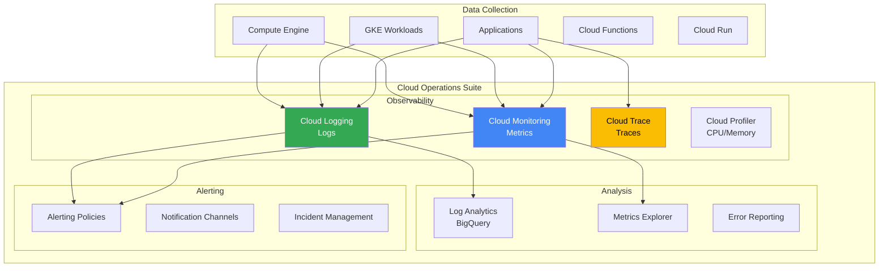
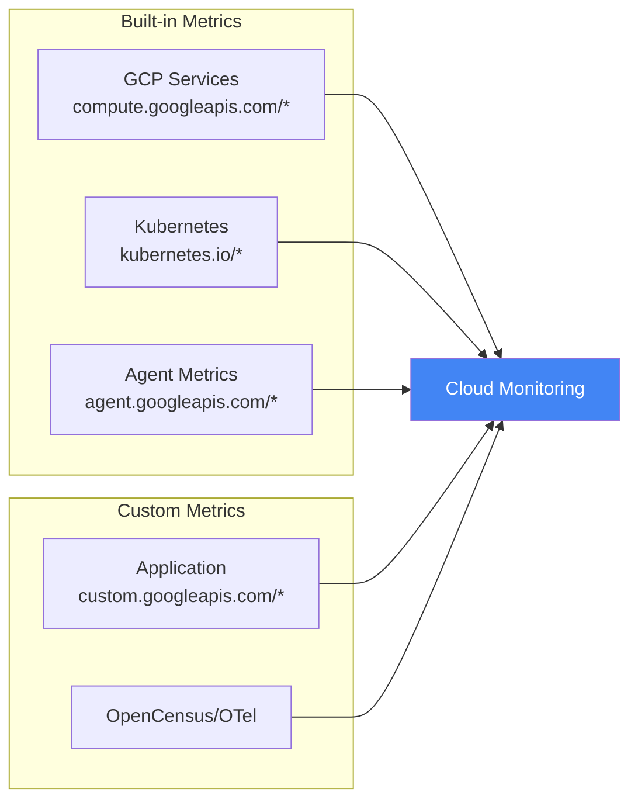
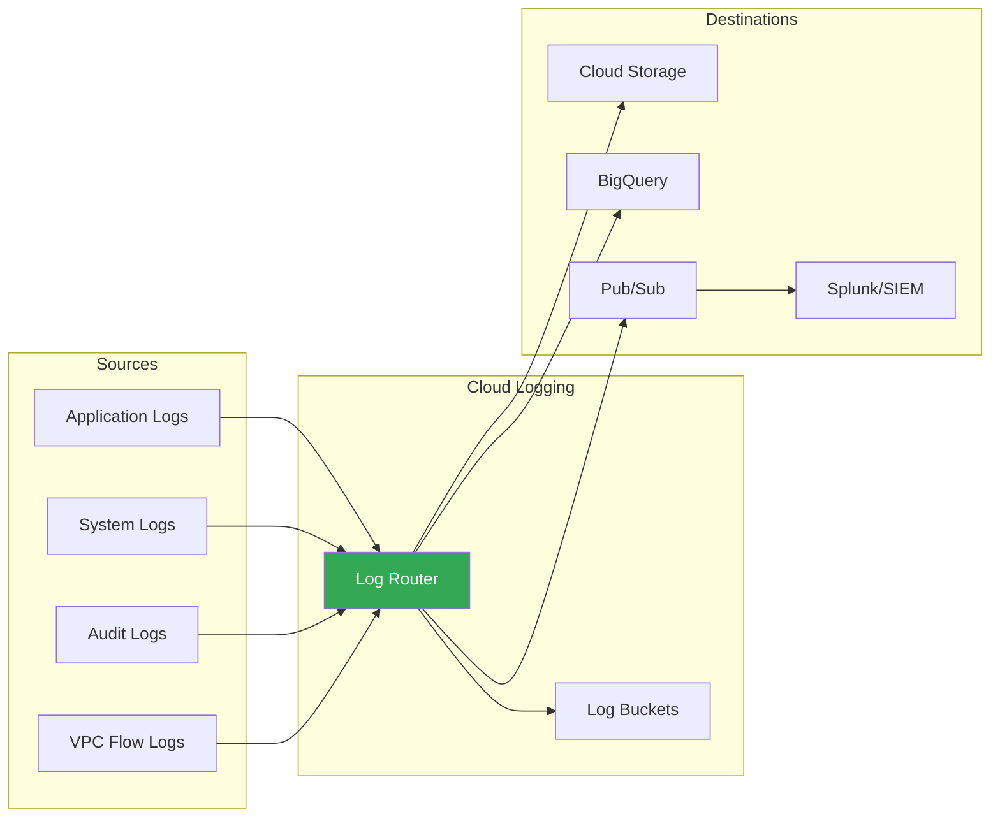
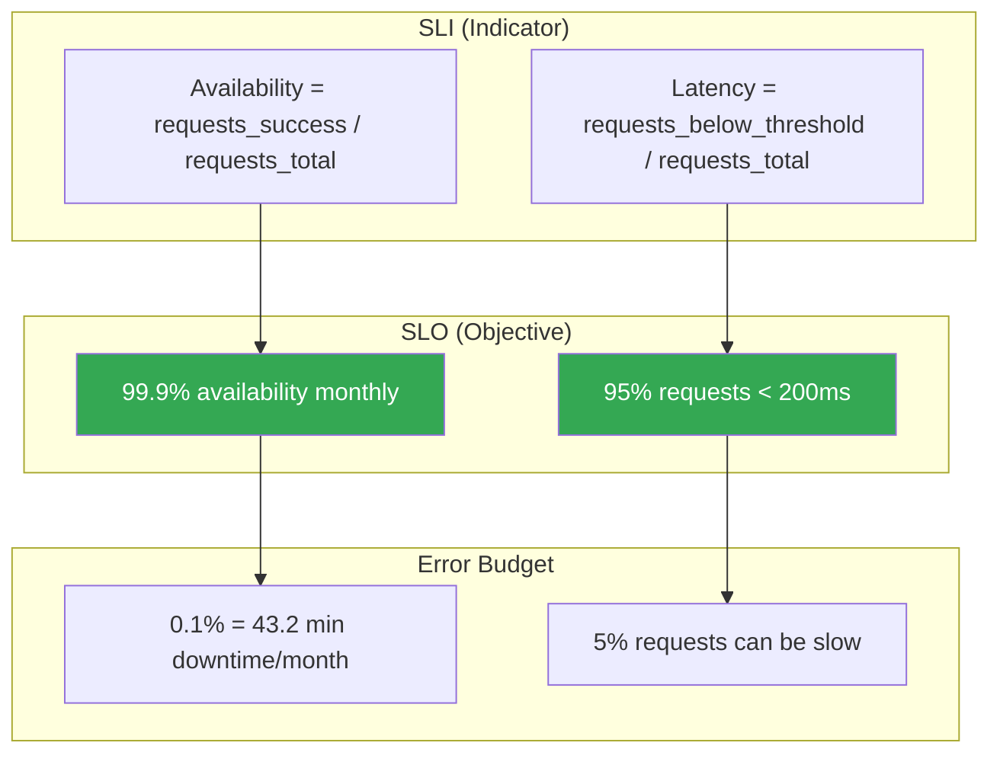

---
tags:
  - formation
  - gcp
  - observability
  - monitoring
  - logging
  - tracing
---

# Module 10 : Observability - Monitoring, Logging & Tracing

## Objectifs du Module

À la fin de ce module, vous serez capable de :

- :material-chart-line: Créer des dashboards et métriques custom avec Cloud Monitoring
- :material-text-box-search: Analyser les logs avec Cloud Logging et Log Analytics
- :material-ray-start-arrow: Implémenter le distributed tracing avec Cloud Trace
- :material-bell-alert: Configurer des alertes et incident management
- :material-finance: Définir et suivre des SLOs (Service Level Objectives)

---

## 1. Cloud Operations Suite

### Vue d'ensemble



### Services Cloud Operations

| Service | Fonction | Équivalent |
|---------|----------|------------|
| **Cloud Monitoring** | Métriques, dashboards, alertes | Datadog, Prometheus/Grafana |
| **Cloud Logging** | Centralisation des logs | ELK Stack, Splunk |
| **Cloud Trace** | Distributed tracing | Jaeger, Zipkin |
| **Cloud Profiler** | Profiling CPU/Memory | Pyroscope |
| **Error Reporting** | Agrégation d'erreurs | Sentry |

---

## 2. Cloud Monitoring

### Types de métriques



### Metrics Explorer

```bash
# Lister les métriques disponibles
gcloud monitoring metrics list --filter="metric.type:compute.googleapis.com"

# Types de métriques courants
# - compute.googleapis.com/instance/cpu/utilization
# - compute.googleapis.com/instance/disk/read_bytes_count
# - loadbalancing.googleapis.com/https/request_count
# - cloudsql.googleapis.com/database/cpu/utilization
# - run.googleapis.com/request_count
# - kubernetes.io/container/cpu/core_usage_time
```

### Métriques custom avec Python

```python
from google.cloud import monitoring_v3
import time

def write_custom_metric(project_id: str, metric_type: str, value: float):
    """Écrire une métrique custom."""
    client = monitoring_v3.MetricServiceClient()
    project_name = f"projects/{project_id}"

    series = monitoring_v3.TimeSeries()
    series.metric.type = f"custom.googleapis.com/{metric_type}"
    series.resource.type = "global"

    now = time.time()
    interval = monitoring_v3.TimeInterval(
        {"end_time": {"seconds": int(now), "nanos": int((now % 1) * 10**9)}}
    )
    point = monitoring_v3.Point({
        "interval": interval,
        "value": {"double_value": value}
    })
    series.points = [point]

    client.create_time_series(
        request={"name": project_name, "time_series": [series]}
    )
    print(f"Wrote {metric_type}={value}")

# Usage
write_custom_metric("my-project", "myapp/orders_processed", 42.0)
```

### Créer un Dashboard

```bash
# Via gcloud (JSON)
cat > dashboard.json << 'EOF'
{
  "displayName": "Application Dashboard",
  "gridLayout": {
    "columns": "2",
    "widgets": [
      {
        "title": "CPU Utilization",
        "xyChart": {
          "dataSets": [{
            "timeSeriesQuery": {
              "timeSeriesFilter": {
                "filter": "metric.type=\"compute.googleapis.com/instance/cpu/utilization\"",
                "aggregation": {
                  "alignmentPeriod": "60s",
                  "perSeriesAligner": "ALIGN_MEAN"
                }
              }
            }
          }]
        }
      },
      {
        "title": "Request Count",
        "xyChart": {
          "dataSets": [{
            "timeSeriesQuery": {
              "timeSeriesFilter": {
                "filter": "metric.type=\"loadbalancing.googleapis.com/https/request_count\"",
                "aggregation": {
                  "alignmentPeriod": "60s",
                  "perSeriesAligner": "ALIGN_RATE"
                }
              }
            }
          }]
        }
      }
    ]
  }
}
EOF

gcloud monitoring dashboards create --config-from-file=dashboard.json
```

### Uptime Checks

```bash
# Créer un uptime check HTTP
gcloud monitoring uptime create my-app-check \
    --display-name="My App Health Check" \
    --resource-type=uptime-url \
    --monitored-resource="host=myapp.example.com" \
    --http-check-path="/health" \
    --http-check-port=443 \
    --use-ssl \
    --period=60 \
    --timeout=10 \
    --content-matchers='{"content": "healthy", "matcher": "CONTAINS_STRING"}'

# Lister les uptime checks
gcloud monitoring uptime list-configs
```

---

## 3. Cloud Logging

### Architecture de logging



### Logging queries

```bash
# Format de filtre de logs
# resource.type="RESOURCE_TYPE"
# logName="projects/PROJECT_ID/logs/LOG_NAME"
# severity>=ERROR
# timestamp>="2024-01-01T00:00:00Z"
# jsonPayload.key="value"

# Exemples de requêtes

# Logs d'erreur des dernières 24h
gcloud logging read 'severity>=ERROR' \
    --limit=100 \
    --format="table(timestamp,resource.type,textPayload)"

# Logs GKE d'un namespace
gcloud logging read 'resource.type="k8s_container" AND resource.labels.namespace_name="production"' \
    --limit=50

# Logs Cloud Run avec un message spécifique
gcloud logging read 'resource.type="cloud_run_revision" AND textPayload:"error"' \
    --limit=20

# Logs d'audit pour création de ressources
gcloud logging read 'logName:"cloudaudit.googleapis.com" AND protoPayload.methodName:"create"'

# Logs avec JSON structuré
gcloud logging read 'jsonPayload.level="error" AND jsonPayload.service="api"'
```

### Log-based metrics

```bash
# Créer une métrique basée sur les logs
gcloud logging metrics create error-count \
    --description="Count of error logs" \
    --log-filter='severity>=ERROR'

# Métrique avec labels
gcloud logging metrics create api-latency \
    --description="API latency from logs" \
    --log-filter='resource.type="cloud_run_revision" AND jsonPayload.latency_ms:*' \
    --value-extractor='EXTRACT(jsonPayload.latency_ms)' \
    --label-extractors='service=EXTRACT(resource.labels.service_name)'

# Lister les métriques
gcloud logging metrics list
```

### Log sinks (export)

```bash
# Sink vers BigQuery
gcloud logging sinks create bq-all-logs \
    bigquery.googleapis.com/projects/$PROJECT_ID/datasets/logs_dataset \
    --log-filter='resource.type="cloud_run_revision"'

# Sink vers Cloud Storage
gcloud logging sinks create gcs-audit-logs \
    storage.googleapis.com/$PROJECT_ID-audit-logs \
    --log-filter='logName:"cloudaudit.googleapis.com"'

# Sink vers Pub/Sub (pour SIEM externe)
gcloud logging sinks create pubsub-security-logs \
    pubsub.googleapis.com/projects/$PROJECT_ID/topics/security-logs \
    --log-filter='severity>=WARNING'

# Important : donner les permissions au service account du sink
SINK_SA=$(gcloud logging sinks describe bq-all-logs --format="get(writerIdentity)")
gcloud projects add-iam-policy-binding $PROJECT_ID \
    --member=$SINK_SA \
    --role=roles/bigquery.dataEditor
```

### Log Analytics (SQL sur les logs)

```sql
-- Dans la Console : Logging > Log Analytics

-- Top 10 des erreurs
SELECT
  TIMESTAMP_TRUNC(timestamp, HOUR) as hour,
  resource.type,
  COUNT(*) as error_count
FROM `PROJECT_ID.global._Default._AllLogs`
WHERE severity = 'ERROR'
  AND timestamp > TIMESTAMP_SUB(CURRENT_TIMESTAMP(), INTERVAL 24 HOUR)
GROUP BY hour, resource.type
ORDER BY error_count DESC
LIMIT 10;

-- Latence P50, P95, P99 par service
SELECT
  JSON_VALUE(jsonPayload, '$.service') as service,
  APPROX_QUANTILES(CAST(JSON_VALUE(jsonPayload, '$.latency_ms') AS FLOAT64), 100)[OFFSET(50)] as p50,
  APPROX_QUANTILES(CAST(JSON_VALUE(jsonPayload, '$.latency_ms') AS FLOAT64), 100)[OFFSET(95)] as p95,
  APPROX_QUANTILES(CAST(JSON_VALUE(jsonPayload, '$.latency_ms') AS FLOAT64), 100)[OFFSET(99)] as p99
FROM `PROJECT_ID.global._Default._AllLogs`
WHERE JSON_VALUE(jsonPayload, '$.latency_ms') IS NOT NULL
GROUP BY service;
```

---

## 4. Cloud Trace

### Instrumentation automatique

```bash
# Cloud Run et Cloud Functions ont le tracing automatique activé
# Pour GKE, utiliser OpenTelemetry
```

### Instrumentation manuelle (Python)

```python
from opentelemetry import trace
from opentelemetry.exporter.cloud_trace import CloudTraceSpanExporter
from opentelemetry.sdk.trace import TracerProvider
from opentelemetry.sdk.trace.export import BatchSpanProcessor

# Setup
tracer_provider = TracerProvider()
cloud_trace_exporter = CloudTraceSpanExporter()
tracer_provider.add_span_processor(BatchSpanProcessor(cloud_trace_exporter))
trace.set_tracer_provider(tracer_provider)

tracer = trace.get_tracer(__name__)

# Usage dans le code
def process_order(order_id: str):
    with tracer.start_as_current_span("process_order") as span:
        span.set_attribute("order.id", order_id)

        # Sous-span pour l'appel DB
        with tracer.start_as_current_span("db_query") as db_span:
            db_span.set_attribute("db.operation", "SELECT")
            # ... query database

        # Sous-span pour l'appel API externe
        with tracer.start_as_current_span("external_api") as api_span:
            api_span.set_attribute("http.url", "https://api.example.com")
            # ... call API

        return {"status": "processed"}
```

### Analyser les traces

```bash
# Via Console : Trace > Trace list
# Filtres disponibles :
# - Service name
# - Span name
# - Latency (min/max)
# - Status (OK, ERROR)
# - Time range

# API pour récupérer les traces
gcloud trace traces list --limit=10 --format=json
```

---

## 5. Alerting

### Créer une politique d'alerte

```bash
# Alerte CPU > 80%
cat > cpu-alert.yaml << 'EOF'
displayName: "High CPU Alert"
combiner: OR
conditions:
- displayName: "CPU > 80%"
  conditionThreshold:
    filter: 'metric.type="compute.googleapis.com/instance/cpu/utilization"'
    comparison: COMPARISON_GT
    thresholdValue: 0.8
    duration: 300s
    aggregations:
    - alignmentPeriod: 60s
      perSeriesAligner: ALIGN_MEAN
notificationChannels:
- projects/PROJECT_ID/notificationChannels/CHANNEL_ID
documentation:
  content: |
    CPU utilization exceeded 80% for 5 minutes.
    Check the instance and consider scaling.
  mimeType: text/markdown
EOF

gcloud alpha monitoring policies create --policy-from-file=cpu-alert.yaml
```

### Notification Channels

```bash
# Créer un channel email
gcloud alpha monitoring channels create \
    --display-name="Ops Team Email" \
    --type=email \
    --channel-labels=email_address=ops@company.com

# Créer un channel Slack
gcloud alpha monitoring channels create \
    --display-name="Slack Alerts" \
    --type=slack \
    --channel-labels=channel_name=#alerts

# Créer un channel PagerDuty
gcloud alpha monitoring channels create \
    --display-name="PagerDuty" \
    --type=pagerduty \
    --channel-labels=service_key=YOUR_SERVICE_KEY

# Lister les channels
gcloud alpha monitoring channels list
```

### Alertes multi-conditions

```yaml
# Alerte composite : CPU ET Memory élevés
displayName: "Resource Pressure Alert"
combiner: AND
conditions:
- displayName: "CPU > 80%"
  conditionThreshold:
    filter: 'metric.type="compute.googleapis.com/instance/cpu/utilization"'
    comparison: COMPARISON_GT
    thresholdValue: 0.8
    duration: 300s
- displayName: "Memory > 90%"
  conditionThreshold:
    filter: 'metric.type="agent.googleapis.com/memory/percent_used"'
    comparison: COMPARISON_GT
    thresholdValue: 90
    duration: 300s
```

---

## 6. SLOs (Service Level Objectives)

### Concepts SRE



### Créer un SLO

```bash
# Via gcloud
cat > slo.yaml << 'EOF'
displayName: "API Availability SLO"
serviceLevelIndicator:
  basicSli:
    availability: {}
goal: 0.999  # 99.9%
rollingPeriod: 2592000s  # 30 days
EOF

# Créer d'abord un service
gcloud monitoring services create api-service \
    --display-name="API Service"

# Puis le SLO
gcloud monitoring slos create \
    --service=api-service \
    --slo-id=availability-slo \
    --config-from-file=slo.yaml
```

### Alerte sur Error Budget

```yaml
# Alerte quand 50% du budget est consommé
displayName: "Error Budget Alert - 50%"
conditions:
- displayName: "Error Budget Burn Rate"
  conditionThreshold:
    filter: 'select_slo_burn_rate("projects/PROJECT_ID/services/api-service/serviceLevelObjectives/availability-slo")'
    comparison: COMPARISON_GT
    thresholdValue: 2  # 2x burn rate = budget épuisé en 15 jours
    duration: 3600s
```

---

## 7. Exercices Pratiques

### Exercice 1 : Dashboard de monitoring

!!! example "Exercice"
    Créez un dashboard avec :

    1. CPU utilization de toutes les VMs
    2. Request count d'un Load Balancer
    3. Error rate (logs-based metric)
    4. Un uptime check

??? quote "Solution"
    ```bash
    # 1. Dashboard JSON
    cat > my-dashboard.json << 'EOF'
    {
      "displayName": "Training Dashboard",
      "gridLayout": {
        "columns": "2",
        "widgets": [
          {
            "title": "VM CPU Utilization",
            "xyChart": {
              "dataSets": [{
                "timeSeriesQuery": {
                  "timeSeriesFilter": {
                    "filter": "metric.type=\"compute.googleapis.com/instance/cpu/utilization\"",
                    "aggregation": {
                      "alignmentPeriod": "60s",
                      "perSeriesAligner": "ALIGN_MEAN",
                      "crossSeriesReducer": "REDUCE_MEAN",
                      "groupByFields": ["resource.label.instance_id"]
                    }
                  }
                }
              }]
            }
          },
          {
            "title": "Load Balancer Requests",
            "xyChart": {
              "dataSets": [{
                "timeSeriesQuery": {
                  "timeSeriesFilter": {
                    "filter": "metric.type=\"loadbalancing.googleapis.com/https/request_count\"",
                    "aggregation": {
                      "alignmentPeriod": "60s",
                      "perSeriesAligner": "ALIGN_RATE"
                    }
                  }
                }
              }]
            }
          }
        ]
      }
    }
    EOF

    gcloud monitoring dashboards create --config-from-file=my-dashboard.json

    # 2. Log-based metric pour error rate
    gcloud logging metrics create app-errors \
        --description="Application error count" \
        --log-filter='severity>=ERROR AND resource.type="cloud_run_revision"'

    # 3. Uptime check (si vous avez un endpoint)
    # gcloud monitoring uptime create health-check \
    #     --display-name="Health Check" \
    #     --resource-type=uptime-url \
    #     --monitored-resource="host=myapp.run.app" \
    #     --http-check-path="/health"
    ```

### Exercice 2 : Alertes et notifications

!!! example "Exercice"
    1. Créez un notification channel email
    2. Créez une alerte pour CPU > 70% pendant 5 minutes
    3. Testez en générant de la charge

??? quote "Solution"
    ```bash
    # Notification channel
    gcloud alpha monitoring channels create \
        --display-name="Training Email" \
        --type=email \
        --channel-labels=email_address=your-email@example.com

    # Récupérer l'ID du channel
    CHANNEL_ID=$(gcloud alpha monitoring channels list \
        --filter="displayName='Training Email'" \
        --format="value(name)")

    # Créer l'alerte
    cat > cpu-alert.yaml << EOF
    displayName: "Training - High CPU"
    combiner: OR
    conditions:
    - displayName: "CPU > 70%"
      conditionThreshold:
        filter: 'metric.type="compute.googleapis.com/instance/cpu/utilization"'
        comparison: COMPARISON_GT
        thresholdValue: 0.7
        duration: 300s
        aggregations:
        - alignmentPeriod: 60s
          perSeriesAligner: ALIGN_MEAN
    notificationChannels:
    - $CHANNEL_ID
    EOF

    gcloud alpha monitoring policies create --policy-from-file=cpu-alert.yaml

    # Pour tester, créer une VM et générer de la charge
    # gcloud compute instances create stress-test --machine-type=e2-small
    # gcloud compute ssh stress-test -- "stress-ng --cpu 2 --timeout 600s"
    ```

### Exercice 3 : Log Analytics

!!! example "Exercice"
    Écrivez des requêtes SQL dans Log Analytics pour :

    1. Compter les erreurs par heure sur les dernières 24h
    2. Identifier les top 5 sources d'erreurs
    3. Calculer le temps moyen entre les erreurs

??? quote "Solution"
    ```sql
    -- 1. Erreurs par heure
    SELECT
      TIMESTAMP_TRUNC(timestamp, HOUR) as hour,
      COUNT(*) as error_count
    FROM `PROJECT_ID.global._Default._AllLogs`
    WHERE severity = 'ERROR'
      AND timestamp > TIMESTAMP_SUB(CURRENT_TIMESTAMP(), INTERVAL 24 HOUR)
    GROUP BY hour
    ORDER BY hour;

    -- 2. Top 5 sources d'erreurs
    SELECT
      resource.type,
      resource.labels.service_name,
      COUNT(*) as error_count
    FROM `PROJECT_ID.global._Default._AllLogs`
    WHERE severity = 'ERROR'
      AND timestamp > TIMESTAMP_SUB(CURRENT_TIMESTAMP(), INTERVAL 24 HOUR)
    GROUP BY resource.type, resource.labels.service_name
    ORDER BY error_count DESC
    LIMIT 5;

    -- 3. Temps moyen entre erreurs (MTBF)
    WITH errors AS (
      SELECT timestamp
      FROM `PROJECT_ID.global._Default._AllLogs`
      WHERE severity = 'ERROR'
        AND timestamp > TIMESTAMP_SUB(CURRENT_TIMESTAMP(), INTERVAL 24 HOUR)
      ORDER BY timestamp
    ),
    error_gaps AS (
      SELECT
        TIMESTAMP_DIFF(timestamp, LAG(timestamp) OVER (ORDER BY timestamp), SECOND) as gap_seconds
      FROM errors
    )
    SELECT
      AVG(gap_seconds) as avg_mtbf_seconds,
      AVG(gap_seconds) / 60 as avg_mtbf_minutes
    FROM error_gaps
    WHERE gap_seconds IS NOT NULL;
    ```

---

## Exercice : À Vous de Jouer

!!! example "Mise en Pratique"
    **Objectif** : Implémenter une solution d'observabilité complète avec monitoring, logging, tracing et alerting

    **Contexte** : Vous gérez une application en production et devez mettre en place une observabilité complète. Vous devez créer des dashboards personnalisés, des alertes pertinentes, des SLOs pour mesurer la fiabilité, et analyser les logs avec Log Analytics.

    **Tâches à réaliser** :

    1. Créer un dashboard Cloud Monitoring avec 4 widgets :
        - CPU utilization de toutes les VMs
        - Request count du Load Balancer
        - Error rate (log-based metric)
        - Latence P95 du backend
    2. Créer une log-based metric `http-errors` comptant les erreurs 5xx
    3. Créer une log-based metric `api-latency` pour la latence P50/P95/P99
    4. Créer 3 notification channels :
        - Email pour l'équipe ops
        - Slack/PagerDuty pour les alertes critiques (simulation)
        - SMS pour les incidents majeurs (simulation)
    5. Créer 3 alerting policies :
        - CPU > 80% pendant 5 minutes
        - Error rate > 5% pendant 2 minutes
        - Latency P95 > 1000ms pendant 3 minutes
    6. Créer un SLO pour disponibilité (99.9% sur 30 jours)
    7. Configurer un uptime check sur une URL publique
    8. Écrire 3 requêtes Log Analytics :
        - Top 10 erreurs des dernières 24h
        - Latence par service (P50, P95, P99)
        - Temps moyen entre erreurs (MTBF)

    **Critères de validation** :

    - [ ] Dashboard créé avec les 4 widgets fonctionnels
    - [ ] Les log-based metrics collectent les données
    - [ ] Les 3 notification channels sont configurés
    - [ ] Les 3 alerting policies sont actives
    - [ ] Le SLO est configuré et mesure correctement
    - [ ] L'uptime check fonctionne
    - [ ] Les 3 requêtes Log Analytics retournent des résultats
    - [ ] Documentation des seuils d'alerte et justification

??? quote "Solution"
    ```bash
    # Variables
    PROJECT_ID=$(gcloud config get-value project)
    REGION="europe-west1"

    # 1. Log-based metrics
    # Metric pour erreurs HTTP 5xx
    gcloud logging metrics create http-errors \
        --description="Count of HTTP 5xx errors" \
        --log-filter='severity>=ERROR AND httpRequest.status>=500'

    # Metric pour latence API
    gcloud logging metrics create api-latency \
        --description="API latency distribution" \
        --log-filter='resource.type="cloud_run_revision" AND jsonPayload.latency_ms:*' \
        --value-extractor='EXTRACT(jsonPayload.latency_ms)' \
        --metric-kind=DELTA \
        --value-type=DISTRIBUTION

    # 2. Notification Channels
    # Email
    gcloud alpha monitoring channels create \
        --display-name="Ops Team Email" \
        --type=email \
        --channel-labels=email_address=ops-team@example.com

    # Récupérer les IDs
    EMAIL_CHANNEL=$(gcloud alpha monitoring channels list \
        --filter="displayName='Ops Team Email'" \
        --format="value(name)")

    # 3. Alerting Policies

    # Alerte CPU
    cat > cpu-alert.yaml << EOF
    displayName: "High CPU Alert - Production"
    combiner: OR
    conditions:
    - displayName: "CPU > 80% for 5 minutes"
      conditionThreshold:
        filter: 'metric.type="compute.googleapis.com/instance/cpu/utilization"'
        comparison: COMPARISON_GT
        thresholdValue: 0.8
        duration: 300s
        aggregations:
        - alignmentPeriod: 60s
          perSeriesAligner: ALIGN_MEAN
    notificationChannels:
    - $EMAIL_CHANNEL
    documentation:
      content: |
        ## Action requise
        CPU utilization a dépassé 80% pendant 5 minutes.

        **Étapes de diagnostic:**
        1. Vérifier les processus avec \`top\`
        2. Analyser les logs d'application
        3. Considérer le scaling horizontal

        **Runbook:** https://wiki.example.com/runbooks/high-cpu
      mimeType: text/markdown
    EOF

    gcloud alpha monitoring policies create --policy-from-file=cpu-alert.yaml

    # Alerte Error Rate
    cat > error-rate-alert.yaml << EOF
    displayName: "High Error Rate Alert"
    combiner: OR
    conditions:
    - displayName: "Error rate > 5%"
      conditionThreshold:
        filter: 'metric.type="logging.googleapis.com/user/http-errors"'
        comparison: COMPARISON_GT
        thresholdValue: 5
        duration: 120s
        aggregations:
        - alignmentPeriod: 60s
          perSeriesAligner: ALIGN_RATE
    notificationChannels:
    - $EMAIL_CHANNEL
    documentation:
      content: |
        ## Taux d'erreurs élevé
        Plus de 5% des requêtes sont en erreur.

        **Actions immédiates:**
        1. Vérifier le dashboard des erreurs
        2. Analyser les logs dans Log Explorer
        3. Contacter l'équipe de développement si nécessaire
      mimeType: text/markdown
    EOF

    gcloud alpha monitoring policies create --policy-from-file=error-rate-alert.yaml

    # 4. Dashboard
    cat > dashboard.json << 'EOF'
    {
      "displayName": "Production Monitoring Dashboard",
      "gridLayout": {
        "columns": "2",
        "widgets": [
          {
            "title": "VM CPU Utilization",
            "xyChart": {
              "dataSets": [{
                "timeSeriesQuery": {
                  "timeSeriesFilter": {
                    "filter": "metric.type=\"compute.googleapis.com/instance/cpu/utilization\"",
                    "aggregation": {
                      "alignmentPeriod": "60s",
                      "perSeriesAligner": "ALIGN_MEAN",
                      "crossSeriesReducer": "REDUCE_MEAN",
                      "groupByFields": ["resource.instance_id"]
                    }
                  }
                }
              }],
              "yAxis": {"scale": "LINEAR"}
            }
          },
          {
            "title": "Load Balancer Requests",
            "xyChart": {
              "dataSets": [{
                "timeSeriesQuery": {
                  "timeSeriesFilter": {
                    "filter": "metric.type=\"loadbalancing.googleapis.com/https/request_count\"",
                    "aggregation": {
                      "alignmentPeriod": "60s",
                      "perSeriesAligner": "ALIGN_RATE"
                    }
                  }
                }
              }]
            }
          },
          {
            "title": "Error Rate",
            "xyChart": {
              "dataSets": [{
                "timeSeriesQuery": {
                  "timeSeriesFilter": {
                    "filter": "metric.type=\"logging.googleapis.com/user/http-errors\"",
                    "aggregation": {
                      "alignmentPeriod": "60s",
                      "perSeriesAligner": "ALIGN_RATE"
                    }
                  }
                }
              }]
            }
          },
          {
            "title": "API Latency P95",
            "xyChart": {
              "dataSets": [{
                "timeSeriesQuery": {
                  "timeSeriesFilter": {
                    "filter": "metric.type=\"logging.googleapis.com/user/api-latency\"",
                    "aggregation": {
                      "alignmentPeriod": "60s",
                      "perSeriesAligner": "ALIGN_DELTA",
                      "crossSeriesReducer": "REDUCE_PERCENTILE_95"
                    }
                  }
                }
              }]
            }
          }
        ]
      }
    }
    EOF

    gcloud monitoring dashboards create --config-from-file=dashboard.json

    # 5. Uptime Check
    gcloud monitoring uptime create prod-uptime-check \
        --display-name="Production App Health" \
        --resource-type=uptime-url \
        --monitored-resource="host=example.com" \
        --http-check-path="/health" \
        --http-check-port=443 \
        --use-ssl \
        --period=60 \
        --timeout=10

    # 6. SLO
    # Créer un service
    gcloud monitoring services create prod-api \
        --display-name="Production API"

    # Créer le SLO
    cat > slo.yaml << 'EOF'
    displayName: "API Availability SLO - 99.9%"
    serviceLevelIndicator:
      basicSli:
        availability: {}
    goal: 0.999
    rollingPeriod: 2592000s  # 30 days
    EOF

    gcloud monitoring slos create \
        --service=prod-api \
        --slo-id=availability-slo \
        --config-from-file=slo.yaml

    # 7. Log Analytics Queries
    echo "=== LOG ANALYTICS QUERIES ==="

    # Query 1: Top 10 erreurs
    cat > query-top-errors.sql << 'SQL'
    SELECT
      TIMESTAMP_TRUNC(timestamp, HOUR) as hour,
      jsonPayload.error as error_type,
      COUNT(*) as error_count
    FROM `PROJECT_ID.global._Default._AllLogs`
    WHERE severity = 'ERROR'
      AND timestamp > TIMESTAMP_SUB(CURRENT_TIMESTAMP(), INTERVAL 24 HOUR)
    GROUP BY hour, error_type
    ORDER BY error_count DESC
    LIMIT 10;
    SQL

    # Query 2: Latence par service
    cat > query-latency.sql << 'SQL'
    SELECT
      resource.labels.service_name as service,
      APPROX_QUANTILES(CAST(jsonPayload.latency_ms AS FLOAT64), 100)[OFFSET(50)] as p50,
      APPROX_QUANTILES(CAST(jsonPayload.latency_ms AS FLOAT64), 100)[OFFSET(95)] as p95,
      APPROX_QUANTILES(CAST(jsonPayload.latency_ms AS FLOAT64), 100)[OFFSET(99)] as p99
    FROM `PROJECT_ID.global._Default._AllLogs`
    WHERE jsonPayload.latency_ms IS NOT NULL
      AND timestamp > TIMESTAMP_SUB(CURRENT_TIMESTAMP(), INTERVAL 1 HOUR)
    GROUP BY service
    ORDER BY p95 DESC;
    SQL

    # Query 3: MTBF (Mean Time Between Failures)
    cat > query-mtbf.sql << 'SQL'
    WITH errors AS (
      SELECT timestamp
      FROM `PROJECT_ID.global._Default._AllLogs`
      WHERE severity = 'ERROR'
        AND timestamp > TIMESTAMP_SUB(CURRENT_TIMESTAMP(), INTERVAL 24 HOUR)
      ORDER BY timestamp
    ),
    error_gaps AS (
      SELECT
        TIMESTAMP_DIFF(timestamp, LAG(timestamp) OVER (ORDER BY timestamp), SECOND) as gap_seconds
      FROM errors
    )
    SELECT
      AVG(gap_seconds) as avg_mtbf_seconds,
      AVG(gap_seconds) / 60 as avg_mtbf_minutes,
      AVG(gap_seconds) / 3600 as avg_mtbf_hours
    FROM error_gaps
    WHERE gap_seconds IS NOT NULL;
    SQL

    # Validation
    echo "=== VALIDATION ==="
    echo ""
    echo "1. Dashboards:"
    gcloud monitoring dashboards list --format="table(name,displayName)"

    echo ""
    echo "2. Alerting Policies:"
    gcloud alpha monitoring policies list --format="table(name,displayName,enabled)"

    echo ""
    echo "3. Notification Channels:"
    gcloud alpha monitoring channels list --format="table(name,displayName,type)"

    echo ""
    echo "4. SLOs:"
    gcloud monitoring slos list --service=prod-api --format="table(name,displayName,goal)"

    echo ""
    echo "5. Uptime Checks:"
    gcloud monitoring uptime list-configs --format="table(name,displayName)"

    echo ""
    echo "✅ Observabilité complète configurée!"
    echo ""
    echo "📊 Dashboard URL:"
    echo "https://console.cloud.google.com/monitoring/dashboards?project=$PROJECT_ID"
    ```

---

## 8. Nettoyage

```bash
# Dashboards
gcloud monitoring dashboards list --format="value(name)" | while read d; do
    gcloud monitoring dashboards delete $d --quiet
done

# Alerting policies
gcloud alpha monitoring policies list --format="value(name)" | while read p; do
    gcloud alpha monitoring policies delete $p --quiet
done

# Notification channels
gcloud alpha monitoring channels list --format="value(name)" | while read c; do
    gcloud alpha monitoring channels delete $c --quiet
done

# Log-based metrics
gcloud logging metrics delete app-errors --quiet

# Uptime checks
gcloud monitoring uptime delete-config health-check --quiet
```

---

## Résumé du Module

| Concept | Points clés |
|---------|-------------|
| **Cloud Monitoring** | Métriques, dashboards, uptime checks |
| **Cloud Logging** | Log Router, sinks, Log Analytics (SQL) |
| **Cloud Trace** | Distributed tracing, OpenTelemetry |
| **Alerting** | Policies, notification channels, conditions |
| **SLOs** | SLI, SLO, Error Budget |

### Les 4 Golden Signals

| Signal | Métrique GCP |
|--------|--------------|
| **Latency** | `loadbalancing.googleapis.com/https/backend_latencies` |
| **Traffic** | `loadbalancing.googleapis.com/https/request_count` |
| **Errors** | `loadbalancing.googleapis.com/https/request_count` (filtered by response_code) |
| **Saturation** | `compute.googleapis.com/instance/cpu/utilization` |

---

**[← Retour au Module 9](09-module.md)** | **[Retour au TP Final](06-tp-final.md)**

---

**Retour au :** [Programme de la Formation](index.md) | [Catalogue des Formations](../index.md)

---

## Navigation

| | |
|:---|---:|
| [← Module 9 : Sécurité - Cloud Armor, Se...](09-module.md) | [Programme →](index.md) |

[Retour au Programme](index.md){ .md-button }
