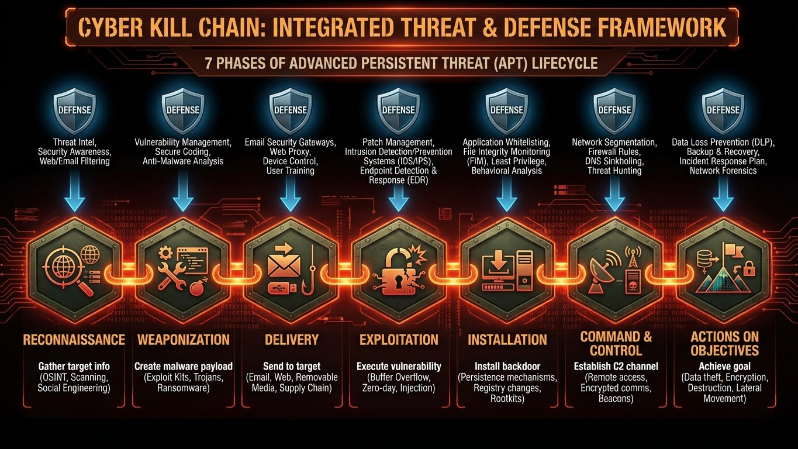

---
tags:
  - formation
  - hacking
  - kali
  - legal
  - lab
  - security
---

# Module 1 : Mindset, Légalité & Lab

Avant de lancer la moindre commande, il faut comprendre où on met les pieds. Le hacking n'est pas un jeu, c'est une discipline encadrée.

## 1. Le Cadre Légal (France)

### Articles du Code Pénal (Godet)
*   **323-1** : Accès ou maintien frauduleux dans un STAD (Système de Traitement Automatisé de Données).
    *   *Risque* : 2 ans de prison, 60 000€ d'amende.
*   **323-2** : Entrave au fonctionnement (DDoS, suppression de fichiers).
*   **323-3** : Extraction ou modification de données (Vol de BDD).

### La Règle d'Or
**JAMAIS** d'intrusion sans **autorisation écrite préalable** (Contrat de mandat) du propriétaire du système.
*   Scanner le site de votre entreprise sans accord = Faute grave (Licenciement).
*   Scanner Google/Facebook = Illégal (sauf programme Bug Bounty).

---

## 2. Le Lab du Hacker

Pour s'entraîner sans aller en prison, on construit un laboratoire isolé.

### L'Attaquant : Kali Linux
La distribution standard. Elle contient tous les outils pré-installés.
*   **VirtualBox / VMWare** : Recommandé (snapshot possible).
*   **WSL2** : Possible (avec Win-KeX), mais gestion réseau (wifi/raw sockets) parfois complexe.
*   **Live USB** : Pour le physique (Persistence possible).

### Les Victimes (Targets)
Ne testez pas sur votre PC hôte ! Utilisez des machines volontairement vulnérables.
*   **Metasploitable 2/3** : Linux bourré de failles.
*   **DVWA (Damn Vulnerable Web App)** : Pour le Web.
*   **OWASP Juice Shop** : E-commerce moderne vulnérable.
*   **Active Directory Lab** : Windows Server (Eval 180 jours) + 2 Windows 10.

### Isolement Réseau
Vos VMs doivent être en **Réseau Host-Only** (Privé hôte) ou **NAT Network** isolé.
*   Ne jamais exposer une VM vulnérable (Metasploitable) sur Internet (Pont/Bridge) !

---

## 3. Outils Fondamentaux

### Terminologie
*   **White Hat** : Hacker éthique (Défenseur/Auditeur).
*   **Black Hat** : Cybercriminel.
*   **Grey Hat** : Entre les deux (divulgue des failles sans autorisation).
*   **Script Kiddie** : Débutant qui lance des outils sans comprendre.

### Le Cycle d'Attaque (Kill Chain)

1.  **Reconnaissance** (OSINT, Scan).
2.  **Weaponization** (Préparer l'exploit/payload).
3.  **Delivery** (Envoyer le mail, accéder au port).
4.  **Exploitation** (Exécuter le code).
5.  **Installation** (Persistance, Backdoor).
6.  **C2 (Command & Control)** : Prendre le contrôle à distance.
7.  **Actions** : Vol de données, chiffrement.

---

## Navigation

| | |
|:---|---:|
| [← Programme](index.md) | [Module 2 : Reconnaissance & Réseau →](02-module.md) |

[Retour au Programme](index.md){ .md-button }
