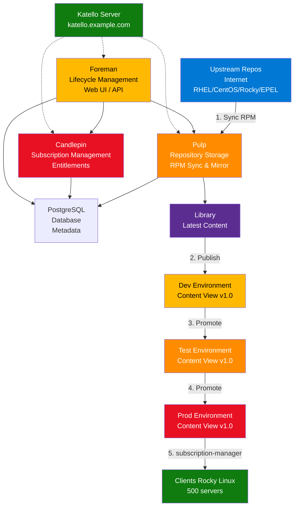

# Module 1 : Architecture & Installation Katello

!!! info "Objectifs du module"
    - 🏗️ Comprendre l'architecture Katello (Foreman, Pulp, Candlepin, Smart Proxies)
    - 💾 Connaître les prérequis matériels et logiciels
    - 💻 Installer Katello sur Rocky Linux 9
    - 🔧 Configurer le firewall et SELinux
    - ✅ Valider l'installation et accéder à l'interface Web

---

## 📘 Concept : La Stack Katello

### ⚠️ Stop running `yum update` manually

**Scénario problématique** (Infrastructure de 500 serveurs RHEL/Rocky Linux) :

> **Le problème** : Chaque administrateur exécute `yum update` manuellement sur ses serveurs.
>
> ❌ **Inconvénients** :
> - **Aucun contrôle de version** : Le serveur Dev a kernel 5.14.0-400, Prod a 5.14.0-362 (incohérence)
> - **Pas de test avant Prod** : Une mise à jour défectueuse casse directement la production
> - **Bande passante saturée** : 500 serveurs × 200 MB de mises à jour/mois = **100 GB** téléchargés depuis Internet
> - **Pas de reporting** : Impossible de savoir quels serveurs sont patchés ou vulnérables (CVE)
> - **Pas de rollback** : Si un kernel plante, impossible de revenir en arrière facilement

**La solution : Katello** 🦁

Katello est une solution **open source** de gestion du cycle de vie des contenus Linux (équivalent de **Red Hat Satellite 6**).

✅ **Avantages** :
- **Centralisation** : 1 seul serveur synchronise les repos upstream → redistribue en interne
- **Lifecycle Management** : Dev → Test → Prod (promotion contrôlée)
- **Content Views** : Snapshots versionnés de repos (ex: "Rocky-9-Base-v1.2")
- **Errata Management** : Suivi des CVE et application ciblée
- **Économie de bande passante** : Téléchargement unique + distribution LAN
- **Reporting** : Dashboard de conformité (% serveurs patchés)

---

### 🏗️ Architecture : Les Composants

Katello est une **stack** de 4 composants principaux :



---

#### 1️⃣ Foreman (Lifecycle Management)

**Rôle** : Gestion du cycle de vie des contenus et des hôtes.

- 🌐 **Interface Web** : Dashboard, gestion des hôtes, rapports
- 🔄 **Lifecycle Environments** : Library → Dev → Test → Prod
- 📊 **Reporting** : Conformité, errata applicables, packages obsolètes
- 🤖 **Remote Execution** : Lancer des commandes sur les clients (via SSH)
- 📡 **Provisioning** : Déployer des OS (PXE, Kickstart) - optionnel

**URL** : `https://katello.example.com` (port 443)

---

#### 2️⃣ Pulp (Repository Storage)

**Rôle** : Synchronisation et stockage des repos RPM.

- 🔄 **Sync** : Télécharge les RPM depuis les repos upstream (mirror local)
- 📦 **Storage** : Stocke les packages RPM sur disque (`/var/lib/pulp`)
- 🌐 **Publication** : Expose les repos via HTTP pour les clients
- 🔐 **Checksums** : Vérifie l'intégrité des RPM (SHA256)

**Stockage typique** : 100-500 GB pour RHEL/Rocky complet (BaseOS + AppStream + EPEL)

---

#### 3️⃣ Candlepin (Subscription Management)

**Rôle** : Gestion des abonnements et entitlements (équivalent Red Hat CDN pour Satellite).

- 🔑 **Activation Keys** : Clés pour enregistrer automatiquement les clients
- 📜 **Subscriptions** : Associer des repos à des hôtes (via Content Views)
- 👥 **Host Collections** : Groupes d'hôtes pour actions en masse

**Note** : Pour Rocky Linux (gratuit), Candlepin gère les "pseudo-subscriptions" (pas de licence payante).

---

#### 4️⃣ PostgreSQL (Database)

**Rôle** : Stockage des métadonnées (hôtes, repos, errata, etc.).

- 📊 Taille typique : 10-50 GB selon le nombre de repos et d'hôtes
- 🔧 Optimisations : Tuning recommandé pour >1000 hôtes

---

### 🌍 Workflow : De l'Upstream à la Production

**Étapes** :

1. **Sync** : Katello synchronise les repos upstream (ex: Rocky Linux BaseOS)
2. **Library** : Les RPM sont stockés dans l'environnement "Library" (dernière version)
3. **Content View** : L'admin crée une Content View "Rocky-9-Base" (snapshot de repos)
4. **Publish** : La Content View est publiée (version 1.0)
5. **Promote Dev** : La version 1.0 est promue dans l'environnement "Dev"
6. **Tests** : Les serveurs Dev testent les mises à jour pendant 48h
7. **Promote Test** : Si OK, promotion vers "Test" (validation pre-prod)
8. **Promote Prod** : Si OK, promotion vers "Prod" (déploiement final)
9. **Installation** : Les clients exécutent `yum update` (récupèrent depuis Katello, pas Internet)

**💡 Avantage** : Chaque environnement a une **version figée** des repos. Prod ne change pas tant que l'admin ne le décide pas.

---

## 💻 Pratique : Installation sur Rocky Linux 9

### 📋 Prérequis matériels

!!! warning "It's heavy!"
    Katello est une stack **gourmande en ressources**. Ne sous-estimez pas les besoins matériels.

**Ressources minimales** :

| Composant | Minimum | Recommandé |
|-----------|---------|------------|
| **CPU** | 4 vCPU | 8 vCPU |
| **RAM** | 16 GB | 32 GB |
| **Disk** | 200 GB | 500 GB+ (selon nb de repos) |
| **OS** | Rocky Linux 9 | Rocky Linux 9.3+ |

**Disk Layout recommandé** :

- `/` : 50 GB (OS)
- `/var/lib/pulp` : 300+ GB (stockage RPM)
- `/var/lib/pgsql` : 50 GB (PostgreSQL)
- Swap : 8 GB

**💡 Conseil** : Utilisez un volume LVM pour `/var/lib/pulp` (facile à étendre).

---

### 🖥️ Prérequis système

```bash
# Vérifier le hostname (FQDN obligatoire)
hostnamectl
# Output attendu : katello.example.com

# Si incorrect, configurer le FQDN
hostnamectl set-hostname katello.example.com

# Vérifier la résolution DNS
ping -c 2 katello.example.com
# Doit résoudre vers l'IP du serveur (ex: 192.168.1.10)

# Ajouter dans /etc/hosts si DNS non configuré
echo "192.168.1.10 katello.example.com katello" >> /etc/hosts

# Vérifier les ressources
free -h
# Total memory : >= 16 GB

df -h
# /var/lib/pulp : >= 200 GB libre
```

!!! danger "Hostname FQDN obligatoire"
    Katello **nécessite** un FQDN (ex: `katello.example.com`). Un simple hostname (`katello`) provoquera des erreurs SSL.

---

### 📦 Étape 1 : Installation des repos

```bash
# Mettre à jour le système
dnf update -y

# Installer EPEL (Extra Packages for Enterprise Linux)
dnf install -y epel-release

# Activer PowerTools (requis pour certaines dépendances)
dnf config-manager --set-enabled crb

# Installer le repository Foreman
dnf install -y https://yum.theforeman.org/releases/3.9/el9/x86_64/foreman-release.rpm

# Installer le repository Katello
dnf install -y https://yum.theforeman.org/katello/4.11/katello/el9/x86_64/katello-repos-latest.rpm

# Installer les modules Ruby et PostgreSQL
dnf module enable -y ruby:3.1 postgresql:13

# Vérifier les repos activés
dnf repolist | grep -E "foreman|katello"
# Output attendu :
# foreman                Foreman 3.9
# katello                Katello 4.11
```

---

### 🔧 Étape 2 : Installation de Katello

```bash
# Installer le package principal
dnf install -y foreman-installer-katello

# L'installation télécharge ~500 MB de packages
# Durée : 5-10 minutes selon la connexion
```

---

### 🚀 Étape 3 : Lancer l'installateur

```bash
# Lancer l'installateur avec le scénario Katello
foreman-installer --scenario katello

# Durée : 20-40 minutes
# L'installateur va :
# - Configurer PostgreSQL (base foreman + candlepin + pulp)
# - Installer Apache + Passenger (Ruby web server)
# - Configurer Pulp (services pulpcore-api, pulpcore-content, pulpcore-worker)
# - Configurer Candlepin (service tomcat)
# - Générer les certificats SSL (CA auto-signée)
# - Créer l'utilisateur admin

# Output final attendu :
# Success!
#   * Foreman is running at https://katello.example.com
#       Initial credentials are admin / MJxK3vN8zPqR6wT2
#   * To install an additional Foreman proxy on separate machine continue by running:
#       foreman-proxy-certs-generate --foreman-proxy-fqdn "$FOREMAN_PROXY"
#   * Katello is running at https://katello.example.com/katello
#   The full log is at /var/log/foreman-installer/katello.log
```

!!! success "Mot de passe admin"
    Le mot de passe admin est généré aléatoirement. **Notez-le immédiatement** ! Il est affiché à la fin de l'installation.

---

### 🔥 Étape 4 : Configuration du firewall

```bash
# Katello nécessite plusieurs ports ouverts :
# - 80/443 : HTTP/HTTPS (Web UI + API)
# - 5647 : qpid (client registration)
# - 8140 : Puppet (optionnel, pour provisioning)
# - 9090 : Smart Proxy (optionnel, pour multi-sites)

# Si firewalld est actif :
firewall-cmd --permanent --add-service=http
firewall-cmd --permanent --add-service=https
firewall-cmd --permanent --add-port=5647/tcp
firewall-cmd --permanent --add-port=8140/tcp
firewall-cmd --permanent --add-port=9090/tcp
firewall-cmd --reload

# Vérifier
firewall-cmd --list-all
```

---

### 🔒 Étape 5 : Vérifier SELinux

```bash
# Katello fonctionne avec SELinux en mode Enforcing (recommandé)
getenforce
# Output attendu : Enforcing

# Si SELinux est en Permissive, le laisser ainsi pour le moment
# (Enforcing peut poser problème si mal configuré)

# Vérifier les contextes SELinux Katello
semanage fcontext -l | grep pulp
# Output attendu : /var/lib/pulp(/.*)? avec type httpd_sys_rw_content_t
```

---

### ✅ Étape 6 : Vérifier les services

```bash
# Vérifier que tous les services sont démarrés
foreman-maintain service status

# Output attendu (exemple) :
# foreman.service                               active
# httpd.service                                 active
# postgresql.service                            active
# pulpcore-api.service                          active
# pulpcore-content.service                      active
# pulpcore-worker@1.service                     active
# pulpcore-worker@2.service                     active
# tomcat.service                                active (Candlepin)
```

---

### 🌐 Étape 7 : Accéder à l'interface Web

```bash
# Récupérer l'URL et les credentials (si oubliés)
cat /etc/foreman-installer/scenarios.d/katello-answers.yaml | grep initial_admin_password
# Output : initial_admin_password: MJxK3vN8zPqR6wT2

# Ouvrir un navigateur et accéder à :
# https://katello.example.com

# Connexion :
# Username : admin
# Password : MJxK3vN8zPqR6wT2 (mot de passe généré)
```

!!! tip "Certificat SSL auto-signé"
    Par défaut, Katello utilise un certificat auto-signé. Le navigateur affichera un avertissement. Acceptez l'exception de sécurité (ou configurez un certificat Let's Encrypt).

---

## 🎓 Exercice : "First Launch"

### 📋 Contexte

Vous êtes administrateur système chez **LinuxCorp**, une entreprise de 200 serveurs Rocky Linux 9. Le DSI vous demande de déployer une solution de gestion centralisée des mises à jour.

Vous décidez de tester **Katello** sur une VM de laboratoire avant le déploiement production.

---

### 🎯 Objectifs

1. ✅ Préparer un serveur Rocky Linux 9 avec les ressources adéquates
2. ✅ Vérifier les prérequis (hostname FQDN, résolution DNS, ressources)
3. ✅ Installer les repos Foreman et Katello
4. ✅ Exécuter l'installateur `foreman-installer --scenario katello`
5. ✅ Configurer le firewall (ports 80, 443, 5647, 8140, 9090)
6. ✅ Accéder à l'interface Web HTTPS
7. ✅ Vérifier que tous les services sont actifs

---

### 📝 Travail à réaliser

Créez un script `install-katello.sh` qui automatise l'installation complète :

```bash
#!/bin/bash
# install-katello.sh
# Auteur : Votre nom
# Date : 22/11/2025
# Description : Installation automatisée de Katello sur Rocky Linux 9

#Requires: Root privileges

# TODO 1 : Vérifier que l'on est root

# TODO 2 : Vérifier le hostname FQDN

# TODO 3 : Vérifier les ressources (RAM >= 16 GB)

# TODO 4 : Mettre à jour le système

# TODO 5 : Installer EPEL + PowerTools

# TODO 6 : Installer les repos Foreman et Katello

# TODO 7 : Activer les modules Ruby et PostgreSQL

# TODO 8 : Installer foreman-installer-katello

# TODO 9 : Configurer le firewall (80, 443, 5647, 8140, 9090)

# TODO 10 : Lancer l'installateur

# TODO 11 : Afficher les credentials et l'URL
```

---

### ✅ Critères de validation

| Critère | Vérification |
|---------|--------------|
| Hostname FQDN | `hostnamectl` → `katello.example.com` |
| RAM >= 16 GB | `free -h` → Total >= 16 GB |
| Repos installés | `dnf repolist | grep katello` → katello-4.11 |
| Installation réussie | `/var/log/foreman-installer/katello.log` → "Success!" |
| Firewall configuré | `firewall-cmd --list-ports` → 80, 443, 5647, 8140, 9090 |
| Services actifs | `foreman-maintain service status` → tous "active" |
| Web UI accessible | `curl -k https://katello.example.com` → HTTP 200 |

---

### 💡 Solution complète

??? quote "Cliquez pour révéler la solution"

    ```bash
    #!/bin/bash
    # install-katello.sh
    # Installation automatisée de Katello sur Rocky Linux 9
    # Auteur : ShellBook Training
    # Date : 22/11/2025

    set -e  # Arrêter en cas d'erreur

    # ============================================
    # VÉRIFICATIONS PRÉALABLES
    # ============================================
    echo "========================================="
    echo "  INSTALLATION KATELLO - ROCKY LINUX 9  "
    echo "========================================="
    echo ""

    # CHECK 1 : Root
    if [ "$EUID" -ne 0 ]; then
        echo "❌ Ce script doit être exécuté en tant que root."
        exit 1
    fi
    echo "✅ CHECK 1 : Droits root OK"

    # CHECK 2 : Hostname FQDN
    HOSTNAME=$(hostname -f)
    if [[ ! "$HOSTNAME" =~ \. ]]; then
        echo "❌ CHECK 2 : Hostname doit être un FQDN (ex: katello.example.com)"
        echo "   Hostname actuel : $HOSTNAME"
        echo "   Configurer avec : hostnamectl set-hostname katello.example.com"
        exit 1
    fi
    echo "✅ CHECK 2 : Hostname FQDN OK ($HOSTNAME)"

    # CHECK 3 : RAM >= 16 GB
    TOTAL_RAM=$(free -g | awk '/^Mem:/ {print $2}')
    if [ "$TOTAL_RAM" -lt 15 ]; then
        echo "⚠️  CHECK 3 : RAM insuffisante ($TOTAL_RAM GB, minimum 16 GB)"
        echo "   L'installation peut échouer ou être très lente."
        read -p "Continuer quand même ? (O/N) " CONTINUE
        if [ "$CONTINUE" != "O" ]; then
            exit 1
        fi
    else
        echo "✅ CHECK 3 : RAM suffisante ($TOTAL_RAM GB)"
    fi

    # CHECK 4 : Espace disque >= 200 GB
    DISK_FREE=$(df -BG / | awk 'NR==2 {print $4}' | sed 's/G//')
    if [ "$DISK_FREE" -lt 200 ]; then
        echo "⚠️  CHECK 4 : Espace disque insuffisant ($DISK_FREE GB, recommandé 200+ GB)"
        read -p "Continuer quand même ? (O/N) " CONTINUE
        if [ "$CONTINUE" != "O" ]; then
            exit 1
        fi
    else
        echo "✅ CHECK 4 : Espace disque OK ($DISK_FREE GB)"
    fi

    # ============================================
    # MISE À JOUR DU SYSTÈME
    # ============================================
    echo ""
    echo "[1/7] Mise à jour du système..."
    dnf update -y

    # ============================================
    # INSTALLATION DES REPOS
    # ============================================
    echo ""
    echo "[2/7] Installation des repositories..."

    # EPEL
    dnf install -y epel-release

    # PowerTools (CRB)
    dnf config-manager --set-enabled crb

    # Foreman
    dnf install -y https://yum.theforeman.org/releases/3.9/el9/x86_64/foreman-release.rpm

    # Katello
    dnf install -y https://yum.theforeman.org/katello/4.11/katello/el9/x86_64/katello-repos-latest.rpm

    # Activer les modules
    dnf module enable -y ruby:3.1 postgresql:13

    echo "✅ Repositories installés"

    # ============================================
    # INSTALLATION DE KATELLO
    # ============================================
    echo ""
    echo "[3/7] Installation du package foreman-installer-katello..."
    dnf install -y foreman-installer-katello

    echo "✅ Package installé"

    # ============================================
    # CONFIGURATION FIREWALL
    # ============================================
    echo ""
    echo "[4/7] Configuration du firewall..."

    # Vérifier si firewalld est actif
    if systemctl is-active --quiet firewalld; then
        firewall-cmd --permanent --add-service=http
        firewall-cmd --permanent --add-service=https
        firewall-cmd --permanent --add-port=5647/tcp
        firewall-cmd --permanent --add-port=8140/tcp
        firewall-cmd --permanent --add-port=9090/tcp
        firewall-cmd --reload
        echo "✅ Firewall configuré"
    else
        echo "ℹ️  Firewalld non actif (skip)"
    fi

    # ============================================
    # LANCEMENT DE L'INSTALLATEUR
    # ============================================
    echo ""
    echo "[5/7] Lancement de l'installateur Katello..."
    echo "⏳ Cette opération peut prendre 20-40 minutes."
    echo ""

    # Lancer l'installateur et capturer le mot de passe
    foreman-installer --scenario katello 2>&1 | tee /tmp/katello-install.log

    # ============================================
    # EXTRACTION DES CREDENTIALS
    # ============================================
    echo ""
    echo "[6/7] Extraction des credentials..."

    # Extraire le mot de passe du log
    ADMIN_PASSWORD=$(grep "Initial credentials are admin" /tmp/katello-install.log | awk '{print $NF}')

    if [ -z "$ADMIN_PASSWORD" ]; then
        echo "⚠️  Impossible d'extraire le mot de passe automatiquement."
        echo "   Consultez le fichier : /var/log/foreman-installer/katello.log"
    else
        echo "✅ Mot de passe admin : $ADMIN_PASSWORD"
    fi

    # ============================================
    # VÉRIFICATION DES SERVICES
    # ============================================
    echo ""
    echo "[7/7] Vérification des services..."

    # Vérifier tous les services
    foreman-maintain service status > /tmp/services-status.txt

    # Compter les services actifs
    ACTIVE_SERVICES=$(grep -c "active" /tmp/services-status.txt || true)

    echo "✅ $ACTIVE_SERVICES services actifs"

    # ============================================
    # RÉSUMÉ FINAL
    # ============================================
    echo ""
    echo "========================================="
    echo "       INSTALLATION TERMINÉE !          "
    echo "========================================="
    echo ""
    echo "🌐 URL : https://$HOSTNAME"
    echo "👤 Username : admin"
    echo "🔑 Password : $ADMIN_PASSWORD"
    echo ""
    echo "📝 Prochaines étapes :"
    echo "   1. Accéder à l'interface Web"
    echo "   2. Accepter le certificat SSL (auto-signé)"
    echo "   3. Se connecter avec admin / $ADMIN_PASSWORD"
    echo "   4. Explorer le dashboard"
    echo ""
    echo "📄 Logs complets : /var/log/foreman-installer/katello.log"
    echo "========================================="
    ```

    **Exécution** :
    ```bash
    chmod +x install-katello.sh
    ./install-katello.sh
    ```

    **Output attendu (extrait)** :
    ```
    =========================================
      INSTALLATION KATELLO - ROCKY LINUX 9
    =========================================

    ✅ CHECK 1 : Droits root OK
    ✅ CHECK 2 : Hostname FQDN OK (katello.example.com)
    ✅ CHECK 3 : RAM suffisante (32 GB)
    ✅ CHECK 4 : Espace disque OK (450 GB)

    [1/7] Mise à jour du système...
    ...

    [5/7] Lancement de l'installateur Katello...
    ⏳ Cette opération peut prendre 20-40 minutes.
    ...
    Success!
      * Foreman is running at https://katello.example.com
          Initial credentials are admin / MJxK3vN8zPqR6wT2
    ...

    =========================================
           INSTALLATION TERMINÉE !
    =========================================

    🌐 URL : https://katello.example.com
    👤 Username : admin
    🔑 Password : MJxK3vN8zPqR6wT2

    📝 Prochaines étapes :
       1. Accéder à l'interface Web
       2. Accepter le certificat SSL (auto-signé)
       3. Se connecter avec admin / MJxK3vN8zPqR6wT2
       4. Explorer le dashboard
    ```

---

## 🎯 Points clés à retenir

!!! success "Checklist Module 1"
    - ✅ Katello = Stack de 4 composants (Foreman + Pulp + Candlepin + PostgreSQL)
    - ✅ Workflow : Upstream → Library → Dev → Test → Prod
    - ✅ Prérequis : 16+ GB RAM, 200+ GB Disk, FQDN obligatoire
    - ✅ Installation : `foreman-installer --scenario katello` (20-40 min)
    - ✅ Firewall : Ports 80, 443, 5647, 8140, 9090
    - ✅ Web UI : https://katello.example.com (admin / mot de passe généré)
    - ✅ Services clés : httpd, postgresql, pulpcore-*, tomcat

---

## 🔗 Ressources complémentaires

- [Documentation Katello - Installation](https://theforeman.org/plugins/katello/installation.html)
- [Foreman Installer Options](https://theforeman.org/manuals/3.9/index.html#3.2ForemanInstaller)
- [Katello System Requirements](https://theforeman.org/plugins/katello/system_requirements.html)
- [Red Hat Satellite 6 Docs](https://access.redhat.com/documentation/en-us/red_hat_satellite/6.14) (équivalent commercial)

---

## ➡️ Prochaine étape

Rendez-vous au **Module 2 : Gestion du Contenu (Content Views)** pour apprendre à :
- Synchroniser des repos upstream (Rocky Linux BaseOS, AppStream, EPEL)
- Créer des Content Views (snapshots versionnés)
- Organiser les Lifecycle Environments (Dev → Test → Prod)
- Publier et promouvoir du contenu entre environnements

---

!!! quote "Citation du formateur"
    *"Installer Katello, c'est comme construire une usine : ça prend 1 jour, mais ça optimise 10 ans de gestion des patchs."* — ShellBook Training
