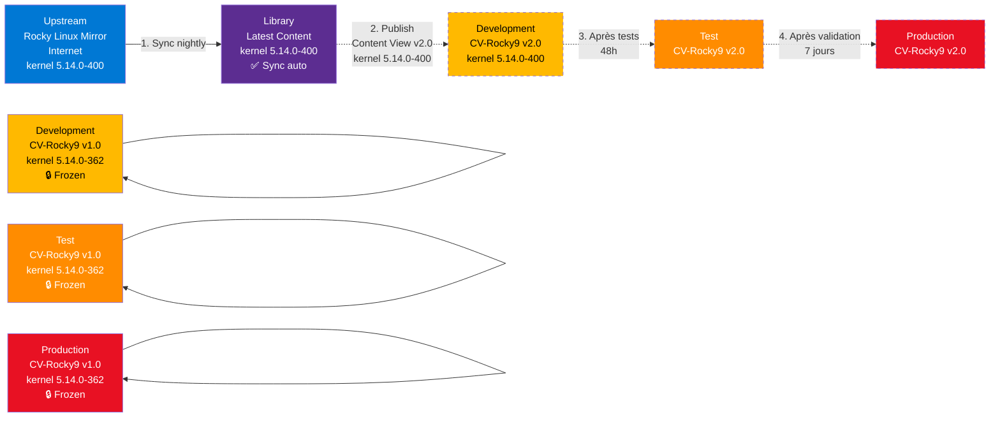
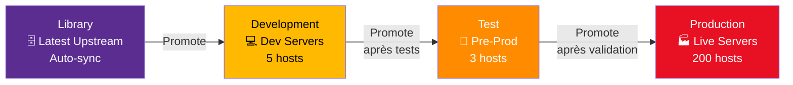

# Module 2 : Gestion du Contenu - Le Pipeline RPM

!!! info "Objectifs du module"
    - 🔄 Comprendre les **Lifecycle Environments** (Library → Dev → Test → Prod)
    - 📦 Synchroniser des repositories upstream (Rocky Linux, EPEL)
    - 📸 Créer des **Content Views** (snapshots versionnés)
    - 🔧 Utiliser **Hammer CLI** pour l'automation
    - 🚀 Publier et promouvoir des versions entre environnements
    - ✅ Mettre en place un pipeline RPM complet

---

## 📘 Concept : Le Lifecycle Management

### ⚠️ Don't let updates break Production

**Scénario catastrophe** (Infrastructure de 200 serveurs Rocky Linux) :

> **Le problème** : Tous les serveurs pointent vers les repos upstream (Rocky Linux miroirs officiels).
>
> **Mardi 14 janvier 2025, 02:00** : Rocky Linux publie un nouveau kernel 5.14.0-400.
>
> **02:30** : Les serveurs Dev exécutent `yum update` automatiquement (cron job).
>
> **03:00** : Les serveurs Test exécutent `yum update` automatiquement.
>
> **03:30** : Les serveurs Prod exécutent `yum update` automatiquement.
>
> **04:00** : 50 serveurs Prod plantent au redémarrage (régression kernel + module NVIDIA).
>
> **Résultat** : Production DOWN pendant 6 heures, rollback d'urgence, 500K€ de pertes.

**La leçon** : **JAMAIS** laisser la production suivre automatiquement l'upstream.

---

### 🎯 La solution : Frozen State (État Figé)

**Principe Katello** : Chaque environnement a une **version figée** des repos.

✅ **Concept clé** :
- **Library** : Dernière version upstream (latest)
- **Dev** : Version 1.0 (figée jusqu'à promotion manuelle)
- **Test** : Version 1.0 (figée jusqu'à promotion manuelle)
- **Prod** : Version 1.0 (figée jusqu'à promotion manuelle)

**Workflow sécurisé** :



**💡 Avantages** :
- ✅ **Dev** teste les nouveaux kernels en premier (environnement de test)
- ✅ **Test** valide en pré-prod (48h de tests fonctionnels)
- ✅ **Prod** ne change **JAMAIS** sans validation explicite (promotion manuelle)
- ✅ **Rollback facile** : Revenir à la version précédente (v1.0 → v2.0 → v1.0)

---

### 🌍 Lifecycle Environments : Les Étapes du Pipeline

Les **Lifecycle Environments** représentent les **étapes du cycle de vie** des serveurs.

**Architecture classique** :



**Détail des environnements** :

| Environnement | Description | Serveurs typiques | Promotion |
|---------------|-------------|-------------------|-----------|
| **Library** | Stockage de tout le contenu synchronisé (latest upstream) | N/A (pas de serveurs) | Auto (sync) |
| **Development** | Environnement de développement et tests internes | Dev, Lab, CI/CD | Manuel (après tests fonctionnels) |
| **Test** | Environnement de pré-production (staging) | Staging, UAT | Manuel (après validation métier) |
| **Production** | Environnement de production (serveurs live) | Prod, Backup | Manuel (fenêtre de maintenance) |

**💡 Règles de promotion** :
1. **Library → Dev** : Dès qu'une nouvelle Content View est publiée
2. **Dev → Test** : Après 48h de tests sans incident
3. **Test → Prod** : Après validation métier + fenêtre de maintenance

---

### 📸 Content Views : Les Snapshots Versionnés

Une **Content View** est un **snapshot versionné** d'un ensemble de repositories.

**Concept** : Imaginez une Content View comme un "tag Git" de vos repos RPM.

**Exemple** :

```
Content View: CV-Rocky9
├── Version 1.0 (published 2025-01-01)
│   ├── Rocky-BaseOS (1500 RPM, kernel 5.14.0-362)
│   └── Rocky-AppStream (3000 RPM)
├── Version 2.0 (published 2025-02-01)
│   ├── Rocky-BaseOS (1520 RPM, kernel 5.14.0-400)  ← Nouveau kernel
│   └── Rocky-AppStream (3050 RPM)
└── Version 3.0 (published 2025-03-01)
    ├── Rocky-BaseOS (1540 RPM, kernel 5.14.0-420)
    └── Rocky-AppStream (3100 RPM)
```

**Propriétés** :
- **Immuable** : Une fois publiée, une version ne change **jamais** (frozen)
- **Versionnée** : Chaque publication crée une nouvelle version (1.0, 2.0, 3.0...)
- **Promue** : Une version peut être promue entre environnements (Dev → Test → Prod)

**Filtres** :

Une Content View peut contenir des **filtres** pour :
- **Inclure** seulement certains packages (`kernel`, `httpd`, `git`)
- **Exclure** des packages (`kernel > 5.14.0-400`, `firefox`)
- **Limiter** à une date (ex: "Uniquement les RPM publiés avant le 2025-01-01")

**Exemple de filtre** :

```
Content View: CV-Rocky9-Prod
├── Repositories:
│   ├── Rocky-BaseOS
│   └── Rocky-AppStream
└── Filters:
    ├── Include: kernel < 5.14.0-400  ← Bloquer le nouveau kernel
    └── Exclude: firefox  ← Ne pas installer Firefox sur les serveurs
```

---

## 💻 Pratique : Hammer CLI

### 🔨 Pourquoi Hammer CLI ?

**Hammer** est le client en ligne de commande pour Katello/Foreman.

**💡 Avantages** :
- ✅ **Automation** : Scriptable (Bash, Ansible)
- ✅ **Rapidité** : Plus rapide que l'interface Web (pas de clics)
- ✅ **CI/CD** : Intégrable dans des pipelines (GitLab CI, Jenkins)
- ✅ **Idempotence** : Répétable sans erreur

**Installation** :

```bash
# Hammer est installé automatiquement avec Katello
hammer --version
# Output : 3.9.0
```

**Configuration** :

```bash
# Créer le fichier de config (pour éviter de taper login/password à chaque fois)
cat > ~/.hammer/cli.modules.d/foreman.yml <<EOF
:foreman:
  :host: 'https://katello.example.com'
  :username: 'admin'
  :password: 'VotreMotDePasse'
  :request_timeout: 120
EOF

# Tester la connexion
hammer ping

# Output :
# katello:
#     Status:          ok
# candlepin:
#     Status:          ok
# ...
```

---

### 📦 Étape 1 : Créer un Product (Produit)

Un **Product** regroupe plusieurs repositories (ex: "Rocky Linux 9" contient BaseOS + AppStream + EPEL).

```bash
# Créer le produit "Rocky Linux 9"
hammer product create \
  --name "Rocky Linux 9" \
  --description "Rocky Linux 9 Official Repositories" \
  --organization "Default Organization"

# Output :
# Product created.
# [id: 1, name: Rocky Linux 9]

# Vérifier
hammer product list --organization "Default Organization"

# Output :
# ID | NAME            | DESCRIPTION
# ---|-----------------|----------------------------------
# 1  | Rocky Linux 9   | Rocky Linux 9 Official Repositories
```

---

### 🗄️ Étape 2 : Créer un Repository

Un **Repository** pointe vers un miroir upstream (Rocky Linux, EPEL, etc.).

```bash
# Créer le repository BaseOS
hammer repository create \
  --name "Rocky-BaseOS-9" \
  --product "Rocky Linux 9" \
  --content-type "yum" \
  --url "https://dl.rockylinux.org/pub/rocky/9/BaseOS/x86_64/os/" \
  --download-policy "on_demand" \
  --organization "Default Organization"

# Output :
# Repository created.
# [id: 1, name: Rocky-BaseOS-9]

# Créer le repository AppStream
hammer repository create \
  --name "Rocky-AppStream-9" \
  --product "Rocky Linux 9" \
  --content-type "yum" \
  --url "https://dl.rockylinux.org/pub/rocky/9/AppStream/x86_64/os/" \
  --download-policy "on_demand" \
  --organization "Default Organization"

# Vérifier
hammer repository list --product "Rocky Linux 9" --organization "Default Organization"

# Output :
# ID | NAME               | CONTENT TYPE | URL
# ---|--------------------|--------------|-------------------------------------
# 1  | Rocky-BaseOS-9     | yum          | https://dl.rockylinux.org/.../BaseOS
# 2  | Rocky-AppStream-9  | yum          | https://dl.rockylinux.org/.../AppStream
```

**💡 Download Policy** :

| Option | Description | Usage |
|--------|-------------|-------|
| `immediate` | Télécharge tous les RPM immédiatement (lent, consomme ~50 GB) | Production (pas de dépendance Internet) |
| `on_demand` | Télécharge les RPM uniquement quand un client les demande | Dev/Test (économie stockage) |
| `background` | Télécharge en arrière-plan (non bloquant) | Compromis |

**Recommandation** : `on_demand` pour tester, `immediate` pour la production.

---

### 🔄 Étape 3 : Synchroniser un Repository

```bash
# Synchroniser BaseOS (télécharge les métadonnées + RPM selon download-policy)
hammer repository synchronize \
  --name "Rocky-BaseOS-9" \
  --product "Rocky Linux 9" \
  --organization "Default Organization"

# Output :
# Repository is being synchronized in task 12345678-90ab-cdef-1234-567890abcdef.
# Synchronization started [========================                ] 60%

# Durée :
# - on_demand : ~2-5 minutes (métadonnées uniquement, ~200 MB)
# - immediate : ~30-60 minutes (tous les RPM, ~10 GB)

# Vérifier le statut de la sync
hammer task progress --id 12345678-90ab-cdef-1234-567890abcdef

# Attendre la fin (ou utiliser --async pour ne pas bloquer)
```

**💡 Astuce : Sync asynchrone**

```bash
# Lancer la sync en arrière-plan
hammer repository synchronize \
  --name "Rocky-BaseOS-9" \
  --product "Rocky Linux 9" \
  --organization "Default Organization" \
  --async

# Output :
# Repository synchronization task 12345678... has been started.

# Surveiller via :
hammer task list --search "label = Actions::Katello::Repository::Sync"
```

---

### 🌍 Étape 4 : Créer les Lifecycle Environments

```bash
# Par défaut, Katello a déjà "Library"
# Créer "Development"
hammer lifecycle-environment create \
  --name "Development" \
  --description "Development Environment" \
  --prior "Library" \
  --organization "Default Organization"

# Output :
# Lifecycle environment created.
# [id: 2, name: Development]

# Créer "Test" (après Development)
hammer lifecycle-environment create \
  --name "Test" \
  --description "Test Environment (Staging)" \
  --prior "Development" \
  --organization "Default Organization"

# Créer "Production" (après Test)
hammer lifecycle-environment create \
  --name "Production" \
  --description "Production Environment" \
  --prior "Test" \
  --organization "Default Organization"

# Vérifier
hammer lifecycle-environment list --organization "Default Organization"

# Output :
# ID | NAME        | PRIOR
# ---|-------------|-------------
# 1  | Library     |
# 2  | Development | Library
# 3  | Test        | Development
# 4  | Production  | Test
```

**💡 Ordre important** : L'ordre `--prior` définit la chaîne de promotion (Library → Dev → Test → Prod).

---

### 📸 Étape 5 : Créer une Content View

```bash
# Créer la Content View
hammer content-view create \
  --name "CV-Rocky9-Base" \
  --description "Rocky Linux 9 Base (BaseOS + AppStream)" \
  --organization "Default Organization"

# Output :
# Content view created.
# [id: 1, name: CV-Rocky9-Base]

# Ajouter les repositories à la Content View
hammer content-view add-repository \
  --name "CV-Rocky9-Base" \
  --product "Rocky Linux 9" \
  --repository "Rocky-BaseOS-9" \
  --organization "Default Organization"

hammer content-view add-repository \
  --name "CV-Rocky9-Base" \
  --product "Rocky Linux 9" \
  --repository "Rocky-AppStream-9" \
  --organization "Default Organization"

# Vérifier
hammer content-view info --name "CV-Rocky9-Base" --organization "Default Organization"

# Output :
# Name:         CV-Rocky9-Base
# Repositories:
#   1) Name: Rocky-BaseOS-9
#   2) Name: Rocky-AppStream-9
# Versions:     (none yet)
```

---

### 🚀 Étape 6 : Publier une Content View (Version 1.0)

```bash
# Publier la Content View (crée la version 1.0)
hammer content-view publish \
  --name "CV-Rocky9-Base" \
  --description "Initial release - Rocky 9.3" \
  --organization "Default Organization"

# Output :
# Publishing content view [ RUNNING ]
# Task 87654321-abcd-ef01-2345-6789abcdef01 started.
# ...
# Content view published successfully.

# Durée : 5-15 minutes (selon la taille des repos)

# Vérifier
hammer content-view info --name "CV-Rocky9-Base" --organization "Default Organization"

# Output :
# Name:         CV-Rocky9-Base
# Versions:
#   Version: 1.0
#     Published: 2025-01-15 10:30:00
#     Environments: Library
```

---

### ⏭️ Étape 7 : Promouvoir vers Development

```bash
# Promouvoir la version 1.0 vers Development
hammer content-view version promote \
  --content-view "CV-Rocky9-Base" \
  --version "1.0" \
  --to-lifecycle-environment "Development" \
  --organization "Default Organization"

# Output :
# Promoting content view version [ RUNNING ]
# ...
# Content view version promoted successfully.

# Vérifier
hammer content-view info --name "CV-Rocky9-Base" --organization "Default Organization"

# Output :
# Versions:
#   Version: 1.0
#     Published: 2025-01-15 10:30:00
#     Environments: Library, Development  ← Promoted!
```

**💡 Promotion ultérieure** :

```bash
# Après 48h de tests en Dev → Promouvoir vers Test
hammer content-view version promote \
  --content-view "CV-Rocky9-Base" \
  --version "1.0" \
  --to-lifecycle-environment "Test" \
  --organization "Default Organization"

# Après validation Test → Promouvoir vers Production
hammer content-view version promote \
  --content-view "CV-Rocky9-Base" \
  --version "1.0" \
  --to-lifecycle-environment "Production" \
  --organization "Default Organization"
```

---

## Exercice : À Vous de Jouer

!!! example "Mise en Pratique : Sync & Promote"
    **Objectif** : Configurer un pipeline de gestion de contenu avec Products, Repositories et Content Views.

    **Contexte** : Vous êtes administrateur système chez **LinuxCorp**. Le DSI vous demande de configurer Katello pour gérer les mises à jour de manière contrôlée. Vous devez créer un pipeline **Library → Development** pour les serveurs Dev.

    **Tâches à réaliser** :

    1. Créer un **Product** nommé "Rocky Linux 9"
    2. Ajouter un **Repository** "Rocky-BaseOS-9" pointant vers le miroir officiel
    3. Synchroniser le repository (télécharger les métadonnées + RPM)
    4. Créer un **Lifecycle Environment** "Development" (après Library)
    5. Créer une **Content View** "CV-Rocky9"
    6. Ajouter le repository BaseOS à la Content View
    7. Publier la **version 1.0** de la Content View
    8. Promouvoir la version 1.0 vers **Development**

    **Critères de validation** :

    - [ ] Product "Rocky Linux 9" visible dans `hammer product list`
    - [ ] Repository synchronisé avec succès
    - [ ] Content View publiée en version 1.0
    - [ ] Version promue vers Development

### 📝 Travail à réaliser

Créez un script `sync-promote.sh` qui automatise toutes les étapes :

```bash
#!/bin/bash
# sync-promote.sh
# Auteur : Votre nom
# Date : 22/11/2025
# Description : Sync & Promote Rocky Linux 9 BaseOS

ORG="Default Organization"
PRODUCT="Rocky Linux 9"
REPO="Rocky-BaseOS-9"
CV="CV-Rocky9"

# TODO 1 : Créer le Product

# TODO 2 : Créer le Repository (BaseOS)

# TODO 3 : Synchroniser le Repository (attendre la fin)

# TODO 4 : Créer le Lifecycle Environment "Development"

# TODO 5 : Créer la Content View

# TODO 6 : Ajouter le Repository à la Content View

# TODO 7 : Publier la Content View (version 1.0)

# TODO 8 : Promouvoir vers Development

# TODO 9 : Afficher le résumé
```

---

### ✅ Critères de validation

| Critère | Vérification |
|---------|--------------|
| Product créé | `hammer product list` → Rocky Linux 9 |
| Repository créé | `hammer repository list` → Rocky-BaseOS-9 |
| Sync terminée | `hammer repository info --name Rocky-BaseOS-9` → Last Sync: Success |
| Lifecycle créé | `hammer lifecycle-environment list` → Development |
| Content View créée | `hammer content-view list` → CV-Rocky9 |
| Version publiée | `hammer content-view info --name CV-Rocky9` → Version 1.0 |
| Promue vers Dev | Environments: Library, Development |

---

### 💡 Solution complète

??? quote "Cliquez pour révéler la solution"

    ```bash
    #!/bin/bash
    # sync-promote.sh
    # Sync & Promote Rocky Linux 9 BaseOS vers Development
    # Auteur : ShellBook Training
    # Date : 22/11/2025

    set -e  # Arrêter en cas d'erreur

    # ============================================
    # CONFIGURATION
    # ============================================
    ORG="Default Organization"
    PRODUCT="Rocky Linux 9"
    REPO="Rocky-BaseOS-9"
    REPO_URL="https://dl.rockylinux.org/pub/rocky/9/BaseOS/x86_64/os/"
    CV="CV-Rocky9"
    ENV_DEV="Development"

    echo "========================================="
    echo "  SYNC & PROMOTE - ROCKY LINUX 9 BASEOS "
    echo "========================================="
    echo ""

    # ============================================
    # ÉTAPE 1 : CRÉER LE PRODUCT
    # ============================================
    echo "[1/8] Création du Product..."

    # Vérifier si le product existe déjà
    PRODUCT_EXISTS=$(hammer product list --organization "$ORG" --search "name=\"$PRODUCT\"" --per-page 1000 | grep -c "$PRODUCT" || true)

    if [ "$PRODUCT_EXISTS" -eq 0 ]; then
        hammer product create \
          --name "$PRODUCT" \
          --description "Rocky Linux 9 Official Repositories" \
          --organization "$ORG"
        echo "✅ Product créé : $PRODUCT"
    else
        echo "ℹ️  Product existant : $PRODUCT"
    fi

    # ============================================
    # ÉTAPE 2 : CRÉER LE REPOSITORY
    # ============================================
    echo ""
    echo "[2/8] Création du Repository..."

    REPO_EXISTS=$(hammer repository list --product "$PRODUCT" --organization "$ORG" | grep -c "$REPO" || true)

    if [ "$REPO_EXISTS" -eq 0 ]; then
        hammer repository create \
          --name "$REPO" \
          --product "$PRODUCT" \
          --content-type "yum" \
          --url "$REPO_URL" \
          --download-policy "on_demand" \
          --organization "$ORG"
        echo "✅ Repository créé : $REPO"
    else
        echo "ℹ️  Repository existant : $REPO"
    fi

    # ============================================
    # ÉTAPE 3 : SYNCHRONISER LE REPOSITORY
    # ============================================
    echo ""
    echo "[3/8] Synchronisation du Repository..."
    echo "⏳ Cette opération peut prendre 5-10 minutes."

    hammer repository synchronize \
      --name "$REPO" \
      --product "$PRODUCT" \
      --organization "$ORG"

    echo "✅ Synchronisation terminée"

    # ============================================
    # ÉTAPE 4 : CRÉER LE LIFECYCLE ENVIRONMENT
    # ============================================
    echo ""
    echo "[4/8] Création du Lifecycle Environment..."

    ENV_EXISTS=$(hammer lifecycle-environment list --organization "$ORG" | grep -c "$ENV_DEV" || true)

    if [ "$ENV_EXISTS" -eq 0 ]; then
        hammer lifecycle-environment create \
          --name "$ENV_DEV" \
          --description "Development Environment" \
          --prior "Library" \
          --organization "$ORG"
        echo "✅ Lifecycle Environment créé : $ENV_DEV"
    else
        echo "ℹ️  Lifecycle Environment existant : $ENV_DEV"
    fi

    # ============================================
    # ÉTAPE 5 : CRÉER LA CONTENT VIEW
    # ============================================
    echo ""
    echo "[5/8] Création de la Content View..."

    CV_EXISTS=$(hammer content-view list --organization "$ORG" | grep -c "$CV" || true)

    if [ "$CV_EXISTS" -eq 0 ]; then
        hammer content-view create \
          --name "$CV" \
          --description "Rocky Linux 9 Base (BaseOS)" \
          --organization "$ORG"
        echo "✅ Content View créée : $CV"
    else
        echo "ℹ️  Content View existante : $CV"
    fi

    # ============================================
    # ÉTAPE 6 : AJOUTER LE REPOSITORY À LA CV
    # ============================================
    echo ""
    echo "[6/8] Ajout du Repository à la Content View..."

    # Vérifier si le repo est déjà dans la CV
    REPO_IN_CV=$(hammer content-view info --name "$CV" --organization "$ORG" | grep -c "$REPO" || true)

    if [ "$REPO_IN_CV" -eq 0 ]; then
        hammer content-view add-repository \
          --name "$CV" \
          --product "$PRODUCT" \
          --repository "$REPO" \
          --organization "$ORG"
        echo "✅ Repository ajouté à la Content View"
    else
        echo "ℹ️  Repository déjà présent dans la Content View"
    fi

    # ============================================
    # ÉTAPE 7 : PUBLIER LA CONTENT VIEW (V1.0)
    # ============================================
    echo ""
    echo "[7/8] Publication de la Content View (Version 1.0)..."
    echo "⏳ Cette opération peut prendre 5-15 minutes."

    # Vérifier si une version existe déjà
    VERSION_EXISTS=$(hammer content-view info --name "$CV" --organization "$ORG" | grep -c "Version: 1.0" || true)

    if [ "$VERSION_EXISTS" -eq 0 ]; then
        hammer content-view publish \
          --name "$CV" \
          --description "Initial release - Rocky 9 BaseOS" \
          --organization "$ORG"
        echo "✅ Content View publiée (Version 1.0)"
    else
        echo "ℹ️  Content View déjà publiée (Version 1.0 existe)"
    fi

    # ============================================
    # ÉTAPE 8 : PROMOUVOIR VERS DEVELOPMENT
    # ============================================
    echo ""
    echo "[8/8] Promotion vers Development..."

    # Vérifier si la version est déjà promue
    PROMOTED=$(hammer content-view info --name "$CV" --organization "$ORG" | grep "Environments:" | grep -c "$ENV_DEV" || true)

    if [ "$PROMOTED" -eq 0 ]; then
        hammer content-view version promote \
          --content-view "$CV" \
          --version "1.0" \
          --to-lifecycle-environment "$ENV_DEV" \
          --organization "$ORG"
        echo "✅ Version 1.0 promue vers Development"
    else
        echo "ℹ️  Version 1.0 déjà promue vers Development"
    fi

    # ============================================
    # RÉSUMÉ FINAL
    # ============================================
    echo ""
    echo "========================================="
    echo "           RÉSUMÉ FINAL                 "
    echo "========================================="
    echo ""

    # Afficher les infos de la Content View
    hammer content-view info --name "$CV" --organization "$ORG"

    echo ""
    echo "========================================="
    echo "        OPÉRATION TERMINÉE !            "
    echo "========================================="
    echo ""
    echo "✅ Le pipeline est configuré :"
    echo "   Library → Development"
    echo ""
    echo "📝 Prochaines étapes :"
    echo "   1. Enregistrer des serveurs dans l'env Development"
    echo "   2. Tester les mises à jour pendant 48h"
    echo "   3. Créer l'environnement Test"
    echo "   4. Promouvoir vers Test : hammer content-view version promote ..."
    echo ""
    ```

    **Exécution** :
    ```bash
    chmod +x sync-promote.sh
    ./sync-promote.sh
    ```

    **Output attendu** :
    ```
    =========================================
      SYNC & PROMOTE - ROCKY LINUX 9 BASEOS
    =========================================

    [1/8] Création du Product...
    ✅ Product créé : Rocky Linux 9

    [2/8] Création du Repository...
    ✅ Repository créé : Rocky-BaseOS-9

    [3/8] Synchronisation du Repository...
    ⏳ Cette opération peut prendre 5-10 minutes.
    ✅ Synchronisation terminée

    [4/8] Création du Lifecycle Environment...
    ✅ Lifecycle Environment créé : Development

    [5/8] Création de la Content View...
    ✅ Content View créée : CV-Rocky9

    [6/8] Ajout du Repository à la Content View...
    ✅ Repository ajouté à la Content View

    [7/8] Publication de la Content View (Version 1.0)...
    ⏳ Cette opération peut prendre 5-15 minutes.
    ✅ Content View publiée (Version 1.0)

    [8/8] Promotion vers Development...
    ✅ Version 1.0 promue vers Development

    =========================================
               RÉSUMÉ FINAL
    =========================================

    Name:         CV-Rocky9
    Description:  Rocky Linux 9 Base (BaseOS)
    Repositories:
      1) Name: Rocky-BaseOS-9
         Product: Rocky Linux 9
    Versions:
      Version: 1.0
        Published: 2025-01-22 14:35:00
        Environments: Library, Development

    =========================================
            OPÉRATION TERMINÉE !
    =========================================

    ✅ Le pipeline est configuré :
       Library → Development

    📝 Prochaines étapes :
       1. Enregistrer des serveurs dans l'env Development
       2. Tester les mises à jour pendant 48h
       3. Créer l'environnement Test
       4. Promouvoir vers Test : hammer content-view version promote ...
    ```

---

## 🎯 Points clés à retenir

!!! success "Checklist Module 2"
    - ✅ **Frozen State** : Chaque environnement a une version figée (pas de surprise en prod)
    - ✅ **Lifecycle Environments** : Library → Dev → Test → Prod (chaîne de promotion)
    - ✅ **Content Views** : Snapshots versionnés (v1.0, v2.0...) immuables
    - ✅ **Workflow** : Sync → Publish → Promote (Dev → Test → Prod)
    - ✅ **Hammer CLI** : Automation complète (scriptable, idempotent)
    - ✅ **Download Policy** : `on_demand` (test) vs `immediate` (prod)
    - ✅ **Promotion manuelle** : Production ne change **jamais** sans validation explicite

---

## 🔗 Ressources complémentaires

- [Katello Content Views Documentation](https://theforeman.org/plugins/katello/content_views.html)
- [Hammer CLI Reference](https://theforeman.org/manuals/latest/index.html#4.5CommandLineInterface)
- [Lifecycle Environments Best Practices](https://access.redhat.com/documentation/en-us/red_hat_satellite/6.14/html/content_management_guide/managing_lifecycle_environments)

---

## ➡️ Prochaine étape

Rendez-vous au **Module 3 : Enregistrement des Hôtes** pour apprendre à :
- Créer des Activation Keys (clés d'enregistrement)
- Enregistrer des clients Rocky Linux avec `subscription-manager`
- Organiser les hôtes en Host Collections
- Appliquer des actions en masse (update, errata)

---

!!! quote "Citation du formateur"
    *"Un serveur de production qui suit l'upstream, c'est comme une voiture sans frein : ça va vite, mais ça finit mal."* — ShellBook Training

---

## Navigation

| | |
|:---|---:|
| [← Module 1 : Architecture & Installatio...](01-module.md) | [Module 3 : Gestion des Hôtes - L'Enrô... →](03-module.md) |

[Retour au Programme](index.md){ .md-button }
