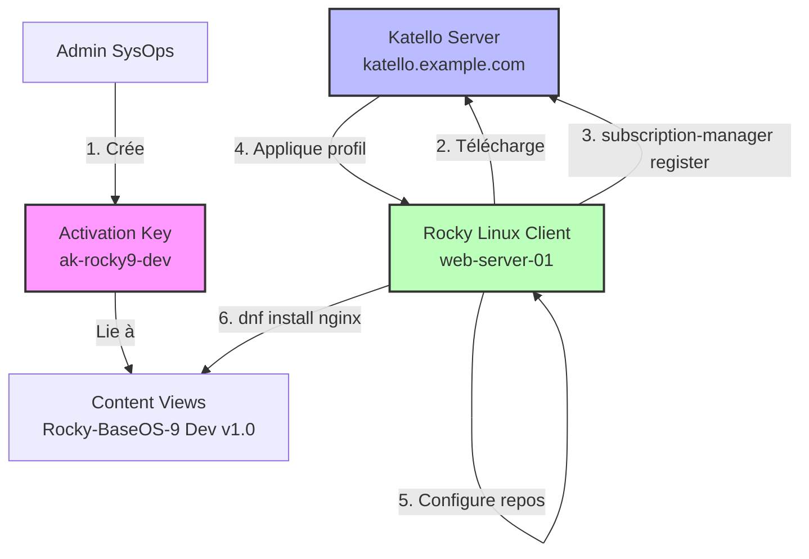
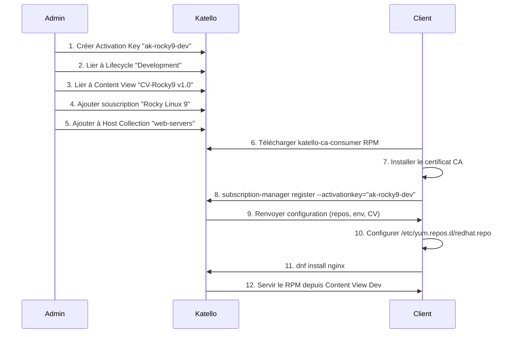

---
tags:
  - katello
  - registration
  - activation-keys
  - subscription-manager
---

# Module 3 : Gestion des Hôtes - L'Enrôlement

## Introduction

> **"Connecting the fleet."**

Vous avez maintenant un serveur Katello fonctionnel avec des **Content Views** publiées dans différents **Lifecycle Environments**. Il est temps de connecter vos serveurs Linux à cette infrastructure.

**Le défi de l'enrôlement à grande échelle :**

| Approche Traditionnelle | Problème |
|------------------------|----------|
| Se connecter en SSH sur chaque serveur | ❌ Ne passe pas à l'échelle (500 serveurs = 500 connexions) |
| Utiliser un mot de passe admin Katello | ❌ Risque sécurité (credentials dans des scripts) |
| Configuration manuelle des repos | ❌ Erreurs humaines, incohérences |

**La solution Katello : Activation Keys**

Une **Activation Key** est un **profil d'enrôlement** pré-configuré qui contient :

- ✅ **Lifecycle Environment** : Dev / Test / Prod
- ✅ **Content View** : Quelle version des repos utiliser
- ✅ **Subscriptions** : Quels produits sont autorisés
- ✅ **Host Collections** : Groupes pour actions bulk (patching)

**Avantages :**

- 🔐 **Sécurité** : Aucun mot de passe dans les scripts (l'Activation Key est un token à usage limité)
- 🚀 **Automatisation** : Provisionner 100 serveurs avec la même commande
- 🎯 **Ciblage** : Un serveur web utilise `ak-web-prod`, un serveur DB utilise `ak-db-prod`

Dans ce module, vous allez apprendre à :

- ✅ Comprendre le rôle de `subscription-manager` (client-side)
- ✅ Créer des Activation Keys avec Hammer CLI
- ✅ Enrôler des serveurs Rocky Linux / RHEL / CentOS
- ✅ Utiliser les Host Collections pour grouper des serveurs
- ✅ Installer des packages depuis les repos internes

---

## Concept : L'Architecture d'Enrôlement

### Vue d'Ensemble



### Les Composants Clés

#### 1. `subscription-manager` (Client-Side)

Outil RHEL/CentOS/Rocky qui gère :

- **Registration** : Enrôler le serveur auprès de Katello
- **Repos** : Activer/désactiver les repositories YUM/DNF
- **Subscriptions** : Attacher les abonnements Red Hat (RHEL uniquement)

**Installation :**

```bash
# Pré-installé sur RHEL/CentOS/Rocky
rpm -q subscription-manager
```

**Commandes principales :**

| Commande | Description |
|----------|-------------|
| `subscription-manager register` | Enrôler le serveur |
| `subscription-manager list --available` | Voir les souscriptions disponibles |
| `subscription-manager attach --auto` | Attacher automatiquement |
| `subscription-manager repos --list` | Lister les repos disponibles |
| `subscription-manager repos --enable=...` | Activer un repo |
| `subscription-manager unregister` | Désenrôler le serveur |

---

#### 2. Activation Keys (Profil d'Enrôlement)

Une **Activation Key** est une entité Katello qui définit :

**Métadonnées :**

| Propriété | Description | Exemple |
|-----------|-------------|---------|
| **Nom** | Identifiant unique | `ak-rocky9-dev` |
| **Lifecycle Environment** | Dans quel environnement enrôler | `Development` |
| **Content View** | Quelle version des repos utiliser | `CV-Rocky9 v1.0` |
| **Subscriptions** | Produits autorisés | `Rocky Linux 9` |
| **Host Collections** | Groupes d'appartenance | `web-servers` |
| **Auto-attach** | Attacher automatiquement les souscriptions | `true` |
| **Release Version** | Figer la version (ex: RHEL 8.6) | `8.6` (optionnel) |

**Stratégie de Naming :**

```
ak-<os>-<role>-<env>
```

**Exemples :**

| Activation Key | Usage |
|----------------|-------|
| `ak-rocky9-base-dev` | Serveurs Rocky 9 génériques en Dev |
| `ak-rocky9-web-prod` | Serveurs Web Rocky 9 en Prod |
| `ak-rhel8-db-test` | Serveurs DB RHEL 8 en Test |

---

#### 3. Host Collections (Groupes de Serveurs)

Une **Host Collection** est un **groupe logique** de serveurs pour effectuer des actions bulk.

**Cas d'usage :**

| Action | Exemple |
|--------|---------|
| **Patching groupé** | Patcher tous les serveurs web le dimanche à 2h |
| **Installation bulk** | Installer `monitoring-agent` sur 50 serveurs |
| **Inventaire** | Voir tous les serveurs DB en Production |

**Exemple de structure :**

```
Host Collections:
├── web-servers (50 hosts)
│   ├── web-prod-01
│   ├── web-prod-02
│   └── ...
├── db-servers (10 hosts)
│   ├── db-prod-01
│   └── ...
└── monitoring-servers (5 hosts)
```

---

### Workflow Complet d'Enrôlement



---

## Pratique : Configuration Serveur (Katello)

### Étape 1 : Créer un Lifecycle Environment

Si vous avez suivi le Module 2, vous avez déjà créé `Development`. Sinon :

```bash
hammer lifecycle-environment create \
  --name "Development" \
  --prior "Library" \
  --organization "Default Organization"
```

**Vérifier :**

```bash
hammer lifecycle-environment list --organization "Default Organization"
```

**Sortie attendue :**

```
---|-------------|-------------
ID | NAME        | PRIOR
---|-------------|-------------
1  | Library     |
2  | Development | Library
---|-------------|-------------
```

---

### Étape 2 : Créer une Activation Key

Créer une clé pour enrôler des serveurs Rocky 9 en **Development** :

```bash
hammer activation-key create \
  --name "ak-rocky9-dev" \
  --organization "Default Organization" \
  --lifecycle-environment "Development" \
  --content-view "CV-Rocky9" \
  --unlimited-hosts
```

**Paramètres :**

| Paramètre | Description |
|-----------|-------------|
| `--name` | Nom de l'Activation Key |
| `--lifecycle-environment` | Environnement cible (Dev/Test/Prod) |
| `--content-view` | Content View à utiliser |
| `--unlimited-hosts` | Pas de limite de serveurs enrôlés |
| `--max-hosts 50` | Alternative : limiter à 50 serveurs |

**Vérifier :**

```bash
hammer activation-key list --organization "Default Organization"
```

**Sortie attendue :**

```
---|----------------|-------------|-----------------|
ID | NAME           | CONTENT VIEW| LIFECYCLE ENV   |
---|----------------|-------------|-----------------|
1  | ak-rocky9-dev  | CV-Rocky9   | Development     |
---|----------------|-------------|-----------------|
```

---

### Étape 3 : Ajouter une Subscription à l'Activation Key

Attacher le produit `Rocky Linux 9` à la clé :

```bash
# 1. Lister les subscriptions disponibles
hammer subscription list --organization "Default Organization"

# Sortie exemple :
# ID | NAME           | SKU         | QUANTITY
# 1  | Rocky Linux 9  | rocky9-sku  | Unlimited

# 2. Ajouter la subscription à l'Activation Key
hammer activation-key add-subscription \
  --name "ak-rocky9-dev" \
  --subscription-id 1 \
  --organization "Default Organization"
```

**Vérifier :**

```bash
hammer activation-key subscriptions \
  --name "ak-rocky9-dev" \
  --organization "Default Organization"
```

**Sortie attendue :**

```
---|----------------|
ID | NAME           |
---|----------------|
1  | Rocky Linux 9  |
---|----------------|
```

---

### Étape 4 : Créer une Host Collection

Créer un groupe `web-servers` :

```bash
hammer host-collection create \
  --name "web-servers" \
  --organization "Default Organization" \
  --description "All web servers running Nginx/Apache"
```

**Vérifier :**

```bash
hammer host-collection list --organization "Default Organization"
```

**Sortie attendue :**

```
---|-------------|---------------------|
ID | NAME        | HOSTS               |
---|-------------|---------------------|
1  | web-servers | 0                   |
---|-------------|---------------------|
```

---

### Étape 5 : Lier l'Activation Key à la Host Collection

```bash
hammer activation-key add-host-collection \
  --name "ak-rocky9-dev" \
  --host-collection "web-servers" \
  --organization "Default Organization"
```

**Résultat :** Tous les serveurs enrôlés avec `ak-rocky9-dev` seront automatiquement ajoutés au groupe `web-servers`.

---

## Pratique : Configuration Client (Rocky Linux)

### Étape 1 : Télécharger le Certificat CA de Katello

Depuis le client Rocky Linux :

```bash
# Remplacer katello.example.com par votre FQDN
curl -o /tmp/katello-ca-consumer-latest.noarch.rpm \
  https://katello.example.com/pub/katello-ca-consumer-latest.noarch.rpm

# Installer le certificat
sudo dnf install -y /tmp/katello-ca-consumer-latest.noarch.rpm
```

**Ce que fait ce RPM :**

- Installe le certificat CA de Katello dans `/etc/rhsm/ca/katello-server-ca.pem`
- Configure `/etc/rhsm/rhsm.conf` pour pointer vers votre serveur Katello

**Vérifier :**

```bash
ls -l /etc/rhsm/ca/
cat /etc/rhsm/rhsm.conf | grep hostname
```

**Sortie attendue :**

```
hostname = katello.example.com
```

---

### Étape 2 : Enrôler le Serveur avec subscription-manager

```bash
sudo subscription-manager register \
  --org="Default Organization" \
  --activationkey="ak-rocky9-dev"
```

**Sortie attendue :**

```
The system has been registered with ID: 12345678-1234-1234-1234-123456789012
The registered system name is: web-server-01
```

**Ce qui se passe en coulisses :**

1. `subscription-manager` contacte Katello via HTTPS
2. Katello valide l'Activation Key
3. Katello renvoie :
    - Lifecycle Environment : `Development`
    - Content View : `CV-Rocky9 v1.0`
    - Repos activés : `Rocky-BaseOS-9`, `Rocky-AppStream-9`
    - Host Collection : `web-servers`
4. Le client configure `/etc/yum.repos.d/redhat.repo`

---

### Étape 3 : Vérifier les Repos Configurés

```bash
dnf repolist
```

**Sortie attendue :**

```
repo id                             repo name
Default_Organization_CV-Rocky9_...  Rocky Linux 9 BaseOS
Default_Organization_CV-Rocky9_...  Rocky Linux 9 AppStream
```

**Les repos pointent vers Katello, pas vers les miroirs upstream !**

---

### Étape 4 : Installer un Package depuis Katello

```bash
sudo dnf install -y nginx
```

**Vérifier la provenance :**

```bash
dnf info nginx
```

**Sortie attendue :**

```
Name         : nginx
Version      : 1.20.1
Release      : 14.el9
Repository   : Default_Organization_CV-Rocky9_Development_Rocky-BaseOS-9
```

**✅ Le package vient bien de votre Content View en Development !**

---

### Étape 5 : Vérifier l'Enrôlement sur Katello

Retour sur le serveur Katello :

```bash
hammer host list --organization "Default Organization"
```

**Sortie attendue :**

```
---|---------------|------------|-----------------|
ID | NAME          | OS         | HOST COLLECTION |
---|---------------|------------|-----------------|
1  | web-server-01 | Rocky 9.3  | web-servers     |
---|---------------|------------|-----------------|
```

**Vérifier les détails :**

```bash
hammer host info --name "web-server-01"
```

**Sortie exemple :**

```
Name:                web-server-01
Organization:        Default Organization
Lifecycle Env:       Development
Content View:        CV-Rocky9
Host Collection:     web-servers
Packages Installed:  nginx-1.20.1-14.el9
Last Checkin:        2025-01-22 10:30:00 UTC
```

---

## Katello Host Tools (Anciennement Katello Agent)

### Historique

**Katello Agent (Obsolète)** :

- Installé via `katello-agent` (RPM)
- Utilisait **Pulp 2** et **Qpid** (message broker)
- Permettait des actions à distance : installer/supprimer des packages, exécuter des commandes

**Problème :** Dépendait de technologies obsolètes (Qpid remplacé par Pulp 3).

**Nouvelle Approche : Katello Host Tools**

```bash
sudo dnf install -y katello-host-tools
```

**Composants :**

| Package | Rôle |
|---------|------|
| `katello-host-tools` | Outils de base (gokart, tracer) |
| `katello-host-tools-tracer` | Détection des services à redémarrer après update |
| `katello-host-tools-fact-plugin` | Envoi de facts à Katello (CPU, RAM, disques) |

**Nouvelles méthodes d'exécution à distance :**

- **Remote Execution (REX)** : Utilise SSH + Ansible pour exécuter des commandes
- **Ansible Integration** : Katello peut générer des inventaires Ansible dynamiques

**Installation recommandée :**

```bash
sudo dnf install -y katello-host-tools katello-host-tools-tracer
```

**Vérifier :**

```bash
gokart --version
```

---

## Host Collections : Actions Bulk

### Lister les Serveurs d'une Collection

```bash
hammer host-collection hosts \
  --name "web-servers" \
  --organization "Default Organization"
```

**Sortie exemple :**

```
---|---------------|
ID | NAME          |
---|---------------|
1  | web-server-01 |
2  | web-server-02 |
3  | web-server-03 |
---|---------------|
```

---

### Installer un Package sur Tous les Serveurs

```bash
hammer host-collection package install \
  --name "web-servers" \
  --packages "vim-enhanced" \
  --organization "Default Organization"
```

**Résultat :** Katello installe `vim-enhanced` sur `web-server-01`, `web-server-02`, `web-server-03`.

---

### Mettre à Jour Tous les Serveurs

```bash
hammer host-collection package update-all \
  --name "web-servers" \
  --organization "Default Organization"
```

**⚠️ Attention :** Cette commande met à jour **tous les packages** sur **tous les serveurs** du groupe. Utilisez avec précaution en production !

---

## Désinscrire un Serveur

Depuis le client :

```bash
sudo subscription-manager unregister
```

**Sortie attendue :**

```
System has been unregistered.
```

**Vérifier sur Katello :**

```bash
hammer host list --organization "Default Organization"
```

Le serveur apparaîtra toujours mais avec un statut `Unregistered`.

**Supprimer définitivement :**

```bash
hammer host delete --name "web-server-01"
```

---

## Bonnes Pratiques

### 1. ✅ Une Activation Key par Environnement/Rôle

```bash
# ❌ MAUVAIS : Une seule clé pour tout
ak-generic

# ✅ BON : Clés spécifiques
ak-rocky9-web-dev
ak-rocky9-web-prod
ak-rocky9-db-dev
ak-rocky9-db-prod
```

**Avantages :**

- Ciblage précis des repos (Prod utilise `CV v1.0`, Dev utilise `CV v2.0`)
- Sécurité (une clé compromise ne donne accès qu'à un environnement)

---

### 2. ✅ Automatiser l'Enrôlement avec Kickstart

Intégrer l'enrôlement dans votre **Kickstart** (installation automatique RHEL/Rocky) :

**Fichier Kickstart (`ks.cfg`) :**

```bash
%post
# Installer le certificat Katello
curl -o /tmp/katello-ca.rpm https://katello.example.com/pub/katello-ca-consumer-latest.noarch.rpm
rpm -ivh /tmp/katello-ca.rpm

# Enrôler le serveur
subscription-manager register \
  --org="Default Organization" \
  --activationkey="ak-rocky9-web-prod" \
  --force

# Installer les outils Katello
dnf install -y katello-host-tools

%end
```

**Résultat :** Chaque nouveau serveur provisionné est automatiquement enrôlé dans Katello.

---

### 3. ✅ Utiliser des Host Collections pour le Patching

**Stratégie de patching progressive (Deployment Rings) :**

| Host Collection | Nombre Serveurs | Patching Window |
|-----------------|-----------------|-----------------|
| `canary-servers` | 5 (serveurs test) | Dimanche 00:00 |
| `web-servers` | 50 | Dimanche 02:00 |
| `db-servers` | 10 | Dimanche 04:00 |
| `critical-servers` | 3 | Manuel uniquement |

**Commande automatisée (via cron) :**

```bash
# Dimanche 00:00 : Patcher les Canary
0 0 * * 0 hammer host-collection package update-all --name "canary-servers"

# Dimanche 02:00 : Si Canary OK, patcher les Web
0 2 * * 0 hammer host-collection package update-all --name "web-servers"
```

---

### 4. ✅ Monitorer les Serveurs Non Enrôlés

Script pour détecter les serveurs qui ne se sont pas connectés depuis 7 jours :

```bash
#!/bin/bash
# check-inactive-hosts.sh

THRESHOLD_DAYS=7
THRESHOLD_SECONDS=$((THRESHOLD_DAYS * 86400))
NOW=$(date +%s)

hammer host list --organization "Default Organization" --fields "Name,Last checkin" | tail -n +2 | while read -r line; do
  NAME=$(echo "$line" | awk '{print $1}')
  LAST_CHECKIN=$(echo "$line" | awk '{print $2}')

  if [ -n "$LAST_CHECKIN" ]; then
    LAST_CHECKIN_TS=$(date -d "$LAST_CHECKIN" +%s)
    DIFF=$((NOW - LAST_CHECKIN_TS))

    if [ $DIFF -gt $THRESHOLD_SECONDS ]; then
      echo "⚠️  $NAME : Inactif depuis $((DIFF / 86400)) jours"
    fi
  fi
done
```

---

### 5. ✅ Sécuriser les Activation Keys

**Ne pas exposer les Activation Keys dans Git/Scripts publics.**

**Alternative :** Utiliser **Ansible Vault** pour chiffrer les clés :

```yaml
# vars/katello.yml (chiffré avec ansible-vault)
activation_keys:
  dev: "ak-rocky9-dev-SECRET123"
  prod: "ak-rocky9-prod-SECRET456"
```

**Playbook Ansible :**

```yaml
- name: Register host to Katello
  community.general.redhat_subscription:
    state: present
    server_hostname: katello.example.com
    org_id: "Default Organization"
    activationkey: "{{ activation_keys.dev }}"
```

---

## Exercice : Onboarding Automatisé

### Contexte

Vous êtes SysOps dans **LinuxCorp** (infrastructure 200 serveurs Rocky Linux 9).

Votre équipe Dev vient de provisionner un nouveau serveur web `web-dev-05.linuxcorp.local` qu'il faut :

1. Enrôler dans l'environnement **Development**
2. Ajouter au groupe `web-servers`
3. Installer **Nginx** depuis vos repos internes

**Informations Katello :**

- **Serveur Katello :** `katello.linuxcorp.local`
- **Organisation :** `LinuxCorp`
- **Content View :** `CV-Rocky9` (déjà publiée en Development)
- **Lifecycle Environment :** `Development` (déjà créé)

---

### Mission

#### 1. Configuration Serveur Katello

1. Créer l'Activation Key `ak-rocky9-dev`
2. Lier à l'environnement `Development`
3. Lier à la Content View `CV-Rocky9`
4. Créer la Host Collection `web-servers`
5. Lier l'Activation Key à la Host Collection

#### 2. Configuration Client `web-dev-05`

1. Télécharger et installer le certificat CA Katello
2. Enrôler le serveur avec `subscription-manager`
3. Vérifier les repos (`dnf repolist`)
4. Installer `nginx`
5. Démarrer le service Nginx

#### 3. Vérification

1. Sur Katello : vérifier que `web-dev-05` apparaît dans la Host Collection `web-servers`
2. Sur le client : vérifier que Nginx fonctionne (`curl localhost`)

---

### Solution

??? quote "**Solution : Configuration Katello (Serveur)**"

    **Fichier : `setup-activation-key.sh`**

    ```bash
    #!/bin/bash
    # setup-activation-key.sh
    # Configuration Katello pour l'Activation Key "ak-rocky9-dev"

    set -e

    ORG="LinuxCorp"
    AK_NAME="ak-rocky9-dev"
    LC_ENV="Development"
    CV_NAME="CV-Rocky9"
    HC_NAME="web-servers"

    echo "========================================="
    echo "🔧 KATELLO ACTIVATION KEY SETUP"
    echo "========================================="

    # STEP 1 : Vérifier que l'environnement Development existe
    echo ""
    echo "📋 Step 1: Vérification Lifecycle Environment '$LC_ENV'..."
    LC_EXISTS=$(hammer lifecycle-environment list --organization "$ORG" --name "$LC_ENV" 2>/dev/null | grep -c "$LC_ENV" || true)

    if [ "$LC_EXISTS" -eq 0 ]; then
        echo "❌ Lifecycle Environment '$LC_ENV' introuvable. Créer d'abord avec :"
        echo "   hammer lifecycle-environment create --name '$LC_ENV' --prior 'Library' --organization '$ORG'"
        exit 1
    else
        echo "✅ Lifecycle Environment '$LC_ENV' existe"
    fi

    # STEP 2 : Vérifier que la Content View existe
    echo ""
    echo "📋 Step 2: Vérification Content View '$CV_NAME'..."
    CV_EXISTS=$(hammer content-view list --organization "$ORG" --name "$CV_NAME" 2>/dev/null | grep -c "$CV_NAME" || true)

    if [ "$CV_EXISTS" -eq 0 ]; then
        echo "❌ Content View '$CV_NAME' introuvable. Créer d'abord (voir Module 2)."
        exit 1
    else
        echo "✅ Content View '$CV_NAME' existe"
    fi

    # STEP 3 : Créer l'Activation Key (si elle n'existe pas)
    echo ""
    echo "📋 Step 3: Création Activation Key '$AK_NAME'..."
    AK_EXISTS=$(hammer activation-key list --organization "$ORG" --name "$AK_NAME" 2>/dev/null | grep -c "$AK_NAME" || true)

    if [ "$AK_EXISTS" -eq 0 ]; then
        hammer activation-key create \
          --name "$AK_NAME" \
          --organization "$ORG" \
          --lifecycle-environment "$LC_ENV" \
          --content-view "$CV_NAME" \
          --unlimited-hosts

        echo "✅ Activation Key '$AK_NAME' créée"
    else
        echo "ℹ️  Activation Key '$AK_NAME' existe déjà"
    fi

    # STEP 4 : Lister les subscriptions disponibles
    echo ""
    echo "📋 Step 4: Ajout des subscriptions..."
    SUBSCRIPTION_ID=$(hammer subscription list --organization "$ORG" | grep -i "Rocky Linux 9" | awk '{print $1}')

    if [ -z "$SUBSCRIPTION_ID" ]; then
        echo "⚠️  Aucune subscription 'Rocky Linux 9' trouvée. Créer le produit d'abord (Module 2)."
    else
        # Vérifier si la subscription est déjà attachée
        ALREADY_ATTACHED=$(hammer activation-key subscriptions --name "$AK_NAME" --organization "$ORG" 2>/dev/null | grep -c "Rocky Linux 9" || true)

        if [ "$ALREADY_ATTACHED" -eq 0 ]; then
            hammer activation-key add-subscription \
              --name "$AK_NAME" \
              --subscription-id "$SUBSCRIPTION_ID" \
              --organization "$ORG"

            echo "✅ Subscription 'Rocky Linux 9' attachée"
        else
            echo "ℹ️  Subscription déjà attachée"
        fi
    fi

    # STEP 5 : Créer la Host Collection (si elle n'existe pas)
    echo ""
    echo "📋 Step 5: Création Host Collection '$HC_NAME'..."
    HC_EXISTS=$(hammer host-collection list --organization "$ORG" --name "$HC_NAME" 2>/dev/null | grep -c "$HC_NAME" || true)

    if [ "$HC_EXISTS" -eq 0 ]; then
        hammer host-collection create \
          --name "$HC_NAME" \
          --organization "$ORG" \
          --description "All web servers running Nginx/Apache"

        echo "✅ Host Collection '$HC_NAME' créée"
    else
        echo "ℹ️  Host Collection '$HC_NAME' existe déjà"
    fi

    # STEP 6 : Lier l'Activation Key à la Host Collection
    echo ""
    echo "📋 Step 6: Liaison Activation Key ↔ Host Collection..."

    # Vérifier si le lien existe déjà
    ALREADY_LINKED=$(hammer activation-key info --name "$AK_NAME" --organization "$ORG" 2>/dev/null | grep -c "$HC_NAME" || true)

    if [ "$ALREADY_LINKED" -eq 0 ]; then
        hammer activation-key add-host-collection \
          --name "$AK_NAME" \
          --host-collection "$HC_NAME" \
          --organization "$ORG"

        echo "✅ Activation Key liée à Host Collection '$HC_NAME'"
    else
        echo "ℹ️  Lien déjà existant"
    fi

    # STEP 7 : Afficher le récapitulatif
    echo ""
    echo "========================================="
    echo "✅ CONFIGURATION TERMINÉE"
    echo "========================================="
    echo ""
    hammer activation-key info --name "$AK_NAME" --organization "$ORG"
    echo ""
    echo "🔑 Utiliser cette commande sur les clients :"
    echo ""
    echo "   subscription-manager register \\"
    echo "     --org=\"$ORG\" \\"
    echo "     --activationkey=\"$AK_NAME\""
    echo ""
    ```

    **Exécution :**

    ```bash
    chmod +x setup-activation-key.sh
    ./setup-activation-key.sh
    ```

    **Sortie attendue :**

    ```
    =========================================
    🔧 KATELLO ACTIVATION KEY SETUP
    =========================================

    📋 Step 1: Vérification Lifecycle Environment 'Development'...
    ✅ Lifecycle Environment 'Development' existe

    📋 Step 2: Vérification Content View 'CV-Rocky9'...
    ✅ Content View 'CV-Rocky9' existe

    📋 Step 3: Création Activation Key 'ak-rocky9-dev'...
    ✅ Activation Key 'ak-rocky9-dev' créée

    📋 Step 4: Ajout des subscriptions...
    ✅ Subscription 'Rocky Linux 9' attachée

    📋 Step 5: Création Host Collection 'web-servers'...
    ✅ Host Collection 'web-servers' créée

    📋 Step 6: Liaison Activation Key ↔ Host Collection...
    ✅ Activation Key liée à Host Collection 'web-servers'

    =========================================
    ✅ CONFIGURATION TERMINÉE
    =========================================

    Name:                ak-rocky9-dev
    Organization:        LinuxCorp
    Lifecycle Env:       Development
    Content View:        CV-Rocky9
    Host Collections:    web-servers
    Host Limit:          Unlimited

    🔑 Utiliser cette commande sur les clients :

       subscription-manager register \
         --org="LinuxCorp" \
         --activationkey="ak-rocky9-dev"
    ```

??? quote "**Solution : Configuration Client (web-dev-05)**"

    **Fichier : `enroll-to-katello.sh`**

    ```bash
    #!/bin/bash
    # enroll-to-katello.sh
    # Script d'enrôlement automatisé pour les clients Rocky Linux 9

    set -e

    KATELLO_SERVER="katello.linuxcorp.local"
    ORG="LinuxCorp"
    ACTIVATION_KEY="ak-rocky9-dev"

    echo "========================================="
    echo "🔧 KATELLO CLIENT ENROLLMENT"
    echo "========================================="
    echo "Server: $KATELLO_SERVER"
    echo "Organization: $ORG"
    echo "Activation Key: $ACTIVATION_KEY"
    echo "========================================="

    # STEP 1 : Vérifier la connectivité au serveur Katello
    echo ""
    echo "📋 Step 1: Vérification connectivité à $KATELLO_SERVER..."
    if ping -c 2 "$KATELLO_SERVER" &>/dev/null; then
        echo "✅ Serveur Katello accessible"
    else
        echo "❌ Impossible de joindre $KATELLO_SERVER"
        exit 1
    fi

    # STEP 2 : Télécharger le certificat CA Katello
    echo ""
    echo "📋 Step 2: Téléchargement certificat CA Katello..."
    curl -sS -o /tmp/katello-ca-consumer-latest.noarch.rpm \
      "https://$KATELLO_SERVER/pub/katello-ca-consumer-latest.noarch.rpm"

    if [ -f /tmp/katello-ca-consumer-latest.noarch.rpm ]; then
        echo "✅ Certificat téléchargé"
    else
        echo "❌ Échec du téléchargement"
        exit 1
    fi

    # STEP 3 : Installer le certificat CA
    echo ""
    echo "📋 Step 3: Installation du certificat CA..."
    sudo dnf install -y /tmp/katello-ca-consumer-latest.noarch.rpm

    if [ -f /etc/rhsm/ca/katello-server-ca.pem ]; then
        echo "✅ Certificat installé dans /etc/rhsm/ca/"
    else
        echo "❌ Certificat non trouvé après installation"
        exit 1
    fi

    # STEP 4 : Vérifier la configuration rhsm.conf
    echo ""
    echo "📋 Step 4: Vérification /etc/rhsm/rhsm.conf..."
    CONFIGURED_SERVER=$(grep "^hostname" /etc/rhsm/rhsm.conf | awk '{print $3}')

    if [ "$CONFIGURED_SERVER" == "$KATELLO_SERVER" ]; then
        echo "✅ rhsm.conf configuré pour $KATELLO_SERVER"
    else
        echo "⚠️  rhsm.conf pointe vers $CONFIGURED_SERVER (attendu: $KATELLO_SERVER)"
    fi

    # STEP 5 : Enrôler le serveur avec subscription-manager
    echo ""
    echo "📋 Step 5: Enrôlement avec subscription-manager..."

    # Vérifier si déjà enrôlé
    if sudo subscription-manager identity &>/dev/null; then
        echo "ℹ️  Serveur déjà enrôlé. Désenrôlement..."
        sudo subscription-manager unregister
    fi

    # Enrôler
    sudo subscription-manager register \
      --org="$ORG" \
      --activationkey="$ACTIVATION_KEY"

    echo "✅ Serveur enrôlé avec succès"

    # STEP 6 : Vérifier l'identité
    echo ""
    echo "📋 Step 6: Vérification identité..."
    sudo subscription-manager identity

    # STEP 7 : Lister les repos activés
    echo ""
    echo "📋 Step 7: Repos disponibles..."
    dnf repolist

    # STEP 8 : Installer Katello Host Tools
    echo ""
    echo "📋 Step 8: Installation Katello Host Tools..."
    sudo dnf install -y katello-host-tools katello-host-tools-tracer

    echo "✅ Katello Host Tools installés"

    # STEP 9 : Installer Nginx
    echo ""
    echo "📋 Step 9: Installation Nginx..."
    sudo dnf install -y nginx

    # STEP 10 : Démarrer et activer Nginx
    echo ""
    echo "📋 Step 10: Démarrage Nginx..."
    sudo systemctl enable --now nginx

    # Vérifier le statut
    if sudo systemctl is-active --quiet nginx; then
        echo "✅ Nginx démarré et actif"
    else
        echo "❌ Nginx non actif"
        exit 1
    fi

    # STEP 11 : Tester Nginx
    echo ""
    echo "📋 Step 11: Test Nginx (curl localhost)..."
    curl -s http://localhost | head -n 5

    # STEP 12 : Afficher le récapitulatif
    echo ""
    echo "========================================="
    echo "✅ ENRÔLEMENT TERMINÉ"
    echo "========================================="
    echo ""
    echo "🔍 Informations système :"
    echo ""
    sudo subscription-manager identity
    echo ""
    echo "📦 Packages installés depuis Katello :"
    rpm -qa | grep -E "(nginx|katello-host-tools)" | sort
    echo ""
    echo "🌐 Nginx Status :"
    sudo systemctl status nginx --no-pager | head -n 5
    echo ""
    echo "🔧 Prochaines étapes :"
    echo "   - Vérifier sur Katello : hammer host list --organization '$ORG'"
    echo "   - Configurer Nginx : /etc/nginx/nginx.conf"
    echo "   - Ouvrir le firewall : sudo firewall-cmd --add-service=http --permanent"
    echo ""
    ```

    **Exécution sur `web-dev-05` :**

    ```bash
    chmod +x enroll-to-katello.sh
    ./enroll-to-katello.sh
    ```

    **Sortie attendue :**

    ```
    =========================================
    🔧 KATELLO CLIENT ENROLLMENT
    =========================================
    Server: katello.linuxcorp.local
    Organization: LinuxCorp
    Activation Key: ak-rocky9-dev
    =========================================

    📋 Step 1: Vérification connectivité à katello.linuxcorp.local...
    ✅ Serveur Katello accessible

    📋 Step 2: Téléchargement certificat CA Katello...
    ✅ Certificat téléchargé

    📋 Step 3: Installation du certificat CA...
    ✅ Certificat installé dans /etc/rhsm/ca/

    📋 Step 4: Vérification /etc/rhsm/rhsm.conf...
    ✅ rhsm.conf configuré pour katello.linuxcorp.local

    📋 Step 5: Enrôlement avec subscription-manager...
    The system has been registered with ID: 12345678-1234-1234-1234-123456789012
    The registered system name is: web-dev-05.linuxcorp.local
    ✅ Serveur enrôlé avec succès

    📋 Step 6: Vérification identité...
    system identity: 12345678-1234-1234-1234-123456789012
    name: web-dev-05.linuxcorp.local
    org name: LinuxCorp
    org ID: 1

    📋 Step 7: Repos disponibles...
    repo id                                                 repo name
    LinuxCorp_CV-Rocky9_Development_Rocky-BaseOS-9          Rocky Linux 9 BaseOS
    LinuxCorp_CV-Rocky9_Development_Rocky-AppStream-9       Rocky Linux 9 AppStream

    📋 Step 8: Installation Katello Host Tools...
    ✅ Katello Host Tools installés

    📋 Step 9: Installation Nginx...
    Installed:
      nginx-1.20.1-14.el9.x86_64

    📋 Step 10: Démarrage Nginx...
    ✅ Nginx démarré et actif

    📋 Step 11: Test Nginx (curl localhost)...
    <!DOCTYPE html>
    <html>
    <head>
    <title>Welcome to nginx!</title>
    <style>

    =========================================
    ✅ ENRÔLEMENT TERMINÉ
    =========================================

    🔍 Informations système :

    system identity: 12345678-1234-1234-1234-123456789012
    name: web-dev-05.linuxcorp.local
    org name: LinuxCorp
    org ID: 1

    📦 Packages installés depuis Katello :
    katello-host-tools-4.11.0-1.el9.noarch
    katello-host-tools-tracer-4.11.0-1.el9.noarch
    nginx-1.20.1-14.el9.x86_64

    🌐 Nginx Status :
    ● nginx.service - The nginx HTTP and reverse proxy server
         Loaded: loaded (/usr/lib/systemd/system/nginx.service; enabled; preset: disabled)
         Active: active (running) since Wed 2025-01-22 10:45:00 UTC; 5s ago

    🔧 Prochaines étapes :
       - Vérifier sur Katello : hammer host list --organization 'LinuxCorp'
       - Configurer Nginx : /etc/nginx/nginx.conf
       - Ouvrir le firewall : sudo firewall-cmd --add-service=http --permanent
    ```

??? quote "**Solution : Vérification Katello (Serveur)**"

    **Sur le serveur Katello :**

    ```bash
    # 1. VÉRIFIER QUE LE SERVEUR APPARAÎT DANS LA HOST COLLECTION
    hammer host-collection hosts \
      --name "web-servers" \
      --organization "LinuxCorp"
    ```

    **Sortie attendue :**

    ```
    ---|----------------------|
    ID | NAME                 |
    ---|----------------------|
    1  | web-dev-05.linuxcorp.local |
    ---|----------------------|
    ```

    ```bash
    # 2. AFFICHER LES DÉTAILS DU HOST
    hammer host info --name "web-dev-05.linuxcorp.local"
    ```

    **Sortie exemple :**

    ```
    Name:                     web-dev-05.linuxcorp.local
    Organization:             LinuxCorp
    Lifecycle Environment:    Development
    Content View:             CV-Rocky9
    Host Collections:         web-servers
    Packages Installed:       455
    Packages Installable:     0
    Packages Upgradable:      0
    Last Checkin:             2025-01-22 10:45:00 UTC
    Registered:               2025-01-22 10:45:00 UTC
    ```

    ```bash
    # 3. VÉRIFIER LES PACKAGES INSTALLÉS
    hammer host package list \
      --host "web-dev-05.linuxcorp.local" | grep nginx
    ```

    **Sortie attendue :**

    ```
    nginx | 1.20.1-14.el9 | x86_64
    ```

    ```bash
    # 4. INSTALLER UN PACKAGE À DISTANCE (TEST)
    hammer host package install \
      --host "web-dev-05.linuxcorp.local" \
      --packages "vim-enhanced"
    ```

    **Sortie attendue :**

    ```
    Package install scheduled for host web-dev-05.linuxcorp.local
    ```

    **Vérifier sur le client :**

    ```bash
    rpm -q vim-enhanced
    ```

    **Sortie attendue :**

    ```
    vim-enhanced-8.2.2637-20.el9.x86_64
    ```

---

## Points Clés à Retenir

### ✅ Activation Keys

- **Profil d'enrôlement** : Environment + Content View + Subscriptions + Host Collections
- **Sécurité** : Pas de mot de passe dans les scripts
- **Stratégie de naming** : `ak-<os>-<role>-<env>`

### ✅ subscription-manager

- **Client-side tool** pour enrôler les serveurs RHEL/Rocky/CentOS
- **Commandes clés** :
  - `subscription-manager register --activationkey=...`
  - `subscription-manager repos --list`
  - `subscription-manager unregister`

### ✅ Host Collections

- **Groupes logiques** pour actions bulk (patching, installation)
- **Cas d'usage** : Déploiement progressif (Canary → Web → DB)

### ✅ Katello Host Tools

- **Remplace Katello Agent** (obsolète)
- **Composants** : `katello-host-tools`, `katello-host-tools-tracer`
- **Alternative moderne** : Remote Execution (SSH + Ansible)

### ✅ Workflow Complet

1. Créer Activation Key (serveur Katello)
2. Installer certificat CA (client)
3. Enrôler avec `subscription-manager register`
4. Vérifier repos (`dnf repolist`)
5. Installer packages depuis Katello

---

## Prochaines Étapes

Dans le **Module 4 : Patch Management & Errata**, vous allez apprendre à :

- Gérer les **CVE** (Common Vulnerabilities and Exposures)
- Appliquer des **Errata** (Security / Bugfix / Enhancement)
- Créer des **Incremental Updates** (patcher sans republier une Content View)
- Automatiser le patching avec **Remote Execution**

**Vous avez maintenant une flotte de serveurs enrôlés et gérés centralement !** 🦁

---

**Ressources :**

- [Katello Activation Keys](https://docs.theforeman.org/nightly/Managing_Content/index-katello.html#Managing_Activation_Keys_content-management)
- [subscription-manager Man Page](https://access.redhat.com/documentation/en-us/red_hat_subscription_management/)
- [Host Collections](https://docs.theforeman.org/nightly/Managing_Hosts/index-katello.html#Managing_Host_Collections_managing-hosts)
