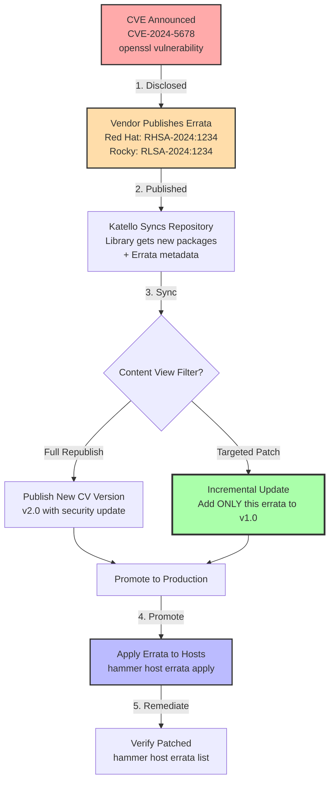
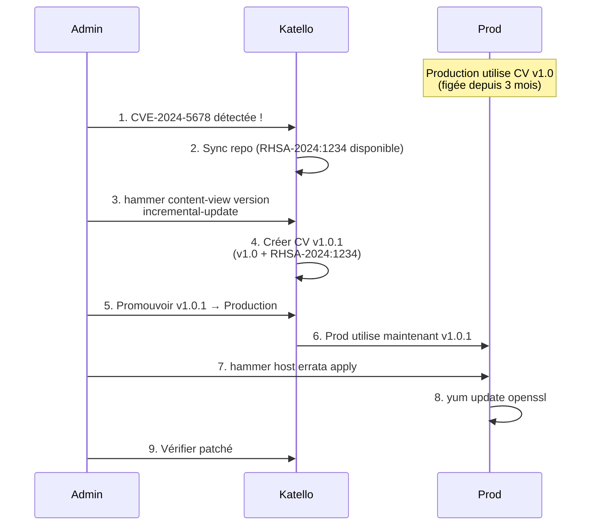

---
tags:
  - katello
  - patch-management
  - errata
  - cve
  - security
---

# Module 4 : Patch Management & Errata - La Chasse aux CVE

## Introduction

> **"Security is not an option."**

Vous avez maintenant une flotte de serveurs Linux enrôlés dans Katello, consommant des **Content Views** figées. Mais une question critique se pose :

**Comment patcher une faille de sécurité sans tout mettre à jour ?**

**Le problème du patching à grande échelle :**

| Scénario | Risque |
|----------|--------|
| **Zero-Day CVE** | `openssl` vulnérable (CVE-2024-XXXX). Vous devez patcher **200 serveurs** en urgence. |
| **Frozen State** | Vos Content Views sont figées en v1.0. Republier une v2.0 = tester 1000+ packages. |
| **Production critique** | Les serveurs web ne peuvent **pas redémarrer** en heures ouvrées. |
| **Compliance** | L'audit sécurité exige **100% des CVE Critical patchées en 24h**. |

**La solution Katello : Errata Management**

Les **Errata** sont des **bulletins de sécurité/correctifs** publiés par Red Hat (ou Rocky/AlmaLinux) qui décrivent :

- ✅ **CVE concernées** : Quelle vulnérabilité est corrigée
- ✅ **Packages affectés** : Quels RPM doivent être mis à jour
- ✅ **Severité** : Critical, Important, Moderate, Low
- ✅ **Type** : Security (RHSA), Bugfix (RHBA), Enhancement (RHEA)

**Avec Katello, vous pouvez :**

- 🔍 **Lister les CVE** applicables à vos serveurs
- 🎯 **Filtrer** les errata (ex: "Seulement les Security Critical")
- 🚀 **Appliquer** des correctifs de manière ciblée (sans tout updater)
- 📊 **Auditer** : Quels serveurs sont vulnérables à CVE-2024-1234 ?

Dans ce module, vous allez apprendre à :

- ✅ Comprendre les **types d'Errata** (RHSA, RHBA, RHEA)
- ✅ Créer des **filtres de Content View** (Security Only, Exclude Kernel)
- ✅ Utiliser les **Incremental Updates** (ajouter 1 seul patch à une CV figée)
- ✅ Appliquer des correctifs avec **Remote Execution**
- ✅ Gérer un **scénario Zero-Day** en production

---

## Concept : Les Errata

### Qu'est-ce qu'un Erratum ?

Un **Erratum** (pluriel : **Errata**) est un **bulletin officiel** publié par :

- **Red Hat** : Pour RHEL (Red Hat Enterprise Linux)
- **Rocky Linux** : Pour Rocky Linux
- **AlmaLinux** : Pour AlmaLinux
- **CentOS** : Pour CentOS (historiquement)

**Structure d'un Erratum :**

| Champ | Description | Exemple |
|-------|-------------|---------|
| **ID** | Identifiant unique | `RHSA-2024:1234` |
| **Type** | Security, Bugfix, Enhancement | `Security` |
| **Severité** | Critical, Important, Moderate, Low | `Critical` |
| **Titre** | Description courte | `Important: openssl security update` |
| **CVE** | Common Vulnerabilities and Exposures | `CVE-2024-5678` |
| **Packages** | RPM concernés | `openssl-3.0.7-25.el9.x86_64` |
| **Date** | Date de publication | `2024-03-15` |
| **Reboot Required** | Redémarrage nécessaire | `true` / `false` |

---

### Types d'Errata

**Red Hat utilise 3 préfixes :**

| Type | Préfixe | Description | Exemple |
|------|---------|-------------|---------|
| **Security** | `RHSA` | Correctifs de sécurité (CVE) | `RHSA-2024:1234` |
| **Bugfix** | `RHBA` | Corrections de bugs (non-sécurité) | `RHBA-2024:5678` |
| **Enhancement** | `RHEA` | Nouvelles fonctionnalités | `RHEA-2024:9012` |

**Équivalents Rocky Linux :**

| Type | Préfixe | Exemple |
|------|---------|---------|
| Security | `RLSA` | `RLSA-2024:1234` |
| Bugfix | `RLBA` | `RLBA-2024:5678` |
| Enhancement | `RLEA` | `RLEA-2024:9012` |

---

### Niveaux de Sévérité

Les errata de sécurité (RHSA/RLSA) sont classées par **sévérité** :

| Sévérité | Impact | SLA Recommandé | Exemple CVE |
|----------|--------|----------------|-------------|
| **Critical** | Exploitation à distance sans auth | **24h** | CVE-2014-0160 (Heartbleed) |
| **Important** | Exploitation avec conditions | **7 jours** | CVE-2021-44228 (Log4Shell) |
| **Moderate** | Impact limité ou local | **30 jours** | Déni de service local |
| **Low** | Impact minimal | **90 jours** | Information disclosure mineure |

**CVSS Score (Common Vulnerability Scoring System) :**

| Score CVSS | Sévérité |
|------------|----------|
| 9.0 - 10.0 | Critical |
| 7.0 - 8.9 | Important |
| 4.0 - 6.9 | Moderate |
| 0.1 - 3.9 | Low |

---

### Workflow de Patch Management



**Étapes :**

1. **CVE Announced** : Une vulnérabilité est découverte (ex: `CVE-2024-5678` dans `openssl`)
2. **Vendor Publishes Errata** : Red Hat publie `RHSA-2024:1234` avec le fix
3. **Katello Syncs** : Votre serveur Katello synchronise les repos + métadonnées Errata
4. **Filter Decision** :
    - **Full Republish** : Créer une nouvelle version de Content View (v2.0) avec tous les updates
    - **Incremental Update** : Ajouter **uniquement** cet erratum à la version existante (v1.0)
5. **Promote** : Promouvoir vers Production
6. **Apply Errata** : Exécuter `yum update` ou `hammer host errata apply`
7. **Verify** : Vérifier que les serveurs ne sont plus vulnérables

---

## Pratique : Content View Filters

### Qu'est-ce qu'un Filtre ?

Un **Content View Filter** est une **règle** qui contrôle quels packages/errata sont inclus dans une Content View.

**Types de filtres :**

| Type | Description | Exemple |
|------|-------------|---------|
| **Include** | Inclure uniquement certains packages | Inclure seulement `nginx*` |
| **Exclude** | Exclure certains packages | Exclure `kernel*` (éviter updates noyau) |
| **Errata by ID** | Inclure/exclure des errata spécifiques | Inclure `RHSA-2024:1234` |
| **Errata by Date** | Inclure les errata avant/après une date | Inclure errata jusqu'au 2024-03-01 |
| **Errata by Type** | Filtrer par type (Security, Bugfix, Enhancement) | Inclure seulement Security |

---

### Cas d'Usage : "Security Only"

**Objectif :** Ne patcher **que les failles de sécurité**, pas les bugfixes ni enhancements.

**Étapes :**

#### 1. Créer un Filtre Errata

```bash
hammer content-view filter create \
  --name "Security-Only" \
  --type "erratum" \
  --inclusion true \
  --content-view "CV-Rocky9" \
  --organization "Default Organization"
```

**Paramètres :**

| Paramètre | Description |
|-----------|-------------|
| `--type erratum` | Filtrer les errata (pas les RPM) |
| `--inclusion true` | Mode inclusion (inclure uniquement ce qui match) |

#### 2. Ajouter une Règle "Security Only"

```bash
hammer content-view filter rule create \
  --content-view "CV-Rocky9" \
  --content-view-filter "Security-Only" \
  --types "security" \
  --organization "Default Organization"
```

**Résultat :** Seuls les errata de type **Security** (RHSA/RLSA) seront inclus dans la Content View.

#### 3. Publier la Content View

```bash
hammer content-view publish \
  --name "CV-Rocky9" \
  --organization "Default Organization"
```

**Vérifier :**

```bash
hammer content-view version list \
  --content-view "CV-Rocky9" \
  --organization "Default Organization"
```

**Sortie attendue :**

```
---|-----------|---------|
ID | NAME      | VERSION |
---|-----------|---------|
2  | CV-Rocky9 | 2.0     | ← Nouvelle version avec filtre Security-Only
1  | CV-Rocky9 | 1.0     |
---|-----------|---------|
```

---

### Cas d'Usage : "Exclude Kernel Updates"

**Objectif :** Empêcher les mises à jour du noyau (risque de reboot, drivers incompatibles).

**Étapes :**

#### 1. Créer un Filtre RPM

```bash
hammer content-view filter create \
  --name "Exclude-Kernel" \
  --type "rpm" \
  --inclusion false \
  --content-view "CV-Rocky9" \
  --organization "Default Organization"
```

**`--inclusion false`** = Mode **Exclusion** (exclure ce qui match).

#### 2. Ajouter une Règle "kernel*"

```bash
hammer content-view filter rule create \
  --content-view "CV-Rocky9" \
  --content-view-filter "Exclude-Kernel" \
  --name "kernel*" \
  --organization "Default Organization"
```

**Résultat :** Tous les packages `kernel`, `kernel-core`, `kernel-modules`, etc. sont **exclus**.

#### 3. Publier

```bash
hammer content-view publish --name "CV-Rocky9"
```

**Tester sur un client :**

```bash
dnf list updates
```

**Sortie attendue :** Aucun update de `kernel*` n'apparaît.

---

## Pratique : Composite Content Views

### Qu'est-ce qu'une Composite Content View ?

Une **Composite Content View (CCV)** est une **combinaison** de plusieurs Content Views.

**Cas d'usage :**

| Scenario | Composition |
|----------|-------------|
| **Base + Security** | `CV-Rocky9-Base` (figée v1.0) + `CV-Rocky9-Security` (v2.0 avec patches) |
| **Multi-repo** | `CV-BaseOS` + `CV-AppStream` + `CV-EPEL` |
| **App + DB** | `CV-Nginx` + `CV-PostgreSQL` |

**Avantages :**

- ✅ **Modularité** : Mettre à jour uniquement la partie sécurité sans toucher à la base
- ✅ **Réutilisabilité** : `CV-Rocky9-Base` utilisée par plusieurs CCV
- ✅ **Granularité** : Promouvoir `CV-Security` en Prod sans attendre `CV-Base`

---

### Créer une Composite Content View

**Scenario :** Combiner `CV-Rocky9-Base` + `CV-Rocky9-Security`.

#### 1. Créer la CCV

```bash
hammer content-view create \
  --name "CCV-Rocky9-Production" \
  --composite \
  --organization "Default Organization"
```

**`--composite`** : Indique que c'est une Composite Content View.

#### 2. Ajouter les Composants

```bash
# Ajouter CV-Rocky9-Base version 1.0
hammer content-view component add \
  --composite-content-view "CCV-Rocky9-Production" \
  --component-content-view "CV-Rocky9-Base" \
  --latest \
  --organization "Default Organization"

# Ajouter CV-Rocky9-Security version 2.0
hammer content-view component add \
  --composite-content-view "CCV-Rocky9-Production" \
  --component-content-view "CV-Rocky9-Security" \
  --latest \
  --organization "Default Organization"
```

**`--latest`** : Utiliser automatiquement la dernière version publiée.

#### 3. Publier la CCV

```bash
hammer content-view publish \
  --name "CCV-Rocky9-Production" \
  --organization "Default Organization"
```

#### 4. Promouvoir

```bash
hammer content-view version promote \
  --content-view "CCV-Rocky9-Production" \
  --version 1.0 \
  --to-lifecycle-environment "Production" \
  --organization "Default Organization"
```

---

## Pratique : Incremental Updates

### Qu'est-ce qu'un Incremental Update ?

Un **Incremental Update** permet d'ajouter **un ou plusieurs errata** à une version **existante** de Content View **sans republier**.

**Problème résolu :**

| Sans Incremental Update | Avec Incremental Update |
|-------------------------|-------------------------|
| CVE critique détectée | CVE critique détectée |
| Republier CV v2.0 (1000+ packages) | Ajouter **uniquement** l'erratum à v1.0 |
| Tester v2.0 (2-3 jours) | Appliquer en 1h |
| Promouvoir v2.0 | Promouvoir v1.0 + erratum |

**Cas d'usage :**

- 🔥 **Zero-Day** : Patcher `openssl` en urgence
- 🎯 **Patch ciblé** : Ajouter 1 seul correctif sans changer le reste
- ⚡ **Rapidité** : Pas de tests de régression complets

---

### Workflow Incremental Update



---

### Créer un Incremental Update

**Scenario :** Ajouter l'erratum `RHSA-2024:1234` à la version `CV-Rocky9 v1.0` en Production.

#### 1. Lister les Versions de CV

```bash
hammer content-view version list \
  --content-view "CV-Rocky9" \
  --organization "Default Organization"
```

**Sortie exemple :**

```
---|-----------|---------|-------------------|
ID | NAME      | VERSION | LIFECYCLE ENVS    |
---|-----------|---------|-------------------|
1  | CV-Rocky9 | 1.0     | Production        |
---|-----------|---------|-------------------|
```

#### 2. Trouver l'ID de l'Erratum

```bash
hammer erratum list \
  --search "RHSA-2024:1234" \
  --organization "Default Organization"
```

**Sortie exemple :**

```
---|------------------|------|----------|
ID | ERRATA ID        | TYPE | TITLE    |
---|------------------|------|----------|
42 | RHSA-2024:1234   | security | Important: openssl security update |
---|------------------|------|----------|
```

#### 3. Créer l'Incremental Update

```bash
hammer content-view version incremental-update \
  --content-view-version-id 1 \
  --errata-ids 42 \
  --lifecycle-environments "Production" \
  --organization "Default Organization"
```

**Paramètres :**

| Paramètre | Description |
|-----------|-------------|
| `--content-view-version-id` | ID de la version CV à updater |
| `--errata-ids` | IDs des errata à ajouter (séparés par des virgules) |
| `--lifecycle-environments` | Environnements à mettre à jour |

**Sortie attendue :**

```
Incremental update is being performed. To monitor the progress, run:
  hammer task progress --id 12345
```

**Suivre la progression :**

```bash
hammer task progress --id 12345
```

**Vérifier la nouvelle version :**

```bash
hammer content-view version list --content-view "CV-Rocky9"
```

**Sortie attendue :**

```
---|-----------|---------|-------------------|
ID | NAME      | VERSION | LIFECYCLE ENVS    |
---|-----------|---------|-------------------|
2  | CV-Rocky9 | 1.1     | Production        | ← Incremental Update
1  | CV-Rocky9 | 1.0     | Library           |
---|-----------|---------|-------------------|
```

**Note :** La version passe de `1.0` à `1.1` (incrémentation automatique).

---

## Pratique : Appliquer les Errata

### Lister les Errata Applicables à un Serveur

```bash
hammer host errata list \
  --host "web-server-01.example.com" \
  --organization "Default Organization"
```

**Sortie exemple :**

```
---|------------------|---------|----------|------|
ID | ERRATA ID        | TYPE    | TITLE    | INSTALLABLE |
---|------------------|---------|----------|------|
42 | RHSA-2024:1234   | security| openssl  | true |
43 | RHBA-2024:5678   | bugfix  | systemd  | true |
---|------------------|---------|----------|------|
```

**Colonnes :**

| Colonne | Description |
|---------|-------------|
| `ERRATA ID` | Identifiant du bulletin |
| `TYPE` | Security, Bugfix, Enhancement |
| `INSTALLABLE` | `true` = disponible dans la Content View actuelle |

---

### Lister les CVE d'un Erratum

```bash
hammer erratum info \
  --id "RHSA-2024:1234" \
  --organization "Default Organization"
```

**Sortie exemple :**

```
ID:                42
Errata ID:         RHSA-2024:1234
Type:              security
Severity:          Important
Issued:            2024-03-15
Updated:           2024-03-15
CVEs:              CVE-2024-5678, CVE-2024-5679
Packages:          openssl-3.0.7-25.el9.x86_64
Reboot Suggested:  false
```

---

### Appliquer un Erratum sur un Serveur

#### Méthode 1 : Via Hammer (Remote Execution)

```bash
hammer host errata apply \
  --host "web-server-01.example.com" \
  --errata-ids "RHSA-2024:1234" \
  --organization "Default Organization"
```

**Sortie attendue :**

```
Errata is being applied to host web-server-01.example.com
  To monitor the progress, run:
  hammer task progress --id 67890
```

**Suivre la progression :**

```bash
hammer task progress --id 67890
```

**Vérifier l'application :**

```bash
hammer host errata list --host "web-server-01.example.com"
```

**Sortie attendue :** `RHSA-2024:1234` ne doit plus apparaître.

---

#### Méthode 2 : Manuellement sur le Client

Depuis le client :

```bash
# Lister les updates disponibles
sudo dnf updateinfo list

# Voir les détails d'un erratum
sudo dnf updateinfo info RHSA-2024:1234

# Installer uniquement cet erratum
sudo dnf update --advisory=RHSA-2024:1234 -y

# Vérifier
rpm -q openssl
```

---

### Appliquer des Errata à une Host Collection

**Patcher tous les serveurs d'un groupe :**

```bash
hammer host-collection erratum install \
  --name "web-servers" \
  --errata "RHSA-2024:1234" \
  --organization "Default Organization"
```

**Résultat :** Tous les serveurs de la collection `web-servers` installent l'erratum.

---

## Remote Execution vs Katello Agent

### Comparaison

| Méthode | Technologie | Support | Avantages | Inconvénients |
|---------|-------------|---------|-----------|---------------|
| **Katello Agent** | Qpid (message broker) | ❌ Obsolète (Pulp 2) | Push instantané | Déprécié, pas de Pulp 3 |
| **Remote Execution (REX)** | SSH + Ansible | ✅ Moderne | Utilise SSH (standard), scalable | Nécessite accès SSH |
| **Manuel (Client)** | `dnf update` | ✅ Toujours dispo | Aucune dépendance | Pas de centralisation |

**Recommandation : Remote Execution (REX).**

---

### Configurer Remote Execution

#### 1. Installer le Plugin

Sur le serveur Katello :

```bash
sudo foreman-installer --enable-foreman-plugin-remote-execution
```

#### 2. Configurer SSH

Générer une clé SSH pour Foreman :

```bash
sudo -u foreman ssh-keygen -t rsa -b 4096 -N '' -f /usr/share/foreman-proxy/.ssh/id_rsa_foreman_proxy
```

Distribuer la clé publique sur les clients :

```bash
# Sur chaque client
sudo mkdir -p /root/.ssh
echo "ssh-rsa AAAAB3Nza... foreman-proxy@katello" >> /root/.ssh/authorized_keys
sudo chmod 600 /root/.ssh/authorized_keys
```

**Alternative : Ansible Playbook pour déployer la clé.**

#### 3. Tester

```bash
hammer job-invocation create \
  --job-template "Run Command - SSH Default" \
  --inputs command="uptime" \
  --search-query "name = web-server-01.example.com"
```

**Sortie attendue :**

```
Job invocation 123 created
  To monitor the progress, run:
  hammer job-invocation info --id 123
```

---

## Bonnes Pratiques

### 1. ✅ Prioriser les CVE Critical

**Script de monitoring :**

```bash
#!/bin/bash
# check-critical-cves.sh

ORG="Default Organization"
CRITICAL_THRESHOLD=10

# Compter les errata Critical non appliqués
CRITICAL_COUNT=$(hammer erratum list \
  --organization "$ORG" \
  --search "severity = Critical AND type = security" \
  --fields "Errata ID" | tail -n +2 | wc -l)

if [ $CRITICAL_COUNT -gt $CRITICAL_THRESHOLD ]; then
  echo "⚠️  ALERTE : $CRITICAL_COUNT errata Critical non appliqués"
  # Envoyer un email/notification
else
  echo "✅ OK : $CRITICAL_COUNT errata Critical"
fi
```

---

### 2. ✅ Tester avant Production

**Workflow recommandé :**

| Environnement | Action | Délai |
|---------------|--------|-------|
| **Library** | Sync quotidien | Automatique |
| **Dev** | Promouvoir tous les errata | Immédiat |
| **Test** | Promouvoir errata testés | +2 jours |
| **Canary** | Promouvoir sur 5 serveurs pilotes | +1 jour |
| **Production** | Promouvoir si Canary OK | +1 jour |

**Total : 4 jours** entre sync et production (sauf urgence Critical).

---

### 3. ✅ Automatiser avec Ansible

**Playbook : Appliquer tous les errata Security :**

```yaml
---
- name: Apply Security Errata
  hosts: all
  gather_facts: no

  tasks:
    - name: Update all security errata
      ansible.builtin.dnf:
        name: "*"
        state: latest
        security: yes
        update_only: yes

    - name: Check if reboot required
      ansible.builtin.stat:
        path: /var/run/reboot-required
      register: reboot_required

    - name: Reboot if required
      ansible.builtin.reboot:
        msg: "Reboot initiated by Ansible (security patches)"
        reboot_timeout: 300
      when: reboot_required.stat.exists
```

**Exécution :**

```bash
ansible-playbook apply-security-errata.yml --limit production
```

---

### 4. ✅ Documenter les Exceptions

**Cas d'usage :** Un serveur legacy ne peut **pas** installer un patch (incompatibilité).

**Solution :** Documenter l'exception.

**Fichier : `patch-exceptions.yml`**

```yaml
exceptions:
  - host: legacy-app-01.example.com
    errata: RHSA-2024:1234
    reason: "Incompatibilité avec Oracle DB 11g"
    approved_by: "John Doe (CISO)"
    expiration: 2024-06-01
    mitigation: "Serveur isolé sur VLAN dédié, aucun accès Internet"
```

**Audit :** Revoir trimestriellement.

---

### 5. ✅ Monitorer le Compliance

**Script de rapport :**

```bash
#!/bin/bash
# compliance-report.sh

ORG="Default Organization"

echo "========================================="
echo "📊 KATELLO COMPLIANCE REPORT"
echo "========================================="
echo ""

# TOTAL HOSTS
TOTAL_HOSTS=$(hammer host list --organization "$ORG" --fields Name | tail -n +2 | wc -l)
echo "Total Hosts: $TOTAL_HOSTS"

# HOSTS WITH ERRATA
HOSTS_WITH_ERRATA=$(hammer host list --organization "$ORG" --search "applicable_errata > 0" --fields Name | tail -n +2 | wc -l)
echo "Hosts with Applicable Errata: $HOSTS_WITH_ERRATA"

# COMPLIANCE RATE
COMPLIANT_HOSTS=$((TOTAL_HOSTS - HOSTS_WITH_ERRATA))
COMPLIANCE_RATE=$(awk "BEGIN {printf \"%.2f\", ($COMPLIANT_HOSTS / $TOTAL_HOSTS) * 100}")
echo "Compliance Rate: $COMPLIANCE_RATE%"

echo ""
echo "========================================="
echo "🔴 CRITICAL ERRATA (SEVERITY)"
echo "========================================="

# Lister les hosts avec errata Critical
hammer host list \
  --organization "$ORG" \
  --search "applicable_errata > 0" \
  --fields "Name,Applicable Errata"

echo ""
```

---

## Exercice : À Vous de Jouer

!!! example "Mise en Pratique : Scénario Zero-Day"
    **Objectif** : Gérer un patch de sécurité critique en urgence avec Incremental Updates.

    **Contexte** : Vous êtes Security Engineer dans **SecureCorp** (150 serveurs RHEL 9). Une CVE **Critical** (CVE-2024-5678, CVSS 9.8) est découverte dans `openssl`. Le CISO exige le patch de **TOUS** les serveurs Production en **24h**, sans toucher aux autres packages (conformité PCI-DSS).

    **Environnement Katello** :

    - **Organisation :** `SecureCorp`
    - **Content View :** `CV-RHEL9` (v1.0 en Production)
    - **Lifecycle Environments :** `Library → Development → Test → Production`
    - **Errata :** `RHSA-2024:1234` (openssl-3.0.7-25.el9)

    **Tâches à réaliser** :

    1. Synchroniser les repos pour obtenir l'erratum `RHSA-2024:1234`
    2. Créer un Incremental Update de `CV-RHEL9 v1.0` avec uniquement cet erratum
    3. Promouvoir la nouvelle version en Production
    4. Appliquer l'erratum sur tous les serveurs Production
    5. Générer un rapport de compliance

    **Critères de validation** :

    - [ ] Erratum identifié dans Katello
    - [ ] Incremental Update créé (v1.0.1)
    - [ ] Tous les serveurs patchés (vérification avec `rpm -q openssl`)
    - [ ] Rapport de compliance généré

### Mission

1. **Synchroniser** les repos pour obtenir l'erratum `RHSA-2024:1234`
2. **Identifier** l'ID de l'erratum dans Katello
3. **Créer** un Incremental Update de `CV-RHEL9 v1.0` avec **uniquement** cet erratum
4. **Promouvoir** la nouvelle version en Production
5. **Appliquer** l'erratum sur **tous** les serveurs Production
6. **Vérifier** que tous les serveurs sont patchés
7. **Générer** un rapport de compliance

---

### Prérequis

- Accès Hammer CLI sur le serveur Katello
- Remote Execution configuré (SSH vers les clients)
- Host Collection `production-servers` contenant les 150 serveurs

---

### Étapes

#### 1. Synchroniser les Repos

```bash
hammer repository synchronize \
  --name "RHEL9-BaseOS" \
  --product "Red Hat Enterprise Linux 9" \
  --organization "SecureCorp"
```

**Attendre la fin de la synchronisation** (suivre avec `hammer task progress`).

#### 2. Identifier l'Erratum

```bash
hammer erratum list \
  --search "RHSA-2024:1234" \
  --organization "SecureCorp"
```

**Sortie attendue :**

```
---|------------------|----------|----------|
ID | ERRATA ID        | TYPE     | SEVERITY |
---|------------------|----------|----------|
42 | RHSA-2024:1234   | security | Critical |
---|------------------|----------|----------|
```

**Noter l'ID : `42`**

#### 3. Créer l'Incremental Update

```bash
# Trouver l'ID de la version CV-RHEL9 v1.0 en Production
hammer content-view version list \
  --content-view "CV-RHEL9" \
  --organization "SecureCorp"

# ID = 1 (exemple)

# Créer l'Incremental Update
hammer content-view version incremental-update \
  --content-view-version-id 1 \
  --errata-ids 42 \
  --lifecycle-environments "Production" \
  --organization "SecureCorp"
```

**Sortie attendue :**

```
Incremental update is being performed. To monitor the progress, run:
  hammer task progress --id 99999
```

#### 4. Vérifier la Nouvelle Version

```bash
hammer content-view version list --content-view "CV-RHEL9"
```

**Sortie attendue :**

```
---|---------|---------|-------------------|
ID | NAME    | VERSION | LIFECYCLE ENVS    |
---|---------|---------|-------------------|
2  | CV-RHEL9| 1.1     | Production        | ← Incremental
1  | CV-RHEL9| 1.0     | Library           |
---|---------|---------|-------------------|
```

#### 5. Appliquer l'Erratum sur tous les Serveurs

```bash
hammer host-collection erratum install \
  --name "production-servers" \
  --errata "RHSA-2024:1234" \
  --organization "SecureCorp"
```

**Sortie attendue :**

```
Errata is being installed on 150 hosts.
  To monitor the progress, run:
  hammer task list --search "label = Actions::RemoteExecution::RunHostsJob"
```

#### 6. Vérifier le Patching

```bash
# Lister les hosts qui ont encore l'erratum applicable
hammer host list \
  --organization "SecureCorp" \
  --search "applicable_errata_ids = 42" \
  --fields "Name"
```

**Sortie attendue (après patching complet) :**

```
0 hosts found
```

#### 7. Générer un Rapport

```bash
# Version openssl installée sur tous les serveurs
hammer host list \
  --organization "SecureCorp" \
  --fields "Name,Installable Errata" | grep -c "RHSA-2024:1234"

# Devrait retourner 0 (aucun serveur vulnérable)
```

---

### Solution Complète

??? quote "**Solution : Script Automatisé de Patch Zero-Day**"

    **Fichier : `zero-day-patch.sh`**

    ```bash
    #!/bin/bash
    # zero-day-patch.sh
    # Script d'urgence pour patcher une CVE Critical via Incremental Update

    set -e

    # VARIABLES DE CONFIGURATION
    ORG="SecureCorp"
    CV_NAME="CV-RHEL9"
    ERRATA_ID_SEARCH="RHSA-2024:1234"
    REPO_NAME="RHEL9-BaseOS"
    PRODUCT_NAME="Red Hat Enterprise Linux 9"
    LIFECYCLE_ENV="Production"
    HOST_COLLECTION="production-servers"

    echo "========================================="
    echo "🚨 ZERO-DAY PATCH AUTOMATION"
    echo "========================================="
    echo "CVE:        CVE-2024-5678"
    echo "Errata:     $ERRATA_ID_SEARCH"
    echo "Package:    openssl"
    echo "Org:        $ORG"
    echo "========================================="

    # STEP 1 : SYNCHRONISER LES REPOS
    echo ""
    echo "📋 Step 1: Synchronisation des repositories..."
    SYNC_TASK=$(hammer repository synchronize \
      --name "$REPO_NAME" \
      --product "$PRODUCT_NAME" \
      --organization "$ORG" \
      --async | grep -oP 'id \K\d+')

    echo "Sync Task ID: $SYNC_TASK"
    echo "⏳ Attente de la fin de la synchronisation..."

    # Attendre la fin de la tâche
    while true; do
      STATUS=$(hammer task info --id "$SYNC_TASK" --fields State | grep State | awk '{print $2}')
      if [ "$STATUS" == "stopped" ]; then
        echo "✅ Synchronisation terminée"
        break
      elif [ "$STATUS" == "paused" ] || [ "$STATUS" == "error" ]; then
        echo "❌ Erreur de synchronisation"
        exit 1
      fi
      sleep 10
    done

    # STEP 2 : IDENTIFIER L'ERRATUM
    echo ""
    echo "📋 Step 2: Recherche de l'erratum $ERRATA_ID_SEARCH..."

    ERRATA_ID=$(hammer erratum list \
      --organization "$ORG" \
      --search "$ERRATA_ID_SEARCH" \
      --fields ID | tail -n 1 | awk '{print $1}')

    if [ -z "$ERRATA_ID" ]; then
      echo "❌ Erratum $ERRATA_ID_SEARCH introuvable"
      exit 1
    else
      echo "✅ Erratum trouvé : ID = $ERRATA_ID"
    fi

    # Afficher les détails
    hammer erratum info --id "$ERRATA_ID" --organization "$ORG"

    # STEP 3 : TROUVER LA VERSION CV EN PRODUCTION
    echo ""
    echo "📋 Step 3: Recherche de la version CV en Production..."

    CV_VERSION_ID=$(hammer content-view version list \
      --content-view "$CV_NAME" \
      --organization "$ORG" \
      --lifecycle-environment "$LIFECYCLE_ENV" \
      --fields ID | tail -n 1 | awk '{print $1}')

    if [ -z "$CV_VERSION_ID" ]; then
      echo "❌ Aucune version de $CV_NAME trouvée en $LIFECYCLE_ENV"
      exit 1
    else
      echo "✅ Version CV trouvée : ID = $CV_VERSION_ID"
    fi

    # STEP 4 : CRÉER L'INCREMENTAL UPDATE
    echo ""
    echo "📋 Step 4: Création de l'Incremental Update..."

    INC_UPDATE_TASK=$(hammer content-view version incremental-update \
      --content-view-version-id "$CV_VERSION_ID" \
      --errata-ids "$ERRATA_ID" \
      --lifecycle-environments "$LIFECYCLE_ENV" \
      --organization "$ORG" \
      --async | grep -oP 'id \K\d+')

    echo "Incremental Update Task ID: $INC_UPDATE_TASK"
    echo "⏳ Attente de la fin de l'Incremental Update..."

    # Attendre la fin de la tâche
    while true; do
      STATUS=$(hammer task info --id "$INC_UPDATE_TASK" --fields State | grep State | awk '{print $2}')
      if [ "$STATUS" == "stopped" ]; then
        echo "✅ Incremental Update terminé"
        break
      elif [ "$STATUS" == "paused" ] || [ "$STATUS" == "error" ]; then
        echo "❌ Erreur lors de l'Incremental Update"
        exit 1
      fi
      sleep 10
    done

    # STEP 5 : VÉRIFIER LA NOUVELLE VERSION
    echo ""
    echo "📋 Step 5: Vérification de la nouvelle version CV..."

    hammer content-view version list \
      --content-view "$CV_NAME" \
      --organization "$ORG"

    # STEP 6 : APPLIQUER L'ERRATUM SUR TOUS LES SERVEURS
    echo ""
    echo "📋 Step 6: Application de l'erratum sur la Host Collection '$HOST_COLLECTION'..."

    APPLY_TASK=$(hammer host-collection erratum install \
      --name "$HOST_COLLECTION" \
      --errata "$ERRATA_ID_SEARCH" \
      --organization "$ORG" \
      --async | grep -oP 'id \K\d+')

    echo "Apply Task ID: $APPLY_TASK"
    echo "⏳ Attente de l'application sur tous les serveurs..."

    # STEP 7 : MONITORER LA PROGRESSION
    echo ""
    echo "📋 Step 7: Monitoring de la progression..."

    while true; do
      STATUS=$(hammer task info --id "$APPLY_TASK" --fields State | grep State | awk '{print $2}')
      if [ "$STATUS" == "stopped" ]; then
        echo "✅ Application terminée sur tous les serveurs"
        break
      elif [ "$STATUS" == "paused" ] || [ "$STATUS" == "error" ]; then
        echo "⚠️  Erreur lors de l'application (vérifier manuellement)"
        break
      fi
      sleep 30
    done

    # STEP 8 : VÉRIFIER LE COMPLIANCE
    echo ""
    echo "📋 Step 8: Vérification du compliance..."

    VULNERABLE_HOSTS=$(hammer host list \
      --organization "$ORG" \
      --search "applicable_errata_ids = $ERRATA_ID" \
      --fields Name | tail -n +2 | wc -l)

    if [ "$VULNERABLE_HOSTS" -eq 0 ]; then
      echo "✅ Tous les serveurs sont patchés"
    else
      echo "⚠️  $VULNERABLE_HOSTS serveurs encore vulnérables :"
      hammer host list \
        --organization "$ORG" \
        --search "applicable_errata_ids = $ERRATA_ID" \
        --fields Name
    fi

    # STEP 9 : GÉNÉRER UN RAPPORT
    echo ""
    echo "========================================="
    echo "📊 RAPPORT FINAL"
    echo "========================================="

    TOTAL_HOSTS=$(hammer host list --organization "$ORG" --fields Name | tail -n +2 | wc -l)
    PATCHED_HOSTS=$((TOTAL_HOSTS - VULNERABLE_HOSTS))
    COMPLIANCE_RATE=$(awk "BEGIN {printf \"%.2f\", ($PATCHED_HOSTS / $TOTAL_HOSTS) * 100}")

    echo "Total Hosts:           $TOTAL_HOSTS"
    echo "Patched Hosts:         $PATCHED_HOSTS"
    echo "Vulnerable Hosts:      $VULNERABLE_HOSTS"
    echo "Compliance Rate:       $COMPLIANCE_RATE%"
    echo ""
    echo "Errata Applied:        $ERRATA_ID_SEARCH ($ERRATA_ID)"
    echo "CVE:                   CVE-2024-5678"
    echo "Severity:              Critical"
    echo ""
    echo "========================================="

    if [ "$VULNERABLE_HOSTS" -eq 0 ]; then
      echo "✅ PATCH ZERO-DAY RÉUSSI"
    else
      echo "⚠️  PATCHING PARTIEL - ACTIONS REQUISES"
    fi

    echo "========================================="
    ```

    **Exécution :**

    ```bash
    chmod +x zero-day-patch.sh
    ./zero-day-patch.sh
    ```

    **Sortie attendue :**

    ```
    =========================================
    🚨 ZERO-DAY PATCH AUTOMATION
    =========================================
    CVE:        CVE-2024-5678
    Errata:     RHSA-2024:1234
    Package:    openssl
    Org:        SecureCorp
    =========================================

    📋 Step 1: Synchronisation des repositories...
    Sync Task ID: 12345
    ⏳ Attente de la fin de la synchronisation...
    ✅ Synchronisation terminée

    📋 Step 2: Recherche de l'erratum RHSA-2024:1234...
    ✅ Erratum trouvé : ID = 42

    ID:                42
    Errata ID:         RHSA-2024:1234
    Type:              security
    Severity:          Critical
    CVEs:              CVE-2024-5678

    📋 Step 3: Recherche de la version CV en Production...
    ✅ Version CV trouvée : ID = 1

    📋 Step 4: Création de l'Incremental Update...
    Incremental Update Task ID: 67890
    ⏳ Attente de la fin de l'Incremental Update...
    ✅ Incremental Update terminé

    📋 Step 5: Vérification de la nouvelle version CV...
    ID | NAME     | VERSION | LIFECYCLE ENVS
    2  | CV-RHEL9 | 1.1     | Production
    1  | CV-RHEL9 | 1.0     | Library

    📋 Step 6: Application de l'erratum sur la Host Collection 'production-servers'...
    Apply Task ID: 11111
    ⏳ Attente de l'application sur tous les serveurs...

    📋 Step 7: Monitoring de la progression...
    ✅ Application terminée sur tous les serveurs

    📋 Step 8: Vérification du compliance...
    ✅ Tous les serveurs sont patchés

    =========================================
    📊 RAPPORT FINAL
    =========================================
    Total Hosts:           150
    Patched Hosts:         150
    Vulnerable Hosts:      0
    Compliance Rate:       100.00%

    Errata Applied:        RHSA-2024:1234 (42)
    CVE:                   CVE-2024-5678
    Severity:              Critical

    =========================================
    ✅ PATCH ZERO-DAY RÉUSSI
    =========================================
    ```

---

## Points Clés à Retenir

### ✅ Errata

- **Types** : Security (RHSA), Bugfix (RHBA), Enhancement (RHEA)
- **Sévérité** : Critical, Important, Moderate, Low
- **Contenu** : CVE, Packages, Reboot Required

### ✅ Content View Filters

- **Include/Exclude** : Contrôler quels packages/errata sont inclus
- **Types** : RPM, Errata by ID/Date/Type
- **Cas d'usage** : Security Only, Exclude Kernel

### ✅ Incremental Updates

- **Objectif** : Ajouter 1+ errata à une CV existante sans republier
- **Commande** : `hammer content-view version incremental-update`
- **Cas d'usage** : Zero-Day, patch ciblé urgent

### ✅ Remediation

- **hammer host errata list** : Lister les errata applicables
- **hammer host errata apply** : Appliquer des errata via Remote Execution
- **hammer host-collection erratum install** : Patcher une collection entière

### ✅ Bonnes Pratiques

- ✅ Prioriser CVE Critical (SLA 24h)
- ✅ Tester avant Production (Dev → Test → Canary → Prod)
- ✅ Automatiser avec Ansible
- ✅ Documenter les exceptions
- ✅ Monitorer le compliance

---

## Prochaines Étapes

Dans le **Module 5 : TP Final**, vous allez mettre en pratique tout ce que vous avez appris :

- Déployer une infrastructure Katello multi-sites
- Gérer le cycle de vie complet (Sync → Publish → Promote)
- Gérer un incident Zero-Day en conditions réelles
- Automatiser avec Ansible Tower / AWX

**Vous êtes maintenant capable de gérer les vulnérabilités à l'échelle entreprise !** 🦁

---

**Ressources :**

- [Red Hat Errata](https://access.redhat.com/errata/)
- [CVE Database](https://cve.mitre.org/)
- [Katello Content View Filters](https://docs.theforeman.org/nightly/Managing_Content/index-katello.html#Creating_a_Content_View_Filter_content-management)
- [Incremental Updates](https://docs.theforeman.org/nightly/Managing_Content/index-katello.html#Updating_a_Content_View_Version_content-management)
