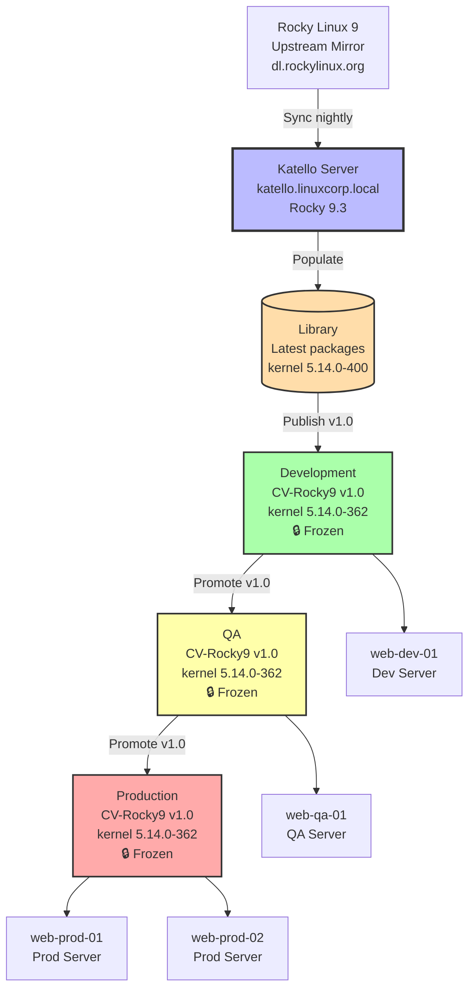

---
tags:
  - katello
  - tp-final
  - rocky-linux
  - lifecycle
  - errata
---

# Module 5 : TP Final - L'Usine Logicielle RHEL

## Introduction

> **"La théorie, c'est bien. La pratique, c'est mieux."**

Vous avez parcouru les 4 modules de la formation **Katello Lifecycle** :

- ✅ **Module 1** : Architecture & Installation
- ✅ **Module 2** : Gestion du Contenu (Content Views, Lifecycle Environments)
- ✅ **Module 3** : Gestion des Hôtes (Activation Keys, Registration)
- ✅ **Module 4** : Patch Management & Errata (CVE, Incremental Updates)

**Il est temps de mettre en pratique !**

Ce **TP Final** vous met dans la peau d'un **Infrastructure Architect** chargé de déployer une infrastructure Katello complète pour **LinuxCorp**, une entreprise en pleine croissance.

---

## Contexte : LinuxCorp Migration

### L'Entreprise

**LinuxCorp** est une entreprise de services numériques comptant :

- **200 serveurs Rocky Linux 9** (web, bases de données, monitoring)
- **3 datacenters** (Paris, Londres, New York)
- **Infrastructure hybride** (On-Prem + Cloud AWS)

### Problématique Actuelle

Actuellement, LinuxCorp gère ses mises à jour de manière **chaotique** :

| Problème | Impact |
|----------|--------|
| **Pas de centralisation** | Chaque admin patche "à la main" avec `dnf update` |
| **Aucun contrôle de version** | Impossible de savoir quelle version de `nginx` tourne en Prod |
| **Failles de sécurité** | CVE Critical non patchées depuis 3 mois |
| **Pas de tests** | Updates poussées directement en Prod → incidents |
| **Audit impossible** | Aucune traçabilité (qui a installé quoi, quand ?) |

### Directive de la Direction

La **DSI** a décidé d'implémenter **Katello** pour :

1. ✅ **Centraliser** la gestion des repos RPM
2. ✅ **Contrôler** les versions de packages (frozen state)
3. ✅ **Tester** les updates avant Production (Dev → QA → Prod)
4. ✅ **Patcher** rapidement les CVE Critical (<24h)
5. ✅ **Auditer** toutes les installations/mises à jour

**Vous êtes l'architecte en charge du projet.**

---

## Objectifs du TP

À la fin de ce TP, vous aurez déployé une infrastructure Katello complète avec :

1. ✅ **Serveur Katello** opérationnel
2. ✅ **Repos synchronisés** : Rocky Linux 9 BaseOS + AppStream
3. ✅ **Lifecycle Environments** : Library → Development → QA → Production
4. ✅ **Content Views** avec filtres (exclusion kernel instable)
5. ✅ **Serveur de test enrôlé** (`web-dev-01`)
6. ✅ **Simulation de patching** d'une CVE Critical

---

## Architecture Cible



---

## Prérequis Techniques

### Serveur Katello

| Composant | Spécification |
|-----------|---------------|
| **OS** | Rocky Linux 9.3 (minimal install) |
| **CPU** | 4 vCPUs minimum |
| **RAM** | 16 GB minimum (20 GB recommandé) |
| **Disque** | 500 GB (pour stocker les repos) |
| **Hostname** | `katello.linuxcorp.local` (FQDN obligatoire) |
| **IP** | Statique (ex: `192.168.1.100`) |
| **Réseau** | Accès Internet pour synchronisation |

### Serveur de Test (web-dev-01)

| Composant | Spécification |
|-----------|---------------|
| **OS** | Rocky Linux 9.3 (minimal install) |
| **CPU** | 2 vCPUs |
| **RAM** | 4 GB |
| **Disque** | 50 GB |
| **Hostname** | `web-dev-01.linuxcorp.local` |
| **IP** | Statique (ex: `192.168.1.101`) |

### Réseau

- DNS configuré (A records pour `katello` et `web-dev-01`)
- Firewall : Autoriser port 80/443 (HTTP/HTTPS) depuis les clients vers Katello

---

## Étape 1 : Installation Katello (Module 1)

### Objectif

Déployer un serveur Katello opérationnel avec :

- Foreman
- Katello (Pulp 3, Candlepin)
- PostgreSQL
- Certificats SSL auto-signés

---

### Actions

#### 1.1. Préparer le Système

Sur le serveur Katello (`192.168.1.100`) :

```bash
# Se connecter en root
sudo -i

# Vérifier le hostname FQDN
hostnamectl set-hostname katello.linuxcorp.local
hostname -f  # Doit retourner : katello.linuxcorp.local

# Mettre à jour le système
dnf update -y

# Désactiver SELinux (temporaire pour simplifier le TP)
# ⚠️ En production : configurer SELinux correctement
setenforce 0
sed -i 's/^SELINUX=.*/SELINUX=permissive/' /etc/selinux/config

# Configurer le firewall
firewall-cmd --add-service=http --permanent
firewall-cmd --add-service=https --permanent
firewall-cmd --add-port=5647/tcp --permanent  # Katello Agent
firewall-cmd --reload
```

---

#### 1.2. Installer les Repositories

```bash
# Installer EPEL
dnf install -y epel-release

# Installer Foreman Release
dnf install -y https://yum.theforeman.org/releases/3.9/el9/x86_64/foreman-release.rpm

# Installer Katello Release
dnf install -y https://yum.theforeman.org/katello/4.11/katello/el9/x86_64/katello-repos-latest.rpm

# Activer le module Ruby 3.1
dnf module enable -y ruby:3.1

# Mettre à jour
dnf update -y
```

---

#### 1.3. Installer Katello

```bash
# Installer le package foreman-installer-katello
dnf install -y foreman-installer-katello

# Lancer l'installation (⏳ 15-20 minutes)
foreman-installer --scenario katello \
  --foreman-initial-admin-username admin \
  --foreman-initial-admin-password P@ssw0rd123
```

**Sortie attendue :**

```
  Success!
  * Katello is running at https://katello.linuxcorp.local
      Initial credentials are admin / P@ssw0rd123
  * To use Hammer CLI, run the following command:
      hammer -u admin -p P@ssw0rd123 organization list
```

---

#### 1.4. Vérifier l'Installation

```bash
# Vérifier les services
systemctl status foreman
systemctl status postgresql
systemctl status pulpcore-api
systemctl status pulpcore-content

# Tester Hammer CLI
hammer -u admin -p P@ssw0rd123 organization list
```

**Sortie attendue :**

```
---|-----------------|
ID | NAME            |
---|-----------------|
1  | Default Organization |
---|-----------------|
```

---

#### 1.5. Configurer Hammer CLI (Permanent)

```bash
# Créer le fichier de configuration
mkdir -p ~/.hammer
cat > ~/.hammer/cli.modules.d/foreman.yml << 'EOF'
:foreman:
  :host: 'https://katello.linuxcorp.local'
  :username: 'admin'
  :password: 'P@ssw0rd123'
  :request_timeout: -1
EOF

# Tester (sans credentials)
hammer organization list
```

---

## Étape 2 : Synchronisation du Contenu (Module 2)

### Objectif

Synchroniser les repos Rocky Linux 9 (BaseOS + AppStream) dans Katello.

---

### Actions

#### 2.1. Créer un Produit

```bash
hammer product create \
  --name "Rocky Linux 9" \
  --organization "Default Organization"
```

---

#### 2.2. Créer les Repositories

**BaseOS :**

```bash
hammer repository create \
  --name "Rocky-BaseOS-9" \
  --product "Rocky Linux 9" \
  --content-type "yum" \
  --url "https://dl.rockylinux.org/pub/rocky/9/BaseOS/x86_64/os/" \
  --download-policy "immediate" \
  --organization "Default Organization"
```

**AppStream :**

```bash
hammer repository create \
  --name "Rocky-AppStream-9" \
  --product "Rocky Linux 9" \
  --content-type "yum" \
  --url "https://dl.rockylinux.org/pub/rocky/9/AppStream/x86_64/os/" \
  --download-policy "immediate" \
  --organization "Default Organization"
```

---

#### 2.3. Synchroniser les Repositories (⏳ 30-60 min)

```bash
# Synchroniser BaseOS
hammer repository synchronize \
  --name "Rocky-BaseOS-9" \
  --product "Rocky Linux 9" \
  --organization "Default Organization" \
  --async

# Synchroniser AppStream
hammer repository synchronize \
  --name "Rocky-AppStream-9" \
  --product "Rocky Linux 9" \
  --organization "Default Organization" \
  --async

# Suivre la progression
hammer task list --search "label = Actions::Katello::Repository::Sync"
```

**Alternative (sans async) :**

```bash
# Lancer les syncs en séquentiel (attendre la fin)
hammer repository synchronize --name "Rocky-BaseOS-9" --product "Rocky Linux 9"
hammer repository synchronize --name "Rocky-AppStream-9" --product "Rocky Linux 9"
```

---

#### 2.4. Vérifier la Synchronisation

```bash
# Lister les packages synchronisés
hammer repository info \
  --name "Rocky-BaseOS-9" \
  --product "Rocky Linux 9" \
  --organization "Default Organization"

# Doit afficher : Packages: ~2000+
```

---

## Étape 3 : Création des Lifecycle Environments

### Objectif

Créer la chaîne : **Library → Development → QA → Production**

---

### Actions

```bash
# Créer Development
hammer lifecycle-environment create \
  --name "Development" \
  --prior "Library" \
  --organization "Default Organization"

# Créer QA
hammer lifecycle-environment create \
  --name "QA" \
  --prior "Development" \
  --organization "Default Organization"

# Créer Production
hammer lifecycle-environment create \
  --name "Production" \
  --prior "QA" \
  --organization "Default Organization"

# Vérifier
hammer lifecycle-environment list --organization "Default Organization"
```

**Sortie attendue :**

```
---|-------------|-------------
ID | NAME        | PRIOR
---|-------------|-------------
1  | Library     |
2  | Development | Library
3  | QA          | Development
4  | Production  | QA
---|-------------|-------------
```

---

## Étape 4 : Content View avec Filtre (Exclusion Kernel)

### Objectif

Créer une **Content View** `CV-Rocky9-Stable` qui :

- Inclut BaseOS + AppStream
- **Exclut les kernels >= 5.14.0-400** (pour tester la stabilité en Dev)

---

### Actions

#### 4.1. Créer la Content View

```bash
hammer content-view create \
  --name "CV-Rocky9-Stable" \
  --organization "Default Organization"
```

---

#### 4.2. Ajouter les Repositories

```bash
# Ajouter BaseOS
hammer content-view add-repository \
  --name "CV-Rocky9-Stable" \
  --repository "Rocky-BaseOS-9" \
  --product "Rocky Linux 9" \
  --organization "Default Organization"

# Ajouter AppStream
hammer content-view add-repository \
  --name "CV-Rocky9-Stable" \
  --repository "Rocky-AppStream-9" \
  --product "Rocky Linux 9" \
  --organization "Default Organization"
```

---

#### 4.3. Créer un Filtre pour Exclure les Kernels Récents

```bash
# Créer le filtre
hammer content-view filter create \
  --name "Exclude-Latest-Kernel" \
  --type "rpm" \
  --inclusion false \
  --content-view "CV-Rocky9-Stable" \
  --organization "Default Organization"

# Ajouter une règle pour exclure kernel >= 5.14.0-400
hammer content-view filter rule create \
  --content-view "CV-Rocky9-Stable" \
  --content-view-filter "Exclude-Latest-Kernel" \
  --name "kernel" \
  --min-version "5.14.0-400" \
  --organization "Default Organization"
```

**Explication :**

- `--inclusion false` : Mode **exclusion** (exclure ce qui match)
- `--name "kernel"` : Exclure tous les packages commençant par `kernel`
- `--min-version "5.14.0-400"` : Versions >= 5.14.0-400

**Résultat :** Development n'aura **pas** les kernels 5.14.0-400+, mais aura les versions antérieures (ex: 5.14.0-362).

---

#### 4.4. Publier la Content View

```bash
hammer content-view publish \
  --name "CV-Rocky9-Stable" \
  --organization "Default Organization"
```

**Sortie attendue :**

```
Content view is being published with task 12345...
```

**Suivre la progression :**

```bash
hammer task progress --id 12345
```

---

#### 4.5. Promouvoir vers Development

```bash
hammer content-view version promote \
  --content-view "CV-Rocky9-Stable" \
  --version "1.0" \
  --to-lifecycle-environment "Development" \
  --organization "Default Organization"
```

---

#### 4.6. Promouvoir vers QA

```bash
hammer content-view version promote \
  --content-view "CV-Rocky9-Stable" \
  --version "1.0" \
  --to-lifecycle-environment "QA" \
  --organization "Default Organization"
```

---

#### 4.7. Promouvoir vers Production

```bash
hammer content-view version promote \
  --content-view "CV-Rocky9-Stable" \
  --version "1.0" \
  --to-lifecycle-environment "Production" \
  --organization "Default Organization"
```

---

#### 4.8. Vérifier

```bash
hammer content-view version list \
  --content-view "CV-Rocky9-Stable" \
  --organization "Default Organization"
```

**Sortie attendue :**

```
---|----------------|---------|--------------------------------
ID | NAME           | VERSION | LIFECYCLE ENVIRONMENTS
---|----------------|---------|--------------------------------
1  | CV-Rocky9-Stable | 1.0   | Library, Development, QA, Production
---|----------------|---------|--------------------------------
```

---

## Étape 5 : Enrôlement d'un Serveur (Module 3)

### Objectif

Enrôler le serveur `web-dev-01` dans l'environnement **Development**.

---

### Actions

#### 5.1. Créer une Activation Key

Sur le serveur Katello :

```bash
hammer activation-key create \
  --name "ak-rocky9-dev" \
  --lifecycle-environment "Development" \
  --content-view "CV-Rocky9-Stable" \
  --unlimited-hosts \
  --organization "Default Organization"
```

---

#### 5.2. Ajouter la Subscription

```bash
# Lister les subscriptions
hammer subscription list --organization "Default Organization"

# Récupérer l'ID de "Rocky Linux 9" (exemple : ID 1)

# Ajouter la subscription à l'Activation Key
hammer activation-key add-subscription \
  --name "ak-rocky9-dev" \
  --subscription-id 1 \
  --organization "Default Organization"
```

---

#### 5.3. Créer une Host Collection (Optionnel)

```bash
hammer host-collection create \
  --name "web-servers-dev" \
  --organization "Default Organization"

# Lier à l'Activation Key
hammer activation-key add-host-collection \
  --name "ak-rocky9-dev" \
  --host-collection "web-servers-dev" \
  --organization "Default Organization"
```

---

#### 5.4. Enrôler web-dev-01

Sur le serveur `web-dev-01` (192.168.1.101) :

```bash
# Télécharger le certificat CA Katello
curl -o /tmp/katello-ca.rpm \
  https://katello.linuxcorp.local/pub/katello-ca-consumer-latest.noarch.rpm

# Installer le certificat
sudo dnf install -y /tmp/katello-ca.rpm

# Enrôler le serveur
sudo subscription-manager register \
  --org="Default Organization" \
  --activationkey="ak-rocky9-dev"
```

**Sortie attendue :**

```
The system has been registered with ID: 12345678-1234-1234-1234-123456789012
The registered system name is: web-dev-01.linuxcorp.local
```

---

#### 5.5. Vérifier l'Enrôlement

Sur le serveur Katello :

```bash
hammer host list --organization "Default Organization"
```

**Sortie attendue :**

```
---|----------------------|-----------|-----------------|
ID | NAME                 | OS        | LIFECYCLE ENV   |
---|----------------------|-----------|-----------------|
1  | web-dev-01.linuxcorp | Rocky 9.3 | Development     |
---|----------------------|-----------|-----------------|
```

---

#### 5.6. Vérifier les Repos sur web-dev-01

Sur le serveur `web-dev-01` :

```bash
dnf repolist
```

**Sortie attendue :**

```
repo id                                                        repo name
Default_Organization_CV-Rocky9-Stable_Development_Rocky-BaseOS-9    Rocky Linux 9 BaseOS
Default_Organization_CV-Rocky9-Stable_Development_Rocky-AppStream-9 Rocky Linux 9 AppStream
```

---

#### 5.7. Vérifier la Version Kernel Disponible

```bash
dnf list kernel
```

**Sortie attendue :**

```
Available Packages
kernel.x86_64    5.14.0-362.el9    Default_Organization_CV-Rocky9-Stable_Development_Rocky-BaseOS-9
```

**✅ Le kernel 5.14.0-400+ n'est PAS disponible (filtré) !**

---

## Étape 6 : Simulation de Patching CVE Critical (Module 4)

### Objectif

Simuler l'application d'une **CVE Critical** avec un **Incremental Update**.

**Scenario :**

Une CVE critique est découverte dans `openssl`. Vous devez patcher **uniquement** ce package sans toucher au reste.

---

### Actions

#### 6.1. Identifier un Erratum de Sécurité

Sur le serveur Katello :

```bash
# Lister les errata Security disponibles
hammer erratum list \
  --organization "Default Organization" \
  --search "type = security" \
  --fields "Errata ID,Title,Type" | head -n 20
```

**Exemple de sortie :**

```
---|----------------|-------------------------------|----------|
ID | ERRATA ID      | TITLE                         | TYPE     |
---|----------------|-------------------------------|----------|
42 | RLSA-2024:1234 | Important: openssl update     | security |
---|----------------|-------------------------------|----------|
```

**Noter l'ID de l'erratum (exemple : `42`).**

---

#### 6.2. Vérifier les Serveurs Vulnérables

```bash
hammer host errata list \
  --host "web-dev-01.linuxcorp.local" \
  --organization "Default Organization"
```

**Sortie attendue :**

```
---|----------------|----------|-------------------------------|------|
ID | ERRATA ID      | TYPE     | TITLE                         | INSTALLABLE |
---|----------------|----------|-------------------------------|------|
42 | RLSA-2024:1234 | security | Important: openssl update     | true |
---|----------------|----------|-------------------------------|------|
```

---

#### 6.3. Créer un Incremental Update

**Objectif :** Ajouter **uniquement** cet erratum à la version 1.0 en Development.

```bash
# Trouver l'ID de la version CV en Development
hammer content-view version list \
  --content-view "CV-Rocky9-Stable" \
  --organization "Default Organization"

# ID de la version 1.0 en Development (exemple : ID 1)

# Créer l'Incremental Update
hammer content-view version incremental-update \
  --content-view-version-id 1 \
  --errata-ids 42 \
  --lifecycle-environments "Development" \
  --organization "Default Organization"
```

**Sortie attendue :**

```
Incremental update is being performed. To monitor the progress, run:
  hammer task progress --id 99999
```

---

#### 6.4. Vérifier la Nouvelle Version

```bash
hammer content-view version list \
  --content-view "CV-Rocky9-Stable"
```

**Sortie attendue :**

```
---|----------------|---------|--------------------------------
ID | NAME           | VERSION | LIFECYCLE ENVIRONMENTS
---|----------------|---------|--------------------------------
2  | CV-Rocky9-Stable | 1.1   | Development
1  | CV-Rocky9-Stable | 1.0   | Library, QA, Production
---|----------------|---------|--------------------------------
```

**✅ Version 1.1 créée avec l'erratum !**

---

#### 6.5. Appliquer l'Erratum sur web-dev-01

**Méthode 1 : Via Hammer (Remote Execution)**

```bash
hammer host errata apply \
  --host "web-dev-01.linuxcorp.local" \
  --errata-ids "RLSA-2024:1234" \
  --organization "Default Organization"
```

**Méthode 2 : Manuellement sur le Client**

Sur `web-dev-01` :

```bash
sudo dnf update --advisory=RLSA-2024:1234 -y
```

---

#### 6.6. Vérifier le Patching

Sur le serveur Katello :

```bash
hammer host errata list \
  --host "web-dev-01.linuxcorp.local"
```

**Sortie attendue :**

```
0 errata found
```

**✅ Le serveur est patché !**

---

## Validation Finale

### Checklist

| Étape | Validation | Statut |
|-------|------------|--------|
| **Katello installé** | `hammer organization list` fonctionne | ⬜ |
| **Repos synchronisés** | BaseOS + AppStream ont 2000+ packages | ⬜ |
| **Lifecycle créés** | Library → Dev → QA → Prod | ⬜ |
| **Content View publiée** | CV-Rocky9-Stable v1.0 promue partout | ⬜ |
| **Filtre actif** | Kernel >= 5.14.0-400 exclu en Dev | ⬜ |
| **Serveur enrôlé** | `web-dev-01` apparaît dans `hammer host list` | ⬜ |
| **Repos configurés** | `dnf repolist` montre les repos Katello | ⬜ |
| **Incremental Update** | Version 1.1 créée avec erratum | ⬜ |
| **Patching appliqué** | Erratum installé sur `web-dev-01` | ⬜ |

---

### Commandes de Vérification

```bash
# Sur le serveur Katello
echo "========================================="
echo "VALIDATION FINALE KATELLO"
echo "========================================="

# 1. Organisation
hammer organization list

# 2. Produits
hammer product list --organization "Default Organization"

# 3. Repositories
hammer repository list --organization "Default Organization"

# 4. Lifecycle Environments
hammer lifecycle-environment list --organization "Default Organization"

# 5. Content Views
hammer content-view list --organization "Default Organization"

# 6. Hosts
hammer host list --organization "Default Organization"

# 7. Content View Versions
hammer content-view version list \
  --content-view "CV-Rocky9-Stable" \
  --organization "Default Organization"

echo "========================================="
echo "VALIDATION TERMINÉE"
echo "========================================="
```

---

## Solution Complète

??? quote "**Solution : Script d'Automatisation Complète**"

    **Fichier : `deploy-katello-linuxcorp.sh`**

    ```bash
    #!/bin/bash
    # deploy-katello-linuxcorp.sh
    # Script d'automatisation complète du TP Final Katello

    set -e

    ORG="Default Organization"
    PRODUCT="Rocky Linux 9"
    REPO_BASEOS="Rocky-BaseOS-9"
    REPO_APPSTREAM="Rocky-AppStream-9"
    CV_NAME="CV-Rocky9-Stable"
    AK_NAME="ak-rocky9-dev"
    HC_NAME="web-servers-dev"

    echo "========================================="
    echo "🦁 KATELLO TP FINAL - LINUXCORP"
    echo "========================================="
    echo "Organisation: $ORG"
    echo "Produit: $PRODUCT"
    echo "Content View: $CV_NAME"
    echo "========================================="

    # =====================================
    # ÉTAPE 1 : CRÉATION PRODUIT
    # =====================================
    echo ""
    echo "📋 Étape 1: Création du Produit..."

    PRODUCT_EXISTS=$(hammer product list --organization "$ORG" --search "name=\"$PRODUCT\"" | grep -c "$PRODUCT" || true)

    if [ "$PRODUCT_EXISTS" -eq 0 ]; then
        hammer product create \
          --name "$PRODUCT" \
          --organization "$ORG"
        echo "✅ Produit créé"
    else
        echo "ℹ️  Produit existe déjà"
    fi

    # =====================================
    # ÉTAPE 2 : CRÉATION REPOSITORIES
    # =====================================
    echo ""
    echo "📋 Étape 2: Création des Repositories..."

    # BaseOS
    REPO_BASEOS_EXISTS=$(hammer repository list --organization "$ORG" --search "name=\"$REPO_BASEOS\"" | grep -c "$REPO_BASEOS" || true)

    if [ "$REPO_BASEOS_EXISTS" -eq 0 ]; then
        hammer repository create \
          --name "$REPO_BASEOS" \
          --product "$PRODUCT" \
          --content-type "yum" \
          --url "https://dl.rockylinux.org/pub/rocky/9/BaseOS/x86_64/os/" \
          --download-policy "immediate" \
          --organization "$ORG"
        echo "✅ Repository BaseOS créé"
    else
        echo "ℹ️  Repository BaseOS existe déjà"
    fi

    # AppStream
    REPO_APPSTREAM_EXISTS=$(hammer repository list --organization "$ORG" --search "name=\"$REPO_APPSTREAM\"" | grep -c "$REPO_APPSTREAM" || true)

    if [ "$REPO_APPSTREAM_EXISTS" -eq 0 ]; then
        hammer repository create \
          --name "$REPO_APPSTREAM" \
          --product "$PRODUCT" \
          --content-type "yum" \
          --url "https://dl.rockylinux.org/pub/rocky/9/AppStream/x86_64/os/" \
          --download-policy "immediate" \
          --organization "$ORG"
        echo "✅ Repository AppStream créé"
    else
        echo "ℹ️  Repository AppStream existe déjà"
    fi

    # =====================================
    # ÉTAPE 3 : SYNCHRONISATION
    # =====================================
    echo ""
    echo "📋 Étape 3: Synchronisation des Repositories (⏳ 30-60 min)..."

    echo "Sync BaseOS..."
    hammer repository synchronize \
      --name "$REPO_BASEOS" \
      --product "$PRODUCT" \
      --organization "$ORG"

    echo "Sync AppStream..."
    hammer repository synchronize \
      --name "$REPO_APPSTREAM" \
      --product "$PRODUCT" \
      --organization "$ORG"

    echo "✅ Synchronisation terminée"

    # =====================================
    # ÉTAPE 4 : LIFECYCLE ENVIRONMENTS
    # =====================================
    echo ""
    echo "📋 Étape 4: Création des Lifecycle Environments..."

    # Development
    DEV_EXISTS=$(hammer lifecycle-environment list --organization "$ORG" --search "name=Development" | grep -c "Development" || true)
    if [ "$DEV_EXISTS" -eq 0 ]; then
        hammer lifecycle-environment create \
          --name "Development" \
          --prior "Library" \
          --organization "$ORG"
        echo "✅ Development créé"
    else
        echo "ℹ️  Development existe déjà"
    fi

    # QA
    QA_EXISTS=$(hammer lifecycle-environment list --organization "$ORG" --search "name=QA" | grep -c "QA" || true)
    if [ "$QA_EXISTS" -eq 0 ]; then
        hammer lifecycle-environment create \
          --name "QA" \
          --prior "Development" \
          --organization "$ORG"
        echo "✅ QA créé"
    else
        echo "ℹ️  QA existe déjà"
    fi

    # Production
    PROD_EXISTS=$(hammer lifecycle-environment list --organization "$ORG" --search "name=Production" | grep -c "Production" || true)
    if [ "$PROD_EXISTS" -eq 0 ]; then
        hammer lifecycle-environment create \
          --name "Production" \
          --prior "QA" \
          --organization "$ORG"
        echo "✅ Production créé"
    else
        echo "ℹ️  Production existe déjà"
    fi

    # =====================================
    # ÉTAPE 5 : CONTENT VIEW
    # =====================================
    echo ""
    echo "📋 Étape 5: Création de la Content View..."

    CV_EXISTS=$(hammer content-view list --organization "$ORG" --search "name=\"$CV_NAME\"" | grep -c "$CV_NAME" || true)

    if [ "$CV_EXISTS" -eq 0 ]; then
        # Créer la CV
        hammer content-view create \
          --name "$CV_NAME" \
          --organization "$ORG"

        # Ajouter BaseOS
        hammer content-view add-repository \
          --name "$CV_NAME" \
          --repository "$REPO_BASEOS" \
          --product "$PRODUCT" \
          --organization "$ORG"

        # Ajouter AppStream
        hammer content-view add-repository \
          --name "$CV_NAME" \
          --repository "$REPO_APPSTREAM" \
          --product "$PRODUCT" \
          --organization "$ORG"

        echo "✅ Content View créée avec repositories"
    else
        echo "ℹ️  Content View existe déjà"
    fi

    # =====================================
    # ÉTAPE 6 : FILTRE KERNEL
    # =====================================
    echo ""
    echo "📋 Étape 6: Création du Filtre (Exclude Latest Kernel)..."

    FILTER_EXISTS=$(hammer content-view filter list --content-view "$CV_NAME" --organization "$ORG" | grep -c "Exclude-Latest-Kernel" || true)

    if [ "$FILTER_EXISTS" -eq 0 ]; then
        # Créer le filtre
        hammer content-view filter create \
          --name "Exclude-Latest-Kernel" \
          --type "rpm" \
          --inclusion false \
          --content-view "$CV_NAME" \
          --organization "$ORG"

        # Ajouter la règle
        hammer content-view filter rule create \
          --content-view "$CV_NAME" \
          --content-view-filter "Exclude-Latest-Kernel" \
          --name "kernel" \
          --min-version "5.14.0-400" \
          --organization "$ORG"

        echo "✅ Filtre créé (kernel >= 5.14.0-400 exclu)"
    else
        echo "ℹ️  Filtre existe déjà"
    fi

    # =====================================
    # ÉTAPE 7 : PUBLICATION & PROMOTION
    # =====================================
    echo ""
    echo "📋 Étape 7: Publication et Promotion de la Content View..."

    # Vérifier si une version existe
    VERSION_COUNT=$(hammer content-view version list --content-view "$CV_NAME" --organization "$ORG" | tail -n +4 | wc -l)

    if [ "$VERSION_COUNT" -eq 0 ]; then
        # Publier version 1.0
        hammer content-view publish \
          --name "$CV_NAME" \
          --organization "$ORG"

        echo "✅ Content View publiée (v1.0)"

        # Promouvoir vers Development
        hammer content-view version promote \
          --content-view "$CV_NAME" \
          --version "1.0" \
          --to-lifecycle-environment "Development" \
          --organization "$ORG"

        # Promouvoir vers QA
        hammer content-view version promote \
          --content-view "$CV_NAME" \
          --version "1.0" \
          --to-lifecycle-environment "QA" \
          --organization "$ORG"

        # Promouvoir vers Production
        hammer content-view version promote \
          --content-view "$CV_NAME" \
          --version "1.0" \
          --to-lifecycle-environment "Production" \
          --organization "$ORG"

        echo "✅ Content View promue (Dev, QA, Prod)"
    else
        echo "ℹ️  Content View déjà publiée"
    fi

    # =====================================
    # ÉTAPE 8 : ACTIVATION KEY
    # =====================================
    echo ""
    echo "📋 Étape 8: Création de l'Activation Key..."

    AK_EXISTS=$(hammer activation-key list --organization "$ORG" --search "name=\"$AK_NAME\"" | grep -c "$AK_NAME" || true)

    if [ "$AK_EXISTS" -eq 0 ]; then
        # Créer l'Activation Key
        hammer activation-key create \
          --name "$AK_NAME" \
          --lifecycle-environment "Development" \
          --content-view "$CV_NAME" \
          --unlimited-hosts \
          --organization "$ORG"

        # Ajouter la subscription
        SUBSCRIPTION_ID=$(hammer subscription list --organization "$ORG" | grep "$PRODUCT" | awk '{print $1}')

        if [ -n "$SUBSCRIPTION_ID" ]; then
            hammer activation-key add-subscription \
              --name "$AK_NAME" \
              --subscription-id "$SUBSCRIPTION_ID" \
              --organization "$ORG"
        fi

        echo "✅ Activation Key créée"
    else
        echo "ℹ️  Activation Key existe déjà"
    fi

    # =====================================
    # ÉTAPE 9 : HOST COLLECTION
    # =====================================
    echo ""
    echo "📋 Étape 9: Création de la Host Collection..."

    HC_EXISTS=$(hammer host-collection list --organization "$ORG" --search "name=\"$HC_NAME\"" | grep -c "$HC_NAME" || true)

    if [ "$HC_EXISTS" -eq 0 ]; then
        hammer host-collection create \
          --name "$HC_NAME" \
          --organization "$ORG"

        # Lier à l'Activation Key
        hammer activation-key add-host-collection \
          --name "$AK_NAME" \
          --host-collection "$HC_NAME" \
          --organization "$ORG"

        echo "✅ Host Collection créée et liée"
    else
        echo "ℹ️  Host Collection existe déjà"
    fi

    # =====================================
    # RAPPORT FINAL
    # =====================================
    echo ""
    echo "========================================="
    echo "✅ DÉPLOIEMENT TERMINÉ"
    echo "========================================="
    echo ""
    echo "📊 Résumé de l'Infrastructure :"
    echo ""
    echo "PRODUIT :"
    hammer product list --organization "$ORG"
    echo ""
    echo "REPOSITORIES :"
    hammer repository list --organization "$ORG" --fields "Name,Content Type,Packages"
    echo ""
    echo "LIFECYCLE ENVIRONMENTS :"
    hammer lifecycle-environment list --organization "$ORG"
    echo ""
    echo "CONTENT VIEW VERSIONS :"
    hammer content-view version list --content-view "$CV_NAME" --organization "$ORG"
    echo ""
    echo "ACTIVATION KEYS :"
    hammer activation-key list --organization "$ORG"
    echo ""
    echo "========================================="
    echo "🔧 PROCHAINES ÉTAPES :"
    echo "========================================="
    echo "1. Enrôler un serveur :"
    echo "   curl -o /tmp/katello-ca.rpm https://katello.linuxcorp.local/pub/katello-ca-consumer-latest.noarch.rpm"
    echo "   sudo dnf install -y /tmp/katello-ca.rpm"
    echo "   sudo subscription-manager register --org=\"$ORG\" --activationkey=\"$AK_NAME\""
    echo ""
    echo "2. Vérifier l'enrôlement :"
    echo "   hammer host list --organization \"$ORG\""
    echo ""
    echo "3. Appliquer des errata :"
    echo "   hammer host errata apply --host <hostname> --errata-ids <ERRATA_ID>"
    echo ""
    echo "========================================="
    ```

    **Exécution :**

    ```bash
    chmod +x deploy-katello-linuxcorp.sh
    ./deploy-katello-linuxcorp.sh
    ```

    **Temps d'exécution estimé : 45-90 minutes (selon la bande passante).**

---

## Conclusion

🎉 **Félicitations !**

Vous avez déployé une infrastructure Katello complète pour LinuxCorp avec :

- ✅ **Serveur Katello** opérationnel
- ✅ **Repos Rocky Linux 9** synchronisés (BaseOS + AppStream)
- ✅ **Lifecycle Environments** (Dev → QA → Prod)
- ✅ **Content View** avec filtre kernel
- ✅ **Serveur enrôlé** (`web-dev-01`)
- ✅ **Patching CVE** avec Incremental Update

**Compétences acquises :**

1. ✅ Installer Katello sur Rocky Linux 9
2. ✅ Synchroniser des repositories upstream
3. ✅ Créer des Lifecycle Environments hiérarchiques
4. ✅ Utiliser Content View Filters (exclusion de packages)
5. ✅ Enrôler des serveurs avec Activation Keys
6. ✅ Gérer les CVE avec Incremental Updates
7. ✅ Automatiser avec Hammer CLI et Bash

**Vous êtes maintenant capable de gérer le patch management de 200+ serveurs Linux en entreprise !** 🦁

---

**Ressources :**

- [Katello Documentation](https://docs.theforeman.org/nightly/Managing_Content/index-katello.html)
- [Hammer CLI Guide](https://docs.theforeman.org/nightly/Managing_Hammer/index.html)
- [Rocky Linux Documentation](https://docs.rockylinux.org/)
