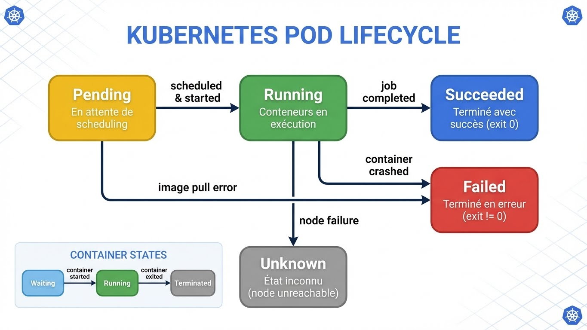
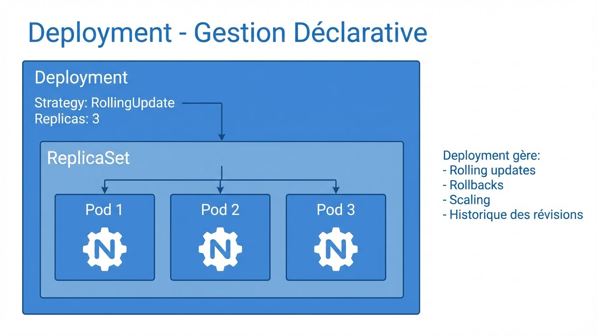
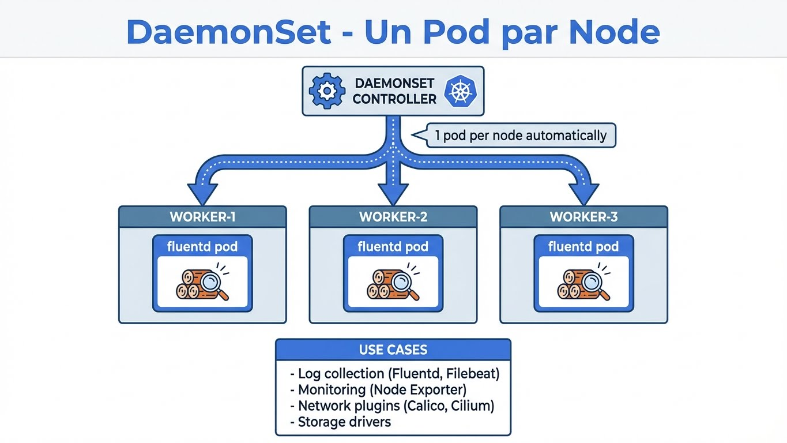

---
tags:
  - formation
  - kubernetes
  - workloads
  - deployments
  - pods
---

# Module 2 : Workloads Fondamentaux

## Objectifs du Module

- Maîtriser les Pods et leurs spécifications
- Gérer les Deployments et ReplicaSets
- Comprendre StatefulSets, DaemonSets, Jobs
- Implémenter des stratégies de déploiement

**Durée :** 3 heures

---

## 1. Pods

### 1.1 Concept


### 1.2 Pod Lifecycle



### 1.3 Manifest Pod Simple

```yaml
# pod-simple.yaml
apiVersion: v1
kind: Pod
metadata:
  name: nginx-pod
  namespace: default
  labels:
    app: nginx
    environment: dev
  annotations:
    description: "Pod nginx pour démonstration"
spec:
  containers:
    - name: nginx
      image: nginx:1.25
      ports:
        - containerPort: 80
          name: http
      resources:
        requests:
          memory: "64Mi"
          cpu: "100m"
        limits:
          memory: "128Mi"
          cpu: "200m"
```

```bash
# Créer le pod
kubectl apply -f pod-simple.yaml

# Vérifier
kubectl get pods
kubectl describe pod nginx-pod

# Logs
kubectl logs nginx-pod

# Exécuter une commande
kubectl exec -it nginx-pod -- /bin/bash

# Port-forward pour accès local
kubectl port-forward nginx-pod 8080:80

# Supprimer
kubectl delete pod nginx-pod
```

### 1.3 Pod Multi-Container

```yaml
# pod-multi.yaml
apiVersion: v1
kind: Pod
metadata:
  name: web-with-sidecar
spec:
  containers:
    # Container principal
    - name: web
      image: nginx:1.25
      ports:
        - containerPort: 80
      volumeMounts:
        - name: shared-logs
          mountPath: /var/log/nginx

    # Sidecar pour les logs
    - name: log-collector
      image: busybox
      command: ['sh', '-c', 'tail -f /logs/access.log']
      volumeMounts:
        - name: shared-logs
          mountPath: /logs

  volumes:
    - name: shared-logs
      emptyDir: {}
```

### 1.4 Init Containers

```yaml
# pod-init.yaml
apiVersion: v1
kind: Pod
metadata:
  name: app-with-init
spec:
  initContainers:
    # S'exécute AVANT les containers principaux
    - name: wait-for-db
      image: busybox
      command: ['sh', '-c', 'until nc -z db-service 5432; do echo waiting...; sleep 2; done']

    - name: init-config
      image: busybox
      command: ['sh', '-c', 'echo "config ready" > /config/ready']
      volumeMounts:
        - name: config
          mountPath: /config

  containers:
    - name: app
      image: myapp:1.0
      volumeMounts:
        - name: config
          mountPath: /app/config

  volumes:
    - name: config
      emptyDir: {}
```

---

## 2. Deployments

### 2.1 Concept



### 2.2 Manifest Deployment

```yaml
# deployment.yaml
apiVersion: apps/v1
kind: Deployment
metadata:
  name: nginx-deployment
  labels:
    app: nginx
spec:
  replicas: 3
  selector:
    matchLabels:
      app: nginx
  template:
    metadata:
      labels:
        app: nginx
    spec:
      containers:
        - name: nginx
          image: nginx:1.25
          ports:
            - containerPort: 80
          resources:
            requests:
              memory: "64Mi"
              cpu: "100m"
            limits:
              memory: "128Mi"
              cpu: "200m"
          livenessProbe:
            httpGet:
              path: /
              port: 80
            initialDelaySeconds: 10
            periodSeconds: 5
          readinessProbe:
            httpGet:
              path: /
              port: 80
            initialDelaySeconds: 5
            periodSeconds: 3
```

### 2.3 Opérations sur les Deployments

```bash
# Créer
kubectl apply -f deployment.yaml

# Vérifier
kubectl get deployments
kubectl get rs  # ReplicaSets
kubectl get pods

# Détails
kubectl describe deployment nginx-deployment

# Scaling
kubectl scale deployment nginx-deployment --replicas=5

# Mise à jour de l'image
kubectl set image deployment/nginx-deployment nginx=nginx:1.26

# Suivre le rollout
kubectl rollout status deployment/nginx-deployment

# Historique
kubectl rollout history deployment/nginx-deployment

# Rollback
kubectl rollout undo deployment/nginx-deployment
kubectl rollout undo deployment/nginx-deployment --to-revision=2

# Pause/Resume
kubectl rollout pause deployment/nginx-deployment
kubectl rollout resume deployment/nginx-deployment
```

### 2.4 Stratégies de Déploiement

```yaml
# RollingUpdate (défaut)
apiVersion: apps/v1
kind: Deployment
metadata:
  name: rolling-update-demo
spec:
  replicas: 4
  strategy:
    type: RollingUpdate
    rollingUpdate:
      maxSurge: 1        # Pods en plus pendant update (25% ou nombre)
      maxUnavailable: 1  # Pods indisponibles max (25% ou nombre)
  selector:
    matchLabels:
      app: demo
  template:
    metadata:
      labels:
        app: demo
    spec:
      containers:
        - name: app
          image: myapp:v1

---
# Recreate (downtime accepté)
apiVersion: apps/v1
kind: Deployment
metadata:
  name: recreate-demo
spec:
  replicas: 4
  strategy:
    type: Recreate  # Supprime tous les pods avant de créer les nouveaux
  selector:
    matchLabels:
      app: demo
  template:
    metadata:
      labels:
        app: demo
    spec:
      containers:
        - name: app
          image: myapp:v1
```

```
ROLLING UPDATE VISUALISATION
════════════════════════════

État initial (v1):  [Pod1-v1] [Pod2-v1] [Pod3-v1]

Étape 1:            [Pod1-v1] [Pod2-v1] [Pod3-v1] [Pod4-v2]  (maxSurge=1)

Étape 2:            [Pod1-v1] [Pod2-v1] [------- ] [Pod4-v2]  (termine Pod3)

Étape 3:            [Pod1-v1] [Pod2-v1] [Pod5-v2] [Pod4-v2]

Étape 4:            [Pod1-v1] [------- ] [Pod5-v2] [Pod4-v2]  (termine Pod2)

...continue jusqu'à:

État final (v2):    [Pod6-v2] [Pod5-v2] [Pod4-v2]
```

---

## 3. StatefulSets

### 3.1 Concept


**Caractéristiques :**

- Identité stable (nom-0, nom-1, nom-2)
- Stockage persistant par pod
- Déploiement/suppression ordonnés
- Updates ordonnés

**Use cases :** Bases de données, systèmes distribués (Kafka, Zookeeper)

### 3.2 Manifest StatefulSet

```yaml
# statefulset.yaml
apiVersion: v1
kind: Service
metadata:
  name: mysql
  labels:
    app: mysql
spec:
  ports:
    - port: 3306
      name: mysql
  clusterIP: None  # Headless Service
  selector:
    app: mysql

---
apiVersion: apps/v1
kind: StatefulSet
metadata:
  name: mysql
spec:
  serviceName: mysql  # Lié au Headless Service
  replicas: 3
  selector:
    matchLabels:
      app: mysql
  template:
    metadata:
      labels:
        app: mysql
    spec:
      containers:
        - name: mysql
          image: mysql:8.0
          ports:
            - containerPort: 3306
              name: mysql
          env:
            - name: MYSQL_ROOT_PASSWORD
              valueFrom:
                secretKeyRef:
                  name: mysql-secret
                  key: root-password
          volumeMounts:
            - name: data
              mountPath: /var/lib/mysql

  volumeClaimTemplates:  # PVC unique par pod
    - metadata:
        name: data
      spec:
        accessModes: ["ReadWriteOnce"]
        storageClassName: standard
        resources:
          requests:
            storage: 10Gi
```

### 3.3 Update Strategies

```yaml
# OrderedReady (défaut) - Un par un, en ordre
spec:
  updateStrategy:
    type: RollingUpdate
    rollingUpdate:
      partition: 0  # Pods >= partition seront mis à jour

# Pour canary deployment
spec:
  updateStrategy:
    type: RollingUpdate
    rollingUpdate:
      partition: 2  # Seul mysql-2 sera mis à jour

# OnDelete - Manuel
spec:
  updateStrategy:
    type: OnDelete  # Mise à jour uniquement à la suppression du pod
```

---

## 4. DaemonSets

### 4.1 Concept



### 4.2 Manifest DaemonSet

```yaml
# daemonset.yaml
apiVersion: apps/v1
kind: DaemonSet
metadata:
  name: node-exporter
  namespace: monitoring
  labels:
    app: node-exporter
spec:
  selector:
    matchLabels:
      app: node-exporter
  template:
    metadata:
      labels:
        app: node-exporter
    spec:
      hostNetwork: true  # Utilise le réseau du host
      hostPID: true
      containers:
        - name: node-exporter
          image: prom/node-exporter:latest
          ports:
            - containerPort: 9100
              hostPort: 9100
          volumeMounts:
            - name: proc
              mountPath: /host/proc
              readOnly: true
            - name: sys
              mountPath: /host/sys
              readOnly: true
          args:
            - --path.procfs=/host/proc
            - --path.sysfs=/host/sys
      volumes:
        - name: proc
          hostPath:
            path: /proc
        - name: sys
          hostPath:
            path: /sys
      tolerations:
        - operator: Exists  # Tolère tous les taints
```

### 4.3 Cibler des Nodes Spécifiques

```yaml
spec:
  template:
    spec:
      nodeSelector:
        kubernetes.io/os: linux
        node-type: worker

      # Ou avec affinity
      affinity:
        nodeAffinity:
          requiredDuringSchedulingIgnoredDuringExecution:
            nodeSelectorTerms:
              - matchExpressions:
                  - key: node-role.kubernetes.io/worker
                    operator: Exists
```

---

## 5. Jobs et CronJobs

### 5.1 Jobs

```yaml
# job.yaml
apiVersion: batch/v1
kind: Job
metadata:
  name: backup-job
spec:
  completions: 1      # Nombre d'exécutions réussies requises
  parallelism: 1      # Pods en parallèle
  backoffLimit: 3     # Retries avant échec
  activeDeadlineSeconds: 600  # Timeout total

  template:
    spec:
      restartPolicy: OnFailure  # ou Never
      containers:
        - name: backup
          image: backup-tool:1.0
          command: ["/bin/sh", "-c"]
          args:
            - |
              echo "Starting backup..."
              pg_dump -h $DB_HOST -U $DB_USER mydb > /backup/dump.sql
              echo "Backup completed"
          env:
            - name: DB_HOST
              value: "postgres-service"
          volumeMounts:
            - name: backup-volume
              mountPath: /backup
      volumes:
        - name: backup-volume
          persistentVolumeClaim:
            claimName: backup-pvc
```

### 5.2 Job Parallèle

```yaml
# job-parallel.yaml
apiVersion: batch/v1
kind: Job
metadata:
  name: process-items
spec:
  completions: 10     # 10 exécutions au total
  parallelism: 3      # 3 pods en parallèle
  template:
    spec:
      restartPolicy: OnFailure
      containers:
        - name: processor
          image: processor:1.0
          env:
            - name: JOB_INDEX
              valueFrom:
                fieldRef:
                  fieldPath: metadata.annotations['batch.kubernetes.io/job-completion-index']
```

### 5.3 CronJobs

```yaml
# cronjob.yaml
apiVersion: batch/v1
kind: CronJob
metadata:
  name: daily-backup
spec:
  schedule: "0 2 * * *"  # Cron expression: 2h00 chaque jour
  concurrencyPolicy: Forbid  # Allow, Forbid, Replace
  successfulJobsHistoryLimit: 3
  failedJobsHistoryLimit: 1
  startingDeadlineSeconds: 3600  # Window pour démarrer si schedule raté

  jobTemplate:
    spec:
      template:
        spec:
          restartPolicy: OnFailure
          containers:
            - name: backup
              image: backup-tool:1.0
              command: ["/backup.sh"]
```

```bash
# Cron expressions
# ┌───────────── minute (0 - 59)
# │ ┌───────────── hour (0 - 23)
# │ │ ┌───────────── day of month (1 - 31)
# │ │ │ ┌───────────── month (1 - 12)
# │ │ │ │ ┌───────────── day of week (0 - 6)
# │ │ │ │ │
# * * * * *

# Exemples
# "0 * * * *"      - Toutes les heures
# "*/15 * * * *"   - Toutes les 15 minutes
# "0 2 * * *"      - Chaque jour à 2h00
# "0 0 * * 0"      - Chaque dimanche à minuit
# "0 0 1 * *"      - Premier jour de chaque mois
```

---

## 6. Labels et Selectors

### 6.1 Bonnes Pratiques

```yaml
# Labels recommandés
metadata:
  labels:
    # Labels Kubernetes standards
    app.kubernetes.io/name: nginx
    app.kubernetes.io/instance: nginx-prod
    app.kubernetes.io/version: "1.25"
    app.kubernetes.io/component: frontend
    app.kubernetes.io/part-of: webshop
    app.kubernetes.io/managed-by: helm

    # Labels personnalisés
    environment: production
    team: platform
    cost-center: engineering
```

### 6.2 Sélecteurs

```bash
# Sélection par label
kubectl get pods -l app=nginx
kubectl get pods -l 'environment in (production, staging)'
kubectl get pods -l 'app=nginx,environment=production'
kubectl get pods -l 'environment!=production'

# Supprimer par label
kubectl delete pods -l app=test

# Ajouter un label
kubectl label pods nginx-pod tier=frontend

# Supprimer un label
kubectl label pods nginx-pod tier-
```

---

## Exercice : À Vous de Jouer

!!! example "Mise en Pratique"
    **Objectif** : Maîtriser le déploiement et la gestion des workloads Kubernetes

    **Contexte** : Vous êtes responsable du déploiement d'une application web avec plusieurs composants : une API backend, un système de backup automatisé, et un agent de monitoring sur chaque node.

    **Tâches à réaliser** :

    1. Créer un Deployment "api-backend" avec 3 replicas utilisant l'image nginx:1.25
    2. Effectuer un rolling update vers nginx:1.26 et observer le processus
    3. Simuler un problème et effectuer un rollback vers la version précédente
    4. Créer un CronJob qui s'exécute toutes les 5 minutes pour simuler un backup
    5. Déployer un DaemonSet d'agent de monitoring sur tous les nodes

    **Critères de validation** :

    - [ ] Le Deployment maintient 3 pods en permanence
    - [ ] Le rolling update se fait sans downtime
    - [ ] Le rollback restaure la version précédente correctement
    - [ ] Le CronJob crée un nouveau Job toutes les 5 minutes
    - [ ] Le DaemonSet déploie exactement un pod par node

??? quote "Solution"
    **Étape 1 : Créer le Deployment**

    ```yaml
    # deployment-api.yaml
    apiVersion: apps/v1
    kind: Deployment
    metadata:
      name: api-backend
      labels:
        app: api-backend
    spec:
      replicas: 3
      selector:
        matchLabels:
          app: api-backend
      template:
        metadata:
          labels:
            app: api-backend
        spec:
          containers:
            - name: nginx
              image: nginx:1.25
              ports:
                - containerPort: 80
              resources:
                requests:
                  cpu: 100m
                  memory: 128Mi
                limits:
                  cpu: 200m
                  memory: 256Mi
              readinessProbe:
                httpGet:
                  path: /
                  port: 80
                initialDelaySeconds: 5
                periodSeconds: 5
    ```

    ```bash
    kubectl apply -f deployment-api.yaml
    kubectl get deployments
    kubectl get pods -l app=api-backend
    ```

    **Étape 2 : Rolling Update**

    ```bash
    # Mettre à jour l'image
    kubectl set image deployment/api-backend nginx=nginx:1.26 --record

    # Observer le rollout en temps réel
    kubectl rollout status deployment/api-backend

    # Voir l'historique
    kubectl rollout history deployment/api-backend

    # Observer les ReplicaSets
    kubectl get rs -l app=api-backend
    ```

    **Étape 3 : Rollback**

    ```bash
    # Voir les révisions disponibles
    kubectl rollout history deployment/api-backend

    # Rollback à la version précédente
    kubectl rollout undo deployment/api-backend

    # Vérifier que les pods utilisent nginx:1.25
    kubectl get pods -l app=api-backend -o jsonpath='{.items[*].spec.containers[0].image}'

    # Rollback vers une révision spécifique
    kubectl rollout undo deployment/api-backend --to-revision=1
    ```

    **Étape 4 : CronJob de Backup**

    ```yaml
    # cronjob-backup.yaml
    apiVersion: batch/v1
    kind: CronJob
    metadata:
      name: backup-job
    spec:
      schedule: "*/5 * * * *"
      successfulJobsHistoryLimit: 3
      failedJobsHistoryLimit: 1
      jobTemplate:
        spec:
          template:
            spec:
              restartPolicy: OnFailure
              containers:
                - name: backup
                  image: busybox
                  command:
                    - /bin/sh
                    - -c
                    - |
                      echo "Début du backup à $(date)"
                      echo "Sauvegarde des données..."
                      sleep 10
                      echo "Backup terminé avec succès"
    ```

    ```bash
    kubectl apply -f cronjob-backup.yaml
    kubectl get cronjobs

    # Attendre quelques minutes puis vérifier
    kubectl get jobs
    kubectl logs -l job-name=backup-job-<timestamp>
    ```

    **Étape 5 : DaemonSet de Monitoring**

    ```yaml
    # daemonset-monitor.yaml
    apiVersion: apps/v1
    kind: DaemonSet
    metadata:
      name: monitoring-agent
      labels:
        app: monitoring-agent
    spec:
      selector:
        matchLabels:
          app: monitoring-agent
      template:
        metadata:
          labels:
            app: monitoring-agent
        spec:
          tolerations:
            - operator: Exists
          containers:
            - name: agent
              image: busybox
              command:
                - /bin/sh
                - -c
                - |
                  echo "Agent de monitoring démarré sur $(hostname)"
                  while true; do
                    echo "Collecte des métriques..."
                    sleep 30
                  done
              resources:
                requests:
                  cpu: 50m
                  memory: 64Mi
                limits:
                  cpu: 100m
                  memory: 128Mi
    ```

    ```bash
    kubectl apply -f daemonset-monitor.yaml
    kubectl get ds
    kubectl get pods -l app=monitoring-agent -o wide

    # Vérifier qu'il y a un pod par node
    kubectl get nodes
    kubectl get pods -l app=monitoring-agent --no-headers | wc -l
    ```

    **Vérifications finales** :

    ```bash
    # État global
    kubectl get all

    # Vérifier le Deployment
    kubectl describe deployment api-backend

    # Vérifier le CronJob
    kubectl describe cronjob backup-job

    # Vérifier le DaemonSet
    kubectl describe daemonset monitoring-agent
    ```

---

## Quiz

1. **Quelle ressource garantit un nombre fixe de pods identiques ?**
   - [ ] A. Pod
   - [ ] B. Deployment
   - [ ] C. StatefulSet

2. **Quelle stratégie de déploiement cause un downtime ?**
   - [ ] A. RollingUpdate
   - [ ] B. Recreate
   - [ ] C. BlueGreen

3. **Quel workload assure un pod par node ?**
   - [ ] A. Deployment
   - [ ] B. StatefulSet
   - [ ] C. DaemonSet

4. **Quelle propriété du StatefulSet garantit l'identité stable ?**
   - [ ] A. serviceName
   - [ ] B. replicas
   - [ ] C. selector

**Réponses :** 1-B, 2-B, 3-C, 4-A

---

**Précédent :** [Module 1 - Architecture](01-module.md)

**Suivant :** [Module 3 - Configuration](03-module.md)

---

## Navigation

| | |
|:---|---:|
| [← Module 1 : Architecture et Concepts](01-module.md) | [Module 3 : Configuration et Secrets →](03-module.md) |

[Retour au Programme](index.md){ .md-button }
