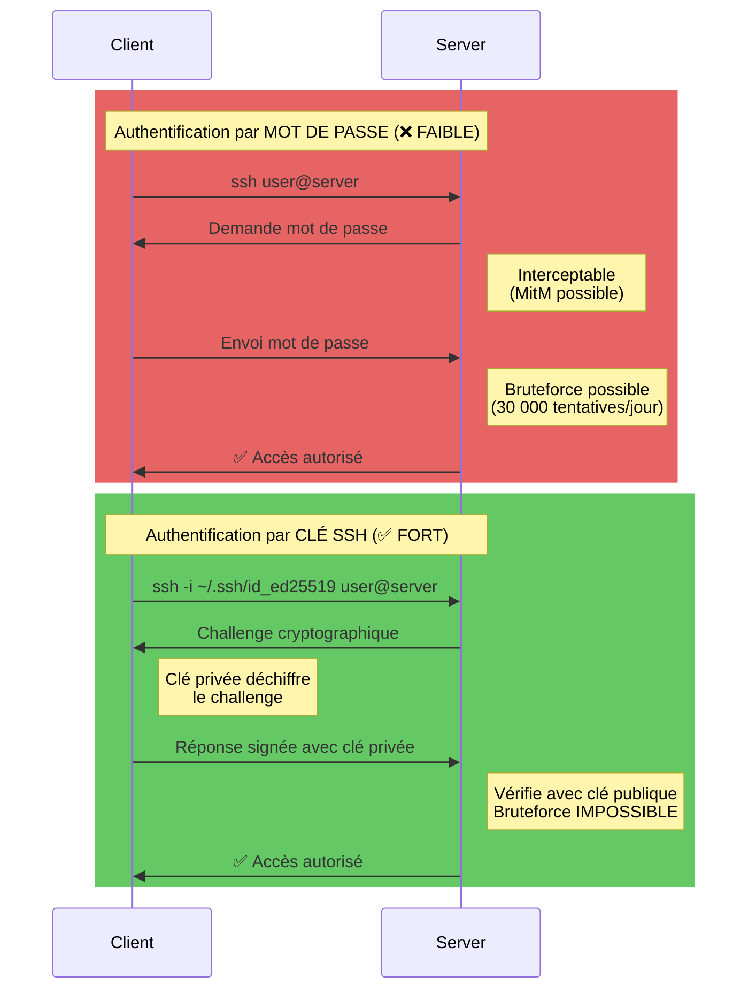

---
tags:
  - formation
  - security
  - ssh
  - hardening
  - secnumcloud
---

# Module 1 : SSH Hardening - Verrouiller la Porte

## Objectif du Module

Comprendre les attaques sur SSH et maîtriser les techniques de durcissement pour transformer SSH en forteresse impénétrable : authentification par clés, désactivation des mots de passe, et configuration sécurisée conforme SecNumCloud.

**Durée :** 1h30

## Introduction : SSH, la Cible N°1

### Le Vecteur d'Attaque Principal

**SSH (Secure Shell)** est le protocole standard pour l'administration à distance des serveurs Linux. C'est aussi la **première cible des attaquants**.

**Statistiques alarmantes :**

- 🎯 **95% des serveurs** exposés sur Internet subissent des tentatives de bruteforce SSH **dans les 24 heures**
- 🔴 **60% des compromissions** démarrent par un accès SSH non autorisé
- ⚠️ **Port 22** : Le port le plus scanné au monde (millions de tentatives/jour)

**Exemple de logs d'attaque :**

```bash
# /var/log/auth.log sur un serveur exposé depuis 1 heure
Jan 22 10:15:42 server sshd[1234]: Failed password for root from 185.220.101.45 port 52341 ssh2
Jan 22 10:15:45 server sshd[1235]: Failed password for admin from 185.220.101.45 port 52342 ssh2
Jan 22 10:15:48 server sshd[1236]: Failed password for user from 185.220.101.45 port 52343 ssh2
Jan 22 10:15:51 server sshd[1237]: Failed password for test from 185.220.101.45 port 52344 ssh2
Jan 22 10:15:54 server sshd[1238]: Failed password for ubuntu from 185.220.101.45 port 52345 ssh2

# ... 1000+ lignes par heure ...
```

!!! danger "Réalité des Attaques"
    Un serveur SSH exposé avec authentification par mot de passe subit en moyenne **30 000 tentatives de connexion par jour** depuis des botnets automatisés.

### SecNumCloud : Exigence de Sécurité

Le référentiel **SecNumCloud** de l'ANSSI impose :

- ✅ **SEC-01.1** : Authentification forte (clés SSH, MFA)
- ✅ **SEC-01.2** : Interdiction des comptes partagés (root, admin)
- ✅ **SEC-02.1** : Traçabilité des accès (logs SSH)
- ✅ **SEC-03.1** : Principe du moindre privilège (AllowUsers)

**Conclusion :** SSH mal configuré = porte grande ouverte.

## Concept : Bruteforce & Authentification

### Les Attaques par Bruteforce

**Définition :** Tester systématiquement des milliers de combinaisons login/password jusqu'à trouver la bonne.

**Méthode d'attaque typique :**

```bash
# Attaque automatisée avec Hydra
hydra -l root -P /usr/share/wordlists/rockyou.txt ssh://192.168.1.10

# Résultat si password = "password123"
[22][ssh] host: 192.168.1.10   login: root   password: password123
```

**Temps de crack selon la complexité :**

| Mot de passe | Complexité | Temps de crack (GPU) |
|--------------|-----------|---------------------|
| `password` | Dictionnaire | **< 1 seconde** |
| `password123` | Dictionnaire + chiffres | **< 5 secondes** |
| `P@ssw0rd!` | 9 caractères, mixte | **2 heures** |
| `Tr0ub4dor&3` | 12 caractères, complexe | **3 jours** |
| Clé SSH ED25519 | 256 bits | **Impossible** (2^256 combinaisons) |

!!! warning "Fausse Sécurité"
    Même un "bon" mot de passe complexe (`Tr0ub4dor&3`) est **vulnérable** face à une attaque distribuée avec des GPUs modernes. Seules les clés SSH sont réellement sûres.

### Mots de Passe vs Clés SSH

#### Diagramme : Comparaison des Flux d'Authentification



**Avantages des Clés SSH :**

| Critère | Mot de passe | Clé SSH |
|---------|--------------|---------|
| **Longueur** | 8-16 caractères | 256 bits (ED25519) = 77 caractères |
| **Bruteforce** | ❌ Vulnérable (dictionnaire) | ✅ Impossible (2^256 combinaisons) |
| **Phishing** | ❌ Facilement volé | ✅ Clé privée jamais transmise |
| **Rotation** | ❌ Difficile (30+ serveurs) | ✅ Facile (copier nouvelle clé publique) |
| **MFA** | ⚠️ Nécessite Duo/Google Auth | ✅ Intégré (possession clé privée) |
| **Traçabilité** | ⚠️ Pas de différenciation | ✅ 1 clé = 1 personne |

## Pratique : Configuration Robuste

### Étape 1 : Génération de Clés SSH

**Recommandation :** Utiliser **ED25519** (algorithme moderne, plus sûr et rapide que RSA).

```bash
# Générer une paire de clés ED25519
ssh-keygen -t ed25519 -C "votre.email@example.com"

# Sortie interactive
Generating public/private ed25519 key pair.
Enter file in which to save the key (/home/user/.ssh/id_ed25519): [ENTER]
Enter passphrase (empty for no passphrase): [Entrer une passphrase FORTE]
Enter same passphrase again: [Répéter]

Your identification has been saved in /home/user/.ssh/id_ed25519
Your public key has been saved in /home/user/.ssh/id_ed25519.pub

# Vérifier les fichiers créés
ls -lh ~/.ssh/
# -rw------- 1 user user  464 Jan 22 10:00 id_ed25519       (CLÉ PRIVÉE - SECRET)
# -rw-r--r-- 1 user user  107 Jan 22 10:00 id_ed25519.pub   (Clé publique)
```

!!! danger "Sécurité de la Clé Privée"
    **JAMAIS** partager ou copier `id_ed25519` (clé privée) !

    - ✅ Permissions **600** obligatoires (`chmod 600 ~/.ssh/id_ed25519`)
    - ✅ Protégée par **passphrase** (mot de passe de la clé)
    - ❌ Ne **JAMAIS** commiter dans Git
    - ❌ Ne **JAMAIS** envoyer par email/Slack

**Pourquoi ED25519 plutôt que RSA ?**

| Algorithme | Taille clé | Sécurité équivalente | Performance |
|------------|-----------|---------------------|-------------|
| RSA 2048 | 2048 bits | ~ 112 bits | Lent |
| RSA 4096 | 4096 bits | ~ 140 bits | Très lent |
| **ED25519** | **256 bits** | **~128 bits** | **Rapide** |

ED25519 = **Plus court, plus rapide, plus sûr**.

### Étape 2 : Installation de la Clé Publique

**Méthode 1 : Automatique avec `ssh-copy-id` (recommandée)**

```bash
# Copier la clé publique vers le serveur
ssh-copy-id -i ~/.ssh/id_ed25519.pub user@192.168.1.10

# Sortie
/usr/bin/ssh-copy-id: INFO: Source of key(s) to be installed: "/home/user/.ssh/id_ed25519.pub"
user@192.168.1.10's password: [Entrer le mot de passe UNE DERNIÈRE FOIS]

Number of key(s) added: 1

Now try logging into the machine, with:   "ssh 'user@192.168.1.10'"
and check to make sure that only the key(s) you wanted were added.
```

**Méthode 2 : Manuelle (si `ssh-copy-id` indisponible)**

```bash
# Sur le client : Afficher la clé publique
cat ~/.ssh/id_ed25519.pub
# ssh-ed25519 AAAAC3NzaC1lZDI1NTE5AAAAIGq... votre.email@example.com

# Sur le serveur : Ajouter la clé dans authorized_keys
mkdir -p ~/.ssh
chmod 700 ~/.ssh
echo "ssh-ed25519 AAAAC3NzaC1lZDI1NTE5AAAAIGq... votre.email@example.com" >> ~/.ssh/authorized_keys
chmod 600 ~/.ssh/authorized_keys
```

**Vérification :**

```bash
# Tester la connexion avec la clé (devrait fonctionner sans mot de passe)
ssh -i ~/.ssh/id_ed25519 user@192.168.1.10

# Si ça fonctionne : ✅ Clé installée correctement
# Si demande mot de passe : ❌ Vérifier permissions et chemin
```

### Étape 3 : Durcir `/etc/ssh/sshd_config`

**Fichier de configuration :** `/etc/ssh/sshd_config` (serveur SSH)

**Paramètres critiques à modifier :**

```bash
# Éditer la configuration SSH
sudo vim /etc/ssh/sshd_config
```

**Configuration sécurisée :**

```sshd_config
# ==============================
# SSH HARDENING - SecNumCloud
# ==============================

# 1. DÉSACTIVER ROOT LOGIN (SEC-01.2)
# Empêche la connexion directe en tant que root
PermitRootLogin no

# 2. DÉSACTIVER AUTHENTIFICATION PAR MOT DE PASSE (SEC-01.1)
# Force l'utilisation de clés SSH uniquement
PasswordAuthentication no
ChallengeResponseAuthentication no
UsePAM no

# 3. ACTIVER AUTHENTIFICATION PAR CLÉ PUBLIQUE
PubkeyAuthentication yes

# 4. WHITELIST DES UTILISATEURS AUTORISÉS (SEC-03.1)
# Remplacer par vos utilisateurs légitimes
AllowUsers user1 user2 deploy

# 5. PROTOCOLE SSH VERSION 2 UNIQUEMENT
# SSH v1 est obsolète et vulnérable
Protocol 2

# 6. LIMITER LES TENTATIVES DE CONNEXION
# Déconnecter après 3 échecs
MaxAuthTries 3

# 7. TIMEOUT DE CONNEXION
# Déconnecter si inactif pendant 5 minutes
ClientAliveInterval 300
ClientAliveCountMax 2

# 8. LOGGING DÉTAILLÉ (SEC-02.1 - Traçabilité)
# Niveau de log pour audit
LogLevel VERBOSE

# 9. DÉSACTIVER FORWARDING X11 (si non utilisé)
X11Forwarding no

# 10. DÉSACTIVER TUNNEL TCP (si non utilisé)
AllowTcpForwarding no

# 11. LIMITER LES ALGORITHMES CRYPTOGRAPHIQUES (Durcissement)
# Uniquement les algorithmes modernes et sûrs
KexAlgorithms curve25519-sha256,curve25519-sha256@libssh.org
Ciphers chacha20-poly1305@openssh.com,aes256-gcm@openssh.com,aes128-gcm@openssh.com
MACs hmac-sha2-512-etm@openssh.com,hmac-sha2-256-etm@openssh.com
```

!!! tip "Explication des Paramètres"
    - **PermitRootLogin no** : Empêche l'attaquant de cibler le compte `root` (toujours présent)
    - **PasswordAuthentication no** : Bloque le bruteforce (pas de mot de passe = pas d'attaque)
    - **AllowUsers** : Whitelist explicite (tout ce qui n'est pas autorisé est interdit)
    - **MaxAuthTries 3** : Limite les tentatives (fail2ban recommandé en complément)
    - **LogLevel VERBOSE** : Traçabilité complète pour audit SecNumCloud

### Étape 4 : Validation et Activation

**4.1 - Tester la configuration (CRITIQUE - Ne pas oublier !)**

```bash
# Vérifier la syntaxe du fichier de config
sudo sshd -t

# Si tout est OK : (aucune sortie)
# Si erreur : affiche la ligne problématique
# /etc/ssh/sshd_config line 42: Bad configuration option: InvalidParam
```

**4.2 - Redémarrer le service SSH**

!!! danger "⚠️ AVERTISSEMENT - NE PAS SE BLOQUER"
    **AVANT** de redémarrer SSH :

    1. ✅ Vérifier que vous pouvez vous connecter avec votre clé SSH
    2. ✅ Garder une session SSH **ACTIVE** ouverte (backup)
    3. ✅ Tester dans une **nouvelle fenêtre** de terminal

    Si vous vous bloquez, utilisez la console KVM/IPMI du datacenter.

```bash
# Redémarrer SSH
sudo systemctl restart sshd

# Vérifier que le service est actif
sudo systemctl status sshd
# ● ssh.service - OpenBSD Secure Shell server
#    Loaded: loaded (/lib/systemd/system/ssh.service; enabled)
#    Active: active (running) since ...
```

**4.3 - Tester la connexion**

```bash
# Dans une NOUVELLE fenêtre de terminal
ssh -i ~/.ssh/id_ed25519 user@192.168.1.10

# Résultat attendu : Connexion réussie SANS demande de mot de passe
# Si échec : Revenir à la session SSH ouverte et corriger
```

## Exercice : Sécuriser un Serveur Fraîchement Installé

!!! example "À Vous de Jouer - Hardening SSH"
    **Contexte :** Vous venez de déployer un serveur Ubuntu 22.04 sur le cloud (AWS/Azure/OVH). Il est accessible par SSH avec mot de passe. Votre mission : le sécuriser avant de le mettre en production.

    **Objectif :** Transformer SSH en forteresse selon les standards SecNumCloud.

    **Prérequis :**
    - Serveur accessible : `ssh user@192.168.1.10` (mot de passe : `ChangeMe123`)
    - Accès sudo : `user` peut exécuter `sudo`

    **Tâches :**

    **1. Générer une paire de clés ED25519**
    - Créer la clé avec votre email en commentaire
    - Protéger par passphrase

    **2. Installer la clé publique sur le serveur**
    - Utiliser `ssh-copy-id`
    - Vérifier la connexion sans mot de passe

    **3. Modifier `/etc/ssh/sshd_config`**
    - Désactiver `PermitRootLogin`
    - Désactiver `PasswordAuthentication`
    - Ajouter `AllowUsers user`
    - Limiter `MaxAuthTries` à 3

    **4. Valider et redémarrer**
    - Tester avec `sshd -t`
    - Redémarrer le service
    - Vérifier la connexion par clé

    **Bonus :**
    - Changer le port SSH (par ex: 2222 au lieu de 22)
    - Installer fail2ban pour bannir les IPs après 5 échecs

    **Durée estimée :** 30 minutes

    **Critères de réussite :**

    - ✅ Connexion par clé SSH fonctionne
    - ✅ Connexion par mot de passe échoue
    - ✅ Connexion root échoue
    - ✅ `sshd -t` retourne 0 erreur
    - ✅ Logs SSH affichent "Accepted publickey"

## Solution : Configuration Complète

??? quote "Solution Détaillée"
    ### Étape 1 : Génération de Clés

    ```bash
    # Sur votre machine locale (client)
    ssh-keygen -t ed25519 -C "admin@monentreprise.com"

    # Réponses :
    # File: [ENTER] (utiliser le chemin par défaut)
    # Passphrase: [Entrer une passphrase forte, ex: "MyS3cur3P@ssPhras3!"]
    # Repeat: [Répéter]

    # Vérifier la création
    ls -lh ~/.ssh/id_ed25519*
    # -rw------- 1 user user  464 Jan 22 12:00 /home/user/.ssh/id_ed25519
    # -rw-r--r-- 1 user user  107 Jan 22 12:00 /home/user/.ssh/id_ed25519.pub
    ```

    ### Étape 2 : Installation de la Clé sur le Serveur

    ```bash
    # Copier la clé publique
    ssh-copy-id -i ~/.ssh/id_ed25519.pub user@192.168.1.10

    # Entrer le mot de passe actuel
    user@192.168.1.10's password: ChangeMe123

    # Sortie :
    # Number of key(s) added: 1

    # Tester la connexion par clé (devrait fonctionner sans mot de passe)
    ssh -i ~/.ssh/id_ed25519 user@192.168.1.10
    # Entrer la passphrase de la clé
    Enter passphrase for key '/home/user/.ssh/id_ed25519': [MyS3cur3P@ssPhras3!]

    # Si connecté : ✅ Clé installée
    # Si demande password serveur : ❌ Problème de permissions
    ```

    ### Étape 3 : Modification de `/etc/ssh/sshd_config`

    ```bash
    # Se connecter au serveur
    ssh -i ~/.ssh/id_ed25519 user@192.168.1.10

    # Sauvegarder la config d'origine (précaution)
    sudo cp /etc/ssh/sshd_config /etc/ssh/sshd_config.backup

    # Éditer la configuration
    sudo vim /etc/ssh/sshd_config
    ```

    **Modifications à appliquer :**

    ```sshd_config
    # Chercher et modifier ces lignes (ou ajouter si absentes)

    # Désactiver root login
    PermitRootLogin no

    # Désactiver authentification par mot de passe
    PasswordAuthentication no
    ChallengeResponseAuthentication no

    # Activer authentification par clé
    PubkeyAuthentication yes

    # Whitelist des utilisateurs
    AllowUsers user

    # Limiter les tentatives
    MaxAuthTries 3

    # Timeout
    ClientAliveInterval 300
    ClientAliveCountMax 2

    # Logging
    LogLevel VERBOSE
    ```

    **Bonus : Changer le port SSH**

    ```sshd_config
    # Ajouter en haut du fichier
    Port 2222
    ```

    ### Étape 4 : Validation et Redémarrage

    ```bash
    # Tester la syntaxe
    sudo sshd -t
    # (Aucune sortie = OK)

    # Si erreur, affiche :
    # /etc/ssh/sshd_config line 42: Bad configuration option: ...
    # → Corriger et re-tester

    # Redémarrer SSH (GARDER LA SESSION ACTUELLE OUVERTE)
    sudo systemctl restart sshd

    # Vérifier le statut
    sudo systemctl status sshd
    # ● ssh.service - OpenBSD Secure Shell server
    #    Active: active (running)
    ```

    ### Étape 5 : Vérification

    **Test 1 : Connexion par clé (doit réussir)**

    ```bash
    # Dans une NOUVELLE fenêtre de terminal
    ssh -i ~/.ssh/id_ed25519 user@192.168.1.10
    # Enter passphrase: [MyS3cur3P@ssPhras3!]
    # ✅ user@server:~$
    ```

    **Test 2 : Connexion par mot de passe (doit échouer)**

    ```bash
    ssh -o PubkeyAuthentication=no user@192.168.1.10
    # Permission denied (publickey).
    # ✅ Bon résultat (mot de passe bloqué)
    ```

    **Test 3 : Connexion root (doit échouer)**

    ```bash
    ssh -i ~/.ssh/id_ed25519 root@192.168.1.10
    # Permission denied (publickey).
    # ✅ Bon résultat (root bloqué)
    ```

    **Test 4 : Vérifier les logs**

    ```bash
    # Sur le serveur
    sudo tail -20 /var/log/auth.log

    # Résultat attendu pour connexion réussie :
    Jan 22 12:15:30 server sshd[1234]: Accepted publickey for user from 192.168.1.100 port 52341 ssh2: ED25519 SHA256:abc123...
    Jan 22 12:15:30 server sshd[1234]: pam_unix(sshd:session): session opened for user user

    # Résultat attendu pour tentative root :
    Jan 22 12:16:00 server sshd[1235]: User root from 192.168.1.100 not allowed because not listed in AllowUsers
    Jan 22 12:16:00 server sshd[1235]: Connection closed by 192.168.1.100 port 52342 [preauth]
    ```

    ### Bonus : Fail2ban

    ```bash
    # Installer fail2ban
    sudo apt update
    sudo apt install fail2ban -y

    # Créer une configuration locale
    sudo vim /etc/fail2ban/jail.local
    ```

    **Configuration fail2ban :**

    ```ini
    [DEFAULT]
    bantime = 3600          # Bannir pendant 1 heure
    findtime = 600          # Fenêtre de détection : 10 minutes
    maxretry = 5            # Bannir après 5 échecs

    [sshd]
    enabled = true
    port = ssh
    logpath = /var/log/auth.log
    ```

    ```bash
    # Redémarrer fail2ban
    sudo systemctl restart fail2ban

    # Vérifier le statut
    sudo fail2ban-client status sshd
    # Status for the jail: sshd
    # |- Filter
    # |  |- Currently failed: 0
    # |  |- Total failed:     0
    # |  `- File list:        /var/log/auth.log
    # `- Actions
    #    |- Currently banned: 0
    #    |- Total banned:     0
    #    `- Banned IP list:
    ```

    !!! success "Validation Complète"
        ✅ **SSH est maintenant sécurisé !**

        **Protections actives :**
        - ✅ Authentification par clé ED25519 uniquement
        - ✅ Mot de passe désactivé (bruteforce impossible)
        - ✅ Root login bloqué
        - ✅ Whitelist des utilisateurs
        - ✅ Fail2ban actif (bannissement automatique)
        - ✅ Logs détaillés pour audit

        **Conformité SecNumCloud :**
        - ✅ SEC-01.1 : Authentification forte (clé SSH)
        - ✅ SEC-01.2 : Pas de compte root direct
        - ✅ SEC-02.1 : Traçabilité (logs VERBOSE)
        - ✅ SEC-03.1 : Moindre privilège (AllowUsers)

## Points Clés à Retenir

**Ce module vous a appris :**

- 🎯 **SSH = Cible N°1** : 95% des serveurs attaqués dans les 24h
- 🔐 **Clés > Mots de passe** : ED25519 = impossible à bruteforce (2^256 combinaisons)
- ⚙️ **Configuration critique** : `PermitRootLogin no`, `PasswordAuthentication no`
- 🛡️ **Whitelist** : `AllowUsers` = principe du moindre privilège
- 🔍 **Validation** : `sshd -t` AVANT de redémarrer (éviter le lockout)
- 📊 **Logs** : `LogLevel VERBOSE` pour audit SecNumCloud
- 🚫 **Fail2ban** : Bannissement automatique des IP malveillantes

**Commandes Essentielles :**

```bash
# Générer clé ED25519
ssh-keygen -t ed25519 -C "votre.email@example.com"

# Copier clé sur serveur
ssh-copy-id -i ~/.ssh/id_ed25519.pub user@server

# Tester config SSH
sudo sshd -t

# Redémarrer SSH
sudo systemctl restart sshd

# Vérifier logs
sudo tail -f /var/log/auth.log
```

**Configuration sshd_config (Minimal Sécurisé) :**

```sshd_config
PermitRootLogin no
PasswordAuthentication no
PubkeyAuthentication yes
AllowUsers user1 user2
MaxAuthTries 3
LogLevel VERBOSE
```

**Prochaine étape :** [Module 2 : Gestion des Utilisateurs & Sudo](#) (en cours de rédaction)

---

**Retour au :** [Programme de la Formation](index.md) | [Catalogue](../index.md)
