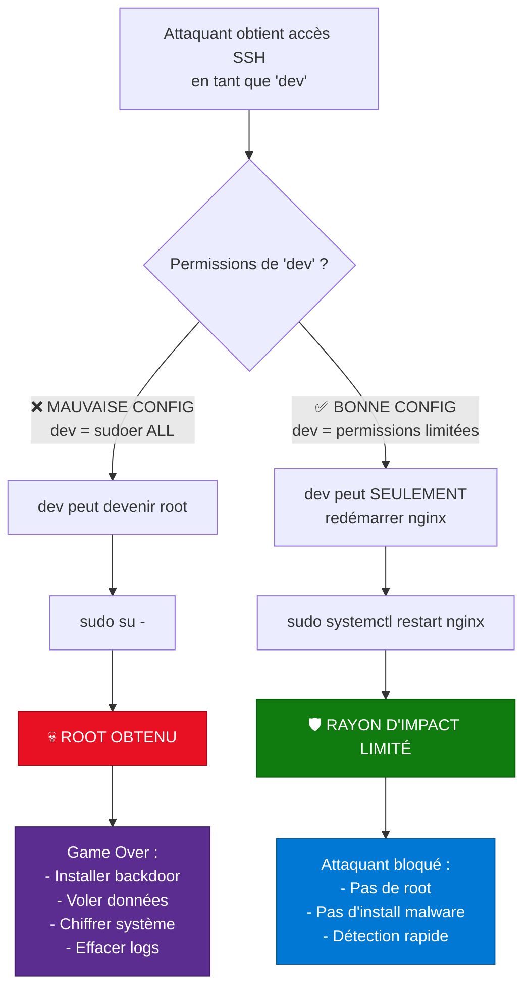
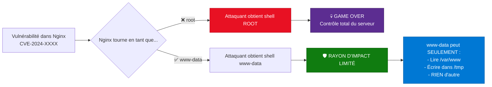

---
tags:
  - formation
  - security
  - sudo
  - privileges
  - hardening
  - secnumcloud
---

# Module 2 : Utilisateurs & Sudo - Le Moindre Privilège

## Objectif du Module

Maîtriser le principe du moindre privilège (PoLP) et configurer sudo pour accorder des permissions granulaires et auditées, limitant ainsi le rayon d'impact en cas de compromission.

**Durée :** 1 heure

## Introduction : Limiter le Rayon d'Impact

### Une Fois à l'Intérieur, Que Peut Faire l'Attaquant ?

Dans le Module 1, vous avez **verrouillé la porte** (SSH hardening). Mais que se passe-t-il si un attaquant réussit malgré tout à entrer ?

**Scénario de compromission :**

1. ✅ **SSH sécurisé** : Clés ED25519, mot de passe désactivé
2. ❌ **Phishing réussi** : L'attaquant vole la clé privée SSH d'un développeur
3. 🔓 **Accès obtenu** : L'attaquant se connecte en tant que `dev`
4. ⚠️ **Question critique** : Que peut faire `dev` sur le système ?

**Deux scénarios possibles :**



**Message clé :** **"Vous n'êtes pas Root. Vous êtes un Utilisateur avec des Pouvoirs Temporaires."**

### SecNumCloud : Exigence de Traçabilité

Le référentiel **SecNumCloud** impose :

- ✅ **SEC-02.1** : Traçabilité des actions privilégiées (qui, quoi, quand)
- ✅ **SEC-03.1** : Principe du moindre privilège (PoLP)
- ✅ **SEC-03.2** : Pas de compte partagé (1 utilisateur = 1 personne)
- ✅ **SEC-04.1** : Audit des escalades de privilèges (logs sudo)

## Concept : Principe du Moindre Privilège (PoLP)

### Définition du PoLP

**Principle of Least Privilege (PoLP) :** Chaque utilisateur, programme ou processus doit avoir **UNIQUEMENT** les permissions nécessaires pour accomplir sa tâche.

**Exemples :**

| Utilisateur | Tâche | Permission MINIMALE nécessaire | Permission EXCESSIVE |
|-------------|-------|------------------------------|---------------------|
| **Dev** | Redémarrer nginx | `systemctl restart nginx` | `sudo su -` (tout) |
| **Monitoring** | Lire les logs | `cat /var/log/nginx/*.log` | `vim /etc/shadow` |
| **Backup** | Sauvegarder /home | `cp -r /home /backup` | `rm -rf /` |
| **Nginx** | Servir du web | Port 80/443, /var/www | Accès à /etc/passwd |

**Bénéfices du PoLP :**

- 🛡️ **Limitation de l'impact** : Si un compte est compromis, l'attaquant ne peut pas tout faire
- 🔍 **Détection facilitée** : Comportement anormal = tentative d'escalade détectable
- 📊 **Audit** : Logs montrent exactement qui a fait quoi
- ✅ **Conformité** : SecNumCloud, ISO 27001, NIST

### Root vs Sudo : Pourquoi `su -` est Dangereux

#### Le Problème de `su -`

**`su -` (Switch User)** permet de devenir root en entrant le **mot de passe root**.

**Problèmes critiques :**

```bash
# Utilisateur devient root avec su
user@server:~$ su -
Password: [mot de passe root partagé]
root@server:~#

# 🔴 PROBLÈMES :
# 1. Mot de passe root partagé entre TOUS les admins
# 2. Impossible de savoir QUI a fait QUOI (tous = root)
# 3. Rotation du mot de passe = communiquer à 10+ personnes
# 4. Départ d'un admin = changer le mot de passe partout
# 5. Aucune granularité (soit 0 pouvoir, soit TOUT)
```

**Exemple d'audit impossible :**

```bash
# Logs avec su
Jan 22 14:30:15 server su: pam_unix(su:session): session opened for user root by user1
Jan 22 14:35:20 server su: pam_unix(su:session): session opened for user root by user2

# Qui a supprimé /var/www/production ?
# Impossible à savoir : user1 ou user2 ?
```

#### La Solution : `sudo`

**`sudo` (Superuser Do)** permet d'exécuter **UNE commande** avec des privilèges élevés, **SANS** partager le mot de passe root.

**Avantages :**

```bash
# Utilisateur exécute UNE commande en tant que root
user@server:~$ sudo systemctl restart nginx
[sudo] password for user: [MOT DE PASSE DE L'UTILISATEUR, pas de root]

# ✅ AVANTAGES :
# 1. Chaque utilisateur garde son propre mot de passe
# 2. Logs montrent QUI a exécuté QUOI
# 3. Granularité : user peut restart nginx, mais PAS apt install
# 4. Départ d'un admin = supprimer son compte (pas de rotation)
# 5. Timeout : sudo expire après 15 minutes (re-authentification)
```

**Exemple d'audit complet :**

```bash
# Logs avec sudo
Jan 22 14:30:15 server sudo: user1 : TTY=pts/0 ; PWD=/home/user1 ; USER=root ; COMMAND=/bin/systemctl restart nginx
Jan 22 14:35:20 server sudo: user2 : TTY=pts/1 ; PWD=/home/user2 ; USER=root ; COMMAND=/usr/bin/apt update

# ✅ Audit clair :
# - user1 a redémarré nginx
# - user2 a fait apt update
# - Traçabilité complète (qui, quoi, quand, où)
```

**Comparaison :**

| Critère | `su -` | `sudo` |
|---------|--------|--------|
| **Mot de passe** | ❌ root (partagé) | ✅ Utilisateur (unique) |
| **Audit** | ❌ "root a fait X" | ✅ "user1 a fait X" |
| **Granularité** | ❌ Tout ou rien | ✅ Commande par commande |
| **Rotation** | ❌ Difficile (partagé) | ✅ Facile (par utilisateur) |
| **Timeout** | ❌ Session root permanente | ✅ 15 min, puis re-auth |
| **SecNumCloud** | ❌ Non conforme (SEC-03.2) | ✅ Conforme |

### Comptes de Service : Pourquoi Nginx ≠ Root

**Compte de service :** Utilisateur système dédié à l'exécution d'un service (nginx, postgres, etc.).

**Exemple : Nginx**

```bash
# Nginx tourne en tant que www-data (pas root)
ps aux | grep nginx
# root      1234  0.0  nginx: master process
# www-data  1235  0.0  nginx: worker process
# www-data  1236  0.0  nginx: worker process
```

**Pourquoi www-data et pas root ?**

**Scénario de compromission :**



**Principe de séparation :**

| Service | Utilisateur | Permissions | Rayon d'impact si compromis |
|---------|------------|-------------|----------------------------|
| **Nginx** | www-data | /var/www, /var/log/nginx | ✅ Limité au web |
| **PostgreSQL** | postgres | /var/lib/postgresql | ✅ Limité à la DB |
| **Redis** | redis | /var/lib/redis | ✅ Limité au cache |
| **SSH** | root | Tout | ❌ Contrôle total |

!!! tip "Best Practice"
    **JAMAIS** lancer un service applicatif en tant que `root`. Toujours créer un utilisateur dédié.

    ```bash
    # Créer un utilisateur de service (sans shell)
    sudo useradd -r -s /bin/false myapp

    # Lancer le service en tant que myapp
    sudo -u myapp /opt/myapp/start.sh
    ```

## Pratique : Configuration Sudoers

### L'Outil : `visudo`

**`visudo`** est l'outil pour éditer `/etc/sudoers` **EN SÉCURITÉ**.

**Pourquoi TOUJOURS utiliser `visudo` ?**

```bash
# ❌ DANGER : Éditer directement /etc/sudoers
sudo vim /etc/sudoers
# Si erreur de syntaxe → sudo cassé → impossible de corriger → serveur bloqué

# ✅ SÉCURITÉ : Utiliser visudo
sudo visudo
# Vérifie la syntaxe AVANT de sauvegarder
# Si erreur → refuse de sauvegarder → vous ne cassez rien
```

**Utilisation :**

```bash
# Éditer /etc/sudoers
sudo visudo

# Éditer un fichier dans /etc/sudoers.d/ (recommandé)
sudo visudo -f /etc/sudoers.d/junior
```

!!! warning "Règle d'Or"
    **JAMAIS** éditer `/etc/sudoers` avec `vim` ou `nano`. **TOUJOURS** utiliser `visudo`.

### Syntaxe : `user host=(runas) commands`

**Format général :**

```
utilisateur hôte=(utilisateur_cible) commandes
```

**Exemples :**

```sudoers
# 1. user1 peut exécuter ALL en tant que root sur ALL les hôtes
user1 ALL=(ALL) ALL

# 2. user2 peut redémarrer nginx (sans mot de passe)
user2 ALL=(root) NOPASSWD: /bin/systemctl restart nginx

# 3. dev peut lire les logs nginx (sans mot de passe)
dev ALL=(root) NOPASSWD: /bin/cat /var/log/nginx/*.log

# 4. backup peut copier /home (avec mot de passe)
backup ALL=(root) /bin/cp -r /home/* /backup/
```

**Décomposition :**

| Élément | Signification | Exemple |
|---------|---------------|---------|
| **utilisateur** | Qui peut exécuter | `user1`, `%admin` (groupe) |
| **hôte** | Sur quelle machine | `ALL` (toutes), `webserver` (hostname) |
| **(runas)** | En tant que qui | `(root)`, `(postgres)` |
| **commandes** | Quelles commandes | `/bin/systemctl`, `ALL` |
| **NOPASSWD:** | Sans redemander mot de passe | Optionnel |

### Bonnes Pratiques : Cmnd_Alias

**Cmnd_Alias** permet de regrouper des commandes sous un alias pour la lisibilité.

**Exemple : Gérer des services**

```sudoers
# Définir des alias de commandes
Cmnd_Alias SERVICES = /bin/systemctl start *, /bin/systemctl stop *, /bin/systemctl restart *
Cmnd_Alias LOGS = /bin/cat /var/log/nginx/*.log, /bin/tail -f /var/log/nginx/*.log
Cmnd_Alias NETWORK = /bin/ping, /usr/bin/traceroute, /usr/bin/netstat

# Utiliser les alias
dev ALL=(root) NOPASSWD: SERVICES, LOGS
monitoring ALL=(root) NOPASSWD: LOGS, NETWORK
```

**Avantages :**

- ✅ **Lisibilité** : Regroupement logique des commandes
- ✅ **Maintenance** : Modifier une fois, impacte tous les utilisateurs
- ✅ **Réutilisabilité** : Partager entre plusieurs utilisateurs

### Bonnes vs Mauvaises Configurations

**❌ MAUVAISES PRATIQUES :**

```sudoers
# 1. Donner TOUS les pouvoirs (équivalent à root)
junior ALL=(ALL) ALL

# 2. NOPASSWD sur des commandes dangereuses
junior ALL=(root) NOPASSWD: ALL

# 3. Wildcards trop larges
junior ALL=(root) NOPASSWD: /bin/*

# 4. Shell accessible
junior ALL=(root) /bin/bash
```

**✅ BONNES PRATIQUES :**

```sudoers
# 1. Permissions granulaires
junior ALL=(root) /bin/systemctl restart nginx

# 2. NOPASSWD seulement pour tâches non-destructives
junior ALL=(root) NOPASSWD: /bin/cat /var/log/nginx/*.log

# 3. Chemins ABSOLUS explicites
junior ALL=(root) /usr/bin/systemctl restart nginx

# 4. Avec mot de passe pour tâches critiques
junior ALL=(root) /sbin/reboot
```

**Règle de sécurité :**

- ✅ **NOPASSWD** : Tâches lecture seule, non-destructives (logs, status)
- ⚠️ **Avec password** : Tâches critiques (restart, reboot, install)
- ❌ **Jamais NOPASSWD ALL** : Équivaut à root sans authentification

## Exercice : Configurer un Utilisateur Junior

!!! example "À Vous de Jouer - Configuration Sudo Granulaire"
    **Contexte :** Vous embauchez un développeur junior (`junior`) qui doit pouvoir gérer le service Nginx pour débugger, mais **SANS** avoir accès root complet.

    **Objectif :** Appliquer le principe du moindre privilège avec sudo.

    **Prérequis :**
    - Serveur Ubuntu/Debian avec sudo installé
    - Accès root ou sudo

    **Mission :**

    **1. Créer l'utilisateur `junior`**
    - Avec un répertoire home
    - Avec un mot de passe

    **2. Configurer sudo pour `junior` :**
    - ✅ **Autorisé SANS mot de passe** :
      - Redémarrer Nginx (`systemctl restart nginx`)
      - Lire les logs Nginx (`/var/log/nginx/*.log`)
    - ⚠️ **Autorisé AVEC mot de passe** :
      - Redémarrer le serveur (`reboot`)
    - ❌ **INTERDIT** :
      - Installer des paquets (`apt install`)
      - Lire `/etc/shadow`
      - Tout le reste

    **3. Tester les permissions :**
    - Vérifier que `junior` **peut** redémarrer nginx sans password
    - Vérifier que `junior` **peut** reboot avec password
    - Vérifier que `junior` **ne peut PAS** faire `apt install`
    - Vérifier que `junior` **ne peut PAS** lire `/etc/shadow`

    **Durée estimée :** 20 minutes

    **Critères de réussite :**

    - ✅ Utilisateur `junior` créé
    - ✅ `/etc/sudoers.d/junior` créé avec visudo
    - ✅ Restart nginx fonctionne sans password
    - ✅ Lire logs fonctionne sans password
    - ✅ Reboot fonctionne avec password
    - ✅ apt install échoue (permission denied)
    - ✅ cat /etc/shadow échoue (permission denied)

## Solution : Configuration Complète

??? quote "Solution Détaillée"
    ### Étape 1 : Créer l'Utilisateur Junior

    ```bash
    # Créer l'utilisateur avec répertoire home
    sudo useradd -m -s /bin/bash junior

    # Définir un mot de passe
    sudo passwd junior
    # Enter new UNIX password: [JuniorPass123!]
    # Retype new UNIX password: [JuniorPass123!]
    # passwd: password updated successfully

    # Vérifier la création
    id junior
    # uid=1001(junior) gid=1001(junior) groups=1001(junior)

    # Vérifier le home
    ls -ld /home/junior
    # drwxr-x--- 2 junior junior 4096 Jan 22 15:00 /home/junior
    ```

    ### Étape 2 : Configuration Sudo avec visudo

    ```bash
    # Créer un fichier dédié dans /etc/sudoers.d/
    sudo visudo -f /etc/sudoers.d/junior
    ```

    **Contenu de `/etc/sudoers.d/junior` :**

    ```sudoers
    # ======================================
    # Sudo Configuration for User: junior
    # SecNumCloud Compliant (PoLP)
    # ======================================

    # Aliases de commandes pour lisibilité
    Cmnd_Alias NGINX_MANAGE = /bin/systemctl restart nginx, \
                              /bin/systemctl start nginx, \
                              /bin/systemctl stop nginx, \
                              /bin/systemctl status nginx

    Cmnd_Alias NGINX_LOGS = /bin/cat /var/log/nginx/*.log, \
                            /bin/tail /var/log/nginx/*.log, \
                            /usr/bin/tail -f /var/log/nginx/*.log

    Cmnd_Alias SYSTEM_REBOOT = /sbin/reboot

    # Permissions pour junior
    # 1. Gestion Nginx SANS mot de passe (tâches courantes)
    junior ALL=(root) NOPASSWD: NGINX_MANAGE, NGINX_LOGS

    # 2. Reboot AVEC mot de passe (tâche critique)
    junior ALL=(root) SYSTEM_REBOOT

    # Note : Tout ce qui n'est PAS explicitement autorisé est INTERDIT
    # junior NE PEUT PAS :
    # - apt install (pas dans la liste)
    # - cat /etc/shadow (pas dans la liste)
    # - sudo su - (pas dans la liste)
    ```

    **Sauvegarder et quitter** (dans visudo : `:wq`)

    **Vérification de la syntaxe :**

    ```bash
    # visudo vérifie automatiquement à la sauvegarde
    # Si erreur :
    # visudo: /etc/sudoers.d/junior:10: syntax error near line 10
    # What now? [e]dit file, e[x]it without saving, or [Q]uit and save

    # Si OK : (aucune sortie)
    ```

    ### Étape 3 : Tests de Validation

    **Test 1 : Redémarrer Nginx SANS mot de passe (✅ Doit réussir)**

    ```bash
    # Basculer vers l'utilisateur junior
    sudo -i -u junior

    # Redémarrer nginx
    junior@server:~$ sudo systemctl restart nginx
    # (PAS de demande de mot de passe)

    # Vérifier le statut
    junior@server:~$ sudo systemctl status nginx
    # ● nginx.service - A high performance web server
    #    Active: active (running)
    # ✅ Succès : Redémarrage sans password

    # Revenir à votre session
    exit
    ```

    **Test 2 : Lire les Logs SANS mot de passe (✅ Doit réussir)**

    ```bash
    sudo -i -u junior

    junior@server:~$ sudo cat /var/log/nginx/access.log
    # 192.168.1.100 - - [22/Jan/2025:15:30:15 +0000] "GET / HTTP/1.1" 200 612
    # ✅ Succès : Lecture logs sans password

    junior@server:~$ sudo tail -f /var/log/nginx/error.log
    # (Stream des logs en temps réel)
    # Ctrl+C pour quitter
    # ✅ Succès : Tail logs sans password

    exit
    ```

    **Test 3 : Reboot AVEC mot de passe (✅ Doit réussir)**

    ```bash
    sudo -i -u junior

    junior@server:~$ sudo reboot
    [sudo] password for junior: [JuniorPass123!]
    # ✅ Succès : Reboot autorisé avec password

    # NOTE : Ne PAS exécuter reboot sur un serveur en production !
    # Pour tester sans reboot :
    junior@server:~$ sudo -l | grep reboot
    # (root) /sbin/reboot
    # ✅ Visible dans la liste des permissions

    exit
    ```

    **Test 4 : Installer des paquets (❌ Doit échouer)**

    ```bash
    sudo -i -u junior

    junior@server:~$ sudo apt install htop
    # [sudo] password for junior: [JuniorPass123!]
    # Sorry, user junior is not allowed to execute '/usr/bin/apt install htop' as root on server.
    # ✅ Succès : Bloqué comme prévu

    exit
    ```

    **Test 5 : Lire /etc/shadow (❌ Doit échouer)**

    ```bash
    sudo -i -u junior

    junior@server:~$ sudo cat /etc/shadow
    # [sudo] password for junior: [JuniorPass123!]
    # Sorry, user junior is not allowed to execute '/bin/cat /etc/shadow' as root on server.
    # ✅ Succès : Bloqué comme prévu

    exit
    ```

    **Test 6 : Vérifier les Logs Sudo (Audit)**

    ```bash
    # Vérifier les logs d'utilisation de sudo
    sudo tail -20 /var/log/auth.log | grep sudo

    # Résultat attendu :
    # Jan 22 15:30:15 server sudo: junior : TTY=pts/0 ; PWD=/home/junior ; USER=root ; COMMAND=/bin/systemctl restart nginx
    # Jan 22 15:31:20 server sudo: junior : TTY=pts/0 ; PWD=/home/junior ; USER=root ; COMMAND=/bin/cat /var/log/nginx/access.log
    # Jan 22 15:32:45 server sudo: junior : command not allowed ; TTY=pts/0 ; PWD=/home/junior ; USER=root ; COMMAND=/usr/bin/apt install htop
    # Jan 22 15:33:10 server sudo: junior : command not allowed ; TTY=pts/0 ; PWD=/home/junior ; USER=root ; COMMAND=/bin/cat /etc/shadow

    # ✅ Audit complet :
    # - Commandes autorisées exécutées
    # - Tentatives non autorisées bloquées et loggées
    ```

    ### Résumé de la Configuration

    **Permissions de `junior` :**

    | Action | Commande | Permission | Password |
    |--------|----------|-----------|----------|
    | ✅ Restart Nginx | `sudo systemctl restart nginx` | Autorisé | Non |
    | ✅ Status Nginx | `sudo systemctl status nginx` | Autorisé | Non |
    | ✅ Lire logs | `sudo cat /var/log/nginx/*.log` | Autorisé | Non |
    | ✅ Tail logs | `sudo tail -f /var/log/nginx/error.log` | Autorisé | Non |
    | ⚠️ Reboot | `sudo reboot` | Autorisé | Oui |
    | ❌ Install | `sudo apt install htop` | Interdit | - |
    | ❌ Shadow | `sudo cat /etc/shadow` | Interdit | - |
    | ❌ Su root | `sudo su -` | Interdit | - |

    !!! success "Validation SecNumCloud"
        ✅ **SEC-02.1** : Traçabilité complète (logs /var/log/auth.log)

        ✅ **SEC-03.1** : Principe du moindre privilège (permissions minimales)

        ✅ **SEC-03.2** : Pas de compte partagé (junior = 1 personne)

        ✅ **SEC-04.1** : Audit des escalades (logs sudo détaillés)

        **junior** peut accomplir ses tâches (gérer Nginx), mais **rien de plus**. En cas de compromission du compte, l'attaquant ne peut pas obtenir root.

## Points Clés à Retenir

**Ce module vous a appris :**

- 🎯 **Principe du Moindre Privilège (PoLP)** : Permissions minimales nécessaires uniquement
- 🔐 **Root vs Sudo** : `su -` = audit impossible, `sudo` = traçabilité complète
- 👤 **Comptes de Service** : Nginx/PostgreSQL tournent en tant qu'utilisateurs dédiés (www-data, postgres)
- ⚙️ **visudo** : TOUJOURS utiliser visudo (vérification syntaxe automatique)
- 📝 **Syntaxe sudo** : `user host=(runas) commands`
- 🏷️ **Cmnd_Alias** : Regrouper commandes pour lisibilité et maintenance
- ✅ **NOPASSWD** : Seulement pour tâches non-destructives (logs, status)
- ⚠️ **Avec password** : Tâches critiques (reboot, install)
- 📊 **Audit** : Logs /var/log/auth.log montrent qui a fait quoi

**Commandes Essentielles :**

```bash
# Créer un utilisateur
sudo useradd -m -s /bin/bash username

# Éditer sudoers (TOUJOURS avec visudo)
sudo visudo -f /etc/sudoers.d/username

# Tester en tant qu'utilisateur
sudo -i -u username

# Vérifier permissions sudo d'un utilisateur
sudo -l -U username

# Voir logs sudo
sudo tail -f /var/log/auth.log | grep sudo
```

**Configuration Type `/etc/sudoers.d/user` :**

```sudoers
# Aliases
Cmnd_Alias SERVICES = /bin/systemctl restart *, /bin/systemctl status *
Cmnd_Alias LOGS = /bin/cat /var/log/*.log, /usr/bin/tail -f /var/log/*.log

# Permissions
user ALL=(root) NOPASSWD: SERVICES, LOGS
user ALL=(root) /sbin/reboot
```

**Différence su vs sudo :**

| `su -` | `sudo` |
|--------|--------|
| ❌ Mot de passe root partagé | ✅ Mot de passe utilisateur |
| ❌ "root a fait X" (qui ?) | ✅ "user1 a fait X" |
| ❌ Tout ou rien | ✅ Granularité par commande |
| ❌ Session permanente | ✅ Timeout 15 min |

**Prochaine étape :** [Module 3 : Firewall - Firewalld & UFW](#) (en cours de rédaction)

---

**Retour au :** [Programme de la Formation](index.md) | [Catalogue](../index.md)

---

## Navigation

| | |
|:---|---:|
| [← Module 1 : SSH Hardening - Verrouille...](01-module.md) | [Module 3 : Firewall - La Forteresse R... →](03-module.md) |

[Retour au Programme](index.md){ .md-button }
