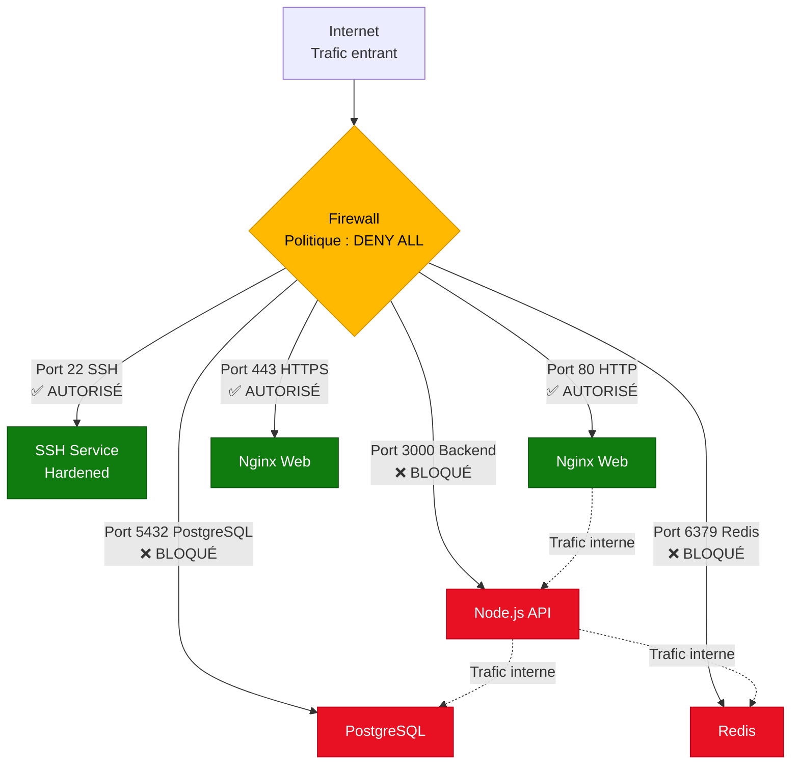
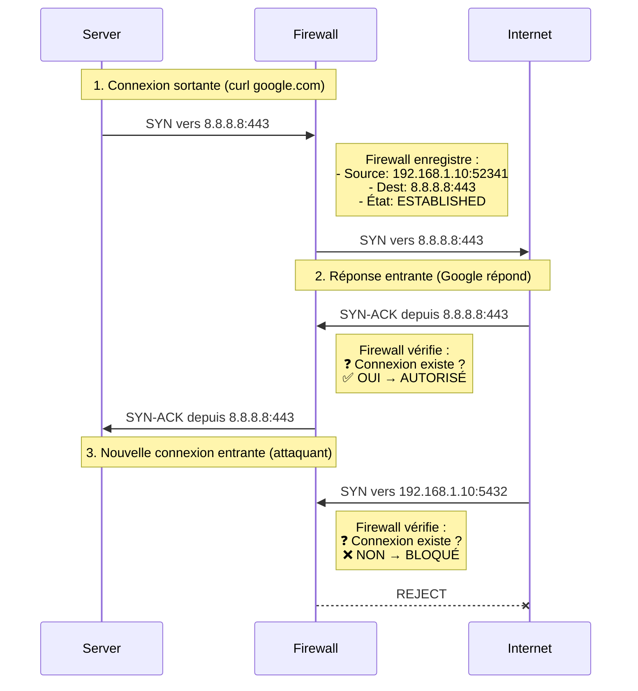

---
tags:
  - formation
  - security
  - firewall
  - ufw
  - firewalld
  - fail2ban
  - hardening
---

# Module 3 : Firewall - La Forteresse Réseau

## Objectif du Module

Maîtriser la configuration de firewalls Linux (UFW et Firewalld) pour implémenter une politique de sécurité réseau robuste basée sur le principe "deny by default", et renforcer la défense avec Fail2Ban contre les attaques par force brute.

**Durée :** 2 heures

## Introduction : Un Serveur Sans Firewall

### La Maison aux Portes Ouvertes

**Un serveur sans firewall, c'est comme une maison avec toutes les portes et fenêtres ouvertes.**

Même si vous avez verrouillé la porte d'entrée (SSH hardening, Module 1) et contrôlé qui a les clés (sudo, Module 2), **toutes les autres entrées sont accessibles**.

**Exemple concret :**

```bash
# Sans firewall : Tous les services sont exposés
sudo netstat -tulnp | grep LISTEN
# tcp   0.0.0.0:22    LISTEN    sshd          ← SSH (OK, sécurisé)
# tcp   0.0.0.0:80    LISTEN    nginx         ← HTTP (OK, public)
# tcp   0.0.0.0:3000  LISTEN    node          ← Backend API (❌ EXPOSÉ!)
# tcp   0.0.0.0:5432  LISTEN    postgres      ← PostgreSQL (❌ EXPOSÉ!)
# tcp   0.0.0.0:6379  LISTEN    redis         ← Redis (❌ EXPOSÉ!)
```

**Problème :**

- ✅ SSH (22) : Doit être accessible (sécurisé Module 1)
- ✅ HTTP (80) : Doit être accessible (site web public)
- ❌ Backend (3000) : Doit être **INTERNE** uniquement (nginx → backend)
- ❌ PostgreSQL (5432) : Doit être **INTERNE** uniquement (backend → DB)
- ❌ Redis (6379) : Doit être **INTERNE** uniquement (backend → cache)

**Sans firewall → Attaquant peut :**

1. Scanner les ports ouverts (`nmap 192.168.1.10`)
2. Détecter PostgreSQL sur 5432
3. Tenter bruteforce sur PostgreSQL
4. Exploiter une CVE PostgreSQL non patchée
5. Voler la base de données complète

!!! danger "Statistique Alarmante"
    **Shodan** (moteur de recherche pour appareils connectés) indexe **millions de serveurs** avec PostgreSQL/Redis/MongoDB **exposés publiquement** sans authentification.

    Temps moyen avant compromission : **quelques heures**.

## Concept : Principes du Firewall

### Politique par Défaut : "Deny All Incoming"

**Règle d'or de la sécurité réseau :**

```
DENY ALL INCOMING
ALLOW ALL OUTGOING
ALLOW SPECIFIC INCOMING (whitelist)
```

**Explication :**



**Résultat :**

- ✅ **Internet → SSH (22)** : Autorisé (pour administration)
- ✅ **Internet → HTTP (80/443)** : Autorisé (site web public)
- ❌ **Internet → Backend (3000)** : Bloqué (interne uniquement)
- ❌ **Internet → PostgreSQL (5432)** : Bloqué (interne uniquement)
- ❌ **Internet → Redis (6379)** : Bloqué (interne uniquement)
- ✅ **Nginx → Backend** : Autorisé (trafic localhost)
- ✅ **Backend → PostgreSQL** : Autorisé (trafic localhost)

**Bénéfice : Surface d'attaque réduite de 6 ports à 3 ports.**

### Inspection avec État (Stateful Firewall)

**Problème :** Comment autoriser les réponses aux connexions sortantes ?

**Exemple :**

```bash
# Serveur fait une requête DNS vers 8.8.8.8:53
curl https://google.com

# Question : Comment la réponse DNS peut-elle revenir si "DENY ALL INCOMING" ?
```

**Solution : Firewall avec état (Stateful)**

Le firewall **garde en mémoire** les connexions sortantes et **autorise automatiquement** les réponses entrantes correspondantes.



**États de connexion :**

| État | Signification | Action Firewall |
|------|---------------|----------------|
| **NEW** | Nouvelle connexion (SYN) | Vérifie règles |
| **ESTABLISHED** | Connexion active | ✅ Autorise |
| **RELATED** | Connexion liée (ex: FTP data) | ✅ Autorise |
| **INVALID** | Paquet malformé | ❌ Bloque |

**Règle iptables équivalente :**

```bash
# Autoriser connexions établies et liées
iptables -A INPUT -m state --state ESTABLISHED,RELATED -j ACCEPT

# Bloquer le reste
iptables -A INPUT -j DROP
```

### Surface d'Attaque : Minimiser l'Exposition

**Surface d'attaque :** Ensemble des points d'entrée exploitables par un attaquant.

**Principe :** **Moins de ports ouverts = Moins de risques**

**Exemple : Évolution d'un serveur web**

| Phase | Ports ouverts | Surface d'attaque |
|-------|---------------|-------------------|
| **Déploiement initial** | 22 (SSH), 80 (HTTP), 443 (HTTPS), 3000 (API), 5432 (PostgreSQL), 6379 (Redis) | **6 ports** |
| **Après firewall** | 22 (SSH), 80 (HTTP), 443 (HTTPS) | **3 ports** (-50%) |
| **Après reverse proxy** | 443 (HTTPS uniquement, avec SSL termination) | **1 port** (-83%) |
| **Après VPN** | 0 (SSH via VPN uniquement) | **0 port public** (-100%) |

**Objectif SecNumCloud :** Minimiser la surface d'attaque publique.

## Pratique 1 : UFW (Ubuntu/Debian)

### Présentation de UFW

**UFW (Uncomplicated Firewall)** est un frontend simplifié pour `iptables`, conçu pour faciliter la gestion du firewall sur Ubuntu/Debian.

**Avantages :**

- ✅ **Syntaxe simple** : `ufw allow 22`
- ✅ **Profiles d'applications** : `ufw allow 'Nginx Full'`
- ✅ **Règles persistantes** : Activées automatiquement au boot
- ✅ **Stateful par défaut** : Connexions établies autorisées

**Installation :**

=== "RHEL/Rocky (firewalld)"

    ```bash
    # firewalld est préinstallé sur RHEL/Rocky - préféré en entreprise
    sudo systemctl enable --now firewalld

    # Vérifier le statut
    sudo firewall-cmd --state
    # running
    ```

=== "Debian/Ubuntu (ufw)"

    ```bash
    # Installer UFW (généralement préinstallé sur Ubuntu)
    sudo apt update
    sudo apt install ufw -y

    # Vérifier la version
    sudo ufw version
    # ufw 0.36.1
    ```

### Configuration de Base

**Étape 1 : Définir les Politiques par Défaut**

```bash
# Politique par défaut : DENY tout le trafic entrant
sudo ufw default deny incoming

# Politique par défaut : ALLOW tout le trafic sortant
sudo ufw default allow outgoing

# Vérifier les politiques
sudo ufw status verbose
# Status: inactive
# Default: deny (incoming), allow (outgoing), disabled (routed)
```

**Étape 2 : Autoriser SSH (CRITIQUE)**

!!! danger "⚠️ AVERTISSEMENT - NE PAS SE BLOQUER"
    **AVANT** d'activer UFW, vous **DEVEZ** autoriser SSH, sinon vous perdrez l'accès au serveur !

    1. ✅ Autoriser SSH **AVANT** d'activer UFW
    2. ✅ Garder une session SSH active (backup)
    3. ✅ Tester dans une nouvelle fenêtre

    Si vous vous bloquez, utilisez la console KVM/IPMI du datacenter.

```bash
# Autoriser SSH (port 22)
sudo ufw allow 22/tcp

# Ou utiliser le nom du service
sudo ufw allow ssh

# Vérifier les règles (avant activation)
sudo ufw show added
# Added user rules:
# ufw allow 22/tcp
```

**Étape 3 : Autoriser HTTP/HTTPS**

```bash
# Autoriser HTTP
sudo ufw allow 80/tcp

# Autoriser HTTPS
sudo ufw allow 443/tcp

# Ou utiliser les profiles Nginx
sudo ufw allow 'Nginx Full'
# 'Nginx Full' = HTTP (80) + HTTPS (443)
```

**Étape 4 : Activer UFW**

```bash
# Activer le firewall
sudo ufw enable

# Confirmation demandée :
# Command may disrupt existing ssh connections. Proceed with operation (y|n)? y
# Firewall is active and enabled on system startup

# Vérifier le statut
sudo ufw status verbose
# Status: active
# Logging: on (low)
# Default: deny (incoming), allow (outgoing), disabled (routed)
#
# To                         Action      From
# --                         ------      ----
# 22/tcp                     ALLOW IN    Anywhere
# 80/tcp                     ALLOW IN    Anywhere
# 443/tcp                    ALLOW IN    Anywhere
```

**Étape 5 : Tester la Connexion SSH**

```bash
# Dans une NOUVELLE fenêtre de terminal
ssh user@192.168.1.10

# ✅ Si connexion réussie : UFW bien configuré
# ❌ Si échec : Revenir à la session active et corriger
```

### Règles Avancées

**Autoriser un port spécifique depuis une IP :**

```bash
# Autoriser PostgreSQL uniquement depuis 192.168.1.100
sudo ufw allow from 192.168.1.100 to any port 5432 proto tcp
```

**Autoriser un subnet :**

```bash
# Autoriser tout le trafic depuis le réseau interne
sudo ufw allow from 192.168.1.0/24
```

**Limiter les tentatives SSH (rate limiting) :**

```bash
# Limiter les connexions SSH (max 6 tentatives en 30 sec)
sudo ufw limit 22/tcp
```

**Supprimer une règle :**

```bash
# Lister les règles avec numéros
sudo ufw status numbered
# Status: active
#      To                         Action      From
#      --                         ------      ----
# [ 1] 22/tcp                     ALLOW IN    Anywhere
# [ 2] 80/tcp                     ALLOW IN    Anywhere

# Supprimer la règle #2
sudo ufw delete 2
```

**Réinitialiser UFW :**

```bash
# Désactiver UFW
sudo ufw disable

# Réinitialiser toutes les règles
sudo ufw reset
```

## Pratique 2 : Firewalld (RHEL/CentOS)

### Présentation de Firewalld

**Firewalld** est le firewall par défaut sur RHEL, CentOS, Fedora. Plus complexe que UFW, mais plus flexible.

**Concept de Zones :**

Firewalld utilise des **zones** pour appliquer différents niveaux de confiance au trafic.

| Zone | Niveau de confiance | Cas d'usage |
|------|-------------------|-------------|
| **drop** | Aucun | Bloquer tout (honeypot) |
| **block** | Aucun | Bloquer avec ICMP reject |
| **public** | ⚠️ Faible | Internet (par défaut) |
| **external** | ⚠️ Faible | NAT/Masquerading |
| **dmz** | ⚠️ Moyen | Zone démilitarisée |
| **work** | ✅ Moyen | Réseau de bureau |
| **home** | ✅ Élevé | Réseau domestique |
| **internal** | ✅ Élevé | Réseau interne sécurisé |
| **trusted** | ✅ Total | Réseau totalement sûr |

**Installation :**

```bash
# Installer firewalld (généralement préinstallé sur RHEL/CentOS)
sudo dnf install firewalld -y

# Démarrer et activer firewalld
sudo systemctl start firewalld
sudo systemctl enable firewalld

# Vérifier le statut
sudo firewall-cmd --state
# running
```

### Configuration de Base

**Étape 1 : Vérifier la Zone par Défaut**

```bash
# Afficher la zone par défaut
sudo firewall-cmd --get-default-zone
# public

# Lister les zones actives
sudo firewall-cmd --get-active-zones
# public
#   interfaces: eth0
```

**Étape 2 : Autoriser SSH (CRITIQUE)**

```bash
# Vérifier si SSH est autorisé dans la zone public
sudo firewall-cmd --zone=public --list-services
# cockpit dhcpv6-client ssh

# Si SSH n'est PAS dans la liste, l'ajouter :
sudo firewall-cmd --zone=public --add-service=ssh --permanent
sudo firewall-cmd --reload
```

**Étape 3 : Autoriser HTTP/HTTPS**

```bash
# Ajouter les services HTTP et HTTPS
sudo firewall-cmd --zone=public --add-service=http --permanent
sudo firewall-cmd --zone=public --add-service=https --permanent

# Recharger la configuration
sudo firewall-cmd --reload

# Vérifier les services autorisés
sudo firewall-cmd --zone=public --list-services
# cockpit dhcpv6-client http https ssh
```

**Étape 4 : Autoriser un Port Spécifique**

```bash
# Autoriser le port 3000/tcp (API backend) uniquement depuis le réseau interne
sudo firewall-cmd --zone=internal --add-port=3000/tcp --permanent

# Assigner l'interface interne à la zone internal
sudo firewall-cmd --zone=internal --add-interface=eth1 --permanent

# Recharger
sudo firewall-cmd --reload
```

### Règles Avancées

**Autoriser un port depuis une IP source :**

```bash
# Créer une rich rule pour autoriser PostgreSQL depuis 192.168.1.100
sudo firewall-cmd --zone=public --add-rich-rule='rule family="ipv4" source address="192.168.1.100" port port="5432" protocol="tcp" accept' --permanent
sudo firewall-cmd --reload
```

**Bloquer une IP :**

```bash
# Bloquer une IP malveillante
sudo firewall-cmd --zone=drop --add-source=185.220.101.45 --permanent
sudo firewall-cmd --reload
```

**Lister toutes les règles :**

```bash
# Afficher la configuration complète de la zone public
sudo firewall-cmd --zone=public --list-all
# public (active)
#   target: default
#   interfaces: eth0
#   sources:
#   services: http https ssh
#   ports:
#   protocols:
#   forward: yes
#   masquerade: no
#   rich rules:
```

**Supprimer une règle :**

```bash
# Supprimer le service HTTP
sudo firewall-cmd --zone=public --remove-service=http --permanent
sudo firewall-cmd --reload
```

## Bonus : Fail2Ban - Défense Active

### Concept : Bannir les Attaquants

**Fail2Ban** surveille les logs et **banit automatiquement** les IPs effectuant des attaques par force brute.

**Fonctionnement :**

```mermaid
flowchart LR
    A[Attaquant<br/>185.220.101.45] -->|Tentatives SSH<br/>échec x5| B[/var/log/auth.log]
    B --> C{Fail2Ban<br/>Parse logs}
    C -->|Détecte 5 échecs<br/>en 10 min| D[Ajoute règle firewall<br/>BLOCK 185.220.101.45]
    D --> E[Firewall<br/>UFW/Firewalld]
    E -->|Bannissement<br/>10 minutes| F[❌ Connexions bloquées]

    style A fill:#e81123,stroke:#b00016,color:#fff
    style C fill:#0078d4,stroke:#005a9e,color:#fff
    style D fill:#ffb900,stroke:#d39300,color:#000
    style F fill:#107c10,stroke:#0b5a0d,color:#fff
```

**Avantages :**

- 🛡️ **Protection automatique** : Pas besoin d'intervention manuelle
- 📊 **Basé sur logs** : Fonctionne avec n'importe quel service (SSH, Nginx, Apache)
- ⏱️ **Bannissement temporaire** : IP débloquée après X minutes (configurable)
- 🔍 **Traçabilité** : Logs des bannissements

### Installation et Configuration

**Installation :**

=== "RHEL/Rocky"

    ```bash
    sudo dnf install epel-release -y
    sudo dnf install fail2ban -y

    # Démarrer et activer
    sudo systemctl enable --now fail2ban
    ```

=== "Debian/Ubuntu"

    ```bash
    sudo apt update
    sudo apt install fail2ban -y

    # Démarrer et activer
    sudo systemctl enable --now fail2ban
    ```

**Configuration :**

```bash
# Copier le fichier de configuration par défaut
sudo cp /etc/fail2ban/jail.conf /etc/fail2ban/jail.local

# Éditer la configuration locale
sudo vim /etc/fail2ban/jail.local
```

**Configuration `/etc/fail2ban/jail.local` :**

```ini
[DEFAULT]
# Durée de bannissement (en secondes)
bantime = 3600          # 1 heure

# Fenêtre de temps pour détecter les échecs
findtime = 600          # 10 minutes

# Nombre max d'échecs avant bannissement
maxretry = 5

# Action à effectuer (bannir via iptables/firewalld)
banaction = iptables-multiport
# Pour firewalld : banaction = firewallcmd-ipset

# ==================
# JAIL SSH
# ==================
[sshd]
enabled = true
port = ssh
logpath = /var/log/auth.log     # Ubuntu/Debian
# logpath = /var/log/secure      # RHEL/CentOS
maxretry = 5

# ==================
# JAIL NGINX
# ==================
[nginx-http-auth]
enabled = true
port = http,https
logpath = /var/log/nginx/error.log
maxretry = 3

[nginx-botsearch]
enabled = true
port = http,https
logpath = /var/log/nginx/access.log
maxretry = 2
```

**Redémarrer Fail2Ban :**

```bash
sudo systemctl restart fail2ban
```

### Vérification et Monitoring

**Vérifier le statut :**

```bash
# Statut général
sudo fail2ban-client status
# Status
# |- Number of jail:      2
# `- Jail list:   nginx-http-auth, sshd

# Statut détaillé d'une jail
sudo fail2ban-client status sshd
# Status for the jail: sshd
# |- Filter
# |  |- Currently failed: 3
# |  |- Total failed:     156
# |  `- File list:        /var/log/auth.log
# `- Actions
#    |- Currently banned: 1
#    |- Total banned:     12
#    `- Banned IP list:   185.220.101.45
```

**Débannir manuellement une IP :**

```bash
sudo fail2ban-client set sshd unbanip 185.220.101.45
```

**Logs Fail2Ban :**

```bash
sudo tail -f /var/log/fail2ban.log
# 2025-01-22 16:30:15,123 fail2ban.filter  [1234]: INFO    [sshd] Found 185.220.101.45 - 2025-01-22 16:30:15
# 2025-01-22 16:30:20,456 fail2ban.actions [1234]: NOTICE  [sshd] Ban 185.220.101.45
```

## Exercice : Sécuriser un Serveur Web

!!! example "À Vous de Jouer - Configuration Firewall Complète"
    **Contexte :** Vous déployez un serveur web (Nginx) sur Ubuntu 22.04. Le serveur doit être accessible depuis Internet pour HTTP/HTTPS, mais protégé contre les attaques.

    **Objectif :** Implémenter une défense réseau en couches (firewall + IPS).

    **Prérequis :**
    - Serveur Ubuntu 22.04 avec Nginx installé
    - Accès SSH actif
    - Accès root ou sudo

    **Mission :**

    **1. Installer UFW**
    - Vérifier si UFW est installé, sinon l'installer

    **2. Configurer les Politiques par Défaut**
    - DENY tout le trafic entrant
    - ALLOW tout le trafic sortant

    **3. Autoriser les Services**
    - SSH (22) avec rate limiting
    - HTTP (80)
    - HTTPS (443)

    **4. Activer UFW**
    - Activer le firewall
    - Vérifier le statut

    **5. Installer et Configurer Fail2Ban**
    - Installer Fail2Ban
    - Configurer jail SSH (bantime 1h, maxretry 5)
    - Configurer jail Nginx (bantime 30min, maxretry 3)
    - Démarrer Fail2Ban

    **6. Tests de Validation**
    - Vérifier que SSH est accessible
    - Vérifier que HTTP est accessible (`curl http://localhost`)
    - Vérifier que PostgreSQL (5432) est bloqué (`nc -zv localhost 5432`)
    - Simuler une attaque SSH et vérifier le bannissement

    **Durée estimée :** 30 minutes

    **Critères de réussite :**

    - ✅ UFW actif avec politique deny incoming
    - ✅ SSH accessible (avec rate limiting)
    - ✅ HTTP/HTTPS accessibles
    - ✅ Autres ports bloqués
    - ✅ Fail2Ban actif avec 2 jails (sshd, nginx)
    - ✅ Test bannissement SSH fonctionne

## Solution : Configuration Complète

??? quote "Solution Détaillée"
    ### Étape 1 : Installer le Firewall

    === "RHEL/Rocky (firewalld)"

        ```bash
        # firewalld est préinstallé - juste l'activer
        sudo systemctl enable --now firewalld

        # Vérifier le statut
        sudo firewall-cmd --state
        # running
        ```

    === "Debian/Ubuntu (ufw)"

        ```bash
        # Vérifier si UFW est installé
        dpkg -l | grep ufw

        # Si non installé
        sudo apt update
        sudo apt install ufw -y

        # Vérifier la version
        sudo ufw version
        # ufw 0.36.1
        ```

    ### Étape 2 : Politiques par Défaut

    ```bash
    # Politique DENY pour trafic entrant
    sudo ufw default deny incoming
    # Default incoming policy changed to 'deny'

    # Politique ALLOW pour trafic sortant
    sudo ufw default allow outgoing
    # Default outgoing policy changed to 'allow'
    ```

    ### Étape 3 : Autoriser les Services

    ```bash
    # Autoriser SSH avec rate limiting (max 6 connexions en 30s)
    sudo ufw limit 22/tcp
    # Rules updated

    # Autoriser HTTP
    sudo ufw allow 80/tcp
    # Rules updated

    # Autoriser HTTPS
    sudo ufw allow 443/tcp
    # Rules updated

    # Vérifier les règles avant activation
    sudo ufw show added
    # Added user rules:
    # ufw limit 22/tcp
    # ufw allow 80/tcp
    # ufw allow 443/tcp
    ```

    ### Étape 4 : Activer UFW

    ```bash
    # Activer le firewall
    sudo ufw enable
    # Command may disrupt existing ssh connections. Proceed with operation (y|n)? y
    # Firewall is active and enabled on system startup

    # Vérifier le statut complet
    sudo ufw status verbose
    # Status: active
    # Logging: on (low)
    # Default: deny (incoming), allow (outgoing), disabled (routed)
    #
    # To                         Action      From
    # --                         ------      ----
    # 22/tcp                     LIMIT       Anywhere
    # 80/tcp                     ALLOW       Anywhere
    # 443/tcp                    ALLOW       Anywhere
    # 22/tcp (v6)                LIMIT       Anywhere (v6)
    # 80/tcp (v6)                ALLOW       Anywhere (v6)
    # 443/tcp (v6)               ALLOW       Anywhere (v6)
    ```

    ### Étape 5 : Installer Fail2Ban

    === "RHEL/Rocky"

        ```bash
        sudo dnf install epel-release -y
        sudo dnf install fail2ban -y
        ```

    === "Debian/Ubuntu"

        ```bash
        sudo apt update
        sudo apt install fail2ban -y
        ```

    ```bash

    # Copier la configuration par défaut
    sudo cp /etc/fail2ban/jail.conf /etc/fail2ban/jail.local

    # Éditer la configuration
    sudo vim /etc/fail2ban/jail.local
    ```

    **Configuration `/etc/fail2ban/jail.local` :**

    ```ini
    [DEFAULT]
    # Durées de bannissement
    bantime = 3600          # 1 heure pour SSH
    findtime = 600          # Fenêtre de 10 minutes
    maxretry = 5            # Max 5 échecs

    # Backend
    backend = systemd       # Ubuntu 22.04 utilise systemd

    # ==================
    # JAIL SSH
    # ==================
    [sshd]
    enabled = true
    port = ssh
    filter = sshd
    logpath = /var/log/auth.log
    maxretry = 5
    bantime = 3600

    # ==================
    # JAIL NGINX HTTP AUTH
    # ==================
    [nginx-http-auth]
    enabled = true
    port = http,https
    filter = nginx-http-auth
    logpath = /var/log/nginx/error.log
    maxretry = 3
    bantime = 1800          # 30 minutes

    # ==================
    # JAIL NGINX BOT SEARCH
    # ==================
    [nginx-botsearch]
    enabled = true
    port = http,https
    filter = nginx-botsearch
    logpath = /var/log/nginx/access.log
    maxretry = 2
    bantime = 1800
    ```

    **Démarrer Fail2Ban :**

    ```bash
    # Redémarrer Fail2Ban
    sudo systemctl restart fail2ban

    # Activer au démarrage
    sudo systemctl enable fail2ban

    # Vérifier le statut
    sudo systemctl status fail2ban
    # ● fail2ban.service - Fail2Ban Service
    #    Active: active (running)
    ```

    ### Étape 6 : Tests de Validation

    **Test 1 : SSH accessible (✅)**

    ```bash
    # Dans une nouvelle fenêtre
    ssh user@192.168.1.10
    # ✅ Connexion réussie
    ```

    **Test 2 : HTTP accessible (✅)**

    ```bash
    curl http://localhost
    # <!DOCTYPE html>
    # <html>
    # <head><title>Welcome to nginx!</title></head>
    # ✅ Nginx répond
    ```

    **Test 3 : PostgreSQL bloqué (✅)**

    ```bash
    # Tenter de se connecter au port 5432
    nc -zv localhost 5432
    # nc: connect to localhost port 5432 (tcp) failed: Connection refused
    # ✅ Port bloqué par le firewall
    ```

    **Test 4 : Fail2Ban actif (✅)**

    ```bash
    # Vérifier les jails actives
    sudo fail2ban-client status
    # Status
    # |- Number of jail:      3
    # `- Jail list:   nginx-botsearch, nginx-http-auth, sshd

    # Statut détaillé SSH
    sudo fail2ban-client status sshd
    # Status for the jail: sshd
    # |- Filter
    # |  |- Currently failed: 0
    # |  |- Total failed:     0
    # |  `- File list:        /var/log/auth.log
    # `- Actions
    #    |- Currently banned: 0
    #    |- Total banned:     0
    #    `- Banned IP list:
    ```

    **Test 5 : Simuler Attaque SSH (✅)**

    ```bash
    # Depuis une autre machine, tenter 6 connexions SSH échouées
    for i in {1..6}; do ssh wronguser@192.168.1.10; done

    # Vérifier le bannissement sur le serveur
    sudo fail2ban-client status sshd
    # Status for the jail: sshd
    # |- Currently banned: 1
    # `- Banned IP list:   192.168.1.100

    # Vérifier les règles UFW
    sudo ufw status numbered
    # [ 1] 22/tcp         LIMIT       Anywhere
    # [ 2] 80/tcp         ALLOW       Anywhere
    # [ 3] 443/tcp        ALLOW       Anywhere
    # [ 4] Anywhere       DENY IN     192.168.1.100    ← IP bannie par Fail2Ban
    ```

    **Test 6 : Vérifier Logs Fail2Ban (✅)**

    ```bash
    sudo tail -20 /var/log/fail2ban.log
    # 2025-01-22 17:15:30,123 fail2ban.filter  [1234]: INFO    [sshd] Found 192.168.1.100 - 2025-01-22 17:15:30
    # 2025-01-22 17:15:35,456 fail2ban.filter  [1234]: INFO    [sshd] Found 192.168.1.100 - 2025-01-22 17:15:35
    # 2025-01-22 17:15:40,789 fail2ban.filter  [1234]: INFO    [sshd] Found 192.168.1.100 - 2025-01-22 17:15:40
    # 2025-01-22 17:15:45,012 fail2ban.filter  [1234]: INFO    [sshd] Found 192.168.1.100 - 2025-01-22 17:15:45
    # 2025-01-22 17:15:50,345 fail2ban.filter  [1234]: INFO    [sshd] Found 192.168.1.100 - 2025-01-22 17:15:50
    # 2025-01-22 17:15:55,678 fail2ban.actions [1234]: NOTICE  [sshd] Ban 192.168.1.100
    # ✅ IP bannée après 5 tentatives
    ```

    ### Résumé de la Configuration

    **Firewall UFW :**

    | Port | Service | Action | Justification |
    |------|---------|--------|---------------|
    | 22 | SSH | LIMIT | Administration (rate limited) |
    | 80 | HTTP | ALLOW | Site web public |
    | 443 | HTTPS | ALLOW | Site web public (SSL) |
    | 3000 | API Backend | DENY | Interne uniquement (localhost) |
    | 5432 | PostgreSQL | DENY | Interne uniquement (localhost) |
    | 6379 | Redis | DENY | Interne uniquement (localhost) |

    **Fail2Ban Jails :**

    | Jail | Service | Bantime | Maxretry | Logpath |
    |------|---------|---------|----------|---------|
    | sshd | SSH | 1 heure | 5 | /var/log/auth.log |
    | nginx-http-auth | Nginx Auth | 30 min | 3 | /var/log/nginx/error.log |
    | nginx-botsearch | Nginx Bots | 30 min | 2 | /var/log/nginx/access.log |

    !!! success "Validation Complète"
        ✅ **Défense réseau en couches :**

        **Couche 1 : Firewall (UFW)**
        - Politique deny by default
        - Whitelist des ports autorisés (22, 80, 443)
        - Rate limiting SSH

        **Couche 2 : IPS (Fail2Ban)**
        - Détection automatique d'attaques
        - Bannissement temporaire des IPs
        - Protection SSH + Nginx

        **Surface d'attaque :** Réduite de 6 ports à 3 ports (-50%)

        En cas de compromission d'un service web (Nginx), l'attaquant **ne peut pas** accéder à PostgreSQL/Redis (bloqués par firewall).

## Points Clés à Retenir

**Ce module vous a appris :**

- 🏰 **Firewall = Forteresse** : Première ligne de défense réseau
- 🚫 **Deny by Default** : DENY ALL INCOMING, whitelist explicite
- 🔍 **Stateful Inspection** : Firewall garde en mémoire les connexions
- 📉 **Surface d'Attaque** : Minimiser les ports exposés publiquement
- 🛠️ **UFW** : Simple, pour Ubuntu/Debian (`ufw allow 22`)
- 🔧 **Firewalld** : Complexe mais flexible, pour RHEL/CentOS (zones)
- 🛡️ **Fail2Ban** : IPS basé sur logs, bannissement automatique
- ⚠️ **Ne pas se bloquer** : TOUJOURS autoriser SSH AVANT d'activer le firewall

**Commandes Essentielles UFW :**

```bash
# Politiques par défaut
sudo ufw default deny incoming
sudo ufw default allow outgoing

# Autoriser services
sudo ufw allow 22/tcp
sudo ufw limit ssh          # Rate limiting
sudo ufw allow 'Nginx Full'

# Activer/Désactiver
sudo ufw enable
sudo ufw disable

# Statut
sudo ufw status verbose
```

**Commandes Essentielles Firewalld :**

```bash
# Services
sudo firewall-cmd --zone=public --add-service=http --permanent
sudo firewall-cmd --reload

# Ports
sudo firewall-cmd --zone=public --add-port=8080/tcp --permanent

# Rich rules
sudo firewall-cmd --add-rich-rule='rule family="ipv4" source address="192.168.1.100" port port="5432" protocol="tcp" accept' --permanent

# Statut
sudo firewall-cmd --list-all
```

**Commandes Essentielles Fail2Ban :**

```bash
# Statut
sudo fail2ban-client status
sudo fail2ban-client status sshd

# Débannir IP
sudo fail2ban-client set sshd unbanip 192.168.1.100

# Logs
sudo tail -f /var/log/fail2ban.log
```

**Prochaine étape :** [Module 4 : Audit & Conformité](#) (en cours de rédaction)

---

**Retour au :** [Programme de la Formation](index.md) | [Catalogue](../index.md)
