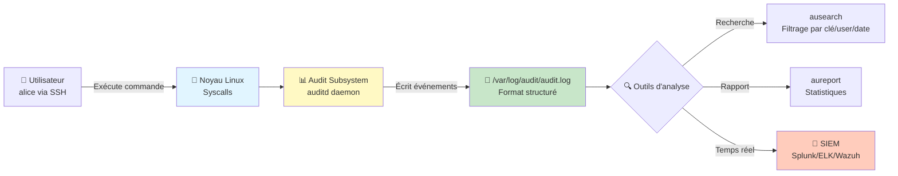

---
tags:
  - formation
  - security
  - audit
  - auditd
  - compliance
  - secnumcloud
  - hardening
---

# Module 4 : Audit & Conformité - La Preuve Numérique

## Objectif du Module

Maîtriser le framework d'audit Linux (auditd) pour garantir la traçabilité complète des actions système, répondre aux exigences de conformité SecNumCloud, et mener des investigations numériques post-incident.

**Durée :** 2 heures

## Introduction : Prévention et Détection

### Le Paradoxe de la Sécurité

> **"Prevention is ideal, detection is mandatory."**
> — Bruce Schneier, cryptographe et expert en sécurité

**La réalité :**

- ✅ **Modules 1-3 (SSH, Users, Firewall) :** Prévention → Réduire la surface d'attaque
- ⚠️ **Module 4 (Audit) :** Détection → Savoir **exactement** ce qui s'est passé

**Pourquoi la détection est obligatoire ?**

1. **Aucun système n'est 100% sûr** : Une faille zero-day, une erreur humaine, un insider malveillant...
2. **Conformité légale (RGPD, SecNumCloud, PCI-DSS) :** Obligation de traçabilité des accès aux données sensibles.
3. **Investigation post-incident :** Sans logs d'audit, impossible de répondre à :
   - **Qui** a accédé au serveur ?
   - **Quoi** a été modifié/supprimé ?
   - **Où** (quelle IP, quel terminal) ?
   - **Quand** exactement ?

### Exemple Concret : L'Incident du Fichier Fantôme

**Scénario réel :**

```bash
# Lundi 09h : Votre application ne démarre plus
sudo systemctl status myapp.service
# ● myapp.service - My Critical App
#    Loaded: loaded (/etc/systemd/system/myapp.service)
#    Active: failed (Result: exit-code)
#    Process: ExitCode=1 (config file not found)

# Investigation
ls -la /etc/app/secret.conf
# ls: cannot access '/etc/app/secret.conf': No such file or directory

# Sans audit : Questions sans réponses
# - Qui a supprimé ce fichier ?
# - Était-ce un attaquant ou un admin maladroit ?
# - Quand exactement (backup à restaurer) ?
# - Y a-t-il eu exfiltration des données avant suppression ?
```

**Avec audit activé → Réponses en 30 secondes.**

## Concept : Comprendre l'Audit Système

### Logging vs Auditing

| **Aspect** | **Logs Classiques** (`/var/log/syslog`) | **Audit Kernel** (`auditd`) |
|------------|----------------------------------------|----------------------------|
| **Source** | Applications (nginx, ssh, etc.) | **Noyau Linux** (syscalls) |
| **Fiabilité** | ⚠️ Modifiable par l'utilisateur root | ✅ **Inaltérable** (niveau kernel) |
| **Précision** | "User logged in" (peut-être) | "UID 1001 executed `/bin/bash` at 14:32:18.924" |
| **Performance** | Impact minimal | Impact faible mais mesurable |
| **Cas d'usage** | Dépannage quotidien | **Investigation forensique, Conformité** |

**Exemple comparatif :**

```bash
# Log SSH classique (/var/log/auth.log)
Jan 15 14:32:18 server sshd[1234]: Accepted publickey for alice from 192.168.1.100

# Audit Kernel (auditd)
type=USER_AUTH msg=audit(1705328538.924:456): pid=1234 uid=0 auid=1001
  ses=12 subj=unconfined_u:unconfined_r:unconfined_t:s0-s0:c0.c1023
  msg='op=PAM:authentication grantors=pam_unix acct="alice"
  exe="/usr/sbin/sshd" hostname=192.168.1.100 addr=192.168.1.100
  terminal=ssh res=success'
```

**Différences clés :**

- **`auid=1001`** : Audit User ID → **UID réel** même après `sudo` (contrairement à `uid=0`)
- **`ses=12`** : Session ID → Suivre toutes les actions d'une même session
- **Timestamp précis au milliseconde** : `1705328538.924`

### Les 4 W de l'Audit

Chaque événement d'audit répond aux **4 questions fondamentales** :

| **Question** | **Champ Audit** | **Exemple** |
|--------------|----------------|-------------|
| **Who** (Qui ?) | `auid` (Audit UID) | `auid=1001` (alice, même après `sudo`) |
| **What** (Quoi ?) | `syscall`, `key` | `syscall=unlink` (suppression fichier) |
| **Where** (Où ?) | `hostname`, `addr` | `hostname=192.168.1.100` |
| **When** (Quand ?) | `msg=audit(timestamp)` | `1705328538.924` (15/01/2025 14:32:18.924) |

**Exemple complet d'événement :**

```bash
type=SYSCALL msg=audit(1705328600.156:789): arch=c000003e syscall=87
  success=yes exit=0 a0=7ffd8c9e1234 a1=0 a2=0 a3=7ffd8c9e1000
  items=2 ppid=2341 pid=2342 auid=1001 uid=0 gid=0 euid=0 suid=0
  fsuid=0 egid=0 sgid=0 fsgid=0 tty=pts0 ses=12 comm="rm"
  exe="/usr/bin/rm" subj=unconfined_u:unconfined_r:unconfined_t:s0-s0:c0.c1023
  key="file-deletion"

type=PATH msg=audit(1705328600.156:789): item=0 name="/etc/app/secret.conf"
  inode=524321 dev=08:01 mode=0100600 ouid=0 ogid=0 rdev=00:00
  nametype=DELETE cap_fp=0 cap_fi=0 cap_fe=0 cap_fver=0
```

**Décodage :**

- **Who :** `auid=1001` (alice) a utilisé `sudo` (`uid=0`)
- **What :** `syscall=87` (unlink = suppression), fichier `/etc/app/secret.conf`
- **Where :** Session `ses=12`, terminal `tty=pts0`
- **When :** Timestamp `1705328600.156` → 15/01/2025 14:33:20.156

### Architecture de l'Audit Linux



**Flux d'un événement :**

1. **Action utilisateur :** `alice` exécute `sudo rm /etc/app/secret.conf`
2. **Interception kernel :** Le syscall `unlink` est intercepté par le noyau
3. **Règle d'audit matchée :** `-w /etc/app/secret.conf -p wa -k secret-deletion`
4. **Événement généré :** Écrit dans `/var/log/audit/audit.log` avec tous les métadonnées
5. **Analyse :** `ausearch -k secret-deletion` retrouve l'événement immédiatement

**Avantage critique :** Même si un attaquant obtient root et supprime `/var/log/auth.log`, **il ne peut pas modifier `/var/log/audit/audit.log`** sans redémarrer le système (mode immutable).

## Pratique : Auditd Framework

### Installation

=== "RHEL/Rocky"

    ```bash
    # Installation
    sudo dnf install audit -y

    # Activation
    sudo systemctl enable --now auditd

    # Vérification
    sudo systemctl status auditd
    # ● auditd.service - Security Auditing Service
    #    Active: active (running)

    # Version
    auditctl -v
    # auditctl version 3.0.9
    ```

=== "Debian/Ubuntu"

    ```bash
    # Installation
    sudo apt update
    sudo apt install auditd audispd-plugins -y

    # Vérification
    sudo systemctl status auditd
    # ● auditd.service - Security Auditing Service
    #    Loaded: loaded (/lib/systemd/system/auditd.service; enabled)
    #    Active: active (running)

    # Version
    auditctl -v
    # auditctl version 3.0.7

    # Vérification
    sudo auditctl -l
    # No rules
    ```

### Configuration des Règles d'Audit

#### Fichier de Configuration

Les règles d'audit sont stockées dans `/etc/audit/rules.d/audit.rules` (ou `/etc/audit/audit.rules` selon la distribution).

```bash
# Éditer le fichier de règles
sudo nano /etc/audit/rules.d/audit.rules
```

#### Surveillance de Fichiers Critiques

**Syntaxe :** `-w <chemin> -p <permissions> -k <clé>`

**Permissions :**

- `r` : Read (lecture)
- `w` : Write (écriture)
- `x` : Execute (exécution)
- `a` : Attribute change (modification attributs : chmod, chown, etc.)

**Exemples :**

```bash
# 1. Surveiller les modifications du fichier de mots de passe
-w /etc/shadow -p wa -k shadow-change

# 2. Surveiller les modifications de la configuration sudo
-w /etc/sudoers -p wa -k sudoers-change
-w /etc/sudoers.d/ -p wa -k sudoers-change

# 3. Surveiller les clés SSH autorisées
-w /home/alice/.ssh/authorized_keys -p wa -k ssh-key-change
-w /root/.ssh/authorized_keys -p wa -k ssh-key-change

# 4. Surveiller les binaires critiques
-w /usr/bin/passwd -p x -k passwd-exec
-w /usr/bin/sudo -p x -k sudo-exec

# 5. Surveiller les outils réseau suspects
-w /usr/bin/ncat -p x -k suspicious-exec
-w /usr/bin/nc -p x -k suspicious-exec
-w /usr/bin/socat -p x -k suspicious-exec
```

**Application des règles :**

```bash
# Recharger les règles
sudo augenrules --load

# Vérifier les règles actives
sudo auditctl -l
# -w /etc/shadow -p wa -k shadow-change
# -w /etc/sudoers -p wa -k sudoers-change
# ...
```

#### Surveillance de Commandes Système

**Surveiller toutes les suppressions de fichiers :**

```bash
# Règle pour syscall unlink (suppression)
-a always,exit -F arch=b64 -S unlink,unlinkat,rename,renameat -F auid>=1000 -F auid!=unset -k file-deletion
```

**Décodage :**

- `-a always,exit` : Auditer à la sortie du syscall (always = toujours)
- `-F arch=b64` : Filtrer architecture 64 bits
- `-S unlink,unlinkat,rename,renameat` : Syscalls de suppression/renommage
- `-F auid>=1000` : Uniquement utilisateurs non-système (UID >= 1000)
- `-F auid!=unset` : Exclure les processus sans auid
- `-k file-deletion` : Clé de recherche

**Surveiller les changements de permissions :**

```bash
# Chmod/chown sur fichiers sensibles
-a always,exit -F arch=b64 -S chmod,fchmod,fchmodat -F auid>=1000 -k perm-change
-a always,exit -F arch=b64 -S chown,fchown,fchownat,lchown -F auid>=1000 -k ownership-change
```

**Surveiller les élévations de privilèges :**

```bash
# Surveillance des commandes sudo
-a always,exit -F arch=b64 -S execve -F path=/usr/bin/sudo -k sudo-usage

# Surveillance des changements d'UID/GID (setuid)
-a always,exit -F arch=b64 -S setuid,setgid,setreuid,setregid -k privilege-escalation
```

#### Mode Immutable (Immuabilité des Règles)

**Problème :** Un attaquant avec root peut désactiver l'audit (`auditctl -D`).

**Solution :** Mode immutable.

```bash
# Ajouter cette ligne À LA FIN du fichier /etc/audit/rules.d/audit.rules
-e 2
```

**Signification :**

- `-e 0` : Audit désactivé
- `-e 1` : Audit activé (par défaut)
- `-e 2` : **Immutable** → Règles verrouillées jusqu'au prochain reboot

**Conséquence :**

```bash
# Après activation du mode immutable
sudo auditctl -D
# Error - audit rules cannot be changed when immutable mode is enabled
# To change audit rules, please reboot

# Modification impossible même en root
sudo augenrules --load
# Error sending rule data request (Operation not permitted)
```

!!! warning "Attention - Mode Immutable"
    **Le mode immutable empêche TOUTE modification des règles d'audit** jusqu'au redémarrage.

    **Utilisez-le uniquement sur des serveurs de production avec configuration stable.**

    Pour tester vos règles :
    1. Ne PAS activer `-e 2`
    2. Tester avec `auditctl -l` et `ausearch`
    3. Valider pendant 24-48h
    4. Activer `-e 2` après validation complète

### Outils d'Investigation

#### 1. ausearch - Recherche d'Événements

**Commandes essentielles :**

```bash
# Recherche par clé
sudo ausearch -k shadow-change
# Affiche tous les événements avec la clé "shadow-change"

# Recherche par utilisateur (auid)
sudo ausearch -ua alice
# Toutes les actions de l'utilisateur alice (même via sudo)

# Recherche par UID (uid effectif)
sudo ausearch -ui 0
# Toutes les actions effectuées en tant que root

# Recherche par date
sudo ausearch -ts today
# Événements d'aujourd'hui

sudo ausearch -ts 01/15/2025 14:00:00 -te 01/15/2025 15:00:00
# Entre 14h et 15h le 15 janvier

# Recherche par fichier
sudo ausearch -f /etc/shadow
# Tous les accès au fichier /etc/shadow

# Recherche par syscall
sudo ausearch -sc unlink
# Toutes les suppressions de fichiers

# Combiner plusieurs filtres
sudo ausearch -k file-deletion -ts today -i
# Suppressions aujourd'hui, format interprété (-i)
```

**Option `-i` (interpret) :**

Sans `-i` :

```
type=SYSCALL msg=audit(1705328600.156:789): auid=1001 uid=0 comm="rm"
```

Avec `-i` :

```
type=SYSCALL msg=audit(01/15/2025 14:33:20.156:789): auid=alice uid=root comm="rm"
```

**Exemple d'investigation complète :**

```bash
# Scénario : Fichier critique supprimé
sudo ausearch -k secret-deletion -i

----
type=SYSCALL msg=audit(01/15/2025 14:33:20.156:789): arch=x86_64 syscall=unlink
  success=yes exit=0 a0=7ffd8c9e1234 a1=0 a2=0 a3=7ffd8c9e1000 items=2
  ppid=2341 pid=2342 auid=alice uid=root gid=root euid=root suid=root
  fsuid=root egid=root sgid=root fsgid=root tty=pts0 ses=12 comm="rm"
  exe="/usr/bin/rm" key="secret-deletion"

type=PATH msg=audit(01/15/2025 14:33:20.156:789): item=0
  name="/etc/app/secret.conf" inode=524321 dev=08:01 mode=file,600
  ouid=root ogid=root rdev=00:00 nametype=DELETE
----
```

**Informations extraites :**

- **Qui :** `auid=alice` (utilisateur réel), `uid=root` (via sudo)
- **Quoi :** Suppression (`syscall=unlink`) du fichier `/etc/app/secret.conf`
- **Quand :** 15/01/2025 à 14:33:20.156
- **Où :** Session `ses=12`, terminal `tty=pts0`
- **Event ID :** `789` (pour traçabilité croisée)

#### 2. aureport - Rapports Statistiques

**Commandes utiles :**

```bash
# Résumé général
sudo aureport

# Top utilisateurs par nombre d'événements
sudo aureport -u

# Connexions réussies/échouées
sudo aureport -l
# Login Report
# Number of failed logins: 12
# Number of successful logins: 45

# Modifications de fichiers
sudo aureport -f

# Commandes exécutées
sudo aureport -x

# Rapport sur la dernière heure
sudo aureport -ts recent

# Rapport détaillé avec interprétation
sudo aureport --summary -i
```

**Exemple de sortie `aureport -u` :**

```
User Summary Report
===========================
# date time auid user total
===========================
1. 01/15/25 14:00:00 1001 alice 156
2. 01/15/25 14:15:00 1002 bob 43
3. 01/15/25 14:30:00 0 root 12
```

#### 3. Analyse en Temps Réel avec ausearch

**Surveiller les événements en direct :**

```bash
# Suivre les nouveaux événements (tail -f like)
sudo ausearch -ts recent -i | tail -f

# Surveiller une clé spécifique en temps réel
watch -n 2 'sudo ausearch -k file-deletion -ts recent -i | tail -20'
```

### Exemple de Configuration Complète

**Fichier `/etc/audit/rules.d/audit.rules` :**

```bash
# Supprimer toutes les règles précédentes
-D

# Buffer (augmenter si perte d'événements)
-b 8192

# Échec si buffer plein (au lieu de perdre des événements)
-f 2

## 1. Fichiers de configuration système
-w /etc/passwd -p wa -k identity
-w /etc/group -p wa -k identity
-w /etc/shadow -p wa -k identity
-w /etc/gshadow -p wa -k identity

## 2. Configuration sudo
-w /etc/sudoers -p wa -k sudoers-change
-w /etc/sudoers.d/ -p wa -k sudoers-change

## 3. Clés SSH
-w /root/.ssh/authorized_keys -p wa -k ssh-key-change
-w /home/ -p wa -k ssh-key-change

## 4. Binaires système critiques
-w /usr/bin/passwd -p x -k passwd-exec
-w /usr/bin/sudo -p x -k sudo-exec
-w /usr/sbin/groupadd -p x -k group-mgmt
-w /usr/sbin/useradd -p x -k user-mgmt
-w /usr/sbin/userdel -p x -k user-mgmt

## 5. Outils réseau suspects
-w /usr/bin/nc -p x -k suspicious-nettools
-w /usr/bin/ncat -p x -k suspicious-nettools
-w /usr/bin/socat -p x -k suspicious-nettools
-w /usr/bin/wget -p x -k suspicious-download
-w /usr/bin/curl -p x -k suspicious-download

## 6. Syscalls critiques (utilisateurs non-système uniquement)
# Suppressions de fichiers
-a always,exit -F arch=b64 -S unlink,unlinkat,rename,renameat -F auid>=1000 -F auid!=unset -k file-deletion

# Modifications de permissions
-a always,exit -F arch=b64 -S chmod,fchmod,fchmodat -F auid>=1000 -k perm-change
-a always,exit -F arch=b64 -S chown,fchown,fchownat,lchown -F auid>=1000 -k ownership-change

# Élévation de privilèges
-a always,exit -F arch=b64 -S setuid,setgid,setreuid,setregid -k privilege-escalation

## 7. Montages/démontages
-a always,exit -F arch=b64 -S mount,umount2 -F auid>=1000 -k mount-operations

## MODE IMMUTABLE - À activer EN DERNIER après validation
# -e 2
```

**Application :**

```bash
# Charger les règles
sudo augenrules --load

# Vérifier
sudo auditctl -l | grep -E "shadow|sudo|ssh"

# Redémarrer auditd (si nécessaire)
sudo systemctl restart auditd
```

## Exercice : Enquête Numérique

### Scénario - Le Mystère du Fichier Disparu

**Contexte :**

Vous êtes administrateur système d'un serveur applicatif critique.

**Lundi 09h15 :** Votre application `criticalapp` ne démarre plus. Le fichier de configuration `/etc/app/secret.conf` a été supprimé.

**Mission :**

Utiliser `auditd` pour déterminer **QUI, QUAND, et COMMENT** ce fichier a été supprimé.

### Étapes de l'Exercice

#### 1. Préparation de l'Environnement

```bash
# Créer le fichier "critique"
sudo mkdir -p /etc/app
echo "SECRET_KEY=production_secret_2025" | sudo tee /etc/app/secret.conf
sudo chmod 600 /etc/app/secret.conf
```

#### 2. Configuration de l'Audit

**Mission :** Configurer `auditd` pour surveiller :

- Le fichier `/etc/app/secret.conf` (lecture/écriture/attributs)
- Toutes les suppressions de fichiers (syscall `unlink`)

**Fichiers à éditer :**

- `/etc/audit/rules.d/audit.rules`

#### 3. Simulation de l'Incident

**Attendre quelques minutes, puis :**

```bash
# En tant qu'utilisateur normal (ou via sudo)
sudo rm /etc/app/secret.conf

# Vérifier la suppression
ls -la /etc/app/secret.conf
# ls: cannot access '/etc/app/secret.conf': No such file or directory
```

#### 4. Investigation Forensique

**Vos objectifs :**

1. Trouver **l'Event ID** de la suppression
2. Identifier **l'auid** (le vrai utilisateur, même après sudo)
3. Déterminer **le timestamp exact** (date + heure)
4. Vérifier **la commande utilisée** (`comm`, `exe`)

**Outils à utiliser :**

- `ausearch` avec les bonnes options
- `aureport` pour contexte

### Questions de l'Enquête

1. **Quel utilisateur (auid) a supprimé le fichier ?**
2. **À quelle heure exacte (timestamp) ?**
3. **Quel était le chemin complet du binaire utilisé (`exe`) ?**
4. **Quel est l'Event ID de cet événement ?**
5. **L'utilisateur était-il connecté en SSH (tty) ou via une session locale ?**

## Solution

??? quote "Solution Complète - Enquête Numérique"

    ### Étape 1 : Configuration des Règles d'Audit

    **Éditer `/etc/audit/rules.d/audit.rules` :**

    ```bash
    sudo nano /etc/audit/rules.d/audit.rules
    ```

    **Ajouter ces règles :**

    ```bash
    # Surveillance du fichier critique
    -w /etc/app/secret.conf -p rwa -k secret-file-access

    # Surveillance des suppressions (syscall unlink)
    -a always,exit -F arch=b64 -S unlink,unlinkat -F auid>=1000 -F auid!=unset -k file-deletion
    ```

    **Appliquer les règles :**

    ```bash
    sudo augenrules --load

    # Vérifier
    sudo auditctl -l | grep -E "secret|unlink"
    # -w /etc/app/secret.conf -p rwa -k secret-file-access
    # -a always,exit -F arch=b64 -S unlink,unlinkat -F auid>=1000 -F auid!=-1 -k file-deletion
    ```

    ---

    ### Étape 2 : Investigation avec ausearch

    **Recherche par clé "secret-file-access" :**

    ```bash
    sudo ausearch -k secret-file-access -i
    ```

    **OU recherche par clé "file-deletion" :**

    ```bash
    sudo ausearch -k file-deletion -i
    ```

    **OU recherche directe par nom de fichier :**

    ```bash
    sudo ausearch -f /etc/app/secret.conf -i
    ```

    ---

    ### Étape 3 : Analyser l'Événement

    **Exemple de sortie `ausearch -k secret-file-access -i` :**

    ```
    ----
    type=SYSCALL msg=audit(01/22/2025 15:42:18.456:1234): arch=x86_64 syscall=unlinkat
      success=yes exit=0 a0=ffffff9c a1=55b8c9e40123 a2=0 a3=0 items=2
      ppid=3456 pid=3457 auid=alice uid=root gid=root euid=root suid=root
      fsuid=root egid=root sgid=root fsgid=root tty=pts0 ses=15 comm="rm"
      exe="/usr/bin/rm" subj=unconfined_u:unconfined_r:unconfined_t:s0-s0:c0.c1023
      key="secret-file-access"

    type=PATH msg=audit(01/22/2025 15:42:18.456:1234): item=0
      name="/etc/app/" inode=262145 dev=08:01 mode=dir,755 ouid=root ogid=root
      rdev=00:00 nametype=PARENT cap_fp=0 cap_fi=0 cap_fe=0 cap_fver=0

    type=PATH msg=audit(01/22/2025 15:42:18.456:1234): item=1
      name="/etc/app/secret.conf" inode=524321 dev=08:01 mode=file,600
      ouid=root ogid=root rdev=00:00 nametype=DELETE cap_fp=0 cap_fi=0
      cap_fe=0 cap_fver=0
    ----
    ```

    ---

    ### Étape 4 : Réponses aux Questions

    **1. Quel utilisateur (auid) a supprimé le fichier ?**

    ```
    auid=alice
    ```

    → **L'utilisateur "alice"** (même si l'action a été faite via `sudo`, d'où `uid=root`)

    ---

    **2. À quelle heure exacte ?**

    ```
    msg=audit(01/22/2025 15:42:18.456:1234)
    ```

    → **Le 22 janvier 2025 à 15h42m18s.456**

    ---

    **3. Quel binaire a été utilisé ?**

    ```
    exe="/usr/bin/rm"
    comm="rm"
    ```

    → **La commande `/usr/bin/rm`** (suppression classique)

    ---

    **4. Quel est l'Event ID ?**

    ```
    msg=audit(...:1234)
    ```

    → **Event ID : 1234**

    ---

    **5. Type de session (SSH ou locale) ?**

    ```
    tty=pts0
    ses=15
    ```

    → **Session SSH** (`pts0` = pseudo-terminal, typique d'une connexion SSH)
    → **Session ID : 15**

    ---

    ### Étape 5 : Rapport Final d'Incident

    **Résumé de l'enquête :**

    | **Élément** | **Valeur** |
    |-------------|-----------|
    | **Utilisateur responsable** | `alice` (auid=alice) |
    | **Élévation de privilèges** | ✅ Oui (uid=root via sudo) |
    | **Date/Heure** | 22/01/2025 15:42:18.456 |
    | **Commande** | `/usr/bin/rm /etc/app/secret.conf` |
    | **Type de connexion** | SSH (tty=pts0) |
    | **Session ID** | 15 |
    | **Event ID** | 1234 |
    | **Fichier supprimé** | `/etc/app/secret.conf` (inode=524321) |

    **Action recommandée :**

    1. **Restaurer le fichier** depuis le backup le plus récent (avant 15:42:18)
    2. **Interviewer alice** : Erreur humaine ou action malveillante ?
    3. **Renforcer la protection** : Ajouter `chattr +i /etc/app/secret.conf` (immutable flag)
    4. **Activer mode immutable audit** : `-e 2` en production

    ---

    ### Bonus : Commandes Forensiques Avancées

    **Voir TOUTES les actions de l'utilisateur alice pendant cette session :**

    ```bash
    sudo ausearch -ua alice -ts 01/22/2025 15:40:00 -te 01/22/2025 15:50:00 -i
    ```

    **Générer un rapport statistique du jour :**

    ```bash
    sudo aureport -ts today --summary
    ```

    **Exporter les événements pour analyse externe (SIEM) :**

    ```bash
    sudo ausearch -k file-deletion -ts today --format csv > /tmp/audit_deletions.csv
    ```

## Conclusion du Module

### Ce que Vous Avez Appris

✅ **Différence Logging vs Auditing** : Logs applicatifs vs traçabilité kernel inaltérable

✅ **Les 4 W de l'investigation** : Who, What, Where, When

✅ **Configuration auditd** :
- Surveillance de fichiers (`-w`)
- Surveillance de syscalls (`-a always,exit -S`)
- Mode immutable (`-e 2`)

✅ **Investigation forensique** :
- `ausearch` pour retrouver des événements
- `aureport` pour statistiques
- Analyse des champs critiques (auid, timestamp, exe)

### Checklist de Conformité SecNumCloud

| **Exigence** | **Implémentation Auditd** | **Statut** |
|--------------|--------------------------|-----------|
| Traçabilité des accès privilégiés | Surveillance sudo (`-k sudo-usage`) | ✅ |
| Traçabilité des modifications de configuration | `-w /etc/` watchs | ✅ |
| Horodatage précis des événements | Timestamp milliseconde | ✅ |
| Inaltérabilité des logs | Mode immutable (`-e 2`) | ✅ |
| Conservation des logs | Rotation + archivage `/var/log/audit/` | ✅ |
| Capacité d'investigation | `ausearch`/`aureport` | ✅ |

### Progression Formation "Hardening Linux"

| Module | Sujet | Statut | Durée |
|--------|-------|--------|-------|
| Module 1 | SSH Hardening | ✅ Complet | 1h30 |
| Module 2 | Users & Sudo | ✅ Complet | 1h |
| Module 3 | Firewall | ✅ Complet | 2h |
| **Module 4** | **Audit & Conformité** | **✅ Complet** | **2h** |
| **Total** | | **4/4 modules** | **6h30** |

### Pour Aller Plus Loin

**Intégration SIEM :**

```bash
# Forwarding auditd vers Rsyslog puis SIEM
sudo apt install audispd-plugins

# /etc/audisp/plugins.d/syslog.conf
active = yes
direction = out
path = /sbin/audisp-syslog
type = always
format = string
```

**Audit de conformité automatisé :**

```bash
# Utiliser auditd avec OpenSCAP (module suivant potentiel)
sudo oscap xccdf eval --profile xccdf_org.ssgproject.content_profile_pci-dss \
  /usr/share/xml/scap/ssg/content/ssg-ubuntu2004-ds.xml
```

**Analyse comportementale :**

```bash
# Détecter les anomalies (ex: utilisateur qui exécute nc pour la première fois)
sudo aureport -x --summary | grep -E "nc|ncat|socat"
```

### Prochaines Étapes

**Si vous complétez cette formation :**

1. **TP Final** : Hardening complet d'un serveur from scratch (Modules 1-4)
2. **Automatisation** : Scripts Ansible pour déploiement des règles audit
3. **Monitoring avancé** : Intégration avec Wazuh/ELK pour alerting temps réel

---

**Félicitations ! Vous maîtrisez maintenant l'audit système Linux pour la conformité SecNumCloud.** 🎓
