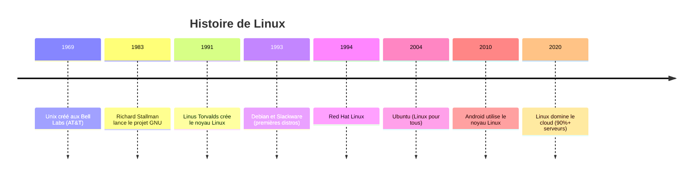
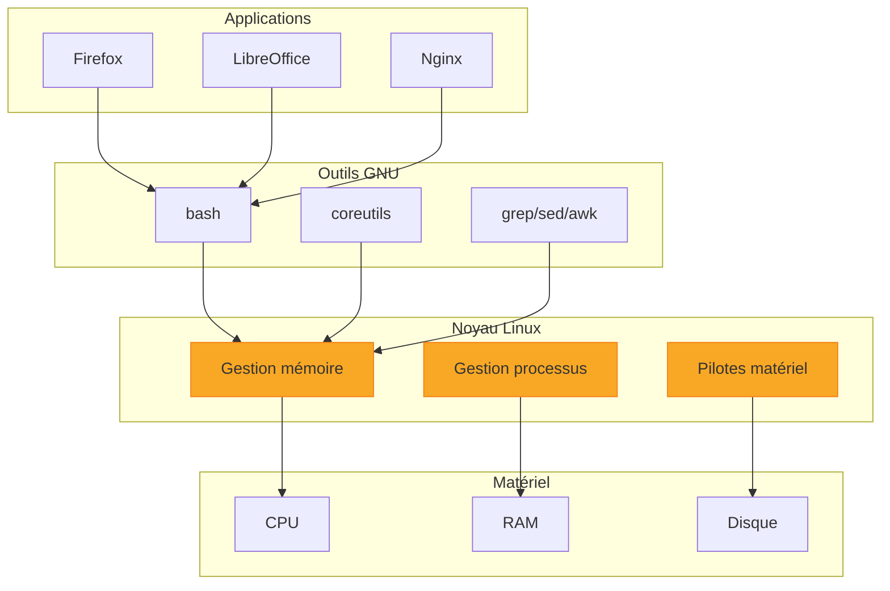
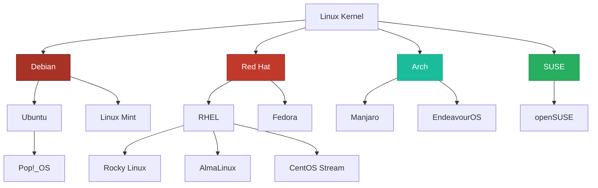
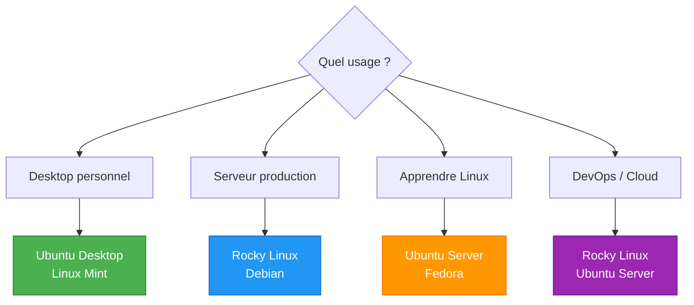

---
tags:
  - formation
  - linux
  - debutant
  - installation
  - distributions
---

# Module 1 : Découverte de Linux

## Objectifs du Module

À l'issue de ce module, vous serez capable de :

- Comprendre l'histoire et la philosophie de Linux
- Différencier les principales distributions
- Installer Linux dans une machine virtuelle
- Effectuer vos premières connexions et commandes

**Durée :** 4 heures

**Niveau :** Débutant complet

---

## 1. Qu'est-ce que Linux ?

### Histoire en 5 Minutes



### Linux = GNU + Kernel

**Linux** n'est pas un système d'exploitation complet, c'est un **noyau** (kernel). Le système complet s'appelle **GNU/Linux** :



### La Philosophie Unix

Linux hérite de la philosophie Unix, résumée en quelques principes :

| Principe | Description | Exemple |
|----------|-------------|---------|
| **Faire une chose bien** | Chaque programme fait une seule tâche | `ls` liste les fichiers, c'est tout |
| **Tout est fichier** | Périphériques, processus = fichiers | `/dev/sda`, `/proc/cpuinfo` |
| **Texte comme interface** | Données en texte brut | Configuration en fichiers `.conf` |
| **Composition** | Combiner des outils simples | `cat file | grep error | wc -l` |

!!! quote "Doug McIlroy (créateur des pipes Unix)"
    "Write programs that do one thing and do it well. Write programs to work together."

---

## 2. Les Distributions Linux

### Qu'est-ce qu'une Distribution ?

Une **distribution** (ou "distro") est un système complet incluant :

- Le noyau Linux
- Les outils GNU
- Un gestionnaire de paquets
- Un installateur
- Des configurations par défaut

### Les Grandes Familles



### Comparaison des Distributions Principales

| Distribution | Famille | Usage | Paquets | Cycle |
|--------------|---------|-------|---------|-------|
| **Ubuntu** | Debian | Desktop, Cloud | APT (.deb) | 6 mois / LTS 2 ans |
| **Debian** | Debian | Serveurs, stabilité | APT (.deb) | 2-3 ans |
| **Rocky Linux** | RHEL | Entreprise | DNF (.rpm) | 10 ans |
| **Fedora** | RHEL | Innovation | DNF (.rpm) | 6 mois |
| **Arch** | Indépendant | Experts | pacman | Rolling |
| **openSUSE** | SUSE | Entreprise | zypper (.rpm) | LTS / Rolling |

### Quelle Distribution Choisir ?



!!! tip "Recommandation pour cette Formation"
    Nous utiliserons **Rocky Linux 9** (environnement entreprise RHEL) et **Ubuntu 22.04 LTS** (cloud et DevOps) pour couvrir les deux grandes familles.

---

## 3. Installation de Linux

### Méthodes d'Installation

| Méthode | Avantages | Inconvénients | Recommandé pour |
|---------|-----------|---------------|-----------------|
| **VM (VirtualBox/VMware)** | Sécurisé, réversible | Performances réduites | Apprentissage |
| **Dual Boot** | Performances natives | Risque données | Utilisateurs confirmés |
| **WSL2 (Windows)** | Intégré à Windows | Pas de GUI native | Développeurs Windows |
| **Cloud (GCP/AWS)** | Aucune installation | Coût potentiel | Production |
| **Raspberry Pi** | Pas cher, physique | Matériel limité | IoT, projets |

### Installation VirtualBox + Rocky Linux 9

#### Étape 1 : Téléchargements

```bash
# 1. Télécharger VirtualBox
# https://www.virtualbox.org/wiki/Downloads

# 2. Télécharger Rocky Linux 9 (ISO DVD ~10 GB)
# https://rockylinux.org/download

# Alternative : ISO minimal (~2 GB)
# https://download.rockylinux.org/pub/rocky/9/isos/x86_64/
```

#### Étape 2 : Créer la VM

```
Configuration VM recommandée :
┌─────────────────────────────────────┐
│  Nom : lab-rocky                    │
│  Type : Linux                       │
│  Version : Red Hat (64-bit)         │
├─────────────────────────────────────┤
│  RAM : 2048 MB (2 GB minimum)       │
│  CPU : 2 cores                      │
│  Disque : 20 GB (dynamique)         │
│  Réseau : NAT + Host-Only           │
└─────────────────────────────────────┘
```

#### Étape 3 : Installation Rocky Linux

1. **Démarrer la VM** avec l'ISO monté
2. **Choisir "Install Rocky Linux 9"**
3. **Configuration :**
   - Langue : Français ou English
   - Clavier : fr-FR
   - Fuseau horaire : Europe/Paris
   - **Installation Destination** : Sélectionner le disque
   - **Root Password** : Définir un mot de passe fort
   - **User Creation** : Créer votre utilisateur (cocher "Make admin")
4. **Begin Installation**
5. **Reboot** après installation

### Première Connexion

Après le reboot, vous arrivez sur l'écran de login :

```
Rocky Linux 9.3 (Blue Onyx)
Kernel 5.14.0-362.el9.x86_64 on an x86_64

lab-rocky login: votre_user
Password: ********

[votre_user@lab-rocky ~]$
```

**Félicitations !** Vous êtes connecté à votre premier système Linux.

---

## 4. Premiers Pas sur Linux

### L'Invite de Commande (Prompt)

```bash
[votre_user@lab-rocky ~]$
│    │        │       │ │
│    │        │       │ └── $ = utilisateur normal (# = root)
│    │        │       └──── ~ = répertoire home
│    │        └──────────── hostname
│    └───────────────────── username
└────────────────────────── [ ] = délimiteurs
```

### Vos 10 Premières Commandes

```bash
# 1. Qui suis-je ?
whoami
# votre_user

# 2. Où suis-je ?
pwd
# /home/votre_user

# 3. Quel est ce système ?
uname -a
# Linux lab-rocky 5.14.0-362.el9.x86_64 ...

# 4. Quelle distribution ?
cat /etc/os-release
# NAME="Rocky Linux"
# VERSION="9.3 (Blue Onyx)"

# 5. Quelle date/heure ?
date
# ven. 29 nov. 2024 14:30:00 CET

# 6. Qui est connecté ?
who
# votre_user pts/0  2024-11-29 14:25

# 7. Quel espace disque ?
df -h
# Filesystem      Size  Used Avail Use% Mounted on
# /dev/sda1        20G  2.1G   18G  11% /

# 8. Quelle mémoire ?
free -h
#               total   used   free  shared  buff/cache   available
# Mem:          1.9Gi   300Mi  1.2Gi    10Mi      400Mi      1.4Gi

# 9. Lister les fichiers
ls
# (vide pour l'instant)

# 10. Afficher l'aide d'une commande
man ls
# (appuyer sur 'q' pour quitter)
```

### Raccourcis Clavier Essentiels

| Raccourci | Action |
|-----------|--------|
| `Tab` | Autocomplétion |
| `Ctrl+C` | Interrompre la commande |
| `Ctrl+D` | Déconnexion (EOF) |
| `Ctrl+L` | Effacer l'écran |
| `↑` / `↓` | Historique des commandes |
| `Ctrl+R` | Recherche dans l'historique |
| `Ctrl+A` | Début de ligne |
| `Ctrl+E` | Fin de ligne |

### Obtenir de l'Aide

```bash
# Manuel complet
man ls
man passwd

# Aide rapide (si disponible)
ls --help
passwd --help

# Description courte
whatis ls
# ls (1) - list directory contents

# Chercher une commande par mot-clé
apropos "list files"
# ls (1) - list directory contents
# dir (1) - list directory contents
```

---

## 5. Exercice Pratique

!!! example "Exercice : Exploration du Système"

    **Objectif :** Découvrir votre nouveau système Linux.

    **Tâches :**

    1. Connectez-vous à votre VM Rocky Linux
    2. Affichez votre nom d'utilisateur
    3. Affichez le répertoire courant
    4. Affichez les informations du système (kernel, architecture)
    5. Affichez le nom et la version de la distribution
    6. Affichez l'espace disque disponible
    7. Affichez la mémoire disponible
    8. Affichez la date et l'heure
    9. Affichez l'aide de la commande `uname`
    10. Déconnectez-vous proprement

    **Questions Bonus :**

    - Quel est le numéro de version du kernel ?
    - Combien de RAM totale a votre VM ?
    - Quel est le pourcentage d'utilisation du disque principal ?

    **Durée estimée :** 20 minutes

---

## 6. Solution

??? quote "Solution Détaillée"

    ### Commandes Exécutées

    ```bash
    # 1. Connexion (au login prompt)
    # login: votre_user
    # Password: ********

    # 2. Nom d'utilisateur
    whoami
    # votre_user

    # 3. Répertoire courant
    pwd
    # /home/votre_user

    # 4. Informations système
    uname -a
    # Linux lab-rocky 5.14.0-362.el9.x86_64 #1 SMP ... x86_64 GNU/Linux

    # 5. Nom et version de la distribution
    cat /etc/os-release
    # NAME="Rocky Linux"
    # VERSION="9.3 (Blue Onyx)"
    # ID="rocky"
    # ...

    # 6. Espace disque
    df -h
    # Filesystem      Size  Used Avail Use% Mounted on
    # /dev/sda3        18G  1.8G   17G  10% /

    # 7. Mémoire disponible
    free -h
    #               total   used   free
    # Mem:          1.9Gi   280Mi  1.3Gi

    # 8. Date et heure
    date
    # ven. 29 nov. 2024 14:45:32 CET

    # 9. Aide de uname
    man uname
    # (lecture du manuel, 'q' pour quitter)

    # 10. Déconnexion
    exit
    # ou Ctrl+D
    ```

    ### Réponses aux Questions Bonus

    ```bash
    # Version du kernel
    uname -r
    # 5.14.0-362.el9.x86_64

    # RAM totale
    free -h | grep Mem
    # Mem:          1.9Gi ...
    # Réponse : 1.9 GB (ou 2 GB alloués à la VM)

    # Pourcentage disque
    df -h /
    # Filesystem      Size  Used Avail Use% Mounted on
    # /dev/sda3        18G  1.8G   17G  10% /
    # Réponse : 10%
    ```

    ### Points Clés

    - `whoami` : Affiche l'utilisateur courant
    - `pwd` : Print Working Directory (répertoire actuel)
    - `uname -a` : Toutes les infos système
    - `/etc/os-release` : Fichier standard d'identification de la distro
    - `df -h` : Disk Free en format humain (GB, MB)
    - `free -h` : Mémoire en format humain
    - `man` : Manuel des commandes
    - `exit` ou `Ctrl+D` : Déconnexion

---

## Points Clés à Retenir

| Concept | Description |
|---------|-------------|
| **Linux** | Noyau (kernel) créé par Linus Torvalds en 1991 |
| **GNU/Linux** | Système complet (GNU tools + Linux kernel) |
| **Distribution** | Système packagé prêt à l'emploi |
| **RHEL** | Red Hat Enterprise Linux (entreprise) |
| **Debian** | Base d'Ubuntu et nombreuses distros |
| **Shell** | Interface en ligne de commande (bash) |
| **Prompt** | Invite de commande (`$` user, `#` root) |

---

## Prochaine Étape

Vous savez maintenant ce qu'est Linux et comment l'installer. Dans le prochain module, nous explorerons la navigation dans le système de fichiers et les commandes de manipulation.

[:octicons-arrow-right-24: Module 2 : Navigation & Fichiers](02-navigation.md)

---

**Retour au :** [Programme de la Formation](index.md)

---

## Navigation

| | |
|:---|---:|
| [← Programme](index.md) | [Module 2 : Navigation & Fichiers →](02-navigation.md) |

[Retour au Programme](index.md){ .md-button }
