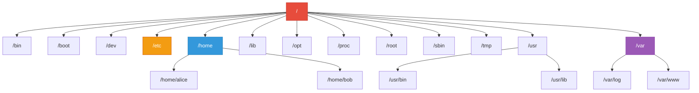
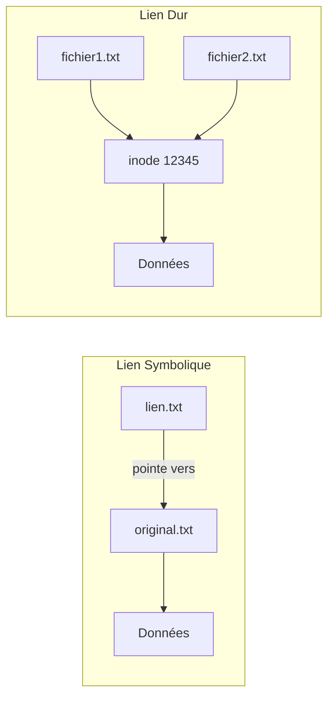

---
tags:
  - formation
  - linux
  - filesystem
  - commandes
  - fhs
---

# Module 2 : Navigation & Fichiers

## Objectifs du Module

À l'issue de ce module, vous serez capable de :

- Naviguer dans l'arborescence Linux (FHS)
- Manipuler fichiers et répertoires (créer, copier, déplacer, supprimer)
- Utiliser les chemins absolus et relatifs
- Comprendre les métacaractères et le globbing
- Maîtriser les commandes essentielles de navigation

**Durée :** 6 heures

**Niveau :** Débutant

---

## 1. L'Arborescence Linux (FHS)

### Tout Part de la Racine

Contrairement à Windows (C:\, D:\), Linux a une **racine unique** : `/`



### Les Répertoires Essentiels (FHS)

| Répertoire | Contenu | Exemples |
|------------|---------|----------|
| `/` | Racine du système | Point de départ |
| `/bin` | Binaires essentiels | `ls`, `cp`, `cat` |
| `/sbin` | Binaires système (root) | `fdisk`, `mount` |
| `/boot` | Fichiers de démarrage | Kernel, GRUB |
| `/dev` | Fichiers de périphériques | `/dev/sda`, `/dev/null` |
| `/etc` | Configuration système | `/etc/passwd`, `/etc/ssh/` |
| `/home` | Répertoires utilisateurs | `/home/alice` |
| `/root` | Home de l'utilisateur root | `/root` |
| `/lib` | Bibliothèques partagées | `.so` files |
| `/opt` | Logiciels optionnels | Applications tierces |
| `/proc` | Système de fichiers virtuel | Infos processus |
| `/sys` | Infos kernel (virtuel) | Paramètres kernel |
| `/tmp` | Fichiers temporaires | Effacés au reboot |
| `/usr` | Programmes utilisateur | `/usr/bin`, `/usr/share` |
| `/var` | Données variables | Logs, mail, www |

### Mnémotechnique

```
/bin    → BINaires essentiels
/etc    → Editable Text Configuration (ET Cetera)
/home   → HOME des utilisateurs
/var    → VARiable data (logs, mail)
/tmp    → TeMPorary files
/opt    → OPTional software
```

---

## 2. Chemins Absolus et Relatifs

### Chemin Absolu

Commence toujours par `/` (la racine) :

```bash
/home/alice/documents/rapport.txt
/etc/ssh/sshd_config
/var/log/messages
```

### Chemin Relatif

Part du répertoire courant :

```bash
# Si je suis dans /home/alice
documents/rapport.txt      # → /home/alice/documents/rapport.txt
../bob/fichier.txt         # → /home/bob/fichier.txt
./script.sh                # → /home/alice/script.sh
```

### Symboles Spéciaux

| Symbole | Signification | Exemple |
|---------|---------------|---------|
| `.` | Répertoire courant | `./script.sh` |
| `..` | Répertoire parent | `cd ..` |
| `~` | Home de l'utilisateur courant | `cd ~` → `/home/user` |
| `~alice` | Home d'un utilisateur | `cd ~alice` → `/home/alice` |
| `-` | Répertoire précédent | `cd -` |

```bash
# Exemple pratique
pwd
# /home/alice/documents

cd ..
pwd
# /home/alice

cd -
pwd
# /home/alice/documents

cd ~
pwd
# /home/alice

cd /var/log
pwd
# /var/log

cd ~
pwd
# /home/alice
```

---

## 3. Commandes de Navigation

### pwd - Print Working Directory

```bash
pwd
# /home/alice

pwd -P  # Chemin physique (résout les liens symboliques)
pwd -L  # Chemin logique (défaut)
```

### cd - Change Directory

```bash
cd /var/log          # Aller à /var/log
cd                   # Aller au home (~)
cd ~                 # Aller au home (~)
cd -                 # Retour au répertoire précédent
cd ..                # Répertoire parent
cd ../..             # Deux niveaux au-dessus
cd /                 # Aller à la racine
```

### ls - List Directory Contents

```bash
# Basique
ls                   # Liste simple
ls -l                # Format long (détails)
ls -a                # Affiche les fichiers cachés (commençant par .)
ls -la               # Long format + cachés

# Options utiles
ls -lh               # Tailles lisibles (K, M, G)
ls -lt               # Tri par date (récent en premier)
ls -ltr              # Tri par date inversé (ancien en premier)
ls -lS               # Tri par taille (gros en premier)
ls -R                # Récursif (sous-répertoires)
ls -d */             # Lister uniquement les répertoires

# Exemples pratiques
ls -la /etc/         # Lister /etc avec détails
ls -lh /var/log/     # Logs avec tailles lisibles
```

### Lecture de `ls -l`

```
-rw-r--r--  1 alice users  4096 Nov 29 14:30 fichier.txt
│├──┬───┤  │   │     │      │       │          │
││  │   │  │   │     │      │       │          └── Nom du fichier
││  │   │  │   │     │      │       └── Date de modification
││  │   │  │   │     │      └── Taille en octets
││  │   │  │   │     └── Groupe propriétaire
││  │   │  │   └── Utilisateur propriétaire
││  │   │  └── Nombre de liens
││  │   └── Permissions autres (r--)
││  └── Permissions groupe (r--)
│└── Permissions propriétaire (rw-)
└── Type (- fichier, d répertoire, l lien)
```

**Types de fichiers :**

| Caractère | Type |
|-----------|------|
| `-` | Fichier régulier |
| `d` | Répertoire (directory) |
| `l` | Lien symbolique |
| `c` | Périphérique caractère |
| `b` | Périphérique bloc |
| `s` | Socket |
| `p` | Pipe nommé (FIFO) |

---

## 4. Manipulation de Fichiers

### touch - Créer ou Mettre à Jour

```bash
touch fichier.txt           # Créer un fichier vide
touch fichier1 fichier2     # Créer plusieurs fichiers
touch -t 202411291430 f.txt # Définir une date spécifique
```

### mkdir - Créer des Répertoires

```bash
mkdir dossier               # Créer un répertoire
mkdir -p a/b/c              # Créer une arborescence complète
mkdir -m 700 secret         # Créer avec permissions spécifiques
mkdir dossier1 dossier2     # Créer plusieurs répertoires
```

### cp - Copier

```bash
cp source.txt dest.txt           # Copier un fichier
cp fichier.txt /tmp/             # Copier vers un répertoire
cp -r dossier/ /backup/          # Copier un répertoire (récursif)
cp -p fichier.txt copie.txt      # Préserver permissions et dates
cp -a source/ dest/              # Archive (préserve tout)
cp -i fichier.txt dest.txt       # Interactif (demande confirmation)
cp -v *.txt /backup/             # Verbose (affiche les actions)
```

### mv - Déplacer / Renommer

```bash
mv ancien.txt nouveau.txt        # Renommer
mv fichier.txt /tmp/             # Déplacer
mv -i source dest                # Interactif
mv -v dossier/ /backup/          # Verbose
mv *.log /var/log/archive/       # Déplacer plusieurs fichiers
```

### rm - Supprimer

```bash
rm fichier.txt                   # Supprimer un fichier
rm -r dossier/                   # Supprimer un répertoire (récursif)
rm -f fichier.txt                # Forcer (sans confirmation)
rm -rf dossier/                  # Récursif + forcé (DANGEREUX!)
rm -i *.txt                      # Interactif (confirmation)
rm -v fichier.txt                # Verbose
```

!!! danger "Attention avec rm -rf"
    La commande `rm -rf /` peut **détruire tout le système** !

    Toujours vérifier deux fois avant d'exécuter `rm -rf`.

    ```bash
    # DANGEREUX - NE PAS EXÉCUTER
    rm -rf /           # Efface TOUT
    rm -rf /*          # Efface TOUT
    rm -rf ~/*         # Efface tout le home
    ```

### rmdir - Supprimer un Répertoire Vide

```bash
rmdir dossier_vide              # Supprime seulement si vide
rmdir -p a/b/c                  # Supprime a/b/c, puis a/b, puis a
```

---

## 5. Affichage de Contenu

### cat - Concatenate

```bash
cat fichier.txt                  # Afficher le contenu
cat fichier1 fichier2            # Concaténer plusieurs fichiers
cat -n fichier.txt               # Avec numéros de ligne
cat -A fichier.txt               # Affiche caractères invisibles
```

### less / more - Pagination

```bash
less fichier.txt                 # Navigation avec touches
more fichier.txt                 # Plus basique

# Navigation dans less :
# Espace    → Page suivante
# b         → Page précédente
# /motif    → Rechercher
# n         → Occurrence suivante
# q         → Quitter
# g         → Début du fichier
# G         → Fin du fichier
```

### head / tail - Début / Fin

```bash
head fichier.txt                 # 10 premières lignes
head -n 20 fichier.txt           # 20 premières lignes
head -c 100 fichier.txt          # 100 premiers octets

tail fichier.txt                 # 10 dernières lignes
tail -n 20 fichier.txt           # 20 dernières lignes
tail -f /var/log/messages        # Suivre en temps réel (logs)
tail -f -n 50 /var/log/syslog    # 50 dernières + suivi
```

### wc - Word Count

```bash
wc fichier.txt                   # lignes, mots, caractères
wc -l fichier.txt                # Nombre de lignes
wc -w fichier.txt                # Nombre de mots
wc -c fichier.txt                # Nombre d'octets
wc -m fichier.txt                # Nombre de caractères
```

---

## 6. Recherche de Fichiers

### find - Recherche Puissante

```bash
# Par nom
find /home -name "*.txt"                    # Fichiers .txt
find /etc -name "*.conf"                    # Fichiers de config
find . -iname "readme*"                     # Insensible à la casse

# Par type
find /var -type f                           # Fichiers uniquement
find /home -type d                          # Répertoires uniquement
find /dev -type l                           # Liens symboliques

# Par taille
find / -size +100M                          # Plus de 100 MB
find /var/log -size -1k                     # Moins de 1 KB
find /home -size 0                          # Fichiers vides

# Par date
find /tmp -mtime -1                         # Modifié dernières 24h
find /var/log -mtime +30                    # Modifié il y a +30 jours
find . -newer reference.txt                 # Plus récent que reference

# Par permissions
find / -perm 777                            # Permissions exactes
find / -perm -u+x                           # Exécutable par owner

# Combinaisons
find /home -name "*.log" -size +10M
find /var -type f -mtime +30 -name "*.tmp"

# Actions
find /tmp -name "*.tmp" -delete             # Supprimer
find . -name "*.sh" -exec chmod +x {} \;    # Exécuter commande
find . -type f -exec grep -l "error" {} \;  # Chercher contenu
```

### locate - Recherche Rapide (Base de Données)

```bash
# Mettre à jour la base (nécessaire après création de fichiers)
sudo updatedb

# Rechercher
locate passwd                    # Tous les fichiers contenant "passwd"
locate -i readme                 # Insensible à la casse
locate -n 10 "*.conf"            # Limiter à 10 résultats
```

### which / whereis / type

```bash
which ls                         # Chemin de l'exécutable
# /usr/bin/ls

whereis ls                       # Binaire, sources, man
# ls: /usr/bin/ls /usr/share/man/man1/ls.1.gz

type ls                          # Type de commande
# ls is aliased to `ls --color=auto'
```

---

## 7. Globbing (Métacaractères)

Le shell interprète certains caractères spéciaux avant d'exécuter les commandes :

| Pattern | Signification | Exemple |
|---------|---------------|---------|
| `*` | Zéro ou plusieurs caractères | `*.txt` → tous les .txt |
| `?` | Un seul caractère | `file?.txt` → file1.txt, fileA.txt |
| `[abc]` | Un caractère parmi a, b, c | `file[123].txt` |
| `[a-z]` | Une plage de caractères | `file[a-z].txt` |
| `[!abc]` | Tout sauf a, b, c | `file[!0-9].txt` |
| `{a,b,c}` | Alternatives | `file.{txt,log,md}` |

```bash
# Exemples pratiques
ls *.txt                         # Tous les .txt
ls file?.log                     # file1.log, file2.log, fileA.log
ls [Rr]eadme*                    # Readme ou readme
ls /etc/*.conf                   # Tous les .conf dans /etc
ls {*.txt,*.md}                  # Tous les .txt et .md

# Copier plusieurs types
cp *.{jpg,png,gif} /images/

# Supprimer avec pattern
rm -f *.tmp
rm -f log.[0-9]*

# Brace expansion
mkdir -p project/{src,lib,bin,doc}
touch file{1..5}.txt             # file1.txt à file5.txt
echo {A..Z}                      # A B C ... Z
```

---

## 8. Liens (Links)

### Liens Symboliques (Soft Links)

```bash
ln -s /chemin/cible nom_lien

# Exemple
ln -s /var/log/messages ~/logs
ls -l ~/logs
# lrwxrwxrwx 1 user user 17 Nov 29 15:00 logs -> /var/log/messages
```

**Caractéristiques :**

- Peut pointer vers fichiers ou répertoires
- Peut traverser les systèmes de fichiers
- Si la cible est supprimée, le lien est "cassé"
- Similaire aux raccourcis Windows

### Liens Durs (Hard Links)

```bash
ln /chemin/cible nom_lien

# Exemple
ln original.txt copie_dure.txt
ls -li  # Même inode number
```

**Caractéristiques :**

- Même inode que l'original
- Ne peut pas pointer vers un répertoire
- Ne peut pas traverser les systèmes de fichiers
- Fichier existe tant qu'un lien dur existe



---

## 9. Exercice Pratique

!!! example "Exercice : Exploration et Manipulation"

    **Objectif :** Maîtriser la navigation et la manipulation de fichiers.

    **Préparation :**

    ```bash
    # Créer un environnement de travail
    mkdir -p ~/lab/exercice2
    cd ~/lab/exercice2
    ```

    **Tâches :**

    1. **Navigation :**
        - Affichez votre répertoire courant
        - Allez dans `/var/log` et listez les fichiers
        - Revenez à votre home en une commande
        - Créez l'arborescence `~/lab/projet/{src,doc,test}`

    2. **Manipulation :**
        - Créez 5 fichiers : `file1.txt` à `file5.txt`
        - Créez un répertoire `backup`
        - Copiez tous les fichiers `.txt` dans `backup`
        - Renommez `file1.txt` en `readme.txt`
        - Supprimez `file5.txt`

    3. **Recherche :**
        - Trouvez tous les fichiers `.conf` dans `/etc`
        - Trouvez les fichiers de plus de 10 MB dans `/var`
        - Comptez le nombre de lignes dans `/etc/passwd`

    4. **Liens :**
        - Créez un lien symbolique de `/var/log/messages` vers `~/lab/logs`
        - Vérifiez que le lien fonctionne

    **Durée estimée :** 30 minutes

---

## 10. Solution

??? quote "Solution Détaillée"

    ### 1. Navigation

    ```bash
    # Afficher répertoire courant
    pwd
    # /home/user/lab/exercice2

    # Aller dans /var/log
    cd /var/log
    ls -la
    # drwxr-xr-x ... messages
    # drwxr-xr-x ... syslog
    # ...

    # Retour au home
    cd ~
    # ou simplement: cd

    # Créer l'arborescence
    mkdir -p ~/lab/projet/{src,doc,test}
    tree ~/lab/projet/
    # projet/
    # ├── doc
    # ├── src
    # └── test
    ```

    ### 2. Manipulation

    ```bash
    cd ~/lab/exercice2

    # Créer 5 fichiers
    touch file{1..5}.txt
    ls
    # file1.txt  file2.txt  file3.txt  file4.txt  file5.txt

    # Créer répertoire backup
    mkdir backup

    # Copier les .txt
    cp *.txt backup/
    ls backup/
    # file1.txt  file2.txt  file3.txt  file4.txt  file5.txt

    # Renommer file1.txt
    mv file1.txt readme.txt
    ls
    # backup  file2.txt  file3.txt  file4.txt  file5.txt  readme.txt

    # Supprimer file5.txt
    rm file5.txt
    ls
    # backup  file2.txt  file3.txt  file4.txt  readme.txt
    ```

    ### 3. Recherche

    ```bash
    # Fichiers .conf dans /etc
    find /etc -name "*.conf" 2>/dev/null | head -20
    # /etc/resolv.conf
    # /etc/sysctl.conf
    # /etc/ssh/sshd_config
    # ...

    # Fichiers > 10 MB dans /var
    find /var -size +10M 2>/dev/null
    # /var/log/journal/...
    # /var/cache/...

    # Nombre de lignes dans /etc/passwd
    wc -l /etc/passwd
    # 42 /etc/passwd
    ```

    ### 4. Liens

    ```bash
    # Créer le lien symbolique
    ln -s /var/log/messages ~/lab/logs

    # Vérifier
    ls -l ~/lab/logs
    # lrwxrwxrwx 1 user user 18 Nov 29 15:30 /home/user/lab/logs -> /var/log/messages

    # Tester (peut nécessiter sudo)
    sudo tail -5 ~/lab/logs
    ```

---

## Points Clés à Retenir

| Commande | Usage |
|----------|-------|
| `pwd` | Afficher le répertoire courant |
| `cd` | Changer de répertoire |
| `ls` | Lister les fichiers |
| `touch` | Créer / mettre à jour un fichier |
| `mkdir` | Créer un répertoire |
| `cp` | Copier |
| `mv` | Déplacer / renommer |
| `rm` | Supprimer |
| `cat` | Afficher le contenu |
| `less` | Pagination |
| `head/tail` | Début / fin d'un fichier |
| `find` | Recherche avancée |
| `ln -s` | Créer un lien symbolique |

---

## Prochaine Étape

Vous maîtrisez maintenant la navigation et la manipulation de fichiers. Le prochain module couvre la gestion des utilisateurs et des permissions.

[:octicons-arrow-right-24: Module 3 : Utilisateurs & Permissions](03-permissions.md)

---

**Retour au :** [Programme de la Formation](index.md)
