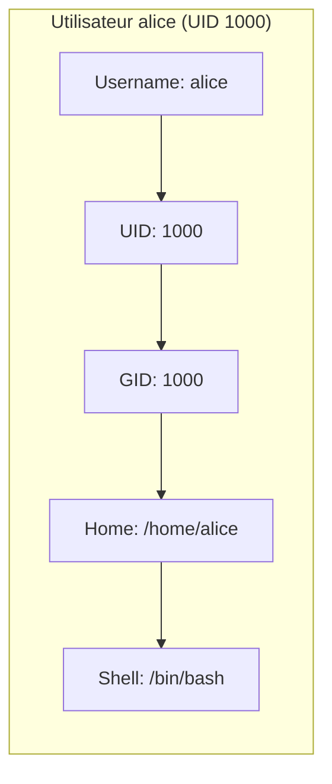

---
tags:
  - formation
  - linux
  - permissions
  - users
  - groups
  - security
---

# Module 3 : Utilisateurs & Permissions

## Objectifs du Module

À l'issue de ce module, vous serez capable de :

- Créer et gérer les utilisateurs et groupes
- Comprendre et modifier les permissions (rwx)
- Utiliser chmod, chown et chgrp
- Configurer les permissions spéciales (SUID, SGID, Sticky)
- Appliquer le principe du moindre privilège

**Durée :** 6 heures

**Niveau :** Débutant

---

## 1. Utilisateurs Linux

### Concepts Fondamentaux

Chaque utilisateur Linux possède :

- Un **UID** (User ID) unique
- Un **GID** (Group ID) principal
- Un **home directory**
- Un **shell** par défaut



### Utilisateurs Système vs Réguliers

| Type | UID | Usage | Exemples |
|------|-----|-------|----------|
| **root** | 0 | Super-utilisateur | Accès total |
| **Système** | 1-999 | Services | nobody, apache, nginx |
| **Réguliers** | 1000+ | Humains | alice, bob |

### Fichiers Clés

```bash
# /etc/passwd - Informations utilisateurs
cat /etc/passwd
alice:x:1000:1000:Alice Dupont:/home/alice:/bin/bash
│     │  │    │         │           │         │
│     │  │    │         │           │         └── Shell
│     │  │    │         │           └── Home directory
│     │  │    │         └── Commentaire (GECOS)
│     │  │    └── GID principal
│     │  └── UID
│     └── Mot de passe (x = dans /etc/shadow)
└── Username

# /etc/shadow - Mots de passe chiffrés (root seulement)
sudo cat /etc/shadow
alice:$6$xyz...hash...:19326:0:99999:7:::

# /etc/group - Groupes
cat /etc/group
developers:x:1001:alice,bob
```

---

## 2. Gestion des Utilisateurs

### Créer un Utilisateur

```bash
# Création simple
sudo useradd bob

# Création complète
sudo useradd -m -s /bin/bash -c "Bob Martin" -G developers bob
#            │   │            │              │
#            │   │            │              └── Groupes supplémentaires
#            │   │            └── Commentaire
#            │   └── Shell
#            └── Créer le home directory

# Définir le mot de passe
sudo passwd bob
# New password: ********
# Retype new password: ********
```

### Modifier un Utilisateur

```bash
# Changer le shell
sudo usermod -s /bin/zsh alice

# Ajouter à un groupe (sans perdre les autres)
sudo usermod -aG docker alice
#             │
#             └── append (ajouter sans remplacer)

# Changer le home directory
sudo usermod -d /home/alice_new -m alice
#                                │
#                                └── Déplacer les fichiers

# Verrouiller un compte
sudo usermod -L bob

# Déverrouiller
sudo usermod -U bob

# Changer le commentaire
sudo usermod -c "Robert Martin" bob
```

### Supprimer un Utilisateur

```bash
# Supprimer l'utilisateur (garde le home)
sudo userdel bob

# Supprimer avec le home directory
sudo userdel -r bob
```

### Informations Utilisateur

```bash
# Utilisateur courant
whoami
id
# uid=1000(alice) gid=1000(alice) groups=1000(alice),27(sudo),998(docker)

# Infos d'un utilisateur
id bob
finger bob
getent passwd bob
```

---

## 3. Gestion des Groupes

### Créer et Gérer des Groupes

```bash
# Créer un groupe
sudo groupadd developers

# Créer avec un GID spécifique
sudo groupadd -g 2000 devops

# Renommer un groupe
sudo groupmod -n newname oldname

# Supprimer un groupe
sudo groupdel developers
```

### Ajouter/Retirer des Utilisateurs

```bash
# Ajouter alice au groupe developers
sudo usermod -aG developers alice

# Méthode alternative
sudo gpasswd -a alice developers

# Retirer du groupe
sudo gpasswd -d alice developers

# Voir les groupes d'un utilisateur
groups alice
# alice : alice developers docker
```

---

## 4. Les Permissions Linux

### Le Modèle rwx

Chaque fichier a 3 ensembles de permissions :

```
-rwxr-xr--  1 alice developers 4096 Nov 29 15:00 script.sh
 │││ │││ │││
 │││ │││ └┴┴── Autres (others) : r-- (lecture seule)
 │││ └┴┴────── Groupe (group)  : r-x (lecture + exécution)
 └┴┴────────── Propriétaire (owner) : rwx (tout)
```

### Signification des Permissions

| Permission | Fichier | Répertoire |
|------------|---------|------------|
| **r** (read) | Lire le contenu | Lister le contenu (ls) |
| **w** (write) | Modifier le contenu | Créer/supprimer des fichiers |
| **x** (execute) | Exécuter comme programme | Entrer dans le répertoire (cd) |
| **-** | Permission absente | Permission absente |

### Représentation Numérique (Octale)

Chaque permission a une valeur :

| Permission | Valeur | Binaire |
|------------|--------|---------|
| r | 4 | 100 |
| w | 2 | 010 |
| x | 1 | 001 |

**Combinaisons courantes :**

| Octal | Permissions | Signification |
|-------|-------------|---------------|
| 7 | rwx | Lecture + Écriture + Exécution |
| 6 | rw- | Lecture + Écriture |
| 5 | r-x | Lecture + Exécution |
| 4 | r-- | Lecture seule |
| 0 | --- | Aucune permission |

**Exemples de modes :**

| Mode | Permissions | Usage Typique |
|------|-------------|---------------|
| 755 | rwxr-xr-x | Scripts, exécutables |
| 644 | rw-r--r-- | Fichiers normaux |
| 600 | rw------- | Fichiers sensibles |
| 700 | rwx------ | Scripts privés |
| 777 | rwxrwxrwx | Tout le monde (DANGEREUX) |

---

## 5. Modifier les Permissions

### chmod - Change Mode

#### Syntaxe Symbolique

```bash
chmod [qui][opération][permissions] fichier

# Qui : u (user), g (group), o (others), a (all)
# Opération : + (ajouter), - (retirer), = (définir)
# Permissions : r, w, x
```

```bash
# Ajouter exécution pour le propriétaire
chmod u+x script.sh

# Retirer écriture pour les autres
chmod o-w fichier.txt

# Définir exactement les permissions du groupe
chmod g=rx fichier.txt

# Ajouter lecture pour tous
chmod a+r document.txt

# Combinaisons
chmod u+x,g+r,o-rwx script.sh
chmod ug+rw,o-rw fichier.txt
```

#### Syntaxe Numérique

```bash
# Permission complète
chmod 755 script.sh        # rwxr-xr-x
chmod 644 fichier.txt      # rw-r--r--
chmod 600 secret.key       # rw-------
chmod 700 private_script   # rwx------

# Récursif sur un répertoire
chmod -R 755 dossier/
```

### chown - Change Owner

```bash
# Changer le propriétaire
sudo chown alice fichier.txt

# Changer propriétaire et groupe
sudo chown alice:developers fichier.txt

# Seulement le groupe
sudo chown :developers fichier.txt

# Récursif
sudo chown -R alice:developers projet/
```

### chgrp - Change Group

```bash
# Changer le groupe
sudo chgrp developers fichier.txt

# Récursif
sudo chgrp -R www-data /var/www/
```

---

## 6. Permissions Spéciales

### SUID (Set User ID)

Quand un fichier avec SUID est exécuté, il s'exécute avec les permissions du **propriétaire** (pas de l'utilisateur qui l'exécute).

```bash
# Exemple classique : passwd
ls -l /usr/bin/passwd
# -rwsr-xr-x 1 root root ... /usr/bin/passwd
#    ^
#    └── s au lieu de x = SUID activé

# Définir SUID
chmod u+s programme
chmod 4755 programme
#     ^
#     └── 4 = SUID
```

### SGID (Set Group ID)

- Sur un **fichier** : s'exécute avec les permissions du groupe
- Sur un **répertoire** : les nouveaux fichiers héritent du groupe

```bash
# Créer un répertoire de projet partagé
sudo mkdir /projet
sudo chgrp developers /projet
sudo chmod g+s /projet
#               ^
#               └── SGID

ls -ld /projet
# drwxrwsr-x 2 root developers ... /projet
#       ^
#       └── s = SGID

# Les fichiers créés dans /projet auront le groupe "developers"
```

### Sticky Bit

Sur un répertoire, seul le propriétaire d'un fichier peut le supprimer (même si d'autres ont les droits d'écriture).

```bash
# Exemple classique : /tmp
ls -ld /tmp
# drwxrwxrwt 15 root root ... /tmp
#          ^
#          └── t = Sticky Bit

# Définir le Sticky Bit
chmod +t dossier/
chmod 1777 dossier/
#     ^
#     └── 1 = Sticky Bit
```

### Tableau Récapitulatif

| Permission | Valeur | Fichier | Répertoire |
|------------|--------|---------|------------|
| SUID | 4000 | Exécute avec UID du propriétaire | - |
| SGID | 2000 | Exécute avec GID du groupe | Héritage du groupe |
| Sticky | 1000 | - | Suppression restreinte |

---

## 7. umask - Permissions par Défaut

Le **umask** définit les permissions **retirées** aux nouveaux fichiers.

```bash
# Afficher le umask actuel
umask
# 0022

# Fichiers : 666 - 022 = 644 (rw-r--r--)
# Répertoires : 777 - 022 = 755 (rwxr-xr-x)
```

```bash
# Changer temporairement
umask 027
# Fichiers : 666 - 027 = 640 (rw-r-----)
# Répertoires : 777 - 027 = 750 (rwxr-x---)

# Permanent : ajouter dans ~/.bashrc
echo "umask 027" >> ~/.bashrc
```

| umask | Fichiers | Répertoires | Usage |
|-------|----------|-------------|-------|
| 022 | 644 | 755 | Standard |
| 027 | 640 | 750 | Plus restrictif |
| 077 | 600 | 700 | Très restrictif |
| 002 | 664 | 775 | Travail en groupe |

---

## 8. sudo et su

### su - Switch User

```bash
# Devenir root (demande le mot de passe root)
su -

# Devenir un autre utilisateur
su - alice

# Exécuter une commande comme root
su -c "apt update"
```

### sudo - Execute as Root

```bash
# Exécuter une commande en root
sudo apt update

# Devenir root avec sudo
sudo -i
# ou
sudo su -

# Exécuter en tant qu'autre utilisateur
sudo -u alice commande

# Éditer la configuration sudo
sudo visudo
```

### Configuration sudo (/etc/sudoers)

```bash
# /etc/sudoers (toujours éditer avec visudo)

# Format : qui   où=(en tant que)   quoi
alice   ALL=(ALL:ALL)   ALL
#  │     │      │        │
#  │     │      │        └── Commandes autorisées
#  │     │      └── Peut devenir n'importe quel user:group
#  │     └── Sur n'importe quel hôte
#  └── Utilisateur

# Groupe (précédé de %)
%developers   ALL=(ALL)   NOPASSWD: /usr/bin/systemctl restart nginx
#                         ^
#                         └── Sans mot de passe

# Alias
User_Alias ADMINS = alice, bob
Cmnd_Alias SERVICES = /usr/bin/systemctl
ADMINS ALL=(ALL) SERVICES
```

### Bonnes Pratiques sudo

```bash
# Créer un fichier dans /etc/sudoers.d/
sudo visudo -f /etc/sudoers.d/developers

# Contenu
%developers ALL=(ALL) NOPASSWD: /usr/bin/docker
%developers ALL=(ALL) NOPASSWD: /usr/bin/systemctl restart nginx
```

---

## 9. Exercice Pratique

!!! example "Exercice : Gestion des Utilisateurs et Permissions"

    **Scénario :**

    Vous êtes administrateur système. Vous devez configurer un environnement de développement partagé pour une équipe.

    **Tâches :**

    **1. Créer les utilisateurs :**

    - Créer les utilisateurs `dev1` et `dev2`
    - Définir des mots de passe
    - Les deux utilisateurs doivent avoir `/bin/bash` comme shell

    **2. Créer le groupe :**

    - Créer le groupe `devteam`
    - Ajouter `dev1` et `dev2` au groupe

    **3. Créer l'espace de travail partagé :**

    - Créer le répertoire `/projet/shared`
    - Le propriétaire doit être `root`, le groupe `devteam`
    - Permissions : `rwxrwx---` avec SGID
    - Les fichiers créés doivent appartenir au groupe `devteam`

    **4. Tester les permissions :**

    - En tant que `dev1`, créer un fichier dans `/projet/shared`
    - Vérifier que le groupe du fichier est `devteam`
    - Vérifier que `dev2` peut modifier ce fichier

    **5. Configurer sudo :**

    - Permettre aux membres de `devteam` de redémarrer nginx sans mot de passe

    **Durée estimée :** 30 minutes

---

## 10. Solution

??? quote "Solution Détaillée"

    ### 1. Créer les Utilisateurs

    ```bash
    # Créer dev1
    sudo useradd -m -s /bin/bash -c "Developer 1" dev1
    sudo passwd dev1
    # Entrer le mot de passe

    # Créer dev2
    sudo useradd -m -s /bin/bash -c "Developer 2" dev2
    sudo passwd dev2

    # Vérifier
    getent passwd dev1 dev2
    # dev1:x:1001:1001:Developer 1:/home/dev1:/bin/bash
    # dev2:x:1002:1002:Developer 2:/home/dev2:/bin/bash
    ```

    ### 2. Créer le Groupe

    ```bash
    # Créer le groupe
    sudo groupadd devteam

    # Ajouter les utilisateurs
    sudo usermod -aG devteam dev1
    sudo usermod -aG devteam dev2

    # Vérifier
    getent group devteam
    # devteam:x:1003:dev1,dev2
    ```

    ### 3. Créer l'Espace Partagé

    ```bash
    # Créer le répertoire
    sudo mkdir -p /projet/shared

    # Définir le propriétaire et groupe
    sudo chown root:devteam /projet/shared

    # Définir les permissions avec SGID
    sudo chmod 2770 /projet/shared
    # 2 = SGID
    # 7 = rwx pour owner (root)
    # 7 = rwx pour group (devteam)
    # 0 = --- pour others

    # Vérifier
    ls -ld /projet/shared
    # drwxrws--- 2 root devteam 4096 Nov 29 16:00 /projet/shared
    #       ^
    #       └── s = SGID activé
    ```

    ### 4. Tester les Permissions

    ```bash
    # Se connecter en tant que dev1
    sudo su - dev1

    # Créer un fichier
    cd /projet/shared
    echo "Hello from dev1" > test.txt

    # Vérifier le groupe du fichier
    ls -l test.txt
    # -rw-rw-r-- 1 dev1 devteam 16 Nov 29 16:05 test.txt
    #                   ^^^^^^^
    #                   └── Groupe hérité grâce au SGID

    # Déconnexion
    exit

    # Se connecter en tant que dev2
    sudo su - dev2

    # Modifier le fichier
    cd /projet/shared
    echo "Modified by dev2" >> test.txt

    # Vérifier
    cat test.txt
    # Hello from dev1
    # Modified by dev2

    exit
    ```

    ### 5. Configurer sudo

    ```bash
    # Créer le fichier de configuration
    sudo visudo -f /etc/sudoers.d/devteam

    # Ajouter la ligne
    %devteam ALL=(ALL) NOPASSWD: /usr/bin/systemctl restart nginx

    # Vérifier la syntaxe
    sudo visudo -c
    # /etc/sudoers: parsed OK
    # /etc/sudoers.d/devteam: parsed OK

    # Tester (si nginx est installé)
    sudo su - dev1
    sudo systemctl restart nginx
    # Pas de demande de mot de passe
    ```

    ### Nettoyage (optionnel)

    ```bash
    # Supprimer les utilisateurs
    sudo userdel -r dev1
    sudo userdel -r dev2

    # Supprimer le groupe
    sudo groupdel devteam

    # Supprimer le répertoire
    sudo rm -rf /projet

    # Supprimer la config sudo
    sudo rm /etc/sudoers.d/devteam
    ```

---

## Points Clés à Retenir

| Concept | Commande / Fichier |
|---------|-------------------|
| Créer utilisateur | `useradd -m -s /bin/bash user` |
| Mot de passe | `passwd user` |
| Modifier utilisateur | `usermod -aG groupe user` |
| Créer groupe | `groupadd groupe` |
| Permissions | `chmod 755 fichier` |
| Propriétaire | `chown user:groupe fichier` |
| SUID | `chmod u+s` ou `4xxx` |
| SGID | `chmod g+s` ou `2xxx` |
| Sticky Bit | `chmod +t` ou `1xxx` |
| umask | `umask 022` |
| sudo | `/etc/sudoers.d/` |

---

## Prochaine Étape

Vous maîtrisez maintenant la gestion des utilisateurs et des permissions. Le prochain module couvre les éditeurs de texte et le traitement de texte.

[:octicons-arrow-right-24: Module 4 : Éditeurs & Texte](04-editeurs.md)

---

**Retour au :** [Programme de la Formation](index.md)

---

## Navigation

| | |
|:---|---:|
| [← Module 2 : Navigation & Fichiers](02-navigation.md) | [Module 4 : Éditeurs & Traitement de T... →](04-editeurs.md) |

[Retour au Programme](index.md){ .md-button }
