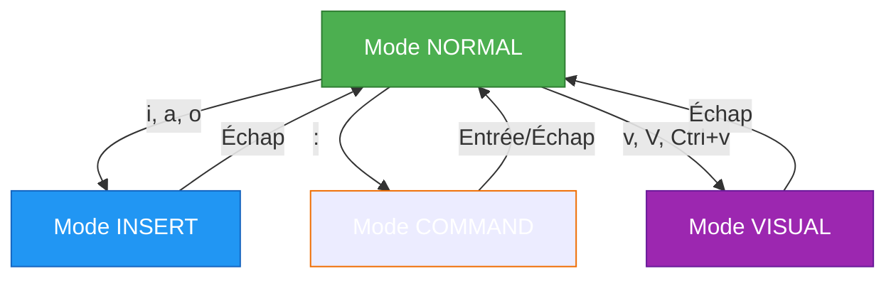
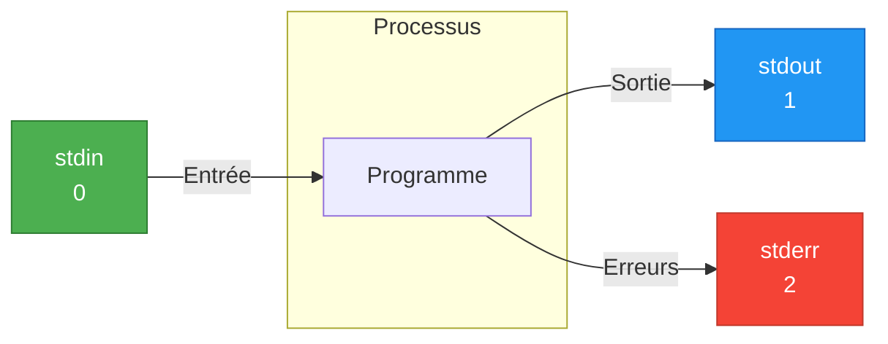

---
tags:
  - formation
  - linux
  - vim
  - nano
  - grep
  - sed
  - awk
---

# Module 4 : Éditeurs & Traitement de Texte

## Objectifs du Module

À l'issue de ce module, vous serez capable de :

- Utiliser Vim et Nano pour éditer des fichiers
- Maîtriser les pipes et redirections
- Rechercher avec grep et les expressions régulières
- Transformer du texte avec sed et awk
- Combiner les outils pour des traitements complexes

**Durée :** 6 heures

**Niveau :** Débutant

---

## 1. Vim - L'Éditeur Puissant

### Pourquoi Vim ?

Vim est installé sur **tous** les systèmes Unix/Linux. Même sur un serveur minimal sans interface graphique, Vim est là.



### Les Modes de Vim

| Mode | Touche | Usage |
|------|--------|-------|
| **NORMAL** | `Échap` | Navigation, commandes |
| **INSERT** | `i`, `a`, `o` | Écriture |
| **COMMAND** | `:` | Commandes (sauvegarder, quitter) |
| **VISUAL** | `v` | Sélection |

### Ouvrir et Quitter

```bash
# Ouvrir un fichier
vim fichier.txt

# Quitter (mode NORMAL)
:q          # Quitter (si pas de modifications)
:q!         # Quitter sans sauvegarder
:w          # Sauvegarder
:wq         # Sauvegarder et quitter
:x          # Sauvegarder et quitter (identique à :wq)
ZZ          # Sauvegarder et quitter (raccourci)
ZQ          # Quitter sans sauvegarder (raccourci)
```

### Navigation (Mode NORMAL)

```text
        k
        ↑
    h ← ● → l
        ↓
        j
```

| Touche | Action |
|--------|--------|
| `h`, `j`, `k`, `l` | Gauche, Bas, Haut, Droite |
| `w` | Mot suivant |
| `b` | Mot précédent |
| `0` | Début de ligne |
| `$` | Fin de ligne |
| `gg` | Début du fichier |
| `G` | Fin du fichier |
| `42G` | Aller à la ligne 42 |
| `Ctrl+f` | Page suivante |
| `Ctrl+b` | Page précédente |

### Édition (Mode NORMAL → INSERT)

| Touche | Action |
|--------|--------|
| `i` | Insérer avant le curseur |
| `a` | Insérer après le curseur |
| `I` | Insérer au début de la ligne |
| `A` | Insérer à la fin de la ligne |
| `o` | Nouvelle ligne en dessous |
| `O` | Nouvelle ligne au-dessus |

### Copier, Couper, Coller

| Touche | Action |
|--------|--------|
| `yy` | Copier la ligne (yank) |
| `3yy` | Copier 3 lignes |
| `yw` | Copier le mot |
| `dd` | Couper la ligne (delete) |
| `3dd` | Couper 3 lignes |
| `dw` | Couper le mot |
| `p` | Coller après |
| `P` | Coller avant |

### Recherche et Remplacement

```vim
# Rechercher
/motif          " Rechercher vers le bas
?motif          " Rechercher vers le haut
n               " Occurrence suivante
N               " Occurrence précédente
*               " Chercher le mot sous le curseur

# Remplacer
:s/ancien/nouveau/          " Première occurrence de la ligne
:s/ancien/nouveau/g         " Toutes les occurrences de la ligne
:%s/ancien/nouveau/g        " Tout le fichier
:%s/ancien/nouveau/gc       " Tout le fichier avec confirmation
```

### Annuler / Refaire

| Touche | Action |
|--------|--------|
| `u` | Annuler (undo) |
| `Ctrl+r` | Refaire (redo) |
| `.` | Répéter la dernière action |

---

## 2. Nano - L'Éditeur Simple

### Commandes de Base

```bash
nano fichier.txt
```

Les raccourcis sont affichés en bas de l'écran (`^` = Ctrl) :

| Raccourci | Action |
|-----------|--------|
| `Ctrl+O` | Sauvegarder (Write Out) |
| `Ctrl+X` | Quitter |
| `Ctrl+K` | Couper la ligne |
| `Ctrl+U` | Coller |
| `Ctrl+W` | Rechercher |
| `Ctrl+G` | Aide |
| `Ctrl+C` | Position du curseur |
| `Alt+U` | Annuler |

### Configuration (~/.nanorc)

```bash
# ~/.nanorc
set autoindent      # Indentation automatique
set tabsize 4       # Taille des tabulations
set linenumbers     # Afficher les numéros de ligne
set mouse           # Support souris
```

---

## 3. Pipes et Redirections

### Les 3 Flux Standards



| Flux | Numéro | Description |
|------|--------|-------------|
| stdin | 0 | Entrée standard (clavier) |
| stdout | 1 | Sortie standard (écran) |
| stderr | 2 | Erreurs standard (écran) |

### Redirections

```bash
# Rediriger stdout vers un fichier
ls > liste.txt              # Écraser
ls >> liste.txt             # Ajouter

# Rediriger stderr vers un fichier
commande 2> erreurs.log

# Rediriger stdout et stderr
commande > output.log 2>&1
commande &> output.log      # Syntaxe moderne

# Supprimer la sortie
commande > /dev/null 2>&1

# Utiliser un fichier comme entrée
sort < fichier.txt
wc -l < fichier.txt
```

### Le Pipe `|`

Le pipe connecte la **sortie** d'une commande à l'**entrée** de la suivante :

```bash
# Compter les fichiers
ls -l | wc -l

# Filtrer et trier
cat /etc/passwd | grep bash | sort

# Chaîne complexe
cat access.log | grep "404" | awk '{print $1}' | sort | uniq -c | sort -rn | head -10
```


---

## 4. grep - Recherche de Texte

### Syntaxe de Base

```bash
grep [options] "motif" fichier
```

### Options Courantes

```bash
# Recherche simple
grep "error" /var/log/messages

# Options
grep -i "error" fichier      # Insensible à la casse
grep -v "info" fichier       # Inverser (lignes sans "info")
grep -n "error" fichier      # Avec numéros de ligne
grep -c "error" fichier      # Compter les occurrences
grep -l "error" *.log        # Lister les fichiers contenant
grep -r "error" /var/log/    # Récursif
grep -w "error" fichier      # Mot entier uniquement
grep -A 3 "error" fichier    # 3 lignes après
grep -B 2 "error" fichier    # 2 lignes avant
grep -C 2 "error" fichier    # 2 lignes avant et après
```

### Expressions Régulières

```bash
# Métacaractères de base
grep "^root" /etc/passwd         # Commence par "root"
grep "bash$" /etc/passwd         # Termine par "bash"
grep "r..t" /etc/passwd          # r + 2 caractères + t
grep "[0-9]" fichier             # Contient un chiffre
grep "[a-zA-Z]" fichier          # Contient une lettre
grep "log[0-9]*" fichier         # log suivi de chiffres

# Extended regex (egrep ou grep -E)
grep -E "error|warning" fichier  # error OU warning
grep -E "[0-9]{3}" fichier       # Exactement 3 chiffres
grep -E "colou?r" fichier        # color ou colour
```

### Exemples Pratiques

```bash
# Trouver les utilisateurs avec bash
grep "/bin/bash" /etc/passwd

# Lignes vides
grep "^$" fichier
grep -c "^$" fichier     # Compter

# Adresses IP dans les logs
grep -E "[0-9]{1,3}\.[0-9]{1,3}\.[0-9]{1,3}\.[0-9]{1,3}" access.log

# Exclure les commentaires
grep -v "^#" /etc/ssh/sshd_config | grep -v "^$"
```

---

## 5. sed - Stream Editor

### Syntaxe de Base

```bash
sed [options] 'commande' fichier
```

### Substitution

```bash
# Remplacer (première occurrence par ligne)
sed 's/ancien/nouveau/' fichier

# Remplacer toutes les occurrences
sed 's/ancien/nouveau/g' fichier

# Modifier le fichier en place
sed -i 's/ancien/nouveau/g' fichier

# Avec backup
sed -i.bak 's/ancien/nouveau/g' fichier

# Insensible à la casse
sed 's/error/ERROR/gi' fichier
```

### Suppression

```bash
# Supprimer la ligne 3
sed '3d' fichier

# Supprimer les lignes 3 à 5
sed '3,5d' fichier

# Supprimer les lignes contenant "pattern"
sed '/pattern/d' fichier

# Supprimer les lignes vides
sed '/^$/d' fichier

# Supprimer les commentaires
sed '/^#/d' fichier
```

### Insertion et Ajout

```bash
# Insérer avant la ligne 3
sed '3i\Nouvelle ligne' fichier

# Ajouter après la ligne 3
sed '3a\Nouvelle ligne' fichier

# Ajouter après chaque ligne contenant "pattern"
sed '/pattern/a\Ligne ajoutée' fichier
```

### Exemples Pratiques

```bash
# Changer le port SSH
sed -i 's/^#Port 22/Port 2222/' /etc/ssh/sshd_config

# Supprimer les espaces en fin de ligne
sed 's/[[:space:]]*$//' fichier

# Remplacer les tabulations par des espaces
sed 's/\t/    /g' fichier

# Extraire entre deux patterns
sed -n '/START/,/END/p' fichier
```

---

## 6. awk - Traitement de Données

### Concept

awk traite les fichiers **ligne par ligne** et **champ par champ**.

```text
ligne : champ1  champ2  champ3  champ4
          $1      $2      $3      $4
                    $0 = ligne entière
```

### Syntaxe de Base

```bash
awk 'pattern { action }' fichier
awk -F":" '{ print $1 }' /etc/passwd
```

### Variables Prédéfinies

| Variable | Description |
|----------|-------------|
| `$0` | Ligne entière |
| `$1`, `$2`... | Champs |
| `NF` | Nombre de champs |
| `NR` | Numéro de ligne |
| `FS` | Séparateur de champs (entrée) |
| `OFS` | Séparateur de champs (sortie) |

### Exemples de Base

```bash
# Afficher le premier champ
awk '{ print $1 }' fichier

# Afficher plusieurs champs
awk '{ print $1, $3 }' fichier

# Définir le séparateur
awk -F":" '{ print $1 }' /etc/passwd

# Filtrer
awk '/error/' fichier
awk '$3 > 100 { print $1 }' fichier

# Numéro de ligne
awk '{ print NR, $0 }' fichier
```

### Conditions et Calculs

```bash
# Si le 3ème champ > 1000
awk '$3 > 1000 { print $1, $3 }' fichier

# Somme d'une colonne
awk '{ sum += $3 } END { print sum }' fichier

# Moyenne
awk '{ sum += $3; count++ } END { print sum/count }' fichier

# Condition sur texte
awk '$2 == "error" { print }' fichier
awk '$1 ~ /^192\.168/ { print }' access.log
```

### Blocs BEGIN et END

```bash
awk 'BEGIN { print "=== Rapport ===" }
     { print $1, $2 }
     END { print "=== Fin ===" }' fichier
```

### Exemples Pratiques

```bash
# Lister les utilisateurs et leurs shells
awk -F: '{ print $1 " -> " $7 }' /etc/passwd

# Top 10 IPs dans access.log
awk '{ print $1 }' access.log | sort | uniq -c | sort -rn | head -10

# Taille totale des fichiers
ls -l | awk '{ total += $5 } END { print total/1024/1024 " MB" }'

# Formater la sortie
awk -F: '{ printf "%-15s %s\n", $1, $7 }' /etc/passwd

# Filtrer les processus par CPU
ps aux | awk '$3 > 1.0 { print $2, $3, $11 }'
```

---

## 7. Commandes de Traitement de Texte

### sort - Trier

```bash
sort fichier                    # Tri alphabétique
sort -n fichier                 # Tri numérique
sort -r fichier                 # Ordre inverse
sort -k2 fichier                # Trier par le 2ème champ
sort -t: -k3 -n /etc/passwd     # Trier /etc/passwd par UID
sort -u fichier                 # Supprimer les doublons
```

### uniq - Éliminer les Doublons

```bash
# Note : nécessite un fichier trié
sort fichier | uniq             # Supprimer doublons
sort fichier | uniq -c          # Compter les occurrences
sort fichier | uniq -d          # Afficher seulement les doublons
sort fichier | uniq -u          # Afficher seulement les uniques
```

### cut - Extraire des Colonnes

```bash
cut -d: -f1 /etc/passwd         # 1er champ (délimiteur :)
cut -d: -f1,7 /etc/passwd       # 1er et 7ème champs
cut -c1-10 fichier              # 10 premiers caractères
```

### tr - Transformer des Caractères

```bash
tr 'a-z' 'A-Z' < fichier        # Minuscules → majuscules
tr -d '\r' < fichier            # Supprimer les retours chariot
tr -s ' ' < fichier             # Réduire les espaces multiples
tr ':' '\t' < fichier           # Remplacer : par tabulation
```

### tee - Dupliquer la Sortie

```bash
# Afficher ET sauvegarder
ls -l | tee liste.txt

# Ajouter au fichier
ls -l | tee -a liste.txt
```

---

## 8. Exercice Pratique

!!! example "Exercice : Analyse de Logs"

    **Préparation :**

    ```bash
    # Créer un fichier de log simulé
    cat > ~/lab/access.log << 'EOF'
    192.168.1.10 - - [29/Nov/2024:10:15:32] "GET /index.html HTTP/1.1" 200 1024
    192.168.1.15 - - [29/Nov/2024:10:15:33] "GET /style.css HTTP/1.1" 200 512
    10.0.0.5 - - [29/Nov/2024:10:15:34] "GET /admin HTTP/1.1" 403 128
    192.168.1.10 - - [29/Nov/2024:10:15:35] "POST /login HTTP/1.1" 200 256
    192.168.1.20 - - [29/Nov/2024:10:15:36] "GET /missing.html HTTP/1.1" 404 64
    10.0.0.5 - - [29/Nov/2024:10:15:37] "GET /admin HTTP/1.1" 403 128
    192.168.1.10 - - [29/Nov/2024:10:15:38] "GET /dashboard HTTP/1.1" 200 2048
    192.168.1.25 - - [29/Nov/2024:10:15:39] "GET /api/data HTTP/1.1" 500 32
    10.0.0.5 - - [29/Nov/2024:10:15:40] "GET /admin HTTP/1.1" 403 128
    192.168.1.10 - - [29/Nov/2024:10:15:41] "GET /logout HTTP/1.1" 200 64
    EOF
    ```

    **Tâches :**

    1. Compter le nombre total de requêtes
    2. Lister les codes de statut HTTP (7ème champ)
    3. Compter les requêtes par code de statut
    4. Trouver les requêtes en erreur (4xx et 5xx)
    5. Lister les IPs uniques
    6. Compter les requêtes par IP et trier par fréquence
    7. Calculer la somme des tailles de réponse (dernier champ)
    8. Extraire les URLs demandées (entre guillemets)

    **Durée estimée :** 30 minutes

---

## 9. Solution

??? quote "Solution Détaillée"

    ```bash
    cd ~/lab

    # 1. Nombre total de requêtes
    wc -l access.log
    # 10 access.log

    # 2. Lister les codes de statut
    awk '{ print $9 }' access.log
    # 200
    # 200
    # 403
    # ...

    # 3. Compter par code de statut
    awk '{ print $9 }' access.log | sort | uniq -c
    #       1 404
    #       3 403
    #       1 500
    #       5 200

    # 4. Requêtes en erreur (4xx et 5xx)
    awk '$9 ~ /^[45]/ { print }' access.log
    # ou
    grep -E '" (4|5)[0-9]{2} ' access.log

    # 5. IPs uniques
    awk '{ print $1 }' access.log | sort -u
    # 10.0.0.5
    # 192.168.1.10
    # 192.168.1.15
    # 192.168.1.20
    # 192.168.1.25

    # 6. Requêtes par IP (triées)
    awk '{ print $1 }' access.log | sort | uniq -c | sort -rn
    #       4 192.168.1.10
    #       3 10.0.0.5
    #       1 192.168.1.25
    #       1 192.168.1.20
    #       1 192.168.1.15

    # 7. Somme des tailles
    awk '{ sum += $10 } END { print "Total:", sum, "bytes" }' access.log
    # Total: 4384 bytes

    # 8. URLs demandées
    grep -oE '"[^"]+"' access.log | cut -d'"' -f2
    # ou avec awk
    awk -F'"' '{ print $2 }' access.log
    # GET /index.html HTTP/1.1
    # GET /style.css HTTP/1.1
    # ...

    # Bonus : rapport complet
    echo "=== Rapport Access Log ==="
    echo "Total requêtes: $(wc -l < access.log)"
    echo ""
    echo "=== Par Code Statut ==="
    awk '{ print $9 }' access.log | sort | uniq -c | sort -rn
    echo ""
    echo "=== Top IPs ==="
    awk '{ print $1 }' access.log | sort | uniq -c | sort -rn | head -5
    echo ""
    echo "=== Taille Totale: $(awk '{s+=$10} END {print s}' access.log) bytes ==="
    ```

---

## Points Clés à Retenir

| Outil | Usage |
|-------|-------|
| `vim` | Éditeur puissant (i=insert, :wq=sauver) |
| `nano` | Éditeur simple (Ctrl+O, Ctrl+X) |
| `>`, `>>` | Redirection (écraser, ajouter) |
| `|` | Pipe (connecter commandes) |
| `grep` | Rechercher des patterns |
| `sed` | Substituer / transformer |
| `awk` | Traiter champ par champ |
| `sort` | Trier |
| `uniq` | Éliminer doublons |
| `cut` | Extraire colonnes |

---

## Prochaine Étape

Vous maîtrisez maintenant l'édition et le traitement de texte. Le prochain module approfondit le scripting Shell.

[:octicons-arrow-right-24: Module 5 : Introduction au Shell](05-shell-intro.md)

---

**Retour au :** [Programme de la Formation](index.md)

---

## Navigation

| | |
|:---|---:|
| [← Module 3 : Utilisateurs & Permissions](03-permissions.md) | [Module 5 : Introduction au Shell Scri... →](05-shell-intro.md) |

[Retour au Programme](index.md){ .md-button }
