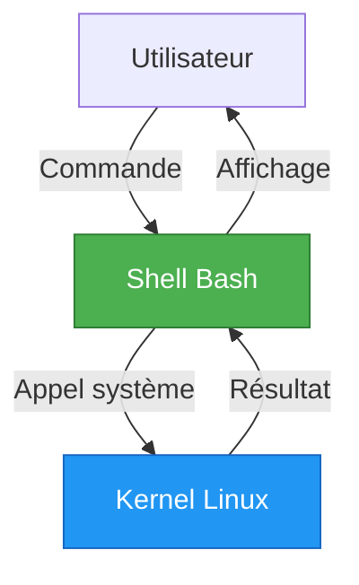

---
tags:
  - formation
  - linux
  - bash
  - scripting
  - shell
---

# Module 5 : Introduction au Shell Scripting

## Objectifs du Module

À l'issue de ce module, vous serez capable de :

- Comprendre le fonctionnement du shell Bash
- Écrire des scripts avec variables, conditions et boucles
- Passer et traiter des arguments
- Créer des fonctions réutilisables
- Débugger vos scripts

**Durée :** 8 heures

**Niveau :** Débutant

---

## 1. Le Shell Bash

### Qu'est-ce qu'un Shell ?

Le **shell** est l'interface entre l'utilisateur et le système d'exploitation. Bash (Bourne Again SHell) est le shell le plus répandu.



### Vérifier votre Shell

```bash
# Shell actuel
echo $SHELL
# /bin/bash

# Version de Bash
bash --version
# GNU bash, version 5.1.8(1)-release

# Shells disponibles
cat /etc/shells
# /bin/sh
# /bin/bash
# /bin/zsh
```

---

## 2. Premier Script

### Structure de Base

```bash
#!/bin/bash
# Mon premier script
# Auteur: VotreNom
# Date: 2024-11-29

echo "Hello, World!"
```

### Le Shebang (#!)

La première ligne `#!/bin/bash` indique quel interpréteur utiliser :

| Shebang | Interpréteur |
|---------|--------------|
| `#!/bin/bash` | Bash |
| `#!/bin/sh` | Shell POSIX (portable) |
| `#!/usr/bin/env bash` | Bash (cherche dans PATH) |
| `#!/usr/bin/python3` | Python 3 |

### Créer et Exécuter un Script

```bash
# 1. Créer le script
cat > hello.sh << 'EOF'
#!/bin/bash
echo "Hello, World!"
echo "Date: $(date)"
echo "User: $USER"
EOF

# 2. Rendre exécutable
chmod +x hello.sh

# 3. Exécuter
./hello.sh
# Hello, World!
# Date: Fri Nov 29 14:30:00 CET 2024
# User: alice

# Alternatives d'exécution
bash hello.sh       # Sans chmod +x
source hello.sh     # Dans le shell courant
. hello.sh          # Identique à source
```

---

## 3. Variables

### Définir et Utiliser

```bash
# Définir (pas d'espace autour du =)
nom="Alice"
age=25
chemin="/home/alice"

# Utiliser (avec $)
echo "Nom: $nom"
echo "Age: $age"
echo "Home: $chemin"

# Accolades (recommandé)
echo "Bonjour ${nom}!"
echo "Fichier: ${chemin}/documents"
```

### Variables Spéciales

| Variable | Description |
|----------|-------------|
| `$0` | Nom du script |
| `$1`, `$2`... | Arguments positionnels |
| `$#` | Nombre d'arguments |
| `$@` | Tous les arguments (séparés) |
| `$*` | Tous les arguments (une chaîne) |
| `$?` | Code retour de la dernière commande |
| `$$` | PID du script |
| `$!` | PID du dernier processus en arrière-plan |

```bash
#!/bin/bash
echo "Script: $0"
echo "Premier argument: $1"
echo "Nombre d'arguments: $#"
echo "Tous les arguments: $@"
echo "PID: $$"
```

### Variables d'Environnement

```bash
# Afficher toutes les variables d'environnement
env
printenv

# Variables courantes
echo $USER          # Utilisateur courant
echo $HOME          # Répertoire home
echo $PATH          # Chemins des exécutables
echo $PWD           # Répertoire courant
echo $SHELL         # Shell par défaut
echo $HOSTNAME      # Nom de la machine

# Exporter une variable
export MA_VAR="valeur"

# Variable pour les sous-processus uniquement
(export LOCAL_VAR="test"; echo $LOCAL_VAR)
```

### Substitution de Commande

```bash
# Syntaxe moderne (recommandée)
date_actuelle=$(date +%Y-%m-%d)
fichiers=$(ls -1 | wc -l)

# Ancienne syntaxe (backticks)
date_actuelle=`date +%Y-%m-%d`

# Utilisation
echo "Date: $date_actuelle"
echo "Nombre de fichiers: $fichiers"

# Imbrication
chemin_complet=$(dirname $(readlink -f $0))
```

### Lecture Interactive

```bash
#!/bin/bash

# Lecture simple
echo -n "Entrez votre nom: "
read nom
echo "Bonjour, $nom!"

# Avec prompt intégré
read -p "Entrez votre âge: " age

# Lecture silencieuse (mot de passe)
read -sp "Mot de passe: " password
echo ""  # Nouvelle ligne

# Avec timeout
read -t 5 -p "Répondez en 5 secondes: " reponse

# Valeur par défaut
read -p "Continuer? [O/n] " choix
choix=${choix:-O}  # O si vide
```

---

## 4. Conditions

### Test de Base

```bash
# Syntaxe avec [ ]
if [ condition ]; then
    commandes
fi

# Syntaxe avec [[ ]] (Bash moderne, recommandée)
if [[ condition ]]; then
    commandes
fi

# if / else
if [[ condition ]]; then
    commandes_si_vrai
else
    commandes_si_faux
fi

# if / elif / else
if [[ condition1 ]]; then
    commandes1
elif [[ condition2 ]]; then
    commandes2
else
    commandes_default
fi
```

### Opérateurs de Comparaison

#### Chaînes de Caractères

| Opérateur | Description |
|-----------|-------------|
| `=` ou `==` | Égal |
| `!=` | Différent |
| `-z` | Chaîne vide |
| `-n` | Chaîne non vide |
| `<` | Inférieur (ordre alphabétique) |
| `>` | Supérieur |

```bash
nom="Alice"

if [[ "$nom" == "Alice" ]]; then
    echo "Bonjour Alice!"
fi

if [[ -z "$variable_vide" ]]; then
    echo "La variable est vide"
fi

if [[ -n "$nom" ]]; then
    echo "Le nom est défini"
fi
```

#### Nombres

| Opérateur | Description |
|-----------|-------------|
| `-eq` | Égal (equal) |
| `-ne` | Différent (not equal) |
| `-lt` | Inférieur (less than) |
| `-le` | Inférieur ou égal |
| `-gt` | Supérieur (greater than) |
| `-ge` | Supérieur ou égal |

```bash
age=25

if [[ $age -ge 18 ]]; then
    echo "Majeur"
else
    echo "Mineur"
fi

# Avec (( )) pour l'arithmétique (pas de $)
if (( age >= 18 )); then
    echo "Majeur"
fi
```

#### Fichiers

| Opérateur | Description |
|-----------|-------------|
| `-e` | Existe |
| `-f` | Est un fichier régulier |
| `-d` | Est un répertoire |
| `-r` | Est lisible |
| `-w` | Est modifiable |
| `-x` | Est exécutable |
| `-s` | Taille > 0 |
| `-L` | Est un lien symbolique |

```bash
fichier="/etc/passwd"

if [[ -f "$fichier" ]]; then
    echo "$fichier existe"
fi

if [[ -d "/home/alice" ]]; then
    echo "Le répertoire existe"
fi

if [[ -r "$fichier" && -w "$fichier" ]]; then
    echo "Fichier lisible et modifiable"
fi
```

### Opérateurs Logiques

| Opérateur | Description |
|-----------|-------------|
| `&&` | ET logique |
| `||` | OU logique |
| `!` | NON logique |

```bash
age=25
nom="Alice"

if [[ $age -ge 18 && "$nom" == "Alice" ]]; then
    echo "Alice est majeure"
fi

if [[ $age -lt 18 || "$nom" == "Bob" ]]; then
    echo "Mineur OU Bob"
fi

if [[ ! -f "/fichier" ]]; then
    echo "Le fichier n'existe pas"
fi
```

### case - Switch/Case

```bash
#!/bin/bash

read -p "Entrez une commande (start/stop/restart): " cmd

case $cmd in
    start)
        echo "Démarrage..."
        ;;
    stop)
        echo "Arrêt..."
        ;;
    restart)
        echo "Redémarrage..."
        ;;
    *)
        echo "Commande inconnue: $cmd"
        exit 1
        ;;
esac
```

---

## 5. Boucles

### for - Itération sur Liste

```bash
# Liste explicite
for fruit in pomme orange banane; do
    echo "Fruit: $fruit"
done

# Fichiers
for fichier in *.txt; do
    echo "Traitement de $fichier"
done

# Séquence numérique
for i in {1..5}; do
    echo "Nombre: $i"
done

# Avec pas
for i in {0..10..2}; do
    echo "Pair: $i"
done

# Style C
for ((i=0; i<5; i++)); do
    echo "Index: $i"
done

# Arguments du script
for arg in "$@"; do
    echo "Argument: $arg"
done
```

### while - Tant Que

```bash
# Compteur
compteur=0
while [[ $compteur -lt 5 ]]; do
    echo "Compteur: $compteur"
    ((compteur++))
done

# Lecture de fichier ligne par ligne
while IFS= read -r ligne; do
    echo "Ligne: $ligne"
done < fichier.txt

# Boucle infinie avec condition de sortie
while true; do
    read -p "Continuer? (o/n) " reponse
    if [[ "$reponse" == "n" ]]; then
        break
    fi
done
```

### until - Jusqu'à Ce Que

```bash
compteur=0
until [[ $compteur -ge 5 ]]; do
    echo "Compteur: $compteur"
    ((compteur++))
done
```

### break et continue

```bash
# break - sortir de la boucle
for i in {1..10}; do
    if [[ $i -eq 5 ]]; then
        break
    fi
    echo $i
done
# Affiche: 1 2 3 4

# continue - passer à l'itération suivante
for i in {1..5}; do
    if [[ $i -eq 3 ]]; then
        continue
    fi
    echo $i
done
# Affiche: 1 2 4 5
```

---

## 6. Fonctions

### Définition et Appel

```bash
#!/bin/bash

# Définition
saluer() {
    echo "Bonjour, $1!"
}

# Appel
saluer "Alice"
saluer "Bob"

# Avec return
est_pair() {
    local nombre=$1
    if (( nombre % 2 == 0 )); then
        return 0  # Vrai
    else
        return 1  # Faux
    fi
}

# Utilisation
if est_pair 42; then
    echo "42 est pair"
fi
```

### Variables Locales

```bash
ma_fonction() {
    local var_locale="Je suis locale"
    var_globale="Je suis globale"
    echo "$var_locale"
}

ma_fonction
echo "$var_locale"   # Vide (locale à la fonction)
echo "$var_globale"  # Affiche: Je suis globale
```

### Retourner des Valeurs

```bash
# Méthode 1 : echo (capture avec $())
calculer_double() {
    local nombre=$1
    echo $((nombre * 2))
}

resultat=$(calculer_double 21)
echo "Double: $resultat"  # 42

# Méthode 2 : Variable globale
calculer_triple() {
    local nombre=$1
    RESULTAT=$((nombre * 3))
}

calculer_triple 14
echo "Triple: $RESULTAT"  # 42
```

### Exemple Complet

```bash
#!/bin/bash
# Script avec fonctions

# Fonction de log
log() {
    local niveau=$1
    shift
    local message="$*"
    echo "[$(date '+%Y-%m-%d %H:%M:%S')] [$niveau] $message"
}

# Fonction de vérification fichier
verifier_fichier() {
    local fichier=$1

    if [[ ! -f "$fichier" ]]; then
        log "ERROR" "Fichier non trouvé: $fichier"
        return 1
    fi

    if [[ ! -r "$fichier" ]]; then
        log "ERROR" "Fichier non lisible: $fichier"
        return 1
    fi

    log "INFO" "Fichier OK: $fichier"
    return 0
}

# Main
main() {
    log "INFO" "Démarrage du script"

    for fichier in "$@"; do
        verifier_fichier "$fichier"
    done

    log "INFO" "Fin du script"
}

# Exécution
main "$@"
```

---

## 7. Gestion des Erreurs

### Codes de Retour

```bash
# Vérifier le code retour
commande
if [[ $? -eq 0 ]]; then
    echo "Succès"
else
    echo "Échec"
fi

# Syntaxe concise
commande && echo "Succès" || echo "Échec"

# Personnaliser le code de sortie
if [[ ! -f "$fichier" ]]; then
    echo "Erreur: fichier non trouvé" >&2
    exit 1
fi
```

### Options de Sécurité

```bash
#!/bin/bash
set -euo pipefail

# -e : Arrêter en cas d'erreur
# -u : Erreur si variable non définie
# -o pipefail : Propager les erreurs dans les pipes
```

### Trap - Gestion des Signaux

```bash
#!/bin/bash

# Nettoyer à la sortie
cleanup() {
    echo "Nettoyage..."
    rm -f /tmp/script_$$_*
}

# Attraper EXIT, SIGINT (Ctrl+C), SIGTERM
trap cleanup EXIT

# Script principal
echo "Travail en cours..."
touch /tmp/script_$$_temp
sleep 10
echo "Terminé"
```

---

## 8. Debugging

### Options de Debug

```bash
# Exécuter en mode debug
bash -x script.sh

# Activer/désactiver dans le script
set -x  # Activer le debug
# ... code ...
set +x  # Désactiver le debug

# Mode verbose
bash -v script.sh

# Combinaison
bash -xv script.sh
```

### Techniques de Debug

```bash
#!/bin/bash

# Afficher les variables
DEBUG=${DEBUG:-false}

debug() {
    if [[ "$DEBUG" == "true" ]]; then
        echo "[DEBUG] $*" >&2
    fi
}

variable="test"
debug "variable = $variable"

# Exécution
# Normal: ./script.sh
# Debug:  DEBUG=true ./script.sh
```

---

## 9. Exercice Pratique

!!! example "Exercice : Script de Sauvegarde"

    **Objectif :** Créer un script de sauvegarde de répertoires.

    **Fonctionnalités :**

    1. Accepter un répertoire source en argument
    2. Créer une archive `.tar.gz` avec la date dans le nom
    3. Sauvegarder dans `/backup` (ou un répertoire spécifié)
    4. Vérifier que la source existe
    5. Afficher un résumé (taille, emplacement)
    6. Gérer les erreurs proprement

    **Usage attendu :**

    ```bash
    ./backup.sh /home/alice/documents
    ./backup.sh /etc /backup/configs
    ```

    **Durée estimée :** 45 minutes

---

## 10. Solution

??? quote "Solution Détaillée"

    ```bash
    #!/bin/bash
    #
    # backup.sh - Script de sauvegarde
    # Usage: backup.sh <source> [destination]
    #

    set -euo pipefail

    # === Configuration ===
    readonly SCRIPT_NAME=$(basename "$0")
    readonly DATE=$(date +%Y%m%d_%H%M%S)
    readonly DEFAULT_DEST="/backup"

    # === Fonctions ===

    usage() {
        cat << EOF
    Usage: $SCRIPT_NAME <source> [destination]

    Arguments:
        source       Répertoire à sauvegarder
        destination  Répertoire de destination (défaut: $DEFAULT_DEST)

    Exemple:
        $SCRIPT_NAME /home/alice/documents
        $SCRIPT_NAME /etc /backup/configs
    EOF
        exit 1
    }

    log() {
        local niveau=$1
        shift
        echo "[$(date '+%Y-%m-%d %H:%M:%S')] [$niveau] $*"
    }

    error() {
        log "ERROR" "$*" >&2
        exit 1
    }

    verifier_source() {
        local source=$1

        if [[ ! -e "$source" ]]; then
            error "Source non trouvée: $source"
        fi

        if [[ ! -r "$source" ]]; then
            error "Source non lisible: $source"
        fi

        log "INFO" "Source vérifiée: $source"
    }

    preparer_destination() {
        local dest=$1

        if [[ ! -d "$dest" ]]; then
            log "INFO" "Création du répertoire: $dest"
            mkdir -p "$dest" || error "Impossible de créer $dest"
        fi

        if [[ ! -w "$dest" ]]; then
            error "Destination non accessible en écriture: $dest"
        fi

        log "INFO" "Destination prête: $dest"
    }

    creer_backup() {
        local source=$1
        local dest=$2
        local nom_base=$(basename "$source")
        local archive="${dest}/${nom_base}_${DATE}.tar.gz"

        log "INFO" "Création de l'archive: $archive"

        if tar -czf "$archive" -C "$(dirname "$source")" "$nom_base"; then
            log "INFO" "Archive créée avec succès"
            echo "$archive"
        else
            error "Échec de la création de l'archive"
        fi
    }

    afficher_resume() {
        local archive=$1
        local taille=$(du -h "$archive" | cut -f1)

        echo ""
        echo "==================================="
        echo "       Sauvegarde Terminée        "
        echo "==================================="
        echo "Archive: $archive"
        echo "Taille:  $taille"
        echo "Date:    $(date)"
        echo "==================================="
    }

    # === Main ===

    main() {
        # Vérifier les arguments
        if [[ $# -lt 1 ]]; then
            usage
        fi

        local source=$1
        local dest=${2:-$DEFAULT_DEST}

        log "INFO" "Démarrage de la sauvegarde"
        log "INFO" "Source: $source"
        log "INFO" "Destination: $dest"

        # Vérifications
        verifier_source "$source"
        preparer_destination "$dest"

        # Créer le backup
        local archive
        archive=$(creer_backup "$source" "$dest")

        # Résumé
        afficher_resume "$archive"

        log "INFO" "Sauvegarde terminée avec succès"
    }

    # Exécution
    main "$@"
    ```

    ### Test du Script

    ```bash
    # Rendre exécutable
    chmod +x backup.sh

    # Créer un répertoire de test
    mkdir -p ~/test_backup/documents
    echo "Fichier test" > ~/test_backup/documents/test.txt

    # Créer le répertoire de destination
    sudo mkdir -p /backup
    sudo chown $USER:$USER /backup

    # Exécuter
    ./backup.sh ~/test_backup/documents

    # Vérifier
    ls -la /backup/
    tar -tzf /backup/documents_*.tar.gz
    ```

---

## Points Clés à Retenir

| Concept | Syntaxe |
|---------|---------|
| Shebang | `#!/bin/bash` |
| Variable | `nom="valeur"`, `$nom`, `${nom}` |
| Substitution | `$(commande)` |
| Condition | `if [[ condition ]]; then ... fi` |
| Boucle for | `for i in liste; do ... done` |
| Boucle while | `while [[ cond ]]; do ... done` |
| Fonction | `nom() { ... }` |
| Variable locale | `local var="valeur"` |
| Code retour | `$?`, `exit 1` |
| Mode strict | `set -euo pipefail` |

---

## Félicitations !

Vous avez terminé le **Niveau 1 - Fondations Linux** !

Vous maîtrisez maintenant :

- L'installation et la découverte de Linux
- La navigation et manipulation de fichiers
- La gestion des utilisateurs et permissions
- Les éditeurs et le traitement de texte
- Les bases du scripting Shell

**Prochaine étape :** Le Niveau 2 - Administration Système vous attend !

[:octicons-arrow-right-24: Module 6 : Gestion des Paquets](06-paquets.md)

---

**Retour au :** [Programme de la Formation](index.md)

---

## Navigation

| | |
|:---|---:|
| [← Module 4 : Éditeurs & Traitement de T...](04-editeurs.md) | [Module 6 : Gestion des Paquets →](06-paquets.md) |

[Retour au Programme](index.md){ .md-button }
