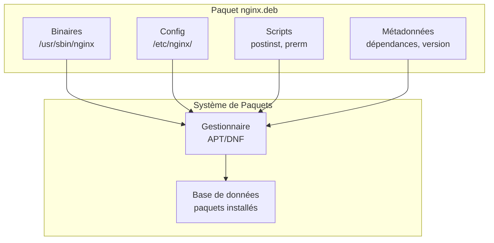
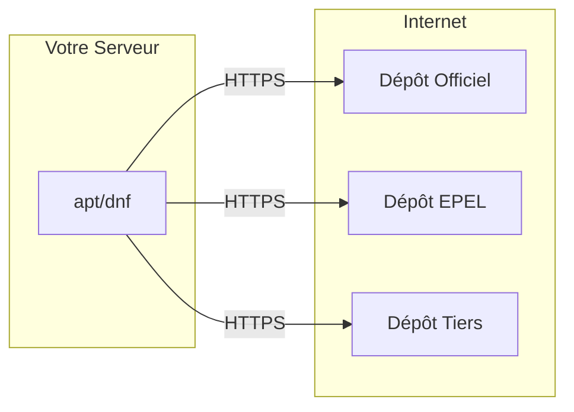

---
tags:
  - formation
  - linux
  - packages
  - apt
  - dnf
  - yum
---

# Module 6 : Gestion des Paquets

## Objectifs du Module

À l'issue de ce module, vous serez capable de :

- Comprendre le système de paquets Linux
- Gérer les paquets avec APT (Debian/Ubuntu)
- Gérer les paquets avec DNF/YUM (RHEL/Rocky)
- Configurer les dépôts (repositories)
- Compiler depuis les sources

**Durée :** 5 heures

**Niveau :** Administration

---

## 1. Concepts des Paquets

### Qu'est-ce qu'un Paquet ?

Un **paquet** est une archive contenant :

- Les binaires du logiciel
- Les fichiers de configuration
- Les scripts d'installation/désinstallation
- Les métadonnées (dépendances, version, description)



### Formats de Paquets

| Format | Extension | Famille | Outil bas niveau | Outil haut niveau |
|--------|-----------|---------|------------------|-------------------|
| Debian | `.deb` | Debian, Ubuntu | `dpkg` | `apt` |
| RPM | `.rpm` | RHEL, Fedora, Rocky | `rpm` | `dnf` / `yum` |
| Pacman | `.pkg.tar.zst` | Arch | - | `pacman` |
| Zypper | `.rpm` | SUSE | `rpm` | `zypper` |

### Dépôts (Repositories)

Un **dépôt** est un serveur contenant des paquets et leurs métadonnées.



---

## 2. APT (Debian/Ubuntu)

### Commandes Essentielles

```bash
# Mettre à jour la liste des paquets
sudo apt update

# Mettre à jour les paquets installés
sudo apt upgrade

# Mise à jour complète (peut supprimer/ajouter des paquets)
sudo apt full-upgrade

# Installer un paquet
sudo apt install nginx

# Installer plusieurs paquets
sudo apt install nginx php-fpm mariadb-server

# Installer une version spécifique
sudo apt install nginx=1.18.0-0ubuntu1

# Supprimer un paquet (garde la config)
sudo apt remove nginx

# Supprimer avec la configuration
sudo apt purge nginx

# Supprimer les dépendances orphelines
sudo apt autoremove

# Rechercher un paquet
apt search nginx

# Afficher les informations
apt show nginx

# Lister les paquets installés
apt list --installed

# Lister les paquets upgradables
apt list --upgradable
```

### Configuration des Dépôts

```bash
# Fichier principal
cat /etc/apt/sources.list

# Dépôts additionnels
ls /etc/apt/sources.list.d/

# Format d'une ligne
# deb [options] URL distribution composants
deb http://archive.ubuntu.com/ubuntu jammy main restricted universe multiverse
```

### Ajouter un Dépôt PPA (Ubuntu)

```bash
# Ajouter un PPA
sudo add-apt-repository ppa:ondrej/nginx

# Supprimer un PPA
sudo add-apt-repository --remove ppa:ondrej/nginx

# Mettre à jour après ajout
sudo apt update
```

### dpkg - Outil Bas Niveau

```bash
# Installer un .deb téléchargé
sudo dpkg -i paquet.deb

# Résoudre les dépendances manquantes
sudo apt install -f

# Lister les fichiers d'un paquet
dpkg -L nginx

# Trouver à quel paquet appartient un fichier
dpkg -S /usr/sbin/nginx
# nginx-core: /usr/sbin/nginx

# Afficher les infos d'un paquet installé
dpkg -s nginx

# Lister tous les paquets installés
dpkg -l

# Supprimer un paquet
sudo dpkg -r nginx
sudo dpkg -P nginx  # Avec purge
```

---

## 3. DNF/YUM (RHEL/Rocky/Fedora)

### DNF vs YUM

- **YUM** : Ancien gestionnaire (RHEL 7 et avant)
- **DNF** : Nouveau gestionnaire (RHEL 8+, Fedora)
- Les commandes sont quasiment identiques

### Commandes Essentielles

```bash
# Mettre à jour la liste des paquets et upgrader
sudo dnf update
# ou
sudo dnf upgrade  # Identique

# Installer un paquet
sudo dnf install nginx

# Installer un groupe de paquets
sudo dnf groupinstall "Development Tools"

# Supprimer un paquet
sudo dnf remove nginx

# Rechercher
dnf search nginx

# Informations
dnf info nginx

# Lister les paquets installés
dnf list installed

# Lister les mises à jour disponibles
dnf list updates

# Nettoyer le cache
sudo dnf clean all

# Historique des transactions
dnf history
sudo dnf history undo 15  # Annuler la transaction 15
```

### Configuration des Dépôts

```bash
# Lister les dépôts activés
dnf repolist

# Lister tous les dépôts
dnf repolist all

# Activer un dépôt
sudo dnf config-manager --set-enabled powertools

# Désactiver un dépôt
sudo dnf config-manager --set-disabled powertools

# Fichiers de configuration
ls /etc/yum.repos.d/
```

### EPEL - Extra Packages for Enterprise Linux

```bash
# Installer EPEL sur Rocky/RHEL 9
sudo dnf install epel-release

# Vérifier
dnf repolist | grep epel
```

### Ajouter un Dépôt

```bash
# Méthode 1 : Fichier .repo
sudo tee /etc/yum.repos.d/custom.repo << 'EOF'
[custom-repo]
name=My Custom Repository
baseurl=https://example.com/repo/
enabled=1
gpgcheck=1
gpgkey=https://example.com/repo/RPM-GPG-KEY
EOF

# Méthode 2 : config-manager
sudo dnf config-manager --add-repo https://example.com/repo/custom.repo
```

### rpm - Outil Bas Niveau

```bash
# Installer un .rpm téléchargé
sudo rpm -ivh paquet.rpm

# Mettre à jour
sudo rpm -Uvh paquet.rpm

# Supprimer
sudo rpm -e paquet

# Lister les fichiers d'un paquet
rpm -ql nginx

# Trouver le paquet d'un fichier
rpm -qf /usr/sbin/nginx

# Vérifier un paquet
rpm -V nginx

# Informations
rpm -qi nginx

# Lister les dépendances
rpm -qR nginx
```

---

## 4. Comparaison APT vs DNF

| Action | APT (Debian/Ubuntu) | DNF (RHEL/Rocky) |
|--------|---------------------|------------------|
| Mettre à jour la liste | `apt update` | (inclus dans update) |
| Mettre à jour les paquets | `apt upgrade` | `dnf update` |
| Installer | `apt install pkg` | `dnf install pkg` |
| Supprimer | `apt remove pkg` | `dnf remove pkg` |
| Purger (config) | `apt purge pkg` | - |
| Rechercher | `apt search pkg` | `dnf search pkg` |
| Info | `apt show pkg` | `dnf info pkg` |
| Lister installés | `apt list --installed` | `dnf list installed` |
| Nettoyer | `apt autoremove` | `dnf autoremove` |
| Cache | `apt clean` | `dnf clean all` |

---

## 5. Compilation depuis les Sources

### Pourquoi Compiler ?

- Version plus récente que dans les dépôts
- Options de compilation personnalisées
- Logiciel non disponible en paquet

### Processus Standard

```bash
# 1. Installer les outils de compilation
# Debian/Ubuntu
sudo apt install build-essential

# RHEL/Rocky
sudo dnf groupinstall "Development Tools"

# 2. Télécharger les sources
wget https://example.com/logiciel-1.0.tar.gz
tar xzf logiciel-1.0.tar.gz
cd logiciel-1.0

# 3. Configurer (vérifier les dépendances)
./configure --prefix=/usr/local

# 4. Compiler
make -j$(nproc)

# 5. Installer
sudo make install

# 6. Vérifier
/usr/local/bin/logiciel --version
```

### Exemple : Compiler Nginx

```bash
# Dépendances
sudo apt install build-essential libpcre3-dev zlib1g-dev libssl-dev

# Télécharger
wget https://nginx.org/download/nginx-1.24.0.tar.gz
tar xzf nginx-1.24.0.tar.gz
cd nginx-1.24.0

# Configurer avec options personnalisées
./configure \
    --prefix=/opt/nginx \
    --with-http_ssl_module \
    --with-http_v2_module \
    --with-http_gzip_static_module

# Compiler et installer
make -j$(nproc)
sudo make install

# Tester
/opt/nginx/sbin/nginx -v
```

### checkinstall - Créer un Paquet

```bash
# Installer checkinstall
sudo apt install checkinstall

# Au lieu de "make install"
sudo checkinstall --pkgname=nginx-custom --pkgversion=1.24.0

# Résultat : un .deb que vous pouvez gérer avec apt
```

---

## 6. Bonnes Pratiques

### Sécurité

```bash
# Toujours utiliser HTTPS pour les dépôts
# Vérifier les clés GPG

# APT
apt-key list
apt-key adv --keyserver keyserver.ubuntu.com --recv-keys KEY_ID

# DNF - les clés sont dans le .repo
gpgkey=https://example.com/RPM-GPG-KEY
```

### Mises à Jour Automatiques

```bash
# Ubuntu - unattended-upgrades
sudo apt install unattended-upgrades
sudo dpkg-reconfigure unattended-upgrades

# RHEL/Rocky - dnf-automatic
sudo dnf install dnf-automatic
sudo systemctl enable --now dnf-automatic.timer
```

### Verrouillage de Version

```bash
# APT - apt-mark
sudo apt-mark hold nginx
sudo apt-mark unhold nginx
apt-mark showhold

# DNF - versionlock
sudo dnf install dnf-plugin-versionlock
sudo dnf versionlock add nginx
sudo dnf versionlock list
sudo dnf versionlock delete nginx
```

---

## 7. Exercice Pratique

!!! example "Exercice : Gestion des Paquets"

    **Tâches :**

    1. Mettre à jour votre système
    2. Rechercher et installer le paquet `htop`
    3. Afficher les informations du paquet
    4. Lister les fichiers installés par ce paquet
    5. Installer `nginx` et vérifier le service
    6. Bloquer les mises à jour de `nginx`
    7. Installer EPEL (si RHEL/Rocky) ou un PPA (si Ubuntu)
    8. Nettoyer le cache des paquets

    **Durée estimée :** 25 minutes

---

## 8. Solution

??? quote "Solution (Debian/Ubuntu)"

    ```bash
    # 1. Mise à jour
    sudo apt update && sudo apt upgrade -y

    # 2. Installer htop
    apt search htop
    sudo apt install htop

    # 3. Informations
    apt show htop

    # 4. Fichiers installés
    dpkg -L htop

    # 5. Nginx
    sudo apt install nginx
    sudo systemctl status nginx
    curl http://localhost

    # 6. Bloquer nginx
    sudo apt-mark hold nginx
    apt-mark showhold

    # 7. PPA exemple
    sudo add-apt-repository ppa:ondrej/nginx-mainline
    sudo apt update

    # 8. Nettoyer
    sudo apt clean
    sudo apt autoremove
    ```

??? quote "Solution (RHEL/Rocky)"

    ```bash
    # 1. Mise à jour
    sudo dnf update -y

    # 2. Installer htop
    dnf search htop
    sudo dnf install htop

    # 3. Informations
    dnf info htop

    # 4. Fichiers installés
    rpm -ql htop

    # 5. Nginx
    sudo dnf install nginx
    sudo systemctl enable --now nginx
    sudo systemctl status nginx
    curl http://localhost

    # 6. Bloquer nginx
    sudo dnf install dnf-plugin-versionlock
    sudo dnf versionlock add nginx
    sudo dnf versionlock list

    # 7. EPEL
    sudo dnf install epel-release
    dnf repolist

    # 8. Nettoyer
    sudo dnf clean all
    sudo dnf autoremove
    ```

---

## Points Clés à Retenir

| Concept | APT | DNF |
|---------|-----|-----|
| Mettre à jour | `apt update && apt upgrade` | `dnf update` |
| Installer | `apt install` | `dnf install` |
| Supprimer | `apt remove` / `apt purge` | `dnf remove` |
| Rechercher | `apt search` | `dnf search` |
| Fichiers d'un paquet | `dpkg -L` | `rpm -ql` |
| Bloquer version | `apt-mark hold` | `dnf versionlock` |

---

## Prochaine Étape

Vous maîtrisez la gestion des paquets. Le prochain module couvre les processus et services avec systemd.

[:octicons-arrow-right-24: Module 7 : Processus & Services](07-services.md)

---

**Retour au :** [Programme de la Formation](index.md)
