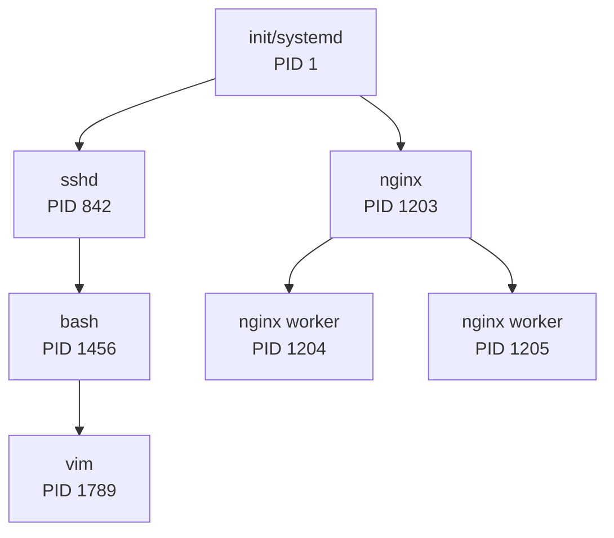
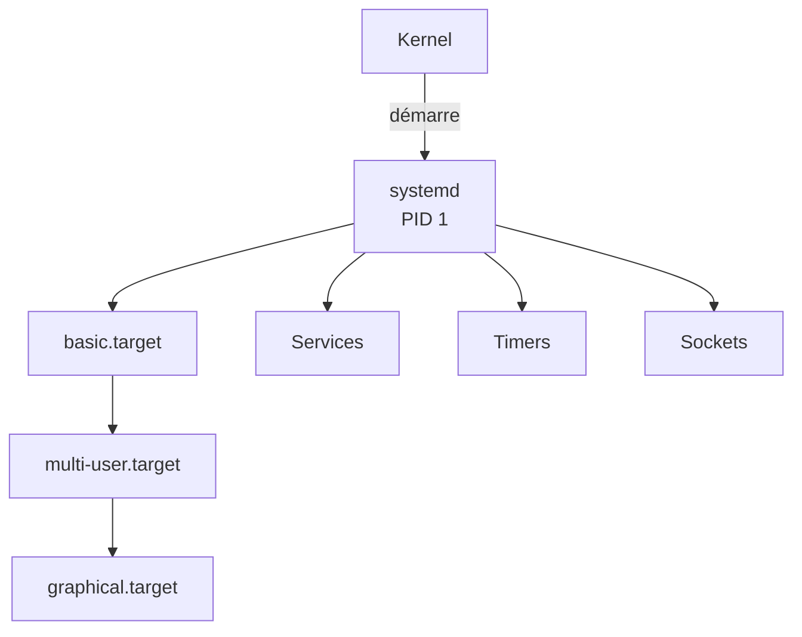
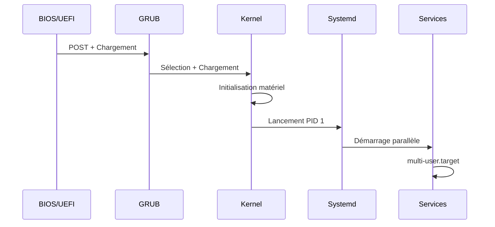

---
tags:
  - formation
  - linux
  - systemd
  - services
  - processus
---

# Module 7 : Processus & Services

## Objectifs du Module

À l'issue de ce module, vous serez capable de :

- Comprendre les processus Linux et leur gestion
- Maîtriser systemd et la gestion des services
- Analyser les logs avec journald
- Comprendre le processus de démarrage Linux

**Durée :** 7 heures

**Niveau :** Administration

---

## 1. Les Processus Linux

### Concept

Un **processus** est un programme en cours d'exécution. Chaque processus possède :

- Un **PID** (Process ID) unique
- Un **PPID** (Parent PID)
- Un propriétaire (UID)
- Une priorité (nice)
- Des ressources (mémoire, CPU)



### Visualiser les Processus

```bash
# Liste simple
ps aux

# Format personnalisé
ps -eo pid,ppid,user,%cpu,%mem,cmd --sort=-%cpu | head

# Arborescence
pstree -p

# Temps réel
top
htop

# Processus d'un utilisateur
ps -u alice

# Un processus spécifique
ps -p 1234
```

### Signaux

| Signal | Numéro | Action |
|--------|--------|--------|
| SIGHUP | 1 | Recharger la configuration |
| SIGINT | 2 | Interruption (Ctrl+C) |
| SIGKILL | 9 | Tuer immédiatement (non interceptable) |
| SIGTERM | 15 | Terminer proprement |
| SIGSTOP | 19 | Suspendre |
| SIGCONT | 18 | Reprendre |

```bash
# Envoyer un signal
kill -15 1234        # SIGTERM
kill -9 1234         # SIGKILL (dernier recours)
kill -HUP 1234       # Reload config

# Par nom
pkill nginx
killall nginx

# Tuer tous les processus d'un utilisateur
pkill -u alice
```

### Priorité (nice)

```bash
# Lancer avec priorité basse (nice = 19)
nice -n 19 ./script_long.sh

# Changer la priorité d'un processus
renice -n 10 -p 1234

# Voir les priorités
ps -eo pid,ni,cmd
```

### Jobs (Arrière-plan)

```bash
# Lancer en arrière-plan
./script.sh &

# Suspendre (Ctrl+Z) puis reprendre en arrière-plan
bg

# Ramener au premier plan
fg

# Lister les jobs
jobs

# Détacher d'un terminal
nohup ./script.sh &
disown
```

---

## 2. Systemd

### Concept

**Systemd** est le système d'init et gestionnaire de services par défaut sur les distributions modernes.



### systemctl - Gestion des Services

```bash
# Statut d'un service
systemctl status nginx

# Démarrer / Arrêter
sudo systemctl start nginx
sudo systemctl stop nginx

# Redémarrer / Recharger
sudo systemctl restart nginx
sudo systemctl reload nginx   # Sans interruption

# Activer au démarrage
sudo systemctl enable nginx
sudo systemctl enable --now nginx  # Enable + Start

# Désactiver
sudo systemctl disable nginx

# Lister les services
systemctl list-units --type=service
systemctl list-units --type=service --state=running

# Services échoués
systemctl --failed
```

### Fichiers Unit

```bash
# Emplacement des units
/usr/lib/systemd/system/    # Fournis par les paquets
/etc/systemd/system/        # Personnalisés (prioritaire)

# Voir un unit file
systemctl cat nginx.service

# Éditer un unit
sudo systemctl edit nginx.service           # Override
sudo systemctl edit --full nginx.service    # Copie complète
```

### Créer un Service Personnalisé

```bash
# /etc/systemd/system/monapp.service
sudo tee /etc/systemd/system/monapp.service << 'EOF'
[Unit]
Description=Mon Application Custom
After=network.target

[Service]
Type=simple
User=appuser
WorkingDirectory=/opt/monapp
ExecStart=/opt/monapp/bin/monapp
ExecReload=/bin/kill -HUP $MAINPID
Restart=on-failure
RestartSec=5

[Install]
WantedBy=multi-user.target
EOF

# Recharger systemd
sudo systemctl daemon-reload

# Activer et démarrer
sudo systemctl enable --now monapp
```

### Targets (Runlevels)

| Target | Ancien Runlevel | Description |
|--------|-----------------|-------------|
| poweroff.target | 0 | Arrêt |
| rescue.target | 1 | Mode mono-utilisateur |
| multi-user.target | 3 | Multi-utilisateur, sans GUI |
| graphical.target | 5 | Avec interface graphique |
| reboot.target | 6 | Redémarrage |

```bash
# Voir le target actuel
systemctl get-default

# Changer le target par défaut
sudo systemctl set-default multi-user.target

# Changer temporairement
sudo systemctl isolate rescue.target
```

---

## 3. Journald - Logs Centralisés

### Consulter les Logs

```bash
# Tous les logs
journalctl

# Logs d'un service
journalctl -u nginx

# Logs depuis le dernier boot
journalctl -b

# Logs en temps réel
journalctl -f
journalctl -fu nginx

# Par priorité
journalctl -p err       # Erreurs et plus grave
journalctl -p warning

# Par période
journalctl --since "2024-11-29 10:00"
journalctl --since "1 hour ago"
journalctl --since yesterday --until today

# Kernel messages
journalctl -k

# Format JSON
journalctl -u nginx -o json-pretty
```

### Configuration

```bash
# /etc/systemd/journald.conf
Storage=persistent        # Conserver les logs après reboot
SystemMaxUse=500M         # Taille max
SystemMaxFileSize=50M     # Taille max par fichier
MaxRetentionSec=1month    # Durée de rétention

# Appliquer
sudo systemctl restart systemd-journald
```

---

## 4. Processus de Démarrage



### Analyser le Boot

```bash
# Temps de démarrage
systemd-analyze

# Détail par service
systemd-analyze blame

# Graphique SVG
systemd-analyze plot > boot.svg

# Chemin critique
systemd-analyze critical-chain
```

---

## 5. Exercice Pratique

!!! example "Exercice : Créer et Gérer un Service"

    1. Créer un script `/opt/monitor/check.sh` qui écrit la date et l'usage mémoire dans un fichier de log
    2. Créer un service systemd qui exécute ce script
    3. Créer un timer systemd pour l'exécuter toutes les 5 minutes
    4. Activer et tester le timer
    5. Consulter les logs avec journalctl

    **Durée estimée :** 30 minutes

---

## 6. Solution

??? quote "Solution Détaillée"

    ```bash
    # 1. Créer le script
    sudo mkdir -p /opt/monitor
    sudo tee /opt/monitor/check.sh << 'EOF'
    #!/bin/bash
    echo "[$(date '+%Y-%m-%d %H:%M:%S')] Memory: $(free -h | awk '/Mem:/ {print $3"/"$2}')"
    EOF
    sudo chmod +x /opt/monitor/check.sh

    # 2. Créer le service
    sudo tee /etc/systemd/system/monitor.service << 'EOF'
    [Unit]
    Description=System Monitor Check

    [Service]
    Type=oneshot
    ExecStart=/opt/monitor/check.sh
    StandardOutput=journal
    EOF

    # 3. Créer le timer
    sudo tee /etc/systemd/system/monitor.timer << 'EOF'
    [Unit]
    Description=Run monitor every 5 minutes

    [Timer]
    OnBootSec=1min
    OnUnitActiveSec=5min

    [Install]
    WantedBy=timers.target
    EOF

    # 4. Activer
    sudo systemctl daemon-reload
    sudo systemctl enable --now monitor.timer

    # 5. Vérifier
    systemctl list-timers
    journalctl -u monitor.service -f
    ```

---

## Points Clés à Retenir

| Commande | Usage |
|----------|-------|
| `ps aux` | Lister les processus |
| `kill -15 PID` | Terminer proprement |
| `systemctl status` | Statut d'un service |
| `systemctl enable --now` | Activer et démarrer |
| `journalctl -fu service` | Logs temps réel |

---

[:octicons-arrow-right-24: Module 8 : Stockage & Filesystems](08-stockage.md)

---

**Retour au :** [Programme de la Formation](index.md)

---

## Navigation

| | |
|:---|---:|
| [← Module 6 : Gestion des Paquets](06-paquets.md) | [Module 8 : Stockage & Filesystems →](08-stockage.md) |

[Retour au Programme](index.md){ .md-button }
