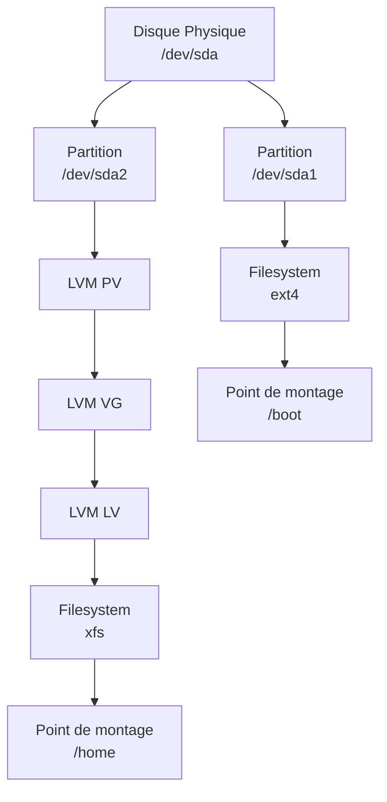

---
tags:
  - formation
  - linux
  - storage
  - lvm
  - filesystem
  - raid
---

# Module 8 : Stockage & Filesystems

## Objectifs du Module

À l'issue de ce module, vous serez capable de :

- Partitionner des disques avec fdisk et parted
- Créer et gérer des systèmes de fichiers
- Maîtriser LVM pour le stockage flexible
- Configurer le montage automatique (fstab)
- Comprendre les bases du RAID

**Durée :** 8 heures

**Niveau :** Administration

---

## 1. Concepts de Stockage

### Hiérarchie



### Nommage des Périphériques

| Périphérique | Description |
|--------------|-------------|
| `/dev/sda` | Premier disque SATA/SCSI |
| `/dev/sdb` | Deuxième disque |
| `/dev/sda1` | Première partition de sda |
| `/dev/nvme0n1` | Premier disque NVMe |
| `/dev/nvme0n1p1` | Première partition NVMe |
| `/dev/vda` | Disque virtio (VM) |

### Voir les Disques

```bash
# Lister les disques
lsblk
lsblk -f              # Avec filesystems

# Détails des partitions
sudo fdisk -l

# Utilisation de l'espace
df -h
df -hT                # Avec type de filesystem

# Inodes
df -i
```

---

## 2. Partitionnement

### Tables de Partition

| Type | Taille Max | Partitions | Usage |
|------|------------|------------|-------|
| **MBR** | 2 TB | 4 primaires (ou 3+extended) | Legacy BIOS |
| **GPT** | 8 ZB | 128+ | UEFI, moderne |

### fdisk (MBR et GPT)

```bash
sudo fdisk /dev/sdb

# Commandes interactives
# m - aide
# p - afficher les partitions
# n - nouvelle partition
# d - supprimer une partition
# t - changer le type
# w - écrire et quitter
# q - quitter sans sauver
```

### parted (GPT recommandé)

```bash
sudo parted /dev/sdb

# Créer une table GPT
(parted) mklabel gpt

# Créer une partition
(parted) mkpart primary ext4 1MiB 10GiB

# Voir les partitions
(parted) print

# Quitter
(parted) quit

# Non-interactif
sudo parted /dev/sdb --script mklabel gpt
sudo parted /dev/sdb --script mkpart primary ext4 1MiB 100%
```

---

## 3. Systèmes de Fichiers

### Créer un Filesystem

```bash
# ext4 (Linux standard)
sudo mkfs.ext4 /dev/sdb1

# XFS (RHEL default, performant)
sudo mkfs.xfs /dev/sdb1

# Options courantes
sudo mkfs.ext4 -L "DATA" /dev/sdb1           # Label
sudo mkfs.ext4 -m 1 /dev/sdb1                # 1% réservé (au lieu de 5%)
```

### Monter un Filesystem

```bash
# Créer le point de montage
sudo mkdir -p /mnt/data

# Monter
sudo mount /dev/sdb1 /mnt/data

# Vérifier
mount | grep sdb1
df -h /mnt/data

# Démonter
sudo umount /mnt/data
```

### fstab - Montage Automatique

```bash
# /etc/fstab
# <device>         <mount>    <type>  <options>        <dump> <pass>
/dev/sdb1          /data      ext4    defaults         0      2
UUID=xxxx-xxxx     /backup    xfs     defaults,noatime 0      2
```

```bash
# Trouver l'UUID
blkid /dev/sdb1

# Tester sans reboot
sudo mount -a

# Options courantes
defaults        # rw, suid, dev, exec, auto, nouser, async
noatime         # Pas de mise à jour du access time
noexec          # Pas d'exécution de binaires
nosuid          # Ignorer SUID
ro              # Lecture seule
```

---

## 4. LVM - Logical Volume Manager

### Concept

```mermaid
graph TD
    subgraph "Physical Volumes (PV)"
        A[/dev/sdb<br/>100 GB]
        B[/dev/sdc<br/>200 GB]
    end

    subgraph "Volume Group (VG)"
        C[vg_data<br/>300 GB]
    end

    subgraph "Logical Volumes (LV)"
        D[lv_home<br/>150 GB]
        E[lv_var<br/>100 GB]
        F[Espace libre<br/>50 GB]
    end

    A --> C
    B --> C
    C --> D
    C --> E
    C --> F
```

### Création LVM

```bash
# 1. Créer les Physical Volumes
sudo pvcreate /dev/sdb /dev/sdc

# 2. Créer le Volume Group
sudo vgcreate vg_data /dev/sdb /dev/sdc

# 3. Créer les Logical Volumes
sudo lvcreate -L 150G -n lv_home vg_data
sudo lvcreate -L 100G -n lv_var vg_data
sudo lvcreate -l 100%FREE -n lv_backup vg_data  # Reste

# 4. Créer les filesystems
sudo mkfs.xfs /dev/vg_data/lv_home
sudo mkfs.xfs /dev/vg_data/lv_var

# 5. Monter
sudo mount /dev/vg_data/lv_home /home
```

### Commandes LVM

```bash
# Physical Volumes
pvdisplay
pvs

# Volume Groups
vgdisplay
vgs

# Logical Volumes
lvdisplay
lvs
```

### Étendre un LV

```bash
# Ajouter un disque au VG
sudo pvcreate /dev/sdd
sudo vgextend vg_data /dev/sdd

# Étendre le LV
sudo lvextend -L +50G /dev/vg_data/lv_home
# ou
sudo lvextend -l +100%FREE /dev/vg_data/lv_home

# Redimensionner le filesystem
sudo resize2fs /dev/vg_data/lv_home    # ext4
sudo xfs_growfs /home                   # XFS (point de montage)
```

---

## 5. Swap

```bash
# Créer une partition swap
sudo mkswap /dev/sdb2
sudo swapon /dev/sdb2

# Fichier swap
sudo fallocate -l 4G /swapfile
sudo chmod 600 /swapfile
sudo mkswap /swapfile
sudo swapon /swapfile

# Voir l'utilisation
swapon --show
free -h

# fstab
/swapfile none swap sw 0 0
```

---

## 6. Exercice Pratique

!!! example "Exercice : Créer un Environnement LVM"

    Sur un disque de test (/dev/sdb de 20GB) :

    1. Créer 2 partitions de 10GB chacune
    2. Initialiser comme PV
    3. Créer un VG nommé `vg_lab`
    4. Créer un LV de 15GB nommé `lv_data`
    5. Formater en XFS et monter sur `/data`
    6. Étendre le LV à 18GB
    7. Configurer le montage automatique

    **Durée estimée :** 30 minutes

---

## 7. Solution

??? quote "Solution Détaillée"

    ```bash
    # 1. Partitionner
    sudo parted /dev/sdb --script mklabel gpt
    sudo parted /dev/sdb --script mkpart primary 1MiB 10GiB
    sudo parted /dev/sdb --script mkpart primary 10GiB 20GiB

    # 2. Créer les PV
    sudo pvcreate /dev/sdb1 /dev/sdb2

    # 3. Créer le VG
    sudo vgcreate vg_lab /dev/sdb1 /dev/sdb2

    # 4. Créer le LV
    sudo lvcreate -L 15G -n lv_data vg_lab

    # 5. Formater et monter
    sudo mkfs.xfs /dev/vg_lab/lv_data
    sudo mkdir -p /data
    sudo mount /dev/vg_lab/lv_data /data

    # 6. Étendre
    sudo lvextend -L 18G /dev/vg_lab/lv_data
    sudo xfs_growfs /data

    # 7. fstab
    echo "/dev/vg_lab/lv_data /data xfs defaults 0 2" | sudo tee -a /etc/fstab
    ```

---

## Points Clés à Retenir

| Composant | Commandes |
|-----------|-----------|
| Partitions | `fdisk`, `parted`, `lsblk` |
| Filesystem | `mkfs.ext4`, `mkfs.xfs` |
| Montage | `mount`, `umount`, `/etc/fstab` |
| LVM | `pvcreate`, `vgcreate`, `lvcreate` |
| Étendre | `lvextend`, `resize2fs`, `xfs_growfs` |

---

[:octicons-arrow-right-24: Module 9 : Réseau Fondamental](09-reseau.md)

---

**Retour au :** [Programme de la Formation](index.md)
