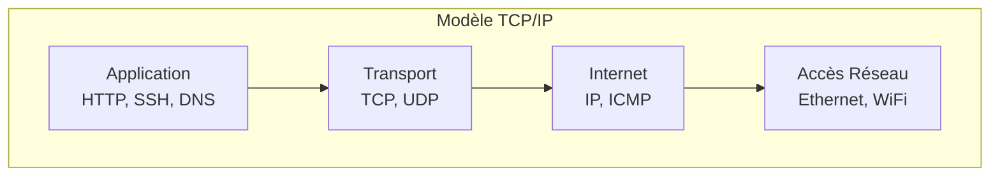

---
tags:
  - formation
  - linux
  - network
  - tcp-ip
  - dns
  - firewall
---

# Module 9 : Réseau Fondamental

## Objectifs du Module

À l'issue de ce module, vous serez capable de :

- Comprendre le modèle TCP/IP
- Configurer les interfaces réseau
- Diagnostiquer les problèmes réseau
- Configurer DNS et résolution de noms
- Comprendre les bases du routage

**Durée :** 7 heures

**Niveau :** Administration

---

## 1. Modèle TCP/IP



### Ports Courants

| Port | Protocole | Service |
|------|-----------|---------|
| 22 | TCP | SSH |
| 80 | TCP | HTTP |
| 443 | TCP | HTTPS |
| 53 | TCP/UDP | DNS |
| 25 | TCP | SMTP |
| 3306 | TCP | MySQL |
| 5432 | TCP | PostgreSQL |

---

## 2. Configuration Réseau

### Voir la Configuration

```bash
# Interfaces et adresses (moderne)
ip addr
ip a

# Anciennes commandes (net-tools)
ifconfig

# Routes
ip route
ip r

# Statistiques
ip -s link

# Connexions actives
ss -tuln
ss -tulnp    # Avec processus
```

### NetworkManager (RHEL/Rocky)

```bash
# Statut
nmcli general status
nmcli device status
nmcli connection show

# Configurer une IP statique
nmcli connection modify "Wired connection 1" \
    ipv4.method manual \
    ipv4.addresses 192.168.1.100/24 \
    ipv4.gateway 192.168.1.1 \
    ipv4.dns "8.8.8.8 8.8.4.4"

# Appliquer
nmcli connection up "Wired connection 1"

# Créer une connexion
nmcli connection add type ethernet \
    con-name eth0-static \
    ifname eth0 \
    ipv4.method manual \
    ipv4.addresses 192.168.1.100/24
```

### Netplan (Ubuntu)

```yaml
# /etc/netplan/01-config.yaml
network:
  version: 2
  ethernets:
    eth0:
      dhcp4: false
      addresses:
        - 192.168.1.100/24
      routes:
        - to: default
          via: 192.168.1.1
      nameservers:
        addresses:
          - 8.8.8.8
          - 8.8.4.4
```

```bash
# Appliquer
sudo netplan apply

# Tester
sudo netplan try
```

---

## 3. Diagnostic Réseau

### Commandes Essentielles

```bash
# Ping
ping -c 4 google.com
ping -c 4 192.168.1.1

# Traceroute
traceroute google.com
tracepath google.com

# DNS lookup
nslookup google.com
dig google.com
dig google.com +short
host google.com

# Ports ouverts
ss -tuln
netstat -tuln

# Test de port
nc -zv 192.168.1.1 22
telnet 192.168.1.1 22

# Capture de paquets
sudo tcpdump -i eth0
sudo tcpdump -i eth0 port 80
sudo tcpdump -i eth0 -w capture.pcap
```

### Résolution de Problèmes

```bash
# 1. Vérifier l'interface
ip link show eth0

# 2. Vérifier l'IP
ip addr show eth0

# 3. Vérifier la gateway
ip route
ping -c 2 $(ip route | grep default | awk '{print $3}')

# 4. Vérifier le DNS
cat /etc/resolv.conf
dig google.com

# 5. Vérifier la connectivité externe
ping -c 2 8.8.8.8
ping -c 2 google.com
```

---

## 4. DNS et Résolution de Noms

### Configuration

```bash
# Résolveur DNS
cat /etc/resolv.conf
# nameserver 8.8.8.8
# nameserver 8.8.4.4
# search example.com

# Ordre de résolution
cat /etc/nsswitch.conf
# hosts: files dns

# Fichier hosts local
cat /etc/hosts
# 127.0.0.1   localhost
# 192.168.1.50 serveur.local serveur
```

### Hostname

```bash
# Voir le hostname
hostname
hostnamectl

# Changer le hostname
sudo hostnamectl set-hostname nouveau-nom

# Fichier
cat /etc/hostname
```

---

## 5. Exercice Pratique

!!! example "Exercice : Diagnostic Réseau"

    1. Afficher la configuration réseau de votre machine
    2. Identifier l'adresse IP, le masque et la gateway
    3. Tester la connectivité vers la gateway
    4. Tester la résolution DNS
    5. Tracer la route vers google.com
    6. Lister les ports en écoute
    7. Configurer une IP statique supplémentaire

    **Durée estimée :** 25 minutes

---

## 6. Solution

??? quote "Solution"

    ```bash
    # 1. Configuration réseau
    ip addr show

    # 2. Identifier IP/masque/gateway
    ip -4 addr show
    ip route show default

    # 3. Test gateway
    GATEWAY=$(ip route | grep default | awk '{print $3}')
    ping -c 4 $GATEWAY

    # 4. Test DNS
    nslookup google.com
    dig google.com +short

    # 5. Traceroute
    tracepath google.com

    # 6. Ports en écoute
    ss -tuln

    # 7. IP supplémentaire
    sudo ip addr add 192.168.1.200/24 dev eth0
    ip addr show eth0
    ```

---

## Points Clés à Retenir

| Commande | Usage |
|----------|-------|
| `ip addr` | Voir les adresses |
| `ip route` | Voir les routes |
| `ss -tuln` | Ports en écoute |
| `ping` | Tester la connectivité |
| `dig` / `nslookup` | Test DNS |
| `nmcli` | NetworkManager CLI |

---

[:octicons-arrow-right-24: Module 10 : Automatisation & Planification](10-automatisation.md)

---

**Retour au :** [Programme de la Formation](index.md)

---

## Navigation

| | |
|:---|---:|
| [← Module 8 : Stockage & Filesystems](08-stockage.md) | [Module 10 : Automatisation & Planific... →](10-automatisation.md) |

[Retour au Programme](index.md){ .md-button }
