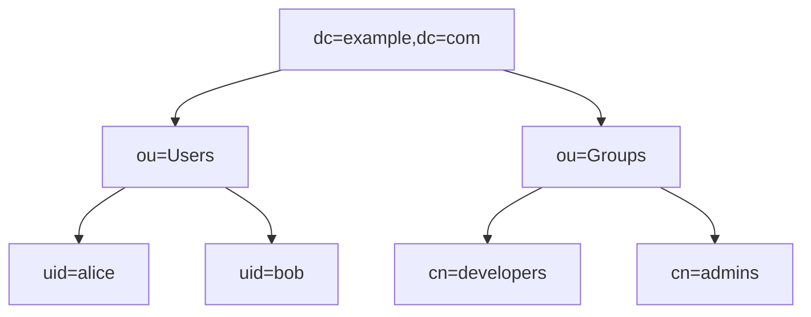

---
tags:
  - formation
  - linux
  - nginx
  - apache
  - dns
  - nfs
  - ldap
---

# Module 12 : Services Réseau

## Objectifs du Module

À l'issue de ce module, vous serez capable de :

- Configurer des serveurs web (Nginx, Apache)
- Mettre en place un serveur DNS (BIND)
- Configurer NFS et Samba pour le partage de fichiers
- Comprendre les bases de LDAP

**Durée :** 10 heures

**Niveau :** Ingénierie

---

## 1. Nginx

### Installation et Configuration de Base

```bash
# Installation
sudo dnf install nginx    # RHEL/Rocky
sudo apt install nginx    # Ubuntu

# Démarrer
sudo systemctl enable --now nginx

# Structure
/etc/nginx/nginx.conf           # Config principale
/etc/nginx/conf.d/              # Configs additionnelles
/var/www/html/                  # Document root
/var/log/nginx/                 # Logs
```

### Virtual Host

```nginx
# /etc/nginx/conf.d/example.com.conf
server {
    listen 80;
    server_name example.com www.example.com;
    root /var/www/example.com;
    index index.html index.php;

    access_log /var/log/nginx/example.com.access.log;
    error_log /var/log/nginx/example.com.error.log;

    location / {
        try_files $uri $uri/ =404;
    }

    location ~ \.php$ {
        fastcgi_pass unix:/run/php-fpm/www.sock;
        fastcgi_index index.php;
        include fastcgi_params;
        fastcgi_param SCRIPT_FILENAME $document_root$fastcgi_script_name;
    }
}
```

### Reverse Proxy

```nginx
server {
    listen 80;
    server_name api.example.com;

    location / {
        proxy_pass http://localhost:3000;
        proxy_set_header Host $host;
        proxy_set_header X-Real-IP $remote_addr;
        proxy_set_header X-Forwarded-For $proxy_add_x_forwarded_for;
        proxy_set_header X-Forwarded-Proto $scheme;
    }
}
```

### SSL/TLS avec Let's Encrypt

```bash
# Installer Certbot
sudo dnf install certbot python3-certbot-nginx

# Obtenir un certificat
sudo certbot --nginx -d example.com -d www.example.com

# Renouvellement automatique
sudo systemctl enable --now certbot-renew.timer
```

---

## 2. Apache (httpd)

### Configuration de Base

```bash
# Installation
sudo dnf install httpd

# Structure RHEL
/etc/httpd/conf/httpd.conf
/etc/httpd/conf.d/
/var/www/html/

# Structure Debian
/etc/apache2/apache2.conf
/etc/apache2/sites-available/
/etc/apache2/sites-enabled/
```

### Virtual Host

```apache
# /etc/httpd/conf.d/example.com.conf
<VirtualHost *:80>
    ServerName example.com
    ServerAlias www.example.com
    DocumentRoot /var/www/example.com

    <Directory /var/www/example.com>
        AllowOverride All
        Require all granted
    </Directory>

    ErrorLog /var/log/httpd/example.com-error.log
    CustomLog /var/log/httpd/example.com-access.log combined
</VirtualHost>
```

```bash
# Ubuntu : activer le site
sudo a2ensite example.com.conf
sudo a2enmod rewrite ssl
sudo systemctl reload apache2
```

---

## 3. DNS avec BIND

### Installation

```bash
sudo dnf install bind bind-utils

# Fichiers
/etc/named.conf                  # Config principale
/var/named/                      # Zones
```

### Configuration de Zone

```bash
# /etc/named.conf
zone "example.com" IN {
    type master;
    file "example.com.zone";
    allow-update { none; };
};

zone "1.168.192.in-addr.arpa" IN {
    type master;
    file "192.168.1.rev";
    allow-update { none; };
};
```

```bash
# /var/named/example.com.zone
$TTL 86400
@   IN  SOA     ns1.example.com. admin.example.com. (
                2024112901  ; Serial
                3600        ; Refresh
                1800        ; Retry
                604800      ; Expire
                86400 )     ; Minimum TTL

    IN  NS      ns1.example.com.
    IN  MX  10  mail.example.com.

ns1     IN  A   192.168.1.10
www     IN  A   192.168.1.20
mail    IN  A   192.168.1.30
```

```bash
# Vérifier et démarrer
sudo named-checkconf
sudo named-checkzone example.com /var/named/example.com.zone
sudo systemctl enable --now named
```

---

## 4. NFS - Network File System

### Serveur NFS

```bash
# Installation
sudo dnf install nfs-utils

# Exports
# /etc/exports
/data       192.168.1.0/24(rw,sync,no_subtree_check)
/home       192.168.1.0/24(rw,sync,no_root_squash)
/backup     192.168.1.100(ro,sync)

# Appliquer
sudo exportfs -ra
sudo exportfs -v

# Démarrer
sudo systemctl enable --now nfs-server

# Firewall
sudo firewall-cmd --add-service=nfs --permanent
sudo firewall-cmd --reload
```

### Client NFS

```bash
# Montage manuel
sudo mount -t nfs server:/data /mnt/data

# Montage automatique (fstab)
server:/data  /mnt/data  nfs  defaults,_netdev  0  0

# Autofs (montage à la demande)
# /etc/auto.master
/mnt    /etc/auto.nfs

# /etc/auto.nfs
data    -fstype=nfs,rw    server:/data
```

---

## 5. Samba - Partage Windows

### Configuration

```bash
# Installation
sudo dnf install samba samba-client

# /etc/samba/smb.conf
[global]
    workgroup = WORKGROUP
    security = user
    map to guest = bad user

[share]
    path = /srv/samba/share
    browseable = yes
    writable = yes
    valid users = @smbgroup
    create mask = 0664
    directory mask = 0775
```

```bash
# Utilisateur Samba
sudo smbpasswd -a alice

# Démarrer
sudo systemctl enable --now smb nmb

# Firewall
sudo firewall-cmd --add-service=samba --permanent
sudo firewall-cmd --reload

# Client
smbclient //server/share -U alice
```

---

## 6. LDAP (389 Directory Server)

### Concepts



### Installation 389DS

```bash
# Installation
sudo dnf install 389-ds-base

# Setup interactif
sudo dscreate interactive

# Ou avec fichier INF
sudo dscreate from-file /path/to/instance.inf
```

### Opérations de Base

```bash
# Recherche
ldapsearch -x -H ldap://localhost -b "dc=example,dc=com" "(uid=alice)"

# Ajouter un utilisateur (LDIF)
cat << 'EOF' > alice.ldif
dn: uid=alice,ou=Users,dc=example,dc=com
objectClass: inetOrgPerson
objectClass: posixAccount
uid: alice
cn: Alice Dupont
sn: Dupont
uidNumber: 10001
gidNumber: 10001
homeDirectory: /home/alice
loginShell: /bin/bash
userPassword: {SSHA}xxxxxx
EOF

ldapadd -x -D "cn=Directory Manager" -W -f alice.ldif
```

---

## 7. Exercice Pratique

!!! example "Exercice : Infrastructure Web Complète"

    1. Configurer Nginx avec 2 virtual hosts
    2. Activer HTTPS avec certificat auto-signé
    3. Configurer un reverse proxy vers une app Node.js
    4. Mettre en place un partage NFS entre 2 serveurs
    5. Tester les accès et vérifier les logs

    **Durée estimée :** 45 minutes

---

## Points Clés à Retenir

| Service | Port(s) | Usage |
|---------|---------|-------|
| Nginx/Apache | 80, 443 | Serveur web |
| BIND | 53 | DNS |
| NFS | 2049 | Partage fichiers Unix |
| Samba | 139, 445 | Partage fichiers Windows |
| LDAP | 389, 636 | Annuaire |

---

[:octicons-arrow-right-24: Module 13 : Performance & Troubleshooting](13-performance.md)

---

**Retour au :** [Programme de la Formation](index.md)

---

## Navigation

| | |
|:---|---:|
| [← Module 11 : Sécurité & Hardening](11-securite.md) | [Module 13 : Performance & Troubleshoo... →](13-performance.md) |

[Retour au Programme](index.md){ .md-button }
