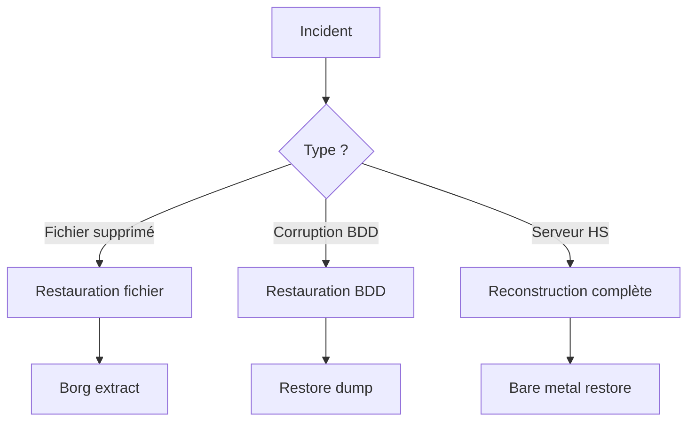

---
tags:
  - formation
  - linux
  - backup
  - disaster-recovery
  - rsync
  - borg
---

# Module 15 : Backup & Disaster Recovery

## Objectifs du Module

À l'issue de ce module, vous serez capable de :

- Concevoir une stratégie de backup (3-2-1)
- Utiliser rsync, tar et les outils de backup
- Implémenter des backups incrémentaux avec Borg
- Planifier et tester la restauration
- Mettre en place un plan de reprise d'activité

**Durée :** 8 heures

**Niveau :** Ingénierie

---

## 1. Stratégie de Backup

### Règle 3-2-1


| Principe | Description |
|----------|-------------|
| **3 copies** | Original + 2 sauvegardes |
| **2 supports** | Disque local + NAS/Cloud |
| **1 hors site** | Géographiquement distant |

### Types de Backup

| Type | Description | Avantages | Inconvénients |
|------|-------------|-----------|---------------|
| **Full** | Copie complète | Restauration simple | Lent, espace |
| **Incrémental** | Changements depuis dernier backup | Rapide | Restauration complexe |
| **Différentiel** | Changements depuis dernier full | Compromis | Espace croissant |

### RPO et RTO

- **RPO** (Recovery Point Objective) : Perte de données acceptable
- **RTO** (Recovery Time Objective) : Temps de restauration acceptable

```bash
# Exemple : RPO = 1 jour, RTO = 4 heures
# → Backup quotidien avec procédure de restauration testée
```

---

## 2. Outils de Base

### tar - Archivage

```bash
# Créer une archive compressée
tar -czvf backup.tar.gz /path/to/data

# Options courantes
tar -czvf backup_$(date +%Y%m%d).tar.gz \
    --exclude='*.log' \
    --exclude='cache/*' \
    /var/www

# Lister le contenu
tar -tzvf backup.tar.gz

# Extraire
tar -xzvf backup.tar.gz -C /restore/path

# Backup incrémental avec tar
# Premier backup (niveau 0)
tar -czvf full_backup.tar.gz \
    --listed-incremental=/var/backup/snapshot.snar \
    /data

# Backups suivants (incrémentaux)
tar -czvf incr_$(date +%Y%m%d).tar.gz \
    --listed-incremental=/var/backup/snapshot.snar \
    /data
```

### rsync - Synchronisation

```bash
# Syntaxe de base
rsync -avz source/ destination/

# Options importantes
# -a : archive (récursif + permissions + timestamps)
# -v : verbose
# -z : compression
# -P : progression + reprise
# --delete : supprimer les fichiers absents de la source

# Backup local
rsync -avz /home/ /backup/home/

# Backup distant via SSH
rsync -avz -e ssh /data/ user@server:/backup/data/

# Avec exclusions
rsync -avz \
    --exclude='*.tmp' \
    --exclude='cache/' \
    --exclude='.git/' \
    /var/www/ /backup/www/

# Dry-run (simulation)
rsync -avzn --delete /data/ /backup/data/

# Limiter la bande passante
rsync -avz --bwlimit=5000 /data/ user@server:/backup/
```

### Script de Backup rsync

```bash
#!/bin/bash
#
# backup-rsync.sh - Backup avec rsync et rotation
#

set -euo pipefail

# Configuration
SOURCE="/var/www"
DEST="/backup"
RETENTION=7
LOG="/var/log/backup.log"

# Timestamp
DATE=$(date +%Y%m%d_%H%M%S)
BACKUP_DIR="$DEST/backup_$DATE"
LATEST="$DEST/latest"

log() {
    echo "[$(date '+%Y-%m-%d %H:%M:%S')] $*" | tee -a "$LOG"
}

log "=== Début du backup ==="

# Créer le backup avec hard links (économie d'espace)
if [[ -L "$LATEST" ]]; then
    rsync -avz --delete \
        --link-dest="$LATEST" \
        "$SOURCE/" "$BACKUP_DIR/"
else
    rsync -avz --delete "$SOURCE/" "$BACKUP_DIR/"
fi

# Mettre à jour le lien "latest"
rm -f "$LATEST"
ln -s "$BACKUP_DIR" "$LATEST"

# Rotation : supprimer les vieux backups
find "$DEST" -maxdepth 1 -name "backup_*" -type d -mtime +$RETENTION -exec rm -rf {} \;

log "=== Backup terminé : $BACKUP_DIR ==="
```

---

## 3. Borg Backup

### Présentation

Borg est un outil de backup moderne avec :

- Déduplication (économie d'espace)
- Compression
- Chiffrement
- Vérification d'intégrité

### Installation et Initialisation

```bash
# Installation
sudo dnf install borgbackup    # RHEL/Rocky
sudo apt install borgbackup    # Ubuntu

# Initialiser un repository (chiffré)
borg init --encryption=repokey /backup/borg-repo

# Ou sur serveur distant
borg init --encryption=repokey ssh://user@server/backup/borg-repo

# Exporter la clé (IMPORTANT !)
borg key export /backup/borg-repo /secure/borg-key.txt
```

### Créer des Backups

```bash
# Backup simple
borg create /backup/borg-repo::backup-{now} /data

# Avec exclusions et compression
borg create \
    --compression lz4 \
    --exclude '*.log' \
    --exclude 'cache/*' \
    --stats \
    /backup/borg-repo::www-{now:%Y%m%d-%H%M} \
    /var/www

# Backup système complet
borg create \
    --compression zstd \
    --exclude '/dev/*' \
    --exclude '/proc/*' \
    --exclude '/sys/*' \
    --exclude '/tmp/*' \
    --exclude '/run/*' \
    --exclude '/mnt/*' \
    --exclude '/media/*' \
    --exclude '/lost+found' \
    /backup/borg-repo::system-{now:%Y%m%d} \
    /
```

### Gestion des Archives

```bash
# Lister les archives
borg list /backup/borg-repo

# Infos sur une archive
borg info /backup/borg-repo::www-20241129-1430

# Lister les fichiers d'une archive
borg list /backup/borg-repo::www-20241129-1430

# Statistiques du repo
borg info /backup/borg-repo

# Vérifier l'intégrité
borg check /backup/borg-repo
```

### Restauration

```bash
# Extraire une archive complète
cd /restore
borg extract /backup/borg-repo::www-20241129-1430

# Extraire des fichiers spécifiques
borg extract /backup/borg-repo::www-20241129-1430 var/www/html/index.html

# Monter une archive (lecture seule)
mkdir /mnt/backup
borg mount /backup/borg-repo::www-20241129-1430 /mnt/backup
# Explorer...
borg umount /mnt/backup
```

### Rotation Automatique (Pruning)

```bash
# Politique de rétention
borg prune \
    --keep-daily=7 \
    --keep-weekly=4 \
    --keep-monthly=6 \
    --keep-yearly=2 \
    /backup/borg-repo

# Avec stats
borg prune -v --list \
    --keep-daily=7 \
    --keep-weekly=4 \
    /backup/borg-repo
```

### Script Borg Complet

```bash
#!/bin/bash
#
# borg-backup.sh - Backup automatisé avec Borg
#

set -euo pipefail

# Configuration
export BORG_REPO="/backup/borg-repo"
export BORG_PASSPHRASE="votre_phrase_secrete"  # Ou via fichier
BACKUP_NAME="backup-{now:%Y%m%d-%H%M%S}"
LOG="/var/log/borg-backup.log"

log() {
    echo "[$(date '+%Y-%m-%d %H:%M:%S')] $*" | tee -a "$LOG"
}

# Vérification
borg check "$BORG_REPO" || {
    log "ERROR: Repository check failed"
    exit 1
}

log "Starting backup..."

# Créer le backup
borg create \
    --verbose \
    --stats \
    --compression zstd \
    --exclude-caches \
    --exclude '/home/*/.cache/*' \
    --exclude '/var/tmp/*' \
    --exclude '*.pyc' \
    "$BORG_REPO::$BACKUP_NAME" \
    /home \
    /var/www \
    /etc

log "Pruning old backups..."

# Rotation
borg prune \
    --list \
    --keep-daily=7 \
    --keep-weekly=4 \
    --keep-monthly=12 \
    "$BORG_REPO"

# Compacter (Borg 1.2+)
borg compact "$BORG_REPO"

log "Backup completed successfully"
```

---

## 4. Backup de Bases de Données

### MySQL/MariaDB

```bash
# Dump simple
mysqldump -u root -p database_name > backup.sql

# Toutes les bases
mysqldump -u root -p --all-databases > all_databases.sql

# Avec compression
mysqldump -u root -p database_name | gzip > backup_$(date +%Y%m%d).sql.gz

# Options recommandées
mysqldump \
    --single-transaction \
    --routines \
    --triggers \
    --quick \
    -u root -p database_name > backup.sql

# Restauration
mysql -u root -p database_name < backup.sql
```

### PostgreSQL

```bash
# Dump simple
pg_dump -U postgres database_name > backup.sql

# Format custom (compressé, restauration sélective)
pg_dump -U postgres -Fc database_name > backup.dump

# Toutes les bases
pg_dumpall -U postgres > all_databases.sql

# Restauration
psql -U postgres database_name < backup.sql
pg_restore -U postgres -d database_name backup.dump
```

### Script Backup BDD + Fichiers

```bash
#!/bin/bash
#
# full-backup.sh - Backup complet (BDD + fichiers)
#

set -euo pipefail

DATE=$(date +%Y%m%d)
BACKUP_DIR="/backup/$DATE"
mkdir -p "$BACKUP_DIR"

# 1. Backup MySQL
mysqldump --all-databases | gzip > "$BACKUP_DIR/mysql.sql.gz"

# 2. Backup PostgreSQL
sudo -u postgres pg_dumpall | gzip > "$BACKUP_DIR/postgres.sql.gz"

# 3. Backup fichiers
borg create \
    --compression zstd \
    /backup/borg-repo::full-$DATE \
    /var/www \
    /etc \
    /home

# 4. Sync vers serveur distant
rsync -avz "$BACKUP_DIR/" backup-server:/backup/$DATE/

echo "Full backup completed: $BACKUP_DIR"
```

---

## 5. Disaster Recovery

### Plan de Reprise



### Checklist DR

```markdown
## Checklist Disaster Recovery

### Documentation
- [ ] Inventaire des systèmes
- [ ] Schéma d'architecture
- [ ] Procédures de restauration
- [ ] Contacts d'urgence

### Tests réguliers
- [ ] Test de restauration mensuel
- [ ] Vérification intégrité backups
- [ ] Simulation de panne annuelle
- [ ] Mise à jour documentation

### Validation
- [ ] RPO respecté (< 24h)
- [ ] RTO respecté (< 4h)
- [ ] Backups hors site fonctionnels
- [ ] Clés de chiffrement sauvegardées
```

### Procédure de Restauration Système

```bash
#!/bin/bash
#
# disaster-recovery.sh - Restauration complète
#

# 1. Booter sur Live USB

# 2. Partitionner le disque
parted /dev/sda mklabel gpt
parted /dev/sda mkpart primary ext4 1MiB 512MiB    # /boot
parted /dev/sda mkpart primary ext4 512MiB 100%   # /

# 3. Formater
mkfs.ext4 /dev/sda1
mkfs.ext4 /dev/sda2

# 4. Monter
mount /dev/sda2 /mnt
mkdir /mnt/boot
mount /dev/sda1 /mnt/boot

# 5. Restaurer depuis Borg
export BORG_REPO="ssh://backup-server/backup/borg-repo"
cd /mnt
borg extract "$BORG_REPO::system-20241128"

# 6. Réinstaller GRUB
for dir in dev proc sys; do
    mount --bind /$dir /mnt/$dir
done
chroot /mnt grub-install /dev/sda
chroot /mnt grub-mkconfig -o /boot/grub/grub.cfg

# 7. Reboot
umount -R /mnt
reboot
```

---

## 6. Outils Complémentaires

### Restic (Alternative à Borg)

```bash
# Initialiser
restic init --repo /backup/restic-repo

# Backup
restic backup /data --repo /backup/restic-repo

# Snapshots
restic snapshots --repo /backup/restic-repo

# Restaurer
restic restore latest --target /restore --repo /backup/restic-repo
```

### Rclone (Cloud Sync)

```bash
# Configurer
rclone config

# Sync vers S3
rclone sync /backup s3:my-bucket/backup

# Sync vers Google Drive
rclone sync /backup gdrive:backup

# Avec Borg
borg create /backup/borg-repo::backup-$(date +%Y%m%d) /data
rclone sync /backup/borg-repo s3:my-bucket/borg-repo
```

---

## 7. Exercice Pratique

!!! example "Exercice : Stratégie de Backup Complète"

    1. Initialiser un repository Borg chiffré
    2. Créer un script de backup pour /var/www et MySQL
    3. Configurer un systemd timer pour l'exécution quotidienne
    4. Implémenter la rotation (7 daily, 4 weekly, 12 monthly)
    5. Tester la restauration d'un fichier spécifique
    6. Documenter la procédure de disaster recovery

    **Durée estimée :** 45 minutes

---

## Points Clés à Retenir

| Concept | Outils |
|---------|--------|
| Règle 3-2-1 | 3 copies, 2 supports, 1 hors site |
| Archivage | `tar`, `gzip` |
| Synchronisation | `rsync` |
| Backup moderne | `borg`, `restic` |
| BDD | `mysqldump`, `pg_dump` |
| Cloud | `rclone` |

---

## Félicitations !

Vous avez terminé le **Niveau 3 - Ingénierie Système** !

Vous maîtrisez maintenant :

- La sécurisation et le hardening
- Les services réseau (web, DNS, NFS)
- L'analyse de performance
- Le scripting avancé
- Les stratégies de backup

**Prochaine étape :** Le Niveau 4 - Expert !

[:octicons-arrow-right-24: Module 16 : Haute Disponibilité](16-haute-disponibilite.md)

---

**Retour au :** [Programme de la Formation](index.md)
