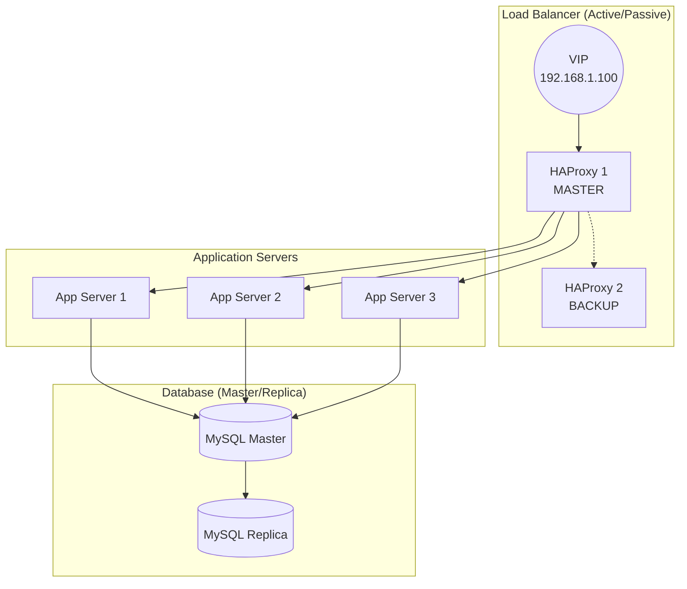
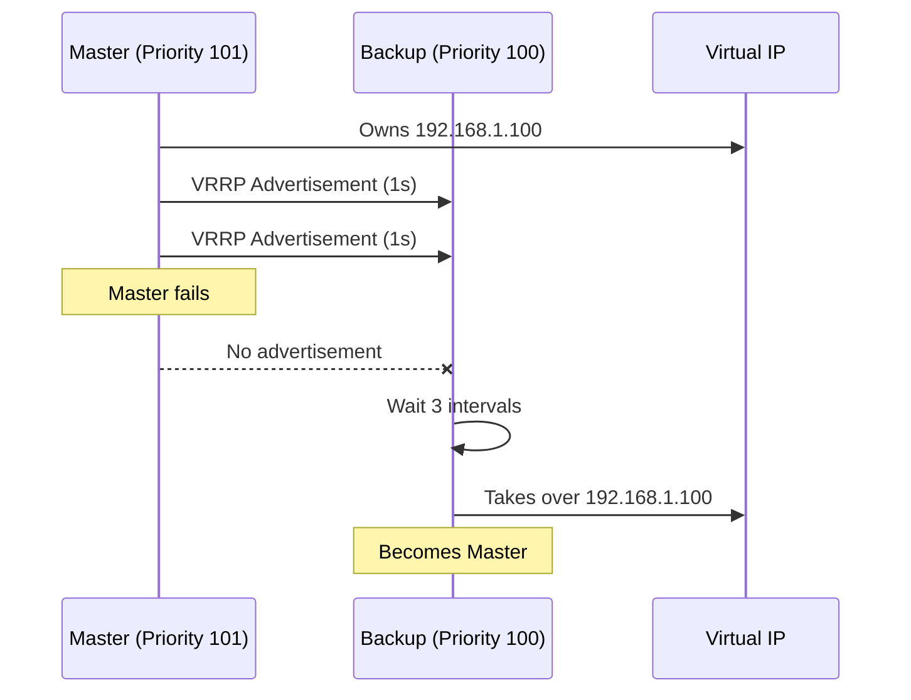
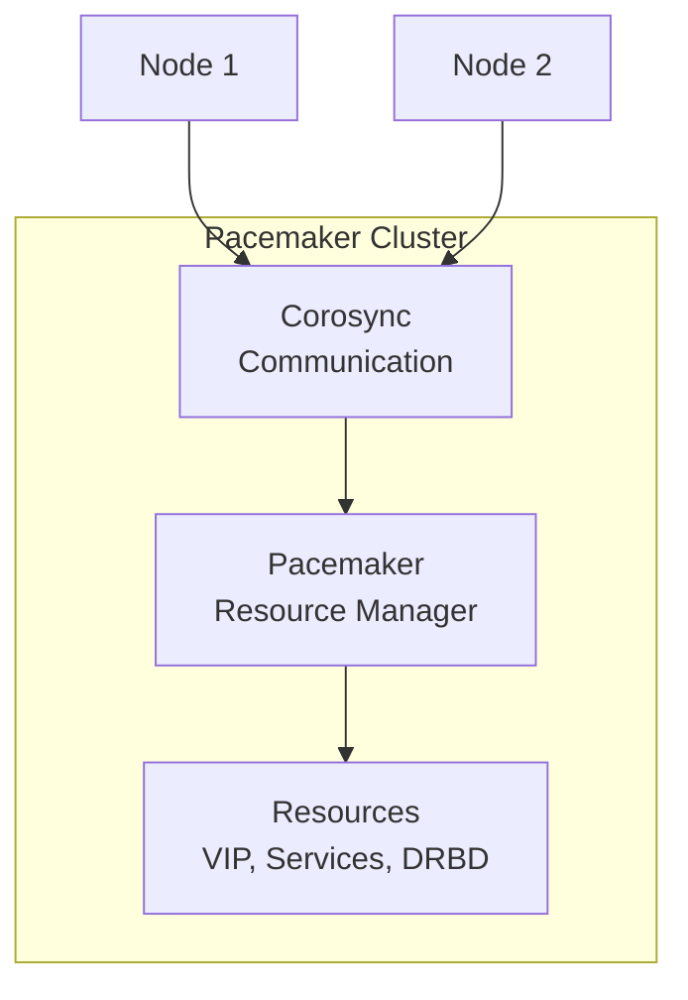

---
tags:
  - formation
  - linux
  - high-availability
  - clustering
  - haproxy
  - keepalived
  - pacemaker
---

# Module 16 : Haute Disponibilité

## Objectifs du Module

À l'issue de ce module, vous serez capable de :

- Concevoir une architecture haute disponibilité
- Configurer un load balancer avec HAProxy
- Mettre en place Keepalived pour la bascule IP
- Comprendre les clusters Pacemaker/Corosync
- Implémenter la réplication de données

**Durée :** 10 heures

**Niveau :** Expert

---

## 1. Concepts de Haute Disponibilité

### Définitions

| Terme | Description |
|-------|-------------|
| **HA** | High Availability - Minimiser les interruptions |
| **SLA** | Service Level Agreement - Engagement de disponibilité |
| **Uptime** | Temps de fonctionnement |
| **Failover** | Basculement automatique |
| **Failback** | Retour sur le nœud principal |

### Niveaux de Disponibilité

| Disponibilité | Downtime/an | Downtime/mois |
|---------------|-------------|---------------|
| 99% | 3.65 jours | 7.2 heures |
| 99.9% | 8.76 heures | 43.8 minutes |
| 99.99% | 52.56 minutes | 4.38 minutes |
| 99.999% | 5.26 minutes | 26.3 secondes |

### Architecture HA



---

## 2. HAProxy - Load Balancer

### Installation

```bash
# RHEL/Rocky
sudo dnf install haproxy

# Ubuntu
sudo apt install haproxy

# Démarrer
sudo systemctl enable --now haproxy
```

### Configuration de Base

```bash
# /etc/haproxy/haproxy.cfg

global
    log /dev/log local0
    chroot /var/lib/haproxy
    stats socket /run/haproxy/admin.sock mode 660 level admin
    stats timeout 30s
    user haproxy
    group haproxy
    daemon

    # Tuning
    maxconn 4096
    tune.ssl.default-dh-param 2048

defaults
    log     global
    mode    http
    option  httplog
    option  dontlognull
    option  forwardfor
    option  http-server-close
    timeout connect 5000ms
    timeout client  50000ms
    timeout server  50000ms
    errorfile 400 /etc/haproxy/errors/400.http
    errorfile 503 /etc/haproxy/errors/503.http

# Stats page
listen stats
    bind *:8404
    stats enable
    stats uri /stats
    stats refresh 10s
    stats admin if LOCALHOST

# Frontend HTTP
frontend http_front
    bind *:80
    bind *:443 ssl crt /etc/haproxy/certs/site.pem
    redirect scheme https code 301 if !{ ssl_fc }
    default_backend http_back

# Backend Application
backend http_back
    balance roundrobin
    option httpchk GET /health
    http-check expect status 200

    server app1 192.168.1.11:8080 check
    server app2 192.168.1.12:8080 check
    server app3 192.168.1.13:8080 check backup
```

### Algorithmes de Load Balancing

```bash
# Round Robin (défaut)
balance roundrobin

# Least Connections
balance leastconn

# Source IP Hash (sticky)
balance source

# URI Hash
balance uri

# Weighted
server app1 192.168.1.11:8080 weight 3 check
server app2 192.168.1.12:8080 weight 2 check
server app3 192.168.1.13:8080 weight 1 check
```

### Health Checks Avancés

```bash
backend http_back
    balance roundrobin

    # HTTP check
    option httpchk GET /health HTTP/1.1\r\nHost:\ localhost
    http-check expect status 200

    # TCP check (pour non-HTTP)
    # option tcp-check

    # Paramètres de check
    server app1 192.168.1.11:8080 check inter 3000 fall 3 rise 2
    # inter : intervalle entre checks (ms)
    # fall  : nombre d'échecs avant DOWN
    # rise  : nombre de succès avant UP
```

### ACLs et Routing

```bash
frontend http_front
    bind *:80

    # ACLs
    acl is_api path_beg /api
    acl is_static path_end .jpg .png .css .js
    acl is_admin path_beg /admin
    acl is_internal src 192.168.1.0/24

    # Routing basé sur ACLs
    use_backend api_back if is_api
    use_backend static_back if is_static
    use_backend admin_back if is_admin is_internal

    default_backend http_back

backend api_back
    balance leastconn
    server api1 192.168.1.21:3000 check
    server api2 192.168.1.22:3000 check

backend static_back
    balance roundrobin
    server static1 192.168.1.31:80 check
```

---

## 3. Keepalived - IP Failover

### Concept VRRP



### Installation

```bash
sudo dnf install keepalived    # RHEL/Rocky
sudo apt install keepalived    # Ubuntu
```

### Configuration Master

```bash
# /etc/keepalived/keepalived.conf (Node 1 - Master)

global_defs {
    router_id LB1
    script_user root
    enable_script_security
}

vrrp_script check_haproxy {
    script "/usr/bin/killall -0 haproxy"
    interval 2
    weight 2
}

vrrp_instance VI_1 {
    state MASTER
    interface eth0
    virtual_router_id 51
    priority 101
    advert_int 1

    authentication {
        auth_type PASS
        auth_pass secret123
    }

    virtual_ipaddress {
        192.168.1.100/24
    }

    track_script {
        check_haproxy
    }

    notify_master "/etc/keepalived/notify.sh master"
    notify_backup "/etc/keepalived/notify.sh backup"
    notify_fault  "/etc/keepalived/notify.sh fault"
}
```

### Configuration Backup

```bash
# /etc/keepalived/keepalived.conf (Node 2 - Backup)

global_defs {
    router_id LB2
    script_user root
    enable_script_security
}

vrrp_script check_haproxy {
    script "/usr/bin/killall -0 haproxy"
    interval 2
    weight 2
}

vrrp_instance VI_1 {
    state BACKUP
    interface eth0
    virtual_router_id 51
    priority 100
    advert_int 1

    authentication {
        auth_type PASS
        auth_pass secret123
    }

    virtual_ipaddress {
        192.168.1.100/24
    }

    track_script {
        check_haproxy
    }
}
```

### Script de Notification

```bash
#!/bin/bash
# /etc/keepalived/notify.sh

TYPE=$1
NAME=$2
STATE=$3

LOG="/var/log/keepalived-notify.log"

log() {
    echo "[$(date '+%Y-%m-%d %H:%M:%S')] $*" >> "$LOG"
}

case $STATE in
    "master")
        log "Becoming MASTER"
        # Démarrer HAProxy si arrêté
        systemctl start haproxy
        # Notification
        # mail -s "Failover: $(hostname) is now MASTER" admin@example.com
        ;;
    "backup")
        log "Becoming BACKUP"
        ;;
    "fault")
        log "Entering FAULT state"
        ;;
esac
```

---

## 4. Pacemaker & Corosync

### Architecture Cluster



### Installation

```bash
# RHEL/Rocky
sudo dnf install pacemaker corosync pcs

# Démarrer pcsd
sudo systemctl enable --now pcsd

# Mot de passe utilisateur hacluster
sudo passwd hacluster
```

### Création du Cluster

```bash
# Sur un nœud
sudo pcs host auth node1 node2
# Entrer le mot de passe hacluster

# Créer le cluster
sudo pcs cluster setup mycluster node1 node2

# Démarrer
sudo pcs cluster start --all
sudo pcs cluster enable --all

# Status
sudo pcs status
```

### Configuration des Ressources

```bash
# Désactiver STONITH pour les tests (pas en prod!)
sudo pcs property set stonith-enabled=false

# Créer une VIP
sudo pcs resource create vip ocf:heartbeat:IPaddr2 \
    ip=192.168.1.100 \
    cidr_netmask=24 \
    op monitor interval=30s

# Créer une ressource Apache
sudo pcs resource create webserver ocf:heartbeat:apache \
    configfile=/etc/httpd/conf/httpd.conf \
    statusurl="http://127.0.0.1/server-status" \
    op monitor interval=30s

# Colocation : VIP et webserver ensemble
sudo pcs constraint colocation add webserver with vip INFINITY

# Ordre : VIP avant webserver
sudo pcs constraint order vip then webserver
```

### Commandes Utiles

```bash
# Status
sudo pcs status
sudo pcs cluster status
sudo crm_mon -1

# Ressources
sudo pcs resource show
sudo pcs resource disable webserver
sudo pcs resource enable webserver
sudo pcs resource move webserver node2
sudo pcs resource clear webserver

# Maintenance
sudo pcs node standby node1
sudo pcs node unstandby node1

# Logs
sudo pcs cluster cib
journalctl -u pacemaker
journalctl -u corosync
```

---

## 5. Réplication de Données

### MySQL Réplication Master-Slave

```bash
# Sur le Master (/etc/my.cnf.d/replication.cnf)
[mysqld]
server-id = 1
log_bin = mysql-bin
binlog_format = ROW
binlog_do_db = myapp

# Créer l'utilisateur de réplication
CREATE USER 'repl'@'%' IDENTIFIED BY 'password';
GRANT REPLICATION SLAVE ON *.* TO 'repl'@'%';
FLUSH PRIVILEGES;

# Position actuelle
SHOW MASTER STATUS;
# +------------------+----------+
# | File             | Position |
# +------------------+----------+
# | mysql-bin.000001 |      154 |
# +------------------+----------+
```

```bash
# Sur le Slave
[mysqld]
server-id = 2
relay_log = relay-bin
read_only = ON

# Configurer la réplication
CHANGE MASTER TO
    MASTER_HOST='192.168.1.10',
    MASTER_USER='repl',
    MASTER_PASSWORD='password',
    MASTER_LOG_FILE='mysql-bin.000001',
    MASTER_LOG_POS=154;

START SLAVE;
SHOW SLAVE STATUS\G
```

### PostgreSQL Streaming Replication

```bash
# Primary (/var/lib/pgsql/data/postgresql.conf)
wal_level = replica
max_wal_senders = 3
wal_keep_size = 256MB

# /var/lib/pgsql/data/pg_hba.conf
host replication repl 192.168.1.0/24 md5

# Créer l'utilisateur
CREATE USER repl WITH REPLICATION PASSWORD 'password';
```

```bash
# Standby - Initialiser depuis le primary
pg_basebackup -h 192.168.1.10 -U repl -D /var/lib/pgsql/data -P -R

# Le fichier standby.signal est créé automatiquement
# postgresql.auto.conf contient :
# primary_conninfo = 'host=192.168.1.10 user=repl password=password'
```

### GlusterFS - Stockage Distribué

```bash
# Installation sur tous les nœuds
sudo dnf install glusterfs-server

# Démarrer
sudo systemctl enable --now glusterd

# Créer le pool
sudo gluster peer probe node2
sudo gluster peer probe node3

# Status
sudo gluster peer status

# Créer un volume répliqué
sudo gluster volume create gv0 replica 3 \
    node1:/data/brick1 \
    node2:/data/brick1 \
    node3:/data/brick1

# Démarrer
sudo gluster volume start gv0

# Monter côté client
sudo mount -t glusterfs node1:/gv0 /mnt/gluster
```

---

## 6. Exercice Pratique

!!! example "Exercice : Infrastructure HA Complète"

    1. Déployer 2 serveurs HAProxy en Active/Passive
    2. Configurer Keepalived pour la VIP
    3. Ajouter 2 backends web avec health checks
    4. Tester le failover en arrêtant le master
    5. Vérifier que le trafic bascule automatiquement
    6. Documenter les temps de basculement

    **Architecture cible :**
    ```
    Client → VIP (192.168.1.100) → HAProxy → App Servers
    ```

    **Durée estimée :** 60 minutes

---

## Points Clés à Retenir

| Composant | Rôle | Outil |
|-----------|------|-------|
| Load Balancing | Distribution trafic | HAProxy, Nginx |
| IP Failover | VIP flottante | Keepalived (VRRP) |
| Cluster | Gestion ressources | Pacemaker/Corosync |
| Réplication DB | Données synchronisées | MySQL/PG Replication |
| Stockage | Données distribuées | GlusterFS, DRBD |

---

[:octicons-arrow-right-24: Module 17 : Conteneurisation](17-conteneurs.md)

---

**Retour au :** [Programme de la Formation](index.md)

---

## Navigation

| | |
|:---|---:|
| [← Module 15 : Backup & Disaster Recovery](15-backup.md) | [Module 17 : Conteneurisation →](17-conteneurs.md) |

[Retour au Programme](index.md){ .md-button }
