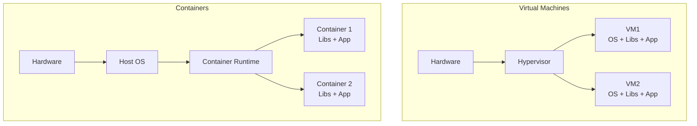

---
tags:
  - formation
  - linux
  - docker
  - podman
  - containers
  - devops
---

# Module 17 : Conteneurisation

## Objectifs du Module

À l'issue de ce module, vous serez capable de :

- Comprendre les concepts de conteneurisation
- Utiliser Docker et Podman efficacement
- Créer et optimiser des images
- Gérer les volumes et le réseau
- Orchestrer avec Docker Compose

**Durée :** 10 heures

**Niveau :** Expert

---

## 1. Concepts Fondamentaux

### Conteneurs vs VMs



| Aspect | VM | Conteneur |
|--------|-----|-----------|
| Isolation | Complète (hyperviseur) | Processus (namespaces) |
| Taille | GB | MB |
| Démarrage | Minutes | Secondes |
| Ressources | Élevées | Faibles |
| Portabilité | Moyenne | Excellente |

### Technologies Linux

```bash
# Namespaces - Isolation
# - PID  : Processus
# - NET  : Réseau
# - MNT  : Montages
# - UTS  : Hostname
# - IPC  : Communication inter-processus
# - USER : Utilisateurs

# Cgroups - Limitation des ressources
# - CPU
# - Mémoire
# - I/O
# - Réseau

# Union FS - Système de fichiers en couches
# - OverlayFS (default)
# - AUFS, Btrfs, ZFS
```

---

## 2. Docker

### Installation

```bash
# RHEL/Rocky
sudo dnf config-manager --add-repo https://download.docker.com/linux/centos/docker-ce.repo
sudo dnf install docker-ce docker-ce-cli containerd.io

# Ubuntu
sudo apt install docker.io

# Démarrer
sudo systemctl enable --now docker

# Ajouter l'utilisateur au groupe docker
sudo usermod -aG docker $USER
newgrp docker
```

### Commandes Essentielles

```bash
# Images
docker pull nginx:alpine
docker images
docker rmi nginx:alpine

# Conteneurs
docker run -d --name web -p 8080:80 nginx:alpine
docker ps
docker ps -a
docker stop web
docker start web
docker rm web

# Logs et debug
docker logs -f web
docker exec -it web /bin/sh
docker inspect web

# Nettoyage
docker system prune -a
docker volume prune
docker network prune
```

### Options de Run

```bash
# Mapping de ports
docker run -p 8080:80 nginx              # host:container

# Variables d'environnement
docker run -e MYSQL_ROOT_PASSWORD=secret mysql

# Volumes
docker run -v /host/path:/container/path nginx
docker run -v myvolume:/data nginx

# Réseau
docker run --network mynetwork nginx

# Ressources
docker run --memory=512m --cpus=1 nginx

# Restart policy
docker run --restart=always nginx

# Exemple complet
docker run -d \
    --name webapp \
    -p 8080:80 \
    -v ./html:/usr/share/nginx/html:ro \
    -e NGINX_HOST=localhost \
    --memory=256m \
    --cpus=0.5 \
    --restart=unless-stopped \
    nginx:alpine
```

---

## 3. Dockerfile

### Structure

```dockerfile
# syntax=docker/dockerfile:1

# Image de base
FROM python:3.11-slim

# Métadonnées
LABEL maintainer="admin@example.com"
LABEL version="1.0"

# Variables de build
ARG APP_VERSION=1.0.0

# Variables d'environnement
ENV PYTHONDONTWRITEBYTECODE=1 \
    PYTHONUNBUFFERED=1 \
    APP_HOME=/app

# Répertoire de travail
WORKDIR $APP_HOME

# Copier les dépendances d'abord (cache)
COPY requirements.txt .

# Installer les dépendances
RUN pip install --no-cache-dir -r requirements.txt

# Copier le code
COPY . .

# Créer un utilisateur non-root
RUN useradd -r -s /bin/false appuser && \
    chown -R appuser:appuser $APP_HOME

USER appuser

# Port exposé
EXPOSE 8000

# Health check
HEALTHCHECK --interval=30s --timeout=3s --start-period=5s --retries=3 \
    CMD curl -f http://localhost:8000/health || exit 1

# Commande par défaut
CMD ["python", "app.py"]
```

### Multi-stage Build

```dockerfile
# syntax=docker/dockerfile:1

# Stage 1: Build
FROM golang:1.21-alpine AS builder

WORKDIR /build
COPY go.mod go.sum ./
RUN go mod download

COPY . .
RUN CGO_ENABLED=0 GOOS=linux go build -o app .

# Stage 2: Runtime
FROM alpine:3.18

RUN apk --no-cache add ca-certificates
WORKDIR /app

# Copier uniquement le binaire
COPY --from=builder /build/app .

# Utilisateur non-root
RUN adduser -D -H appuser
USER appuser

EXPOSE 8080
CMD ["./app"]
```

### Bonnes Pratiques

```dockerfile
# ❌ Mauvais
FROM ubuntu:latest
RUN apt-get update
RUN apt-get install -y python3
RUN apt-get install -y pip
COPY . /app

# ✅ Bon
FROM python:3.11-slim

# Combiner les RUN pour réduire les layers
RUN apt-get update && \
    apt-get install -y --no-install-recommends \
        curl \
        ca-certificates && \
    rm -rf /var/lib/apt/lists/*

# Copier requirements en premier (cache Docker)
COPY requirements.txt .
RUN pip install --no-cache-dir -r requirements.txt

# Copier le code en dernier
COPY . /app
```

### Build et Push

```bash
# Build
docker build -t myapp:1.0 .
docker build -t myapp:1.0 -f Dockerfile.prod .

# Tag
docker tag myapp:1.0 registry.example.com/myapp:1.0

# Push
docker login registry.example.com
docker push registry.example.com/myapp:1.0

# Build multi-architecture
docker buildx create --use
docker buildx build \
    --platform linux/amd64,linux/arm64 \
    -t myapp:1.0 \
    --push .
```

---

## 4. Volumes et Persistance

### Types de Volumes

```bash
# Named volumes (recommandé)
docker volume create mydata
docker run -v mydata:/data nginx
docker volume ls
docker volume inspect mydata

# Bind mounts
docker run -v /host/path:/container/path nginx
docker run -v $(pwd)/config:/etc/nginx/conf.d:ro nginx

# tmpfs (en mémoire)
docker run --tmpfs /tmp nginx
```

### Backup et Restore

```bash
# Backup d'un volume
docker run --rm \
    -v mydata:/source:ro \
    -v $(pwd):/backup \
    alpine tar czf /backup/mydata.tar.gz -C /source .

# Restore
docker run --rm \
    -v mydata:/dest \
    -v $(pwd):/backup:ro \
    alpine tar xzf /backup/mydata.tar.gz -C /dest
```

---

## 5. Réseau Docker

### Types de Réseaux

```bash
# Bridge (défaut)
docker network create mynetwork
docker run --network mynetwork --name app1 nginx
docker run --network mynetwork --name app2 nginx
# app1 peut ping app2 par nom

# Host
docker run --network host nginx

# None
docker run --network none nginx

# Overlay (Swarm)
docker network create --driver overlay myoverlay
```

### Configuration Réseau

```bash
# Créer un réseau personnalisé
docker network create \
    --driver bridge \
    --subnet 172.20.0.0/16 \
    --ip-range 172.20.240.0/20 \
    --gateway 172.20.0.1 \
    mynetwork

# Connecter un conteneur
docker network connect mynetwork mycontainer

# Inspecter
docker network inspect mynetwork

# DNS personnalisé
docker run --dns 8.8.8.8 --dns-search example.com nginx
```

---

## 6. Docker Compose

### Fichier docker-compose.yml

```yaml
# docker-compose.yml
version: '3.8'

services:
  web:
    build:
      context: ./web
      dockerfile: Dockerfile
    image: myapp-web:latest
    ports:
      - "8080:80"
    environment:
      - DB_HOST=db
      - DB_NAME=myapp
    volumes:
      - ./web/static:/var/www/static:ro
    depends_on:
      db:
        condition: service_healthy
    networks:
      - frontend
      - backend
    restart: unless-stopped
    healthcheck:
      test: ["CMD", "curl", "-f", "http://localhost/health"]
      interval: 30s
      timeout: 10s
      retries: 3

  api:
    build: ./api
    ports:
      - "3000:3000"
    environment:
      - NODE_ENV=production
      - DB_URL=postgres://user:pass@db:5432/myapp
    depends_on:
      - db
      - redis
    networks:
      - backend

  db:
    image: postgres:15-alpine
    volumes:
      - db_data:/var/lib/postgresql/data
      - ./init.sql:/docker-entrypoint-initdb.d/init.sql:ro
    environment:
      POSTGRES_USER: user
      POSTGRES_PASSWORD: pass
      POSTGRES_DB: myapp
    networks:
      - backend
    healthcheck:
      test: ["CMD-SHELL", "pg_isready -U user -d myapp"]
      interval: 10s
      timeout: 5s
      retries: 5

  redis:
    image: redis:7-alpine
    command: redis-server --appendonly yes
    volumes:
      - redis_data:/data
    networks:
      - backend

  nginx:
    image: nginx:alpine
    ports:
      - "80:80"
      - "443:443"
    volumes:
      - ./nginx/nginx.conf:/etc/nginx/nginx.conf:ro
      - ./nginx/ssl:/etc/nginx/ssl:ro
    depends_on:
      - web
      - api
    networks:
      - frontend

networks:
  frontend:
  backend:

volumes:
  db_data:
  redis_data:
```

### Commandes Compose

```bash
# Démarrer
docker compose up -d

# Voir les logs
docker compose logs -f
docker compose logs -f web

# Status
docker compose ps

# Arrêter
docker compose stop
docker compose down
docker compose down -v  # Supprime aussi les volumes

# Rebuild
docker compose build
docker compose up -d --build

# Scaling
docker compose up -d --scale api=3

# Exec
docker compose exec web /bin/sh
```

---

## 7. Podman (Alternative Rootless)

### Installation

```bash
# RHEL/Rocky
sudo dnf install podman podman-compose

# Ubuntu
sudo apt install podman
```

### Commandes (compatibles Docker)

```bash
# Alias pour compatibilité
alias docker=podman

# Commandes identiques
podman pull nginx:alpine
podman run -d --name web -p 8080:80 nginx:alpine
podman ps
podman logs web

# Mode rootless (sans sudo)
podman run --rm nginx:alpine

# Pods (groupe de conteneurs)
podman pod create --name mypod -p 8080:80
podman run -d --pod mypod nginx
podman run -d --pod mypod redis

# Générer un fichier Kubernetes
podman generate kube mypod > pod.yaml
```

### Différences Podman vs Docker

| Aspect | Docker | Podman |
|--------|--------|--------|
| Daemon | Oui (dockerd) | Non (daemonless) |
| Root | Par défaut | Rootless natif |
| Pods | Non | Oui |
| Systemd | Limité | Intégration native |
| Kubernetes | Non | Génération YAML |

### Intégration Systemd

```bash
# Générer un service systemd
podman generate systemd --name web --files

# Installer en user service
mkdir -p ~/.config/systemd/user
mv container-web.service ~/.config/systemd/user/

# Activer
systemctl --user enable --now container-web
systemctl --user status container-web

# Pour démarrage au boot (sans login)
loginctl enable-linger $USER
```

---

## 8. Sécurité des Conteneurs

### Bonnes Pratiques

```dockerfile
# Utilisateur non-root
FROM alpine:3.18
RUN adduser -D -H appuser
USER appuser

# Image minimale
FROM scratch
COPY app /app
CMD ["/app"]

# Pas de secrets dans l'image
# ❌ ENV API_KEY=secret
# ✅ Runtime: docker run -e API_KEY
```

### Scan de Sécurité

```bash
# Trivy
trivy image nginx:alpine
trivy image --severity HIGH,CRITICAL myapp:latest

# Docker Scout
docker scout cves myapp:latest

# Snyk
snyk container test myapp:latest
```

### Runtime Security

```bash
# Read-only filesystem
docker run --read-only nginx

# Capabilities
docker run --cap-drop ALL --cap-add NET_BIND_SERVICE nginx

# Seccomp
docker run --security-opt seccomp=profile.json nginx

# AppArmor
docker run --security-opt apparmor=docker-default nginx

# No new privileges
docker run --security-opt no-new-privileges nginx
```

---

## 9. Exercice Pratique

!!! example "Exercice : Application Multi-conteneurs"

    Créer une stack complète avec :

    1. Frontend React (Nginx)
    2. Backend API (Python/Node)
    3. Base de données PostgreSQL
    4. Cache Redis
    5. Reverse proxy Nginx

    **Exigences :**
    - Dockerfile multi-stage pour le frontend
    - Health checks sur tous les services
    - Volumes persistants pour la BDD
    - Réseau isolé backend/frontend
    - Variables d'environnement via .env

    **Durée estimée :** 60 minutes

---

## Points Clés à Retenir

| Concept | Commande/Fichier |
|---------|------------------|
| Run | `docker run -d -p 80:80 nginx` |
| Build | `docker build -t app .` |
| Compose | `docker compose up -d` |
| Volumes | `-v data:/app/data` |
| Network | `--network mynet` |
| Logs | `docker logs -f container` |
| Exec | `docker exec -it container sh` |

---

[:octicons-arrow-right-24: Module 18 : Kubernetes](18-kubernetes.md)

---

**Retour au :** [Programme de la Formation](index.md)
