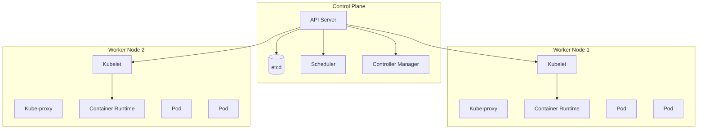

---
tags:
  - formation
  - linux
  - kubernetes
  - k8s
  - orchestration
  - cloud-native
---

# Module 18 : Kubernetes

## Objectifs du Module

À l'issue de ce module, vous serez capable de :

- Comprendre l'architecture Kubernetes
- Déployer et gérer des applications
- Configurer les services et l'ingress
- Gérer la persistance des données
- Implémenter les bonnes pratiques de production

**Durée :** 12 heures

**Niveau :** Expert

---

## 1. Architecture Kubernetes

### Composants



| Composant | Rôle |
|-----------|------|
| **API Server** | Point d'entrée de toutes les requêtes |
| **etcd** | Base de données distribuée (état du cluster) |
| **Scheduler** | Placement des pods sur les nodes |
| **Controller Manager** | Boucles de contrôle (ReplicaSet, Deployment...) |
| **Kubelet** | Agent sur chaque node |
| **Kube-proxy** | Gestion réseau des services |

### Installation (Minikube pour dev)

```bash
# Minikube
curl -LO https://storage.googleapis.com/minikube/releases/latest/minikube-linux-amd64
sudo install minikube-linux-amd64 /usr/local/bin/minikube

# Démarrer
minikube start --driver=docker --cpus=4 --memory=8192

# kubectl
curl -LO "https://dl.k8s.io/release/$(curl -L -s https://dl.k8s.io/release/stable.txt)/bin/linux/amd64/kubectl"
sudo install kubectl /usr/local/bin/

# Vérifier
kubectl cluster-info
kubectl get nodes
```

---

## 2. Pods

### Définition

```yaml
# pod.yaml
apiVersion: v1
kind: Pod
metadata:
  name: nginx-pod
  labels:
    app: nginx
    environment: dev
spec:
  containers:
    - name: nginx
      image: nginx:alpine
      ports:
        - containerPort: 80
      resources:
        requests:
          memory: "64Mi"
          cpu: "100m"
        limits:
          memory: "128Mi"
          cpu: "200m"
      livenessProbe:
        httpGet:
          path: /
          port: 80
        initialDelaySeconds: 5
        periodSeconds: 10
      readinessProbe:
        httpGet:
          path: /
          port: 80
        initialDelaySeconds: 3
        periodSeconds: 5
```

### Commandes Pod

```bash
# Créer
kubectl apply -f pod.yaml

# Lister
kubectl get pods
kubectl get pods -o wide
kubectl get pods -l app=nginx

# Détails
kubectl describe pod nginx-pod

# Logs
kubectl logs nginx-pod
kubectl logs -f nginx-pod
kubectl logs nginx-pod -c container-name  # Multi-container

# Exec
kubectl exec -it nginx-pod -- /bin/sh

# Port-forward
kubectl port-forward nginx-pod 8080:80

# Supprimer
kubectl delete pod nginx-pod
```

---

## 3. Deployments

### Définition

```yaml
# deployment.yaml
apiVersion: apps/v1
kind: Deployment
metadata:
  name: webapp
  labels:
    app: webapp
spec:
  replicas: 3
  selector:
    matchLabels:
      app: webapp
  strategy:
    type: RollingUpdate
    rollingUpdate:
      maxSurge: 1
      maxUnavailable: 0
  template:
    metadata:
      labels:
        app: webapp
        version: v1
    spec:
      containers:
        - name: webapp
          image: myapp:1.0.0
          ports:
            - containerPort: 8080
          env:
            - name: DB_HOST
              value: "postgres-service"
            - name: DB_PASSWORD
              valueFrom:
                secretKeyRef:
                  name: db-secret
                  key: password
          resources:
            requests:
              memory: "128Mi"
              cpu: "100m"
            limits:
              memory: "256Mi"
              cpu: "500m"
          livenessProbe:
            httpGet:
              path: /health
              port: 8080
            initialDelaySeconds: 10
            periodSeconds: 15
          readinessProbe:
            httpGet:
              path: /ready
              port: 8080
            initialDelaySeconds: 5
            periodSeconds: 5
```

### Commandes Deployment

```bash
# Créer/Mettre à jour
kubectl apply -f deployment.yaml

# Lister
kubectl get deployments
kubectl get deploy,rs,pods

# Mise à jour de l'image
kubectl set image deployment/webapp webapp=myapp:2.0.0

# Historique
kubectl rollout history deployment/webapp

# Rollback
kubectl rollout undo deployment/webapp
kubectl rollout undo deployment/webapp --to-revision=2

# Scaling
kubectl scale deployment/webapp --replicas=5

# Autoscaling
kubectl autoscale deployment/webapp --min=3 --max=10 --cpu-percent=80
```

---

## 4. Services

### Types de Services

```yaml
# ClusterIP (interne)
apiVersion: v1
kind: Service
metadata:
  name: webapp-service
spec:
  type: ClusterIP
  selector:
    app: webapp
  ports:
    - port: 80
      targetPort: 8080
---
# NodePort (externe via port node)
apiVersion: v1
kind: Service
metadata:
  name: webapp-nodeport
spec:
  type: NodePort
  selector:
    app: webapp
  ports:
    - port: 80
      targetPort: 8080
      nodePort: 30080
---
# LoadBalancer (cloud)
apiVersion: v1
kind: Service
metadata:
  name: webapp-lb
spec:
  type: LoadBalancer
  selector:
    app: webapp
  ports:
    - port: 80
      targetPort: 8080
```

### Commandes Service

```bash
kubectl get services
kubectl get svc
kubectl describe service webapp-service
kubectl get endpoints webapp-service
```

---

## 5. ConfigMaps et Secrets

### ConfigMap

```yaml
# configmap.yaml
apiVersion: v1
kind: ConfigMap
metadata:
  name: app-config
data:
  # Valeurs simples
  LOG_LEVEL: "INFO"
  MAX_CONNECTIONS: "100"

  # Fichier de configuration
  nginx.conf: |
    server {
        listen 80;
        server_name localhost;
        location / {
            proxy_pass http://webapp:8080;
        }
    }
```

```yaml
# Utilisation dans un Pod
spec:
  containers:
    - name: app
      image: myapp
      envFrom:
        - configMapRef:
            name: app-config
      volumeMounts:
        - name: config-volume
          mountPath: /etc/nginx/conf.d
  volumes:
    - name: config-volume
      configMap:
        name: app-config
        items:
          - key: nginx.conf
            path: default.conf
```

### Secret

```bash
# Créer un secret (CLI)
kubectl create secret generic db-secret \
    --from-literal=username=admin \
    --from-literal=password=secretpass

# Depuis un fichier
kubectl create secret generic tls-secret \
    --from-file=tls.crt \
    --from-file=tls.key
```

```yaml
# secret.yaml
apiVersion: v1
kind: Secret
metadata:
  name: db-secret
type: Opaque
data:
  username: YWRtaW4=      # base64 encoded
  password: c2VjcmV0cGFzcw==
```

```yaml
# Utilisation
spec:
  containers:
    - name: app
      env:
        - name: DB_USER
          valueFrom:
            secretKeyRef:
              name: db-secret
              key: username
        - name: DB_PASS
          valueFrom:
            secretKeyRef:
              name: db-secret
              key: password
```

---

## 6. Ingress

### Ingress Controller (Nginx)

```bash
# Installer nginx-ingress
kubectl apply -f https://raw.githubusercontent.com/kubernetes/ingress-nginx/controller-v1.8.2/deploy/static/provider/cloud/deploy.yaml

# Vérifier
kubectl get pods -n ingress-nginx
```

### Règles Ingress

```yaml
# ingress.yaml
apiVersion: networking.k8s.io/v1
kind: Ingress
metadata:
  name: webapp-ingress
  annotations:
    nginx.ingress.kubernetes.io/rewrite-target: /
    nginx.ingress.kubernetes.io/ssl-redirect: "true"
spec:
  ingressClassName: nginx
  tls:
    - hosts:
        - app.example.com
      secretName: tls-secret
  rules:
    - host: app.example.com
      http:
        paths:
          - path: /
            pathType: Prefix
            backend:
              service:
                name: webapp-service
                port:
                  number: 80
          - path: /api
            pathType: Prefix
            backend:
              service:
                name: api-service
                port:
                  number: 3000
```

---

## 7. Persistance

### PersistentVolume et PersistentVolumeClaim

```yaml
# pv.yaml (admin crée)
apiVersion: v1
kind: PersistentVolume
metadata:
  name: pv-data
spec:
  capacity:
    storage: 10Gi
  accessModes:
    - ReadWriteOnce
  persistentVolumeReclaimPolicy: Retain
  storageClassName: standard
  hostPath:
    path: /data/pv
---
# pvc.yaml (développeur demande)
apiVersion: v1
kind: PersistentVolumeClaim
metadata:
  name: pvc-data
spec:
  accessModes:
    - ReadWriteOnce
  resources:
    requests:
      storage: 5Gi
  storageClassName: standard
```

### StatefulSet (pour BDD)

```yaml
# statefulset.yaml
apiVersion: apps/v1
kind: StatefulSet
metadata:
  name: postgres
spec:
  serviceName: postgres
  replicas: 3
  selector:
    matchLabels:
      app: postgres
  template:
    metadata:
      labels:
        app: postgres
    spec:
      containers:
        - name: postgres
          image: postgres:15
          ports:
            - containerPort: 5432
          env:
            - name: POSTGRES_PASSWORD
              valueFrom:
                secretKeyRef:
                  name: db-secret
                  key: password
          volumeMounts:
            - name: data
              mountPath: /var/lib/postgresql/data
  volumeClaimTemplates:
    - metadata:
        name: data
      spec:
        accessModes: ["ReadWriteOnce"]
        resources:
          requests:
            storage: 10Gi
```

---

## 8. Namespaces et RBAC

### Namespaces

```bash
# Créer
kubectl create namespace production
kubectl create namespace staging

# Lister les ressources d'un namespace
kubectl get all -n production

# Définir le namespace par défaut
kubectl config set-context --current --namespace=production
```

### RBAC

```yaml
# role.yaml
apiVersion: rbac.authorization.k8s.io/v1
kind: Role
metadata:
  namespace: production
  name: pod-reader
rules:
  - apiGroups: [""]
    resources: ["pods", "pods/log"]
    verbs: ["get", "list", "watch"]
---
# rolebinding.yaml
apiVersion: rbac.authorization.k8s.io/v1
kind: RoleBinding
metadata:
  name: read-pods
  namespace: production
subjects:
  - kind: User
    name: developer
    apiGroup: rbac.authorization.k8s.io
roleRef:
  kind: Role
  name: pod-reader
  apiGroup: rbac.authorization.k8s.io
```

---

## 9. Helm - Package Manager

### Installation

```bash
curl https://raw.githubusercontent.com/helm/helm/main/scripts/get-helm-3 | bash
```

### Commandes Helm

```bash
# Ajouter un repo
helm repo add bitnami https://charts.bitnami.com/bitnami
helm repo update

# Rechercher
helm search repo nginx
helm search hub wordpress

# Installer
helm install my-nginx bitnami/nginx
helm install my-nginx bitnami/nginx -f values.yaml
helm install my-nginx bitnami/nginx --set service.type=NodePort

# Lister
helm list
helm list -A  # Tous les namespaces

# Upgrade
helm upgrade my-nginx bitnami/nginx --set replicaCount=3

# Rollback
helm rollback my-nginx 1

# Désinstaller
helm uninstall my-nginx

# Inspecter
helm show values bitnami/nginx > values.yaml
```

### Créer un Chart

```bash
helm create mychart

# Structure
mychart/
├── Chart.yaml          # Métadonnées
├── values.yaml         # Valeurs par défaut
├── templates/          # Templates Kubernetes
│   ├── deployment.yaml
│   ├── service.yaml
│   └── ingress.yaml
└── charts/             # Dépendances
```

---

## 10. Monitoring et Debugging

### Commandes Debug

```bash
# Événements
kubectl get events --sort-by='.lastTimestamp'

# Décrire une ressource
kubectl describe pod nginx-pod

# Logs
kubectl logs -f deployment/webapp
kubectl logs --previous pod-name  # Logs du conteneur précédent

# Exec
kubectl exec -it pod-name -- /bin/sh

# Debug avec un pod temporaire
kubectl run debug --rm -it --image=busybox -- /bin/sh

# Top (métriques)
kubectl top nodes
kubectl top pods
```

### Prometheus & Grafana

```bash
# Installer avec Helm
helm repo add prometheus-community https://prometheus-community.github.io/helm-charts
helm install prometheus prometheus-community/kube-prometheus-stack

# Accéder à Grafana
kubectl port-forward svc/prometheus-grafana 3000:80
# Login: admin / prom-operator
```

---

## 11. Exercice Pratique

!!! example "Exercice : Déploiement Complet"

    Déployer une application 3-tier :

    1. **Frontend** : React (3 replicas)
    2. **Backend** : Node.js API (3 replicas, HPA)
    3. **Database** : PostgreSQL (StatefulSet)

    **Exigences :**
    - ConfigMaps pour la configuration
    - Secrets pour les credentials
    - Ingress avec TLS
    - PersistentVolume pour PostgreSQL
    - Health checks sur tous les composants
    - Resource limits

    **Durée estimée :** 90 minutes

---

## Points Clés à Retenir

| Ressource | Commande |
|-----------|----------|
| Pod | `kubectl get pods` |
| Deployment | `kubectl get deploy` |
| Service | `kubectl get svc` |
| Ingress | `kubectl get ingress` |
| ConfigMap | `kubectl get cm` |
| Secret | `kubectl get secret` |
| PVC | `kubectl get pvc` |
| Logs | `kubectl logs -f pod` |
| Debug | `kubectl describe pod` |

---

[:octicons-arrow-right-24: Module 19 : Infrastructure as Code](19-iac.md)

---

**Retour au :** [Programme de la Formation](index.md)

---

## Navigation

| | |
|:---|---:|
| [← Module 17 : Conteneurisation](17-conteneurs.md) | [Module 19 : Infrastructure as Code →](19-iac.md) |

[Retour au Programme](index.md){ .md-button }
