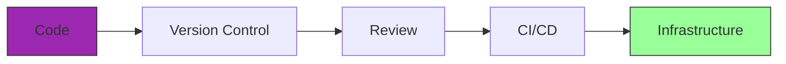
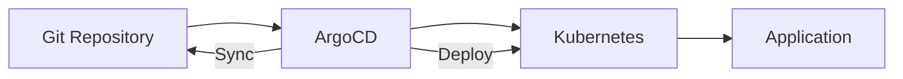

---
tags:
  - formation
  - linux
  - ansible
  - terraform
  - iac
  - gitops
  - automation
---

# Module 19 : Infrastructure as Code

## Objectifs du Module

À l'issue de ce module, vous serez capable de :

- Automatiser avec Ansible (configuration management)
- Provisionner avec Terraform (infrastructure)
- Implémenter GitOps avec ArgoCD
- Appliquer les bonnes pratiques IaC
- Intégrer IaC dans une pipeline CI/CD

**Durée :** 10 heures

**Niveau :** Expert

---

## 1. Concepts IaC

### Définition



| Principe | Description |
|----------|-------------|
| **Idempotence** | Même résultat à chaque exécution |
| **Déclaratif** | Décrire l'état souhaité, pas les étapes |
| **Versionné** | Historique Git des changements |
| **Testable** | Tests automatisés avant déploiement |
| **Reproductible** | Environnements identiques |

### Outils

| Outil | Type | Usage |
|-------|------|-------|
| **Ansible** | Configuration | OS, packages, config |
| **Terraform** | Provisioning | Cloud, VMs, réseau |
| **Pulumi** | Provisioning | Code natif (Python, Go...) |
| **ArgoCD** | GitOps | Déploiement Kubernetes |

---

## 2. Ansible

### Installation

```bash
# pip (recommandé)
pip install ansible ansible-lint

# dnf/apt
sudo dnf install ansible-core

# Vérifier
ansible --version
```

### Structure Projet

```text
ansible-project/
├── ansible.cfg
├── inventory/
│   ├── production.yml
│   └── staging.yml
├── group_vars/
│   ├── all.yml
│   └── webservers.yml
├── host_vars/
│   └── web01.yml
├── roles/
│   └── nginx/
│       ├── tasks/
│       │   └── main.yml
│       ├── handlers/
│       │   └── main.yml
│       ├── templates/
│       │   └── nginx.conf.j2
│       └── defaults/
│           └── main.yml
├── playbooks/
│   ├── site.yml
│   └── webservers.yml
└── requirements.yml
```

### Inventaire

```yaml
# inventory/production.yml
all:
  children:
    webservers:
      hosts:
        web01:
          ansible_host: 192.168.1.11
        web02:
          ansible_host: 192.168.1.12
      vars:
        http_port: 80

    databases:
      hosts:
        db01:
          ansible_host: 192.168.1.21
        db02:
          ansible_host: 192.168.1.22

  vars:
    ansible_user: admin
    ansible_ssh_private_key_file: ~/.ssh/id_ed25519
```

### Playbook

```yaml
# playbooks/webservers.yml
---
- name: Configure web servers
  hosts: webservers
  become: yes
  vars:
    nginx_version: "1.24"

  tasks:
    - name: Install Nginx
      ansible.builtin.dnf:
        name: nginx
        state: present

    - name: Copy Nginx config
      ansible.builtin.template:
        src: nginx.conf.j2
        dest: /etc/nginx/nginx.conf
        owner: root
        group: root
        mode: '0644'
      notify: Reload Nginx

    - name: Ensure Nginx is running
      ansible.builtin.service:
        name: nginx
        state: started
        enabled: yes

    - name: Open firewall port
      ansible.posix.firewalld:
        port: "{{ http_port }}/tcp"
        permanent: yes
        state: enabled
        immediate: yes

  handlers:
    - name: Reload Nginx
      ansible.builtin.service:
        name: nginx
        state: reloaded
```

### Rôle Ansible

```yaml
# roles/nginx/tasks/main.yml
---
- name: Install nginx
  ansible.builtin.package:
    name: nginx
    state: present

- name: Configure nginx
  ansible.builtin.template:
    src: nginx.conf.j2
    dest: /etc/nginx/nginx.conf
  notify: Restart nginx

- name: Deploy virtual hosts
  ansible.builtin.template:
    src: vhost.conf.j2
    dest: "/etc/nginx/conf.d/{{ item.name }}.conf"
  loop: "{{ nginx_vhosts }}"
  notify: Reload nginx

- name: Start nginx
  ansible.builtin.service:
    name: nginx
    state: started
    enabled: yes
```

```yaml
# roles/nginx/defaults/main.yml
---
nginx_worker_processes: auto
nginx_worker_connections: 1024
nginx_vhosts: []
```

```yaml
# roles/nginx/handlers/main.yml
---
- name: Restart nginx
  ansible.builtin.service:
    name: nginx
    state: restarted

- name: Reload nginx
  ansible.builtin.service:
    name: nginx
    state: reloaded
```

### Commandes Ansible

```bash
# Test de connectivité
ansible all -i inventory/production.yml -m ping

# Commande ad-hoc
ansible webservers -m shell -a "uptime"
ansible webservers -m dnf -a "name=vim state=present" --become

# Playbook
ansible-playbook -i inventory/production.yml playbooks/site.yml

# Options utiles
ansible-playbook site.yml --check        # Dry-run
ansible-playbook site.yml --diff         # Voir les changements
ansible-playbook site.yml --limit web01  # Un seul host
ansible-playbook site.yml --tags deploy  # Tags spécifiques
ansible-playbook site.yml -vvv           # Verbose

# Lint
ansible-lint playbooks/site.yml
```

### Ansible Vault

```bash
# Créer un fichier chiffré
ansible-vault create secrets.yml

# Éditer
ansible-vault edit secrets.yml

# Chiffrer un fichier existant
ansible-vault encrypt vars/passwords.yml

# Déchiffrer
ansible-vault decrypt vars/passwords.yml

# Utiliser dans un playbook
ansible-playbook site.yml --ask-vault-pass
ansible-playbook site.yml --vault-password-file=.vault_pass
```

---

## 3. Terraform

### Installation

```bash
# dnf
sudo dnf install -y dnf-plugins-core
sudo dnf config-manager --add-repo https://rpm.releases.hashicorp.com/RHEL/hashicorp.repo
sudo dnf install terraform

# Vérifier
terraform version
```

### Structure Projet

```text
terraform-project/
├── main.tf
├── variables.tf
├── outputs.tf
├── providers.tf
├── versions.tf
├── terraform.tfvars
├── modules/
│   └── vpc/
│       ├── main.tf
│       ├── variables.tf
│       └── outputs.tf
└── environments/
    ├── dev/
    │   └── terraform.tfvars
    └── prod/
        └── terraform.tfvars
```

### Configuration de Base

```hcl
# versions.tf
terraform {
  required_version = ">= 1.5.0"

  required_providers {
    aws = {
      source  = "hashicorp/aws"
      version = "~> 5.0"
    }
  }

  backend "s3" {
    bucket         = "my-terraform-state"
    key            = "prod/terraform.tfstate"
    region         = "eu-west-1"
    encrypt        = true
    dynamodb_table = "terraform-locks"
  }
}

# providers.tf
provider "aws" {
  region = var.aws_region

  default_tags {
    tags = {
      Environment = var.environment
      ManagedBy   = "Terraform"
    }
  }
}
```

### Variables

```hcl
# variables.tf
variable "aws_region" {
  description = "AWS region"
  type        = string
  default     = "eu-west-1"
}

variable "environment" {
  description = "Environment name"
  type        = string
  validation {
    condition     = contains(["dev", "staging", "prod"], var.environment)
    error_message = "Environment must be dev, staging, or prod."
  }
}

variable "instance_type" {
  description = "EC2 instance type"
  type        = string
  default     = "t3.micro"
}

variable "vpc_cidr" {
  description = "VPC CIDR block"
  type        = string
  default     = "10.0.0.0/16"
}

variable "instance_count" {
  description = "Number of instances"
  type        = number
  default     = 2
}

variable "enable_monitoring" {
  description = "Enable detailed monitoring"
  type        = bool
  default     = false
}

variable "tags" {
  description = "Additional tags"
  type        = map(string)
  default     = {}
}
```

```hcl
# terraform.tfvars
aws_region    = "eu-west-1"
environment   = "prod"
instance_type = "t3.small"
vpc_cidr      = "10.0.0.0/16"
instance_count = 3
enable_monitoring = true

tags = {
  Project = "MyApp"
  Owner   = "Platform Team"
}
```

### Ressources

```hcl
# main.tf

# VPC
resource "aws_vpc" "main" {
  cidr_block           = var.vpc_cidr
  enable_dns_hostnames = true
  enable_dns_support   = true

  tags = {
    Name = "${var.environment}-vpc"
  }
}

# Subnets
resource "aws_subnet" "public" {
  count                   = 2
  vpc_id                  = aws_vpc.main.id
  cidr_block              = cidrsubnet(var.vpc_cidr, 8, count.index)
  availability_zone       = data.aws_availability_zones.available.names[count.index]
  map_public_ip_on_launch = true

  tags = {
    Name = "${var.environment}-public-${count.index + 1}"
  }
}

# Security Group
resource "aws_security_group" "web" {
  name        = "${var.environment}-web-sg"
  description = "Security group for web servers"
  vpc_id      = aws_vpc.main.id

  ingress {
    from_port   = 80
    to_port     = 80
    protocol    = "tcp"
    cidr_blocks = ["0.0.0.0/0"]
  }

  ingress {
    from_port   = 443
    to_port     = 443
    protocol    = "tcp"
    cidr_blocks = ["0.0.0.0/0"]
  }

  ingress {
    from_port   = 22
    to_port     = 22
    protocol    = "tcp"
    cidr_blocks = ["10.0.0.0/8"]
  }

  egress {
    from_port   = 0
    to_port     = 0
    protocol    = "-1"
    cidr_blocks = ["0.0.0.0/0"]
  }

  tags = {
    Name = "${var.environment}-web-sg"
  }
}

# EC2 Instances
resource "aws_instance" "web" {
  count                  = var.instance_count
  ami                    = data.aws_ami.amazon_linux.id
  instance_type          = var.instance_type
  subnet_id              = aws_subnet.public[count.index % length(aws_subnet.public)].id
  vpc_security_group_ids = [aws_security_group.web.id]
  monitoring             = var.enable_monitoring

  user_data = <<-EOF
              #!/bin/bash
              dnf install -y nginx
              systemctl enable --now nginx
              EOF

  tags = merge(var.tags, {
    Name = "${var.environment}-web-${count.index + 1}"
  })
}

# Data sources
data "aws_availability_zones" "available" {
  state = "available"
}

data "aws_ami" "amazon_linux" {
  most_recent = true
  owners      = ["amazon"]

  filter {
    name   = "name"
    values = ["al2023-ami-*-x86_64"]
  }
}
```

### Outputs

```hcl
# outputs.tf
output "vpc_id" {
  description = "VPC ID"
  value       = aws_vpc.main.id
}

output "instance_ips" {
  description = "Public IPs of web instances"
  value       = aws_instance.web[*].public_ip
}

output "instance_ids" {
  description = "Instance IDs"
  value       = aws_instance.web[*].id
}
```

### Modules

```hcl
# modules/vpc/main.tf
resource "aws_vpc" "this" {
  cidr_block           = var.cidr_block
  enable_dns_hostnames = true
  enable_dns_support   = true

  tags = {
    Name = var.name
  }
}

# modules/vpc/variables.tf
variable "name" {
  type = string
}

variable "cidr_block" {
  type = string
}

# modules/vpc/outputs.tf
output "vpc_id" {
  value = aws_vpc.this.id
}

# Utilisation du module
module "vpc" {
  source     = "./modules/vpc"
  name       = "${var.environment}-vpc"
  cidr_block = var.vpc_cidr
}
```

### Commandes Terraform

```bash
# Initialiser
terraform init

# Planifier
terraform plan
terraform plan -out=tfplan

# Appliquer
terraform apply
terraform apply tfplan
terraform apply -auto-approve  # Attention !

# Détruire
terraform destroy
terraform destroy -target=aws_instance.web

# État
terraform state list
terraform state show aws_instance.web[0]
terraform state mv aws_instance.web aws_instance.app
terraform state rm aws_instance.web

# Format et validation
terraform fmt
terraform validate

# Import
terraform import aws_instance.existing i-1234567890abcdef0

# Workspaces (environnements)
terraform workspace new staging
terraform workspace select prod
terraform workspace list
```

---

## 4. GitOps avec ArgoCD

### Concept GitOps



### Installation ArgoCD

```bash
# Créer le namespace
kubectl create namespace argocd

# Installer
kubectl apply -n argocd -f https://raw.githubusercontent.com/argoproj/argo-cd/stable/manifests/install.yaml

# Accéder à l'UI
kubectl port-forward svc/argocd-server -n argocd 8080:443

# Récupérer le mot de passe admin
kubectl -n argocd get secret argocd-initial-admin-secret -o jsonpath="{.data.password}" | base64 -d
```

### Application ArgoCD

```yaml
# argocd-app.yaml
apiVersion: argoproj.io/v1alpha1
kind: Application
metadata:
  name: myapp
  namespace: argocd
spec:
  project: default

  source:
    repoURL: https://github.com/myorg/myapp-manifests.git
    targetRevision: main
    path: kubernetes/overlays/production

  destination:
    server: https://kubernetes.default.svc
    namespace: production

  syncPolicy:
    automated:
      prune: true
      selfHeal: true
    syncOptions:
      - CreateNamespace=true

  # Health checks
  ignoreDifferences:
    - group: apps
      kind: Deployment
      jsonPointers:
        - /spec/replicas
```

### Structure Repository GitOps

```text
myapp-manifests/
├── base/
│   ├── deployment.yaml
│   ├── service.yaml
│   ├── configmap.yaml
│   └── kustomization.yaml
└── overlays/
    ├── development/
    │   ├── kustomization.yaml
    │   └── patches/
    │       └── replicas.yaml
    ├── staging/
    │   └── kustomization.yaml
    └── production/
        ├── kustomization.yaml
        └── patches/
            ├── replicas.yaml
            └── resources.yaml
```

---

## 5. Bonnes Pratiques IaC

### Structure et Organisation

```bash
# Séparer par environnement
infrastructure/
├── modules/           # Modules réutilisables
├── environments/
│   ├── dev/
│   ├── staging/
│   └── prod/
└── shared/            # Ressources partagées

# Nommage cohérent
resource "aws_instance" "web" {
  tags = {
    Name        = "${var.project}-${var.environment}-web"
    Environment = var.environment
    ManagedBy   = "terraform"
  }
}
```

### Tests

```bash
# Terraform - Validation
terraform validate
terraform fmt -check

# Terraform - Tests (avec Terratest)
go test -v ./tests/

# Ansible - Lint
ansible-lint playbooks/

# Ansible - Tests (avec Molecule)
molecule test
```

### CI/CD Pipeline

```yaml
# .github/workflows/terraform.yml
name: Terraform

on:
  push:
    branches: [main]
  pull_request:
    branches: [main]

jobs:
  terraform:
    runs-on: ubuntu-latest
    steps:
      - uses: actions/checkout@v4

      - uses: hashicorp/setup-terraform@v3

      - name: Terraform Init
        run: terraform init

      - name: Terraform Format
        run: terraform fmt -check

      - name: Terraform Validate
        run: terraform validate

      - name: Terraform Plan
        run: terraform plan -no-color
        continue-on-error: true

      - name: Terraform Apply
        if: github.ref == 'refs/heads/main'
        run: terraform apply -auto-approve
```

---

## 6. Exercice Pratique

!!! example "Exercice : Infrastructure Complète avec IaC"

    Déployer une infrastructure web complète :

    **Terraform :**
    1. VPC avec subnets publics/privés
    2. Security groups
    3. 2 instances EC2 (ou équivalent local)
    4. Load Balancer

    **Ansible :**
    1. Installer Nginx sur les instances
    2. Déployer une application web
    3. Configurer le monitoring

    **GitOps :**
    1. Créer un repo de manifests Kubernetes
    2. Configurer ArgoCD pour le déploiement automatique

    **Durée estimée :** 90 minutes

---

## Points Clés à Retenir

| Outil | Usage | Commande clé |
|-------|-------|--------------|
| **Ansible** | Configuration | `ansible-playbook site.yml` |
| **Terraform** | Provisioning | `terraform apply` |
| **ArgoCD** | GitOps K8s | `argocd app sync` |

### Workflow IaC

```bash
1. Code   → Écrire l'infrastructure en code
2. Review → Pull Request + Review
3. Plan   → terraform plan / ansible --check
4. Apply  → Déploiement automatisé
5. Verify → Tests post-déploiement
```

---

[:octicons-arrow-right-24: Module 20 : Projet Final Expert](20-projet-final.md)

---

**Retour au :** [Programme de la Formation](index.md)

---

## Navigation

| | |
|:---|---:|
| [← Module 18 : Kubernetes](18-kubernetes.md) | [Module 20 : Projet Final Expert →](20-projet-final.md) |

[Retour au Programme](index.md){ .md-button }
