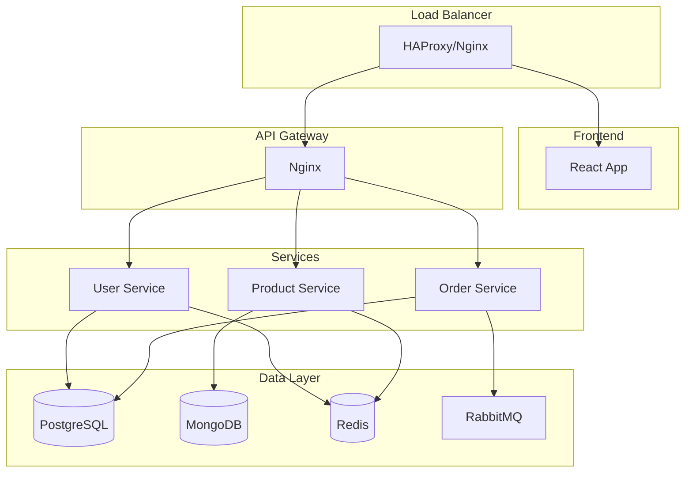
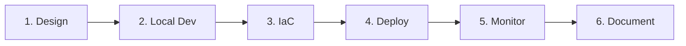

---
tags:
  - formation
  - linux
  - projet
  - capstone
  - expert
---

# Module 20 : Projet Final Expert

## Objectifs du Module

Ce projet final valide l'ensemble des compétences acquises durant la formation :

- Concevoir une architecture haute disponibilité
- Implémenter l'infrastructure as code
- Déployer une application conteneurisée
- Mettre en place monitoring et observabilité
- Documenter et présenter le projet

**Durée :** 12 heures (projet autonome)

**Niveau :** Expert

---

## 1. Contexte du Projet

### Scénario

Vous êtes ingénieur DevOps/SRE dans une entreprise qui souhaite migrer son application monolithique vers une architecture microservices cloud-native. Votre mission est de concevoir et implémenter l'infrastructure complète.

### Application à Déployer

L'application "ShopApp" comprend :

- **Frontend** : React (SPA)
- **API Gateway** : Nginx
- **Services Backend** :
    - User Service (Node.js)
    - Product Service (Python/FastAPI)
    - Order Service (Go)
- **Bases de données** :
    - PostgreSQL (users, orders)
    - MongoDB (products)
    - Redis (cache/sessions)
- **Message Queue** : RabbitMQ



---

## 2. Exigences Techniques

### Infrastructure (Terraform)

- [ ] VPC avec subnets publics et privés
- [ ] Security groups restrictifs
- [ ] Cluster Kubernetes (ou VM pour HA)
- [ ] Load Balancer externe
- [ ] Stockage persistant pour les BDD
- [ ] Backend d'état Terraform distant

### Configuration (Ansible)

- [ ] Hardening des serveurs
- [ ] Installation des prérequis
- [ ] Configuration des services de base
- [ ] Déploiement des certificats TLS
- [ ] Configuration du monitoring

### Conteneurisation (Docker/Podman)

- [ ] Dockerfile optimisé pour chaque service (multi-stage)
- [ ] Docker Compose pour développement local
- [ ] Registry privé pour les images
- [ ] Scan de sécurité des images

### Orchestration (Kubernetes)

- [ ] Deployments avec resource limits
- [ ] Services et Ingress
- [ ] ConfigMaps et Secrets
- [ ] PersistentVolumeClaims pour les BDD
- [ ] Horizontal Pod Autoscaler
- [ ] Network Policies

### Haute Disponibilité

- [ ] Minimum 2 replicas par service
- [ ] Base de données en réplication
- [ ] Health checks (liveness/readiness)
- [ ] Pod Disruption Budgets
- [ ] Anti-affinity rules

### Monitoring & Observabilité

- [ ] Prometheus pour les métriques
- [ ] Grafana pour les dashboards
- [ ] Alertmanager pour les alertes
- [ ] Logging centralisé (ELK/Loki)
- [ ] Tracing distribué (Jaeger)

### CI/CD

- [ ] Pipeline de build des images
- [ ] Tests automatisés
- [ ] Déploiement GitOps avec ArgoCD
- [ ] Environnements dev/staging/prod

### Sécurité

- [ ] RBAC Kubernetes
- [ ] Secrets chiffrés (Sealed Secrets ou Vault)
- [ ] TLS sur tous les endpoints
- [ ] Scan de vulnérabilités
- [ ] Politique de backup

### Documentation

- [ ] Architecture diagram
- [ ] Runbook opérationnel
- [ ] Procédures de disaster recovery
- [ ] README détaillé

---

## 3. Livrables

### 3.1 Repository Git

```text
projet-final/
├── README.md
├── docs/
│   ├── architecture.md
│   ├── runbook.md
│   └── disaster-recovery.md
├── infrastructure/
│   ├── terraform/
│   │   ├── environments/
│   │   │   ├── dev/
│   │   │   └── prod/
│   │   └── modules/
│   └── ansible/
│       ├── inventory/
│       ├── roles/
│       └── playbooks/
├── applications/
│   ├── frontend/
│   │   └── Dockerfile
│   ├── user-service/
│   │   └── Dockerfile
│   ├── product-service/
│   │   └── Dockerfile
│   └── order-service/
│       └── Dockerfile
├── kubernetes/
│   ├── base/
│   └── overlays/
│       ├── dev/
│       ├── staging/
│       └── prod/
├── monitoring/
│   ├── prometheus/
│   ├── grafana/
│   └── alertmanager/
└── ci-cd/
    ├── .github/workflows/
    └── argocd/
```

### 3.2 Documentation Technique

**Architecture (architecture.md)**

```markdown
# Architecture ShopApp

## Vue d'ensemble
[Diagramme d'architecture]

## Composants
- Description de chaque service
- Technologies utilisées
- Ports et protocoles

## Flux de données
- Authentification
- Commande client
- Mise en cache

## Décisions d'architecture
- Pourquoi Kubernetes vs VMs
- Choix de la BDD
- Stratégie de scaling
```

**Runbook (runbook.md)**

```markdown
# Runbook Opérationnel

## Procédures Courantes

### Déploiement d'une nouvelle version
1. Merger la PR sur main
2. Attendre le build CI
3. ArgoCD sync automatique
4. Vérifier les health checks

### Scaling manuel
kubectl scale deployment user-service --replicas=5

### Rollback
kubectl rollout undo deployment/user-service

## Alertes et Réponses

### HighCPUUsage
- **Seuil** : > 80% pendant 5min
- **Impact** : Performance dégradée
- **Action** : Vérifier HPA, augmenter replicas si nécessaire

### DatabaseConnectionErrors
- **Seuil** : > 10 erreurs/min
- **Impact** : Service indisponible
- **Action** : Vérifier connexion BDD, restart du service
```

**Disaster Recovery (disaster-recovery.md)**

```markdown
# Plan de Disaster Recovery

## RTO/RPO
- **RTO** : 1 heure
- **RPO** : 15 minutes

## Scénarios

### Perte d'un Pod
- **Détection** : Automatique (Kubernetes)
- **Récupération** : Automatique (ReplicaSet)
- **Temps** : < 1 minute

### Perte d'un Node
- **Détection** : Probe Kubernetes
- **Récupération** : Reschedule des pods
- **Temps** : < 5 minutes

### Perte de la BDD
- **Détection** : Alerte Prometheus
- **Récupération** : Restore depuis backup
- **Procédure** :
  1. Identifier le dernier backup
  2. Restaurer la BDD
  3. Vérifier l'intégrité
  4. Reconnecter les services

## Backups
- PostgreSQL : pg_dump toutes les 15min vers S3
- MongoDB : mongodump quotidien
- Volumes K8s : Velero
```

### 3.3 Présentation

Préparez une présentation de 15-20 minutes couvrant :

1. **Introduction** (2 min)
    - Contexte du projet
    - Objectifs

2. **Architecture** (5 min)
    - Choix techniques
    - Diagrammes

3. **Démonstration** (8 min)
    - Déploiement d'une nouvelle version
    - Scaling automatique
    - Test de résilience (kill un pod)
    - Dashboard monitoring

4. **Retour d'expérience** (3 min)
    - Difficultés rencontrées
    - Améliorations possibles

5. **Questions** (5 min)

---

## 4. Grille d'Évaluation

| Critère | Points | Description |
|---------|--------|-------------|
| **Infrastructure** | 20 | Terraform fonctionnel, modulaire |
| **Configuration** | 15 | Ansible idempotent, roles réutilisables |
| **Conteneurs** | 15 | Dockerfile optimisés, multi-stage |
| **Kubernetes** | 20 | Manifests complets, bonnes pratiques |
| **CI/CD** | 10 | Pipeline fonctionnelle, GitOps |
| **Monitoring** | 10 | Dashboards, alertes |
| **Documentation** | 10 | Claire, complète, utile |
| **Total** | **100** | |

### Niveaux

| Score | Niveau |
|-------|--------|
| 90-100 | Expert confirmé |
| 75-89 | Expert |
| 60-74 | Avancé |
| < 60 | À améliorer |

---

## 5. Ressources

### Environnement de Développement

```bash
# Option 1 : Minikube (local)
minikube start --cpus=4 --memory=8192 --driver=docker

# Option 2 : Kind (Kubernetes in Docker)
kind create cluster --config kind-config.yaml

# Option 3 : Cloud Provider Free Tier
# - GKE Autopilot (Google)
# - EKS (AWS)
# - AKS (Azure)
```

### Repositories de Référence

- Microservices Demo : `github.com/GoogleCloudPlatform/microservices-demo`
- Kubernetes Examples : `github.com/kubernetes/examples`
- Terraform AWS Modules : `github.com/terraform-aws-modules`

### Documentation Officielle

- Kubernetes : [kubernetes.io/docs](https://kubernetes.io/docs)
- Terraform : [developer.hashicorp.com/terraform](https://developer.hashicorp.com/terraform)
- Ansible : [docs.ansible.com](https://docs.ansible.com)
- ArgoCD : [argo-cd.readthedocs.io](https://argo-cd.readthedocs.io)

---

## 6. Conseils

### Approche Recommandée



1. **Commencez simple**
    - Un seul service d'abord
    - Docker Compose en local
    - Puis Kubernetes

2. **Itérez**
    - Version minimale fonctionnelle
    - Ajoutez les features progressivement

3. **Testez tôt**
    - Health checks dès le début
    - Monitoring dès le début

4. **Documentez en continu**
    - Pas à la fin !
    - Runbook vivant

### Erreurs Courantes à Éviter

- ❌ Commencer par l'infrastructure complexe
- ❌ Ignorer les health checks
- ❌ Hardcoder les secrets
- ❌ Oublier les resource limits
- ❌ Négliger les backups
- ❌ Documentation à la dernière minute

---

## Félicitations !

En complétant ce projet, vous avez démontré une maîtrise complète de :

- L'administration système Linux avancée
- La conteneurisation et l'orchestration
- L'infrastructure as code
- Les pratiques DevOps/SRE
- La haute disponibilité et la résilience

Vous êtes maintenant un **Ingénieur Linux Expert** !

### Prochaines Étapes

- Certifications : CKA, RHCE, AWS/GCP/Azure
- Spécialisation : SRE, Platform Engineering, Security
- Communauté : Contributions open source, meetups

---

**Retour au :** [Programme de la Formation](index.md)

---

## Navigation

| | |
|:---|---:|
| [← Module 19 : Infrastructure as Code](19-iac.md) | [Programme →](index.md) |

[Retour au Programme](index.md){ .md-button }
