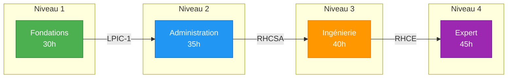
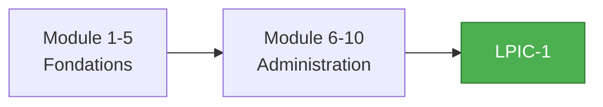
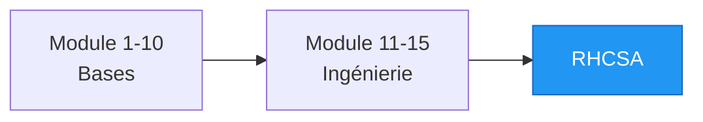
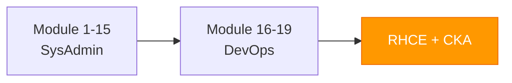
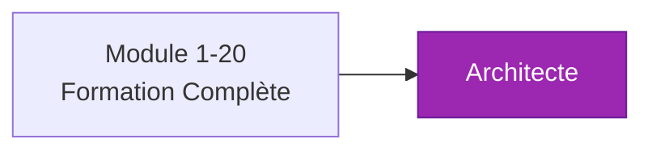

---
tags:
  - formation
  - linux
  - sysadmin
  - devops
  - expert
---

# Linux Mastery : Du Débutant à l'Expert

## Vision de la Formation

Cette formation complète vous accompagne dans votre parcours Linux, depuis vos premiers pas jusqu'à l'expertise d'un ingénieur senior. Structurée en **4 niveaux progressifs** et **20 modules**, elle couvre l'intégralité des compétences nécessaires pour maîtriser Linux en environnement professionnel.



## Objectifs Globaux

À l'issue de cette formation, vous serez capable de :

- **Administrer** des serveurs Linux en production (RHEL, Ubuntu, Debian)
- **Sécuriser** les systèmes selon les standards SecNumCloud/CIS/STIG
- **Automatiser** l'infrastructure avec Bash, Ansible et Terraform
- **Optimiser** les performances et résoudre les problèmes complexes
- **Architecturer** des solutions haute disponibilité
- **Conteneuriser** et orchestrer avec Docker et Kubernetes

## Public Cible

| Niveau | Profil | Prérequis |
|--------|--------|-----------|
| **Niveau 1** | Débutant complet | Curiosité, motivation |
| **Niveau 2** | Junior SysAdmin | Niveau 1 ou équivalent |
| **Niveau 3** | SysAdmin confirmé | Niveau 2 + 1-2 ans expérience |
| **Niveau 4** | Senior/Architecte | Niveau 3 + 3-5 ans expérience |

## Structure de la Formation

### Niveau 1 : Fondations Linux (30h)

**Objectif :** Acquérir les bases solides pour utiliser et comprendre Linux.

**Certification préparée :** LPIC-1 (101-500)

<div class="grid cards" markdown>

-   :material-console:{ .lg .middle } **Module 1 : Découverte de Linux**

    ---

    Histoire, distributions, philosophie Unix, installation d'une VM.

    **Durée :** 4h

    [:octicons-arrow-right-24: Accéder au Module](01-decouverte.md)

-   :material-folder-open:{ .lg .middle } **Module 2 : Navigation & Fichiers**

    ---

    Shell, commandes de base, arborescence FHS, manipulation de fichiers.

    **Durée :** 6h

    [:octicons-arrow-right-24: Accéder au Module](02-navigation.md)

-   :material-account-group:{ .lg .middle } **Module 3 : Utilisateurs & Permissions**

    ---

    Gestion des comptes, groupes, droits rwx, chmod, chown, umask.

    **Durée :** 6h

    [:octicons-arrow-right-24: Accéder au Module](03-permissions.md)

-   :material-text-box-edit:{ .lg .middle } **Module 4 : Éditeurs & Texte**

    ---

    Vim, nano, grep, sed, awk, pipes et redirections.

    **Durée :** 6h

    [:octicons-arrow-right-24: Accéder au Module](04-editeurs.md)

-   :material-bash:{ .lg .middle } **Module 5 : Introduction au Shell**

    ---

    Variables, scripts basiques, conditions, boucles, fonctions.

    **Durée :** 8h

    [:octicons-arrow-right-24: Accéder au Module](05-shell-intro.md)

</div>

---

### Niveau 2 : Administration Système (35h)

**Objectif :** Gérer des serveurs Linux en production.

**Certification préparée :** LPIC-1 (102-500), RHCSA

<div class="grid cards" markdown>

-   :material-package-variant:{ .lg .middle } **Module 6 : Gestion des Paquets**

    ---

    APT, DNF/YUM, compilation depuis les sources, repositories.

    **Durée :** 5h

    [:octicons-arrow-right-24: Accéder au Module](06-paquets.md)

-   :material-cog-play:{ .lg .middle } **Module 7 : Processus & Services**

    ---

    Systemd, processus, signaux, journald, boot sequence.

    **Durée :** 7h

    [:octicons-arrow-right-24: Accéder au Module](07-services.md)

-   :material-harddisk:{ .lg .middle } **Module 8 : Stockage & Filesystems**

    ---

    Partitionnement, LVM, RAID, ext4, XFS, montage, fstab.

    **Durée :** 8h

    [:octicons-arrow-right-24: Accéder au Module](08-stockage.md)

-   :material-lan:{ .lg .middle } **Module 9 : Réseau Fondamental**

    ---

    TCP/IP, configuration réseau, NetworkManager, DNS, DHCP.

    **Durée :** 7h

    [:octicons-arrow-right-24: Accéder au Module](09-reseau.md)

-   :material-clock-outline:{ .lg .middle } **Module 10 : Automatisation & Planification**

    ---

    Cron, systemd timers, at, scripts de maintenance.

    **Durée :** 8h

    [:octicons-arrow-right-24: Accéder au Module](10-automatisation.md)

</div>

---

### Niveau 3 : Ingénierie Système (40h)

**Objectif :** Sécuriser, optimiser et industrialiser les infrastructures.

**Certification préparée :** RHCSA, RHCE

<div class="grid cards" markdown>

-   :material-shield-lock:{ .lg .middle } **Module 11 : Sécurité & Hardening**

    ---

    SSH, sudo, firewall, SELinux/AppArmor, audit, conformité.

    **Durée :** 10h

    [:octicons-arrow-right-24: Accéder au Module](11-securite.md)

-   :material-web:{ .lg .middle } **Module 12 : Services Réseau**

    ---

    Apache/Nginx, DNS (BIND), DHCP, NFS, Samba, LDAP.

    **Durée :** 10h

    [:octicons-arrow-right-24: Accéder au Module](12-services-reseau.md)

-   :material-chart-line:{ .lg .middle } **Module 13 : Performance & Troubleshooting**

    ---

    Analyse CPU/RAM/IO, strace, perf, debugging kernel.

    **Durée :** 8h

    [:octicons-arrow-right-24: Accéder au Module](13-performance.md)

-   :material-code-braces:{ .lg .middle } **Module 14 : Scripting Avancé**

    ---

    Bash avancé, error handling, logging, tests, best practices.

    **Durée :** 8h

    [:octicons-arrow-right-24: Accéder au Module](14-scripting-avance.md)

-   :material-backup-restore:{ .lg .middle } **Module 15 : Backup & Disaster Recovery**

    ---

    Stratégies 3-2-1, rsync, Borg, restauration, PRA/PCA.

    **Durée :** 4h

    [:octicons-arrow-right-24: Accéder au Module](15-backup.md)

</div>

---

### Niveau 4 : Expertise & Architecture (45h)

**Objectif :** Concevoir et opérer des infrastructures critiques.

**Certification préparée :** RHCE, CKA

<div class="grid cards" markdown>

-   :material-server-network:{ .lg .middle } **Module 16 : Haute Disponibilité**

    ---

    Clustering, Pacemaker/Corosync, HAProxy, load balancing.

    **Durée :** 10h

    [:octicons-arrow-right-24: Accéder au Module](16-haute-disponibilite.md)

-   :material-docker:{ .lg .middle } **Module 17 : Conteneurisation**

    ---

    Docker, Podman, images, volumes, réseaux, sécurité conteneurs.

    **Durée :** 10h

    [:octicons-arrow-right-24: Accéder au Module](17-conteneurs.md)

-   :material-kubernetes:{ .lg .middle } **Module 18 : Orchestration Kubernetes**

    ---

    Architecture K8s, pods, services, deployments, opérations.

    **Durée :** 12h

    [:octicons-arrow-right-24: Accéder au Module](18-kubernetes.md)

-   :material-robot:{ .lg .middle } **Module 19 : Infrastructure as Code**

    ---

    Ansible avancé, Terraform, GitOps, CI/CD pour l'infra.

    **Durée :** 8h

    [:octicons-arrow-right-24: Accéder au Module](19-iac.md)

-   :material-trophy:{ .lg .middle } **Module 20 : Projet Final Expert**

    ---

    Déploiement d'une infrastructure complète production-ready.

    **Durée :** 5h

    [:octicons-arrow-right-24: Accéder au Module](20-projet-final.md)

</div>

---

## Parcours par Objectif

### Je veux devenir SysAdmin Junior



**Durée :** 65h | **Modules :** 1-10 | **Certification :** LPIC-1

### Je veux devenir SysAdmin Confirmé



**Durée :** 105h | **Modules :** 1-15 | **Certification :** RHCSA

### Je veux devenir DevOps/SRE



**Durée :** 145h | **Modules :** 1-19 | **Certifications :** RHCE, CKA

### Je veux devenir Architecte Infrastructure



**Durée :** 150h | **Modules :** 1-20 | **Certifications :** Multiples

---

## Durée Totale

| Niveau | Modules | Durée | Cumulé |
|--------|---------|-------|--------|
| **Niveau 1 - Fondations** | 1-5 | 30h | 30h |
| **Niveau 2 - Administration** | 6-10 | 35h | 65h |
| **Niveau 3 - Ingénierie** | 11-15 | 40h | 105h |
| **Niveau 4 - Expert** | 16-20 | 45h | **150h** |

!!! tip "Organisation Recommandée"
    **Formation intensive :** 6 semaines à temps plein

    **Formation continue :** 6 mois à raison de 6h/semaine

    **Auto-formation :** 9-12 mois à votre rythme

---

## Environnement de Lab

### Configuration Recommandée

Pour suivre cette formation, vous aurez besoin d'un environnement de lab :

=== "Option 1 : VM Locale"

    ```bash
    # Prérequis
    - 16 GB RAM minimum
    - 100 GB espace disque
    - VirtualBox ou VMware

    # VMs à créer
    - 1x Rocky Linux 9 (serveur principal)
    - 1x Ubuntu 22.04 LTS (serveur secondaire)
    - 1x Debian 12 (client)
    ```

=== "Option 2 : Cloud (GCP Free Tier)"

    ```bash
    # Instances à créer
    gcloud compute instances create lab-rocky \
      --image-family=rocky-linux-9 \
      --image-project=rocky-linux-cloud \
      --machine-type=e2-medium

    gcloud compute instances create lab-ubuntu \
      --image-family=ubuntu-2204-lts \
      --image-project=ubuntu-os-cloud \
      --machine-type=e2-small
    ```

=== "Option 3 : Vagrant"

    ```ruby
    # Vagrantfile
    Vagrant.configure("2") do |config|
      config.vm.define "rocky" do |rocky|
        rocky.vm.box = "rockylinux/9"
        rocky.vm.hostname = "lab-rocky"
        rocky.vm.network "private_network", ip: "192.168.56.10"
      end

      config.vm.define "ubuntu" do |ubuntu|
        ubuntu.vm.box = "ubuntu/jammy64"
        ubuntu.vm.hostname = "lab-ubuntu"
        ubuntu.vm.network "private_network", ip: "192.168.56.11"
      end
    end
    ```

### Distributions Couvertes

| Distribution | Famille | Usage Principal |
|--------------|---------|-----------------|
| **Rocky Linux 9** | RHEL | Entreprise, production |
| **Ubuntu 22.04 LTS** | Debian | Cloud, DevOps |
| **Debian 12** | Debian | Serveurs, stabilité |
| **AlmaLinux 9** | RHEL | Alternative Rocky |

---

## Certifications Préparées

Cette formation prépare aux certifications suivantes :

| Certification | Niveau | Modules Couverts |
|---------------|--------|------------------|
| **LPIC-1** (101-500, 102-500) | Niveau 1-2 | Modules 1-10 |
| **RHCSA** (EX200) | Niveau 2-3 | Modules 6-15 |
| **RHCE** (EX294) | Niveau 3-4 | Modules 11-19 |
| **CKA** | Niveau 4 | Module 18 |
| **CompTIA Linux+** | Niveau 1-2 | Modules 1-10 |

---

## Pédagogie

Chaque module suit une structure cohérente :

```
┌─────────────────────────────────────────────────────────────┐
│  1. CONCEPT (20%)                                           │
│     Théorie, diagrammes Mermaid, cas d'usage                │
├─────────────────────────────────────────────────────────────┤
│  2. PRATIQUE (40%)                                          │
│     Commandes détaillées, configurations, exemples          │
├─────────────────────────────────────────────────────────────┤
│  3. EXERCICE (30%)                                          │
│     Mise en situation réelle avec objectifs clairs          │
├─────────────────────────────────────────────────────────────┤
│  4. SOLUTION (10%)                                          │
│     Correction détaillée, explications des choix            │
└─────────────────────────────────────────────────────────────┘
```

!!! quote "Philosophie"
    **"Faites les exercices AVANT de regarder la solution."**

    C'est en se trompant qu'on apprend le mieux.

---

## Ressources de la Formation

<div class="grid cards" markdown>

-   :material-book-alphabet:{ .lg .middle } **Glossaire Linux**

    ---

    200+ termes essentiels avec définitions et exemples.

    [:octicons-arrow-right-24: Consulter](glossaire.md)

-   :material-file-document:{ .lg .middle } **Cheat Sheet Commandes**

    ---

    Référence rapide de 100+ commandes Linux essentielles.

    [:octicons-arrow-right-24: Télécharger](cheatsheet-commandes.md)

-   :material-console:{ .lg .middle } **Cheat Sheet Vim**

    ---

    Maîtrisez Vim avec cette référence complète.

    [:octicons-arrow-right-24: Télécharger](cheatsheet-vim.md)

-   :material-shield-check:{ .lg .middle } **Checklist Hardening**

    ---

    120 points de contrôle sécurité pour vos serveurs.

    [:octicons-arrow-right-24: Télécharger](checklist-hardening.md)

</div>

---

## Prêt à Commencer ?

Choisissez votre point de départ :

- **Débutant complet :** [Module 1 - Découverte de Linux](01-decouverte.md)
- **Connaissance basique :** [Module 5 - Introduction au Shell](05-shell-intro.md)
- **SysAdmin junior :** [Module 11 - Sécurité & Hardening](11-securite.md)
- **Confirmé vers DevOps :** [Module 16 - Haute Disponibilité](16-haute-disponibilite.md)

---

**Retour au :** [Catalogue des Formations](../index.md)
