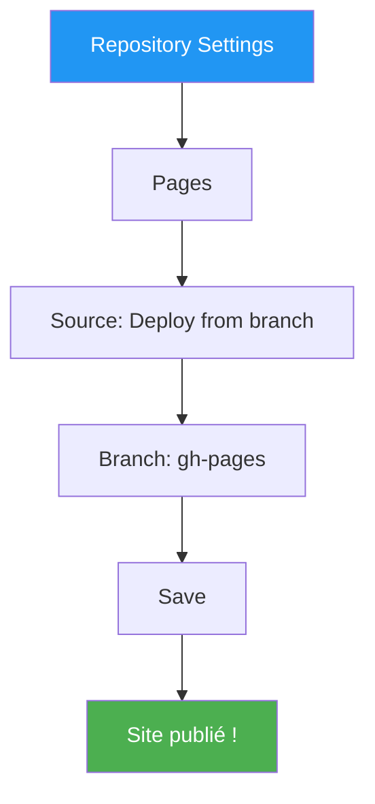

---
tags:
  - mkdocs
  - github-pages
  - github-actions
  - cicd
  - deployment
---

# Module 2 : Déploiement GitHub Pages

**Durée estimée :** 45 minutes

---

## Objectifs

À la fin de ce module, vous saurez :

- Créer un repository GitHub pour votre documentation
- Configurer GitHub Actions pour le déploiement automatique
- Publier sur GitHub Pages
- Configurer un domaine personnalisé (optionnel)
- Gérer plusieurs versions de la documentation

---

## 1. Architecture du Déploiement


**Workflow :**

1. Vous poussez du code sur la branche `main`
2. GitHub Actions détecte le push
3. Le workflow build le site avec MkDocs
4. Le site est déployé sur la branche `gh-pages`
5. GitHub Pages sert le site statique

---

## 2. Créer le Repository GitHub

### Option 1 : Depuis zéro

```bash
# Initialiser Git dans votre projet
cd mon-site-docs
git init

# Premier commit
git add .
git commit -m "Initial commit: MkDocs site"

# Créer le repo sur GitHub (avec gh CLI)
gh repo create mon-site-docs --public --push --source=.
```

### Option 2 : Cloner un template

1. Allez sur [github.com/new](https://github.com/new)
2. Nommez votre repository (ex: `mon-site-docs`)
3. Cochez "Add a README file"
4. Cliquez "Create repository"

```bash
# Cloner le repo
git clone https://github.com/votreuser/mon-site-docs.git
cd mon-site-docs

# Initialiser MkDocs
mkdocs new .
```

---

## 3. Configurer GitHub Actions

### Créer le Workflow

Créez le fichier `.github/workflows/deploy.yml` :

```yaml
name: Deploy MkDocs to GitHub Pages

on:
  push:
    branches:
      - main
  workflow_dispatch:  # Permet le déploiement manuel

permissions:
  contents: write
  pages: write
  id-token: write

jobs:
  deploy:
    runs-on: ubuntu-latest
    steps:
      # Checkout du code
      - name: Checkout repository
        uses: actions/checkout@v4
        with:
          fetch-depth: 0  # Nécessaire pour git-revision-date

      # Configuration Python
      - name: Setup Python
        uses: actions/setup-python@v5
        with:
          python-version: '3.12'

      # Cache des dépendances pip
      - name: Cache pip dependencies
        uses: actions/cache@v4
        with:
          path: ~/.cache/pip
          key: ${{ runner.os }}-pip-${{ hashFiles('requirements.txt') }}
          restore-keys: |
            ${{ runner.os }}-pip-

      # Installation des dépendances
      - name: Install dependencies
        run: pip install -r requirements.txt

      # Build et déploiement
      - name: Deploy to GitHub Pages
        run: mkdocs gh-deploy --force --clean
        env:
          GITHUB_TOKEN: ${{ secrets.GITHUB_TOKEN }}
```

### Fichier requirements.txt

Assurez-vous d'avoir un fichier `requirements.txt` :

```text
mkdocs-material>=9.5
mkdocs-mermaid2-plugin>=1.1
pymdown-extensions>=10.0
```

!!! tip "Versions Épinglées"
    Utilisez des versions spécifiques (ex: `mkdocs-material==9.5.3`) pour des builds reproductibles.

---

## 4. Configurer GitHub Pages

### Activer GitHub Pages

1. Allez dans **Settings** > **Pages**
2. Source : **Deploy from a branch**
3. Branch : **gh-pages** / **/ (root)**
4. Cliquez **Save**



### Premier Déploiement

```bash
# Ajouter le workflow
mkdir -p .github/workflows
# ... créer deploy.yml ...

# Commit et push
git add .
git commit -m "ci: Add GitHub Actions workflow for MkDocs"
git push origin main
```

Après le push :

1. Allez dans l'onglet **Actions** de votre repository
2. Vous verrez le workflow en cours d'exécution
3. Une fois terminé (✓ vert), le site est en ligne

### URL du Site

Votre site sera disponible à :

```text
https://votreuser.github.io/mon-site-docs/
```

---

## 5. Configuration site_url

!!! warning "Important"
    Configurez `site_url` dans `mkdocs.yml` pour que les liens fonctionnent correctement.

```yaml
site_name: Ma Documentation
site_url: https://votreuser.github.io/mon-site-docs/
```

### Pour un repository nommé `votreuser.github.io`

Si votre repo s'appelle `votreuser.github.io` (site principal) :

```yaml
site_url: https://votreuser.github.io/
```

Le site sera accessible directement à `https://votreuser.github.io/`.

---

## 6. Domaine Personnalisé (Optionnel)

### Configurer le DNS

Chez votre registrar (OVH, Gandi, Cloudflare...), ajoutez :

**Pour un sous-domaine (docs.monsite.com) :**

```text
Type: CNAME
Name: docs
Value: votreuser.github.io.
```

**Pour un domaine apex (monsite.com) :**

```text
Type: A
Name: @
Values:
  185.199.108.153
  185.199.109.153
  185.199.110.153
  185.199.111.153
```

### Configurer GitHub Pages

1. Dans **Settings** > **Pages**
2. **Custom domain** : `docs.monsite.com`
3. Cochez **Enforce HTTPS**

### Fichier CNAME

Créez `docs/CNAME` :

```text
docs.monsite.com
```

!!! info "Le fichier CNAME"
    MkDocs copie automatiquement les fichiers du dossier `docs/` vers le site. Le fichier CNAME sera donc présent dans `gh-pages`.

---

## 7. Déploiement Manuel

### Via la CLI

```bash
# Build et déploiement manuel
mkdocs gh-deploy --force
```

Cette commande :

1. Build le site dans `site/`
2. Crée/met à jour la branche `gh-pages`
3. Push vers GitHub

### Via GitHub Actions (workflow_dispatch)

1. Allez dans **Actions** > **Deploy MkDocs**
2. Cliquez **Run workflow**
3. Sélectionnez la branche
4. Cliquez **Run workflow**

---

## 8. Gestion des Versions (Optionnel)

Pour maintenir plusieurs versions de la documentation (v1, v2...) :

### Avec mike

```bash
pip install mike
```

**Workflow modifié :**

```yaml
- name: Deploy with mike
  run: |
    git config user.name "github-actions[bot]"
    git config user.email "github-actions[bot]@users.noreply.github.com"
    mike deploy --push --update-aliases ${{ github.ref_name }} latest
```

**Utilisation :**

```bash
# Déployer la version 1.0
mike deploy 1.0 latest --push

# Déployer la version 2.0
mike deploy 2.0 latest --push

# Lister les versions
mike list
```

---

## 9. Dépannage

### Le site ne se met pas à jour

```bash
# Vérifier le statut du workflow
gh run list --workflow=deploy.yml

# Voir les logs
gh run view --log
```

### Erreur 404 sur GitHub Pages

Causes possibles :

| Problème | Solution |
|----------|----------|
| Branche `gh-pages` vide | Vérifier que le workflow a réussi |
| `site_url` incorrect | Corriger dans `mkdocs.yml` |
| Chemin incorrect | Vérifier la structure des fichiers |
| Cache navigateur | Ctrl+Shift+R pour rafraîchir |

### Erreur de build

```bash
# Tester le build localement
mkdocs build --strict

# Vérifier les erreurs
mkdocs build --verbose
```

### Permissions GitHub Actions

Si vous voyez `Permission denied` :

1. **Settings** > **Actions** > **General**
2. Workflow permissions : **Read and write permissions**
3. Cochez **Allow GitHub Actions to create and approve pull requests**

---

## 10. Workflow Complet Avancé

Voici un workflow plus complet avec validation :

```yaml
name: Deploy MkDocs

on:
  push:
    branches: [main]
    paths:
      - 'docs/**'
      - 'mkdocs.yml'
      - 'requirements.txt'
      - '.github/workflows/deploy.yml'
  pull_request:
    branches: [main]
  workflow_dispatch:

permissions:
  contents: write
  pages: write
  id-token: write

jobs:
  # Job de validation (PR uniquement)
  validate:
    if: github.event_name == 'pull_request'
    runs-on: ubuntu-latest
    steps:
      - uses: actions/checkout@v4

      - name: Setup Python
        uses: actions/setup-python@v5
        with:
          python-version: '3.12'

      - name: Install dependencies
        run: pip install -r requirements.txt

      - name: Build (validation)
        run: mkdocs build --strict

  # Job de déploiement (push sur main uniquement)
  deploy:
    if: github.event_name == 'push' || github.event_name == 'workflow_dispatch'
    runs-on: ubuntu-latest
    steps:
      - uses: actions/checkout@v4
        with:
          fetch-depth: 0

      - name: Setup Python
        uses: actions/setup-python@v5
        with:
          python-version: '3.12'

      - name: Cache pip
        uses: actions/cache@v4
        with:
          path: ~/.cache/pip
          key: ${{ runner.os }}-pip-${{ hashFiles('requirements.txt') }}

      - name: Install dependencies
        run: pip install -r requirements.txt

      - name: Deploy
        run: mkdocs gh-deploy --force --clean
        env:
          GITHUB_TOKEN: ${{ secrets.GITHUB_TOKEN }}
```

---

## Exercice Pratique

### Objectif

Déployer votre site MkDocs sur GitHub Pages.

### Instructions

1. Créer un repository GitHub `mkdocs-exercice`
2. Initialiser MkDocs avec le thème Material
3. Créer le workflow `.github/workflows/deploy.yml`
4. Push vers `main`
5. Vérifier le déploiement dans **Actions**
6. Accéder au site sur GitHub Pages

### Checklist

- [ ] Repository créé sur GitHub
- [ ] `mkdocs.yml` configuré avec `site_url`
- [ ] `requirements.txt` présent
- [ ] Workflow GitHub Actions créé
- [ ] Premier déploiement réussi
- [ ] Site accessible via l'URL GitHub Pages

---

## Résumé

| Élément | Description |
|---------|-------------|
| `.github/workflows/deploy.yml` | Workflow de déploiement |
| `mkdocs gh-deploy` | Commande de déploiement |
| Branche `gh-pages` | Contient le site généré |
| `site_url` | URL finale du site |
| `CNAME` | Pour domaine personnalisé |

---

## Prochaine Étape

Votre site est en ligne ! Dans le prochain module, nous verrons comment créer des diagrammes professionnels avec Mermaid.

[:octicons-arrow-right-24: Module 3 : Mermaid - Diagrammes Professionnels](03-module.md)
