---
tags:
  - mermaid
  - diagrams
  - flowchart
  - uml
  - visualization
---

# Module 3 : Mermaid - Diagrammes Professionnels

**Durée estimée :** 1 heure

---

## Objectifs

À la fin de ce module, vous saurez :

- Créer des flowcharts et organigrammes
- Dessiner des diagrammes de séquence UML
- Concevoir des diagrammes d'architecture
- Appliquer des styles et couleurs cohérents
- Utiliser les bonnes pratiques pour des diagrammes lisibles

---

## 1. Configuration Mermaid dans MkDocs

### Activer Mermaid

Dans `mkdocs.yml` :

```yaml
markdown_extensions:
  - pymdownx.superfences:
      custom_fences:
        - name: mermaid
          class: mermaid
          format: !!python/name:pymdownx.superfences.fence_code_format
```

### Syntaxe de Base

````markdown
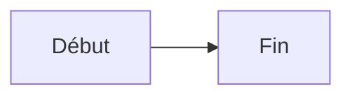
````

**Rendu :**


---

## 2. Flowcharts (Organigrammes)

### Direction du Graphe

| Code | Direction |
|------|-----------|
| `TB` / `TD` | Top to Bottom (haut vers bas) |
| `BT` | Bottom to Top (bas vers haut) |
| `LR` | Left to Right (gauche vers droite) |
| `RL` | Right to Left (droite vers gauche) |

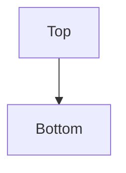

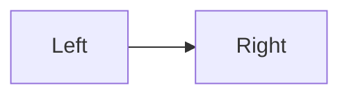

### Formes des Nœuds

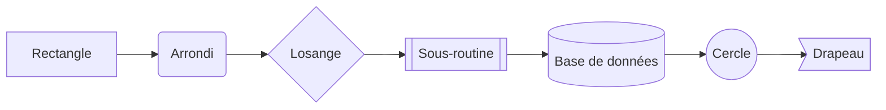

| Syntaxe | Forme | Usage |
|---------|-------|-------|
| `[texte]` | Rectangle | Action, étape |
| `(texte)` | Rectangle arrondi | Processus |
| `{texte}` | Losange | Décision, condition |
| `[[texte]]` | Sous-routine | Fonction, module |
| `[(texte)]` | Cylindre | Base de données |
| `((texte))` | Cercle | Point d'entrée/sortie |
| `>texte]` | Drapeau | Signal, événement |

### Types de Liens

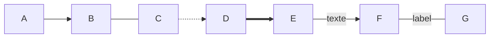

| Syntaxe | Description |
|---------|-------------|
| `-->` | Flèche simple |
| `---` | Ligne sans flèche |
| `-.->` | Flèche pointillée |
| `==>` | Flèche épaisse |
| `--texte-->` | Flèche avec label |

### Exemple : Pipeline CI/CD

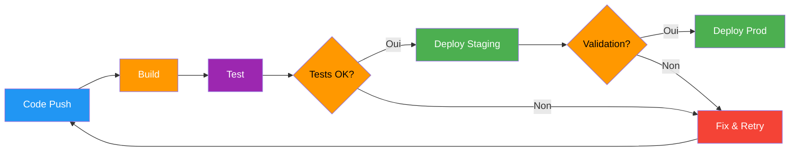

---

## 3. Subgraphs (Sous-graphes)

Groupez des éléments logiquement :

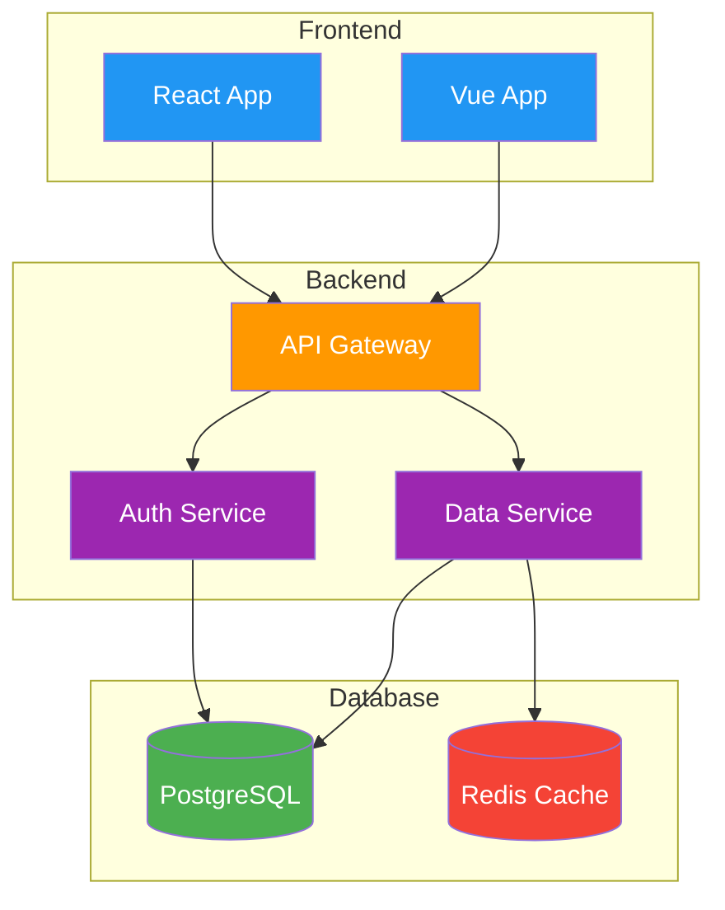

### Subgraphs Imbriqués

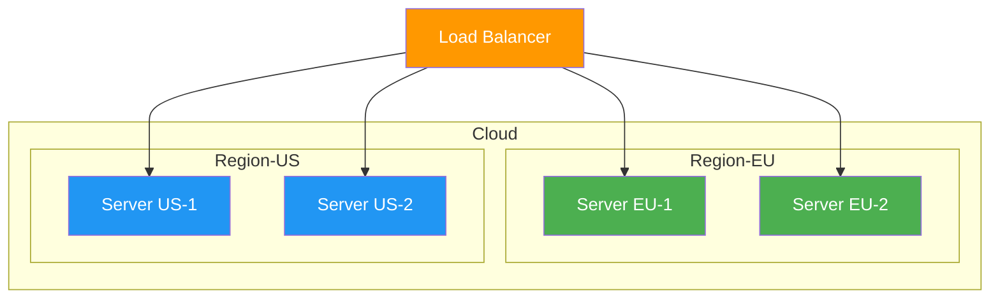

---

## 4. Diagrammes de Séquence

### Syntaxe de Base

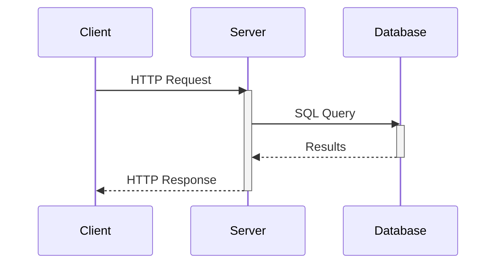

### Types de Flèches

| Syntaxe | Description |
|---------|-------------|
| `->>` | Flèche pleine (synchrone) |
| `-->>` | Flèche pointillée (réponse) |
| `-x` | Croix (échec) |
| `-)` | Flèche ouverte (async) |

### Exemple : Authentification OAuth

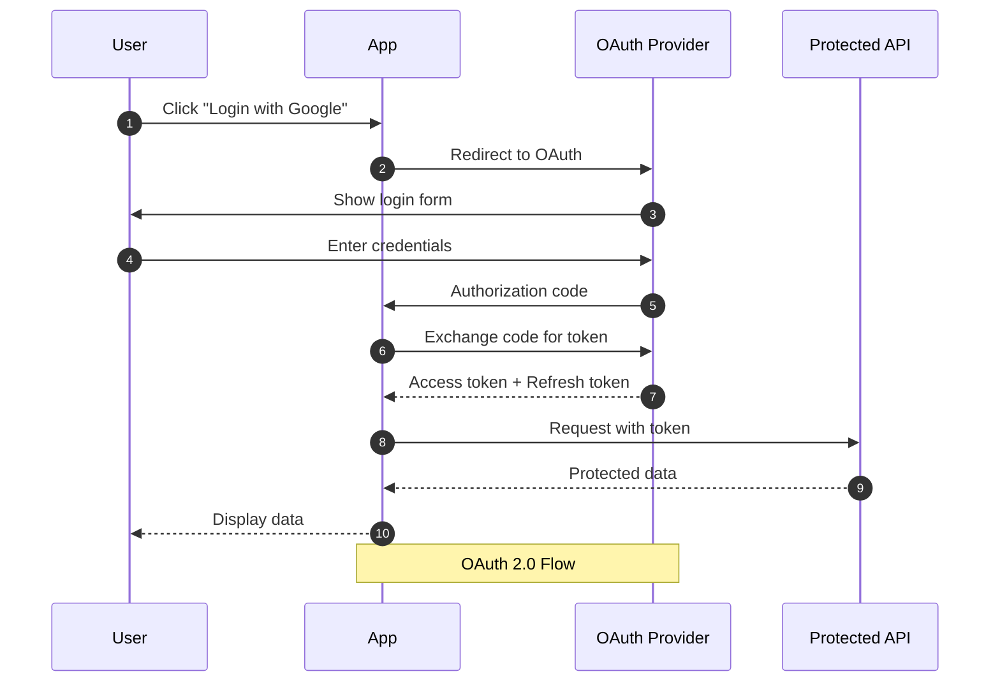

### Boucles et Conditions

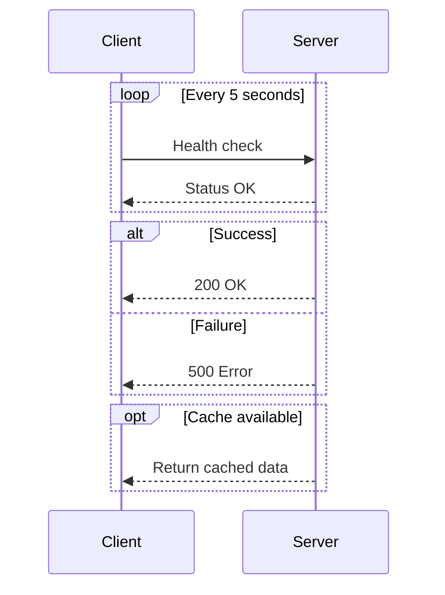

---

## 5. Diagrammes de Classes

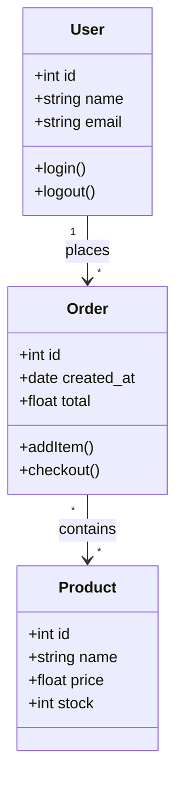

### Relations

| Syntaxe | Relation |
|---------|----------|
| `<\|--` | Héritage |
| `*--` | Composition |
| `o--` | Agrégation |
| `-->` | Association |
| `..>` | Dépendance |

---

## 6. Diagrammes d'État

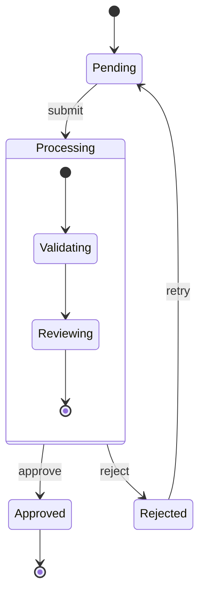

---

## 7. Diagrammes ER (Entity Relationship)

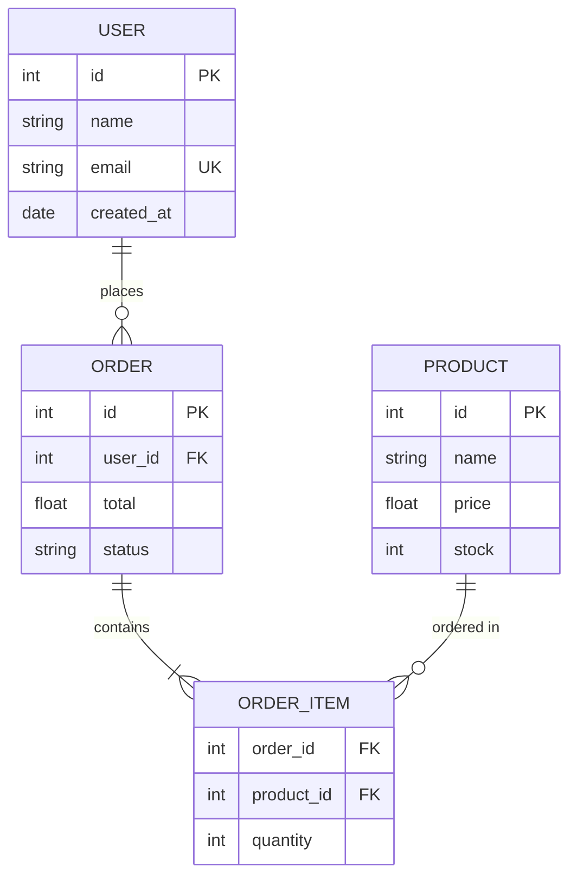

---

## 8. Pie Charts & Autres

### Diagramme Circulaire

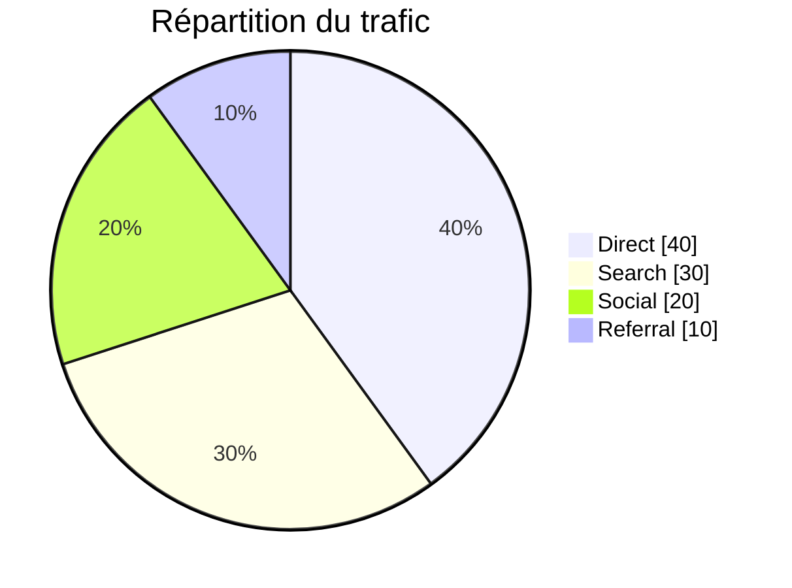

### Timeline

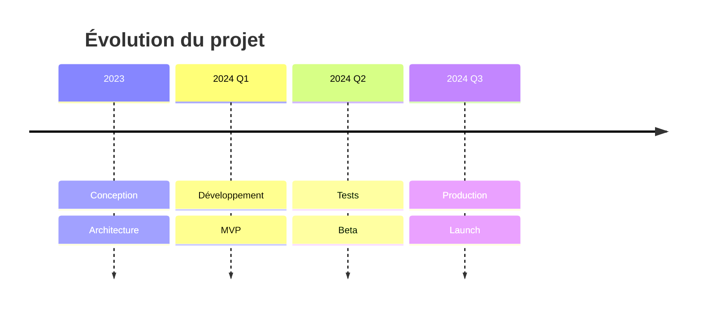

### Gantt

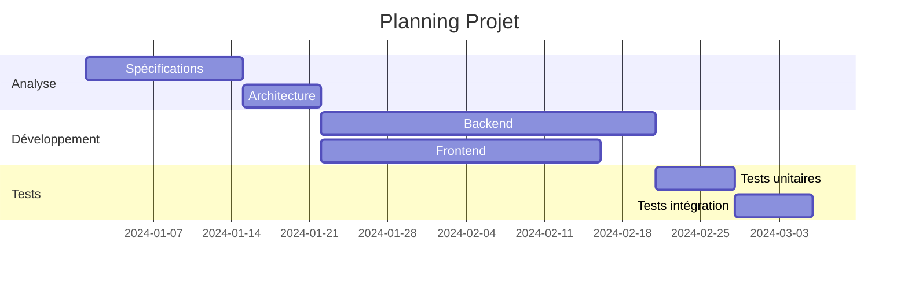

---

## 9. Styling et Couleurs

### Palette Recommandée

Utilisez une palette cohérente pour vos diagrammes :

| Couleur | Hex | Usage |
|---------|-----|-------|
| Vert | `#4CAF50` | Succès, débutant, OK |
| Bleu | `#2196F3` | Info, intermédiaire |
| Orange | `#FF9800` | Warning, avancé |
| Violet | `#9C27B0` | Expert, spécial |
| Rouge | `#f44336` | Erreur, danger |

### Appliquer des Styles


### Classes CSS

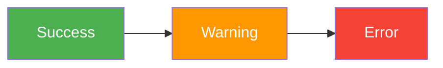

### Appliquer une Classe à Plusieurs Nœuds

```mermaid
flowchart LR
    A[Server 1]:::server --> LB[Load Balancer]:::lb
    B[Server 2]:::server --> LB
    C[Server 3]:::server --> LB

    classDef server fill:#4CAF50,color:#fff
    classDef lb fill:#FF9800,color:#fff

    class A,B,C server
```

---

## 10. Bonnes Pratiques

### 1. Lisibilité

```mermaid
flowchart LR
    subgraph "❌ Mauvais"
        direction LR
        A1[a] --> B1[b] --> C1[c] --> D1[d] --> E1[e] --> F1[f]
    end
```

```mermaid
flowchart TB
    subgraph "✅ Bon"
        A2[Étape 1] --> B2[Étape 2]
        B2 --> C2[Étape 3]
        C2 --> D2[Étape 4]
    end

    style A2 fill:#4CAF50,color:#fff
    style D2 fill:#4CAF50,color:#fff
```

### 2. Labels Descriptifs

```text
❌ A --> B --> C
✅ Client --> API Gateway --> Database
```

### 3. Grouper Logiquement

Utilisez les subgraphs pour organiser les composants liés.

### 4. Cohérence des Couleurs

Utilisez toujours la même couleur pour le même type d'élément :

- Bases de données : Vert
- APIs : Bleu
- Utilisateurs : Orange
- Erreurs : Rouge

### 5. Éviter la Surcharge

- Maximum 10-15 nœuds par diagramme
- Créez plusieurs diagrammes si nécessaire
- Utilisez des sous-graphes pour regrouper

---

## 11. Exemples Pratiques

### Architecture Microservices

```mermaid
flowchart TB
    subgraph External
        U[Users]
        M[Mobile App]
    end

    subgraph Edge
        GW[API Gateway]
        AUTH[Auth Service]
    end

    subgraph Services
        US[User Service]
        OS[Order Service]
        PS[Product Service]
        NS[Notification Service]
    end

    subgraph Data
        PG[(PostgreSQL)]
        RD[(Redis)]
        MQ[RabbitMQ]
    end

    U --> GW
    M --> GW
    GW --> AUTH
    GW --> US
    GW --> OS
    GW --> PS

    US --> PG
    OS --> PG
    PS --> PG
    OS --> RD
    OS --> MQ
    MQ --> NS

    style GW fill:#FF9800,color:#fff
    style AUTH fill:#9C27B0,color:#fff
    style US fill:#2196F3,color:#fff
    style OS fill:#2196F3,color:#fff
    style PS fill:#2196F3,color:#fff
    style NS fill:#2196F3,color:#fff
    style PG fill:#4CAF50,color:#fff
    style RD fill:#f44336,color:#fff
    style MQ fill:#FF9800,color:#fff
```

### Workflow Git

```mermaid
flowchart LR
    A[main] --> B[feature/login]
    B --> C{Code Review}
    C -->|Approved| D[Merge to main]
    C -->|Changes| E[Update PR]
    E --> C
    D --> F[Deploy]

    style A fill:#4CAF50,color:#fff
    style B fill:#2196F3,color:#fff
    style C fill:#FF9800,color:#000
    style D fill:#4CAF50,color:#fff
    style E fill:#f44336,color:#fff
    style F fill:#9C27B0,color:#fff
```

---

## Exercice Pratique

### Objectif

Créer 3 diagrammes pour documenter une application web.

### Instructions

1. **Flowchart** : Processus de commande (panier → paiement → confirmation)
2. **Séquence** : Authentification utilisateur
3. **Architecture** : Frontend, Backend, Database avec subgraphs

### Critères

- [ ] Labels descriptifs
- [ ] Couleurs cohérentes avec la palette
- [ ] Subgraphs pour grouper
- [ ] Styles appliqués

---

## Ressources

| Ressource | Description |
|-----------|-------------|
| [Mermaid Live Editor](https://mermaid.live/) | Éditeur en ligne avec prévisualisation |
| [Mermaid Documentation](https://mermaid.js.org/) | Documentation officielle |
| [Mermaid Cheat Sheet](https://jojozhuang.github.io/tutorial/mermaid-cheat-sheet/) | Référence rapide |

---

## Prochaine Étape

Vous maîtrisez maintenant Mermaid ! Dans le prochain module, nous verrons la configuration avancée de MkDocs Material.

[:octicons-arrow-right-24: Module 4 : Configuration Avancée](04-module.md)
