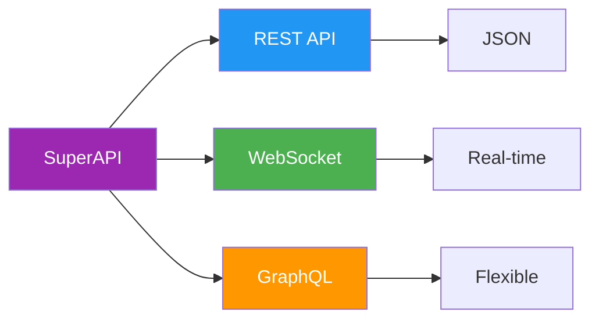
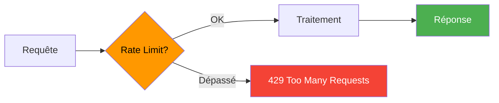
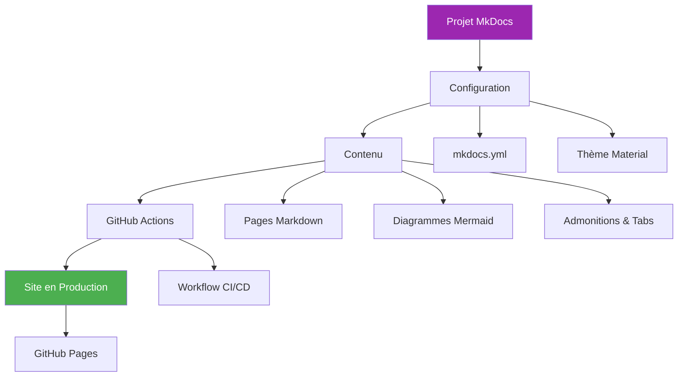

---
tags:
  - mkdocs
  - projet
  - pratique
  - github-pages
---

# TP Final : Créer un Site Complet

**Durée estimée :** 2 heures

---

## Objectif

Créer un site de documentation professionnel de A à Z, en appliquant tout ce que vous avez appris :

- Installation et configuration MkDocs Material
- Structure et navigation
- Contenu avec Mermaid, admonitions, tabs
- Déploiement automatique sur GitHub Pages

---

## Scénario

Vous êtes DevOps dans une startup. Votre mission : créer la documentation technique pour **"SuperAPI"**, une API REST fictive.

Le site doit contenir :

- Page d'accueil
- Guide de démarrage rapide
- Documentation API (endpoints)
- Guide de déploiement
- FAQ / Dépannage

---

## Étape 1 : Initialisation (15 min)

### 1.1 Créer le Projet

```bash
# Créer le dossier
mkdir superapi-docs && cd superapi-docs

# Environnement virtuel
python -m venv venv
source venv/bin/activate  # Windows: .\venv\Scripts\activate

# Installer les dépendances
pip install mkdocs-material mkdocs-glightbox

# Initialiser MkDocs
mkdocs new .

# Créer le requirements.txt
cat > requirements.txt << 'EOF'
mkdocs-material>=9.5
mkdocs-glightbox>=0.4
EOF
```

### 1.2 Structure des Fichiers

```bash
mkdir -p docs/{getting-started,api,deployment,assets/images}
touch docs/getting-started/{index.md,installation.md,quickstart.md}
touch docs/api/{index.md,authentication.md,endpoints.md}
touch docs/deployment/{index.md,docker.md,kubernetes.md}
touch docs/faq.md
```

Structure finale :

```text
superapi-docs/
├── docs/
│   ├── index.md
│   ├── faq.md
│   ├── getting-started/
│   │   ├── index.md
│   │   ├── installation.md
│   │   └── quickstart.md
│   ├── api/
│   │   ├── index.md
│   │   ├── authentication.md
│   │   └── endpoints.md
│   ├── deployment/
│   │   ├── index.md
│   │   ├── docker.md
│   │   └── kubernetes.md
│   └── assets/
│       └── images/
├── mkdocs.yml
└── requirements.txt
```

---

## Étape 2 : Configuration (20 min)

### 2.1 mkdocs.yml Complet

```yaml
site_name: SuperAPI Documentation
site_url: https://votreuser.github.io/superapi-docs/
site_author: Votre Nom
site_description: Documentation officielle de SuperAPI - API REST haute performance

repo_name: votreuser/superapi-docs
repo_url: https://github.com/votreuser/superapi-docs
edit_uri: edit/main/docs/

theme:
  name: material
  language: fr
  palette:
    - scheme: default
      primary: deep purple
      accent: amber
      toggle:
        icon: material/brightness-7
        name: Mode sombre
    - scheme: slate
      primary: deep purple
      accent: amber
      toggle:
        icon: material/brightness-4
        name: Mode clair

  features:
    - navigation.instant
    - navigation.tabs
    - navigation.tabs.sticky
    - navigation.sections
    - navigation.top
    - navigation.footer
    - search.suggest
    - search.highlight
    - content.code.copy
    - content.code.annotate
    - content.tabs.link

  icon:
    repo: fontawesome/brands/github

markdown_extensions:
  - admonition
  - pymdownx.details
  - pymdownx.superfences:
      custom_fences:
        - name: mermaid
          class: mermaid
          format: !!python/name:pymdownx.superfences.fence_code_format
  - pymdownx.tabbed:
      alternate_style: true
  - pymdownx.highlight:
      anchor_linenums: true
  - pymdownx.inlinehilite
  - tables
  - attr_list
  - md_in_html
  - toc:
      permalink: true

plugins:
  - search:
      lang: fr
  - glightbox

nav:
  - Accueil: index.md
  - Démarrage:
      - Vue d'ensemble: getting-started/index.md
      - Installation: getting-started/installation.md
      - Quickstart: getting-started/quickstart.md
  - API:
      - Vue d'ensemble: api/index.md
      - Authentification: api/authentication.md
      - Endpoints: api/endpoints.md
  - Déploiement:
      - Vue d'ensemble: deployment/index.md
      - Docker: deployment/docker.md
      - Kubernetes: deployment/kubernetes.md
  - FAQ: faq.md
```

---

## Étape 3 : Contenu (45 min)

### 3.1 Page d'Accueil (docs/index.md)

```markdown
---
tags:
  - superapi
  - accueil
---

# SuperAPI Documentation

Bienvenue dans la documentation officielle de **SuperAPI** - votre API REST haute performance pour applications modernes.

---

## Fonctionnalités



| Fonctionnalité | Description |
|----------------|-------------|
| :material-lightning-bolt: **Performance** | < 10ms de latence moyenne |
| :material-shield-check: **Sécurité** | OAuth 2.0, JWT, HTTPS |
| :material-scale-balance: **Scalabilité** | Jusqu'à 100k req/s |
| :material-file-document: **Documentation** | OpenAPI 3.0 |

---

## Démarrage Rapide

=== "cURL"

    ```bash
    curl -X GET https://api.superapi.io/v1/status \
      -H "Authorization: Bearer YOUR_API_KEY"
    ```

=== "Python"

    ```python
    import requests

    response = requests.get(
        "https://api.superapi.io/v1/status",
        headers={"Authorization": "Bearer YOUR_API_KEY"}
    )
    print(response.json())
    ```

=== "JavaScript"

    ```javascript
    const response = await fetch('https://api.superapi.io/v1/status', {
      headers: {
        'Authorization': 'Bearer YOUR_API_KEY'
      }
    });
    const data = await response.json();
    ```

---

## Navigation

<div class="grid cards" markdown>

- :material-download: **Installation**

    Installer SuperAPI en 5 minutes
    → `getting-started/installation.md`

- :material-rocket-launch: **Quickstart**

    Premier appel API en 2 minutes
    → `getting-started/quickstart.md`

- :material-api: **API Reference**

    Documentation complète des endpoints
    → `api/index.md`

- :material-docker: **Déploiement**

    Docker, Kubernetes, Cloud
    → `deployment/index.md`

</div>

---

!!! tip "Besoin d'aide ?"
    Consultez la FAQ (`faq.md`) ou GitHub.
```

### 3.2 Installation (docs/getting-started/installation.md)

```markdown
---
tags:
  - installation
  - setup
---

# Installation

Guide d'installation de SuperAPI sur votre environnement.

---

## Prérequis

- Python 3.10+ ou Node.js 18+
- Docker (optionnel)
- Compte SuperAPI (gratuit)

---

## Méthodes d'Installation

=== "pip (Python)"

    ```bash
    pip install superapi-client
    ```

    Vérification :
    ```bash
    superapi --version
    # superapi-client 2.1.0
    ```

=== "npm (Node.js)"

    ```bash
    npm install @superapi/client
    ```

    Vérification :
    ```bash
    npx superapi --version
    # @superapi/client 2.1.0
    ```

=== "Docker"

    ```bash
    docker pull superapi/client:latest
    ```

    Vérification :
    ```bash
    docker run superapi/client --version
    ```

---

## Configuration

### Obtenir une API Key

1. Créez un compte sur [superapi.io](https://superapi.io)
2. Allez dans **Settings** > **API Keys**
3. Cliquez **Generate New Key**
4. Copiez la clé (elle ne sera plus visible)

!!! warning "Sécurité"
    Ne partagez jamais votre API Key. Ne la commitez pas dans Git.

### Configurer l'Environnement

```bash
# Linux/macOS
export SUPERAPI_KEY="your-api-key-here"

# Windows PowerShell
$env:SUPERAPI_KEY = "your-api-key-here"
```

Ou créez un fichier `.env` :

```text
SUPERAPI_KEY=your-api-key-here
SUPERAPI_ENV=production
```

---

## Vérifier l'Installation

```bash
superapi status
```

Réponse attendue :

```json
{
  "status": "ok",
  "version": "2.1.0",
  "authenticated": true
}
```

---

## Prochaine Étape

→ Quickstart : Premier appel API (`quickstart.md`)
```

### 3.3 Endpoints API (docs/api/endpoints.md)

```markdown
---
tags:
  - api
  - endpoints
  - rest
---

# API Endpoints

Référence complète des endpoints SuperAPI.

---

## Base URL

```text
https://api.superapi.io/v1
```

---

## Authentification

Toutes les requêtes nécessitent un header `Authorization` :

```text
Authorization: Bearer YOUR_API_KEY
```

---

## Endpoints

### GET /status

Vérifie le statut de l'API.

**Requête :**

```bash
curl -X GET https://api.superapi.io/v1/status \
  -H "Authorization: Bearer $SUPERAPI_KEY"
```

**Réponse :**

```json
{
  "status": "ok",
  "timestamp": "2024-01-15T10:30:00Z",
  "version": "2.1.0"
}
```

---

### GET /users

Récupère la liste des utilisateurs.

**Paramètres :**

| Paramètre | Type | Requis | Description |
|-----------|------|--------|-------------|
| `page` | int | Non | Numéro de page (défaut: 1) |
| `limit` | int | Non | Résultats par page (défaut: 20, max: 100) |
| `search` | string | Non | Recherche par nom ou email |

**Requête :**

```bash
curl -X GET "https://api.superapi.io/v1/users?page=1&limit=10" \
  -H "Authorization: Bearer $SUPERAPI_KEY"
```

**Réponse :**

```json
{
  "data": [
    {
      "id": "usr_123",
      "name": "John Doe",
      "email": "john@example.com",
      "created_at": "2024-01-10T08:00:00Z"
    }
  ],
  "pagination": {
    "page": 1,
    "limit": 10,
    "total": 42,
    "pages": 5
  }
}
```

---

### POST /users

Crée un nouvel utilisateur.

**Body :**

```json
{
  "name": "Jane Doe",
  "email": "jane@example.com",
  "role": "user"
}
```

**Requête :**

```bash
curl -X POST https://api.superapi.io/v1/users \
  -H "Authorization: Bearer $SUPERAPI_KEY" \
  -H "Content-Type: application/json" \
  -d '{"name": "Jane Doe", "email": "jane@example.com", "role": "user"}'
```

**Réponse (201 Created) :**

```json
{
  "id": "usr_456",
  "name": "Jane Doe",
  "email": "jane@example.com",
  "role": "user",
  "created_at": "2024-01-15T10:35:00Z"
}
```

---

## Codes de Réponse

| Code | Description |
|------|-------------|
| `200` | Succès |
| `201` | Créé avec succès |
| `400` | Requête invalide |
| `401` | Non authentifié |
| `403` | Accès refusé |
| `404` | Ressource non trouvée |
| `429` | Rate limit dépassé |
| `500` | Erreur serveur |

---

## Rate Limiting



| Plan | Limite |
|------|--------|
| Free | 100 req/min |
| Pro | 1000 req/min |
| Enterprise | Illimité |

!!! warning "Rate Limit Headers"
    ```text
    X-RateLimit-Limit: 100
    X-RateLimit-Remaining: 95
    X-RateLimit-Reset: 1705312800
    ```
```

---

## Étape 4 : Déploiement (20 min)

### 4.1 Créer le Workflow GitHub Actions

```bash
mkdir -p .github/workflows
```

Créez `.github/workflows/deploy.yml` :

```yaml
name: Deploy Documentation

on:
  push:
    branches: [main]
  workflow_dispatch:

permissions:
  contents: write

jobs:
  deploy:
    runs-on: ubuntu-latest
    steps:
      - uses: actions/checkout@v4
        with:
          fetch-depth: 0

      - uses: actions/setup-python@v5
        with:
          python-version: '3.12'

      - name: Install dependencies
        run: pip install -r requirements.txt

      - name: Deploy to GitHub Pages
        run: mkdocs gh-deploy --force
        env:
          GITHUB_TOKEN: ${{ secrets.GITHUB_TOKEN }}
```

### 4.2 Créer le .gitignore

```text
venv/
.venv/
site/
__pycache__/
*.pyc
.env
.DS_Store
```

### 4.3 Push Initial

```bash
git init
git add .
git commit -m "Initial commit: SuperAPI documentation"
git branch -M main
git remote add origin https://github.com/votreuser/superapi-docs.git
git push -u origin main
```

### 4.4 Activer GitHub Pages

1. **Settings** > **Pages**
2. Source: **Deploy from a branch**
3. Branch: **gh-pages** / **/ (root)**
4. **Save**

---

## Étape 5 : Vérification (10 min)

### Checklist Finale

- [ ] Site accessible sur `https://votreuser.github.io/superapi-docs/`
- [ ] Mode clair/sombre fonctionnel
- [ ] Navigation par onglets
- [ ] Recherche fonctionnelle
- [ ] Diagrammes Mermaid rendus
- [ ] Admonitions stylées
- [ ] Tabs de contenu (cURL/Python/JS)
- [ ] Bouton "Edit on GitHub" visible

### Test Local

```bash
mkdocs serve
# Ouvrir http://localhost:8000
```

### Vérifications

```bash
# Build strict (détecte les erreurs)
mkdocs build --strict

# Vérifier les liens cassés
# (installer: pip install linkchecker)
linkchecker http://localhost:8000
```

---

## Bonus : Améliorations

### Ajouter un Logo

1. Placez votre logo dans `docs/assets/images/logo.png`
2. Ajoutez dans `mkdocs.yml` :

```yaml
theme:
  logo: assets/images/logo.png
  favicon: assets/images/favicon.ico
```

### Ajouter des Analytics

```yaml
extra:
  analytics:
    provider: google
    property: G-XXXXXXXXXX
```

### Ajouter un Footer Personnalisé

```yaml
extra:
  social:
    - icon: fontawesome/brands/github
      link: https://github.com/votreuser
    - icon: fontawesome/brands/twitter
      link: https://twitter.com/votreuser
```

---

## Récapitulatif

Vous avez créé :



---

## Ressources Complémentaires

| Ressource | Lien |
|-----------|------|
| Code source du TP | [GitHub Template](https://github.com/mkdocs-material/create-site) |
| MkDocs Material Docs | [squidfunk.github.io/mkdocs-material](https://squidfunk.github.io/mkdocs-material/) |
| Mermaid Live Editor | [mermaid.live](https://mermaid.live/) |
| GitHub Pages Docs | [docs.github.com/pages](https://docs.github.com/en/pages) |

---

!!! success "Félicitations !"
    Vous avez terminé la formation MkDocs ! Vous savez maintenant créer des sites de documentation professionnels avec :

    - **MkDocs Material** pour le design
    - **Mermaid** pour les diagrammes
    - **GitHub Actions** pour le déploiement automatique
    - **GitHub Pages** pour l'hébergement gratuit

    Continuez à explorer les fonctionnalités avancées et créez vos propres documentations !
