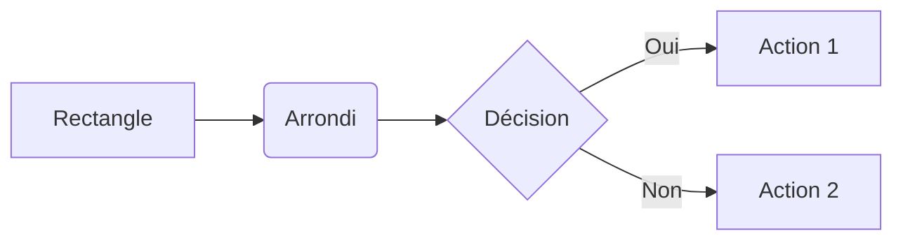
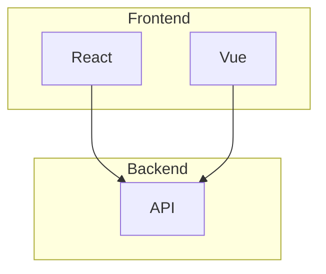
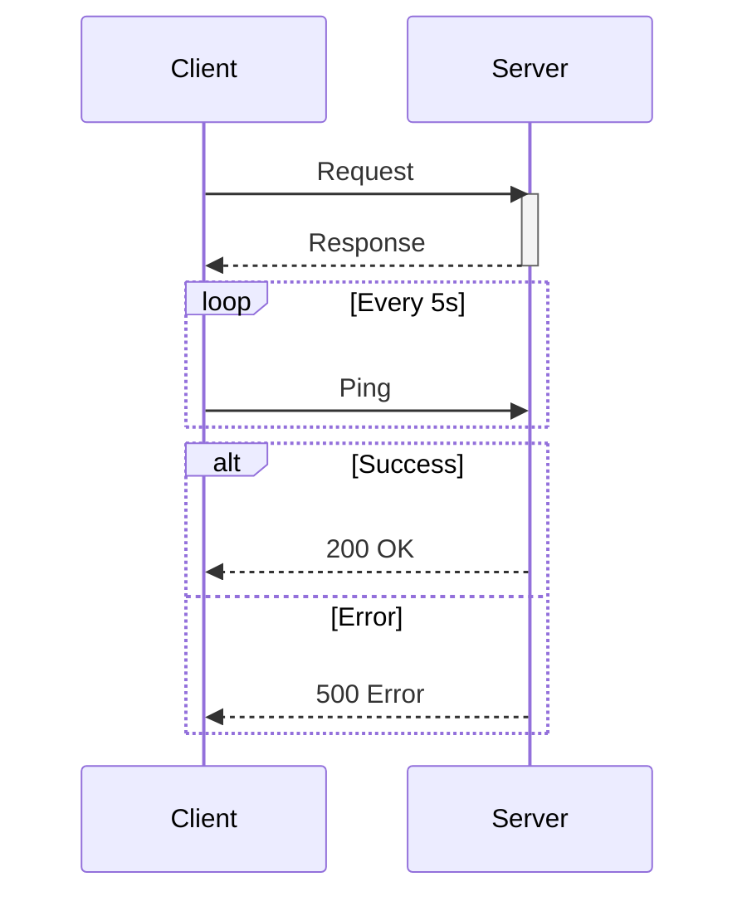
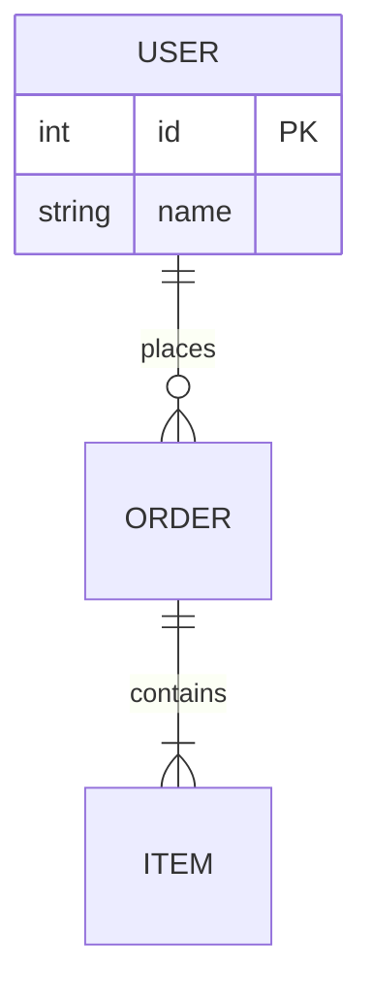
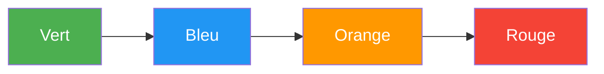
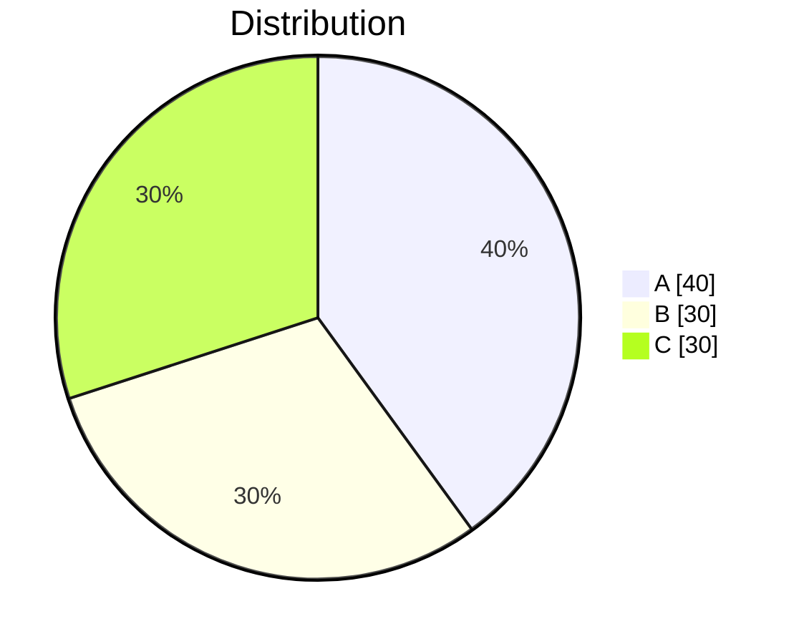
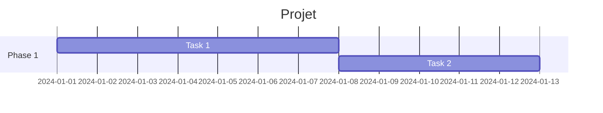
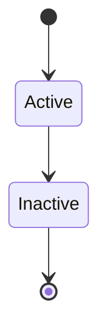

---
tags:
  - mkdocs
  - cheatsheet
  - reference
  - mermaid
---

# Cheatsheet MkDocs & Mermaid

Référence rapide pour MkDocs Material et Mermaid.

---

## Commandes MkDocs

```bash
# === INSTALLATION ===
pip install mkdocs-material          # Installer MkDocs + Material
mkdocs new mon-projet                # Créer un projet
mkdocs --version                     # Vérifier version

# === DÉVELOPPEMENT ===
mkdocs serve                         # Serveur local (localhost:8000)
mkdocs serve -a 0.0.0.0:8080         # Port personnalisé
mkdocs serve --open                  # Ouvrir navigateur auto

# === BUILD ===
mkdocs build                         # Générer site statique
mkdocs build --strict                # Mode strict (warnings = erreurs)
mkdocs build --clean                 # Nettoyer avant build

# === DÉPLOIEMENT ===
mkdocs gh-deploy                     # Déployer sur GitHub Pages
mkdocs gh-deploy --force             # Forcer le déploiement
```

---

## Structure Projet

```text
mon-projet/
├── docs/
│   ├── index.md              # Page d'accueil
│   ├── assets/
│   │   ├── images/
│   │   └── stylesheets/
│   └── guides/
│       └── exemple.md
├── mkdocs.yml                # Configuration
├── requirements.txt          # Dépendances Python
└── .github/
    └── workflows/
        └── deploy.yml        # GitHub Actions
```

---

## Configuration mkdocs.yml

```yaml
# === SITE ===
site_name: Mon Site
site_url: https://user.github.io/repo/
site_author: Nom

# === THEME ===
theme:
  name: material
  language: fr
  palette:
    - scheme: default
      primary: indigo
      accent: amber
      toggle:
        icon: material/brightness-7
        name: Mode sombre
    - scheme: slate
      primary: indigo
      accent: amber
      toggle:
        icon: material/brightness-4
        name: Mode clair
  features:
    - navigation.instant
    - navigation.tabs
    - navigation.top
    - search.highlight
    - content.code.copy

# === EXTENSIONS ===
markdown_extensions:
  - admonition
  - pymdownx.details
  - pymdownx.superfences:
      custom_fences:
        - name: mermaid
          class: mermaid
          format: !!python/name:pymdownx.superfences.fence_code_format
  - pymdownx.tabbed:
      alternate_style: true
  - pymdownx.highlight:
      anchor_linenums: true
  - tables

# === PLUGINS ===
plugins:
  - search:
      lang: fr

# === NAVIGATION ===
nav:
  - Accueil: index.md
  - Guides:
      - Guide 1: guides/guide1.md
      - Guide 2: guides/guide2.md
```

---

## Markdown Basique

```markdown
# Titre H1
## Titre H2
### Titre H3

**gras** et *italique* et `code`

- Liste
- Non ordonnée

1. Liste
2. Ordonnée

[Lien](https://example.com)


| Col 1 | Col 2 |
|-------|-------|
| A     | B     |

---  (séparateur)
```

---

## Admonitions

```markdown
!!! note "Titre"
    Contenu de la note.

!!! tip "Astuce"
    Conseil utile.

!!! warning "Attention"
    Avertissement.

!!! danger "Danger"
    Risque critique.

!!! info "Information"
    Info importante.

!!! success "Succès"
    Opération réussie.

!!! example "Exemple"
    Exemple pratique.

??? note "Pliable (fermé)"
    Contenu caché.

???+ note "Pliable (ouvert)"
    Contenu visible.
```

---

## Onglets (Tabs)

```markdown
=== "Linux"

    ```bash
    apt install package
    ```

=== "Windows"

    ```powershell
    choco install package
    ```

=== "macOS"

    ```bash
    brew install package
    ```
```

---

## Blocs de Code

````markdown
```python
print("Hello")
```

```bash
echo "Hello"
```

```yaml
key: value
```

```json
{"key": "value"}
```
````

**Langages courants :** `bash`, `python`, `yaml`, `json`, `powershell`, `dockerfile`, `sql`, `javascript`, `go`, `rust`

---

## Mermaid - Flowchart

```text

```

**Directions :** `LR` (gauche→droite), `RL`, `TB`/`TD` (haut→bas), `BT`

**Formes :**

| Syntaxe | Forme |
|---------|-------|
| `[texte]` | Rectangle |
| `(texte)` | Arrondi |
| `{texte}` | Losange (décision) |
| `[(texte)]` | Cylindre (DB) |
| `((texte))` | Cercle |

**Flèches :**

| Syntaxe | Type |
|---------|------|
| `-->` | Flèche |
| `---` | Ligne |
| `-.->` | Pointillé |
| `==>` | Épaisse |
| `--texte-->` | Avec label |

---

## Mermaid - Subgraph

```text

```

---

## Mermaid - Séquence

```text

```

**Flèches :**

| Syntaxe | Type |
|---------|------|
| `->>` | Synchrone |
| `-->>` | Réponse |
| `-)` | Async |
| `-x` | Erreur |

---

## Mermaid - Diagramme ER

```text

```

---

## Mermaid - Styling

```text

```

**Palette ShellBook :**

| Couleur | Hex | Usage |
|---------|-----|-------|
| Vert | `#4CAF50` | Succès, Débutant |
| Bleu | `#2196F3` | Info, Intermédiaire |
| Orange | `#FF9800` | Warning, Avancé |
| Violet | `#9C27B0` | Expert |
| Rouge | `#f44336` | Erreur, Danger |

**Classes CSS :**

```text
classDef success fill:#4CAF50,color:#fff
classDef warning fill:#FF9800,color:#fff

class A,B success
class C warning
```

---

## Mermaid - Autres Types

```text
# Pie Chart


# Gantt


# State Diagram

```

---

## GitHub Actions Workflow

```yaml
name: Deploy MkDocs

on:
  push:
    branches: [main]

permissions:
  contents: write

jobs:
  deploy:
    runs-on: ubuntu-latest
    steps:
      - uses: actions/checkout@v4
        with:
          fetch-depth: 0

      - uses: actions/setup-python@v5
        with:
          python-version: '3.12'

      - run: pip install -r requirements.txt

      - run: mkdocs gh-deploy --force
        env:
          GITHUB_TOKEN: ${{ secrets.GITHUB_TOKEN }}
```

---

## Fichiers Essentiels

**requirements.txt :**

```text
mkdocs-material>=9.5
```

**.gitignore :**

```text
venv/
site/
__pycache__/
.env
```

---

## Raccourcis VS Code

| Raccourci | Action |
|-----------|--------|
| `Ctrl+Shift+V` | Prévisualiser Markdown |
| `Ctrl+K V` | Preview côte-à-côte |
| `Ctrl+Space` | Autocomplétion |

---

## Ressources

| Ressource | URL |
|-----------|-----|
| MkDocs | [mkdocs.org](https://www.mkdocs.org/) |
| Material | [squidfunk.github.io/mkdocs-material](https://squidfunk.github.io/mkdocs-material/) |
| Mermaid | [mermaid.js.org](https://mermaid.js.org/) |
| Mermaid Live | [mermaid.live](https://mermaid.live/) |
