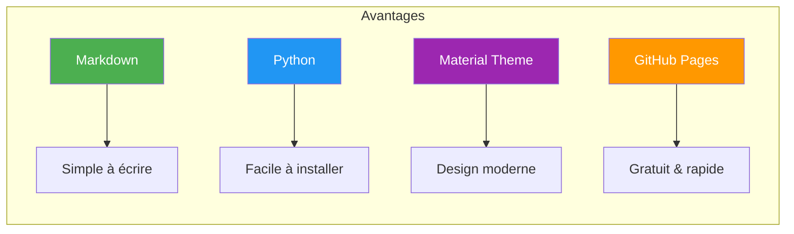

---
tags:
  - formation
  - mkdocs
  - documentation
  - github-pages
  - mermaid
---

# MkDocs : Créer un Site de Documentation Professionnel

## Objectifs de cette Formation

À l'issue de ce parcours, vous serez capable de :

- **Installer et configurer MkDocs** avec le thème Material
- **Déployer sur GitHub Pages** avec un pipeline automatisé
- **Créer des diagrammes Mermaid** professionnels
- **Personnaliser** le thème, la navigation et les fonctionnalités
- **Mettre en pratique** avec un projet complet de A à Z

## Pourquoi MkDocs ?

| Critère | MkDocs | Sphinx | Docusaurus | GitBook |
|---------|--------|--------|------------|---------|
| **Langage** | Markdown | reStructuredText | MDX | Markdown |
| **Installation** | `pip install` | Complexe | `npm install` | SaaS |
| **Courbe d'apprentissage** | Très facile | Difficile | Moyenne | Très facile |
| **Personnalisation** | Excellente | Excellente | Bonne | Limitée |
| **Performance** | Rapide | Moyen | Rapide | Variable |
| **Coût** | Gratuit | Gratuit | Gratuit | Payant |

## Public Cible

Cette formation s'adresse aux :

- **DevOps / SRE** souhaitant documenter leurs infrastructures
- **Développeurs** créant de la documentation technique
- **Technical Writers** cherchant un outil moderne
- **Équipes** voulant adopter le Docs-as-Code

**Niveau requis :** Débutant (connaissance basique du terminal)

## Prérequis

!!! info "Avant de Commencer"
    - **Python 3.8+** installé
    - **Git** configuré avec un compte GitHub
    - **Éditeur de texte** (VS Code recommandé)
    - **Terminal** (Bash, PowerShell ou Zsh)

## Programme

### Module 1 : Installation & Premier Site (30 min)

**Objectif :** Installer MkDocs et créer votre premier site en 5 minutes.

**Contenu :**

- Installation de MkDocs et Material
- Création d'un projet
- Configuration de base (`mkdocs.yml`)
- Prévisualisation locale
- Structure des fichiers

[:octicons-arrow-right-24: Accéder au Module 1](01-module.md)

---

### Module 2 : Déploiement GitHub Pages (45 min)

**Objectif :** Publier automatiquement votre documentation sur GitHub Pages.

**Contenu :**

- Création du repository GitHub
- Configuration du workflow GitHub Actions
- Déploiement automatique sur push
- Domaine personnalisé (optionnel)
- Gestion des versions

[:octicons-arrow-right-24: Accéder au Module 2](02-module.md)

---

### Module 3 : Mermaid - Diagrammes Professionnels (1h)

**Objectif :** Maîtriser les diagrammes Mermaid pour une documentation visuelle.

**Contenu :**

- Flowcharts et organigrammes
- Diagrammes de séquence
- Diagrammes d'architecture
- Styling et couleurs
- Bonnes pratiques

[:octicons-arrow-right-24: Accéder au Module 3](03-module.md)

---

### Module 4 : Configuration Avancée (1h)

**Objectif :** Personnaliser MkDocs Material pour un site professionnel.

**Contenu :**

- Thème et couleurs
- Navigation avancée
- Plugins essentiels
- Admonitions et tabs
- SEO et analytics

[:octicons-arrow-right-24: Accéder au Module 4](04-module.md)

---

### TP Final : Projet Complet (2h)

**Objectif :** Créer un site de documentation complet de A à Z.

**Contenu :**

- Planification du projet
- Structure et navigation
- Contenu avec diagrammes
- Déploiement production
- Checklist qualité

[:octicons-arrow-right-24: Accéder au TP Final](05-tp-final.md)

---

## Ressources

| Ressource | Description |
|-----------|-------------|
| [MkDocs Documentation](https://www.mkdocs.org/) | Documentation officielle |
| [Material for MkDocs](https://squidfunk.github.io/mkdocs-material/) | Thème Material |
| [Mermaid Live Editor](https://mermaid.live/) | Éditeur de diagrammes en ligne |
| [GitHub Pages Docs](https://docs.github.com/en/pages) | Documentation GitHub Pages |

---

!!! success "Prêt à Commencer ?"
    Lancez-vous avec le [Module 1 : Installation](01-module.md) !
