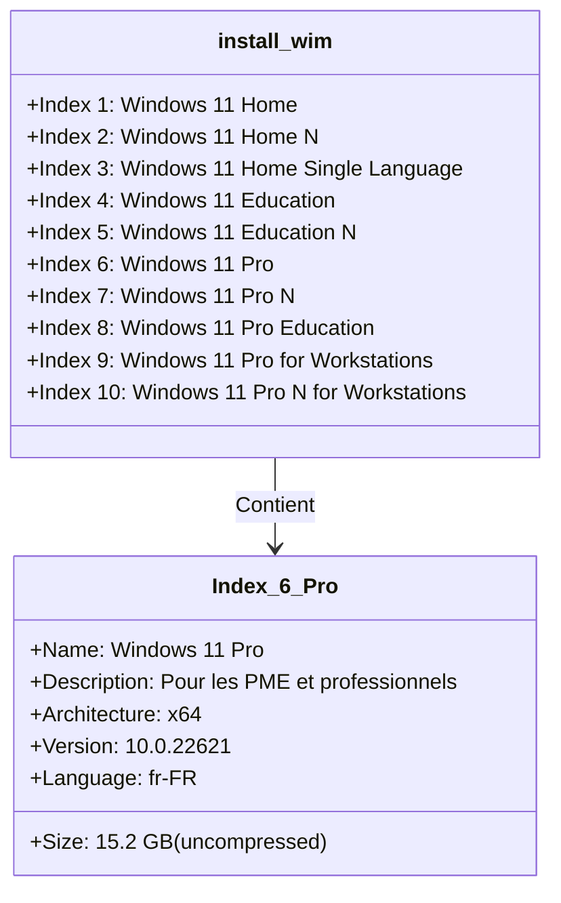
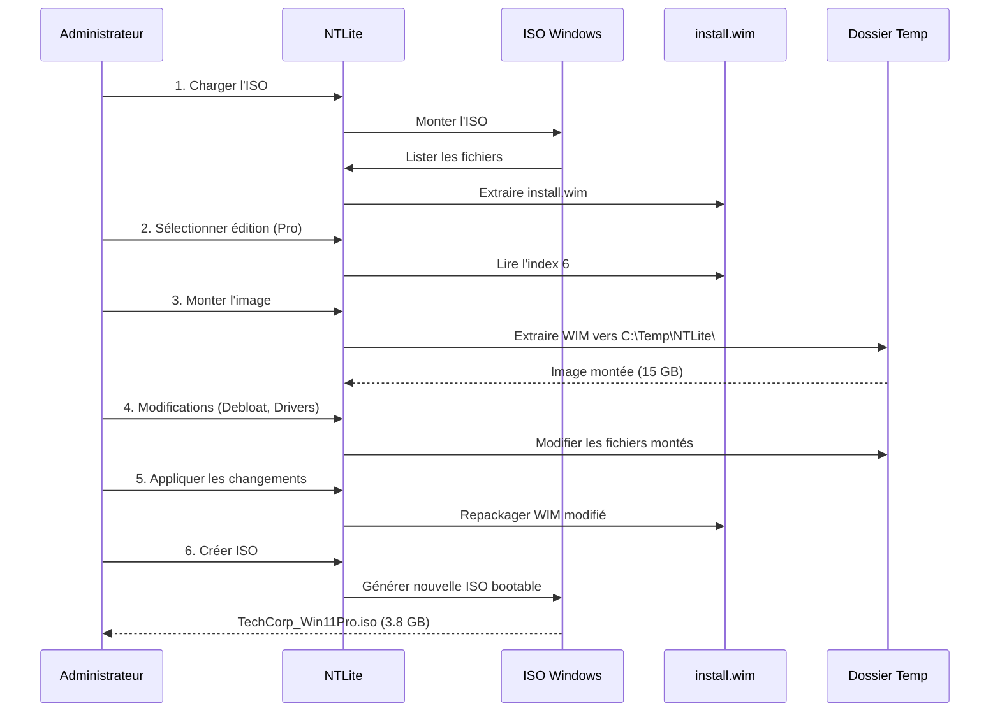

---
tags:
  - ntlite
  - windows
  - wim
  - iso
  - image
---

# Module 1 : Prise en main & Architecture WIM

## Introduction

> **"Garbage In, Garbage Out."**
>
> Si vous déployez une ISO Windows standard, vous déployez aussi ses 40+ applications inutiles, ses services non optimisés et ses 25 GB de bloatware. **NTLite vous permet de créer l'image parfaite AVANT le premier démarrage.**

**Pourquoi les ISOs standard sont problématiques :**

| Problème | Impact | Solution NTLite |
|----------|--------|-----------------|
| **Bloatware pré-installé** | Candy Crush, Xbox, Cortana, OneDrive | Suppression complète avant installation |
| **Empreinte disque excessive** | Windows 11 = 25-30 GB après installation | Réduction à 10-15 GB avec debloating |
| **Drivers manquants** | Pas de réseau après installation (WiFi, Ethernet) | Intégration des drivers dans l'ISO |
| **Mises à jour post-installation** | 2-3 heures d'attente après OOBE | Updates intégrés directement dans l'image |
| **Configuration manuelle** | OOBE, création compte, paramètres régionaux | Automatisation complète avec Unattended |

**Objectif de ce module :**

À la fin de ce module, vous serez capable de :

- ✅ Comprendre l'architecture des images Windows (ISO, WIM, ESD)
- ✅ Charger une ISO Windows dans NTLite
- ✅ Monter une image WIM pour modification
- ✅ Naviguer dans l'interface NTLite
- ✅ Identifier et sélectionner la bonne édition Windows

---

## Concept : Les Formats d'Image Windows

### Vue d'ensemble du workflow


### Les 3 formats d'image Windows

#### 1. ISO (Image disque bootable)

**Définition :** Un fichier `.iso` est une **image disque complète** d'un DVD/USB bootable Windows.

**Contenu d'une ISO Windows :**

```text
Windows11_23H2.iso (5.1 GB)
├── boot/              # Fichiers de démarrage (UEFI, BIOS)
├── efi/               # Bootloader UEFI
├── sources/           # Cœur de l'installation
│   ├── boot.wim       # Environnement de pré-installation (WinPE)
│   └── install.wim    # L'IMAGE WINDOWS (Toutes les éditions)
├── setup.exe          # Programme d'installation
└── autorun.inf        # Lancement automatique
```

**Points clés :**

- L'ISO contient **TOUT** pour démarrer et installer Windows
- Le fichier **`install.wim`** (ou `install.esd`) est l'élément principal
- Taille typique : 4-6 GB pour Windows 10/11

#### 2. WIM (Windows Imaging Format)

**Définition :** Le format `.wim` est un **conteneur d'images** développé par Microsoft pour stocker plusieurs éditions Windows dans un seul fichier.

**Architecture d'un fichier WIM :**



**Caractéristiques WIM :**

| Propriété | Détail |
|-----------|--------|
| **Multi-index** | 1 fichier WIM = 10+ éditions Windows |
| **Compression** | LZX (défaut), XPRESS (rapide), ou sans compression |
| **Montage** | Peut être monté comme un disque virtuel |
| **Modification** | DISM ou NTLite peuvent modifier le contenu |
| **Single-instancing** | Fichiers identiques stockés une seule fois (déduplication) |

**Exemple de listing des index :**

```powershell
# Lister les éditions dans install.wim
dism /Get-WimInfo /WimFile:"C:\mount\sources\install.wim"

# Sortie typique :
Index : 1
Name : Windows 11 Home
Description : Pour les particuliers
Size : 14,832,567,234 bytes

Index : 6
Name : Windows 11 Pro
Description : Pour les professionnels et PME
Size : 15,234,789,123 bytes
```

#### 3. ESD (Electronic Software Download)

**Définition :** Le format `.esd` est une **version compressée et cryptée** du WIM, utilisé par Microsoft pour les téléchargements via Windows Update.

**Comparaison WIM vs ESD :**

| Critère | WIM | ESD |
|---------|-----|-----|
| **Compression** | LZX standard (~40%) | Recovery compression (~60%) |
| **Taille** | install.wim = 4.5 GB | install.esd = 3.2 GB |
| **Cryptage** | Non crypté | Crypté (Microsoft uniquement) |
| **Éditable** | ✅ DISM, NTLite | ⚠️ Doit être converti en WIM d'abord |
| **Performance** | Extraction rapide | Extraction lente (décryptage) |
| **Usage** | Media Creation Tool, ISOs entreprise | Windows Update, OEM |

**Conversion ESD → WIM (avec DISM) :**

```powershell
# Exporter l'index 6 (Pro) depuis ESD vers WIM
dism /Export-Image /SourceImageFile:"install.esd" /SourceIndex:6 /DestinationImageFile:"install.wim" /Compress:max /CheckIntegrity
```

**Note :** NTLite peut charger directement les ESD, mais il les convertit automatiquement en WIM en arrière-plan pour les modifications.

---

### Workflow complet : De l'ISO à l'ISO modifiée



**Étapes détaillées :**

1. **Chargement ISO** : NTLite monte l'ISO et identifie `sources\install.wim`
2. **Sélection édition** : L'utilisateur choisit l'index (ex: Index 6 = Pro)
3. **Montage** : NTLite extrait l'image dans un dossier temporaire (15-20 GB)
4. **Modifications** : Suppression d'apps, intégration de drivers, updates
5. **Application** : NTLite repackage l'image modifiée en WIM
6. **Création ISO** : Génération d'une nouvelle ISO bootable

**Temps typiques (PC moderne) :**

- Montage : 3-5 minutes
- Modifications : Variable (5-30 minutes selon actions)
- Démontage + création ISO : 10-15 minutes

---

## Pratique : Interface NTLite

### Prérequis

Avant de commencer, assurez-vous d'avoir :

- ✅ **NTLite** installé (version Free ou Pro) : [https://ntlite.com](https://ntlite.com)
- ✅ **ISO Windows 10/11** téléchargée via [Media Creation Tool](https://www.microsoft.com/software-download)
- ✅ **100 GB d'espace disque libre** (SSD recommandé)
- ✅ **Droits administrateur** (NTLite nécessite les privilèges élevés)

---

### Étape 1 : Télécharger une ISO Windows

**Option A : Media Creation Tool (Recommandé pour Windows 10/11)**

1. Télécharger l'outil : [https://www.microsoft.com/software-download/windows11](https://www.microsoft.com/software-download/windows11)
2. Exécuter `MediaCreationTool.exe`
3. Sélectionner **"Créer un support d'installation"**
4. Choisir :
   - Langue : **Français (France)**
   - Édition : **Windows 11** (contient toutes les éditions)
   - Architecture : **64-bit (x64)**
5. Format : **Fichier ISO**
6. Sauvegarder : `C:\ISOs\Windows11_23H2_French_x64.iso` (5.1 GB)

**Option B : Téléchargement direct (Windows 11 uniquement)**

```powershell
# Télécharger avec PowerShell
$Url = "https://software.download.prss.microsoft.com/dbazure/Win11_23H2_French_x64.iso?t=<token>"
Invoke-WebRequest -Uri $Url -OutFile "C:\ISOs\Windows11.iso"
```

---

### Étape 2 : Lancer NTLite

1. **Démarrer NTLite** (clic droit → Exécuter en tant qu'administrateur)
2. **Interface principale** :

```text
┌─────────────────────────────────────────────────────────────┐
│ NTLite 2024.11                                     [_][□][X]│
├─────────────────┬───────────────────────────────────────────┤
│ Image history   │                                           │
│                 │         No image loaded                   │
│ (vide)          │                                           │
│                 │    [Add] [Image directory] [ISO]          │
│                 │                                           │
│                 │                                           │
│                 │                                           │
├─────────────────┴───────────────────────────────────────────┤
│ Status: Ready                                               │
└─────────────────────────────────────────────────────────────┘
```

**Zones de l'interface :**

- **Image history** (gauche) : Liste des images chargées
- **Panneau central** : Configuration et modifications
- **Barre d'état** (bas) : Progression des opérations

---

### Étape 3 : Charger une ISO

**Méthode 1 : Via le bouton "Add"**

1. Cliquer sur **"Add"** → **"Image file (ISO, WIM, ESD, SWM)"**
2. Naviguer vers `C:\ISOs\Windows11_23H2_French_x64.iso`
3. Sélectionner l'ISO → **Ouvrir**

**Méthode 2 : Glisser-déposer**

1. Ouvrir l'explorateur Windows
2. Glisser l'ISO directement dans NTLite

**Résultat :**

NTLite analyse l'ISO et affiche la structure :

```text
Image history
├── 📀 Windows11_23H2_French_x64.iso
    ├── 🔧 boot.wim
    │   └── Index 2: Microsoft Windows PE (x64)
    └── 💿 install.wim
        ├── Index 1: Windows 11 Home
        ├── Index 2: Windows 11 Home N
        ├── Index 3: Windows 11 Home Single Language
        ├── Index 4: Windows 11 Education
        ├── Index 5: Windows 11 Education N
        ├── Index 6: Windows 11 Pro ⭐
        ├── Index 7: Windows 11 Pro N
        ├── Index 8: Windows 11 Pro Education
        ├── Index 9: Windows 11 Pro for Workstations
        └── Index 10: Windows 11 Pro N for Workstations
```

**Note :** `boot.wim` est l'environnement WinPE (Windows Preinstallation Environment). On modifie généralement **install.wim** uniquement.

---

### Étape 4 : Sélectionner une édition

**Scénario :** Nous voulons personnaliser **Windows 11 Pro** (l'édition la plus courante en entreprise).

**Actions :**

1. Dans **Image history**, développer `install.wim`
2. **Double-cliquer** sur **"Index 6: Windows 11 Pro"**
3. NTLite charge les métadonnées de l'édition

**Informations affichées :**

```text
┌─────────────────────────────────────────────────────────────┐
│ Windows 11 Pro                                              │
├─────────────────────────────────────────────────────────────┤
│ Name:          Windows 11 Pro                               │
│ Description:   Pour les professionnels et les PME           │
│ Architecture:  x64                                          │
│ Version:       10.0.22621.2715 (23H2)                       │
│ Languages:     fr-FR (Français - France)                    │
│ Size:          15,234,789,123 bytes (14.2 GB uncompressed)  │
│ Created:       2023-11-14 12:34:56                          │
└─────────────────────────────────────────────────────────────┘
```

**Décryptage des champs :**

| Champ | Signification |
|-------|---------------|
| **Name** | Nom de l'édition (Home, Pro, Enterprise, Education) |
| **Architecture** | x64 (64-bit) ou x86 (32-bit, obsolète) |
| **Version** | Build Windows (22621 = Windows 11 23H2) |
| **Languages** | Langue(s) installée(s) dans l'image |
| **Size** | Taille décompressée (≠ taille du WIM compressé) |

---

### Étape 5 : Monter l'image

**Pourquoi monter l'image ?**

Pour modifier une image WIM, NTLite doit :

1. **Extraire** le contenu complet de l'index sélectionné
2. **Monter** les fichiers dans un dossier temporaire (comme un disque virtuel)
3. Permettre les **modifications** (suppression d'apps, ajout de drivers)
4. **Démonter** et repackager en WIM modifié

**Actions :**

1. Sélectionner **"Index 6: Windows 11 Pro"**
2. Cliquer sur **"Load"** (en bas à droite)
3. **Popup de confirmation** :

```text
┌────────────────────────────────────────────────────────┐
│ Load image                                             │
├────────────────────────────────────────────────────────┤
│ Mount directory:                                       │
│ [C:\Temp\NTLite\Win11Pro_23H2]         [Browse...]     │
│                                                        │
│ ☑ Enable direct write mode (faster, requires admin)   │
│ ☐ Keep mounted after applying changes                 │
│                                                        │
│              [Load]                [Cancel]            │
└────────────────────────────────────────────────────────┘
```

4. **Vérifier le dossier de montage** (par défaut : `C:\Temp\NTLite\`)
5. Cocher **"Enable direct write mode"** (recommandé pour performance)
6. Cliquer **"Load"**

**Progression :**

```text
Status: Mounting image...
[████████████████████████████████████████] 100%
- Extracting install.wim index 6
- Mounting to C:\Temp\NTLite\Win11Pro_23H2
- Loading component database
- Indexing files (125,432 files)

Time elapsed: 3m 24s
```

**Résultat :**

L'image est maintenant **montée** et les onglets de configuration apparaissent :

```text
Image history
├── 📀 Windows11_23H2_French_x64.iso
    └── 💿 install.wim
        └── ✅ Index 6: Windows 11 Pro (MOUNTED)

Tabs disponibles :
[OS packages] [Drivers] [Updates] [Unattended] [Apply]
```

---

### Étape 6 : Explorer l'interface de modification

Une fois l'image montée, NTLite affiche plusieurs **onglets** pour personnaliser l'image.

#### Onglet "OS packages" (Composants)

**Description :** Supprimer ou désactiver des composants Windows.

**Structure :**

```text
OS packages
├── 📦 Applications
│   ├── ☑ 3D Viewer
│   ├── ☑ Alarms & Clock
│   ├── ☑ Calculator
│   ├── ☑ Camera
│   ├── ☑ Cortana ⚠️
│   ├── ☑ Get Help
│   ├── ☑ Microsoft Edge ⚠️
│   ├── ☑ Microsoft News
│   ├── ☑ Microsoft Solitaire Collection
│   ├── ☑ OneDrive ⚠️
│   ├── ☑ Paint 3D
│   ├── ☑ Skype
│   ├── ☑ Xbox Console Companion
│   └── ...
├── 🧩 System
│   ├── ☑ Internet Explorer 11
│   ├── ☑ Windows Media Player
│   ├── ☑ Windows Hello Face
│   └── ...
└── 🌐 Languages
    └── ☑ French (France)
```

**Actions possibles :**

- ✅ **Cocher** = Composant **supprimé** de l'image
- ⬜ **Décocher** = Composant **conservé**

**Attention :** Supprimer certains composants peut casser Windows (voir Module 2).

#### Onglet "Drivers"

**Description :** Intégrer des drivers dans l'image.

**Exemple :**

```text
Drivers
├── 📁 Add drivers folder
└── 📂 Installed drivers
    ├── Intel WiFi 6E AX210 (v22.180.0)
    ├── Realtek Ethernet Controller (v10.053)
    └── NVIDIA GeForce RTX 3080 (v528.49)
```

**Usage :** On verra l'intégration de drivers dans le **Module 3**.

#### Onglet "Updates"

**Description :** Intégrer les mises à jour cumulatives.

**Exemple :**

```text
Updates
├── 📥 Add update packages
└── 📦 Integrated updates
    └── 2024-01 Cumulative Update for Windows 11 (KB5034123)
```

**Usage :** Intégration des Cumulative Updates dans le **Module 3**.

#### Onglet "Unattended"

**Description :** Créer un fichier `autounattend.xml` pour automatiser l'installation.

**Exemple de configuration :**

```text
Unattended
├── 👤 User accounts
│   └── Create local account: "Admin" (password: P@ssw0rd)
├── 🌍 Regional settings
│   ├── Keyboard layout: French (AZERTY)
│   └── Time zone: Romance Standard Time (Paris)
├── 💾 Disk configuration
│   └── Auto-partition (GPT, single partition)
└── 📜 Post-setup scripts
    └── C:\Scripts\install-chocolatey.ps1
```

**Usage :** Automatisation complète dans le **Module 4**.

#### Onglet "Apply"

**Description :** Appliquer les modifications et créer l'ISO finale.

**Options :**

```text
Apply
├── ☑ Process
│   └── Mode: In-place (modify existing WIM)
├── ☑ Create ISO
│   ├── Filename: C:\ISOs\Win11Pro_Custom.iso
│   ├── Label: Win11Pro_Custom
│   └── Bootable: ✅ UEFI + BIOS
└── [Apply] [Reset]
```

---

### Étape 7 : Démonter l'image (sans modifications pour l'instant)

Pour l'instant, nous allons **démonter sans appliquer de changements** (test de workflow).

**Actions :**

1. Clic droit sur **"Index 6: Windows 11 Pro (MOUNTED)"**
2. Sélectionner **"Unmount"**
3. Choisir **"Discard changes"** (ne pas sauvegarder)

**Résultat :**

```text
Status: Unmounting image...
[████████████████████████████████████████] 100%
- Cleaning mount directory
- Releasing locks

Time elapsed: 1m 12s
Image unmounted successfully.
```

---

## Exercice : Première Extraction

### Scénario

Vous êtes technicien IT chez **InnovTech** (PME de 50 employés). Votre manager vous demande de préparer une image Windows 11 Pro personnalisée pour les nouveaux laptops.

**Mission :** Avant de personnaliser, vous devez identifier la bonne édition dans l'ISO fournie.

**Objectifs :**

1. ✅ Télécharger ou utiliser une ISO Windows 10/11
2. ✅ Charger l'ISO dans NTLite
3. ✅ Identifier l'index de **Windows 11 Pro** ou **Windows 10 Pro**
4. ✅ Afficher les informations de l'édition (version, taille, langue)
5. ✅ (Bonus) Monter l'image et explorer le dossier temporaire

**Informations à récupérer :**

| Information | Valeur à trouver |
|-------------|------------------|
| Nom de l'ISO | (ex: Windows11_23H2_French_x64.iso) |
| Index de l'édition Pro | (ex: Index 6) |
| Version du build | (ex: 10.0.22621.2715) |
| Taille décompressée | (ex: 14.2 GB) |
| Langue(s) | (ex: fr-FR) |
| Nombre total d'éditions dans install.wim | (ex: 10 éditions) |

**Livrables :**

- Capture d'écran de NTLite montrant l'arborescence `install.wim` avec les index
- Copie des métadonnées de l'édition Pro

**Temps estimé :** 30 minutes

---

### Solution

??? note "Solution de l'exercice - Cliquer pour afficher"

    ### Étape 1 : Télécharger l'ISO

    **Option recommandée : Media Creation Tool**

    1. Télécharger depuis [https://www.microsoft.com/software-download/windows11](https://www.microsoft.com/software-download/windows11)
    2. Exécuter `MediaCreationTool.exe` → **"Créer un support d'installation"**
    3. Paramètres :
       - Langue : **Français (France)**
       - Édition : **Windows 11**
       - Architecture : **64-bit (x64)**
    4. Format : **Fichier ISO**
    5. Sauvegarder : `C:\ISOs\Windows11_23H2_French_x64.iso`

    **Résultat :** ISO de 5.1 GB téléchargée.

    ---

    ### Étape 2 : Charger l'ISO dans NTLite

    1. **Lancer NTLite** (clic droit → Exécuter en tant qu'administrateur)
    2. Cliquer **"Add"** → **"Image file (ISO, WIM, ESD, SWM)"**
    3. Sélectionner `C:\ISOs\Windows11_23H2_French_x64.iso`
    4. NTLite analyse l'ISO (20-30 secondes)

    **Résultat affiché :**

    ```text
    Image history
    ├── 📀 Windows11_23H2_French_x64.iso
        ├── 🔧 boot.wim
        │   └── Index 2: Microsoft Windows PE (x64)
        └── 💿 install.wim
            ├── Index 1: Windows 11 Home
            ├── Index 2: Windows 11 Home N
            ├── Index 3: Windows 11 Home Single Language
            ├── Index 4: Windows 11 Education
            ├── Index 5: Windows 11 Education N
            ├── Index 6: Windows 11 Pro ⭐
            ├── Index 7: Windows 11 Pro N
            ├── Index 8: Windows 11 Pro Education
            ├── Index 9: Windows 11 Pro for Workstations
            └── Index 10: Windows 11 Pro N for Workstations
    ```

    **Observation :** L'ISO contient **10 éditions** dans `install.wim`.

    ---

    ### Étape 3 : Identifier l'index Pro

    1. Développer `install.wim` dans l'arborescence
    2. Localiser **"Index 6: Windows 11 Pro"**
    3. Double-cliquer pour afficher les métadonnées

    **Métadonnées affichées :**

    ```text
    ┌─────────────────────────────────────────────────────────────┐
    │ Windows 11 Pro                                              │
    ├─────────────────────────────────────────────────────────────┤
    │ Name:          Windows 11 Pro                               │
    │ Description:   Pour les professionnels et les PME           │
    │ Architecture:  x64                                          │
    │ Version:       10.0.22621.2715 (23H2)                       │
    │ Languages:     fr-FR (Français - France)                    │
    │ Size:          15,234,789,123 bytes (14.2 GB uncompressed)  │
    │ Created:       2023-11-14 12:34:56                          │
    │ Modified:      2023-11-14 12:34:56                          │
    └─────────────────────────────────────────────────────────────┘
    ```

    **Réponses aux questions :**

    | Information | Valeur trouvée |
    |-------------|----------------|
    | Nom de l'ISO | Windows11_23H2_French_x64.iso |
    | Index de l'édition Pro | **Index 6** |
    | Version du build | **10.0.22621.2715** (Windows 11 23H2) |
    | Taille décompressée | **14.2 GB** |
    | Langue(s) | **fr-FR** (Français - France) |
    | Nombre total d'éditions | **10 éditions** |

    ---

    ### Étape 4 (Bonus) : Monter l'image et explorer

    1. Sélectionner **"Index 6: Windows 11 Pro"**
    2. Cliquer **"Load"**
    3. Accepter le dossier de montage par défaut : `C:\Temp\NTLite\Win11Pro_23H2`
    4. Cocher **"Enable direct write mode"**
    5. Cliquer **"Load"** → Attendre 3-5 minutes

    **Explorer le dossier monté :**

    ```powershell
    # Ouvrir le dossier de montage
    explorer C:\Temp\NTLite\Win11Pro_23H2
    ```

    **Contenu du dossier :**

    ```text
    C:\Temp\NTLite\Win11Pro_23H2\
    ├── Program Files/              # Applications installées (vide)
    ├── Program Files (x86)/        # Applications 32-bit
    ├── ProgramData/                # Données système
    ├── Users/                      # Profils utilisateurs (par défaut)
    │   ├── Default/                # Profil modèle
    │   └── Public/
    ├── Windows/                    # Système Windows
    │   ├── System32/               # DLLs et exécutables système
    │   ├── SysWOW64/               # Compatibilité 32-bit
    │   ├── WinSxS/                 # Side-by-Side assemblies (7 GB !)
    │   ├── Fonts/
    │   ├── INF/                    # Drivers
    │   └── servicing/
    └── [boot]/                     # Fichiers de boot
    ```

    **Observations importantes :**

    - Le dossier `Windows\WinSxS` contient **7+ GB** (cible principale du debloating)
    - `Windows\System32\` contient les composants Windows (Edge, OneDrive, etc.)
    - Tous les fichiers sont **modifiables** directement (mais NTLite le fait pour nous)

    **Démonter l'image :**

    1. Clic droit sur **"Index 6: Windows 11 Pro (MOUNTED)"**
    2. Sélectionner **"Unmount"**
    3. Choisir **"Discard changes"**

    **Résultat :** Image démontée, dossier temporaire nettoyé.

    ---

    ### Capture d'écran attendue

    **Vue de l'arborescence dans NTLite :**

    ```text
    Image history
    ├── 📀 Windows11_23H2_French_x64.iso
        └── 💿 install.wim
            ├── Index 1: Windows 11 Home
            ├── Index 2: Windows 11 Home N
            ├── Index 3: Windows 11 Home Single Language
            ├── Index 4: Windows 11 Education
            ├── Index 5: Windows 11 Education N
            ├── Index 6: Windows 11 Pro ⬅️ SÉLECTIONNÉ
            ├── Index 7: Windows 11 Pro N
            ├── Index 8: Windows 11 Pro Education
            ├── Index 9: Windows 11 Pro for Workstations
            └── Index 10: Windows 11 Pro N for Workstations
    ```

    **Métadonnées copiées (texte brut) :**

    ```bash
    Name: Windows 11 Pro
    Description: Pour les professionnels et les PME
    Architecture: x64
    Version: 10.0.22621.2715 (23H2)
    Languages: fr-FR (Français - France)
    Size: 15,234,789,123 bytes (14.2 GB uncompressed)
    ```

---

## Récapitulatif du Module 1

### Ce que vous avez appris

✅ **Concepts théoriques :**

- Différence entre ISO, WIM et ESD
- Architecture multi-index du fichier `install.wim`
- Workflow complet de modification d'image

✅ **Compétences pratiques :**

- Télécharger une ISO Windows officielle
- Charger une ISO dans NTLite
- Identifier et sélectionner la bonne édition
- Monter et démonter une image WIM

✅ **Outils maîtrisés :**

- NTLite (interface, chargement, montage)
- Media Creation Tool (téléchargement ISOs)
- DISM (listage des index WIM)

---

### Préparation pour le Module 2

Le **Module 2 : Debloating & Suppression de Composants** vous apprendra à :

- Identifier les applications à supprimer en toute sécurité
- Comprendre les catégories de composants (Apps, Features, Services)
- Utiliser les presets de suppression
- Créer une image Windows "minimal" (<12 GB)

**Prérequis avant le Module 2 :**

- ✅ Avoir une ISO Windows 10/11 prête
- ✅ Avoir monté au moins une fois une image dans NTLite
- ✅ Disposer de 100 GB d'espace disque libre

---

### Commandes utiles à retenir

**Lister les index d'un WIM (DISM) :**

```powershell
dism /Get-WimInfo /WimFile:"C:\mount\sources\install.wim"
```

**Extraire les métadonnées d'un index (DISM) :**

```powershell
dism /Get-ImageInfo /ImageFile:"C:\mount\sources\install.wim" /Index:6
```

**Convertir ESD → WIM (DISM) :**

```powershell
dism /Export-Image /SourceImageFile:"install.esd" /SourceIndex:6 /DestinationImageFile:"install.wim" /Compress:max
```

**Monter manuellement un WIM (DISM) :**

```powershell
dism /Mount-Wim /WimFile:"install.wim" /Index:6 /MountDir:"C:\Mount"
```

**Démonter un WIM avec sauvegarde (DISM) :**

```powershell
dism /Unmount-Wim /MountDir:"C:\Mount" /Commit
```

**Démonter un WIM sans sauvegarde (DISM) :**

```powershell
dism /Unmount-Wim /MountDir:"C:\Mount" /Discard
```

---

### Ressources complémentaires

**Documentation officielle :**

- [NTLite Documentation](https://www.ntlite.com/documentation/)
- [Microsoft - DISM Image Management](https://learn.microsoft.com/en-us/windows-hardware/manufacture/desktop/dism-image-management-command-line-options-s6)
- [WIM File Format Specification](https://learn.microsoft.com/en-us/previous-versions/windows/it-pro/windows-vista/cc749478(v=ws.10))

**Communauté :**

- [NTLite Forums](https://www.ntlite.com/community/)
- [r/NTLite (Reddit)](https://www.reddit.com/r/NTLite/)

**Outils complémentaires :**

- **Rufus** : Créer une clé USB bootable depuis l'ISO ([rufus.ie](https://rufus.ie))
- **7-Zip** : Extraire manuellement les ISOs ([7-zip.org](https://www.7-zip.org))

---

**Prêt pour le Module 2 ?** Accédez au [Module 2 : Debloating & Suppression de Composants](02-module.md) pour apprendre à nettoyer Windows !

---

**Besoin d'aide ?** Consultez les [forums NTLite](https://www.ntlite.com/community/) ou ouvrez une [issue GitHub](https://github.com/VBlackJack/ShellBook/issues).

---

## Navigation

| | |
|:---|---:|
| [← Programme](index.md) | [Module 2 : Le Grand Nettoyage (Debloa... →](02-module.md) |

[Retour au Programme](index.md){ .md-button }
