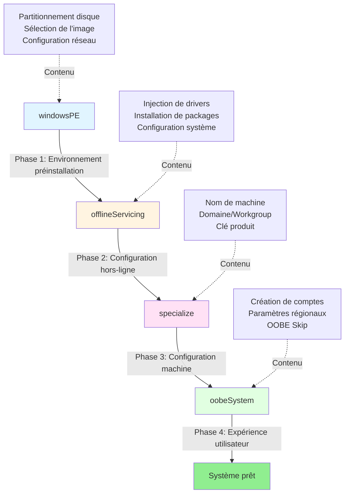

# Module 4 : Automatisation - L'Installation Silencieuse

## Introduction

> **"Zero Touch Provisioning"**

L'objectif ultime du déploiement Windows moderne :

1. **Brancher** une clé USB bootable
2. **Allumer** le PC
3. **Prendre un café** ☕
4. **Revenir** devant une machine configurée et prête à l'emploi

**Aucune interaction humaine requise** :
- ✅ Pas de clic sur "Suivant" 15 fois
- ✅ Pas de saisie de clé produit
- ✅ Pas de création manuelle de compte
- ✅ Pas d'attente devant l'écran "Bienvenue"

Cette approche réduit le temps de provisioning de **45 minutes à 15 minutes** et élimine 100% des erreurs humaines.

---

## Concept : Architecture Unattended

### Le Fichier XML Magique

Windows utilise un fichier de réponses appelé **`autounattend.xml`** :

```xml
<?xml version="1.0" encoding="utf-8"?>
<unattend xmlns="urn:schemas-microsoft-com:unattend">
    <settings pass="windowsPE">
        <!-- Configuration du partitionnement -->
    </settings>
    <settings pass="specialize">
        <!-- Configuration de la machine -->
    </settings>
    <settings pass="oobeSystem">
        <!-- Configuration utilisateur -->
    </settings>
</unattend>
```

**Emplacement** :
- Sur la clé USB : `\sources\$OEM$\$$\Panther\autounattend.xml`
- Ou à la racine de la clé : `\autounattend.xml` (détection automatique)

**Avantage NTLite** : Vous ne codez **jamais** ce XML manuellement. L'interface génère tout automatiquement.

---

### Configuration Passes (Les Étapes d'Installation)

Windows exécute l'installation en **4 phases distinctes**, chacune avec des responsabilités spécifiques :



#### 1. windowsPE
**Rôle** : Démarrage dans l'environnement de préinstallation (WinPE)

**Configurations possibles** :
- 💾 **Partitionnement du disque** (UEFI/BIOS, GPT/MBR)
- 📀 Sélection automatique de l'image à installer (index 1, 2, etc.)
- 🌐 Configuration réseau pour installation PXE

**Exemple concret** :
```
L'utilisateur démarre → WinPE charge → Efface Disk 0 → Crée partitions → Lance l'installation
```

---

#### 2. offlineServicing
**Rôle** : Modifications apportées à l'image **avant le premier boot**

**Configurations possibles** :
- 🔧 Injection de drivers supplémentaires
- 📦 Installation de packages (.cab, .msu)
- 🛠️ Modifications du registre hors-ligne

**Note** : Rarement utilisé en NTLite (les drivers sont déjà intégrés au Module 3)

---

#### 3. specialize
**Rôle** : Personnalisation de l'installation pour **cette machine spécifique**

**Configurations possibles** :
- 🖥️ **Nom de la machine** (fixe ou généré)
- 🏢 Jonction au domaine Active Directory ou Workgroup
- 🔑 Clé produit Windows (si pas AVMA/KMS)
- 🕐 Fuseau horaire

**Exemple concret** :
```
Machine nommée "PC-COMPTA-01" → Rejoint le domaine "ENTREPRISE.LOCAL" → Applique la clé produit
```

---

#### 4. oobeSystem
**Rôle** : Configuration de l'**expérience utilisateur final** (Out-of-Box Experience)

**Configurations possibles** :
- 👤 **Création de comptes locaux** ou domaine
- 🌍 Paramètres régionaux (langue, clavier, fuseau horaire)
- ❌ **OOBE Skip** : Désactiver les écrans de bienvenue

**Exemple concret** :
```
Crée l'utilisateur "Stagiaire" → Configure clavier FR → Skip l'écran "Choisir sa région" → Auto-login
```

---

## Pratique : Interface NTLite

### Emplacement dans NTLite

```
NTLite > [Image chargée] > Unattended (onglet en haut)
```

L'interface est divisée en sections correspondant aux **Configuration Passes**.

---

### Section "General"

**Chemin** : `Unattended > General`

#### Options clés :

| Option | Effet | Recommandation |
|--------|-------|----------------|
| **Auto-fill defaults** | Remplit automatiquement les champs manquants | ✅ Toujours activer |
| **Hide account pages** | Masque l'écran de création de compte | ✅ Si compte auto-créé |
| **Skip machine OOBE** | Passe les écrans de configuration machine | ✅ En entreprise |
| **Express settings** | Accepte automatiquement les paramètres "rapides" | ⚠️ Problème vie privée |

**Configuration recommandée** :
```
☑ Auto-fill defaults
☑ Hide account pages (si compte créé en oobeSystem)
☐ Express settings (désactiver pour contrôle total)
```

---

### Section "Localization"

**Chemin** : `Unattended > Localization`

#### Paramètres régionaux :

| Paramètre | Valeur pour France | Description |
|-----------|-------------------|-------------|
| **Input Locale** | `fr-FR` | Disposition du clavier |
| **System Locale** | `fr-FR` | Langue des programmes non-Unicode |
| **UI Language** | `fr-FR` | Langue de l'interface Windows |
| **User Locale** | `fr-FR` | Format de date/heure/monnaie |
| **Time Zone** | `Romance Standard Time` | Fuseau horaire (Paris) |

**Astuce** : Si vous déployez dans plusieurs pays, laissez vide pour laisser l'utilisateur choisir.

---

### Section "Users"

**Chemin** : `Unattended > Users`

#### Créer un compte local :

**Bouton** : `Add > Local Account`

**Champs** :

| Champ | Exemple | Notes |
|-------|---------|-------|
| **Username** | `Stagiaire` | Sans espaces (recommandé) |
| **Full Name** | `Compte Stagiaire` | Nom affiché |
| **Password** | *(vide)* ou `P@ssw0rd` | ⚠️ Vide = compte sans mot de passe |
| **Groups** | `Administrators` | Droits admin locaux |
| **Auto-logon count** | `1` | Connexion automatique au 1er boot |

**Cas d'usage** :

```
Scénario 1 : Salle de formation
→ Username: Stagiaire, Password: (vide), Auto-logon: 999

Scénario 2 : Poste de travail sécurisé
→ Username: Admin, Password: ComplexP@ss, Auto-logon: 0, Groups: Administrators

Scénario 3 : Kiosk public
→ Username: Public, Password: (vide), Auto-logon: 999, Groups: Users
```

**⚠️ Sécurité** :
- **Auto-logon** stocke le mot de passe en clair dans le registre (`HKLM\SOFTWARE\Microsoft\Windows NT\CurrentVersion\Winlogon`)
- À utiliser **UNIQUEMENT** en environnement contrôlé (formation, kiosk, VM)

---

### Section "OOBE Extended"

**Chemin** : `Unattended > OOBE Extended`

#### Les fameux "Skip" :

| Option | Écran évité | Impact |
|--------|-------------|--------|
| **Skip EULA** | Accepter les conditions d'utilisation | ⚠️ Légal : vérifier licence entreprise |
| **Skip Privacy Settings** | Paramètres de confidentialité | ✅ Recommandé (évite télémétrie) |
| **Skip Wireless Setup** | Configuration Wi-Fi | ✅ Si Ethernet uniquement |
| **Skip MSA (Microsoft Account)** | Création compte Microsoft | ✅ OBLIGATOIRE en entreprise |
| **Skip Cortana** | Activation de Cortana | ✅ Inutile en pro |
| **Skip OneDrive** | Configuration OneDrive | ✅ Si NAS/SharePoint utilisé |

**Configuration type entreprise** :
```
☑ Skip EULA (après validation juridique)
☑ Skip Privacy Settings
☑ Skip Wireless Setup (déploiement filaire)
☑ Skip MSA
☑ Skip Cortana
☑ Skip OneDrive
```

**Résultat** : L'utilisateur arrive **directement sur le bureau** après l'installation.

---

### Section "Disk Configuration" (⚠️ DANGER ZONE)

**Chemin** : `Unattended > Disk Configuration`

#### Partitionnement automatique :

**Option** : `Automatic` ou `Custom`

**Mode Automatic** :
```
NTLite détecte :
- UEFI → Créer GPT (ESP + MSR + Windows)
- BIOS → Créer MBR (System + Windows)
```

**Mode Custom** :
```xml
<DiskConfiguration>
    <Disk wcm:action="add">
        <DiskID>0</DiskID>
        <WillWipeDisk>true</WillWipeDisk>  <!-- ⚠️ EFFACE TOUT -->
        <CreatePartitions>
            <!-- Partition UEFI -->
            <CreatePartition wcm:action="add">
                <Order>1</Order>
                <Type>EFI</Type>
                <Size>100</Size>
            </CreatePartition>
            <!-- Partition Windows -->
            <CreatePartition wcm:action="add">
                <Order>2</Order>
                <Type>Primary</Type>
                <Extend>true</Extend>  <!-- Utilise tout l'espace restant -->
            </CreatePartition>
        </CreatePartitions>
    </Disk>
</DiskConfiguration>
```

**🚨 RISQUE MAJEUR** :
```
WillWipeDisk = true → EFFACE TOUTES LES DONNÉES DU DISQUE 0

Si vous démarrez accidentellement sur cette USB sur votre PC de production :
→ TOUTES VOS DONNÉES SONT PERDUES
```

**Recommandations de sécurité** :
1. ✅ Tester **UNIQUEMENT** en machine virtuelle d'abord
2. ✅ Ajouter un écran de confirmation (désactiver "Hide all screens")
3. ✅ Étiqueter la clé USB : "⚠️ WIPE DISK - FORMATION UNIQUEMENT"
4. ❌ **JAMAIS** utiliser en production sans sauvegarde complète

---

## Exercice : "Salle de Formation"

### Scenario

Vous devez réimager **20 PCs identiques** pour une salle de formation :
- Session de 2 jours sur Excel/Word
- Les stagiaires ne doivent **PAS** voir les écrans d'installation
- Compte local sans mot de passe (facilité d'accès)
- Interface en français

### Mission

#### Étape 1 : Configuration de la langue

1. Charger votre image (du Module 3)
2. Aller dans **Unattended > Localization**
3. Configurer :
   ```
   Input Locale: fr-FR
   System Locale: fr-FR
   UI Language: fr-FR
   User Locale: fr-FR
   Time Zone: Romance Standard Time
   ```

---

#### Étape 2 : Création du compte utilisateur

1. Aller dans **Unattended > Users**
2. Cliquer **Add > Local Account**
3. Remplir :
   ```
   Username: Stagiaire
   Full Name: Compte Stagiaire
   Password: (laisser vide)
   Groups: Users (PAS Administrators - sécurité)
   Auto-logon count: 1
   ```

**Question de réflexion** : Pourquoi `Auto-logon count: 1` et pas `999` ?
<details>
<summary>💡 Réponse</summary>
Avec `1`, le compte demande le mot de passe après le premier redémarrage. Cela évite qu'un stagiaire redémarre et accède automatiquement au compte.
</details>

---

#### Étape 3 : Désactiver TOUS les écrans OOBE

1. Aller dans **Unattended > General**
2. Activer :
   ```
   ☑ Auto-fill defaults
   ☑ Hide account pages
   ☑ Skip machine OOBE
   ```

3. Aller dans **Unattended > OOBE Extended**
4. Activer :
   ```
   ☑ Skip EULA
   ☑ Skip Privacy Settings
   ☑ Skip Wireless Setup
   ☑ Skip MSA (Microsoft Account)
   ☑ Skip Cortana
   ☑ Skip OneDrive
   ☑ Skip Region
   ☑ Skip Keyboard
   ```

---

#### Étape 4 : BONUS - Partitionnement automatique (⚠️ DANGER)

**⚠️ ATTENTION** : Cette étape efface **TOUT** le Disque 0. À faire **UNIQUEMENT** sur les PCs de formation (neufs ou à réinitialiser).

1. Aller dans **Unattended > Disk Configuration**
2. Sélectionner **Automatic**
3. Cocher :
   ```
   ☑ Wipe disk 0
   ☑ Create partitions automatically (UEFI/GPT)
   ```

**Mesure de sécurité** :
- Créer un fichier texte `DANGER_WIPE.txt` à la racine de la clé USB :
  ```
  ⚠️ CETTE CLÉ USB EFFACE AUTOMATIQUEMENT LE DISQUE 0 ⚠️
  À UTILISER UNIQUEMENT SUR LES PCS DE LA SALLE B201
  ```

---

#### Étape 5 : Validation finale

Avant d'appliquer, vérifier dans **Pending Changes** :

- [ ] `autounattend.xml` sera généré
- [ ] Langue configurée en fr-FR
- [ ] Compte "Stagiaire" créé
- [ ] Tous les OOBE Skip activés
- [ ] Disk 0 sera effacé (si configuré)

**Appliquer** et créer l'ISO bootable.

---

#### Étape 6 : Test en VM (OBLIGATOIRE)

**JAMAIS** déployer sans tester en VM d'abord :

1. Créer une VM VirtualBox/Hyper-V
2. Booter sur l'ISO
3. **Observer** :
   - ✅ Aucune interaction requise
   - ✅ L'installation se lance automatiquement
   - ✅ Le disque est partitionné sans confirmation
   - ✅ Après 15 minutes, arrivée directe sur le bureau
   - ✅ Connexion automatique avec le compte "Stagiaire"

4. **Vérifier** :
   - Langue Windows en français
   - Clavier AZERTY fonctionnel
   - Aucun écran OOBE résiduel

---

## Solution

<details>
<summary>📋 Configuration NTLite Complète (Cliquez pour déplier)</summary>

### 1. General

```
Unattended > General

☑ Auto-fill defaults
☑ Hide account pages
☑ Skip machine OOBE
☐ Express settings (désactiver pour vie privée)
```

---

### 2. Localization

```
Unattended > Localization

Input Locale: fr-FR
System Locale: fr-FR
UI Language: fr-FR
User Locale: fr-FR
Time Zone: Romance Standard Time
```

---

### 3. Users

```
Unattended > Users > Add > Local Account

Username: Stagiaire
Full Name: Compte Stagiaire
Password: (vide)
Groups: Users
Auto-logon count: 1
```

**Alternative avec mot de passe** :
```
Username: Admin
Password: Formation2025!
Groups: Administrators
Auto-logon count: 0
```

---

### 4. OOBE Extended

```
Unattended > OOBE Extended

☑ Skip EULA
☑ Skip Privacy Settings
☑ Skip Wireless Setup
☑ Skip MSA (Microsoft Account)
☑ Skip Cortana
☑ Skip OneDrive
☑ Skip Region
☑ Skip Keyboard
```

---

### 5. Disk Configuration (⚠️ DANGER)

```
Unattended > Disk Configuration

Mode: Automatic
☑ Wipe disk 0
Partition scheme: UEFI (GPT)
```

**Résultat** :
```
Disk 0 :
├── Partition 1 (EFI System Partition) : 100 MB
├── Partition 2 (Microsoft Reserved) : 16 MB
└── Partition 3 (Windows) : Reste du disque
```

---

### 6. Structure XML résultante (extrait)

Une fois appliqué, NTLite génère `autounattend.xml` :

```xml
<?xml version="1.0" encoding="utf-8"?>
<unattend xmlns="urn:schemas-microsoft-com:unattend">

    <!-- PHASE 1 : windowsPE -->
    <settings pass="windowsPE">
        <component name="Microsoft-Windows-International-Core-WinPE">
            <SetupUILanguage>
                <UILanguage>fr-FR</UILanguage>
            </SetupUILanguage>
            <InputLocale>fr-FR</InputLocale>
            <SystemLocale>fr-FR</SystemLocale>
            <UILanguage>fr-FR</UILanguage>
            <UserLocale>fr-FR</UserLocale>
        </component>

        <component name="Microsoft-Windows-Setup">
            <DiskConfiguration>
                <Disk wcm:action="add">
                    <DiskID>0</DiskID>
                    <WillWipeDisk>true</WillWipeDisk>
                    <CreatePartitions>
                        <CreatePartition wcm:action="add">
                            <Order>1</Order>
                            <Type>EFI</Type>
                            <Size>100</Size>
                        </CreatePartition>
                        <CreatePartition wcm:action="add">
                            <Order>2</Order>
                            <Type>MSR</Type>
                            <Size>16</Size>
                        </CreatePartition>
                        <CreatePartition wcm:action="add">
                            <Order>3</Order>
                            <Type>Primary</Type>
                            <Extend>true</Extend>
                        </CreatePartition>
                    </CreatePartitions>
                </Disk>
            </DiskConfiguration>
            <UserData>
                <AcceptEula>true</AcceptEula>
            </UserData>
        </component>
    </settings>

    <!-- PHASE 2 : specialize -->
    <settings pass="specialize">
        <component name="Microsoft-Windows-Shell-Setup">
            <TimeZone>Romance Standard Time</TimeZone>
        </component>
    </settings>

    <!-- PHASE 3 : oobeSystem -->
    <settings pass="oobeSystem">
        <component name="Microsoft-Windows-Shell-Setup">
            <OOBE>
                <HideEULAPage>true</HideEULAPage>
                <HideOEMRegistrationScreen>true</HideOEMRegistrationScreen>
                <HideOnlineAccountScreens>true</HideOnlineAccountScreens>
                <HideWirelessSetupInOOBE>true</HideWirelessSetupInOOBE>
                <ProtectYourPC>3</ProtectYourPC> <!-- 3 = Disable telemetry -->
            </OOBE>

            <UserAccounts>
                <LocalAccounts>
                    <LocalAccount wcm:action="add">
                        <Name>Stagiaire</Name>
                        <DisplayName>Compte Stagiaire</DisplayName>
                        <Group>Users</Group>
                        <Password>
                            <Value></Value> <!-- Vide -->
                            <PlainText>true</PlainText>
                        </Password>
                    </LocalAccount>
                </LocalAccounts>
            </UserAccounts>

            <AutoLogon>
                <Username>Stagiaire</Username>
                <Enabled>true</Enabled>
                <LogonCount>1</LogonCount>
            </AutoLogon>
        </component>
    </settings>

</unattend>
```

---

### 7. Emplacement du fichier sur la clé USB

Après création de l'ISO bootable, le fichier est ici :

```
E:\ (Clé USB)
├── boot/
├── efi/
├── sources/
│   └── $OEM$/
│       └── $$/
│           └── Panther/
│               └── autounattend.xml  ← ICI
└── autounattend.xml  ← OU ICI (détection automatique)
```

**Les deux emplacements fonctionnent**, mais `\autounattend.xml` à la racine est détecté en premier.

---

### 8. Vérification manuelle (Optionnel)

Pour vérifier que le XML est valide :

```powershell
# Valider la syntaxe XML
$xml = [xml](Get-Content "E:\autounattend.xml")
$xml.unattend.settings.Count  # Doit retourner 3 (windowsPE, specialize, oobeSystem)

# Vérifier le compte Stagiaire
$xml.unattend.settings.component.UserAccounts.LocalAccounts.LocalAccount.Name
# Sortie : Stagiaire
```

---

### 9. Checklist de déploiement

Avant de booter les 20 PCs :

- [ ] ISO testée en VM (installation complète validée)
- [ ] Aucun écran d'interaction apparu pendant le test
- [ ] Connexion automatique au compte "Stagiaire" validée
- [ ] Langue française confirmée (interface + clavier)
- [ ] Étiquette "⚠️ WIPE DISK" apposée sur la clé USB
- [ ] Backup des données importantes effectué (si réutilisation de PCs)
- [ ] Clé USB dupliquée (si déploiement simultané)

**Temps de déploiement estimé par PC** :
- Avec SSD : 12-15 minutes
- Avec HDD : 20-25 minutes

</details>

---

## Points Clés à Retenir

1. **autounattend.xml** est le fichier de réponses automatiques pour Windows Setup
2. **4 Configuration Passes** : windowsPE → offlineServicing → specialize → oobeSystem
3. **OOBE Skip** est essentiel pour éviter les écrans de bienvenue Microsoft
4. **Auto-logon** stocke le mot de passe en clair → Usage limité aux environnements contrôlés
5. **Disk Wipe = DANGER** → Toujours tester en VM d'abord, étiqueter les clés USB

---

## Astuces Professionnelles

### 1. Générer plusieurs profils Unattended

Pour gérer différents scénarios :

```
NTLite > Presets > Save current settings
→ "Formation_Stagiaire.xml"
→ "Production_Admin.xml"
→ "Kiosk_Public.xml"

Lors d'une nouvelle image :
Presets > Load > Sélectionner le profil adapté
```

---

### 2. Nom de machine dynamique

Au lieu de nommer toutes les machines "PC-Formation" :

```
Unattended > Machine > Computer Name

Format: PC-%RAND:5%
Résultat: PC-A3F9B, PC-K2M8L, etc.

Format: PC-MAC:3
Résultat: PC-A0B1C2, PC-D3E4F5 (basé sur l'adresse MAC)
```

---

### 3. Scripts FirstLogon (Avancé)

Exécuter des commandes au premier démarrage :

```
Unattended > RunSynchronous > Add

Command: powershell.exe -ExecutionPolicy Bypass -File C:\Setup\Configure.ps1
Order: 1
Description: Configuration post-installation
```

**Exemple `Configure.ps1`** :
```powershell
# Installer Chrome
Start-Process "C:\Setup\ChromeSetup.exe" -ArgumentList "/silent /install" -Wait

# Créer raccourci bureau
$WshShell = New-Object -ComObject WScript.Shell
$Shortcut = $WshShell.CreateShortcut("C:\Users\Public\Desktop\Excel.lnk")
$Shortcut.TargetPath = "C:\Program Files\Microsoft Office\root\Office16\EXCEL.EXE"
$Shortcut.Save()

# Désactiver Windows Update (formation hors-ligne)
Set-Service wuauserv -StartupType Disabled
```

---

### 4. Clé produit conditionnelle

Si vous avez plusieurs types de licences :

```
Unattended > Product Key

☑ Detect edition automatically
Product Key: XXXXX-XXXXX-XXXXX-XXXXX-XXXXX

OU laisser vide si :
- Licence OEM (détection automatique dans le BIOS)
- Activation KMS (serveur d'entreprise)
- Volume License (MAK)
```

---

## Dépannage Courant

### Problème 1 : L'installation demande toujours le clavier

**Cause** : `autounattend.xml` non détecté

**Solution** :
1. Vérifier l'emplacement : `\autounattend.xml` à la racine de la clé
2. Vérifier l'encodage : UTF-8 (pas UTF-8 BOM)
3. Valider le XML : `[xml](Get-Content autounattend.xml)`

---

### Problème 2 : Le compte auto-créé n'apparaît pas

**Cause** : Conflit entre "Hide account pages" et création manuelle

**Solution** :
```
Unattended > General
☐ Hide account pages (DÉSACTIVER si création de compte)

OU

Unattended > Users
Créer le compte AVANT d'activer "Hide account pages"
```

---

### Problème 3 : "Windows ne trouve pas de disque"

**Cause** : Drivers de stockage manquants dans `boot.wim`

**Solution** :
```
Retour au Module 3 :
1. Drivers > Add > NVMe/SATA Controller
2. Clic droit > Integrate into Boot image
3. Rebuild ISO
```

---

## Prochaine Étape

Dans le **Module 5 (TP Final)**, nous verrons :
- 🏭 **Scénario complet** : Créer une image de A à Z pour une PME
- 🔄 **Workflow mensuel** : Maintenir l'image à jour (drivers + updates)
- 🤖 **Automatisation CLI** : Utiliser NTLite en ligne de commande (scripts PowerShell)
- 📦 **Déploiement MDT/WDS** : Intégrer l'image dans une infrastructure de déploiement

Rendez-vous au TP Final pour mettre en pratique **tous les modules** dans un projet réel !
