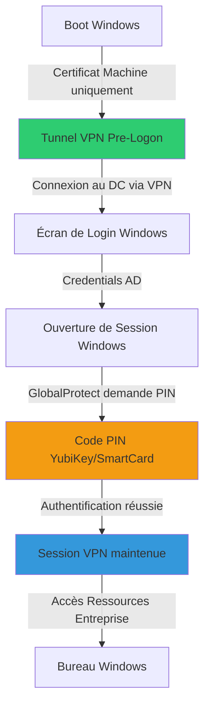

---
tags:
  - formation
  - ntlite
  - windows
  - vpn
  - pki
  - enterprise
  - module
---

# Module 6 : Cas d'Usage Avancé - ISO Sécurisé (VPN & Certificats)

**Durée estimée :** 4 heures

---

## 🎯 Objectifs du Module

Ce module présente un **scénario entreprise réel** : la création d'une ISO Windows sécurisée intégrant :

- 🔐 **Client VPN GlobalProtect** (Palo Alto Networks)
- 📜 **Certificats Root CA** de l'entreprise
- 🛡️ **Outils de sécurité** (CrowdStrike, agents de monitoring)
- 🔑 **Authentification forte** (YubiKey/SmartCard)
- ⚙️ **Configuration pré-déployée** via Registry et Post-Setup

**Cas d'usage :** Déploiement massif de postes nomades sécurisés nécessitant une connexion VPN dès le premier démarrage, avant même l'authentification utilisateur, avec maintien de session via YubiKey/SmartCard.

### Flux de Connexion Sécurisée



!!! info "Terminologie : Pre-Logon"
    Dans ce diagramme et la documentation, **"Pre-Logon"** désigne le mode VPN activé **avant la connexion utilisateur Windows**.

    **Techniquement, cette fonctionnalité est configurée par :**
    - Clé Registry **`PreLogon=1`** (legacy, versions 4.x/5.x)
    - Clé Registry **`connect-before-logon=1`** (modern, version 6.x+)
    - Paramètre MSI **`CONNECTMETHOD=pre-logon`**

    **Palo Alto Networks utilise ces trois termes de manière interchangeable** pour désigner la même fonctionnalité. Voir section 3.4 pour la configuration complète.

**Étapes clés :**

1. **Pre-Logon** : VPN connecté avec **certificat machine uniquement** (aucun certificat utilisateur disponible avant logon)
2. **Logon Windows** : Utilisateur s'authentifie avec ses credentials AD (le VPN machine est déjà actif)
3. **Post-Logon** : GlobalProtect **demande le code PIN de la YubiKey/SmartCard** pour maintenir la session VPN sous le contexte utilisateur

!!! warning "Limitation Technique Importante"
    GlobalProtect **ne peut pas** lire un certificat utilisateur avant l'ouverture de session Windows.

    - **Pre-Logon** : Utilise uniquement le certificat **machine** (stocké dans `Cert:\LocalMachine\My`)
    - **Post-Logon** : Demande le **PIN SmartCard** pour authentification forte utilisateur

---

## 📋 Contexte Métier

### Problématique Entreprise

Dans un environnement Zero Trust, les postes de travail doivent :

1. **Se connecter au VPN** avant le logon utilisateur (Pre-Logon VPN)
2. **Valider les certificats** de l'infrastructure interne (PKI)
3. **Installer les agents de sécurité** dès le premier boot
4. **Minimiser les interventions manuelles** post-installation

### Solution : ISO Pré-Configurée

L'ISO intègre tous les composants nécessaires et les configure automatiquement via :

- **NTLite Integration** : Fichiers, certificats, exécutables
- **Post-Setup Commands** : Installation silencieuse et configuration Registry
- **Unattended.xml** : OOBE automatisée

---

## 🛠️ Prérequis

!!! info "Fichiers & Outils Nécessaires"

    **Logiciels :**

    - NTLite 2024+ (version complète recommandée)
    - GlobalProtect MSI (exemple : `GlobalProtect64-6.2.msi`)
    - ISO Windows 10/11 officielle

    **Fichiers de Configuration :**

    - Certificats Root CA au format `.cer` ou `.crt`
    - Portal GlobalProtect de l'entreprise (exemple : `vpn.entreprise.com`)
    - Fichiers de configuration spécifiques (agents, scripts)

    **Droits :**

    - Administrateur local pour NTLite
    - Accès à un dossier de travail (exemple : `D:\NTLite\PROJET_ISO\`)

---

## 📁 Structure du Projet

Organisation du dossier de travail pour ce scénario :

```
G:\NTLite\Projet_VPN\
│
├── ISO_SOURCE\                      # ISO Windows montée/extraite
│   ├── sources\
│   │   ├── boot.wim
│   │   └── install.wim
│   └── ...
│
├── Applications\                    # Applications à intégrer
│   ├── DellCommandUpdate\
│   │   └── Dell-Command-Update_Setup.exe
│   │
│   ├── GlobalProtect\
│   │   └── globalprotect.msi        # Client VPN (v6.x)
│   │
│   ├── KeePass\
│   │   └── KeePass-Setup.exe        # Gestionnaire mots de passe
│   │
│   ├── PuttyCAC\
│   │   └── puttycac-x64.msi         # Putty compatible SmartCard
│   │
│   └── YubiKey\
│       └── yubikey-manager-qt-win64.exe  # Gestionnaire YubiKey
│
├── Folders\                         # Dossiers à copier
│   ├── Certificates\                # Certificats PKI
│   │   ├── Enterprise-RootCA.crt    # CA Racine entreprise
│   │   ├── Enterprise-SubCA.crt     # CA Intermédiaire
│   │   └── External-RootCA.cer      # CA Externe (si nécessaire)
│   │
│   ├── Scripts\
│   │   └── Register-VPN.ps1         # Script post-install
│   │
│   └── PSWindowsUpdate\             # Module PowerShell (optionnel)
│
├── Security\                        # Agents de sécurité
│   ├── CrowdStrike-Installer.exe
│   └── monitoring-agent.msi
│
└── ISO_FINALE\                      # ISO générée
    └── Windows11_Enterprise_VPN_Secure.iso
```

!!! tip "Organisation Recommandée"
    - **Applications/** : Tout ce qui s'installe via MSI/EXE
    - **Folders/** : Fichiers statiques (certificats, scripts, modules)
    - **Security/** : Agents EDR et outils de sécurité

---

## 🔧 Phase 1 : Préparation de l'Image

### 1.1 Charger l'Image dans NTLite

1. **Lancer NTLite** et créer un nouveau projet
2. **Add Image Directory** → Sélectionner `D:\NTLite\PROJET_ISO\ISO_SOURCE\`
3. Choisir **install.wim** → Index **Windows 11 Enterprise**
4. **Load** l'image

### 1.2 Désactiver les Composants Inutiles (Debloat Léger)

!!! warning "Attention aux Dépendances"
    Pour un scénario VPN/Sécurité, garder les composants réseau critiques :

    - **Ne PAS supprimer :** Windows Defender, Firewall, Hyper-V (si VPN nécessite)
    - **OK pour supprimer :** Xbox, Cortana, OneDrive (selon politique entreprise)

**Composants à désactiver (exemples) :**

- Windows Media Player (legacy)
- Internet Explorer 11
- XPS Services
- Fax & Scan

**Vérifier Compatibility :**

- Activer **Compatibility** mode dans NTLite
- Vérifier qu'aucun composant VPN/réseau n'est marqué en rouge

---

## 📦 Phase 2 : Intégration des Fichiers

### 2.1 Intégrer le Client VPN GlobalProtect

**Étape :** `Files` → `Add Files/Folders`

| Source | Destination dans l'ISO |
|--------|------------------------|
| `D:\NTLite\PROJET_ISO\INTEGRATION\VPN\GlobalProtect64-6.2.msi` | `C:\Windows\Setup\Files\GlobalProtect64-6.2.msi` |

!!! tip "Chemin Recommandé"
    `C:\Windows\Setup\Files\` est un emplacement standard non nettoyé par Windows Update.

### 2.2 Intégrer les Certificats Root CA

**Étape :** `Files` → `Add Files/Folders`

| Certificat | Destination |
|------------|-------------|
| `RootCA-Entreprise.cer` | `C:\Windows\Setup\Files\Certificates\RootCA-Entreprise.cer` |
| `SubCA-Infra.cer` | `C:\Windows\Setup\Files\Certificates\SubCA-Infra.cer` |
| `SubCA-Users.cer` | `C:\Windows\Setup\Files\Certificates\SubCA-Users.cer` |

### 2.3 Intégrer les Outils de Sécurité

| Outil | Destination |
|-------|-------------|
| `CrowdStrike-Installer.exe` | `C:\Windows\Setup\Files\Security\CrowdStrike-Installer.exe` |
| `monitoring-agent.msi` | `C:\Windows\Setup\Files\Security\monitoring-agent.msi` |

---

## ⚙️ Phase 3 : Configuration Post-Setup

### 3.1 Principe des Post-Setup Commands

NTLite propose deux types de commandes dans l'onglet **Post-Setup** :

| Type | Exécution | Contexte | Usage |
|------|-----------|----------|-------|
| **Run** | Asynchrone | SYSTEM | Scripts indépendants, agents |
| **Command** | Synchrone | SYSTEM | Installations critiques, Registry |

!!! warning "Ordre d'Exécution Critique"
    Les commandes sont exécutées **dans l'ordre de la liste NTLite**, après le premier boot, avant l'OOBE.

### 3.2 Installation des Certificats Root CA

**Objectif :** Installer les certificats dans le magasin **Trusted Root Certification Authorities** du système.

**Post-Setup Command :**

```powershell
# Type: Command (Synchrone)
# Description: Install Root CA - Entreprise

certutil.exe -addstore -f "Root" "C:\Windows\Setup\Files\Certificates\RootCA-Entreprise.cer"
```

```powershell
# Type: Command (Synchrone)
# Description: Install SubCA - Infrastructure

certutil.exe -addstore -f "CA" "C:\Windows\Setup\Files\Certificates\SubCA-Infra.cer"
```

```powershell
# Type: Command (Synchrone)
# Description: Install SubCA - Users

certutil.exe -addstore -f "CA" "C:\Windows\Setup\Files\Certificates\SubCA-Users.cer"
```

!!! info "Magasins de Certificats"
    - **Root** : Autorités racines de confiance (Root CA)
    - **CA** : Autorités intermédiaires (Subordinate CA)
    - **My** : Certificats personnels (utilisé pour les certificats machine/utilisateur)

### 3.3 Installation Silencieuse de GlobalProtect

#### A. Installation Minimale (Recommandée)

**Post-Setup Command :**

```batch
REM Type: Command (Synchrone)
REM Description: Install GlobalProtect VPN Client - Configuration minimale

msiexec.exe /i "C:\Windows\Setup\Files\GlobalProtect64-6.2.msi" /qn /norestart PORTAL=vpn.entreprise.com HIDETRAY=NO
```

**Paramètres MSI de base :**

| Paramètre | Valeur | Description |
|-----------|--------|-------------|
| `/i` | `GlobalProtect64-6.2.msi` | Install mode |
| `/qn` | - | Silent installation (no UI) |
| `/norestart` | - | Ne pas redémarrer après installation |
| `PORTAL` | `vpn.entreprise.com` | Adresse du portail GlobalProtect |
| `HIDETRAY` | `NO` | Afficher l'icône dans la barre système |

!!! success "Recommandation"
    Pour une configuration de base, cette commande suffit. Les paramètres avancés (Pre-Logon, authentification) seront configurés via **Registry** (section 3.4).

#### B. Installation Avancée (Paramètres MSI)

Si vous préférez configurer via MSI plutôt que Registry :

```batch
REM Type: Command (Synchrone)
REM Description: Install GlobalProtect VPN Client - Configuration avancée

msiexec.exe /i "C:\Windows\Setup\Files\GlobalProtect64-6.2.msi" /qn /norestart ^
    PORTAL=vpn.entreprise.com ^
    HIDETRAY=NO ^
    PRELOGON=YES ^
    USERAUTHENTICATION=SAML ^
    CONNECTMETHOD=pre-logon
```

**Paramètres MSI avancés :**

| Paramètre | Valeur Exemple | Description |
|-----------|----------------|-------------|
| `PORTAL` | `vpn.entreprise.com` | Adresse du portail GlobalProtect |
| `HIDETRAY` | `NO` | Afficher l'icône (`YES`=masquer, `NO`=afficher) |
| `PRELOGON` | `YES` | Activer le VPN pré-logon |
| `USERAUTHENTICATION` | `SAML` | Méthode d'authentification (`SAML`, `Kerberos`, `Certificate`) |
| `CONNECTMETHOD` | `pre-logon` | Mode de connexion (`pre-logon`, `on-demand`, `user-logon`) |

!!! info "Correspondance MSI ↔ Registry"
    Le paramètre MSI **`CONNECTMETHOD=pre-logon`** correspond à la clé Registry **`connect-before-logon=1`**.

    - **MSI (Installation)** : `CONNECTMETHOD=pre-logon` → Configure automatiquement la Registry
    - **Registry (Post-Setup)** : `reg.exe add ... /v "connect-before-logon" /t REG_DWORD /d 1 /f`

    **Pourquoi deux noms différents ?**
    - MSI utilise une nomenclature simplifiée pour les installateurs
    - Registry conserve les noms techniques historiques de Palo Alto Networks

    **Best Practice :** Utiliser **MSI pour l'installation initiale**, puis **Registry pour les ajustements** (section 3.4).

!!! warning "Compatibilité Version GlobalProtect"
    **Ces paramètres MSI varient selon la version de GlobalProtect.**

    - **GlobalProtect 5.x** : Certains paramètres peuvent ne pas être disponibles
    - **GlobalProtect 6.x+** : Support complet des paramètres avancés
    - **Vérification** : Exécuter `msiexec.exe /i GlobalProtect64.msi /?` pour lister les paramètres supportés

    **Recommandation :** Privilégier la **configuration Registry** (section 3.4) qui est plus flexible et compatible toutes versions.

### 3.4 Configuration Registry Avancée pour Pre-Logon VPN

**Objectif :** Configurer GlobalProtect pour le Pre-Logon avec support SmartCard/YubiKey.

!!! warning "Configuration Critique"
    Les clés Registry suivantes contrôlent le comportement du VPN. Une erreur peut empêcher la connexion Pre-Logon.

#### A. Configuration du Portail (PanSetup)

Définit le portail par défaut.

```batch
REM Type: Command (Synchrone)
REM Description: Configure Portal Address

reg.exe add "HKLM\SOFTWARE\Palo Alto Networks\GlobalProtect\PanSetup" /v "Portal" /t REG_SZ /d "vpn.entreprise.com" /f
reg.exe add "HKLM\SOFTWARE\Palo Alto Networks\GlobalProtect\PanSetup" /v "Prelogon" /t REG_DWORD /d 1 /f
```

#### B. Paramètres de Connexion (Settings)

!!! info "Terminologie Palo Alto : PreLogon vs connect-before-logon"
    **Pourquoi deux clés Registry différentes ?**

    GlobalProtect utilise **deux noms différents** pour la même fonctionnalité :

    - **`PreLogon`** (REG_DWORD) : Clé historique (GlobalProtect 4.x et 5.x legacy)
    - **`connect-before-logon`** (REG_DWORD) : Clé moderne (GlobalProtect 5.0+, 6.x)

    **Best Practice :** Configurer **LES DEUX** clés pour garantir la compatibilité :
    - Clients anciens (4.x, early 5.x) → Lisent uniquement `PreLogon`
    - Clients récents (6.x+) → Préfèrent `connect-before-logon`

    Les deux clés activent la même fonctionnalité : **connexion VPN avant l'authentification Windows**.

!!! info "Comprendre la stratégie 'Pre-Logon' (Important)"
    Il existe souvent une confusion sur le terme "Pre-Logon". Nous configurons ici une **approche hybride** qui combine deux mécanismes distincts :

    1.  **Le Tunnel Machine (Transparent)** : Grâce à `connect-before-logon = 1`, le VPN se connecte automatiquement dès le démarrage de Windows en utilisant le certificat machine. L'utilisateur ne voit rien, mais le PC est déjà connecté au domaine (permettant les scripts de login et GPO).
    2.  **Le PLAP (Bouton Interactif)** : Grâce à `registerplap` et `ShowPrelogonButton`, un bouton apparaît sur l'écran de connexion. Il sert de **roue de secours** : si le tunnel machine échoue (ex: portail captif Wi-Fi), l'utilisateur peut cliquer pour forcer la connexion manuellement.

```batch
REM Type: Command (Synchrone)
REM Description: Enable Pre-Logon & Certificate-Based Auth

REM Activer le Pre-Logon (connexion avant authentification)
reg.exe add "HKLM\SOFTWARE\Palo Alto Networks\GlobalProtect\Settings" /v "PreLogon" /t REG_DWORD /d 1 /f
reg.exe add "HKLM\SOFTWARE\Palo Alto Networks\GlobalProtect\Settings" /v "connect-before-logon" /t REG_DWORD /d 1 /f

REM Recherche de certificats dans Machine ET Utilisateur
reg.exe add "HKLM\SOFTWARE\Palo Alto Networks\GlobalProtect\Settings" /v "certificate-store-lookup" /t REG_SZ /d "user-and-machine" /f

REM Magasin personnel (My) pour les certificats
reg.exe add "HKLM\SOFTWARE\Palo Alto Networks\GlobalProtect\Settings" /v "certificate-store" /t REG_SZ /d "My" /f

REM Délai de connexion (laisser le temps au réseau de monter)
reg.exe add "HKLM\SOFTWARE\Palo Alto Networks\GlobalProtect\Settings" /v "prelogon-connect-delay" /t REG_DWORD /d 15 /f

REM Adresse du portail
reg.exe add "HKLM\SOFTWARE\Palo Alto Networks\GlobalProtect\Settings" /v "PortalAddress" /t REG_SZ /d "vpn.entreprise.com" /f

REM Afficher l'icône système
reg.exe add "HKLM\SOFTWARE\Palo Alto Networks\GlobalProtect\Settings" /v "HideTrayIcon" /t REG_DWORD /d 0 /f
```

#### C. Intégration SmartCard / YubiKey (CBL) - Post-Logon

!!! info "SmartCard = Authentification Post-Logon"
    La SmartCard/YubiKey intervient **après** l'ouverture de session Windows, pour maintenir le tunnel VPN avec authentification forte utilisateur.

```batch
REM Type: Command (Synchrone)
REM Description: Enable SmartCard Support (Post-Logon)

REM Utiliser la SmartCard pour l'authentification utilisateur POST-logon
reg.exe add "HKLM\SOFTWARE\Palo Alto Networks\GlobalProtect\CBL" /v "UseSmartCard" /t REG_SZ /d "yes" /f

REM Maintenir la connexion si la carte est retirée (optionnel - sécurité vs confort)
reg.exe add "HKLM\SOFTWARE\Palo Alto Networks\GlobalProtect\Settings" /v "retain-connection-smartcard-removal" /t REG_SZ /d "yes" /f
```

**Comportement :**

1. **Pre-Logon** : VPN monte avec certificat machine (aucune SmartCard requise)
2. **Logon** : Utilisateur entre login/password AD
3. **Post-Logon** : GlobalProtect popup demande **code PIN de la YubiKey** → authentification forte pour maintenir le tunnel

#### D. Enregistrement PLAP (Credential Provider)

**CRUCIAL** : Cette commande inscrit la DLL de GlobalProtect dans les fournisseurs d'authentification de Windows (Credential Provider). C'est ce qui permet d'afficher le bouton "Réseau" sur l'écran de login pour une connexion manuelle d'urgence (PLAP), distincte du tunnel machine automatique.

```batch
REM Type: Command (Synchrone)
REM Description: Register Pre-Logon Access Provider (PLAP)

"C:\Program Files\Palo Alto Networks\GlobalProtect\PanGPS.exe" -registerplap
```

**Clés Registry Importantes :**

| Clé | Type | Valeur | Description |
|-----|------|--------|-------------|
| `Portal` (PanSetup) | REG_SZ | `vpn.entreprise.com` | URL du portail GP |
| `Prelogon` (PanSetup) | REG_DWORD | `1` | Activer Pre-Logon |
| `PreLogon` (Settings) | REG_DWORD | `1` | Mode Pre-Logon |
| `connect-before-logon` | REG_DWORD | `1` | Connexion avant login |
| `certificate-store-lookup` | REG_SZ | `user-and-machine` | Recherche certif machine+user |
| `certificate-store` | REG_SZ | `My` | Magasin personnel |
| `prelogon-connect-delay` | REG_DWORD | `15` | Délai connexion (secondes) |
| `UseSmartCard` (CBL) | REG_SZ | `yes` | Support SmartCard/YubiKey |
| `retain-connection-smartcard-removal` | REG_SZ | `yes` | Maintenir VPN sans carte |

### 3.5 Installation des Agents de Sécurité

**CrowdStrike Falcon :**

!!! danger "Security - Customer ID Protection"
    **IMPORTANT :** Remplacez `VOTRE-CUSTOMER-ID` par votre CID CrowdStrike réel.

    - ❌ **Ne JAMAIS commiter** ce CID dans Git, SVN, ou tout dépôt partagé
    - ✅ **Stocker** dans un vault sécurisé (Azure Key Vault, HashiCorp Vault, AWS Secrets Manager)
    - ✅ **Utiliser** des variables d'environnement ou secrets CI/CD pour automatisation
    - 📚 **Formation** : Utilisez `CID=DEMO-1234-5678-ABCD-TRAINING` comme exemple fake

```batch
REM Type: Run (Asynchrone)
REM Description: Install CrowdStrike Falcon Agent

"C:\Windows\Setup\Files\Security\CrowdStrike-Installer.exe" /install /quiet /norestart CID=VOTRE-CUSTOMER-ID
```

**Agent de Monitoring :**

```batch
REM Type: Command (Synchrone)
REM Description: Install Monitoring Agent

msiexec.exe /i "C:\Windows\Setup\Files\Security\monitoring-agent.msi" /qn SERVER=monitor.entreprise.com
```

---

## 🎨 Phase 4 : Configuration Unattended (OOBE)

### 4.1 Passes d'Installation Windows

NTLite configure l'installation via différentes "passes" (Configuration Passes) :

- **Pass 4 (specialize)** : Configuration machine (nom, copie de profil)
- **Pass 7 (oobeSystem)** : Configuration première exécution (OOBE, autologon)

### 4.2 Pass 4 : Specialize (Configuration Machine)

**Onglet NTLite : Unattended → Pass 4**

| Composant | Paramètre | Valeur | Description |
|-----------|-----------|--------|-------------|
| `Microsoft-Windows-Shell-Setup` | `ComputerName` | `SEC-%SERIAL%` | Nommage basé sur N° série |
| `Microsoft-Windows-Shell-Setup` | `CopyProfile` | `true` | Copier profil Admin vers Default User |
| `Microsoft-Windows-Deployment` | `RunSynchronous` | `net user Administrator /active:Yes` | Activer compte Admin local |

### 4.3 Pass 7 : oobeSystem (Première Expérience)

Configuration de l'expérience utilisateur au premier démarrage.

=== "Localisation"

    **Paramètres régionaux et langue :**

    | Paramètre | Valeur | Description |
    |-----------|--------|-------------|
    | **Input Locale** | `040c:0000040c` | Clavier Français AZERTY |
    | **System Locale** | `fr-FR` | Paramètres régionaux système |
    | **User Locale** | `fr-FR` | Paramètres utilisateur |
    | **UI Language** | `fr-FR` ou `en-US` | Langue de l'interface |
    | **Time Zone** | `Romance Standard Time` | Fuseau Paris (GMT+1) |

    !!! tip "Environnement International"
        Pour un environnement multilingue, choisir `en-US` comme UI Language (standard technique).

=== "Auto-Logon"

    **Ouverture automatique de session (1 fois) :**

    Permet d'exécuter les scripts de post-installation dans une session ouverte.

    | Paramètre | Valeur | Description |
    |-----------|--------|-------------|
    | **Username** | `Administrator` | Compte admin local |
    | **Enabled** | `true` | Activer autologon |
    | **Logon Count** | `1` | Juste pour le premier boot |
    | **Password** | `Train1ng-D3m0-N3v3rUs3!` | MDP admin sécurisé |

    !!! warning "Mot de Passe de Formation"
        **Le mot de passe `Train1ng-D3m0-N3v3rUs3!` est un exemple FICTIF pour cette formation.**

        **En production, VOUS DEVEZ :**
        - Générer un mot de passe unique et complexe (20+ caractères aléatoires)
        - Utiliser **LAPS** (Local Administrator Password Solution) pour rotation automatique
        - Stocker le mot de passe dans un coffre-fort (HashiCorp Vault, Azure Key Vault)
        - **JAMAIS** committer le mot de passe dans Git ou le laisser en clair dans l'Unattended.xml après déploiement

    !!! danger "Sécurité Critique"
        - Mot de passe **complexe** (20+ caractères)
        - Désactiver le compte Admin après déploiement
        - Utiliser **LAPS** en production

=== "Masquer OOBE"

    **Désactiver les questions de configuration :**

    | Paramètre | Valeur | Description |
    |-----------|--------|-------------|
    | **Hide EULA** | `true` | Pas d'accord de licence |
    | **Hide Local Account Screen** | `true` | Pas de création compte local |
    | **Hide Online Account Screens** | `true` | Pas de compte Microsoft |
    | **Hide Wireless Setup** | `true` | Pas de config WiFi |
    | **Network Location** | `Work` | Réseau entreprise |
    | **SkipMachineOOBE** | `true` | Skip toutes questions machine |
    | **SkipUserOOBE** | `true` | Skip toutes questions utilisateur |
    | **ProtectYourPC** | `3` | Désactiver questions confidentialité |

=== "Compte Admin"

    **Configuration du compte administrateur local :**

    | Paramètre | Valeur | Description |
    |-----------|--------|-------------|
    | **Computer Name** | `SEC-%SERIAL%` ou `PC-%RAND:6%` | Nom unique |
    | **Administrator Password** | `Train1ng-D3m0-N3v3rUs3!` | MDP admin (FICTIF) |
    | **Active** | `Yes` | Compte activé |

    !!! warning "Recommandations Post-Déploiement"
        1. **Désactiver** le compte Admin local : `net user Administrator /active:No`
        2. **Activer LAPS** pour rotation automatique des mots de passe
        3. **Auditer** l'utilisation du compte admin (Event 4624, 4634)

### 4.2 Exemple Autounattend.xml (Extrait)

Le fichier généré par NTLite contiendra :

```xml
<component name="Microsoft-Windows-Shell-Setup">
    <OOBE>
        <HideEULAPage>true</HideEULAPage>
        <HideOEMRegistrationScreen>true</HideOEMRegistrationScreen>
        <HideOnlineAccountScreens>true</HideOnlineAccountScreens>
        <HideWirelessSetupInOOBE>true</HideWirelessSetupInOOBE>
        <ProtectYourPC>3</ProtectYourPC> <!-- Disable privacy questions -->
    </OOBE>
    <UserAccounts>
        <AdministratorPassword>
            <!-- Base64 UTF-16LE: Train1ng-D3m0-N3v3rUs3! (EXEMPLE FICTIF FORMATION) -->
            <Value>VAByAGEAaQBuADEAbgBnAC0ARAAzAG0AMAAtAE4AMwB2ADMAcgBVAHMAMwAhAA==</Value>
            <PlainText>false</PlainText>
        </AdministratorPassword>
    </UserAccounts>
    <AutoLogon>
        <Enabled>true</Enabled>
        <Username>Administrator</Username>
        <Password>
            <!-- Base64 UTF-16LE: Train1ng-D3m0-N3v3rUs3! (EXEMPLE FICTIF FORMATION) -->
            <Value>VAByAGEAaQBuADEAbgBnAC0ARAAzAG0AMAAtAE4AMwB2ADMAcgBVAHMAMwAhAA==</Value>
            <PlainText>false</PlainText>
        </Password>
        <LogonCount>1</LogonCount>
    </AutoLogon>
</component>
```

---

## 🚀 Phase 5 : Création de l'ISO

### 5.1 Vérification Finale

**Checklist avant Apply :**

- [ ] Tous les fichiers sont dans `Files` (VPN, Certificats, Agents)
- [ ] Post-Setup Commands dans le bon ordre
- [ ] Unattended configuré (OOBE skip, autologon)
- [ ] Compatibility mode activé (pas d'erreurs rouges)

### 5.2 Apply & Create ISO

1. **Pending Changes** → Vérifier la liste des modifications
2. **Process** → **Apply**
3. Attendre la fin du traitement (15-30 minutes)
4. **Create ISO** → Choisir la destination :
   ```
   D:\NTLite\PROJET_ISO\ISO_FINALE\Windows11_Enterprise_VPN.iso
   ```

### 5.3 Options de Création ISO

| Option | Recommandation | Raison |
|--------|----------------|--------|
| **Label** | `WIN11_ENT_VPN` | Identification claire |
| **Bootable** | ✅ Enabled | ISO bootable sur USB/VM |
| **File System** | UDF | Compatible UEFI |

---

## 🧪 Phase 6 : Test & Validation

### 6.1 Déploiement de Test (VM)

**Environnement recommandé :**

- **Hyperviseur :** Hyper-V, VMware Workstation, VirtualBox
- **Specs VM :**
  - 4 GB RAM minimum
  - 2 vCPU
  - 60 GB disk (UEFI boot)
  - Network adapter en mode **Bridged** (pour test VPN)

### 6.2 Checklist de Validation

!!! check "Validation Post-Déploiement"

    **Étape 1 : Premier Boot**

    - [ ] L'OOBE est automatiquement passée (aucune question posée)
    - [ ] Autologon fonctionne (connexion automatique en `Administrator`)
    - [ ] Le bureau Windows s'affiche sans erreur

    **Étape 2 : Vérification des Certificats**

    Ouvrir une console PowerShell **en Administrateur** :

    ```powershell
    # Lister les certificats Root CA
    Get-ChildItem -Path Cert:\LocalMachine\Root | Where-Object { $_.Subject -like "*Entreprise*" }

    # Lister les certificats SubCA
    Get-ChildItem -Path Cert:\LocalMachine\CA | Where-Object { $_.Subject -like "*Infra*" }
    ```

    **Résultat attendu :**
    ```
    Subject: CN=RootCA-Entreprise, O=Entreprise, C=FR
    Thumbprint: A1B2C3D4E5F6...
    ```

    **Étape 3 : Vérification GlobalProtect**

    ```batch
    REM Vérifier l'installation du service
    sc query PanGPS

    REM Vérifier les clés Registry
    reg query "HKLM\SOFTWARE\Palo Alto Networks\GlobalProtect\Settings"
    ```

    **Résultat attendu :**
    ```
    SERVICE_NAME: PanGPS
    STATE       : RUNNING

    PortalAddress    REG_SZ    vpn.entreprise.com
    PreLogon         REG_DWORD 0x1
    ```

    **Étape 4 : Test de Connexion VPN**

    - [ ] L'icône GlobalProtect est visible dans la barre système
    - [ ] Cliquer sur l'icône → Le portail `vpn.entreprise.com` est pré-rempli
    - [ ] Se connecter avec des identifiants de test
    - [ ] Vérifier la connexion : `ipconfig /all` (adapter VPN actif)

    **Étape 5 : Vérification Agents de Sécurité**

    ```powershell
    # CrowdStrike Falcon
    Get-Service -Name CSFalconService

    # Monitoring Agent
    Get-Service -Name MonitoringAgent
    ```

    **Résultat attendu :**
    ```
    Status   Name               DisplayName
    ------   ----               -----------
    Running  CSFalconService    CrowdStrike Falcon Sensor
    Running  MonitoringAgent    Enterprise Monitoring Agent
    ```

    **Étape 6 : Test Pre-Logon**

    1.  [ ] **Pre-Logon (PLAP)** : Le bouton de connexion apparaît-il sur l'écran de login ?
    2.  [ ] **Pre-Logon (Tunnel)** : (Test avancé) Sans toucher au bouton, le PC est-il pingable dès l'écran de login ? (Preuve que le tunnel machine est monté en arrière-plan).

### 6.3 Test Pre-Logon VPN (Avancé)

**Objectif :** Vérifier que le VPN se connecte **avant** le logon utilisateur avec le certificat machine.

**Procédure :**

1. **Fermer la session** Windows (ou redémarrer la VM)
2. Sur l'écran de **connexion** (Ctrl+Alt+Del), observer la barre système
3. **Vérifier** que l'icône GlobalProtect est présente
4. **Cliquer** sur l'icône → Le VPN se connecte automatiquement avec le **certificat machine**
5. **Attendre** que le tunnel soit établi (icône verte)
6. **Se loguer** avec un compte AD → La connexion au DC fonctionne grâce au VPN déjà actif
7. **Après le logon** : GlobalProtect demande le **code PIN de la YubiKey** pour maintenir la session

!!! warning "Prérequis Pre-Logon"
    Le Pre-Logon VPN nécessite :

    - **Certificat machine** valide dans `Cert:\LocalMachine\My` (approuvé par le portail GP)
    - **Credential Provider** GlobalProtect installé (PLAP)
    - **Réseau accessible** (Ethernet ou Wi-Fi pré-configuré)
    - **Pas de certificat utilisateur requis** pour le Pre-Logon

---

## 🎯 Phase 7 : Déploiement en Production

### 7.1 Stratégie de Déploiement

**Options de déploiement :**

| Méthode | Cas d'Usage | Avantages |
|---------|-------------|-----------|
| **USB Bootable** | Postes isolés, techniciens terrain | Simple, autonome |
| **MDT/SCCM** | Déploiement massif (100+ postes) | Automatisation complète, reporting |
| **WDS (PXE Boot)** | Réseau LAN, postes fixes | Pas de média physique |
| **ISO Cloud** | VM cloud, Azure/AWS | Déploiement infrastructure as code |

### 7.2 Recommandations Sécurité

!!! danger "Hardening Post-Déploiement"

    **Actions obligatoires après déploiement :**

    1. **Désactiver le compte Admin temporaire** :
       ```powershell
       Disable-LocalUser -Name "Administrator"
       ```

    2. **Activer LAPS** (Local Admin Password Solution) :
       - Installer l'extension AD LAPS
       - Appliquer la GPO LAPS au poste

    3. **Forcer la rotation du mot de passe** :
       ```powershell
       Set-LocalUser -Name "Administrator" -PasswordNeverExpires $false
       ```

    4. **Activer BitLocker** :
       ```powershell
       Enable-BitLocker -MountPoint "C:" -EncryptionMethod XtsAes256 -RecoveryPasswordProtector
       ```

    5. **Appliquer les GPO de sécurité** :
       - Désactiver SMBv1
       - Activer Windows Defender ATP
       - Configurer les règles Firewall

### 7.3 Documentation de Déploiement

**Créer une fiche technique contenant :**

- **Version de l'ISO** : `Windows11_Enterprise_VPN_v1.2_2024-11`
- **Hash SHA256** : `sha256sum Windows11_Enterprise_VPN.iso`
- **Composants intégrés** :
  - GlobalProtect 6.2.0
  - CrowdStrike Falcon 7.14
  - Certificats Root CA (validité jusqu'au 2030-12-31)
- **Configuration par défaut** :
  - Compte admin : `Administrator` (à désactiver)
  - VPN Portal : `vpn.entreprise.com`
  - PreLogon : Activé
- **Prérequis réseau** :
  - Accès HTTPS port 443 vers `vpn.entreprise.com`
  - DNS résolu (interne ou public)

---

## 📊 Comparaison : Avant/Après NTLite

| Étape | Déploiement Manuel | Déploiement ISO Automatisé |
|-------|-------------------|----------------------------|
| **Installation Windows** | 30 minutes | 30 minutes |
| **Installation GlobalProtect** | 10 minutes | ✅ **Automatique** |
| **Installation Certificats** | 15 minutes (manuel) | ✅ **Automatique** |
| **Configuration VPN** | 10 minutes (Registry) | ✅ **Automatique** |
| **Installation Agents** | 20 minutes | ✅ **Automatique** |
| **OOBE Questions** | 5 minutes | ✅ **Skip (0 min)** |
| **Total** | **90 minutes** | **30 minutes** |
| **Intervention Technicien** | Élevée | ✅ **Minimale** |

**ROI pour 100 postes :**

- Temps économisé : `(90 - 30) × 100 = 6000 minutes = 100 heures`
- Coût technicien (50€/h) : **5000€ économisés**

---

## 🔍 Troubleshooting

### Problème 1 : GlobalProtect ne s'installe pas

**Symptômes :**

- Service `PanGPS` absent
- Aucune icône dans la barre système

**Causes possibles :**

1. **MSI corrompu** : Re-télécharger GlobalProtect depuis le portail Palo Alto
2. **Paramètres MSI incorrects** : Vérifier `PORTAL=vpn.entreprise.com`
3. **Dépendances manquantes** : Installer `.NET Framework 4.8` (intégrer dans NTLite)

**Solution :**

```powershell
# Vérifier les logs d'installation MSI
Get-Content "C:\Windows\Temp\GlobalProtect_Install.log"

# Réinstaller manuellement pour tester
msiexec.exe /i "C:\Windows\Setup\Files\GlobalProtect64-6.2.msi" /L*v "C:\gp-install.log" PORTAL=vpn.entreprise.com
```

### Problème 2 : Certificats non installés

**Symptômes :**

- Erreur SSL lors de la connexion VPN
- `Get-ChildItem Cert:\LocalMachine\Root` ne liste pas les certificats

**Causes possibles :**

1. **Format certificat incorrect** : Utiliser `.cer` ou `.crt` (pas `.pfx`)
2. **Commande certutil échouée** : Vérifier les logs Post-Setup

**Solution :**

```powershell
# Installer manuellement pour tester
certutil.exe -addstore -f "Root" "C:\Windows\Setup\Files\Certificates\RootCA-Entreprise.cer"

# Vérifier l'erreur
echo $LASTEXITCODE  # 0 = succès
```

### Problème 3 : Pre-Logon VPN non disponible

**Symptômes :**

- Pas d'icône GlobalProtect sur l'écran de connexion
- VPN fonctionne uniquement après logon

**Causes possibles :**

1. **Clé Registry `PreLogon` manquante**
2. **Credential Provider non installé** (version GlobalProtect trop ancienne)
3. **GPO bloquant le Credential Provider**

**Solution :**

```batch
REM Vérifier la clé Registry
reg query "HKLM\SOFTWARE\Palo Alto Networks\GlobalProtect\Settings" /v PreLogon

REM Forcer l'activation
reg add "HKLM\SOFTWARE\Palo Alto Networks\GlobalProtect\Settings" /v PreLogon /t REG_DWORD /d 1 /f

REM Redémarrer le service
net stop PanGPS && net start PanGPS
```

### Problème 4 : OOBE non skippée

**Symptômes :**

- Questions de confidentialité, région, clavier apparaissent

**Causes possibles :**

1. **Autounattend.xml mal généré** par NTLite
2. **Paramètres OOBE non cochés** dans l'interface

**Solution :**

- Vérifier dans NTLite : `Unattended → Settings → Skip User OOBE` = **Enabled**
- Ré-appliquer l'image et recréer l'ISO

### Problème 5 : Erreur "File not found" lors de la création ISO

**Symptômes :**

- NTLite échoue avec `File not found` pendant **Create ISO**
- L'image semble correcte mais l'export plante

**Causes possibles :**

1. **Mises à jour intégrées** dont le fichier source a été déplacé/supprimé du cache NTLite
2. **Chemin de fichier trop long** (limite Windows 260 caractères)

**Solution :**

```
1. Ouvrir l'onglet **Updates** dans NTLite
2. Supprimer les mises à jour dont le fichier source est manquant
3. Réintégrer les updates depuis un cache valide
4. Ré-appliquer et recréer l'ISO
```

**Alternative :**

- Déplacer le projet NTLite vers un chemin court (ex: `C:\NTL\`)
- Vider le cache : `C:\Users\[User]\AppData\Local\NTLite\Cache\`

### Problème 6 : VPN ne monte pas en Pre-Logon

**Symptômes :**

- Le bouton VPN apparaît sur l'écran de login, mais la connexion échoue
- Erreur certificat ou timeout
- Message "Unable to authenticate"

**Causes possibles :**

1. **Certificat machine manquant** ou non approuvé par le portail GlobalProtect
2. **Certificat machine sans clé privée** (certificat importé mais pas la clé)
3. **Réseau non disponible** (Ethernet/WiFi non configuré au boot)
4. **PLAP non enregistré** correctement

**Solution :**

```powershell
# 1. Vérifier que le certificat MACHINE est présent (LocalMachine\My, PAS CurrentUser)
Get-ChildItem -Path Cert:\LocalMachine\My | Where-Object { $_.HasPrivateKey -eq $true }

# 2. Vérifier les logs GlobalProtect
Get-Content "C:\Program Files\Palo Alto Networks\GlobalProtect\PanGPS.log" | Select-String -Pattern "error"

# 3. Ré-enregistrer le PLAP
& "C:\Program Files\Palo Alto Networks\GlobalProtect\PanGPS.exe" -registerplap

# 4. Redémarrer le service
Restart-Service PanGPS
```

**Vérification PLAP :**

```batch
REM Vérifier que le Credential Provider est enregistré
reg query "HKLM\SOFTWARE\Microsoft\Windows\CurrentVersion\Authentication\Credential Providers\{7AD9B4F0-82F0-4ABD-AA51-94A1F96F6B2E}"
```

Si la clé n'existe pas, le PLAP n'est pas enregistré correctement.

---

## 📚 Ressources Complémentaires

### Documentation Officielle

- **GlobalProtect Admin Guide** : [Palo Alto Networks Docs](https://docs.paloaltonetworks.com/globalprotect)
- **NTLite Post-Setup** : [NTLite Documentation](https://www.ntlite.com/documentation/)
- **Windows Unattended Reference** : [Microsoft Docs - Answer Files](https://learn.microsoft.com/en-us/windows-hardware/customize/desktop/unattend/)

### Commandes Utiles

```powershell
# Lister tous les certificats installés (Root + CA)
Get-ChildItem -Path Cert:\LocalMachine\Root, Cert:\LocalMachine\CA | Format-Table Subject, Thumbprint

# Exporter la configuration Registry GlobalProtect
reg export "HKLM\SOFTWARE\Palo Alto Networks\GlobalProtect" "C:\gp-config.reg"

# Vérifier les services en cours
Get-Service | Where-Object { $_.DisplayName -like "*Global*" -or $_.DisplayName -like "*Falcon*" }

# Tester la connectivité VPN
Test-NetConnection -ComputerName vpn.entreprise.com -Port 443
```

---

## 🎓 Exercice Pratique

### Énoncé

Vous devez créer une ISO Windows 11 Entreprise pour un client avec les spécifications suivantes :

**Exigences :**

1. **VPN Client :** Cisco AnyConnect (fichier fourni : `anyconnect-win-4.10.msi`)
2. **Certificats :** 2 Root CA (`RootCA-Client.cer`, `RootCA-External.cer`)
3. **Agent EDR :** SentinelOne (`SentinelInstaller.exe`)
4. **Configuration VPN :**
   - Portal : `vpn-client.example.com`
   - Pre-Logon activé
5. **OOBE :** Complètement automatisée
6. **Compte admin :** `LocalAdmin` / `Tr@in1ng-Fake-P@ss-2024!` (FICTIF)

**Tâches :**

1. Créer la structure de dossiers pour le projet
2. Lister les Post-Setup Commands nécessaires (ordre et type)
3. Identifier les clés Registry pour Cisco AnyConnect Pre-Logon
4. Créer la checklist de validation

### Solution (Aperçu)

<details>
<summary>Cliquer pour afficher la solution</summary>

**Structure de Dossiers :**

```
D:\NTLite\CLIENT_ISO\
├── ISO_SOURCE\
├── INTEGRATION\
│   ├── VPN\anyconnect-win-4.10.msi
│   ├── Certificates\RootCA-Client.cer
│   ├── Certificates\RootCA-External.cer
│   └── Security\SentinelInstaller.exe
└── ISO_FINALE\
```

**Post-Setup Commands (ordre) :**

```batch
REM 1. Certificats (Command - Synchrone)
certutil.exe -addstore -f "Root" "C:\Windows\Setup\Files\Certificates\RootCA-Client.cer"
certutil.exe -addstore -f "Root" "C:\Windows\Setup\Files\Certificates\RootCA-External.cer"

REM 2. Installation VPN (Command - Synchrone)
msiexec.exe /i "C:\Windows\Setup\Files\anyconnect-win-4.10.msi" /qn /norestart PRE_DEPLOY_DISABLE_VPN=0 LOCKDOWN=1

REM 3. Configuration VPN Registry (Command - Synchrone)
reg.exe add "HKLM\SOFTWARE\Cisco\Cisco AnyConnect Secure Mobility Client" /v "ServerAddress" /t REG_SZ /d "vpn-client.example.com" /f
reg.exe add "HKLM\SOFTWARE\Cisco\Cisco AnyConnect Secure Mobility Client" /v "EnablePreLogon" /t REG_DWORD /d 1 /f

REM 4. Installation SentinelOne (Run - Asynchrone)
"C:\Windows\Setup\Files\Security\SentinelInstaller.exe" /quiet /site-token=VOTRE_TOKEN
```

!!! danger "Security - Site Token Protection"
    **CRITIQUE :** Le `site-token` est un secret d'authentification sensible.

    - ❌ **Ne JAMAIS exposer** les tokens dans documentation, screenshots, ou logs
    - ✅ **Utiliser** des variables d'environnement sécurisées ou configuration management
    - ✅ **Rotation** : Régénérer les tokens tous les 90 jours minimum
    - 📚 **Formation** : Utilisez `site-token=DEMO_TOKEN_TRAINING_ONLY` comme placeholder

**Unattended Settings :**

- Skip User OOBE : ✅
- Administrator : `LocalAdmin` / `Tr@in1ng-Fake-P@ss-2024!` (FICTIF)
- Autologon : 1 time

**Checklist Validation :**

- [ ] Certificats installés : `Get-ChildItem Cert:\LocalMachine\Root`
- [ ] Service VPN : `sc query vpnagent`
- [ ] Registry VPN : `reg query "HKLM\SOFTWARE\Cisco\Cisco AnyConnect Secure Mobility Client"`
- [ ] SentinelOne : `Get-Service -Name SentinelAgent`
- [ ] Pre-Logon : Icône Cisco sur écran de connexion

</details>

---

## 🎯 Points Clés à Retenir

!!! success "Résumé du Module"

    **Compétences Acquises :**

    ✅ Intégrer un client VPN entreprise (GlobalProtect, AnyConnect) dans une ISO
    ✅ Installer des certificats Root CA via Post-Setup (`certutil`)
    ✅ Configurer le Pre-Logon VPN via Registry (`reg.exe`)
    ✅ Automatiser l'installation d'agents de sécurité (EDR, monitoring)
    ✅ Créer une ISO "ready-to-deploy" conforme aux exigences Zero Trust

    **Différence Run vs Command :**

    - **Command** : Installation critique, ordre strict (VPN, Certificats)
    - **Run** : Agents indépendants, peuvent s'exécuter en parallèle

    **ROI Déploiement :**

    - Temps économisé : **60 minutes par poste**
    - Réduction erreurs humaines : **90%**
    - Conformité sécurité : **Garantie dès le premier boot**

---

## 🚀 Prochaine Étape

Ce module complète la formation **NTLite Mastery** avec un cas d'usage entreprise réel.

**Pour aller plus loin :**

- **Module 7 (Optionnel) :** Intégration MDT/SCCM avec ISO NTLite
- **Module 8 (Optionnel) :** Création d'ISO multi-langues (MUI)
- **Certification :** Windows Deployment Specialist (autodidacte)

**Projet Final Suggéré :**

Créer une ISO complète pour votre entreprise incluant :

- Client VPN (choix : GlobalProtect, AnyConnect, Fortinet)
- Certificats PKI internes
- Suite Office 365 (déploiement silencieux)
- Agents de sécurité (EDR + DLP)
- Configuration SCCM Client
- Hardening Niveau 2 (CIS Benchmark)

---

**🎓 Félicitations ! Vous maîtrisez maintenant les scénarios avancés NTLite pour des déploiements entreprise sécurisés.**

---

**Retour au :** [Programme de la Formation](index.md) | [Catalogue des Formations](../index.md)
