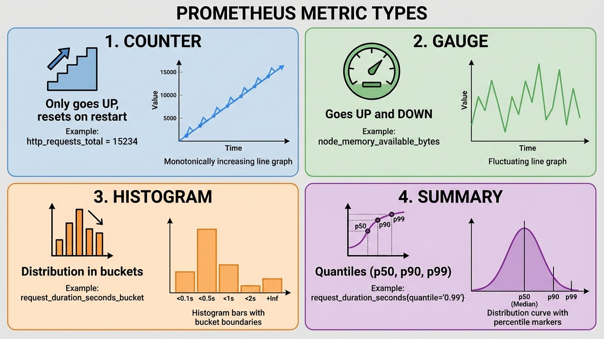

---
tags:
  - formation
  - observability
  - prometheus
  - grafana
  - monitoring
---

# Module 1 : Fondamentaux de l'Observabilité

## Objectifs du Module

- Comprendre les 3 piliers de l'observabilité
- Différencier monitoring et observabilité
- Découvrir l'écosystème Prometheus/Grafana
- Maîtriser les bases de PromQL

**Durée :** 2 heures

---

## 1. Monitoring vs Observabilité

### 1.1 Définitions


### 1.2 Les 3 Piliers


| Pilier | Question | Outils |
|--------|----------|--------|
| **Métriques** | Quoi ? Combien ? | Prometheus, InfluxDB |
| **Logs** | Détails, Contexte | Loki, Elasticsearch |
| **Traces** | Où ? Durée ? | Tempo, Jaeger, Zipkin |

Tous visualisés et corrélés dans **Grafana**.

### 1.3 Quand Utiliser Quoi ?

| Besoin | Pilier | Exemple |
|--------|--------|---------|
| Tendances, alertes seuils | Métriques | CPU > 80% pendant 5 min |
| Debug, investigation | Logs | Stack trace d'erreur |
| Latence distribuée | Traces | Requête lente à travers microservices |
| Corrélation | Les 3 | Spike CPU → Logs erreur → Trace lente |

---

## 2. Architecture Prometheus

### 2.1 Vue d'Ensemble


### 2.2 Modèle Pull vs Push

```yaml
# Prometheus utilise le modèle PULL
# → Prometheus va chercher les métriques (scrape)

# Avantages du Pull :
# - Prometheus contrôle la fréquence
# - Détection automatique des targets down
# - Pas de surcharge côté target
# - Service discovery natif

# Le Push existe via Pushgateway (cas spéciaux)
# → Pour jobs batch ou éphémères
```

### 2.3 Types de Métriques



---

## 3. Introduction à PromQL

### 3.1 Sélecteurs de Base

```promql
# Sélectionner une métrique
node_cpu_seconds_total

# Filtrer par label (égalité)
node_cpu_seconds_total{mode="idle"}

# Filtrer par label (regex)
node_cpu_seconds_total{mode=~"idle|iowait"}

# Exclure (négation)
node_cpu_seconds_total{mode!="idle"}

# Regex négation
node_cpu_seconds_total{mode!~"idle|iowait"}

# Combinaison
node_cpu_seconds_total{instance="server1:9100", mode="user"}
```

### 3.2 Opérateurs Temporels

```promql
# Valeur instantanée (instant vector)
node_memory_MemAvailable_bytes

# Valeurs sur une période (range vector)
node_memory_MemAvailable_bytes[5m]

# Offset : valeur dans le passé
node_memory_MemAvailable_bytes offset 1h

# Comparaison avec le passé
node_memory_MemAvailable_bytes / node_memory_MemAvailable_bytes offset 1h
```

### 3.3 Fonctions Essentielles

```promql
# Rate : taux de changement par seconde (pour counters)
rate(http_requests_total[5m])

# Irate : taux instantané (plus réactif, plus bruyant)
irate(http_requests_total[5m])

# Increase : augmentation sur une période
increase(http_requests_total[1h])

# Sum : agrégation
sum(rate(http_requests_total[5m]))

# Sum by : agrégation avec groupement
sum by (status_code) (rate(http_requests_total[5m]))

# Avg, min, max
avg(node_cpu_seconds_total{mode="idle"})

# Histogram quantile (percentiles)
histogram_quantile(0.95, rate(http_request_duration_seconds_bucket[5m]))
```

### 3.4 Exemples Pratiques

```promql
# CPU utilisé en pourcentage
100 - (avg by (instance) (rate(node_cpu_seconds_total{mode="idle"}[5m])) * 100)

# Mémoire utilisée en pourcentage
100 * (1 - node_memory_MemAvailable_bytes / node_memory_MemTotal_bytes)

# Requêtes par seconde par endpoint
sum by (handler) (rate(http_requests_total[5m]))

# Taux d'erreur (%)
sum(rate(http_requests_total{status=~"5.."}[5m]))
/
sum(rate(http_requests_total[5m])) * 100

# Latence P95
histogram_quantile(0.95,
  sum by (le) (rate(http_request_duration_seconds_bucket[5m]))
)

# Disk usage %
100 - (node_filesystem_avail_bytes / node_filesystem_size_bytes * 100)
```

---

## 4. Écosystème et Alternatives

### 4.1 Stack Prometheus/Grafana


### 4.2 Comparaison

| Critère | Prometheus | Zabbix | InfluxDB | Datadog |
|---------|------------|--------|----------|---------|
| Modèle | Pull | Push/Pull | Push | Push |
| Langage requête | PromQL | SQL-like | InfluxQL/Flux | Propriétaire |
| Scalabilité | Moyenne | Bonne | Bonne | Excellente |
| Coût | Gratuit | Gratuit | Freemium | Payant |
| Cloud-native | Excellent | Moyen | Bon | Excellent |
| Complexité | Moyenne | Élevée | Faible | Faible |

---

## 5. Lab : Premier Pas

### 5.1 Docker Compose Minimal

```yaml
# docker-compose.yml
version: '3.8'

services:
  prometheus:
    image: prom/prometheus:latest
    container_name: prometheus
    ports:
      - "9090:9090"
    volumes:
      - ./prometheus.yml:/etc/prometheus/prometheus.yml
      - prometheus_data:/prometheus
    command:
      - '--config.file=/etc/prometheus/prometheus.yml'
      - '--storage.tsdb.path=/prometheus'
      - '--web.enable-lifecycle'

  grafana:
    image: grafana/grafana:latest
    container_name: grafana
    ports:
      - "3000:3000"
    volumes:
      - grafana_data:/var/lib/grafana
    environment:
      - GF_SECURITY_ADMIN_PASSWORD=admin123

  node-exporter:
    image: prom/node-exporter:latest
    container_name: node-exporter
    ports:
      - "9100:9100"
    volumes:
      - /proc:/host/proc:ro
      - /sys:/host/sys:ro
      - /:/rootfs:ro
    command:
      - '--path.procfs=/host/proc'
      - '--path.sysfs=/host/sys'
      - '--collector.filesystem.mount-points-exclude=^/(sys|proc|dev|host|etc)($$|/)'

volumes:
  prometheus_data:
  grafana_data:
```

### 5.2 Configuration Prometheus

```yaml
# prometheus.yml
global:
  scrape_interval: 15s
  evaluation_interval: 15s

alerting:
  alertmanagers:
    - static_configs:
        - targets: []

rule_files: []

scrape_configs:
  # Prometheus se scrape lui-même
  - job_name: 'prometheus'
    static_configs:
      - targets: ['localhost:9090']

  # Node Exporter
  - job_name: 'node'
    static_configs:
      - targets: ['node-exporter:9100']
```

### 5.3 Démarrage et Vérification

```bash
# Démarrer la stack
docker-compose up -d

# Vérifier les containers
docker-compose ps

# Accéder aux interfaces
# Prometheus: http://localhost:9090
# Grafana: http://localhost:3000 (admin/admin123)
# Node Exporter: http://localhost:9100/metrics

# Vérifier les targets dans Prometheus
# Status → Targets → Tous doivent être UP

# Premières requêtes PromQL
# → up
# → node_cpu_seconds_total
# → rate(node_cpu_seconds_total[5m])
```

---

## 6. Exercice : À Vous de Jouer

!!! example "Mise en Pratique"
    **Objectif** : Maîtriser les requêtes PromQL de base et explorer les métriques Prometheus

    **Contexte** : Vous venez de déployer la stack Prometheus + Node Exporter. Vous devez analyser les métriques système pour comprendre l'état de votre serveur.

    **Tâches à réaliser** :

    1. Explorer les métriques disponibles via l'interface Prometheus (http://localhost:9090)
    2. Calculer le nombre de CPUs du système
    3. Calculer l'uptime du serveur en heures
    4. Afficher le pourcentage d'utilisation CPU
    5. Afficher le pourcentage de mémoire disponible
    6. Lister l'espace disque disponible par partition

    **Critères de validation** :

    - [ ] L'interface Prometheus est accessible
    - [ ] Les requêtes retournent des résultats cohérents
    - [ ] Vous savez différencier counter, gauge, et histogram
    - [ ] Vous comprenez la différence entre instant vector et range vector

??? quote "Solution"
    **1. Explorer les métriques**

    Accédez à http://localhost:9090/graph et utilisez l'auto-complétion pour découvrir les métriques `node_*`.

    **2. Nombre de CPUs**

    ```promql
    count(node_cpu_seconds_total{mode="idle"})
    ```

    **3. Uptime en heures**

    ```promql
    (time() - node_boot_time_seconds) / 3600
    ```

    Explication : `time()` retourne le timestamp Unix actuel, `node_boot_time_seconds` est le timestamp du démarrage.

    **4. Pourcentage CPU utilisé**

    ```promql
    100 - (avg(rate(node_cpu_seconds_total{mode="idle"}[5m])) * 100)
    ```

    Explication : On calcule le taux de CPU idle sur 5 minutes, puis on soustrait de 100 pour obtenir l'utilisation.

    **5. Pourcentage mémoire disponible**

    ```promql
    node_memory_MemAvailable_bytes / node_memory_MemTotal_bytes * 100
    ```

    **6. Espace disque par partition**

    ```promql
    node_filesystem_avail_bytes{fstype!~"tmpfs|overlay"}
    ```

    Pour l'afficher en GB :

    ```promql
    node_filesystem_avail_bytes{fstype!~"tmpfs|overlay"} / 1024 / 1024 / 1024
    ```

    **Requêtes bonus :**

    ```promql
    # Mémoire utilisée en %
    100 * (1 - node_memory_MemAvailable_bytes / node_memory_MemTotal_bytes)

    # Taux d'utilisation CPU par mode
    sum by (mode) (rate(node_cpu_seconds_total[5m]))

    # Network traffic en MB/s
    rate(node_network_receive_bytes_total[5m]) / 1024 / 1024
    ```

---

## Quiz

1. **Quel est le modèle de collecte de Prometheus ?**
   - [ ] A. Push (les targets envoient les métriques)
   - [ ] B. Pull (Prometheus va chercher les métriques)
   - [ ] C. Les deux

2. **Quel type de métrique pour un compteur de requêtes HTTP ?**
   - [ ] A. Gauge
   - [ ] B. Counter
   - [ ] C. Histogram

3. **Quelle fonction PromQL pour calculer un taux par seconde ?**
   - [ ] A. sum()
   - [ ] B. rate()
   - [ ] C. increase()

4. **Quel port par défaut pour Prometheus ?**
   - [ ] A. 3000
   - [ ] B. 9090
   - [ ] C. 9100

**Réponses :** 1-B, 2-B, 3-B, 4-B

---

**Suivant :** [Module 2 - Prometheus Déploiement](02-module.md)

---

## Navigation

| | |
|:---|---:|
| [← Programme](index.md) | [Module 2 : Prometheus - Déploiement e... →](02-module.md) |

[Retour au Programme](index.md){ .md-button }
