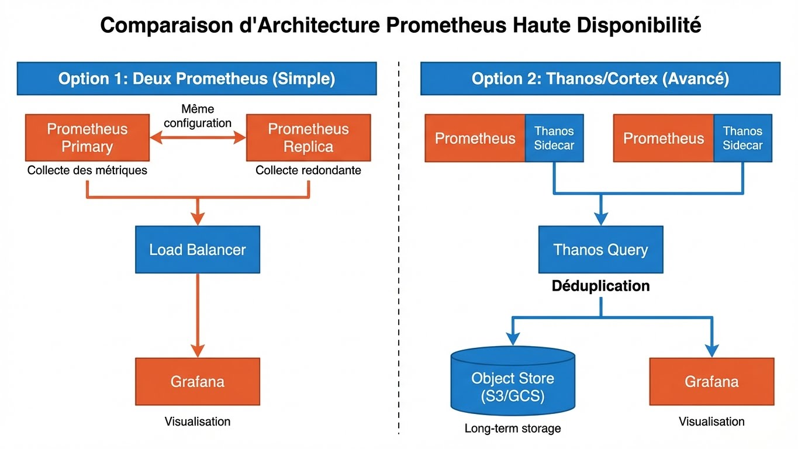

---
tags:
  - formation
  - observability
  - prometheus
  - configuration
  - service-discovery
---

# Module 2 : Prometheus - Déploiement et Configuration


## Objectifs du Module

- Installer Prometheus sur différentes plateformes
- Maîtriser la configuration du scraping
- Implémenter le service discovery
- Configurer le relabeling avancé
- Mettre en place la haute disponibilité

**Durée :** 3 heures

---

## 1. Installation

### 1.1 Docker (Recommandé pour Lab)

```yaml
# docker-compose.yml
version: '3.8'

services:
  prometheus:
    image: prom/prometheus:v2.47.0
    container_name: prometheus
    user: root
    ports:
      - "9090:9090"
    volumes:
      - ./prometheus/:/etc/prometheus/
      - prometheus_data:/prometheus
    command:
      - '--config.file=/etc/prometheus/prometheus.yml'
      - '--storage.tsdb.path=/prometheus'
      - '--storage.tsdb.retention.time=15d'
      - '--storage.tsdb.retention.size=10GB'
      - '--web.enable-lifecycle'
      - '--web.enable-admin-api'
    restart: unless-stopped

volumes:
  prometheus_data:
```

### 1.2 Installation Binaire (Production)

```bash
# Créer l'utilisateur
sudo useradd --no-create-home --shell /bin/false prometheus

# Créer les répertoires
sudo mkdir -p /etc/prometheus /var/lib/prometheus
sudo chown prometheus:prometheus /etc/prometheus /var/lib/prometheus

# Télécharger et extraire
VERSION="2.47.0"
wget https://github.com/prometheus/prometheus/releases/download/v${VERSION}/prometheus-${VERSION}.linux-amd64.tar.gz
tar xvfz prometheus-${VERSION}.linux-amd64.tar.gz
cd prometheus-${VERSION}.linux-amd64

# Copier les binaires
sudo cp prometheus promtool /usr/local/bin/
sudo chown prometheus:prometheus /usr/local/bin/prometheus /usr/local/bin/promtool

# Copier les fichiers de config
sudo cp -r consoles console_libraries /etc/prometheus/
sudo cp prometheus.yml /etc/prometheus/
sudo chown -R prometheus:prometheus /etc/prometheus

# Vérifier
prometheus --version
promtool check config /etc/prometheus/prometheus.yml
```

### 1.3 Service Systemd

```ini
# /etc/systemd/system/prometheus.service
[Unit]
Description=Prometheus Monitoring System
Documentation=https://prometheus.io/docs/introduction/overview/
Wants=network-online.target
After=network-online.target

[Service]
Type=simple
User=prometheus
Group=prometheus
ExecReload=/bin/kill -HUP $MAINPID
ExecStart=/usr/local/bin/prometheus \
  --config.file=/etc/prometheus/prometheus.yml \
  --storage.tsdb.path=/var/lib/prometheus \
  --storage.tsdb.retention.time=30d \
  --storage.tsdb.retention.size=50GB \
  --web.console.templates=/etc/prometheus/consoles \
  --web.console.libraries=/etc/prometheus/console_libraries \
  --web.listen-address=0.0.0.0:9090 \
  --web.enable-lifecycle \
  --web.enable-admin-api

SyslogIdentifier=prometheus
Restart=always
RestartSec=5

[Install]
WantedBy=multi-user.target
```

```bash
# Activer et démarrer
sudo systemctl daemon-reload
sudo systemctl enable prometheus
sudo systemctl start prometheus
sudo systemctl status prometheus

# Vérifier les logs
journalctl -u prometheus -f
```

### 1.4 Installation Kubernetes (Helm)

```bash
# Ajouter le repo Helm
helm repo add prometheus-community https://prometheus-community.github.io/helm-charts
helm repo update

# Installation basique
helm install prometheus prometheus-community/prometheus \
  --namespace monitoring \
  --create-namespace

# Installation avec valeurs personnalisées
helm install prometheus prometheus-community/prometheus \
  --namespace monitoring \
  --create-namespace \
  -f values.yaml
```

```yaml
# values.yaml
server:
  retention: "30d"
  persistentVolume:
    enabled: true
    size: 50Gi
  resources:
    requests:
      memory: 2Gi
      cpu: 500m
    limits:
      memory: 4Gi
      cpu: 1000m

alertmanager:
  enabled: true

nodeExporter:
  enabled: true

pushgateway:
  enabled: false
```

---

## 2. Configuration Détaillée

### 2.1 Structure du Fichier

```yaml
# prometheus.yml - Structure complète
global:
  scrape_interval: 15s       # Fréquence de scraping par défaut
  scrape_timeout: 10s        # Timeout par scrape
  evaluation_interval: 15s   # Fréquence évaluation des règles

  # Labels ajoutés à toutes les métriques/alertes
  external_labels:
    environment: production
    datacenter: dc1

# Configuration Alertmanager
alerting:
  alertmanagers:
    - static_configs:
        - targets:
            - alertmanager:9093
      timeout: 10s
      api_version: v2

# Fichiers de règles (alertes + recording)
rule_files:
  - "/etc/prometheus/rules/*.yml"
  - "/etc/prometheus/alerts/*.yml"

# Configuration des scrapes
scrape_configs:
  - job_name: 'prometheus'
    # ... configuration ...
```

### 2.2 Configuration Scrape Complète

```yaml
scrape_configs:
  # Job basique
  - job_name: 'prometheus'
    static_configs:
      - targets: ['localhost:9090']

  # Job avec options avancées
  - job_name: 'application'
    # Override global
    scrape_interval: 30s
    scrape_timeout: 25s

    # Path personnalisé (défaut: /metrics)
    metrics_path: '/actuator/prometheus'

    # Schéma (http ou https)
    scheme: https

    # TLS
    tls_config:
      ca_file: /etc/prometheus/ca.crt
      cert_file: /etc/prometheus/client.crt
      key_file: /etc/prometheus/client.key
      insecure_skip_verify: false

    # Authentification Basic
    basic_auth:
      username: prometheus
      password_file: /etc/prometheus/password

    # Ou Bearer Token
    # authorization:
    #   type: Bearer
    #   credentials_file: /etc/prometheus/token

    static_configs:
      - targets:
          - 'app1.example.com:8080'
          - 'app2.example.com:8080'
        labels:
          team: backend
          service: api
```

### 2.3 Paramètres de Storage

```bash
# Options de ligne de commande importantes

# Rétention par temps
--storage.tsdb.retention.time=30d

# Rétention par taille (prend le dessus)
--storage.tsdb.retention.size=50GB

# Chemin de stockage
--storage.tsdb.path=/var/lib/prometheus

# Intervalle de compaction minimum
--storage.tsdb.min-block-duration=2h

# Intervalle de compaction maximum
--storage.tsdb.max-block-duration=72h

# Limite mémoire pour les chunks
--storage.tsdb.max-bytes=0  # 0 = illimité

# Calcul approximatif de l'espace disque :
# Taille = retention_time * ingestion_rate * bytes_per_sample
# ~1-2 bytes par sample avec compression
# Exemple: 1000 métriques * 15s interval * 30 jours
#          = 1000 * 4 * 60 * 24 * 30 = 172.8M samples
#          ≈ 350 MB
```

---

## 3. Service Discovery

### 3.1 Static Config

```yaml
scrape_configs:
  - job_name: 'static-nodes'
    static_configs:
      - targets:
          - 'server1:9100'
          - 'server2:9100'
          - 'server3:9100'
        labels:
          env: production
          dc: paris
```

### 3.2 File-based Discovery

```yaml
# prometheus.yml
scrape_configs:
  - job_name: 'file-discovery'
    file_sd_configs:
      - files:
          - '/etc/prometheus/targets/*.json'
          - '/etc/prometheus/targets/*.yml'
        refresh_interval: 30s
```

```json
// /etc/prometheus/targets/nodes.json
[
  {
    "targets": ["server1:9100", "server2:9100"],
    "labels": {
      "env": "production",
      "team": "infrastructure"
    }
  },
  {
    "targets": ["dev-server:9100"],
    "labels": {
      "env": "development",
      "team": "infrastructure"
    }
  }
]
```

```yaml
# /etc/prometheus/targets/apps.yml
- targets:
    - 'api1:8080'
    - 'api2:8080'
  labels:
    service: api
    env: production
```

### 3.3 Docker Service Discovery

```yaml
scrape_configs:
  - job_name: 'docker'
    docker_sd_configs:
      - host: unix:///var/run/docker.sock
        refresh_interval: 30s
        filters:
          - name: label
            values: ["prometheus.scrape=true"]

    relabel_configs:
      # Utiliser le nom du container comme instance
      - source_labels: [__meta_docker_container_name]
        regex: '/(.*)'
        target_label: container

      # Récupérer le port exposé
      - source_labels: [__meta_docker_port_private]
        target_label: port

      # Labels Docker comme labels Prometheus
      - source_labels: [__meta_docker_container_label_app]
        target_label: app
```

### 3.4 Kubernetes Service Discovery

```yaml
scrape_configs:
  # Découverte des Pods
  - job_name: 'kubernetes-pods'
    kubernetes_sd_configs:
      - role: pod

    relabel_configs:
      # Ne scraper que les pods avec annotation
      - source_labels: [__meta_kubernetes_pod_annotation_prometheus_io_scrape]
        action: keep
        regex: true

      # Path depuis annotation
      - source_labels: [__meta_kubernetes_pod_annotation_prometheus_io_path]
        action: replace
        target_label: __metrics_path__
        regex: (.+)

      # Port depuis annotation
      - source_labels: [__address__, __meta_kubernetes_pod_annotation_prometheus_io_port]
        action: replace
        regex: ([^:]+)(?::\d+)?;(\d+)
        replacement: $1:$2
        target_label: __address__

      # Labels Kubernetes
      - source_labels: [__meta_kubernetes_namespace]
        target_label: namespace
      - source_labels: [__meta_kubernetes_pod_name]
        target_label: pod
      - source_labels: [__meta_kubernetes_pod_label_app]
        target_label: app

  # Découverte des Services
  - job_name: 'kubernetes-services'
    kubernetes_sd_configs:
      - role: service

    relabel_configs:
      - source_labels: [__meta_kubernetes_service_annotation_prometheus_io_scrape]
        action: keep
        regex: true

  # Découverte des Endpoints
  - job_name: 'kubernetes-endpoints'
    kubernetes_sd_configs:
      - role: endpoints
```

### 3.5 Consul Service Discovery

```yaml
scrape_configs:
  - job_name: 'consul'
    consul_sd_configs:
      - server: 'consul.example.com:8500'
        token: 'your-acl-token'
        datacenter: dc1
        services:
          - api
          - web
          - database

    relabel_configs:
      - source_labels: [__meta_consul_service]
        target_label: service
      - source_labels: [__meta_consul_tags]
        target_label: tags
      - source_labels: [__meta_consul_dc]
        target_label: datacenter
```

---

## 4. Relabeling

### 4.1 Concept


### 4.2 Actions de Relabeling

```yaml
relabel_configs:
  # 1. KEEP - Garder si match
  - source_labels: [__meta_kubernetes_pod_phase]
    action: keep
    regex: Running

  # 2. DROP - Supprimer si match
  - source_labels: [__meta_kubernetes_namespace]
    action: drop
    regex: kube-system

  # 3. REPLACE - Remplacer/Créer un label
  - source_labels: [__meta_kubernetes_pod_name]
    target_label: pod
    action: replace

  # 4. REPLACE avec regex et groups
  - source_labels: [__meta_docker_container_name]
    regex: '/(.*)-(.*)'
    replacement: '${1}'
    target_label: app

  # 5. LABELMAP - Copier labels par regex
  - action: labelmap
    regex: __meta_kubernetes_pod_label_(.+)
    replacement: k8s_${1}

  # 6. LABELDROP - Supprimer labels par regex
  - action: labeldrop
    regex: 'k8s_.*'

  # 7. LABELKEEP - Garder uniquement labels par regex
  - action: labelkeep
    regex: 'instance|job|app|env'

  # 8. HASHMOD - Sharding
  - source_labels: [__address__]
    modulus: 3
    target_label: __tmp_hash
    action: hashmod

  # 9. Combiner plusieurs labels
  - source_labels: [namespace, pod]
    separator: '/'
    target_label: full_name
```

### 4.3 Exemples Pratiques

```yaml
scrape_configs:
  - job_name: 'kubernetes-pods'
    kubernetes_sd_configs:
      - role: pod

    relabel_configs:
      # Garder uniquement les pods avec l'annotation scrape
      - source_labels: [__meta_kubernetes_pod_annotation_prometheus_io_scrape]
        action: keep
        regex: "true"

      # Ne pas scraper les pods du namespace kube-system
      - source_labels: [__meta_kubernetes_namespace]
        action: drop
        regex: "kube-system"

      # Utiliser le port de l'annotation
      - source_labels: [__address__, __meta_kubernetes_pod_annotation_prometheus_io_port]
        action: replace
        regex: ([^:]+)(?::\d+)?;(\d+)
        replacement: $1:$2
        target_label: __address__

      # Utiliser le path de l'annotation
      - source_labels: [__meta_kubernetes_pod_annotation_prometheus_io_path]
        action: replace
        target_label: __metrics_path__
        regex: (.+)

      # Extraire tous les labels du pod
      - action: labelmap
        regex: __meta_kubernetes_pod_label_(.+)

      # Labels standard
      - source_labels: [__meta_kubernetes_namespace]
        target_label: namespace
      - source_labels: [__meta_kubernetes_pod_name]
        target_label: pod
      - source_labels: [__meta_kubernetes_pod_node_name]
        target_label: node
```

---

## 5. Haute Disponibilité

### 5.1 Architecture HA



### 5.2 Configuration HA Simple

```yaml
# prometheus-1.yml
global:
  external_labels:
    replica: prometheus-1

# prometheus-2.yml
global:
  external_labels:
    replica: prometheus-2

# Même scrape_configs pour les deux
```

```yaml
# docker-compose.yml pour HA
version: '3.8'

services:
  prometheus-1:
    image: prom/prometheus:latest
    volumes:
      - ./prometheus-1.yml:/etc/prometheus/prometheus.yml
    ports:
      - "9090:9090"

  prometheus-2:
    image: prom/prometheus:latest
    volumes:
      - ./prometheus-2.yml:/etc/prometheus/prometheus.yml
    ports:
      - "9091:9090"

  nginx:
    image: nginx:alpine
    volumes:
      - ./nginx.conf:/etc/nginx/nginx.conf
    ports:
      - "9080:80"
    depends_on:
      - prometheus-1
      - prometheus-2
```

### 5.3 Federation

```yaml
# prometheus-global.yml
scrape_configs:
  # Fédérer depuis les Prometheus régionaux
  - job_name: 'federate'
    scrape_interval: 60s

    honor_labels: true
    metrics_path: '/federate'

    params:
      'match[]':
        - '{job="node"}'
        - '{job="app"}'
        - '{__name__=~"job:.*"}'  # Recording rules

    static_configs:
      - targets:
          - 'prometheus-dc1:9090'
          - 'prometheus-dc2:9090'
          - 'prometheus-dc3:9090'
```

---

## 6. Exercice : À Vous de Jouer

!!! example "Mise en Pratique"
    **Objectif** : Déployer Prometheus en production avec service discovery et relabeling avancé

    **Contexte** : Votre entreprise souhaite monitorer une flotte de serveurs web et d'applications conteneurisées. Vous devez configurer Prometheus pour découvrir automatiquement les targets et appliquer des labels personnalisés.

    **Tâches à réaliser** :

    1. Déployer Prometheus avec Docker et configurer la rétention à 7 jours
    2. Configurer le file-based service discovery pour gérer dynamiquement les nodes
    3. Ajouter le Docker service discovery pour les conteneurs avec le label `prometheus.scrape=true`
    4. Créer des relabel rules pour extraire le hostname depuis l'adresse IP:PORT
    5. Configurer des external_labels pour identifier l'environnement
    6. Valider la configuration avec `promtool`

    **Critères de validation** :

    - [ ] Prometheus démarre sans erreur
    - [ ] La rétention est configurée à 7 jours
    - [ ] Les targets du fichier JSON/YAML sont découvertes automatiquement
    - [ ] Les conteneurs Docker avec le bon label sont scrapés
    - [ ] Les labels sont correctement transformés
    - [ ] L'API /targets montre toutes les targets actives

??? quote "Solution"
    **1. Docker Compose avec rétention**

    ```yaml
    version: '3.8'
    services:
      prometheus:
        image: prom/prometheus:latest
        ports:
          - "9090:9090"
        volumes:
          - ./prometheus.yml:/etc/prometheus/prometheus.yml
          - ./targets:/etc/prometheus/targets
          - prometheus_data:/prometheus
        command:
          - '--config.file=/etc/prometheus/prometheus.yml'
          - '--storage.tsdb.path=/prometheus'
          - '--storage.tsdb.retention.time=7d'
          - '--web.enable-lifecycle'

    volumes:
      prometheus_data:
    ```

    **2. Configuration prometheus.yml**

    ```yaml
    global:
      scrape_interval: 15s
      evaluation_interval: 15s
      external_labels:
        environment: production
        datacenter: dc1

    scrape_configs:
      - job_name: 'prometheus'
        static_configs:
          - targets: ['localhost:9090']

      # File-based service discovery
      - job_name: 'nodes'
        file_sd_configs:
          - files:
              - '/etc/prometheus/targets/*.json'
              - '/etc/prometheus/targets/*.yml'
            refresh_interval: 30s

        relabel_configs:
          # Extraire hostname de IP:PORT
          - source_labels: [__address__]
            regex: '([^:]+):.*'
            target_label: hostname
            replacement: '${1}'

      # Docker service discovery
      - job_name: 'docker'
        docker_sd_configs:
          - host: unix:///var/run/docker.sock
            refresh_interval: 30s

        relabel_configs:
          # Garder uniquement conteneurs avec label scrape=true
          - source_labels: [__meta_docker_container_label_prometheus_scrape]
            action: keep
            regex: 'true'

          # Extraire le nom du conteneur
          - source_labels: [__meta_docker_container_name]
            regex: '/(.*)'
            target_label: container_name

          # Utiliser le label "app" comme label Prometheus
          - source_labels: [__meta_docker_container_label_app]
            target_label: app
    ```

    **3. Fichier de targets (targets/nodes.json)**

    ```json
    [
      {
        "targets": ["server1:9100", "server2:9100", "server3:9100"],
        "labels": {
          "env": "production",
          "role": "webserver"
        }
      },
      {
        "targets": ["db1:9100", "db2:9100"],
        "labels": {
          "env": "production",
          "role": "database"
        }
      }
    ]
    ```

    **4. Validation**

    ```bash
    # Vérifier la configuration avant démarrage
    docker run --rm -v $(pwd)/prometheus.yml:/prometheus.yml \
      prom/prometheus:latest \
      promtool check config /prometheus.yml

    # Démarrer la stack
    docker-compose up -d

    # Vérifier les targets
    curl http://localhost:9090/api/v1/targets | jq '.data.activeTargets[] | {job: .labels.job, instance: .labels.instance, health: .health}'

    # Recharger la configuration sans redémarrage
    curl -X POST http://localhost:9090/-/reload

    # Vérifier les métriques scrapées
    curl http://localhost:9090/api/v1/query?query=up | jq .
    ```

    **Vérifications importantes :**

    - Toutes les targets doivent être `UP`
    - Les labels `hostname`, `env`, `role` doivent apparaître
    - La rétention est visible dans les logs : `Storage retention=7d`

---

## Quiz

1. **Quel service discovery pour Kubernetes ?**
   - [ ] A. static_configs
   - [ ] B. kubernetes_sd_configs
   - [ ] C. docker_sd_configs

2. **Quelle action relabel pour filtrer les targets ?**
   - [ ] A. replace
   - [ ] B. labelmap
   - [ ] C. keep/drop

3. **Quel paramètre pour la rétention ?**
   - [ ] A. --storage.tsdb.retention.time
   - [ ] B. --retention-period
   - [ ] C. --data.retention

**Réponses :** 1-B, 2-C, 3-A

---

**Précédent :** [Module 1 - Fondamentaux](01-module.md)

**Suivant :** [Module 3 - Exporters](03-module.md)

---

## Navigation

| | |
|:---|---:|
| [← Module 1 : Fondamentaux de l'Observab...](01-module.md) | [Module 3 : Exporters et Instrumentation →](03-module.md) |

[Retour au Programme](index.md){ .md-button }
