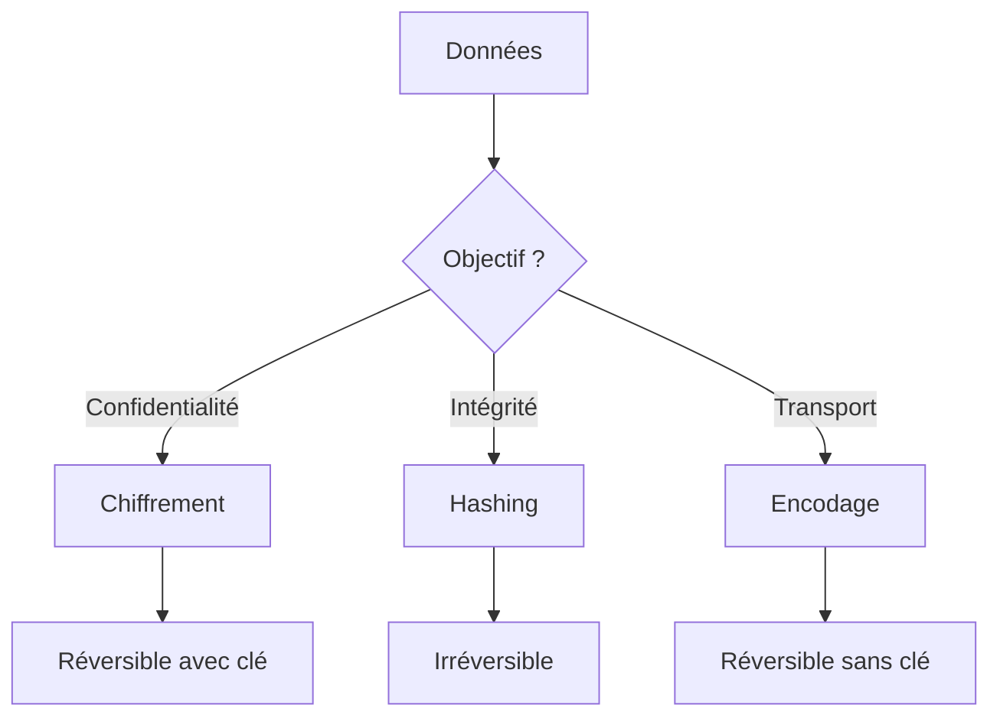
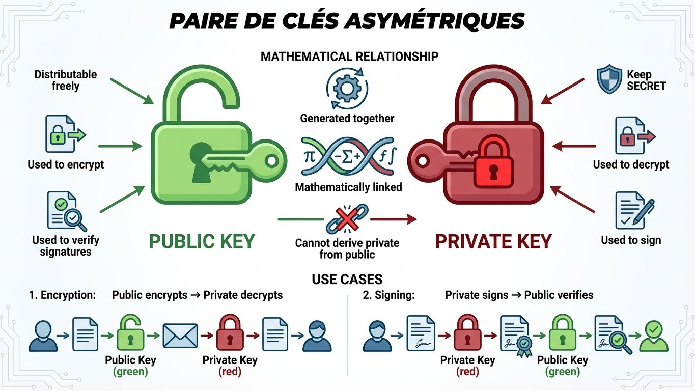
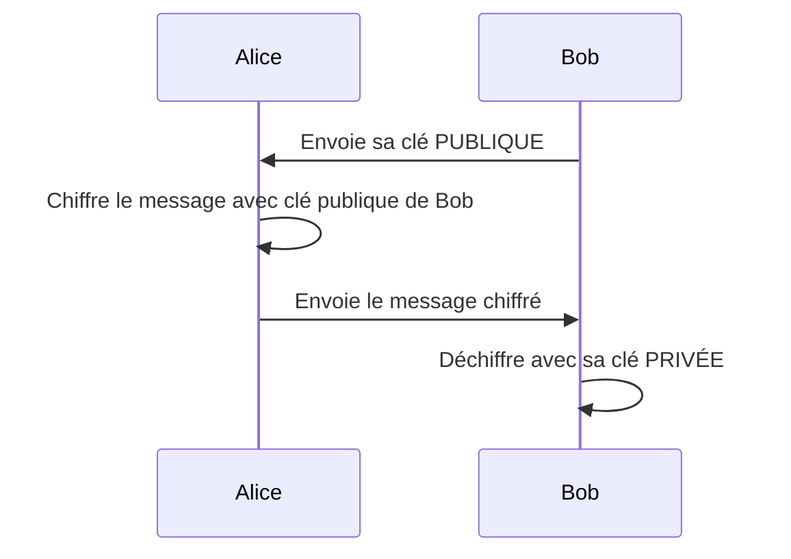
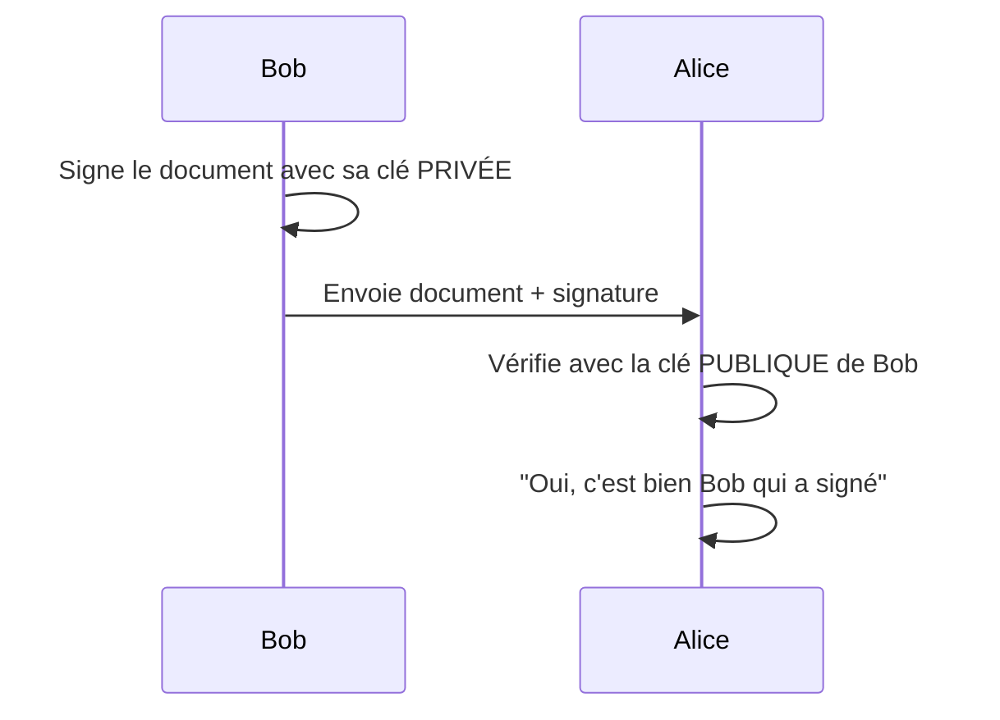

---
tags:
  - formation
  - crypto
  - security
  - theory
---

# Module 1 : Fondamentaux Cryptographiques

## Objectifs du Module

À la fin de ce module, vous serez capable de :

- Distinguer chiffrement, hashing et encodage
- Expliquer la différence entre cryptographie symétrique et asymétrique
- Choisir l'algorithme approprié selon le cas d'usage
- Appliquer les recommandations ANSSI pour les tailles de clés

---

## 1. Les 3 Piliers de la Cryptographie

Avant de manipuler des certificats, il faut comprendre les concepts fondamentaux.

### Vue d'ensemble



| Concept | Réversible | Utilise des clés | Objectif | Exemples |
|---------|------------|------------------|----------|----------|
| **Chiffrement** | Oui | Oui | Confidentialité | AES, RSA, ChaCha20 |
| **Hashing** | Non | Non | Intégrité | SHA256, bcrypt |
| **Encodage** | Oui | Non | Transport/Format | Base64, Hex |

---

### 1.1 Chiffrement (Encryption)

Le chiffrement transforme des données lisibles en données illisibles, réversible uniquement avec la bonne clé.

```
Texte clair + Clé → [Chiffrement] → Texte chiffré
Texte chiffré + Clé → [Déchiffrement] → Texte clair
```

**Cas d'usage :**

- Protection de fichiers sensibles
- Communications sécurisées (HTTPS, SSH)
- Chiffrement de disque (BitLocker, LUKS)
- Messagerie chiffrée (Signal, WhatsApp)

!!! info "Vocabulaire Français Correct"
    | Terme | Définition | Usage |
    |-------|------------|-------|
    | **Chiffrer** | Transformer avec une clé | Correct |
    | **Déchiffrer** | Inverser avec la clé | Correct |
    | **Décrypter** | Inverser sans la clé (attaque) | Contexte sécurité |
    | **Crypter** | N'existe pas en français | À éviter |

---

### 1.2 Hashing (Hachage)

Le hashing produit une empreinte de taille fixe, impossible à inverser.

```
Données → [Fonction Hash] → Empreinte (digest)

"Hello" → SHA256 → 2cf24dba5fb0a30e26e83b2ac5b9e29e...
"Hello!" → SHA256 → 33d7c290db4c... (complètement différent)
```

**Propriétés essentielles :**

- **Déterministe** : Même entrée = même sortie
- **Sens unique** : Impossible de retrouver l'original
- **Effet avalanche** : 1 bit modifié = hash totalement différent
- **Résistance aux collisions** : Difficile de trouver deux entrées avec le même hash

**Cas d'usage :**

- Stockage de mots de passe (avec salt !)
- Vérification d'intégrité de fichiers
- Signatures numériques
- Blockchain

=== "Linux"

    ```bash
    # Calculer le hash SHA256 d'un fichier
    sha256sum fichier.txt

    # Avec OpenSSL
    openssl dgst -sha256 fichier.txt
    ```

=== "PowerShell"

    ```powershell
    # Calculer le hash SHA256 d'un fichier
    Get-FileHash -Algorithm SHA256 fichier.txt
    ```

---

### 1.3 Encodage (Encoding)

L'encodage change le format des données pour le transport. **Ce n'est PAS de la sécurité !**

```
Binaire → [Base64] → Texte ASCII
Texte → [URL Encoding] → Texte compatible URL
```

!!! danger "Encodage ≠ Sécurité"
    Base64 n'est **pas du chiffrement**. N'importe qui peut le décoder instantanément.

    ```bash
    # "Secret" encodé en Base64
    echo "U2VjcmV0" | base64 -d
    # Résultat : Secret
    ```

**Cas d'usage :**

- Pièces jointes email (MIME)
- URLs (URL encoding)
- Certificats (format PEM = Base64)
- JSON avec données binaires

---

## 2. Symétrique vs Asymétrique

### 2.1 Chiffrement Symétrique

**Une seule clé secrète** pour chiffrer ET déchiffrer.

```
┌─────────────────────────────────────┐
│           Clé Secrète               │
│      (partagée entre les deux)      │
└──────────────┬──────────────────────┘
               │
    ┌──────────┴──────────┐
    ▼                     ▼
[Chiffrer]            [Déchiffrer]
    │                     │
Clair → Chiffré      Chiffré → Clair
```

| Avantages | Inconvénients |
|-----------|---------------|
| Très rapide | Distribution de la clé complexe |
| Efficace pour gros volumes | Si la clé fuite, tout est compromis |
| Simple à implémenter | Besoin d'un canal sécurisé pour l'échange |

**Algorithmes recommandés :**

| Algorithme | Taille de clé | Usage |
|------------|---------------|-------|
| **AES-256** | 256 bits | Standard, très répandu |
| **ChaCha20** | 256 bits | Mobile, performance |
| 3DES | 168 bits | Déprécié, à éviter |

**Exemple pratique :**

=== "Linux"

    ```bash
    # Chiffrer un fichier avec AES-256
    openssl enc -aes-256-cbc -salt -pbkdf2 -in secret.txt -out secret.enc

    # Déchiffrer
    openssl enc -d -aes-256-cbc -pbkdf2 -in secret.enc -out secret.txt
    ```

=== "PowerShell"

    ```powershell
    # Utiliser OpenSSL sur Windows
    openssl enc -aes-256-cbc -salt -pbkdf2 -in secret.txt -out secret.enc
    ```

---

### 2.2 Chiffrement Asymétrique

**Deux clés liées mathématiquement** : une publique, une privée.



#### Pour le Chiffrement (Confidentialité)

**Clé publique chiffre → Clé privée déchiffre**



#### Pour la Signature (Authentification)

**Clé privée signe → Clé publique vérifie**



| Avantages | Inconvénients |
|-----------|---------------|
| Pas de problème de distribution | Beaucoup plus lent |
| Signatures numériques | Taille de données limitée |
| Non-répudiation | Calculs complexes |

**Algorithmes recommandés (ANSSI) :**

| Algorithme | Taille de clé minimale | Recommandation |
|------------|------------------------|----------------|
| **RSA** | 3072 bits | 4096 bits pour long terme |
| **ECDSA** | P-256 (256 bits) | P-384 recommandé |
| **Ed25519** | 256 bits | Moderne, performant |

---

### 2.3 Chiffrement Hybride (Le Monde Réel)

Les systèmes modernes combinent les deux approches :

1. **Asymétrique** pour échanger une clé de session
2. **Symétrique** pour chiffrer les données (rapide)


**Exemple : HTTPS (TLS)**

1. Le client et le serveur négocient avec RSA/ECDH
2. Ils génèrent une clé AES-256 partagée
3. Tout le trafic est chiffré en AES (rapide)

---

## 3. Recommandations ANSSI

L'ANSSI (Agence Nationale de la Sécurité des Systèmes d'Information) publie des recommandations pour les environnements sensibles (SecNumCloud, etc.).

### Algorithmes et Tailles de Clés

| Type | Algorithme | Minimum | Recommandé |
|------|------------|---------|------------|
| **Symétrique** | AES | 128 bits | 256 bits |
| **Asymétrique RSA** | RSA | 3072 bits | 4096 bits |
| **Asymétrique EC** | ECDSA | P-256 | P-384 |
| **Hash** | SHA | SHA-256 | SHA-384/512 |

### Durée de Validité des Certificats

| Type de certificat | Durée maximale |
|--------------------|----------------|
| Certificat public (web) | 1 an (398 jours) |
| Certificat interne | 2-3 ans |
| Certificat CA intermédiaire | 5-10 ans |
| Certificat CA Root | 20-30 ans |

!!! warning "Certificats Expirés"
    Un certificat expiré = service indisponible.

    La gestion du cycle de vie est **critique** en production.

---

## 4. Exercice Pratique

### Objectif

Manipuler les différents concepts avec OpenSSL.

### Tâches

??? example "Exercice 1 : Hashing"
    Créez un fichier texte et calculez son hash SHA256.
    Modifiez un seul caractère et recalculez. Que constatez-vous ?

    ```bash
    echo "Hello World" > test.txt
    sha256sum test.txt

    echo "Hello World!" > test.txt
    sha256sum test.txt
    ```

??? example "Exercice 2 : Chiffrement Symétrique"
    Chiffrez un fichier avec AES-256, puis déchiffrez-le.

    ```bash
    # Créer un fichier secret
    echo "Mon secret" > secret.txt

    # Chiffrer
    openssl enc -aes-256-cbc -salt -pbkdf2 -in secret.txt -out secret.enc

    # Vérifier que le fichier est illisible
    cat secret.enc

    # Déchiffrer
    openssl enc -d -aes-256-cbc -pbkdf2 -in secret.enc -out decrypted.txt
    cat decrypted.txt
    ```

??? example "Exercice 3 : Clés Asymétriques"
    Générez une paire de clés RSA 4096 bits.

    ```bash
    # Générer la clé privée
    openssl genrsa -out private.pem 4096

    # Extraire la clé publique
    openssl rsa -in private.pem -pubout -out public.pem

    # Voir les détails
    openssl rsa -in private.pem -text -noout | head -20
    ```

??? quote "Solutions"
    **Exercice 1 :** L'effet avalanche fait que le hash change complètement, même pour une modification minime.

    **Exercice 2 :** Le fichier `.enc` contient des données binaires illisibles. Seul le bon mot de passe permet de récupérer le contenu.

    **Exercice 3 :** La clé privée contient tous les paramètres (p, q, d, e, n), tandis que la clé publique ne contient que (e, n).

---

## Exercice : À Vous de Jouer

!!! example "Mise en Pratique"
    **Objectif** : Maîtriser les concepts cryptographiques fondamentaux et leur mise en œuvre avec OpenSSL

    **Contexte** : Vous travaillez dans l'équipe sécurité d'une entreprise qui souhaite protéger des fichiers sensibles avant leur archivage. Vous devez comprendre et appliquer les différentes techniques cryptographiques pour garantir confidentialité et intégrité.

    **Tâches à réaliser** :

    1. Créez un fichier texte contenant des données sensibles (ex: "Données confidentielles de l'entreprise XYZ")
    2. Calculez l'empreinte SHA-256 de ce fichier, puis modifiez un seul caractère et recalculez pour observer l'effet avalanche
    3. Chiffrez le fichier avec AES-256-CBC en mode symétrique, vérifiez qu'il est illisible, puis déchiffrez-le
    4. Générez une paire de clés RSA 4096 bits conforme aux recommandations ANSSI
    5. Extrayez la clé publique et comparez les informations avec la clé privée

    **Critères de validation** :

    - [ ] Le hash SHA-256 change complètement même avec une modification mineure
    - [ ] Le fichier chiffré en AES-256 est totalement illisible sans la clé
    - [ ] Le déchiffrement restaure exactement le contenu original
    - [ ] La clé RSA générée fait bien 4096 bits
    - [ ] La clé publique ne contient que les paramètres (e, n) tandis que la privée contient tous les paramètres

??? quote "Solution"
    **Étape 1 : Création du fichier et calcul de hash**

    ```bash
    # Créer le fichier
    echo "Données confidentielles de l'entreprise XYZ" > secret.txt

    # Calculer le hash SHA-256
    sha256sum secret.txt
    # Ou avec OpenSSL
    openssl dgst -sha256 secret.txt

    # Modifier un caractère
    echo "Données confidentielles de l'entreprise XYz" > secret.txt

    # Recalculer le hash
    sha256sum secret.txt
    ```

    **Observation** : L'empreinte SHA-256 change complètement, démontrant l'effet avalanche. Même une modification d'un seul bit produit un hash totalement différent.

    **Étape 2 : Chiffrement symétrique AES-256**

    ```bash
    # Recréer le fichier original
    echo "Données confidentielles de l'entreprise XYZ" > secret.txt

    # Chiffrer avec AES-256-CBC
    openssl enc -aes-256-cbc -salt -pbkdf2 -in secret.txt -out secret.enc
    # Entrez un mot de passe fort quand demandé

    # Vérifier que le fichier est illisible
    cat secret.enc
    # Affiche des caractères binaires illisibles

    # Déchiffrer
    openssl enc -d -aes-256-cbc -pbkdf2 -in secret.enc -out decrypted.txt
    # Entrez le même mot de passe

    # Vérifier le contenu
    cat decrypted.txt
    # Doit afficher : Données confidentielles de l'entreprise XYZ
    ```

    **Explication** : Le chiffrement AES-256 transforme les données en contenu binaire illisible. Seul le bon mot de passe permet de récupérer le contenu original. L'option `-pbkdf2` renforce la sécurité de la dérivation de clé.

    **Étape 3 : Génération de clés RSA 4096 bits**

    ```bash
    # Générer la clé privée RSA 4096 bits
    openssl genrsa -out private_rsa.pem 4096

    # Vérifier la taille de la clé
    openssl rsa -in private_rsa.pem -text -noout | head -1
    # Doit afficher : Private-Key: (4096 bit, 2 primes)

    # Extraire la clé publique
    openssl rsa -in private_rsa.pem -pubout -out public_rsa.pem

    # Examiner la clé privée (premiers 30 lignes)
    openssl rsa -in private_rsa.pem -text -noout | head -30
    # Contient : modulus (n), publicExponent (e), privateExponent (d),
    # prime1 (p), prime2 (q), etc.

    # Examiner la clé publique
    openssl rsa -pubin -in public_rsa.pem -text -noout
    # Contient uniquement : modulus (n) et Exponent (e)
    ```

    **Explication** : La clé privée contient tous les paramètres mathématiques nécessaires au chiffrement et au déchiffrement (notamment les nombres premiers p et q), tandis que la clé publique ne contient que le modulus n et l'exposant public e. C'est pourquoi la clé privée doit rester secrète.

    **Points clés à retenir** :

    - Le **hashing** (SHA-256) est irréversible et détecte toute modification
    - Le **chiffrement symétrique** (AES-256) est rapide mais nécessite un partage sécurisé de la clé
    - Le **chiffrement asymétrique** (RSA) utilise deux clés liées mathématiquement
    - Les recommandations ANSSI (RSA 4096, SHA-256+, AES-256) garantissent une sécurité à long terme

---

## 5. Quiz de Validation

??? question "Question 1 : Quelle est la différence entre chiffrement et hashing ?"
    **Réponse :** Le chiffrement est réversible avec la bonne clé, le hashing est irréversible (sens unique).

??? question "Question 2 : Base64 est-il sécurisé pour protéger des données ?"
    **Réponse :** Non ! Base64 est un encodage, pas du chiffrement. N'importe qui peut le décoder.

??? question "Question 3 : Quelle taille de clé RSA recommande l'ANSSI ?"
    **Réponse :** Minimum 3072 bits, recommandé 4096 bits pour le long terme.

??? question "Question 4 : Dans TLS/HTTPS, quel type de chiffrement est utilisé pour les données ?"
    **Réponse :** Chiffrement symétrique (AES), après échange de clé en asymétrique.

??? question "Question 5 : Pourquoi utilise-t-on l'asymétrique pour les signatures ?"
    **Réponse :** Car seul le détenteur de la clé privée peut signer, mais tout le monde peut vérifier avec la clé publique. Cela garantit l'authenticité et la non-répudiation.

---

## Résumé

| Concept | À retenir |
|---------|-----------|
| **Chiffrement symétrique** | 1 clé, rapide, pour les données |
| **Chiffrement asymétrique** | 2 clés, lent, pour l'échange et les signatures |
| **Hashing** | Irréversible, pour l'intégrité et les mots de passe |
| **Encodage** | Changement de format, pas de sécurité |
| **ANSSI** | RSA 4096, AES-256, SHA-256 minimum |

---

**Prêt pour la suite ?** [:octicons-arrow-right-24: Module 2 : Certificats X.509](02-module.md){ .md-button .md-button--primary }

---

**Retour au :** [Programme de la Formation](index.md) | [Catalogue des Formations](../index.md)

---

## Navigation

| | |
|:---|---:|
| [← Programme](index.md) | [Module 2 : Certificats X.509 en Pratique →](02-module.md) |

[Retour au Programme](index.md){ .md-button }
