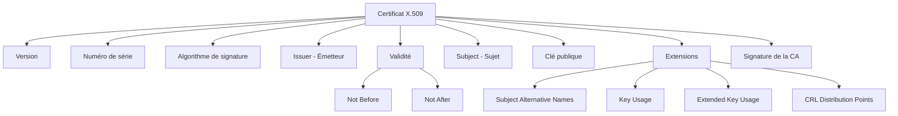
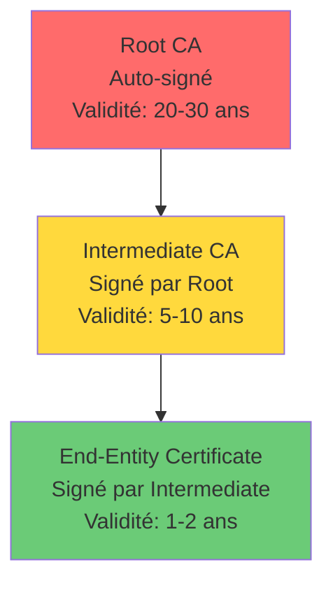

---
tags:
  - formation
  - certificats
  - x509
  - openssl
  - pki
---

# Module 2 : Certificats X.509 en Pratique

## Objectifs du Module

À la fin de ce module, vous serez capable de :

- Lire et interpréter un certificat X.509
- Générer des clés privées et des CSR
- Convertir entre les différents formats (PEM, DER, PFX)
- Vérifier la chaîne de confiance d'un certificat
- Déployer un certificat sur un serveur web

---

## 1. Anatomie d'un Certificat X.509

Un certificat X.509 est un document numérique signé qui lie une identité à une clé publique.

### Structure Générale



### Champs Principaux

| Champ | Description | Exemple |
|-------|-------------|---------|
| **Subject** | Identité du propriétaire | `CN=www.example.com, O=Example Inc, C=FR` |
| **Issuer** | CA qui a signé le certificat | `CN=DigiCert CA, O=DigiCert Inc` |
| **Serial Number** | Identifiant unique | `0x0A:1B:2C:3D...` |
| **Not Before** | Début de validité | `Nov 29 00:00:00 2024 GMT` |
| **Not After** | Fin de validité | `Nov 29 23:59:59 2025 GMT` |
| **Public Key** | Clé publique associée | RSA 2048/4096 ou ECDSA |

### Extensions Importantes

| Extension | Rôle | Exemple |
|-----------|------|---------|
| **Subject Alternative Names (SAN)** | Noms alternatifs | `DNS:www.example.com, DNS:example.com` |
| **Key Usage** | Usage autorisé de la clé | `Digital Signature, Key Encipherment` |
| **Extended Key Usage** | Usage étendu | `TLS Web Server Authentication` |
| **CRL Distribution Points** | URL pour vérifier la révocation | `http://crl.ca.com/root.crl` |
| **Authority Information Access** | Accès à l'OCSP | `OCSP - http://ocsp.ca.com` |

---

## 2. La Chaîne de Confiance

### Hiérarchie PKI



### Pourquoi des Intermédiaires ?

- **Sécurité** : La Root CA reste offline (air-gapped)
- **Compartimentation** : Si un intermédiaire est compromis, on ne révoque que lui
- **Flexibilité** : Différents intermédiaires pour différents usages

### Vérification de la Chaîne

```bash
# Vérifier un certificat avec sa chaîne
openssl verify -CAfile ca-bundle.crt certificat.pem

# Afficher la chaîne complète
openssl s_client -connect www.example.com:443 -showcerts
```

---

## 3. Formats de Fichiers

### Les Formats Courants

| Format | Extension | Encodage | Contenu | Usage |
|--------|-----------|----------|---------|-------|
| **PEM** | `.pem`, `.crt`, `.cer` | Base64 | Certificat, clé | Linux, Apache, Nginx |
| **DER** | `.der`, `.cer` | Binaire | Certificat | Windows, Java |
| **PFX/PKCS12** | `.pfx`, `.p12` | Binaire | Clé + Certificat + Chaîne | Windows, IIS, import/export |
| **JKS** | `.jks` | Binaire | Keystore Java | Applications Java |

### Identifier un Format

=== "PEM (Base64)"

    ```
    -----BEGIN CERTIFICATE-----
    MIIFazCCA1OgAwIBAgIRAIIQz7DSQONZRGPgu2OCiwAwDQYJKoZIhvcNAQEL
    BQAwTzELMAkGA1UEBhMCVVMxKTAnBgNVBAoTIEludGVybmV0IFNlY3VyaXR5
    ...
    -----END CERTIFICATE-----
    ```

=== "DER (Binaire)"

    ```
    Fichier binaire - non lisible en texte
    Commence généralement par les octets 0x30 0x82
    ```

### Conversions

```bash
# PEM vers DER
openssl x509 -in cert.pem -outform DER -out cert.der

# DER vers PEM
openssl x509 -in cert.der -inform DER -out cert.pem

# PEM vers PFX (avec clé privée et chaîne)
openssl pkcs12 -export -out cert.pfx \
    -inkey private.key \
    -in cert.pem \
    -certfile ca-chain.pem

# PFX vers PEM
openssl pkcs12 -in cert.pfx -out cert.pem -nodes

# Extraire uniquement la clé privée d'un PFX
openssl pkcs12 -in cert.pfx -nocerts -out private.key

# Extraire uniquement le certificat d'un PFX
openssl pkcs12 -in cert.pfx -clcerts -nokeys -out cert.pem
```

---

## 4. Générer une Clé Privée

### RSA (Traditionnel)

```bash
# Clé RSA 4096 bits sans protection
openssl genrsa -out private.key 4096

# Clé RSA 4096 bits avec passphrase (recommandé)
openssl genrsa -aes256 -out private.key 4096

# Vérifier la clé
openssl rsa -in private.key -check
```

### ECDSA (Moderne, Recommandé)

```bash
# Clé ECDSA P-384 (recommandé ANSSI)
openssl ecparam -genkey -name secp384r1 | openssl ec -out private-ec.key

# Avec protection
openssl ecparam -genkey -name secp384r1 | openssl ec -aes256 -out private-ec.key

# Lister les courbes disponibles
openssl ecparam -list_curves
```

### Comparaison RSA vs ECDSA

| Critère | RSA 4096 | ECDSA P-384 |
|---------|----------|-------------|
| Sécurité équivalente | 140 bits | 192 bits |
| Taille de clé | 4096 bits | 384 bits |
| Performance signature | Lent | Rapide |
| Performance vérification | Rapide | Moyen |
| Compatibilité | Universelle | Moderne |

---

## 5. Générer un CSR (Certificate Signing Request)

Le CSR est la demande envoyée à la CA pour obtenir un certificat signé.

### CSR Simple

```bash
# Générer CSR (interactif)
openssl req -new -key private.key -out request.csr

# Générer CSR (non-interactif)
openssl req -new -key private.key -out request.csr \
    -subj "/C=FR/ST=Ile-de-France/L=Paris/O=MonEntreprise/OU=IT/CN=www.example.com"
```

### CSR avec Subject Alternative Names (SAN)

Pour les certificats multi-domaines ou wildcard :

```bash
# Créer un fichier de configuration
cat > san.cnf << 'EOF'
[req]
default_bits = 4096
distinguished_name = req_distinguished_name
req_extensions = req_ext
prompt = no

[req_distinguished_name]
C = FR
ST = Ile-de-France
L = Paris
O = MonEntreprise
OU = IT
CN = www.example.com

[req_ext]
subjectAltName = @alt_names

[alt_names]
DNS.1 = www.example.com
DNS.2 = example.com
DNS.3 = api.example.com
DNS.4 = *.dev.example.com
EOF

# Générer le CSR avec SAN
openssl req -new -key private.key -out request.csr -config san.cnf
```

### Vérifier un CSR

```bash
# Afficher le contenu du CSR
openssl req -in request.csr -text -noout

# Vérifier la signature du CSR
openssl req -in request.csr -verify
```

---

## 6. Créer un Certificat Auto-signé

Pour les environnements de développement ou les tests.

### Certificat Simple (1 an)

```bash
# Générer clé + certificat en une commande
openssl req -x509 -nodes -days 365 -newkey rsa:4096 \
    -keyout private.key \
    -out certificate.crt \
    -subj "/C=FR/ST=IDF/L=Paris/O=Dev/CN=localhost"
```

### Certificat avec SAN

```bash
# Configuration avec SAN
cat > selfsigned.cnf << 'EOF'
[req]
default_bits = 4096
distinguished_name = req_distinguished_name
x509_extensions = v3_req
prompt = no

[req_distinguished_name]
C = FR
ST = Ile-de-France
L = Paris
O = MonEntreprise Dev
CN = localhost

[v3_req]
basicConstraints = CA:FALSE
keyUsage = digitalSignature, keyEncipherment
extendedKeyUsage = serverAuth
subjectAltName = @alt_names

[alt_names]
DNS.1 = localhost
DNS.2 = *.localhost
IP.1 = 127.0.0.1
IP.2 = ::1
EOF

# Générer le certificat
openssl req -x509 -nodes -days 365 -newkey rsa:4096 \
    -keyout private.key \
    -out certificate.crt \
    -config selfsigned.cnf
```

---

## 7. Inspecter et Débugger les Certificats

### Afficher un Certificat

```bash
# Afficher tous les détails
openssl x509 -in cert.pem -text -noout

# Afficher seulement le Subject
openssl x509 -in cert.pem -subject -noout

# Afficher seulement l'Issuer
openssl x509 -in cert.pem -issuer -noout

# Afficher les dates de validité
openssl x509 -in cert.pem -dates -noout

# Afficher les SANs
openssl x509 -in cert.pem -text -noout | grep -A1 "Subject Alternative Name"
```

### Vérifier un Certificat Distant

```bash
# Récupérer le certificat d'un serveur
openssl s_client -connect www.example.com:443 -servername www.example.com < /dev/null 2>/dev/null | openssl x509 -text

# Vérifier l'expiration
echo | openssl s_client -connect www.example.com:443 -servername www.example.com 2>/dev/null | openssl x509 -noout -dates

# Afficher la chaîne complète
openssl s_client -connect www.example.com:443 -servername www.example.com -showcerts < /dev/null
```

### Vérifier la Correspondance Clé/Certificat

```bash
# Les deux commandes doivent donner le même résultat
openssl x509 -noout -modulus -in cert.pem | openssl md5
openssl rsa -noout -modulus -in private.key | openssl md5
```

### Script de Vérification

```bash
#!/bin/bash
# check-cert.sh - Vérifier un certificat

CERT="$1"

if [ -z "$CERT" ]; then
    echo "Usage: $0 <certificat.pem>"
    exit 1
fi

echo "=== Informations Générales ==="
openssl x509 -in "$CERT" -subject -issuer -dates -noout

echo ""
echo "=== Subject Alternative Names ==="
openssl x509 -in "$CERT" -text -noout | grep -A1 "Subject Alternative Name" | tail -1

echo ""
echo "=== Jours Restants ==="
EXPIRY=$(openssl x509 -in "$CERT" -enddate -noout | cut -d= -f2)
EXPIRY_EPOCH=$(date -d "$EXPIRY" +%s)
NOW_EPOCH=$(date +%s)
DAYS_LEFT=$(( (EXPIRY_EPOCH - NOW_EPOCH) / 86400 ))
echo "$DAYS_LEFT jours"

if [ $DAYS_LEFT -lt 30 ]; then
    echo "⚠️  ATTENTION : Renouvellement requis bientôt !"
fi
```

---

## 8. Exercice Pratique : Déployer sur Nginx

### Objectif

Créer un certificat auto-signé et le déployer sur Nginx.

### Étapes

#### 1. Générer le Certificat

```bash
# Créer le répertoire
sudo mkdir -p /etc/nginx/ssl

# Générer clé + certificat
sudo openssl req -x509 -nodes -days 365 -newkey rsa:4096 \
    -keyout /etc/nginx/ssl/nginx.key \
    -out /etc/nginx/ssl/nginx.crt \
    -subj "/C=FR/ST=IDF/L=Paris/O=Test/CN=localhost"

# Permissions sécurisées
sudo chmod 600 /etc/nginx/ssl/nginx.key
sudo chmod 644 /etc/nginx/ssl/nginx.crt
```

#### 2. Configurer Nginx

```nginx
# /etc/nginx/sites-available/https-test
server {
    listen 443 ssl http2;
    server_name localhost;

    ssl_certificate /etc/nginx/ssl/nginx.crt;
    ssl_certificate_key /etc/nginx/ssl/nginx.key;

    # Paramètres TLS recommandés
    ssl_protocols TLSv1.2 TLSv1.3;
    ssl_ciphers ECDHE-ECDSA-AES128-GCM-SHA256:ECDHE-RSA-AES128-GCM-SHA256;
    ssl_prefer_server_ciphers off;

    # Headers de sécurité
    add_header Strict-Transport-Security "max-age=63072000" always;

    root /var/www/html;
    index index.html;

    location / {
        try_files $uri $uri/ =404;
    }
}
```

#### 3. Activer et Tester

```bash
# Activer le site
sudo ln -s /etc/nginx/sites-available/https-test /etc/nginx/sites-enabled/

# Tester la configuration
sudo nginx -t

# Recharger Nginx
sudo systemctl reload nginx

# Tester avec curl (ignorer l'erreur de certificat auto-signé)
curl -k https://localhost

# Vérifier le certificat
openssl s_client -connect localhost:443 < /dev/null 2>/dev/null | openssl x509 -text -noout
```

---

## Exercice : À Vous de Jouer

!!! example "Mise en Pratique"
    **Objectif** : Maîtriser la génération, la conversion et l'analyse de certificats X.509

    **Contexte** : Vous êtes administrateur système et devez créer un certificat auto-signé pour un environnement de développement web. Le certificat doit supporter plusieurs noms de domaine (SANs) et être déployable sur différentes plateformes.

    **Tâches à réaliser** :

    1. Générez une clé privée RSA 4096 bits protégée par passphrase
    2. Créez un certificat auto-signé valide 1 an avec Subject Alternative Names (DNS: dev.local, www.dev.local, api.dev.local, IP: 192.168.1.100)
    3. Vérifiez les informations du certificat (subject, issuer, dates, SANs)
    4. Convertissez le certificat du format PEM vers DER
    5. Créez un fichier PFX (PKCS#12) contenant la clé privée et le certificat pour import Windows
    6. Vérifiez que la clé privée correspond bien au certificat

    **Critères de validation** :

    - [ ] La clé privée fait 4096 bits et est protégée par passphrase
    - [ ] Le certificat est auto-signé (Issuer = Subject)
    - [ ] Les 3 noms DNS et l'IP sont présents dans les SANs
    - [ ] La validité est exactement de 365 jours
    - [ ] Les fichiers DER et PFX sont créés et valides
    - [ ] Le modulus de la clé et du certificat correspondent

??? quote "Solution"
    **Étape 1 : Génération de la clé privée protégée**

    ```bash
    # Créer un répertoire de travail
    mkdir -p ~/pki-lab && cd ~/pki-lab

    # Générer la clé RSA 4096 bits avec passphrase
    openssl genrsa -aes256 -out dev-server.key 4096
    # Entrez un mot de passe fort quand demandé

    # Vérifier la clé
    openssl rsa -in dev-server.key -check
    # Vous devrez entrer la passphrase
    ```

    **Étape 2 : Créer le certificat auto-signé avec SANs**

    ```bash
    # Créer le fichier de configuration
    cat > dev-cert.cnf << 'EOF'
    [req]
    default_bits = 4096
    distinguished_name = req_distinguished_name
    x509_extensions = v3_req
    prompt = no

    [req_distinguished_name]
    C = FR
    ST = Ile-de-France
    L = Paris
    O = MonEntreprise Dev
    OU = IT
    CN = dev.local

    [v3_req]
    basicConstraints = CA:FALSE
    keyUsage = digitalSignature, keyEncipherment
    extendedKeyUsage = serverAuth
    subjectAltName = @alt_names

    [alt_names]
    DNS.1 = dev.local
    DNS.2 = www.dev.local
    DNS.3 = api.dev.local
    IP.1 = 192.168.1.100
    EOF

    # Générer le certificat auto-signé (365 jours)
    openssl req -x509 -new -nodes -days 365 \
        -key dev-server.key \
        -out dev-server.crt \
        -config dev-cert.cnf
    ```

    **Étape 3 : Vérifier les informations du certificat**

    ```bash
    # Afficher toutes les informations
    openssl x509 -in dev-server.crt -text -noout

    # Vérifier spécifiquement le Subject et l'Issuer
    openssl x509 -in dev-server.crt -subject -issuer -noout
    # Doivent être identiques (certificat auto-signé)

    # Vérifier les dates
    openssl x509 -in dev-server.crt -dates -noout
    # Vérifier que la durée est bien 365 jours

    # Vérifier les SANs
    openssl x509 -in dev-server.crt -text -noout | grep -A1 "Subject Alternative Name"
    # Doit afficher : DNS:dev.local, DNS:www.dev.local, DNS:api.dev.local, IP Address:192.168.1.100
    ```

    **Étape 4 : Conversion PEM vers DER**

    ```bash
    # Convertir le certificat en format DER (binaire)
    openssl x509 -in dev-server.crt -outform DER -out dev-server.der

    # Vérifier le format DER
    file dev-server.der
    # Doit afficher : dev-server.der: Certificate, Version=3

    # Afficher le certificat DER (le reconvertir en texte)
    openssl x509 -in dev-server.der -inform DER -text -noout | head -20
    ```

    **Étape 5 : Créer le fichier PFX (PKCS#12)**

    ```bash
    # Créer le PFX avec clé privée et certificat
    openssl pkcs12 -export \
        -out dev-server.pfx \
        -inkey dev-server.key \
        -in dev-server.crt \
        -name "Dev Server Certificate"
    # Entrez la passphrase de la clé, puis un mot de passe pour le PFX

    # Vérifier le contenu du PFX
    openssl pkcs12 -in dev-server.pfx -info -noout
    # Affiche les informations sur le PFX
    ```

    **Étape 6 : Vérifier la correspondance clé/certificat**

    ```bash
    # Calculer le modulus de la clé privée
    openssl rsa -in dev-server.key -modulus -noout | openssl md5
    # Entrez la passphrase

    # Calculer le modulus du certificat
    openssl x509 -in dev-server.crt -modulus -noout | openssl md5

    # Les deux hash MD5 doivent être IDENTIQUES
    # Si différents, la clé ne correspond pas au certificat
    ```

    **Étape 7 : (Bonus) Tester sur un serveur web local**

    ```bash
    # Créer une configuration Nginx simple
    sudo mkdir -p /etc/nginx/ssl
    sudo cp dev-server.key dev-server.crt /etc/nginx/ssl/

    # Créer un fichier de test
    echo "<h1>Test SSL/TLS</h1>" | sudo tee /var/www/html/index.html

    # Ajouter dans /etc/hosts
    echo "127.0.0.1 dev.local www.dev.local api.dev.local" | sudo tee -a /etc/hosts

    # Tester avec curl (ignore l'erreur certificat auto-signé)
    curl -k https://dev.local
    curl -k https://www.dev.local
    curl -k https://api.dev.local

    # Vérifier le certificat
    openssl s_client -connect dev.local:443 -servername dev.local < /dev/null 2>/dev/null | openssl x509 -text -noout
    ```

    **Points clés à retenir** :

    - Les **Subject Alternative Names (SANs)** sont obligatoires pour les certificats multi-domaines modernes
    - Le format **PEM** (Base64) est lisible, le format **DER** (binaire) est compact
    - Le format **PFX/PKCS#12** regroupe clé + certificat pour faciliter l'import/export
    - Toujours vérifier que la clé correspond au certificat avec le test du modulus
    - Les certificats auto-signés sont parfaits pour dev/test mais jamais pour la production

---

## 9. Quiz de Validation

??? question "Question 1 : Quelle extension contient les noms de domaine alternatifs ?"
    **Réponse :** Subject Alternative Names (SAN)

??? question "Question 2 : Quel format est utilisé par Windows pour importer clé + certificat ?"
    **Réponse :** PFX (PKCS#12)

??? question "Question 3 : Pourquoi utiliser des CA intermédiaires ?"
    **Réponse :** Pour garder la Root CA offline et limiter l'impact en cas de compromission.

??? question "Question 4 : Comment vérifier que la clé correspond au certificat ?"
    **Réponse :** Comparer le modulus : `openssl x509 -modulus` et `openssl rsa -modulus` doivent donner le même résultat.

??? question "Question 5 : Quelle commande génère un CSR ?"
    **Réponse :** `openssl req -new -key private.key -out request.csr`

---

## Résumé

| Concept | Commande clé |
|---------|--------------|
| Générer clé RSA | `openssl genrsa -out key.pem 4096` |
| Générer clé ECDSA | `openssl ecparam -genkey -name secp384r1` |
| Créer CSR | `openssl req -new -key key.pem -out req.csr` |
| Certificat auto-signé | `openssl req -x509 -nodes -days 365 ...` |
| Afficher certificat | `openssl x509 -in cert.pem -text -noout` |
| Convertir PEM→PFX | `openssl pkcs12 -export ...` |
| Vérifier chaîne | `openssl verify -CAfile ca.crt cert.pem` |

---

**Prêt pour la suite ?** [:octicons-arrow-right-24: Module 3 : PKI Entreprise](03-module.md){ .md-button .md-button--primary }

---

**Retour au :** [Programme de la Formation](index.md) | [Catalogue des Formations](../index.md)
