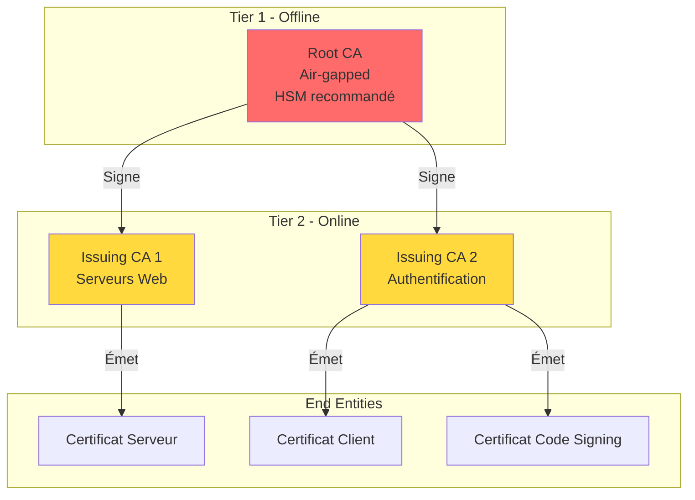
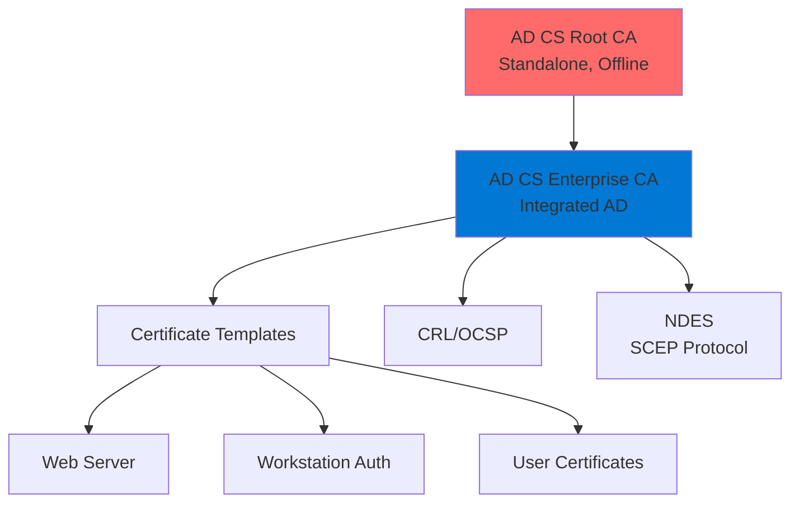
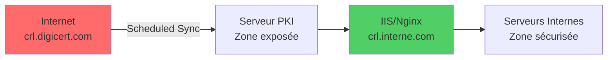

---
tags:
  - formation
  - pki
  - ca
  - openssl
  - adcs
  - enterprise
---

# Module 3 : PKI d'Entreprise

## Objectifs du Module

À la fin de ce module, vous serez capable de :

- Concevoir une architecture PKI multi-tiers
- Déployer une CA Root et une Sub-CA avec OpenSSL
- Comprendre Microsoft AD CS (Active Directory Certificate Services)
- Configurer la révocation (CRL et OCSP)
- Mettre en place un miroir CRL pour environnements isolés

---

## 1. Architecture PKI

### Modèle 2-Tiers (Recommandé)



### Rôles des Composants

| Composant | Rôle | Localisation |
|-----------|------|--------------|
| **Root CA** | Ancre de confiance, signe les Sub-CA | Offline (coffre-fort) |
| **Issuing CA (Sub-CA)** | Émet les certificats end-entity | Online, sécurisé |
| **Registration Authority (RA)** | Valide les demandes | Optionnel |
| **CRL/OCSP Responder** | Publie les révocations | DMZ ou interne |

### Bonnes Pratiques

!!! warning "Règles de Sécurité PKI"
    - **Root CA offline** : Ne jamais connecter à un réseau
    - **Clé Root sur HSM** : Protection matérielle recommandée
    - **Backup sécurisé** : Clés dans un coffre-fort physique
    - **Cérémonie de signature** : Procédure documentée avec témoins
    - **Audit logs** : Traçabilité de toutes les opérations

---

## 2. Déployer une CA avec OpenSSL

### 2.1 Structure des Répertoires

```bash
# Créer la structure de la CA
mkdir -p /opt/ca/{root,intermediate}
mkdir -p /opt/ca/root/{certs,crl,newcerts,private,csr}
mkdir -p /opt/ca/intermediate/{certs,crl,newcerts,private,csr}

# Permissions sécurisées
chmod 700 /opt/ca/root/private /opt/ca/intermediate/private

# Fichiers de suivi
touch /opt/ca/root/index.txt
touch /opt/ca/intermediate/index.txt
echo 1000 > /opt/ca/root/serial
echo 1000 > /opt/ca/intermediate/serial
echo 1000 > /opt/ca/root/crlnumber
echo 1000 > /opt/ca/intermediate/crlnumber
```

### 2.2 Configuration Root CA

```bash
cat > /opt/ca/root/openssl.cnf << 'EOF'
# Configuration OpenSSL pour Root CA

[ ca ]
default_ca = CA_default

[ CA_default ]
dir               = /opt/ca/root
certs             = $dir/certs
crl_dir           = $dir/crl
new_certs_dir     = $dir/newcerts
database          = $dir/index.txt
serial            = $dir/serial
RANDFILE          = $dir/private/.rand

private_key       = $dir/private/ca.key
certificate       = $dir/certs/ca.crt

crlnumber         = $dir/crlnumber
crl               = $dir/crl/ca.crl
crl_extensions    = crl_ext
default_crl_days  = 30

default_md        = sha384
name_opt          = ca_default
cert_opt          = ca_default
default_days      = 7300
preserve          = no
policy            = policy_strict

[ policy_strict ]
countryName             = match
stateOrProvinceName     = match
organizationName        = match
organizationalUnitName  = optional
commonName              = supplied
emailAddress            = optional

[ req ]
default_bits        = 4096
distinguished_name  = req_distinguished_name
string_mask         = utf8only
default_md          = sha384
x509_extensions     = v3_ca

[ req_distinguished_name ]
countryName                     = Country Name (2 letter code)
stateOrProvinceName             = State or Province Name
localityName                    = Locality Name
0.organizationName              = Organization Name
organizationalUnitName          = Organizational Unit Name
commonName                      = Common Name
emailAddress                    = Email Address

countryName_default             = FR
stateOrProvinceName_default     = Ile-de-France
localityName_default            = Paris
0.organizationName_default      = MonEntreprise
organizationalUnitName_default  = PKI
emailAddress_default            = pki@monentreprise.com

[ v3_ca ]
subjectKeyIdentifier = hash
authorityKeyIdentifier = keyid:always,issuer
basicConstraints = critical, CA:true
keyUsage = critical, digitalSignature, cRLSign, keyCertSign

[ v3_intermediate_ca ]
subjectKeyIdentifier = hash
authorityKeyIdentifier = keyid:always,issuer
basicConstraints = critical, CA:true, pathlen:0
keyUsage = critical, digitalSignature, cRLSign, keyCertSign

[ crl_ext ]
authorityKeyIdentifier = keyid:always

[ ocsp ]
basicConstraints = CA:FALSE
subjectKeyIdentifier = hash
authorityKeyIdentifier = keyid,issuer
keyUsage = critical, digitalSignature
extendedKeyUsage = critical, OCSPSigning
EOF
```

### 2.3 Créer la Root CA

```bash
cd /opt/ca/root

# Générer la clé privée Root (PROTÉGER CETTE CLÉ !)
openssl genrsa -aes256 -out private/ca.key 4096
chmod 400 private/ca.key

# Créer le certificat Root CA (validité 20 ans)
openssl req -config openssl.cnf \
    -key private/ca.key \
    -new -x509 -days 7300 -sha384 \
    -extensions v3_ca \
    -out certs/ca.crt \
    -subj "/C=FR/ST=Ile-de-France/L=Paris/O=MonEntreprise/OU=PKI/CN=MonEntreprise Root CA"

# Vérifier le certificat
openssl x509 -in certs/ca.crt -text -noout
```

### 2.4 Configuration Intermediate CA

```bash
cat > /opt/ca/intermediate/openssl.cnf << 'EOF'
# Configuration OpenSSL pour Intermediate CA

[ ca ]
default_ca = CA_default

[ CA_default ]
dir               = /opt/ca/intermediate
certs             = $dir/certs
crl_dir           = $dir/crl
new_certs_dir     = $dir/newcerts
database          = $dir/index.txt
serial            = $dir/serial
RANDFILE          = $dir/private/.rand

private_key       = $dir/private/intermediate.key
certificate       = $dir/certs/intermediate.crt

crlnumber         = $dir/crlnumber
crl               = $dir/crl/intermediate.crl
crl_extensions    = crl_ext
default_crl_days  = 7

default_md        = sha384
name_opt          = ca_default
cert_opt          = ca_default
default_days      = 365
preserve          = no
policy            = policy_loose

[ policy_loose ]
countryName             = optional
stateOrProvinceName     = optional
localityName            = optional
organizationName        = optional
organizationalUnitName  = optional
commonName              = supplied
emailAddress            = optional

[ req ]
default_bits        = 4096
distinguished_name  = req_distinguished_name
string_mask         = utf8only
default_md          = sha384

[ req_distinguished_name ]
countryName                     = Country Name (2 letter code)
stateOrProvinceName             = State or Province Name
localityName                    = Locality Name
0.organizationName              = Organization Name
organizationalUnitName          = Organizational Unit Name
commonName                      = Common Name
emailAddress                    = Email Address

[ server_cert ]
basicConstraints = CA:FALSE
nsCertType = server
nsComment = "OpenSSL Generated Server Certificate"
subjectKeyIdentifier = hash
authorityKeyIdentifier = keyid,issuer:always
keyUsage = critical, digitalSignature, keyEncipherment
extendedKeyUsage = serverAuth
crlDistributionPoints = URI:http://crl.monentreprise.com/intermediate.crl
authorityInfoAccess = OCSP;URI:http://ocsp.monentreprise.com

[ client_cert ]
basicConstraints = CA:FALSE
nsCertType = client, email
nsComment = "OpenSSL Generated Client Certificate"
subjectKeyIdentifier = hash
authorityKeyIdentifier = keyid,issuer
keyUsage = critical, nonRepudiation, digitalSignature, keyEncipherment
extendedKeyUsage = clientAuth, emailProtection

[ crl_ext ]
authorityKeyIdentifier = keyid:always
EOF
```

### 2.5 Créer l'Intermediate CA

```bash
cd /opt/ca/intermediate

# Générer la clé privée Intermediate
openssl genrsa -aes256 -out private/intermediate.key 4096
chmod 400 private/intermediate.key

# Créer le CSR pour l'Intermediate
openssl req -config openssl.cnf -new -sha384 \
    -key private/intermediate.key \
    -out csr/intermediate.csr \
    -subj "/C=FR/ST=Ile-de-France/L=Paris/O=MonEntreprise/OU=PKI/CN=MonEntreprise Issuing CA"

# Signer avec la Root CA (validité 10 ans)
cd /opt/ca/root
openssl ca -config openssl.cnf \
    -extensions v3_intermediate_ca \
    -days 3650 -notext -md sha384 \
    -in ../intermediate/csr/intermediate.csr \
    -out ../intermediate/certs/intermediate.crt

# Créer la chaîne de certificats
cat /opt/ca/intermediate/certs/intermediate.crt \
    /opt/ca/root/certs/ca.crt > /opt/ca/intermediate/certs/ca-chain.crt
```

### 2.6 Émettre un Certificat Serveur

```bash
cd /opt/ca/intermediate

# Générer la clé du serveur
openssl genrsa -out private/www.example.com.key 4096

# Créer le CSR avec SAN
cat > csr/www.example.com.cnf << 'EOF'
[req]
distinguished_name = req_distinguished_name
req_extensions = req_ext
prompt = no

[req_distinguished_name]
CN = www.example.com

[req_ext]
subjectAltName = @alt_names

[alt_names]
DNS.1 = www.example.com
DNS.2 = example.com
EOF

openssl req -new -key private/www.example.com.key \
    -out csr/www.example.com.csr \
    -config csr/www.example.com.cnf

# Signer le certificat
openssl ca -config openssl.cnf \
    -extensions server_cert \
    -days 365 -notext -md sha384 \
    -in csr/www.example.com.csr \
    -out certs/www.example.com.crt
```

---

## 3. Microsoft AD CS (Aperçu)

### Architecture AD CS



### Installation PowerShell

```powershell
# Installer le rôle AD CS
Install-WindowsFeature -Name AD-Certificate -IncludeManagementTools

# Configurer une Enterprise CA
Install-AdcsCertificationAuthority `
    -CAType EnterpriseSubordinateCA `
    -CACommonName "MonEntreprise Issuing CA" `
    -KeyLength 4096 `
    -HashAlgorithmName SHA256 `
    -CryptoProviderName "RSA#Microsoft Software Key Storage Provider" `
    -ValidityPeriod Years `
    -ValidityPeriodUnits 5

# Configurer les CDP et AIA
$CRLPath = "http://crl.monentreprise.com/crld/<CaName><CRLNameSuffix><DeltaCRLAllowed>.crl"
$AIAPath = "http://crl.monentreprise.com/aia/<ServerDNSName>_<CaName><CertificateName>.crt"

certutil -setreg CA\CRLPublicationURLs "1:$CRLPath"
certutil -setreg CA\CACertPublicationURLs "1:$AIAPath"

Restart-Service CertSvc
```

### Templates de Certificats

| Template | Usage | Validité |
|----------|-------|----------|
| Web Server | HTTPS, TLS | 1-2 ans |
| Workstation Authentication | mTLS machines | 1 an |
| User | Email, Smart Card | 1 an |
| Code Signing | Signature de code | 1-3 ans |
| OCSP Response Signing | Réponses OCSP | 2 semaines |

---

## 4. Révocation : CRL et OCSP

### CRL (Certificate Revocation List)

Liste signée des certificats révoqués, téléchargée périodiquement.

```bash
# Générer une CRL
openssl ca -config /opt/ca/intermediate/openssl.cnf \
    -gencrl -out /opt/ca/intermediate/crl/intermediate.crl

# Vérifier la CRL
openssl crl -in /opt/ca/intermediate/crl/intermediate.crl -text -noout

# Révoquer un certificat
openssl ca -config /opt/ca/intermediate/openssl.cnf \
    -revoke /opt/ca/intermediate/certs/compromis.crt \
    -crl_reason keyCompromise

# Régénérer la CRL après révocation
openssl ca -config /opt/ca/intermediate/openssl.cnf \
    -gencrl -out /opt/ca/intermediate/crl/intermediate.crl
```

### OCSP (Online Certificate Status Protocol)

Vérification en temps réel du statut d'un certificat.

```bash
# Démarrer un responder OCSP de test
openssl ocsp -port 8080 -text \
    -index /opt/ca/intermediate/index.txt \
    -CA /opt/ca/intermediate/certs/ca-chain.crt \
    -rkey /opt/ca/intermediate/private/ocsp.key \
    -rsigner /opt/ca/intermediate/certs/ocsp.crt

# Vérifier un certificat via OCSP
openssl ocsp -issuer intermediate.crt \
    -cert server.crt \
    -url http://ocsp.monentreprise.com:8080 \
    -resp_text
```

### Comparaison CRL vs OCSP

| Critère | CRL | OCSP |
|---------|-----|------|
| Latence | Haute (cache) | Temps réel |
| Bande passante | Téléchargement complet | Requête par certificat |
| Confidentialité | Anonyme | CA voit les requêtes |
| Complexité | Simple | Serveur à maintenir |
| Offline | Fonctionne avec cache | Échec si serveur down |

---

## 5. Miroir CRL pour Environnements Isolés

Dans les environnements SecNumCloud, les serveurs ne peuvent pas accéder à Internet pour vérifier les CRL des CA publiques.

### Architecture



### Script de Synchronisation

```powershell
# Sync-ExternalCRL.ps1
$CRLSources = @(
    @{ Name = "DigiCert"; URL = "http://crl3.digicert.com/DigiCertGlobalRootG2.crl" },
    @{ Name = "Sectigo"; URL = "http://crl.sectigo.com/SectigoRSADomainValidationCA.crl" }
)

$Destination = "C:\inetpub\wwwroot\crl"

foreach ($CRL in $CRLSources) {
    try {
        $OutFile = Join-Path $Destination "$($CRL.Name).crl"
        Invoke-WebRequest -Uri $CRL.URL -OutFile $OutFile -TimeoutSec 30
        Write-Host "OK: $($CRL.Name)" -ForegroundColor Green
    } catch {
        Write-Host "ERREUR: $($CRL.Name) - $($_.Exception.Message)" -ForegroundColor Red
    }
}
```

---

## 6. Exercice Pratique

### Objectif

Déployer une PKI 2-tiers complète avec OpenSSL.

### Tâches

1. Créer une Root CA (validité 20 ans)
2. Créer une Issuing CA (validité 10 ans)
3. Émettre un certificat serveur pour `web.lab.local`
4. Générer une CRL
5. Révoquer un certificat et mettre à jour la CRL

??? quote "Solution"
    Suivre les étapes de la section 2 de ce module.

    **Vérifications :**

    ```bash
    # Vérifier la chaîne
    openssl verify -CAfile /opt/ca/intermediate/certs/ca-chain.crt \
        /opt/ca/intermediate/certs/web.lab.local.crt

    # Vérifier la CRL
    openssl crl -in /opt/ca/intermediate/crl/intermediate.crl -text -noout
    ```

---

## Résumé

| Composant | Outil | Validité |
|-----------|-------|----------|
| Root CA | OpenSSL / AD CS | 20-30 ans |
| Issuing CA | OpenSSL / AD CS | 5-10 ans |
| Certificat serveur | OpenSSL / AD CS | 1-2 ans |
| CRL | openssl ca -gencrl | 7-30 jours |
| OCSP | openssl ocsp | Temps réel |

---

**Prêt pour la suite ?** [:octicons-arrow-right-24: Module 4 : Automatisation](04-module.md){ .md-button .md-button--primary }

---

**Retour au :** [Programme de la Formation](index.md) | [Catalogue des Formations](../index.md)
