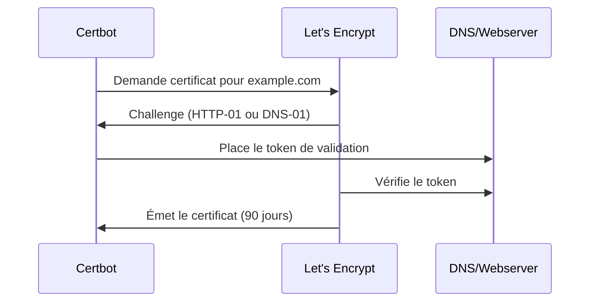
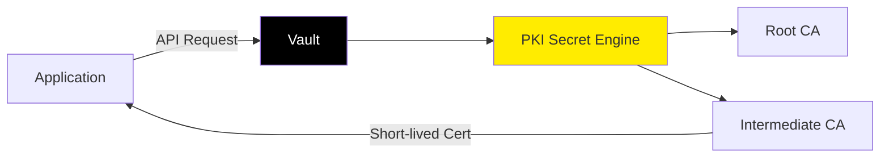
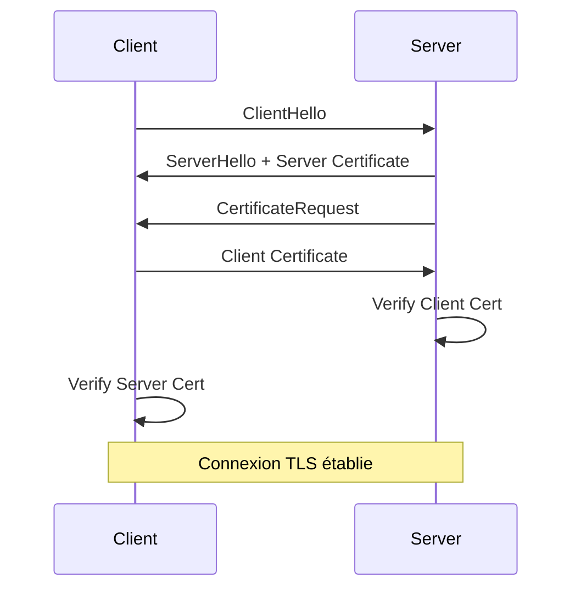

---
tags:
  - formation
  - automatisation
  - ansible
  - letsencrypt
  - acme
  - vault
---

# Module 4 : Automatisation & DevOps

## Objectifs du Module

À la fin de ce module, vous serez capable de :

- Automatiser les certificats avec Let's Encrypt et ACME
- Déployer des certificats avec Ansible
- Utiliser HashiCorp Vault comme PKI interne
- Monitorer l'expiration des certificats
- Implémenter mTLS pour l'authentification mutuelle

---

## 1. Let's Encrypt et ACME

### Qu'est-ce que Let's Encrypt ?

Let's Encrypt est une CA gratuite et automatisée qui a révolutionné HTTPS.



### Types de Challenges

| Challenge | Validation | Usage |
|-----------|------------|-------|
| **HTTP-01** | Fichier sur `/.well-known/acme-challenge/` | Serveurs web publics |
| **DNS-01** | Enregistrement TXT `_acme-challenge` | Wildcard, serveurs non-web |
| **TLS-ALPN-01** | Extension TLS | Rare, cas spécifiques |

### Installation Certbot

=== "RHEL/Rocky"

    ```bash
    sudo dnf install epel-release
    sudo dnf install certbot python3-certbot-nginx
    ```

=== "Debian/Ubuntu"

    ```bash
    sudo apt update
    sudo apt install certbot python3-certbot-nginx
    ```

### Obtenir un Certificat

```bash
# Mode interactif avec Nginx
sudo certbot --nginx -d example.com -d www.example.com

# Mode standalone (arrête le serveur web)
sudo certbot certonly --standalone -d example.com

# Mode webroot (serveur web en cours d'exécution)
sudo certbot certonly --webroot -w /var/www/html -d example.com

# Mode DNS (pour wildcard)
sudo certbot certonly --manual --preferred-challenges dns -d "*.example.com"
```

### Renouvellement Automatique

```bash
# Tester le renouvellement
sudo certbot renew --dry-run

# Le renouvellement automatique est géré par un timer systemd
sudo systemctl status certbot.timer

# Ou via cron (créé automatiquement)
cat /etc/cron.d/certbot
```

### Hooks de Renouvellement

```bash
# Script exécuté après renouvellement
cat > /etc/letsencrypt/renewal-hooks/post/reload-nginx.sh << 'EOF'
#!/bin/bash
systemctl reload nginx
EOF
chmod +x /etc/letsencrypt/renewal-hooks/post/reload-nginx.sh
```

---

## 2. Automatisation avec Ansible

### Playbook : Déployer des Certificats

```yaml
# deploy-certificates.yml
---
- name: Deploy TLS Certificates
  hosts: webservers
  become: yes
  vars:
    cert_source: "/opt/pki/certs"
    cert_dest: "/etc/nginx/ssl"

  tasks:
    - name: Create SSL directory
      ansible.builtin.file:
        path: "{{ cert_dest }}"
        state: directory
        mode: '0750'
        owner: root
        group: nginx

    - name: Copy private key
      ansible.builtin.copy:
        src: "{{ cert_source }}/{{ inventory_hostname }}.key"
        dest: "{{ cert_dest }}/server.key"
        mode: '0600'
        owner: root
        group: root
      notify: Reload Nginx

    - name: Copy certificate
      ansible.builtin.copy:
        src: "{{ cert_source }}/{{ inventory_hostname }}.crt"
        dest: "{{ cert_dest }}/server.crt"
        mode: '0644'
        owner: root
        group: root
      notify: Reload Nginx

    - name: Copy CA chain
      ansible.builtin.copy:
        src: "{{ cert_source }}/ca-chain.crt"
        dest: "{{ cert_dest }}/ca-chain.crt"
        mode: '0644'
      notify: Reload Nginx

  handlers:
    - name: Reload Nginx
      ansible.builtin.systemd:
        name: nginx
        state: reloaded
```

### Playbook : Certbot avec Ansible

```yaml
# certbot-deploy.yml
---
- name: Setup Let's Encrypt with Certbot
  hosts: webservers
  become: yes
  vars:
    domain: "{{ inventory_hostname }}"
    email: "admin@example.com"

  tasks:
    - name: Install Certbot
      ansible.builtin.package:
        name:
          - certbot
          - python3-certbot-nginx
        state: present

    - name: Check if certificate exists
      ansible.builtin.stat:
        path: "/etc/letsencrypt/live/{{ domain }}/fullchain.pem"
      register: cert_exists

    - name: Obtain certificate
      ansible.builtin.command: >
        certbot certonly --nginx
        -d {{ domain }}
        --email {{ email }}
        --agree-tos
        --non-interactive
      when: not cert_exists.stat.exists
      notify: Reload Nginx

    - name: Configure Nginx SSL
      ansible.builtin.template:
        src: nginx-ssl.conf.j2
        dest: "/etc/nginx/sites-available/{{ domain }}.conf"
      notify: Reload Nginx

    - name: Enable site
      ansible.builtin.file:
        src: "/etc/nginx/sites-available/{{ domain }}.conf"
        dest: "/etc/nginx/sites-enabled/{{ domain }}.conf"
        state: link
      notify: Reload Nginx

  handlers:
    - name: Reload Nginx
      ansible.builtin.systemd:
        name: nginx
        state: reloaded
```

### Template Nginx SSL

```jinja2
{# nginx-ssl.conf.j2 #}
server {
    listen 443 ssl http2;
    server_name {{ domain }};

    ssl_certificate /etc/letsencrypt/live/{{ domain }}/fullchain.pem;
    ssl_certificate_key /etc/letsencrypt/live/{{ domain }}/privkey.pem;

    ssl_protocols TLSv1.2 TLSv1.3;
    ssl_ciphers ECDHE-ECDSA-AES128-GCM-SHA256:ECDHE-RSA-AES128-GCM-SHA256;
    ssl_prefer_server_ciphers off;

    add_header Strict-Transport-Security "max-age=63072000" always;

    root /var/www/{{ domain }};
    index index.html;

    location / {
        try_files $uri $uri/ =404;
    }
}

server {
    listen 80;
    server_name {{ domain }};
    return 301 https://$server_name$request_uri;
}
```

---

## 3. HashiCorp Vault PKI

Vault peut agir comme CA interne, émettant des certificats à la demande.

### Architecture



### Configuration Vault PKI

```bash
# Activer le secret engine PKI
vault secrets enable pki

# Configurer la durée max
vault secrets tune -max-lease-ttl=87600h pki

# Générer le Root CA
vault write pki/root/generate/internal \
    common_name="Vault Root CA" \
    ttl=87600h

# Configurer les URLs
vault write pki/config/urls \
    issuing_certificates="https://vault.example.com:8200/v1/pki/ca" \
    crl_distribution_points="https://vault.example.com:8200/v1/pki/crl"

# Activer un PKI intermédiaire
vault secrets enable -path=pki_int pki
vault secrets tune -max-lease-ttl=43800h pki_int

# Générer CSR pour l'intermédiaire
vault write pki_int/intermediate/generate/internal \
    common_name="Vault Intermediate CA" \
    | jq -r '.data.csr' > pki_int.csr

# Signer avec le Root
vault write pki/root/sign-intermediate \
    csr=@pki_int.csr \
    format=pem_bundle \
    ttl=43800h \
    | jq -r '.data.certificate' > intermediate.crt

# Importer le certificat signé
vault write pki_int/intermediate/set-signed certificate=@intermediate.crt
```

### Créer un Rôle pour les Certificats

```bash
# Créer un rôle "webserver"
vault write pki_int/roles/webserver \
    allowed_domains="example.com" \
    allow_subdomains=true \
    max_ttl="720h" \
    key_type="rsa" \
    key_bits=4096
```

### Émettre un Certificat

```bash
# Via CLI
vault write pki_int/issue/webserver \
    common_name="www.example.com" \
    ttl="24h"

# Via API (depuis une application)
curl --header "X-Vault-Token: $VAULT_TOKEN" \
    --request POST \
    --data '{"common_name": "www.example.com", "ttl": "24h"}' \
    https://vault.example.com:8200/v1/pki_int/issue/webserver
```

### Avantages de Vault PKI

| Avantage | Description |
|----------|-------------|
| **Certificats éphémères** | Durée de vie courte (heures/jours) |
| **À la demande** | Pas de stock de certificats |
| **Rotation automatique** | Les apps renouvellent automatiquement |
| **Audit centralisé** | Logs de toutes les émissions |
| **Intégration native** | Kubernetes, Terraform, Ansible |

---

## 4. Monitoring de l'Expiration

### Script de Vérification

```bash
#!/bin/bash
# check-cert-expiry.sh

WARN_DAYS=30
CRIT_DAYS=7

check_cert() {
    local HOST=$1
    local PORT=${2:-443}

    EXPIRY=$(echo | openssl s_client -servername "$HOST" -connect "$HOST:$PORT" 2>/dev/null \
        | openssl x509 -noout -enddate 2>/dev/null \
        | cut -d= -f2)

    if [ -z "$EXPIRY" ]; then
        echo "UNKNOWN - Cannot connect to $HOST:$PORT"
        return 3
    fi

    EXPIRY_EPOCH=$(date -d "$EXPIRY" +%s)
    NOW_EPOCH=$(date +%s)
    DAYS_LEFT=$(( (EXPIRY_EPOCH - NOW_EPOCH) / 86400 ))

    if [ $DAYS_LEFT -lt $CRIT_DAYS ]; then
        echo "CRITICAL - $HOST expires in $DAYS_LEFT days ($EXPIRY)"
        return 2
    elif [ $DAYS_LEFT -lt $WARN_DAYS ]; then
        echo "WARNING - $HOST expires in $DAYS_LEFT days ($EXPIRY)"
        return 1
    else
        echo "OK - $HOST expires in $DAYS_LEFT days ($EXPIRY)"
        return 0
    fi
}

# Exemple d'utilisation
check_cert "www.example.com"
check_cert "api.example.com" 8443
```

### Prometheus + Blackbox Exporter

```yaml
# prometheus.yml
scrape_configs:
  - job_name: 'ssl-expiry'
    metrics_path: /probe
    params:
      module: [http_2xx]
    static_configs:
      - targets:
          - https://www.example.com
          - https://api.example.com
    relabel_configs:
      - source_labels: [__address__]
        target_label: __param_target
      - source_labels: [__param_target]
        target_label: instance
      - target_label: __address__
        replacement: blackbox-exporter:9115
```

```yaml
# Alerte Prometheus
groups:
  - name: ssl
    rules:
      - alert: SSLCertExpiringSoon
        expr: probe_ssl_earliest_cert_expiry - time() < 86400 * 30
        for: 1h
        labels:
          severity: warning
        annotations:
          summary: "SSL certificate expires soon"
          description: "Certificate for {{ $labels.instance }} expires in less than 30 days"

      - alert: SSLCertExpiryCritical
        expr: probe_ssl_earliest_cert_expiry - time() < 86400 * 7
        for: 1h
        labels:
          severity: critical
        annotations:
          summary: "SSL certificate expires very soon!"
          description: "Certificate for {{ $labels.instance }} expires in less than 7 days"
```

---

## 5. mTLS (Mutual TLS)

### Concept

Dans mTLS, **les deux parties** présentent un certificat :



### Configuration Nginx (Serveur)

```nginx
server {
    listen 443 ssl;
    server_name api.example.com;

    # Certificat serveur
    ssl_certificate /etc/nginx/ssl/server.crt;
    ssl_certificate_key /etc/nginx/ssl/server.key;

    # mTLS : Exiger un certificat client
    ssl_client_certificate /etc/nginx/ssl/ca-chain.crt;
    ssl_verify_client on;
    ssl_verify_depth 2;

    # Optionnel : Passer le CN du client à l'application
    location / {
        proxy_pass http://backend;
        proxy_set_header X-Client-CN $ssl_client_s_dn_cn;
        proxy_set_header X-Client-Verify $ssl_client_verify;
    }
}
```

### Générer un Certificat Client

```bash
# Clé privée client
openssl genrsa -out client.key 4096

# CSR client
openssl req -new -key client.key -out client.csr \
    -subj "/C=FR/O=MonEntreprise/CN=service-api"

# Signer avec la CA (utiliser l'extension client_cert)
openssl ca -config /opt/ca/intermediate/openssl.cnf \
    -extensions client_cert \
    -days 365 -notext -md sha384 \
    -in client.csr \
    -out client.crt

# Créer PFX pour import Windows
openssl pkcs12 -export -out client.pfx \
    -inkey client.key -in client.crt \
    -certfile /opt/ca/intermediate/certs/ca-chain.crt
```

### Test avec curl

```bash
# Connexion mTLS
curl --cert client.crt --key client.key \
    --cacert ca-chain.crt \
    https://api.example.com/secure-endpoint
```

---

## 6. Exercice Pratique

### Objectif

Automatiser le déploiement de certificats sur 3 serveurs avec Ansible.

### Scénario

Vous avez 3 serveurs web (`web1`, `web2`, `web3`) qui nécessitent des certificats TLS.

### Tâches

1. Créer un inventaire Ansible
2. Générer les certificats avec votre CA OpenSSL
3. Écrire un playbook pour déployer les certificats
4. Configurer un script de monitoring

??? quote "Solution Inventaire"
    ```ini
    # inventory.ini
    [webservers]
    web1 ansible_host=192.168.1.11
    web2 ansible_host=192.168.1.12
    web3 ansible_host=192.168.1.13

    [webservers:vars]
    ansible_user=admin
    ansible_become=yes
    ```

??? quote "Solution Playbook"
    Utiliser le playbook de la section 2 avec les adaptations pour votre environnement.

---

## Exercice : À Vous de Jouer

!!! example "Mise en Pratique"
    **Objectif** : Automatiser le déploiement et le monitoring de certificats TLS sur plusieurs serveurs

    **Contexte** : Votre entreprise gère 5 serveurs web qui nécessitent des certificats TLS. Actuellement, le déploiement est manuel et chronophage. Vous devez automatiser le processus avec Ansible et mettre en place un monitoring pour éviter les expirations non détectées.

    **Tâches à réaliser** :

    1. Créez un inventaire Ansible avec 3 serveurs web (simulés avec localhost ou VMs)
    2. Préparez les certificats pour chaque serveur (auto-signés ou depuis votre CA du Module 3)
    3. Écrivez un playbook Ansible pour déployer automatiquement les certificats sur tous les serveurs
    4. Le playbook doit gérer les permissions (clé privée en 0600, certificat en 0644)
    5. Créez un script de monitoring pour vérifier l'expiration des certificats
    6. Le script doit alerter si un certificat expire dans moins de 30 jours
    7. Automatisez l'exécution du script de monitoring avec un cron quotidien
    8. (Bonus) Configurez mTLS sur un serveur pour exiger un certificat client

    **Critères de validation** :

    - [ ] L'inventaire Ansible est fonctionnel avec au moins 2 cibles
    - [ ] Le playbook déploie les certificats avec les bonnes permissions
    - [ ] Nginx (ou Apache) démarre correctement avec les certificats
    - [ ] Le script de monitoring détecte les certificats expirant bientôt
    - [ ] Un cron est configuré pour exécuter le monitoring quotidiennement
    - [ ] (Bonus) Le serveur mTLS rejette les connexions sans certificat client

??? quote "Solution"
    **Étape 1 : Préparer les certificats**

    ```bash
    # Créer un répertoire de travail
    mkdir -p ~/ansible-pki-lab/{certs,playbooks,scripts}
    cd ~/ansible-pki-lab

    # Générer 3 certificats pour 3 serveurs (auto-signés pour simplicité)
    for server in web1 web2 web3; do
        # Générer clé privée
        openssl genrsa -out certs/${server}.key 4096

        # Générer certificat auto-signé
        openssl req -x509 -new -nodes -days 90 \
            -key certs/${server}.key \
            -out certs/${server}.crt \
            -subj "/C=FR/O=Lab/CN=${server}.lab.local"
    done

    # Créer une chaîne CA (utiliser votre CA du Module 3 si disponible)
    # Pour cet exemple, on utilise un certificat auto-signé comme CA
    openssl genrsa -out certs/ca.key 4096
    openssl req -x509 -new -nodes -days 365 \
        -key certs/ca.key \
        -out certs/ca-chain.crt \
        -subj "/C=FR/O=Lab/CN=Lab CA"
    ```

    **Étape 2 : Créer l'inventaire Ansible**

    ```ini
    # playbooks/inventory.ini
    [webservers]
    web1 ansible_host=localhost ansible_port=2201 ansible_user=vagrant
    web2 ansible_host=localhost ansible_port=2202 ansible_user=vagrant
    web3 ansible_host=localhost ansible_port=2203 ansible_user=vagrant

    [webservers:vars]
    ansible_python_interpreter=/usr/bin/python3
    ansible_become=yes
    cert_source_dir=/home/user/ansible-pki-lab/certs
    cert_dest_dir=/etc/nginx/ssl
    ```

    **Note** : Adaptez les hosts selon votre environnement (VMs, conteneurs, ou localhost)

    **Étape 3 : Créer le playbook de déploiement**

    ```yaml
    # playbooks/deploy-certificates.yml
    ---
    - name: Deploy TLS Certificates to Web Servers
      hosts: webservers
      become: yes
      vars:
        cert_source: "{{ cert_source_dir }}"
        cert_dest: "{{ cert_dest_dir }}"

      tasks:
        - name: Install Nginx if not present
          ansible.builtin.package:
            name: nginx
            state: present
          tags: setup

        - name: Create SSL directory
          ansible.builtin.file:
            path: "{{ cert_dest }}"
            state: directory
            mode: '0755'
            owner: root
            group: root

        - name: Deploy private key
          ansible.builtin.copy:
            src: "{{ cert_source }}/{{ inventory_hostname }}.key"
            dest: "{{ cert_dest }}/server.key"
            mode: '0600'
            owner: root
            group: root
          notify: Reload Nginx

        - name: Deploy certificate
          ansible.builtin.copy:
            src: "{{ cert_source }}/{{ inventory_hostname }}.crt"
            dest: "{{ cert_dest }}/server.crt"
            mode: '0644'
            owner: root
            group: root
          notify: Reload Nginx

        - name: Deploy CA chain
          ansible.builtin.copy:
            src: "{{ cert_source }}/ca-chain.crt"
            dest: "{{ cert_dest }}/ca-chain.crt"
            mode: '0644'
            owner: root
            group: root
          notify: Reload Nginx

        - name: Configure Nginx SSL
          ansible.builtin.template:
            src: nginx-ssl.conf.j2
            dest: /etc/nginx/sites-available/ssl-default
            mode: '0644'
          notify: Reload Nginx

        - name: Enable SSL site
          ansible.builtin.file:
            src: /etc/nginx/sites-available/ssl-default
            dest: /etc/nginx/sites-enabled/ssl-default
            state: link
          notify: Reload Nginx

        - name: Ensure Nginx is running
          ansible.builtin.systemd:
            name: nginx
            state: started
            enabled: yes

      handlers:
        - name: Reload Nginx
          ansible.builtin.systemd:
            name: nginx
            state: reloaded
    ```

    **Étape 4 : Créer le template Nginx**

    ```jinja2
    {# playbooks/nginx-ssl.conf.j2 #}
    server {
        listen 443 ssl http2;
        server_name {{ inventory_hostname }}.lab.local;

        ssl_certificate {{ cert_dest_dir }}/server.crt;
        ssl_certificate_key {{ cert_dest_dir }}/server.key;

        # Configuration TLS sécurisée
        ssl_protocols TLSv1.2 TLSv1.3;
        ssl_ciphers ECDHE-ECDSA-AES128-GCM-SHA256:ECDHE-RSA-AES128-GCM-SHA256:ECDHE-ECDSA-AES256-GCM-SHA384:ECDHE-RSA-AES256-GCM-SHA384;
        ssl_prefer_server_ciphers off;
        ssl_session_timeout 1d;
        ssl_session_cache shared:SSL:10m;

        # Headers de sécurité
        add_header Strict-Transport-Security "max-age=63072000" always;
        add_header X-Content-Type-Options "nosniff" always;
        add_header X-Frame-Options "SAMEORIGIN" always;

        root /var/www/html;
        index index.html;

        location / {
            try_files $uri $uri/ =404;
        }
    }

    server {
        listen 80;
        server_name {{ inventory_hostname }}.lab.local;
        return 301 https://$server_name$request_uri;
    }
    ```

    **Étape 5 : Exécuter le playbook**

    ```bash
    cd ~/ansible-pki-lab/playbooks

    # Tester la connectivité
    ansible -i inventory.ini webservers -m ping

    # Vérifier le playbook (dry-run)
    ansible-playbook -i inventory.ini deploy-certificates.yml --check

    # Exécuter le déploiement
    ansible-playbook -i inventory.ini deploy-certificates.yml

    # Vérifier que Nginx est actif sur tous les serveurs
    ansible -i inventory.ini webservers -m shell -a "systemctl status nginx"
    ```

    **Étape 6 : Créer le script de monitoring**

    ```bash
    cat > ~/ansible-pki-lab/scripts/check-cert-expiry.sh << 'EOF'
    #!/bin/bash
    # Script de monitoring d'expiration des certificats TLS

    WARN_DAYS=30
    CRIT_DAYS=7
    LOG_FILE="/var/log/cert-expiry-check.log"

    # Liste des serveurs à vérifier
    SERVERS=(
        "web1.lab.local:443"
        "web2.lab.local:443"
        "web3.lab.local:443"
        "localhost:443"
    )

    check_cert_expiry() {
        local HOST=$1
        local PORT=$2
        local NOW=$(date +%s)

        # Récupérer la date d'expiration
        EXPIRY=$(echo | openssl s_client -connect "$HOST:$PORT" -servername "$HOST" 2>/dev/null \
            | openssl x509 -noout -enddate 2>/dev/null \
            | cut -d= -f2)

        if [ -z "$EXPIRY" ]; then
            echo "$(date '+%Y-%m-%d %H:%M:%S') - ERROR - Cannot connect to $HOST:$PORT" | tee -a "$LOG_FILE"
            return 3
        fi

        EXPIRY_EPOCH=$(date -d "$EXPIRY" +%s 2>/dev/null)
        if [ -z "$EXPIRY_EPOCH" ]; then
            echo "$(date '+%Y-%m-%d %H:%M:%S') - ERROR - Invalid date format for $HOST:$PORT" | tee -a "$LOG_FILE"
            return 3
        fi

        DAYS_LEFT=$(( (EXPIRY_EPOCH - NOW) / 86400 ))

        if [ $DAYS_LEFT -lt $CRIT_DAYS ]; then
            echo "$(date '+%Y-%m-%d %H:%M:%S') - CRITICAL - $HOST expires in $DAYS_LEFT days ($EXPIRY)" | tee -a "$LOG_FILE"
            # Envoyer une alerte (email, Slack, etc.)
            return 2
        elif [ $DAYS_LEFT -lt $WARN_DAYS ]; then
            echo "$(date '+%Y-%m-%d %H:%M:%S') - WARNING - $HOST expires in $DAYS_LEFT days ($EXPIRY)" | tee -a "$LOG_FILE"
            return 1
        else
            echo "$(date '+%Y-%m-%d %H:%M:%S') - OK - $HOST expires in $DAYS_LEFT days ($EXPIRY)" | tee -a "$LOG_FILE"
            return 0
        fi
    }

    # Vérifier tous les serveurs
    echo "=== Certificate Expiry Check - $(date) ===" | tee -a "$LOG_FILE"

    EXIT_CODE=0
    for server in "${SERVERS[@]}"; do
        IFS=':' read -r host port <<< "$server"
        check_cert_expiry "$host" "$port"
        RESULT=$?
        if [ $RESULT -gt $EXIT_CODE ]; then
            EXIT_CODE=$RESULT
        fi
    done

    echo "=== Check completed ===" | tee -a "$LOG_FILE"
    exit $EXIT_CODE
    EOF

    # Rendre le script exécutable
    chmod +x ~/ansible-pki-lab/scripts/check-cert-expiry.sh

    # Tester le script
    ~/ansible-pki-lab/scripts/check-cert-expiry.sh
    ```

    **Étape 7 : Automatiser avec cron**

    ```bash
    # Ajouter une entrée cron pour vérification quotidienne à 8h00
    (crontab -l 2>/dev/null; echo "0 8 * * * /home/user/ansible-pki-lab/scripts/check-cert-expiry.sh") | crontab -

    # Vérifier que le cron est bien configuré
    crontab -l

    # Tester manuellement
    /home/user/ansible-pki-lab/scripts/check-cert-expiry.sh

    # Vérifier les logs
    tail -20 /var/log/cert-expiry-check.log
    ```

    **Étape 8 : (Bonus) Configurer mTLS**

    ```bash
    # Générer un certificat client
    openssl genrsa -out certs/client.key 4096
    openssl req -new -key certs/client.key -out certs/client.csr \
        -subj "/C=FR/O=Lab/CN=client-app"

    # Signer avec la CA (ou auto-signer)
    openssl x509 -req -days 365 \
        -in certs/client.csr \
        -CA certs/ca-chain.crt \
        -CAkey certs/ca.key \
        -CAcreateserial \
        -out certs/client.crt

    # Créer un playbook pour configurer mTLS
    cat > playbooks/configure-mtls.yml << 'EOF'
    ---
    - name: Configure mTLS on web1
      hosts: web1
      become: yes
      tasks:
        - name: Add mTLS configuration to Nginx
          ansible.builtin.blockinfile:
            path: /etc/nginx/sites-available/ssl-default
            insertafter: 'ssl_certificate_key'
            block: |
              # mTLS Configuration
              ssl_client_certificate {{ cert_dest_dir }}/ca-chain.crt;
              ssl_verify_client on;
              ssl_verify_depth 2;
          notify: Reload Nginx

      handlers:
        - name: Reload Nginx
          ansible.builtin.systemd:
            name: nginx
            state: reloaded
    EOF

    # Appliquer la configuration mTLS
    ansible-playbook -i playbooks/inventory.ini playbooks/configure-mtls.yml

    # Tester sans certificat client (doit échouer)
    curl -k https://web1.lab.local
    # Attendu: 400 Bad Request (No required SSL certificate)

    # Tester avec certificat client (doit réussir)
    curl --cert certs/client.crt --key certs/client.key \
         --cacert certs/ca-chain.crt \
         https://web1.lab.local
    # Attendu: Contenu de la page
    ```

    **Points clés à retenir** :

    - **Ansible** permet de déployer des certificats de manière idempotente et reproductible
    - Les **handlers** garantissent que Nginx ne recharge qu'en cas de changement
    - Un **monitoring proactif** évite les surprises d'expiration en production
    - Le **mTLS** ajoute une couche d'authentification forte pour les services critiques
    - Toujours tester avec `--check` avant d'exécuter un playbook en production
    - Les **permissions** sont critiques : clés privées en 0600, certificats en 0644

---

## Résumé

| Outil | Usage | Avantage |
|-------|-------|----------|
| **Certbot** | Certificats publics gratuits | Automatique, gratuit |
| **Ansible** | Déploiement à grande échelle | Idempotent, reproductible |
| **Vault PKI** | CA interne automatisée | Certificats éphémères |
| **Prometheus** | Monitoring expiration | Alertes proactives |
| **mTLS** | Authentification mutuelle | Zero Trust |

---

**Prêt pour le projet final ?** [:octicons-arrow-right-24: Module 5 : TP Final](05-tp-final.md){ .md-button .md-button--primary }

---

**Retour au :** [Programme de la Formation](index.md) | [Catalogue des Formations](../index.md)

---

## Navigation

| | |
|:---|---:|
| [← Module 3 : PKI d'Entreprise](03-module.md) | [Module 5 : TP Final - PKI SecNumCloud →](05-tp-final.md) |

[Retour au Programme](index.md){ .md-button }
