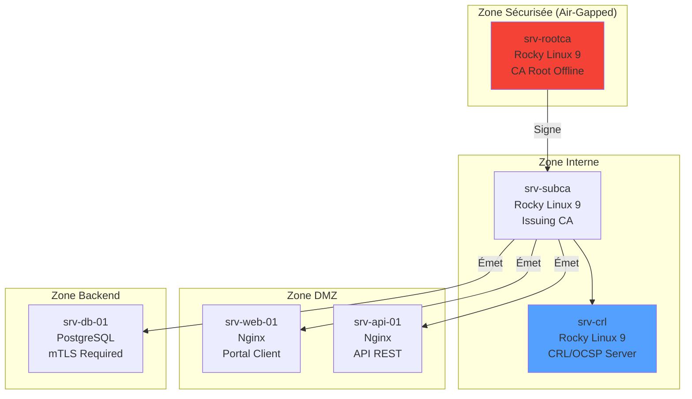

---
tags:
  - formation
  - tp
  - pki
  - secnumcloud
  - projet
---

# Module 5 : TP Final - PKI SecNumCloud

## Contexte

Vous êtes **Security Engineer** chez **CloudSecure**, un hébergeur en cours de qualification **SecNumCloud**. L'audit ANSSI approche et vous devez déployer une infrastructure PKI complète pour sécuriser tous les services internes.

### Environnement



### Serveurs Disponibles

| Serveur | IP | OS | Rôle |
|---------|----|----|------|
| srv-rootca | 10.0.1.10 | Rocky Linux 9 | Root CA (offline) |
| srv-subca | 10.0.2.10 | Rocky Linux 9 | Issuing CA |
| srv-crl | 10.0.2.20 | Rocky Linux 9 | CRL + OCSP |
| srv-web-01 | 10.0.3.10 | Rocky Linux 9 | Portail web |
| srv-api-01 | 10.0.3.20 | Rocky Linux 9 | API REST |
| srv-db-01 | 10.0.4.10 | Rocky Linux 9 | PostgreSQL |

---

## Mission

Déployer l'infrastructure PKI complète en respectant les exigences SecNumCloud.

### Objectifs

1. **Root CA offline** avec clé protégée
2. **Issuing CA** pour émettre les certificats
3. **Miroir CRL** accessible en interne
4. **Certificats serveurs** pour web et API
5. **mTLS** pour la base de données
6. **Monitoring** de l'expiration
7. **Documentation** pour l'audit

---

## Partie 1 : Root CA Offline (2h)

### Tâches

1. Préparer la structure de la CA sur `srv-rootca`
2. Générer la clé privée Root (RSA 4096, protégée par passphrase)
3. Créer le certificat Root CA (validité 20 ans)
4. Documenter la procédure de cérémonie de signature

### Livrables

- [ ] Certificat Root CA : `/opt/ca/root/certs/ca.crt`
- [ ] Fichier de configuration : `/opt/ca/root/openssl.cnf`
- [ ] Documentation : `PROCEDURE-ROOT-CA.md`

### Critères de Validation

```bash
# Le certificat doit :
# - Être auto-signé (Issuer = Subject)
# - Avoir basicConstraints: CA:TRUE
# - Utiliser SHA-384 ou supérieur
# - Avoir une validité de 20 ans

openssl x509 -in /opt/ca/root/certs/ca.crt -text -noout | grep -E "(Issuer|Subject|CA:TRUE|sha)"
```

??? tip "Indice"
    Référez-vous au Module 3, section 2.3 pour la création de la Root CA.

---

## Partie 2 : Issuing CA (1h30)

### Tâches

1. Préparer la structure sur `srv-subca`
2. Générer la clé privée de l'Issuing CA
3. Créer un CSR
4. Transférer le CSR vers `srv-rootca` (clé USB simulée)
5. Signer le CSR avec la Root CA
6. Importer le certificat signé sur `srv-subca`
7. Créer la chaîne de certificats

### Livrables

- [ ] Certificat Issuing CA : `/opt/ca/intermediate/certs/intermediate.crt`
- [ ] Chaîne complète : `/opt/ca/intermediate/certs/ca-chain.crt`
- [ ] Configuration : `/opt/ca/intermediate/openssl.cnf`

### Critères de Validation

```bash
# Vérifier la chaîne
openssl verify -CAfile /opt/ca/root/certs/ca.crt \
    /opt/ca/intermediate/certs/intermediate.crt

# Doit afficher : OK
```

---

## Partie 3 : Serveur CRL (1h)

### Tâches

1. Installer Nginx sur `srv-crl`
2. Configurer un virtual host pour `crl.cloudsecure.local`
3. Générer la première CRL
4. Publier la CRL via HTTP
5. Configurer un cron pour régénérer la CRL toutes les 6 heures

### Configuration DNS (simulée)

```bash
# Ajouter dans /etc/hosts de tous les serveurs
10.0.2.20 crl.cloudsecure.local
```

### Livrables

- [ ] CRL publiée : `http://crl.cloudsecure.local/intermediate.crl`
- [ ] Script de régénération : `/opt/scripts/generate-crl.sh`
- [ ] Cron configuré

### Critères de Validation

```bash
# La CRL doit être accessible
curl -s http://crl.cloudsecure.local/intermediate.crl -o /tmp/test.crl
openssl crl -in /tmp/test.crl -inform DER -text -noout

# Doit afficher les informations de la CRL
```

---

## Partie 4 : Certificats Serveurs (1h)

### Tâches

Émettre des certificats pour :

| Serveur | CN | SANs |
|---------|----|----- |
| srv-web-01 | portal.cloudsecure.local | portal.cloudsecure.local, www.cloudsecure.local |
| srv-api-01 | api.cloudsecure.local | api.cloudsecure.local |

### Livrables

- [ ] Certificat web : `portal.cloudsecure.local.crt`
- [ ] Certificat API : `api.cloudsecure.local.crt`
- [ ] Clés privées correspondantes

### Configuration Nginx

Déployer les certificats sur les serveurs web avec la configuration TLS suivante :

```nginx
ssl_protocols TLSv1.2 TLSv1.3;
ssl_ciphers ECDHE-ECDSA-AES128-GCM-SHA256:ECDHE-RSA-AES128-GCM-SHA256;
ssl_prefer_server_ciphers off;
ssl_session_timeout 1d;
ssl_session_cache shared:SSL:50m;
add_header Strict-Transport-Security "max-age=63072000" always;
```

### Critères de Validation

```bash
# Tester la connexion TLS
openssl s_client -connect srv-web-01:443 -servername portal.cloudsecure.local < /dev/null

# Vérifier la chaîne
openssl s_client -connect srv-web-01:443 -servername portal.cloudsecure.local -showcerts < /dev/null 2>/dev/null | grep -E "(subject|issuer)"
```

---

## Partie 5 : mTLS pour PostgreSQL (1h)

### Tâches

1. Émettre un certificat serveur pour `srv-db-01`
2. Émettre un certificat client pour l'API
3. Configurer PostgreSQL pour exiger mTLS
4. Tester la connexion depuis `srv-api-01`

### Configuration PostgreSQL

```bash
# postgresql.conf
ssl = on
ssl_cert_file = '/var/lib/pgsql/data/server.crt'
ssl_key_file = '/var/lib/pgsql/data/server.key'
ssl_ca_file = '/var/lib/pgsql/data/ca-chain.crt'

# pg_hba.conf
hostssl all all 10.0.3.0/24 cert clientcert=verify-full
```

### Livrables

- [ ] Certificat serveur PostgreSQL
- [ ] Certificat client pour l'API
- [ ] Configuration pg_hba.conf

### Critères de Validation

```bash
# Depuis srv-api-01, connexion avec certificat client
PGSSLCERT=/etc/pki/client.crt \
PGSSLKEY=/etc/pki/client.key \
PGSSLROOTCERT=/etc/pki/ca-chain.crt \
psql -h srv-db-01 -U api_user -d production -c "SELECT 1;"
```

---

## Partie 6 : Monitoring (30min)

### Tâches

1. Créer un script de vérification d'expiration
2. Configurer une alerte si < 30 jours
3. Ajouter au cron quotidien

### Script

```bash
#!/bin/bash
# /opt/scripts/check-certs.sh

HOSTS=(
    "srv-web-01:443:portal.cloudsecure.local"
    "srv-api-01:443:api.cloudsecure.local"
    "srv-db-01:5432"
)

WARN_DAYS=30

for entry in "${HOSTS[@]}"; do
    IFS=':' read -r host port sni <<< "$entry"
    # Implémenter la vérification...
done
```

### Livrables

- [ ] Script fonctionnel
- [ ] Cron configuré
- [ ] Log de sortie

---

## Partie 7 : Documentation Audit (30min)

### Documents à Produire

1. **Architecture PKI** : Diagramme et description des composants
2. **Procédures opérationnelles** :
   - Émission d'un certificat serveur
   - Révocation d'un certificat
   - Renouvellement de l'Issuing CA
3. **Politique de certification** : Durées de validité, algorithmes, etc.

### Template de Documentation

```markdown
# Infrastructure PKI CloudSecure

## 1. Vue d'ensemble

[Diagramme d'architecture]

## 2. Composants

### 2.1 Root CA
- Localisation : srv-rootca (offline)
- Algorithme : RSA 4096, SHA-384
- Validité : 20 ans
- Stockage clé : [décrire]

### 2.2 Issuing CA
...

## 3. Procédures

### 3.1 Émission d'un certificat
1. Générer la clé privée sur le serveur cible
2. Créer le CSR
3. Soumettre à l'Issuing CA
4. Signer le certificat
5. Déployer sur le serveur

### 3.2 Révocation
...

## 4. Conformité ANSSI

| Exigence | Implémentation |
|----------|----------------|
| RSA ≥ 3072 bits | RSA 4096 |
| SHA ≥ 256 | SHA-384 |
| Validité certificat ≤ 1 an | 365 jours |
```

---

## Critères d'Évaluation

| Partie | Points | Critères |
|--------|--------|----------|
| Root CA | 20 | CA fonctionnelle, clé protégée, 20 ans |
| Issuing CA | 20 | Chaîne valide, signe correctement |
| CRL Server | 15 | CRL accessible, régénération auto |
| Certificats Serveurs | 15 | TLS fonctionnel, SANs corrects |
| mTLS PostgreSQL | 15 | Connexion mTLS réussie |
| Monitoring | 5 | Script fonctionnel |
| Documentation | 10 | Complète et professionnelle |
| **Total** | **100** | Seuil de réussite : 70/100 |

---

## Checklist Finale

### Infrastructure

- [ ] Root CA créée et offline
- [ ] Issuing CA opérationnelle
- [ ] CRL publiée et accessible
- [ ] Certificats serveurs déployés
- [ ] mTLS PostgreSQL configuré
- [ ] Monitoring en place

### Documentation

- [ ] Diagramme d'architecture
- [ ] Procédures d'émission
- [ ] Procédures de révocation
- [ ] Tableau de conformité ANSSI

### Tests

```bash
# Test 1 : Chaîne de confiance
openssl verify -CAfile ca-chain.crt portal.cloudsecure.local.crt
# Attendu : OK

# Test 2 : CRL accessible
curl -I http://crl.cloudsecure.local/intermediate.crl
# Attendu : HTTP 200

# Test 3 : TLS web
curl -v --cacert ca-chain.crt https://portal.cloudsecure.local
# Attendu : Connexion réussie

# Test 4 : mTLS PostgreSQL
psql avec certificat client
# Attendu : Connexion réussie
```

---

## Ressources

- [Module 1 : Fondamentaux Crypto](01-module.md)
- [Module 2 : Certificats X.509](02-module.md)
- [Module 3 : PKI Entreprise](03-module.md)
- [Module 4 : Automatisation](04-module.md)
- [Guide OpenSSL CLI ShellBook](../../security/openssl-cli.md)
- [Guide Certificats ShellBook](../../security/certificates.md)

---

## Conclusion

Félicitations ! Si vous avez complété ce TP, vous avez déployé une infrastructure PKI conforme aux exigences SecNumCloud :

- **Séparation des rôles** : Root CA offline, Issuing CA online
- **Révocation** : CRL publiée et accessible
- **Chiffrement** : TLS 1.2/1.3 avec algorithmes forts
- **Authentification** : mTLS pour les services critiques
- **Traçabilité** : Documentation complète pour audit

**Prochaines étapes suggérées :**

- Automatiser avec Ansible (voir Module 4)
- Intégrer HashiCorp Vault pour les certificats éphémères
- Mettre en place OCSP pour la vérification en temps réel

---

**Retour au :** [Programme de la Formation](index.md) | [Catalogue des Formations](../index.md)

---

## Navigation

| | |
|:---|---:|
| [← Module 4 : Automatisation & DevOps](04-module.md) | [Programme →](index.md) |

[Retour au Programme](index.md){ .md-button }
