---
tags:
  - formation
  - python
  - sysops
  - automatisation
---

# Formation Python pour SysOps (35h)

Maîtrisez Python pour l'automatisation système, le scripting avancé et l'intégration Cloud.

---

## Objectifs de la Formation

À l'issue de cette formation, vous serez capable de :

- Écrire des scripts Python robustes et maintenables
- Automatiser les tâches d'administration système
- Interagir avec des APIs REST et services Cloud
- Manipuler des fichiers de configuration (JSON, YAML, INI)
- Créer des outils CLI professionnels
- Tester et documenter votre code

---

## Public Cible

| Profil | Prérequis |
|--------|-----------|
| Administrateurs Système | Bases Linux/Windows |
| DevOps Engineers | Notions de scripting (Bash/PowerShell) |
| SRE | Familiarité avec les concepts réseau |
| Ingénieurs Infrastructure | Aucune expérience Python requise |

---

## Programme Détaillé

### Niveau 1 - Fondations Python (10h)

| Module | Durée | Contenu |
|--------|-------|---------|
| [01 - Environnement](01-environnement.md) | 2h | Installation, venv, pip, IDE, REPL |
| [02 - Syntaxe de Base](02-syntaxe.md) | 3h | Variables, types, opérateurs, structures de contrôle |
| [03 - Structures de Données](03-structures.md) | 3h | Listes, dictionnaires, tuples, sets, compréhensions |
| [04 - Fonctions](04-fonctions.md) | 2h | Définition, arguments, retours, décorateurs, lambdas |

### Niveau 2 - Scripting Système (10h)

| Module | Durée | Contenu |
|--------|-------|---------|
| [05 - Fichiers & I/O](05-fichiers.md) | 2h | Lecture/écriture, pathlib, context managers |
| [06 - Formats de Données](06-formats.md) | 2h | JSON, YAML, CSV, INI, XML |
| [07 - Sous-processus](07-subprocess.md) | 2h | subprocess, os, shutil, commandes système |
| [08 - Expressions Régulières](08-regex.md) | 2h | re module, patterns, parsing de logs |
| [09 - Gestion des Erreurs](09-erreurs.md) | 2h | Exceptions, logging, debugging |

### Niveau 3 - Réseau & APIs (8h)

| Module | Durée | Contenu |
|--------|-------|---------|
| [10 - Réseau de Base](10-reseau.md) | 2h | Sockets, requests HTTP, urllib |
| [11 - APIs REST](11-api-rest.md) | 3h | Requests, authentication, pagination |
| [12 - SSH & Automatisation](12-ssh.md) | 3h | Paramiko, Fabric, automatisation distante |

### Niveau 4 - Production & Cloud (7h)

| Module | Durée | Contenu |
|--------|-------|---------|
| [13 - CLI Professionnels](13-cli.md) | 2h | argparse, click, rich, applications CLI |
| [14 - Cloud & Boto3](14-cloud.md) | 3h | AWS SDK, EC2, S3, Secrets Manager |
| [15 - Tests & Qualité](15-tests.md) | 2h | pytest, mocking, CI/CD integration |

---

## Progression Pédagogique

```mermaid
graph LR
    subgraph "Niveau 1 - Fondations"
        A[Environnement] --> B[Syntaxe]
        B --> C[Structures]
        C --> D[Fonctions]
    end

    subgraph "Niveau 2 - Système"
        D --> E[Fichiers]
        E --> F[Formats]
        F --> G[Subprocess]
        G --> H[Regex]
        H --> I[Erreurs]
    end

    subgraph "Niveau 3 - Réseau"
        I --> J[Réseau]
        J --> K[APIs]
        K --> L[SSH]
    end

    subgraph "Niveau 4 - Production"
        L --> M[CLI]
        M --> N[Cloud]
        N --> O[Tests]
    end

    style A fill:#e1f5fe
    style O fill:#c8e6c9
```



---

## Projets Pratiques

Chaque niveau se termine par un mini-projet :

### Projet Niveau 1 : Analyseur de Logs
Créer un script qui parse des fichiers de logs et génère des statistiques.

### Projet Niveau 2 : Gestionnaire de Configuration
Outil de backup et comparaison de fichiers de configuration.

### Projet Niveau 3 : Health Checker
Application qui vérifie la santé de services via API et SSH.

### Projet Niveau 4 : Infrastructure Reporter
CLI complet qui génère des rapports d'infrastructure multi-cloud.

---

## Environnement de Lab

### Configuration Requise

```bash
# Python 3.10+
python3 --version

# Environnement virtuel
python3 -m venv ~/python-sysops
source ~/python-sysops/bin/activate

# Dépendances de la formation
pip install requests paramiko boto3 pyyaml pytest click rich
```

### Structure des Exercices

```text
python-sysops-labs/
├── niveau1/
│   ├── exercice01_variables.py
│   ├── exercice02_structures.py
│   └── projet_logs/
├── niveau2/
│   ├── exercice05_fichiers.py
│   ├── exercice06_yaml.py
│   └── projet_config/
├── niveau3/
│   ├── exercice10_api.py
│   └── projet_healthcheck/
└── niveau4/
    ├── exercice13_cli.py
    └── projet_reporter/
```

---

## Ressources

- [Cheatsheet Python](cheatsheet-python.md) - Aide-mémoire syntaxe
- [Cheatsheet Libs SysOps](cheatsheet-libs.md) - Bibliothèques essentielles
- [Glossaire](glossaire.md) - Terminologie Python

---

## Comparaison avec Bash/PowerShell

| Tâche | Bash | PowerShell | Python |
|-------|------|------------|--------|
| Parsing JSON | `jq` (externe) | Natif | Natif (`json`) |
| API REST | `curl` | `Invoke-RestMethod` | `requests` |
| Manipulation fichiers | Commandes | Cmdlets | `pathlib` |
| Expressions régulières | `grep`, `sed` | `-match` | `re` |
| Portabilité | Linux/macOS | Windows | Cross-platform |
| Debugging | Limité | Moyen | Excellent |
| Tests unitaires | Difficile | Pester | `pytest` |

---

## Certifications Associées

Cette formation prépare aux certifications :

- **PCEP** - Certified Entry-Level Python Programmer
- **PCAP** - Certified Associate in Python Programming

---

## Planning Suggéré

| Semaine | Modules | Heures |
|---------|---------|--------|
| 1 | Modules 01-04 (Fondations) | 10h |
| 2 | Modules 05-09 (Système) | 10h |
| 3 | Modules 10-12 (Réseau) | 8h |
| 4 | Modules 13-15 (Production) | 7h |

---

## Voir Aussi

- [Python Fondamentaux](../../python/fundamentals.md) - Documentation de référence
- [Python API & Réseau](../../python/api-network.md) - Guide requests/paramiko
- [Python Cloud & AWS](../../python/cloud-aws.md) - Guide Boto3
