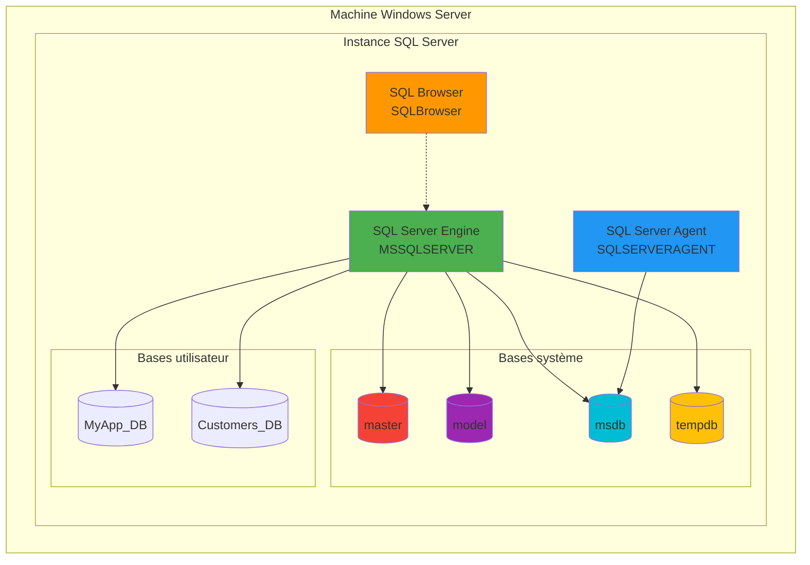
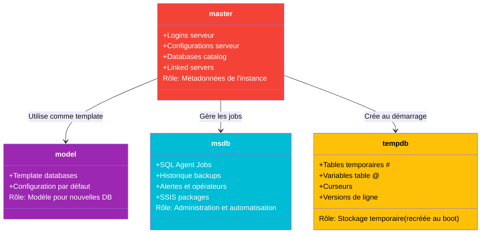

---
tags:
  - formation
  - sql-server
  - dba
  - database
  - installation
---

# Module 1 : Architecture & Installation

## Introduction

> **"It's not just Next > Next > Finish"**

L'installation de SQL Server peut sembler simple avec l'assistant graphique, mais une installation **professionnelle** nécessite :

- ✅ **Reproductibilité** : Déployer 10 serveurs identiques sans erreur manuelle
- ✅ **Documentation** : Connaître exactement les paramètres de chaque instance
- ✅ **Sécurité** : Éviter les configurations par défaut dangereuses
- ✅ **Performance** : Optimiser dès l'installation (tempdb, mémoire)

Une installation mal configurée peut causer :
- ❌ Problèmes de performance (tempdb sur 1 fichier, mémoire non limitée)
- ❌ Failles de sécurité (compte `sa` activé, authentification mixte non justifiée)
- ❌ Perte de temps (reconfiguration manuelle sur chaque serveur)

**Ce module vous apprendra la méthode professionnelle** utilisée par les DBA en production.

---

## Concept : Architecture SQL Server

### Vue d'ensemble

SQL Server n'est pas une application monolithique, mais un **ensemble de services** qui collaborent :



---

### Instances : Default vs Named

SQL Server peut être installé plusieurs fois sur le même serveur via des **instances** :

| Type | Nom d'instance | Nom du service | Port par défaut | Connexion |
|------|----------------|----------------|-----------------|-----------|
| **Default** | `MSSQLSERVER` | `MSSQLSERVER` | **1433** | `SERVEUR\` ou `SERVEUR` |
| **Named** | `INSTANCE1` | `MSSQL$INSTANCE1` | **Dynamique** | `SERVEUR\INSTANCE1` |

#### Cas d'usage :

**Instance par défaut** :
```
Scénario : Serveur dédié à une seule application
Exemple : Serveur SQL unique pour SharePoint
Connexion : sqlserver.contoso.com
```

**Instances nommées** :
```
Scénario : Mutualisation (DEV, TEST, PROD sur le même serveur)
Exemples :
  - SERVEUR\DEV
  - SERVEUR\TEST
  - SERVEUR\PROD

⚠️ Attention : Partage de ressources (CPU, RAM, IO)
Recommandation : Séparer physiquement si charges importantes
```

---

### Bases de données système

SQL Server utilise **4 bases système** critiques :



#### 1. master (Cerveau de l'instance)

**Rôle** : Contient toutes les métadonnées de l'instance

**Contenu critique** :
- Liste de tous les logins (`sys.server_principals`)
- Catalogue de toutes les bases de données (`sys.databases`)
- Configuration serveur (`sys.configurations`)
- Linked servers et endpoints

**⚠️ Si `master` est corrompu** :
```sql
-- SQL Server ne démarre PAS
-- Solution : Restaurer master depuis backup
-- OU reconstruire l'instance (perte de toute configuration)
```

**Sauvegarde** : **OBLIGATOIRE** après chaque modification de configuration.

---

#### 2. model (Template de DB)

**Rôle** : Modèle pour toutes les nouvelles bases de données

**Fonctionnement** :
```sql
-- Toute modification de model est héritée
USE model;
GO

-- Exemple : Ajouter une table d'audit dans TOUTES les futures DB
CREATE TABLE dbo.AuditLog (
    LogID INT IDENTITY PRIMARY KEY,
    EventDate DATETIME DEFAULT GETDATE(),
    EventDescription NVARCHAR(500)
);
GO

-- Créer une nouvelle base
CREATE DATABASE TestDB;
GO

-- Vérifier : la table existe automatiquement !
USE TestDB;
SELECT * FROM dbo.AuditLog; -- ✅ Table présente
```

**Cas d'usage professionnel** :
- Définir une croissance de fichiers standard (éviter l'autogrowth 10%)
- Créer des filegroups par défaut
- Ajouter des rôles de base de données personnalisés

---

#### 3. msdb (Centre de contrôle SQL Agent)

**Rôle** : Stocke tout ce qui concerne l'**automatisation et l'historique**

**Contenu** :
```sql
-- Jobs SQL Agent
SELECT name, enabled, date_created
FROM msdb.dbo.sysjobs;

-- Historique des sauvegardes
SELECT
    database_name,
    backup_start_date,
    backup_finish_date,
    backup_size / 1024 / 1024 AS Size_MB,
    type -- D=Full, I=Differential, L=Log
FROM msdb.dbo.backupset
ORDER BY backup_start_date DESC;

-- Alertes configurées
SELECT name, enabled, severity
FROM msdb.dbo.sysalerts;
```

**⚠️ Si `msdb` est corrompu** :
- Les jobs SQL Agent ne s'exécutent plus
- L'historique de backup est perdu
- Solution : Restaurer `msdb` ou recréer les jobs manuellement

---

#### 4. tempdb (Zone de travail temporaire)

**Rôle** : Stockage temporaire pour l'instance **entière** (toutes les bases)

**Utilisations** :
```sql
-- 1. Tables temporaires locales (#)
CREATE TABLE #TempData (ID INT, Value NVARCHAR(50));
INSERT INTO #TempData VALUES (1, 'Test');
-- Stockée dans tempdb, détruite à la fin de la session

-- 2. Tables temporaires globales (##)
CREATE TABLE ##GlobalTemp (ID INT);
-- Visible par TOUTES les sessions

-- 3. Variables table
DECLARE @MyTable TABLE (ID INT, Name NVARCHAR(50));
-- Stockée en mémoire ou tempdb selon la taille

-- 4. Tri et hash joins (requêtes complexes)
SELECT * FROM Orders o
INNER JOIN Customers c ON o.CustomerID = c.CustomerID
ORDER BY o.OrderDate;
-- Peut utiliser tempdb pour les opérations intermédiaires
```

**Caractéristiques uniques** :
- ✅ **Recréée à chaque redémarrage** (ne JAMAIS y stocker de données persistantes)
- ✅ **Partagée entre toutes les bases** (attention aux contentions)
- ✅ **Mode de récupération SIMPLE** (pas de transaction log backup)

**Configuration critique** :
```sql
-- Nombre de fichiers = Nombre de CPUs (max 8)
-- ⚠️ Par défaut : 1 fichier → Goulot d'étranglement !

-- Vérifier la config actuelle
SELECT
    name,
    physical_name,
    size * 8 / 1024 AS Size_MB
FROM sys.master_files
WHERE database_id = DB_ID('tempdb');

-- Recommandation : 1 fichier par CPU (jusqu'à 8)
-- Configuration à l'installation ou via T-SQL après
```

---

### Services SQL Server

SQL Server s'appuie sur plusieurs services Windows :

| Service | Nom par défaut | Rôle | Compte recommandé |
|---------|----------------|------|-------------------|
| **SQL Server Engine** | `MSSQLSERVER` | Moteur de BD principal | `NT SERVICE\MSSQLSERVER` |
| **SQL Server Agent** | `SQLSERVERAGENT` | Ordonnanceur de jobs | `NT SERVICE\SQLSERVERAGENT` |
| **SQL Browser** | `SQLBrowser` | Résolution de ports (instances nommées) | `NT AUTHORITY\LOCAL SERVICE` |

#### Comptes de service (Service Accounts)

**Principe du moindre privilège** :

```
❌ MAUVAIS : Utiliser un compte Administrateur du domaine
   → Risque : Compromission SQL = Compromission du domaine

✅ BON : Utiliser des comptes gérés (gMSA) ou des comptes virtuels
   → NT SERVICE\MSSQLSERVER (compte virtuel, recommandé)
   → DOMAINE\sql_engine$ (gMSA, pour accès réseau)
```

**Comparatif** :

| Type de compte | Avantages | Inconvénients | Cas d'usage |
|----------------|-----------|---------------|-------------|
| **Compte virtuel** (`NT SERVICE\...`) | ✅ Pas de gestion de mot de passe<br>✅ Droits minimaux | ❌ Pas d'accès réseau | Serveur standalone |
| **gMSA** (`DOMAINE\svc$`) | ✅ Rotation auto des mots de passe<br>✅ Accès réseau possible | ⚠️ Nécessite AD 2012+ | Backups réseau, Linked Servers |
| **Compte domaine classique** | ✅ Contrôle total | ❌ Gestion manuelle MdP<br>❌ Risque de sur-privilège | Legacy (à éviter) |

---

## Pratique : Installation professionnelle

### Fichier de configuration (ConfigurationFile.ini)

**Pourquoi utiliser un fichier de configuration ?**

| Installation GUI | Installation via INI |
|------------------|----------------------|
| ❌ Non reproductible | ✅ Déploiement identique sur N serveurs |
| ❌ Erreurs de clic | ✅ Versionné dans Git |
| ❌ Pas d'audit | ✅ Documentation automatique |
| ❌ Installation lente | ✅ Automatisable (Ansible, DSC) |

---

### Génération du fichier INI

**Méthode 1 : Via l'installateur graphique**

```powershell
# Lancer l'installateur SQL Server
.\setup.exe

# Suivre l'assistant jusqu'à la fin
# À l'étape "Ready to Install", l'installateur affiche :
# "Configuration file path: C:\Program Files\...\ConfigurationFile.ini"

# Copier ce fichier AVANT de cliquer "Install"
# Ce fichier contient TOUTES vos sélections
```

---

**Méthode 2 : Créer manuellement**

Exemple de fichier `ConfigurationFile.ini` professionnel :

```ini
;SQL Server 2022 Developer Edition - Configuration professionnelle
;Auteur: DBA Team
;Date: 2025-01-23
;Usage: setup.exe /ConfigurationFile=ConfigurationFile.ini /IACCEPTSQLSERVERLICENSETERMS

[OPTIONS]

; ============================================
; PARAMÈTRES GÉNÉRAUX
; ============================================

; Action à effectuer
ACTION="Install"

; Édition (Evaluation, Developer, Standard, Enterprise)
; Developer = Gratuit, fonctionnalités Enterprise
EDITION="Developer"

; Clé produit (laisser vide pour Developer)
; PID="XXXXX-XXXXX-XXXXX-XXXXX-XXXXX"

; Accepter les termes de licence (obligatoire en CLI)
IACCEPTSQLSERVERLICENSETERMS="True"

; Désactiver les rapports d'erreur Microsoft (RGPD)
ERRORREPORTING="False"
SQMREPORTING="False"

; ============================================
; COMPOSANTS À INSTALLER
; ============================================

; Fonctionnalités à installer
; SQLENGINE = Moteur de base de données
; REPLICATION = Réplication SQL
; FULLTEXT = Recherche full-text
; IS = Integration Services (ETL)
; AS = Analysis Services (OLAP)
; RS = Reporting Services
FEATURES=SQLENGINE,REPLICATION,FULLTEXT

; ============================================
; INSTANCE
; ============================================

; Nom de l'instance
; MSSQLSERVER = Instance par défaut
; INSTANCE1 = Instance nommée
INSTANCENAME="MSSQLSERVER"

; ID d'instance (utilisé pour les chemins)
INSTANCEID="MSSQLSERVER"

; Répertoire d'installation racine
INSTALLSHAREDDIR="C:\Program Files\Microsoft SQL Server"
INSTALLSHAREDWOWDIR="C:\Program Files (x86)\Microsoft SQL Server"

; Répertoire de l'instance
INSTANCEDIR="C:\Program Files\Microsoft SQL Server"

; ============================================
; COMPTES DE SERVICE
; ============================================

; Compte pour SQL Server Engine
; NT SERVICE\MSSQLSERVER = Compte virtuel (recommandé)
SQLSVCACCOUNT="NT SERVICE\MSSQLSERVER"

; Démarrage automatique
SQLSVCSTARTUPTYPE="Automatic"

; Compte pour SQL Server Agent
AGTSVCACCOUNT="NT SERVICE\SQLSERVERAGENT"
AGTSVCSTARTUPTYPE="Automatic"

; Compte pour SQL Browser (si instances nommées)
; BROWSERSVCSTARTUPTYPE="Automatic"

; ============================================
; SÉCURITÉ
; ============================================

; Mode d'authentification
; Windows = Authentification Windows uniquement (recommandé)
; Mixed = Windows + SQL Authentication (si apps legacy)
SECURITYMODE="SQL"

; Mot de passe du compte SA (si SECURITYMODE=SQL)
; ⚠️ Ne JAMAIS commiter ce fichier dans Git avec un vrai MdP !
SAPWD="P@ssw0rd_Temp_ChangeMe!"

; Administrateurs SQL Server (comptes Windows)
; Séparer par des espaces si plusieurs comptes
SQLSYSADMINACCOUNTS="BUILTIN\Administrators" "DOMAINE\DBA_Team"

; ============================================
; CONFIGURATION TEMPDB
; ============================================

; Nombre de fichiers tempdb (= nombre de CPUs logiques, max 8)
; Améliore les performances en réduisant les contentions
SQLTEMPDBFILECOUNT="4"

; Taille initiale de chaque fichier (MB)
SQLTEMPDBFILESIZE="256"

; Croissance automatique (MB)
; ⚠️ Ne PAS utiliser % (imprévisible)
SQLTEMPDBFILEGROWTH="64"

; Taille initiale du log tempdb (MB)
SQLTEMPDBLOGFILESIZE="64"
SQLTEMPDBLOGFILEGROWTH="64"

; Répertoires tempdb (idéalement sur disques rapides)
SQLTEMPDBDIR="D:\SQLData\TempDB"
SQLTEMPDBLOGDIR="L:\SQLLogs\TempDB"

; ============================================
; RÉPERTOIRES DE DONNÉES
; ============================================

; Répertoire par défaut pour les fichiers de données (.mdf, .ndf)
SQLUSERDBDIR="D:\SQLData"

; Répertoire par défaut pour les fichiers de log (.ldf)
SQLUSERDBLOGDIR="L:\SQLLogs"

; Répertoire pour les backups par défaut
SQLBACKUPDIR="B:\SQLBackups"

; ============================================
; CONFIGURATION RÉSEAU
; ============================================

; Activer TCP/IP (désactivé par défaut)
TCPENABLED="1"

; Port TCP (1433 = défaut)
; SQLNETWORKPORTDEFAULT="1433"

; Activer Named Pipes (optionnel)
NPENABLED="0"

; ============================================
; PARAMÈTRES AVANCÉS
; ============================================

; Activer Instant File Initialization (performances)
; Nécessite que le compte de service ait le droit "Perform volume maintenance tasks"
SQLSVCINSTANTFILEINIT="True"

; Collation (tri et comparaison de caractères)
; SQL_Latin1_General_CP1_CI_AS = Par défaut
; Latin1_General_CI_AS = Recommandé pour apps multilingues
SQLCOLLATION="SQL_Latin1_General_CP1_CI_AS"

; ============================================
; MISES À JOUR
; ============================================

; Rechercher les mises à jour pendant l'installation
UPDATESOURCE="MU"

; Activer Microsoft Update après installation
USEMICROSOFTUPDATE="True"
```

---

### Installation via ligne de commande

**Prérequis** :
```powershell
# Vérifier que .NET Framework 4.7.2+ est installé
Get-ItemProperty "HKLM:\SOFTWARE\Microsoft\NET Framework Setup\NDP\v4\Full" | Select-Object Release

# Télécharger SQL Server 2022 Developer Edition
# https://www.microsoft.com/en-us/sql-server/sql-server-downloads
```

**Installation silencieuse** :

```powershell
# Chemin vers setup.exe (depuis l'ISO monté ou extrait)
$SetupPath = "D:\setup.exe"
$ConfigFile = "C:\Temp\ConfigurationFile.ini"

# Lancer l'installation
Start-Process -FilePath $SetupPath -ArgumentList "/ConfigurationFile=$ConfigFile /IACCEPTSQLSERVERLICENSETERMS /QUIET" -Wait -NoNewWindow

# Options :
# /QUIET = Aucune interface (installation silencieuse)
# /QUIETSIMPLE = Barre de progression uniquement
# /IACCEPTSQLSERVERLICENSETERMS = Acceptation automatique
```

**Vérifier l'installation** :

```powershell
# Vérifier que le service est démarré
Get-Service -Name MSSQLSERVER

# Vérifier les logs d'installation
Get-Content "C:\Program Files\Microsoft SQL Server\160\Setup Bootstrap\Log\Summary.txt"

# Se connecter via SQLCMD
sqlcmd -S localhost -E -Q "SELECT @@VERSION"
```

---

### Configuration post-installation

#### 1. Activer TCP/IP (si non fait dans INI)

```powershell
# Via SQL Server Configuration Manager ou PowerShell

# Importer le module SQL Server (nécessite SSMS installé)
Import-Module SqlServer

# Activer TCP/IP
$smo = 'Microsoft.SqlServer.Management.Smo.'
$wmi = New-Object ($smo + 'Wmi.ManagedComputer') localhost
$tcp = $wmi.ServerInstances['MSSQLSERVER'].ServerProtocols['Tcp']
$tcp.IsEnabled = $true
$tcp.Alter()

# Redémarrer le service
Restart-Service MSSQLSERVER
```

---

#### 2. Configurer la mémoire maximale

**Problème** : Par défaut, SQL Server peut consommer **toute la RAM** disponible, affamant l'OS.

```sql
-- Vérifier la config actuelle
EXEC sp_configure 'show advanced options', 1;
RECONFIGURE;
EXEC sp_configure 'max server memory (MB)';
GO

-- Résultat par défaut : 2147483647 MB (= illimité) ❌

-- Calculer la mémoire maximale recommandée
-- Formule : RAM totale - (OS + autres apps + buffer)
-- Exemple : Serveur 16 GB RAM
-- → Laisser 4 GB pour l'OS
-- → Max SQL Server = 12 GB = 12288 MB

EXEC sp_configure 'max server memory (MB)', 12288;
RECONFIGURE;
GO
```

**Tableau de référence** :

| RAM serveur | RAM pour OS | Max Server Memory |
|-------------|-------------|-------------------|
| 4 GB | 2 GB | 2048 MB |
| 8 GB | 2 GB | 6144 MB |
| 16 GB | 4 GB | 12288 MB |
| 32 GB | 6 GB | 26624 MB |
| 64 GB | 8 GB | 57344 MB |
| 128 GB | 12 GB | 118784 MB |

---

#### 3. Vérifier la configuration tempdb

```sql
-- Vérifier le nombre de fichiers tempdb
SELECT
    name,
    physical_name,
    size * 8 / 1024 AS Size_MB,
    max_size
FROM sys.master_files
WHERE database_id = DB_ID('tempdb');

-- Recommandation :
-- Nombre de fichiers = Nombre de CPUs logiques (max 8)
-- Tous les fichiers doivent avoir la MÊME taille

-- Si config incorrecte, ajouter des fichiers :
USE master;
GO

ALTER DATABASE tempdb
ADD FILE (
    NAME = tempdev2,
    FILENAME = 'D:\SQLData\TempDB\tempdev2.ndf',
    SIZE = 256MB,
    FILEGROWTH = 64MB
);
GO
```

---

## Exercice : "First Instance"

### Scenario

Vous êtes DBA dans une PME. Votre mission : installer SQL Server Developer Edition sur un serveur Windows Server 2022 pour l'environnement de développement.

**Contraintes** :
- Installation reproductible (fichier de configuration)
- Sécurité renforcée (authentification Windows uniquement)
- Performance optimale (tempdb avec 4 fichiers, mémoire limitée)
- Documentation complète

---

### Mission

#### Étape 1 : Préparation de l'environnement

```powershell
# Créer les répertoires de données
New-Item -Path "D:\SQLData", "D:\SQLData\TempDB" -ItemType Directory -Force
New-Item -Path "L:\SQLLogs", "L:\SQLLogs\TempDB" -ItemType Directory -Force
New-Item -Path "B:\SQLBackups" -ItemType Directory -Force

# Télécharger SQL Server 2022 Developer
# https://go.microsoft.com/fwlink/p/?linkid=2215158

# Extraire l'ISO
Mount-DiskImage -ImagePath "C:\Downloads\SQLServer2022-DEV-x64-ENU.iso"
$ISODrive = (Get-DiskImage -ImagePath "C:\Downloads\SQLServer2022-DEV-x64-ENU.iso" | Get-Volume).DriveLetter
```

---

#### Étape 2 : Générer le fichier ConfigurationFile.ini

**Option A : Via l'interface graphique**

1. Exécuter `setup.exe` depuis l'ISO monté
2. Choisir "Installation" > "New SQL Server stand-alone installation"
3. Configurer :
   - Edition : Developer
   - Features : Database Engine Services
   - Instance : Default (MSSQLSERVER)
   - Service Accounts : NT SERVICE\MSSQLSERVER
   - Authentication : Windows Authentication Mode
   - Data Directories : D:\SQLData, L:\SQLLogs, B:\SQLBackups
   - TempDB : 4 files, 256 MB each
4. À l'écran "Ready to Install", copier le fichier de configuration affiché
5. **NE PAS cliquer sur Install** (annuler et utiliser le fichier en CLI)

**Option B : Utiliser le template fourni ci-dessus**

---

#### Étape 3 : Installer via ligne de commande

```powershell
# Variables
$SetupPath = "${ISODrive}:\setup.exe"
$ConfigFile = "C:\Temp\ConfigurationFile.ini"

# Installer
Start-Process -FilePath $SetupPath `
    -ArgumentList "/ConfigurationFile=$ConfigFile /IACCEPTSQLSERVERLICENSETERMS /QUIET" `
    -Wait -NoNewWindow

# Attendre la fin de l'installation (peut prendre 10-20 minutes)
```

---

#### Étape 4 : Vérifier l'installation

```powershell
# Vérifier le service
Get-Service -Name MSSQLSERVER, SQLSERVERAGENT | Format-Table Name, Status, StartType

# Sortie attendue :
# Name            Status  StartType
# ----            ------  ---------
# MSSQLSERVER     Running Automatic
# SQLSERVERAGENT  Running Automatic
```

---

#### Étape 5 : Se connecter à l'instance

**Via SQLCMD (ligne de commande)** :

```powershell
# Vérifier la version
sqlcmd -S localhost -E -Q "SELECT @@VERSION"

# Lister les bases de données
sqlcmd -S localhost -E -Q "SELECT name, state_desc FROM sys.databases"
```

**Via SSMS (SQL Server Management Studio)** :

1. Lancer SSMS
2. Server name : `localhost` ou `.` ou `(local)`
3. Authentication : Windows Authentication
4. Cliquer Connect

---

#### Étape 6 : Configurer la mémoire maximale

```sql
-- Se connecter et exécuter
USE master;
GO

-- Afficher la RAM totale du serveur
SELECT
    total_physical_memory_kb / 1024 AS Total_RAM_MB,
    available_physical_memory_kb / 1024 AS Available_RAM_MB
FROM sys.dm_os_sys_memory;

-- Exemple : Serveur 8 GB RAM → Laisser 2 GB pour l'OS → Max SQL = 6 GB
EXEC sp_configure 'show advanced options', 1;
RECONFIGURE;

EXEC sp_configure 'max server memory (MB)', 6144;
RECONFIGURE;

-- Vérifier
EXEC sp_configure 'max server memory (MB)';
```

---

#### Étape 7 : Vérifier la configuration tempdb

```sql
-- Vérifier le nombre de fichiers et leur taille
SELECT
    file_id,
    name,
    physical_name,
    size * 8 / 1024 AS Size_MB,
    growth * 8 / 1024 AS Growth_MB
FROM sys.master_files
WHERE database_id = DB_ID('tempdb')
ORDER BY file_id;

-- Résultat attendu :
-- 4 fichiers de données (tempdev, tempdev2, tempdev3, tempdev4)
-- 1 fichier de log (templog)
-- Tous les fichiers data doivent avoir la même taille (256 MB)
```

---

### Validation finale

**Checklist** :

- [ ] Service MSSQLSERVER démarré et configuré en Automatic
- [ ] Connexion possible via SSMS avec Windows Authentication
- [ ] Mémoire maximale configurée (< RAM totale - 2 GB)
- [ ] tempdb avec 4 fichiers de données de taille égale
- [ ] Bases système présentes : master, model, msdb, tempdb
- [ ] Fichier ConfigurationFile.ini sauvegardé et documenté

---

## Solution

<details>
<summary>📋 Fichier ConfigurationFile.ini complet (Cliquez pour déplier)</summary>

```ini
;SQL Server 2022 Developer - Installation PME Développement
;Auteur: DBA Team
;Date: 2025-01-23

[OPTIONS]
ACTION="Install"
EDITION="Developer"
IACCEPTSQLSERVERLICENSETERMS="True"
ERRORREPORTING="False"
SQMREPORTING="False"

; Composants
FEATURES=SQLENGINE,REPLICATION,FULLTEXT

; Instance par défaut
INSTANCENAME="MSSQLSERVER"
INSTANCEID="MSSQLSERVER"
INSTANCEDIR="C:\Program Files\Microsoft SQL Server"

; Comptes de service (comptes virtuels)
SQLSVCACCOUNT="NT SERVICE\MSSQLSERVER"
SQLSVCSTARTUPTYPE="Automatic"
AGTSVCACCOUNT="NT SERVICE\SQLSERVERAGENT"
AGTSVCSTARTUPTYPE="Automatic"

; Sécurité (Windows Auth uniquement)
SECURITYMODE="Windows"
SQLSYSADMINACCOUNTS="BUILTIN\Administrators"

; TempDB (4 fichiers pour 4 CPUs)
SQLTEMPDBFILECOUNT="4"
SQLTEMPDBFILESIZE="256"
SQLTEMPDBFILEGROWTH="64"
SQLTEMPDBLOGFILESIZE="64"
SQLTEMPDBLOGFILEGROWTH="64"
SQLTEMPDBDIR="D:\SQLData\TempDB"
SQLTEMPDBLOGDIR="L:\SQLLogs\TempDB"

; Répertoires de données
SQLUSERDBDIR="D:\SQLData"
SQLUSERDBLOGDIR="L:\SQLLogs"
SQLBACKUPDIR="B:\SQLBackups"

; Réseau
TCPENABLED="1"
NPENABLED="0"

; Performances
SQLSVCINSTANTFILEINIT="True"
SQLCOLLATION="SQL_Latin1_General_CP1_CI_AS"

; Mises à jour
UPDATESOURCE="MU"
USEMICROSOFTUPDATE="True"
```

</details>

<details>
<summary>🔧 Script PowerShell d'installation complet (Cliquez pour déplier)</summary>

```powershell
<#
.SYNOPSIS
    Installation automatisée de SQL Server 2022 Developer Edition

.DESCRIPTION
    Script d'installation professionnelle avec :
    - Création des répertoires de données
    - Installation silencieuse via fichier de configuration
    - Configuration post-installation (mémoire, tempdb)
    - Validation complète

.NOTES
    Auteur: DBA Team
    Date: 2025-01-23
    Prérequis:
    - Windows Server 2019/2022
    - .NET Framework 4.7.2+
    - Droits Administrateur
#>

#Requires -RunAsAdministrator

# ============================================
# PARAMÈTRES
# ============================================

$ISOPath = "C:\Downloads\SQLServer2022-DEV-x64-ENU.iso"
$ConfigFilePath = "C:\Temp\ConfigurationFile.ini"
$DataPath = "D:\SQLData"
$LogPath = "L:\SQLLogs"
$BackupPath = "B:\SQLBackups"
$MaxMemoryMB = 6144  # 6 GB (ajuster selon RAM serveur)

# ============================================
# ÉTAPE 1 : CRÉATION DES RÉPERTOIRES
# ============================================

Write-Host "Création des répertoires de données..." -ForegroundColor Cyan

$Directories = @(
    "$DataPath",
    "$DataPath\TempDB",
    "$LogPath",
    "$LogPath\TempDB",
    "$BackupPath"
)

foreach ($Dir in $Directories) {
    if (-not (Test-Path $Dir)) {
        New-Item -Path $Dir -ItemType Directory -Force | Out-Null
        Write-Host "  ✓ $Dir créé" -ForegroundColor Green
    } else {
        Write-Host "  - $Dir existe déjà" -ForegroundColor Yellow
    }
}

# ============================================
# ÉTAPE 2 : MONTAGE DE L'ISO
# ============================================

Write-Host "`nMontage de l'ISO SQL Server..." -ForegroundColor Cyan

if (-not (Test-Path $ISOPath)) {
    Write-Host "  ✗ Erreur : ISO non trouvée à $ISOPath" -ForegroundColor Red
    exit 1
}

$MountResult = Mount-DiskImage -ImagePath $ISOPath -PassThru
$ISODrive = ($MountResult | Get-Volume).DriveLetter
$SetupPath = "${ISODrive}:\setup.exe"

Write-Host "  ✓ ISO montée sur ${ISODrive}:" -ForegroundColor Green

# ============================================
# ÉTAPE 3 : VÉRIFICATION DU FICHIER INI
# ============================================

Write-Host "`nVérification du fichier de configuration..." -ForegroundColor Cyan

if (-not (Test-Path $ConfigFilePath)) {
    Write-Host "  ✗ Erreur : Fichier de configuration non trouvé à $ConfigFilePath" -ForegroundColor Red
    Dismount-DiskImage -ImagePath $ISOPath
    exit 1
}

Write-Host "  ✓ Fichier de configuration trouvé" -ForegroundColor Green

# ============================================
# ÉTAPE 4 : INSTALLATION SQL SERVER
# ============================================

Write-Host "`nDémarrage de l'installation SQL Server..." -ForegroundColor Cyan
Write-Host "  (Cela peut prendre 10-20 minutes)" -ForegroundColor Yellow

$InstallArgs = "/ConfigurationFile=$ConfigFilePath /IACCEPTSQLSERVERLICENSETERMS /QUIET"

$Process = Start-Process -FilePath $SetupPath `
    -ArgumentList $InstallArgs `
    -Wait -NoNewWindow -PassThru

if ($Process.ExitCode -eq 0) {
    Write-Host "  ✓ Installation terminée avec succès" -ForegroundColor Green
} else {
    Write-Host "  ✗ Erreur lors de l'installation (Code: $($Process.ExitCode))" -ForegroundColor Red
    Write-Host "  Consulter les logs : C:\Program Files\Microsoft SQL Server\160\Setup Bootstrap\Log\Summary.txt" -ForegroundColor Yellow
    Dismount-DiskImage -ImagePath $ISOPath
    exit 1
}

# Démonter l'ISO
Dismount-DiskImage -ImagePath $ISOPath
Write-Host "  ✓ ISO démontée" -ForegroundColor Green

# ============================================
# ÉTAPE 5 : VÉRIFICATION DES SERVICES
# ============================================

Write-Host "`nVérification des services SQL Server..." -ForegroundColor Cyan

$Services = @("MSSQLSERVER", "SQLSERVERAGENT")

foreach ($ServiceName in $Services) {
    $Service = Get-Service -Name $ServiceName -ErrorAction SilentlyContinue
    if ($Service -and $Service.Status -eq 'Running') {
        Write-Host "  ✓ $ServiceName : Running" -ForegroundColor Green
    } else {
        Write-Host "  ✗ $ServiceName : Non démarré" -ForegroundColor Red
    }
}

# ============================================
# ÉTAPE 6 : CONFIGURATION POST-INSTALLATION
# ============================================

Write-Host "`nConfiguration post-installation..." -ForegroundColor Cyan

# Attendre que SQL Server soit complètement opérationnel
Start-Sleep -Seconds 10

# Configurer la mémoire maximale
$ConfigMemorySQL = @"
EXEC sp_configure 'show advanced options', 1;
RECONFIGURE;
EXEC sp_configure 'max server memory (MB)', $MaxMemoryMB;
RECONFIGURE;
PRINT 'Mémoire maximale configurée à $MaxMemoryMB MB';
"@

try {
    sqlcmd -S localhost -E -Q $ConfigMemorySQL
    Write-Host "  ✓ Mémoire maximale configurée : $MaxMemoryMB MB" -ForegroundColor Green
} catch {
    Write-Host "  ✗ Erreur lors de la configuration de la mémoire" -ForegroundColor Red
}

# ============================================
# ÉTAPE 7 : VALIDATION FINALE
# ============================================

Write-Host "`nValidation de l'installation..." -ForegroundColor Cyan

# Vérifier la version
$VersionSQL = "SELECT @@VERSION AS Version"
$Version = sqlcmd -S localhost -E -Q $VersionSQL -h -1

Write-Host "  ✓ Version SQL Server : $($Version.Trim())" -ForegroundColor Green

# Vérifier les bases système
$DatabasesSQL = "SELECT name FROM sys.databases WHERE database_id <= 4 ORDER BY database_id"
$Databases = sqlcmd -S localhost -E -Q $DatabasesSQL -h -1

Write-Host "  ✓ Bases système présentes : $($Databases -join ', ')" -ForegroundColor Green

# Vérifier tempdb
$TempDBSQL = @"
SELECT COUNT(*) AS FileCount
FROM sys.master_files
WHERE database_id = DB_ID('tempdb') AND type = 0
"@
$TempDBFiles = sqlcmd -S localhost -E -Q $TempDBSQL -h -1

Write-Host "  ✓ Fichiers tempdb (données) : $($TempDBFiles.Trim())" -ForegroundColor Green

# ============================================
# RÉSUMÉ
# ============================================

Write-Host "`n============================================" -ForegroundColor Cyan
Write-Host "INSTALLATION TERMINÉE AVEC SUCCÈS" -ForegroundColor Green
Write-Host "============================================" -ForegroundColor Cyan
Write-Host ""
Write-Host "Connexion :" -ForegroundColor Yellow
Write-Host "  Server : localhost (ou . ou (local))" -ForegroundColor White
Write-Host "  Authentication : Windows Authentication" -ForegroundColor White
Write-Host ""
Write-Host "Prochaines étapes :" -ForegroundColor Yellow
Write-Host "  1. Se connecter via SSMS" -ForegroundColor White
Write-Host "  2. Vérifier la configuration tempdb" -ForegroundColor White
Write-Host "  3. Créer une première base de données de test" -ForegroundColor White
Write-Host ""
```

</details>

---

## Points clés à retenir

1. **Instances** : Default (port 1433) vs Named (port dynamique)
2. **Bases système** : master (métadonnées), model (template), msdb (jobs), tempdb (temporaire)
3. **Comptes de service** : Utiliser des comptes virtuels (`NT SERVICE\...`) pour la sécurité
4. **ConfigurationFile.ini** : Installation reproductible et documentée
5. **Post-install obligatoire** : Limiter la mémoire SQL Server, configurer tempdb (1 fichier par CPU)

---

## Prochaine étape

Dans le **Module 2**, nous verrons :
- 🔐 **Authentification** : Windows vs SQL, logins, users, roles
- ⚙️ **Configuration serveur** : MAXDOP, Cost Threshold, Trace Flags
- 🛡️ **Hardening** : Désactiver `sa`, chiffrement TLS, audit

Rendez-vous au prochain module pour **sécuriser et optimiser** votre instance SQL Server ! 🚀
