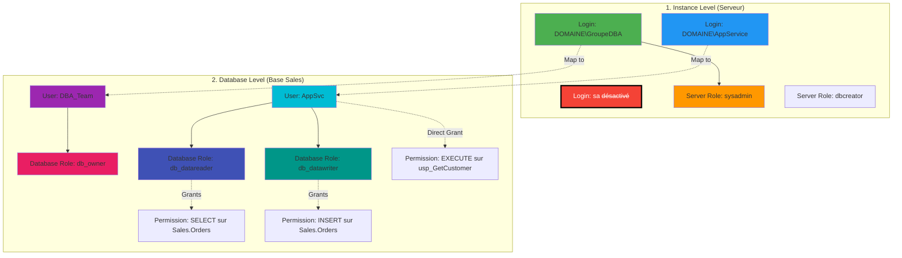

---
tags:
  - formation
  - sql-server
  - security
  - configuration
  - dba
  - module
---

# Module 2 : Sécurité & Configuration - Fortifier l'Instance

## Introduction

> **"Default settings are not Production settings"**

Une instance SQL Server fraîchement installée est comme une **maison neuve sans serrures** :
- 🔓 Le compte `sa` est actif avec un mot de passe potentiellement faible
- 💾 SQL Server peut consommer **toute la RAM** disponible
- ⚙️ Les paramètres de parallélisme sont inadaptés aux charges réelles
- 🚪 Aucune stratégie d'authentification définie

**Conséquences en production** :
- ❌ **Sécurité compromise** : Attaques par brute-force sur `sa`, élévation de privilèges
- ❌ **Crashes Windows** : SQL Server monopolise la RAM, l'OS devient instable
- ❌ **Performances dégradées** : Requêtes parallélisées excessivement (CXPACKET waits)

**Ce module vous apprendra** à transformer une instance "sortie de boîte" en serveur **sécurisé et optimisé** pour la production.

---

## Concept : Sécurité en couches

### Architecture de sécurité SQL Server

SQL Server utilise un modèle de sécurité à **deux niveaux** :



---

### Login vs User : La distinction fondamentale

**Analogie** : Un immeuble d'entreprise avec plusieurs bureaux

| Concept | Niveau | Analogie | Rôle SQL Server |
|---------|--------|----------|-----------------|
| **Login** | Instance (Serveur) | Badge d'accès à l'immeuble | Permet de se connecter à SQL Server |
| **User** | Base de données | Clé d'un bureau spécifique | Permet d'accéder aux objets d'une DB |

**Workflow typique** :
```sql
-- 1. Créer un LOGIN au niveau serveur (badge d'accès)
CREATE LOGIN [DOMAINE\AppService] FROM WINDOWS;

-- 2. Créer un USER dans la base de données (clé du bureau)
USE Sales;
CREATE USER AppSvc FOR LOGIN [DOMAINE\AppService];

-- 3. Donner des permissions via un ROLE (droits dans le bureau)
ALTER ROLE db_datareader ADD MEMBER AppSvc;
ALTER ROLE db_datawriter ADD MEMBER AppSvc;
```

**Résultat** :
```
Le compte DOMAINE\AppService peut :
✓ Se connecter à l'instance SQL Server (LOGIN existe)
✓ Accéder à la base Sales (USER mappé)
✓ Lire et écrire des données (rôles db_datareader/db_datawriter)
✗ Accéder aux autres bases (pas de USER créé dans celles-ci)
```

---

### Logins : Les types d'authentification

SQL Server supporte **2 modes d'authentification** :

#### 1. Windows Authentication (Recommandé)

**Principe** : Déléguer l'authentification à Active Directory

```sql
-- Créer un login basé sur un utilisateur AD
CREATE LOGIN [DOMAINE\jdupont] FROM WINDOWS;

-- Créer un login basé sur un GROUPE AD (meilleure pratique)
CREATE LOGIN [DOMAINE\SQL_Admins] FROM WINDOWS;
```

**Avantages** :
- ✅ **SSO (Single Sign-On)** : Pas de mot de passe à saisir
- ✅ **Politique de mot de passe centralisée** : Gérée par les GPO AD
- ✅ **Audit intégré** : Connexions tracées dans AD
- ✅ **Révocation instantanée** : Désactiver le compte AD = perte d'accès SQL

**Cas d'usage** :
```
Environnement : Entreprise avec Active Directory
Utilisateurs : Employés de l'entreprise
Recommandation : TOUJOURS utiliser ce mode si possible
```

---

#### 2. SQL Authentication (Legacy)

**Principe** : SQL Server gère les mots de passe en interne

```sql
-- Créer un login SQL avec mot de passe
CREATE LOGIN AppUser WITH PASSWORD = 'C0mpl3x!P@ssw0rd';

-- ⚠️ Le mot de passe est stocké dans master (hashé)
```

**Inconvénients** :
- ❌ **Gestion manuelle des mots de passe** : Rotation, complexité
- ❌ **Risque de mot de passe faible** : Pas de politique centralisée
- ❌ **Stockage des credentials dans les apps** : Chaînes de connexion
- ❌ **Pas d'audit AD** : Difficile de tracer les accès

**Cas d'usage JUSTIFIÉ** :
```
Scenario 1 : Application Linux se connectant à SQL Server
Scenario 2 : Service hébergé hors du domaine AD
Scenario 3 : Environnement de développement isolé

⚠️ En production : Utiliser des comptes AD à service (gMSA) si possible
```

---

### Le compte `sa` : La plus grande menace

**Qu'est-ce que `sa` ?**

```sql
-- SA = "System Administrator"
-- Compte SQL par défaut avec droits sysadmin (contrôle total)
-- Créé automatiquement lors de l'installation

-- Vérifier si sa est activé
SELECT
    name,
    is_disabled,
    create_date,
    modify_date
FROM sys.server_principals
WHERE name = 'sa';
```

**Pourquoi `sa` doit mourir ?**

| Problème | Impact | Probabilité |
|----------|--------|-------------|
| **Nom connu de tous** | Cible privilégiée des attaques brute-force | ⚠️⚠️⚠️ Très élevée |
| **Droits sysadmin** | Compromission = contrôle total du serveur | 🔴 Critique |
| **Pas de traçabilité** | Impossible de savoir qui utilise `sa` | ⚠️⚠️ Élevée |
| **Compliance** | Violation des normes SOX, PCI-DSS, HIPAA | ⚠️⚠️ Élevée |

**Recommandations** :

```sql
-- Option 1 : Renommer ET désactiver (recommandé)
ALTER LOGIN sa WITH NAME = [DisabledAdmin_DoNotUse];
ALTER LOGIN [DisabledAdmin_DoNotUse] DISABLE;

-- Option 2 : Désactiver uniquement (si renommage impossible)
ALTER LOGIN sa DISABLE;

-- ⚠️ JAMAIS laisser sa actif avec un mot de passe simple
```

**Audit de sécurité** :
```sql
-- Lister tous les logins avec droits sysadmin
SELECT
    sp.name AS LoginName,
    sp.type_desc AS LoginType,
    sp.is_disabled AS IsDisabled,
    sp.create_date,
    CASE
        WHEN spm.role_principal_id IS NOT NULL THEN 'sysadmin'
        ELSE 'No'
    END AS IsSysadmin
FROM sys.server_principals sp
LEFT JOIN sys.server_role_members spm
    ON sp.principal_id = spm.member_principal_id
    AND spm.role_principal_id = (SELECT principal_id FROM sys.server_principals WHERE name = 'sysadmin')
WHERE sp.type IN ('S', 'U', 'G') -- S=SQL, U=Windows User, G=Windows Group
ORDER BY IsSysadmin DESC, sp.name;
```

---

## Concept : Configuration serveur

### Mémoire : Éviter la catastrophe

**Problème par défaut** :

```sql
-- Par défaut, SQL Server peut utiliser TOUTE la RAM
EXEC sp_configure 'max server memory (MB)';
GO
-- Résultat : 2147483647 MB (= 2 PB) ❌

-- Conséquence : SQL Server consomme progressivement toute la RAM
-- → L'OS Windows n'a plus de mémoire
-- → Crash du serveur ou lenteur extrême
```

**Solution : Limiter la mémoire SQL Server**

```sql
-- Formule de calcul (serveur dédié à SQL Server)
-- Max SQL Memory = RAM Totale - (OS + Buffer)

-- Exemples :
-- RAM 8 GB  → Laisser 2 GB pour l'OS  → Max SQL = 6 GB  = 6144 MB
-- RAM 16 GB → Laisser 4 GB pour l'OS  → Max SQL = 12 GB = 12288 MB
-- RAM 32 GB → Laisser 6 GB pour l'OS  → Max SQL = 26 GB = 26624 MB
-- RAM 64 GB → Laisser 8 GB pour l'OS  → Max SQL = 56 GB = 57344 MB
```

**Tableau de référence** :

| RAM Serveur | RAM OS | Max Server Memory | Commentaire |
|-------------|--------|-------------------|-------------|
| 4 GB | 2 GB | **2048 MB** | Minimum pour DEV |
| 8 GB | 2 GB | **6144 MB** | Petit serveur |
| 16 GB | 4 GB | **12288 MB** | Standard PME |
| 32 GB | 6 GB | **26624 MB** | Production moyenne charge |
| 64 GB | 8 GB | **57344 MB** | Production forte charge |
| 128 GB | 12 GB | **118784 MB** | Serveur haute dispo |
| 256 GB | 16 GB | **245760 MB** | Data Warehouse |

**Configuration** :

```sql
-- Activer les options avancées
EXEC sp_configure 'show advanced options', 1;
RECONFIGURE;

-- Définir la mémoire maximale (exemple : 12 GB)
EXEC sp_configure 'max server memory (MB)', 12288;
RECONFIGURE;

-- Optionnel : Définir la mémoire minimale (évite la libération excessive)
-- Généralement : 25% de Max Server Memory
EXEC sp_configure 'min server memory (MB)', 3072;
RECONFIGURE;

-- Vérifier
EXEC sp_configure 'max server memory (MB)';
EXEC sp_configure 'min server memory (MB)';
```

**Monitoring de la mémoire** :

```sql
-- Utilisation actuelle de la mémoire
SELECT
    physical_memory_in_use_kb / 1024 AS Memory_Used_MB,
    locked_page_allocations_kb / 1024 AS Locked_Pages_MB,
    total_virtual_address_space_kb / 1024 AS Virtual_Memory_MB,
    available_commit_limit_kb / 1024 AS Available_Memory_MB
FROM sys.dm_os_process_memory;

-- Répartition de la mémoire SQL Server
SELECT
    type AS Cache_Type,
    SUM(pages_kb) / 1024 AS Size_MB
FROM sys.dm_os_memory_clerks
GROUP BY type
ORDER BY Size_MB DESC;
```

---

### Parallélisme : MAXDOP et Cost Threshold

**Le problème du parallélisme excessif**

SQL Server peut exécuter une requête sur **plusieurs CPU simultanément** :

```sql
-- Requête simple sur une grosse table
SELECT COUNT(*) FROM Orders; -- 10 millions de lignes

-- SQL Server décide :
-- "Cette requête est coûteuse, je vais utiliser 8 CPU en parallèle"

-- Résultat :
-- ✓ La requête est plus rapide
-- ✗ Les 8 CPU sont bloqués pour cette requête
-- ✗ Les autres requêtes attendent (CXPACKET wait)
```

**Deux paramètres à configurer** :

#### 1. Max Degree of Parallelism (MAXDOP)

**Définition** : Nombre **maximum** de CPU qu'une requête peut utiliser

**Valeur par défaut** : `0` = Utiliser **TOUS** les CPU disponibles ❌

**Recommandations Microsoft** :

| Type de serveur | MAXDOP recommandé | Justification |
|-----------------|-------------------|---------------|
| **Serveur < 8 cores** | Nombre de cores | Utiliser tous les CPU disponibles |
| **Serveur 8-16 cores** | `8` | Éviter la contention excessive |
| **Serveur > 16 cores** | `8` ou `16` | Laisser des CPU pour d'autres requêtes |
| **OLTP (beaucoup de petites requêtes)** | `4` ou `8` | Favoriser la concurrence |
| **Data Warehouse (grosses requêtes)** | Nombre de cores | Performances des requêtes analytiques |

**Configuration** :

```sql
-- Exemple : Serveur avec 16 cores → MAXDOP = 8
EXEC sp_configure 'show advanced options', 1;
RECONFIGURE;

EXEC sp_configure 'max degree of parallelism', 8;
RECONFIGURE;

-- Vérifier
EXEC sp_configure 'max degree of parallelism';
```

---

#### 2. Cost Threshold for Parallelism

**Définition** : Coût estimé minimum (en secondes) pour qu'une requête soit parallélisée

**Valeur par défaut** : `5` (secondes) ❌ **Beaucoup trop bas !**

**Problème** :
```sql
-- Avec Cost Threshold = 5 :
-- Requête estimée à 6 secondes → Parallélisée
-- Requête estimée à 4 secondes → Séquentielle

-- Impact : Trop de petites requêtes sont parallélisées inutilement
-- → Overhead de gestion des threads
-- → Contention CXPACKET
```

**Recommandation** : `50` (secondes)

```sql
-- Configurer Cost Threshold
EXEC sp_configure 'cost threshold for parallelism', 50;
RECONFIGURE;

-- Vérifier
EXEC sp_configure 'cost threshold for parallelism';
```

**Logique** :
```
Seules les requêtes réellement coûteuses (> 50 secondes estimées)
seront parallélisées.
Les petites requêtes restent séquentielles → Moins de contention
```

---

### Autres paramètres critiques

#### Optimize for Ad Hoc Workloads

**Problème** : Chaque requête unique consomme de la mémoire pour son plan d'exécution

```sql
-- Application qui génère des requêtes dynamiques
SELECT * FROM Customers WHERE CustomerID = 123;
SELECT * FROM Customers WHERE CustomerID = 456; -- Plan différent stocké
SELECT * FROM Customers WHERE CustomerID = 789; -- Plan différent stocké
-- → Pollution du plan cache
```

**Solution** :

```sql
-- Activer l'optimisation pour requêtes ad-hoc
-- Ne stocke que le "stub" (emplacement réservé) la première fois
-- Stocke le plan complet seulement si réutilisé
EXEC sp_configure 'optimize for ad hoc workloads', 1;
RECONFIGURE;
```

---

#### Remote Admin Connections

**Utilité** : Permet de se connecter même si SQL Server est surchargé

```sql
-- Activer la connexion admin dédiée (DAC)
EXEC sp_configure 'remote admin connections', 1;
RECONFIGURE;

-- Usage (depuis un autre serveur) :
-- sqlcmd -S ADMIN:MonServeur -E
```

---

## Pratique : Hardening T-SQL

### Script 1 : Désactiver et renommer `sa`

```sql
-- ============================================
-- SCRIPT DE SÉCURISATION DU COMPTE SA
-- Auteur: DBA Team
-- Date: 2025-01-23
-- ============================================

USE master;
GO

-- Étape 1 : Vérifier l'état actuel de sa
SELECT
    name,
    is_disabled,
    create_date,
    modify_date
FROM sys.server_principals
WHERE name = 'sa';
GO

-- Étape 2 : Renommer le compte sa
-- Rend les attaques par brute-force plus difficiles
ALTER LOGIN sa WITH NAME = [DisabledAdmin_DoNotUse];
GO

-- Étape 3 : Désactiver le compte
ALTER LOGIN [DisabledAdmin_DoNotUse] DISABLE;
GO

-- Étape 4 : Vérification
SELECT
    name,
    is_disabled,
    create_date,
    modify_date
FROM sys.server_principals
WHERE name IN ('sa', 'DisabledAdmin_DoNotUse');
GO

PRINT '✓ Compte sa renommé et désactivé avec succès';
GO
```

---

### Script 2 : Créer des logins basés sur des groupes AD

```sql
-- ============================================
-- CRÉATION DE LOGINS BASÉS SUR GROUPES AD
-- ============================================

USE master;
GO

-- Créer un login pour le groupe DBA
-- ⚠️ Remplacer DOMAINE par votre domaine Active Directory
CREATE LOGIN [DOMAINE\SQL_Admins] FROM WINDOWS;
GO

-- Ajouter au rôle sysadmin
ALTER SERVER ROLE sysadmin ADD MEMBER [DOMAINE\SQL_Admins];
GO

-- Créer un login pour les développeurs (lecture seule)
CREATE LOGIN [DOMAINE\SQL_Developers] FROM WINDOWS;
GO

-- Les développeurs auront des droits dans les bases de développement uniquement
-- (configuration au niveau base de données, voir plus loin)

PRINT '✓ Logins AD créés avec succès';
GO
```

---

### Script 3 : Configuration des paramètres avancés

```sql
-- ============================================
-- CONFIGURATION DES PARAMÈTRES SERVEUR
-- ============================================

USE master;
GO

-- Activer les options avancées
EXEC sp_configure 'show advanced options', 1;
RECONFIGURE;
GO

-- 1. MÉMOIRE
-- Exemple : Serveur 16 GB RAM → Max SQL = 12 GB
EXEC sp_configure 'max server memory (MB)', 12288;
EXEC sp_configure 'min server memory (MB)', 3072; -- 25% du max
RECONFIGURE;
GO

-- 2. PARALLÉLISME
-- Serveur 16 cores → MAXDOP = 8
EXEC sp_configure 'max degree of parallelism', 8;
EXEC sp_configure 'cost threshold for parallelism', 50;
RECONFIGURE;
GO

-- 3. OPTIMISATIONS
-- Optimiser pour requêtes ad-hoc (applications web)
EXEC sp_configure 'optimize for ad hoc workloads', 1;
RECONFIGURE;
GO

-- 4. ADMINISTRATION
-- Activer connexion admin distante (DAC)
EXEC sp_configure 'remote admin connections', 1;
RECONFIGURE;
GO

-- Vérifier toutes les configurations
EXEC sp_configure;
GO

PRINT '✓ Configuration serveur appliquée avec succès';
GO
```

---

## Exercice : "Le Script Post-Install"

### Scenario

Vous venez d'installer SQL Server Developer Edition sur un serveur Windows Server 2022 (voir Module 1).

**Caractéristiques du serveur** :
- RAM : 16 GB
- CPU : 8 cores (16 threads logiques)
- Domaine : `ENTREPRISE.LOCAL`
- Instance : Default (`MSSQLSERVER`)

**Mission** : Créer un **script de post-configuration** qui transforme cette instance en serveur production-ready.

---

### Objectifs

#### 1. Sécurité

- [ ] Renommer le compte `sa` en `DisabledAdmin_DoNotUse`
- [ ] Désactiver le compte `sa`
- [ ] Créer un login pour le groupe AD `ENTREPRISE\SQL_Admins` avec droits `sysadmin`
- [ ] Créer un login pour le service applicatif `ENTREPRISE\AppService`

---

#### 2. Configuration serveur

- [ ] Configurer **Max Server Memory** à 80% de la RAM (12.8 GB = 13107 MB)
- [ ] Configurer **Min Server Memory** à 25% du Max (3277 MB)
- [ ] Configurer **MAXDOP** à 4 (moitié des cores physiques)
- [ ] Configurer **Cost Threshold for Parallelism** à 50
- [ ] Activer **Optimize for Ad Hoc Workloads**
- [ ] Activer **Remote Admin Connections**

---

#### 3. Base de données applicative

- [ ] Créer une base de données `Sales` avec :
  - Fichier de données : `D:\SQLData\Sales.mdf` (100 MB initial, croissance 50 MB)
  - Fichier de log : `L:\SQLLogs\Sales_log.ldf` (50 MB initial, croissance 25 MB)
  - Modèle de récupération : `FULL` (pour backups transaction log)

- [ ] Créer un utilisateur `AppSvc` dans la base `Sales`
- [ ] Affecter les rôles `db_datareader` et `db_datawriter` à `AppSvc`

---

### Validation

**Tests à effectuer après exécution du script** :

```sql
-- 1. Vérifier que sa est désactivé
SELECT name, is_disabled FROM sys.server_principals WHERE name LIKE '%Admin%';

-- 2. Vérifier la mémoire
EXEC sp_configure 'max server memory (MB)';
EXEC sp_configure 'min server memory (MB)';

-- 3. Vérifier le parallélisme
EXEC sp_configure 'max degree of parallelism';
EXEC sp_configure 'cost threshold for parallelism';

-- 4. Vérifier la base Sales
SELECT name, recovery_model_desc FROM sys.databases WHERE name = 'Sales';

-- 5. Vérifier l'utilisateur AppSvc
USE Sales;
SELECT
    dp.name AS UserName,
    dp.type_desc AS UserType,
    r.name AS RoleName
FROM sys.database_principals dp
LEFT JOIN sys.database_role_members drm ON dp.principal_id = drm.member_principal_id
LEFT JOIN sys.database_principals r ON drm.role_principal_id = r.principal_id
WHERE dp.name = 'AppSvc';
```

---

## Solution

<details>
<summary>📋 Script T-SQL Post-Install Complet (Cliquez pour déplier)</summary>

```sql
-- ============================================
-- SCRIPT DE POST-CONFIGURATION SQL SERVER
-- Auteur: DBA Team
-- Date: 2025-01-23
-- Version: 1.0
-- ============================================
-- Description:
--   Configuration d'une instance SQL Server fraîchement installée
--   pour un environnement de production.
--
-- Prérequis:
--   - SQL Server 2019+ installé
--   - Droits sysadmin
--   - Répertoires D:\SQLData et L:\SQLLogs créés
--
-- Environnement cible:
--   - RAM: 16 GB
--   - CPU: 8 cores (16 threads)
--   - Domaine: ENTREPRISE.LOCAL
-- ============================================

SET NOCOUNT ON;
GO

PRINT '============================================';
PRINT 'DÉBUT DE LA CONFIGURATION POST-INSTALLATION';
PRINT '============================================';
PRINT '';
GO

-- ============================================
-- PARTIE 1 : SÉCURITÉ
-- ============================================

PRINT '--- PARTIE 1 : SÉCURISATION DE L''INSTANCE ---';
PRINT '';

USE master;
GO

-- 1.1 : Vérifier l'état actuel du compte sa
PRINT '1. Vérification du compte sa...';
SELECT
    name AS LoginName,
    is_disabled AS IsDisabled,
    create_date AS CreateDate
FROM sys.server_principals
WHERE name = 'sa';
GO

-- 1.2 : Renommer le compte sa
PRINT '2. Renommage du compte sa...';
BEGIN TRY
    ALTER LOGIN sa WITH NAME = [DisabledAdmin_DoNotUse];
    PRINT '   ✓ Compte sa renommé en DisabledAdmin_DoNotUse';
END TRY
BEGIN CATCH
    PRINT '   ✗ Erreur lors du renommage : ' + ERROR_MESSAGE();
END CATCH
GO

-- 1.3 : Désactiver le compte
PRINT '3. Désactivation du compte...';
BEGIN TRY
    ALTER LOGIN [DisabledAdmin_DoNotUse] DISABLE;
    PRINT '   ✓ Compte désactivé';
END TRY
BEGIN CATCH
    PRINT '   ✗ Erreur lors de la désactivation : ' + ERROR_MESSAGE();
END CATCH
GO

-- 1.4 : Créer un login pour les administrateurs DBA
PRINT '4. Création du login pour le groupe SQL_Admins...';
BEGIN TRY
    -- Vérifier si le login existe déjà
    IF NOT EXISTS (SELECT 1 FROM sys.server_principals WHERE name = 'ENTREPRISE\SQL_Admins')
    BEGIN
        CREATE LOGIN [ENTREPRISE\SQL_Admins] FROM WINDOWS;
        PRINT '   ✓ Login ENTREPRISE\SQL_Admins créé';
    END
    ELSE
    BEGIN
        PRINT '   - Login ENTREPRISE\SQL_Admins existe déjà';
    END

    -- Ajouter au rôle sysadmin
    ALTER SERVER ROLE sysadmin ADD MEMBER [ENTREPRISE\SQL_Admins];
    PRINT '   ✓ Ajouté au rôle sysadmin';
END TRY
BEGIN CATCH
    PRINT '   ✗ Erreur : ' + ERROR_MESSAGE();
END CATCH
GO

-- 1.5 : Créer un login pour le service applicatif
PRINT '5. Création du login pour le service applicatif...';
BEGIN TRY
    IF NOT EXISTS (SELECT 1 FROM sys.server_principals WHERE name = 'ENTREPRISE\AppService')
    BEGIN
        CREATE LOGIN [ENTREPRISE\AppService] FROM WINDOWS;
        PRINT '   ✓ Login ENTREPRISE\AppService créé';
    END
    ELSE
    BEGIN
        PRINT '   - Login ENTREPRISE\AppService existe déjà';
    END
END TRY
BEGIN CATCH
    PRINT '   ✗ Erreur : ' + ERROR_MESSAGE();
END CATCH
GO

PRINT '';
PRINT '✓ PARTIE 1 TERMINÉE : Sécurité configurée';
PRINT '';
GO

-- ============================================
-- PARTIE 2 : CONFIGURATION SERVEUR
-- ============================================

PRINT '--- PARTIE 2 : CONFIGURATION SERVEUR ---';
PRINT '';

-- Activer les options avancées
PRINT '1. Activation des options avancées...';
EXEC sp_configure 'show advanced options', 1;
RECONFIGURE;
PRINT '   ✓ Options avancées activées';
GO

-- 2.1 : Configurer la mémoire
PRINT '2. Configuration de la mémoire...';
PRINT '   RAM serveur : 16 GB';
PRINT '   Max Server Memory : 80% = 13107 MB (12.8 GB)';
PRINT '   Min Server Memory : 25% du max = 3277 MB';

-- Max Server Memory (80% de 16 GB)
EXEC sp_configure 'max server memory (MB)', 13107;
RECONFIGURE;
PRINT '   ✓ Max Server Memory configurée';

-- Min Server Memory (25% du max)
EXEC sp_configure 'min server memory (MB)', 3277;
RECONFIGURE;
PRINT '   ✓ Min Server Memory configurée';
GO

-- 2.2 : Configurer le parallélisme
PRINT '3. Configuration du parallélisme...';
PRINT '   CPU physiques : 8 cores';
PRINT '   MAXDOP : 4 (50% des cores)';
PRINT '   Cost Threshold : 50';

-- MAXDOP
EXEC sp_configure 'max degree of parallelism', 4;
RECONFIGURE;
PRINT '   ✓ MAXDOP configuré à 4';

-- Cost Threshold
EXEC sp_configure 'cost threshold for parallelism', 50;
RECONFIGURE;
PRINT '   ✓ Cost Threshold configuré à 50';
GO

-- 2.3 : Optimisations
PRINT '4. Activation des optimisations...';

-- Optimize for Ad Hoc Workloads
EXEC sp_configure 'optimize for ad hoc workloads', 1;
RECONFIGURE;
PRINT '   ✓ Optimize for Ad Hoc Workloads activé';
GO

-- 2.4 : Remote Admin Connections
PRINT '5. Activation de la connexion admin distante...';
EXEC sp_configure 'remote admin connections', 1;
RECONFIGURE;
PRINT '   ✓ Remote Admin Connections activée';
GO

PRINT '';
PRINT '✓ PARTIE 2 TERMINÉE : Serveur configuré';
PRINT '';
GO

-- ============================================
-- PARTIE 3 : BASE DE DONNÉES APPLICATIVE
-- ============================================

PRINT '--- PARTIE 3 : CRÉATION DE LA BASE SALES ---';
PRINT '';

USE master;
GO

-- 3.1 : Créer la base de données Sales
PRINT '1. Création de la base de données Sales...';

-- Vérifier si la base existe déjà
IF EXISTS (SELECT 1 FROM sys.databases WHERE name = 'Sales')
BEGIN
    PRINT '   - Base Sales existe déjà, suppression...';
    ALTER DATABASE Sales SET SINGLE_USER WITH ROLLBACK IMMEDIATE;
    DROP DATABASE Sales;
    PRINT '   ✓ Ancienne base supprimée';
END
GO

-- Créer la base avec fichiers personnalisés
CREATE DATABASE Sales
ON PRIMARY
(
    NAME = 'Sales_Data',
    FILENAME = 'D:\SQLData\Sales.mdf',
    SIZE = 100MB,           -- Taille initiale
    FILEGROWTH = 50MB       -- Croissance par blocs de 50 MB
)
LOG ON
(
    NAME = 'Sales_Log',
    FILENAME = 'L:\SQLLogs\Sales_log.ldf',
    SIZE = 50MB,            -- Taille initiale
    FILEGROWTH = 25MB       -- Croissance par blocs de 25 MB
);
GO

PRINT '   ✓ Base Sales créée';
PRINT '     - Fichier données : D:\SQLData\Sales.mdf (100 MB)';
PRINT '     - Fichier log : L:\SQLLogs\Sales_log.ldf (50 MB)';
GO

-- 3.2 : Configurer le modèle de récupération
PRINT '2. Configuration du modèle de récupération...';
ALTER DATABASE Sales SET RECOVERY FULL;
PRINT '   ✓ Modèle de récupération : FULL';
GO

-- 3.3 : Créer l'utilisateur AppSvc
PRINT '3. Création de l''utilisateur AppSvc...';
USE Sales;
GO

-- Créer l'utilisateur mappé au login ENTREPRISE\AppService
CREATE USER AppSvc FOR LOGIN [ENTREPRISE\AppService];
PRINT '   ✓ Utilisateur AppSvc créé';
GO

-- 3.4 : Affecter les rôles
PRINT '4. Attribution des rôles...';

-- Ajouter au rôle db_datareader (lecture)
ALTER ROLE db_datareader ADD MEMBER AppSvc;
PRINT '   ✓ Rôle db_datareader attribué';

-- Ajouter au rôle db_datawriter (écriture)
ALTER ROLE db_datawriter ADD MEMBER AppSvc;
PRINT '   ✓ Rôle db_datawriter attribué';
GO

-- 3.5 : Créer des objets de test (optionnel)
PRINT '5. Création d''objets de test...';

-- Créer un schéma applicatif
CREATE SCHEMA App AUTHORIZATION AppSvc;
PRINT '   ✓ Schéma App créé';

-- Créer une table de test
CREATE TABLE App.Customers
(
    CustomerID INT IDENTITY(1,1) PRIMARY KEY,
    CustomerName NVARCHAR(100) NOT NULL,
    Email NVARCHAR(255),
    CreatedDate DATETIME2 DEFAULT SYSDATETIME()
);
PRINT '   ✓ Table App.Customers créée';

-- Insérer des données de test
INSERT INTO App.Customers (CustomerName, Email)
VALUES
    ('Acme Corp', 'contact@acme.com'),
    ('TechStart SAS', 'info@techstart.fr'),
    ('Global Industries', 'sales@global.com');
PRINT '   ✓ 3 clients de test insérés';
GO

PRINT '';
PRINT '✓ PARTIE 3 TERMINÉE : Base Sales créée et configurée';
PRINT '';
GO

-- ============================================
-- PARTIE 4 : VALIDATION
-- ============================================

PRINT '--- PARTIE 4 : VALIDATION DE LA CONFIGURATION ---';
PRINT '';

USE master;
GO

-- 4.1 : Vérifier le compte sa
PRINT '1. État du compte sa:';
SELECT
    name AS LoginName,
    is_disabled AS IsDisabled
FROM sys.server_principals
WHERE name IN ('sa', 'DisabledAdmin_DoNotUse');
GO

-- 4.2 : Vérifier la mémoire
PRINT '2. Configuration mémoire:';
EXEC sp_configure 'max server memory (MB)';
EXEC sp_configure 'min server memory (MB)';
GO

-- 4.3 : Vérifier le parallélisme
PRINT '3. Configuration parallélisme:';
EXEC sp_configure 'max degree of parallelism';
EXEC sp_configure 'cost threshold for parallelism';
GO

-- 4.4 : Vérifier la base Sales
PRINT '4. Base de données Sales:';
SELECT
    name AS DatabaseName,
    recovery_model_desc AS RecoveryModel,
    state_desc AS State
FROM sys.databases
WHERE name = 'Sales';
GO

-- 4.5 : Vérifier l'utilisateur AppSvc
PRINT '5. Utilisateur AppSvc et ses rôles:';
USE Sales;
SELECT
    dp.name AS UserName,
    dp.type_desc AS UserType,
    r.name AS RoleName
FROM sys.database_principals dp
LEFT JOIN sys.database_role_members drm ON dp.principal_id = drm.member_principal_id
LEFT JOIN sys.database_principals r ON drm.role_principal_id = r.principal_id
WHERE dp.name = 'AppSvc'
ORDER BY r.name;
GO

-- 4.6 : Tester les permissions
PRINT '6. Test de permissions (lecture):';
-- Se connecter en tant qu'AppSvc pour tester (nécessite EXECUTE AS)
EXECUTE AS USER = 'AppSvc';
SELECT COUNT(*) AS NombreClients FROM App.Customers;
REVERT;
PRINT '   ✓ Lecture OK';
GO

PRINT '';
PRINT '============================================';
PRINT 'CONFIGURATION POST-INSTALLATION TERMINÉE';
PRINT '============================================';
PRINT '';
PRINT 'Résumé:';
PRINT '  ✓ Compte sa désactivé et renommé';
PRINT '  ✓ Logins AD créés (SQL_Admins, AppService)';
PRINT '  ✓ Mémoire limitée à 13107 MB (12.8 GB)';
PRINT '  ✓ MAXDOP configuré à 4';
PRINT '  ✓ Cost Threshold configuré à 50';
PRINT '  ✓ Base Sales créée avec utilisateur AppSvc';
PRINT '';
PRINT 'Prochaines étapes:';
PRINT '  1. Configurer les sauvegardes (Module 3)';
PRINT '  2. Tester les connexions applicatives';
PRINT '  3. Surveiller les performances';
PRINT '';
GO
```

</details>

---

## Points clés à retenir

1. **Sécurité en couches** : Login (instance) → User (database) → Role → Permission
2. **Windows Authentication** : Toujours préférer à SQL Authentication
3. **Le compte `sa` doit être désactivé** : Renommer ET désactiver
4. **Max Server Memory** : Limiter à 80% de la RAM (laisser mémoire pour l'OS)
5. **MAXDOP** : 4-8 pour OLTP, égal au nombre de cores pour Data Warehouse
6. **Cost Threshold** : 50 (au lieu de 5 par défaut)

---

## Checklist de sécurisation

Utilisez cette checklist pour chaque nouvelle instance :

- [ ] Compte `sa` désactivé
- [ ] Logins basés sur des groupes AD (pas d'utilisateurs individuels)
- [ ] Pas de logins SQL (sauf si absolument nécessaire)
- [ ] Max Server Memory configurée
- [ ] MAXDOP configuré selon le type de charge
- [ ] Cost Threshold for Parallelism à 50
- [ ] Optimize for Ad Hoc Workloads activé
- [ ] Remote Admin Connections activé
- [ ] Protocoles inutiles désactivés (Named Pipes si non utilisé)
- [ ] Port TCP changé (optionnel, sécurité par obscurité)

---

## Prochaine étape

Dans le **Module 3**, nous verrons :
- 💾 **Stratégies de sauvegarde** : Full, Differential, Transaction Log
- 🔧 **Maintenance des index** : Rebuild vs Reorganize
- 🎖️ **Ola Hallengren Scripts** : Le standard de l'industrie pour la maintenance SQL Server

Rendez-vous au prochain module pour **sauvegarder et maintenir** vos bases de données ! 🚀
