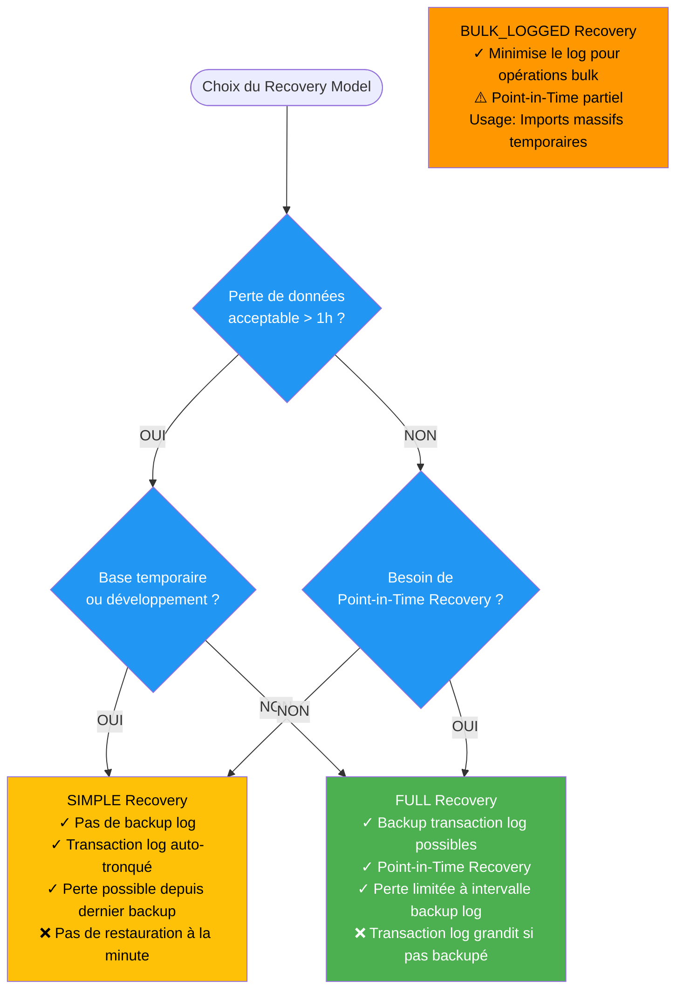
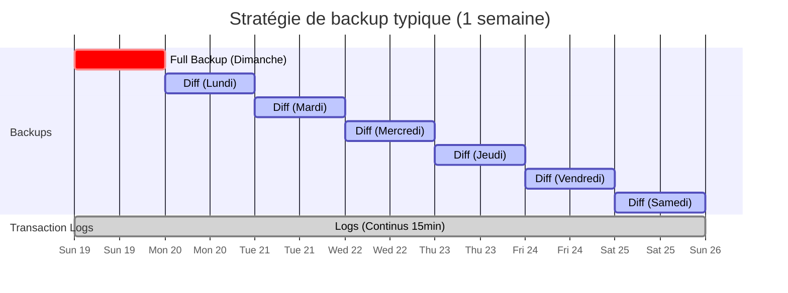
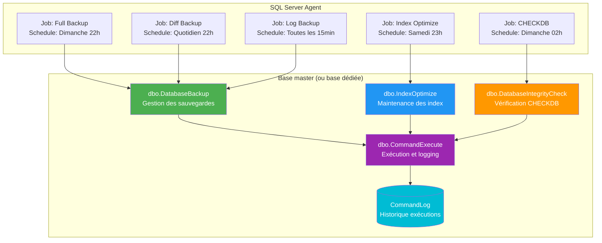

---
tags:
  - formation
  - sql-server
  - backup
  - maintenance
  - dba
  - module
---

# Module 3 : Maintenance & Backups - Le Standard Ola Hallengren

## Introduction

> **"Friends don't let friends use Maintenance Plans"**

Les **Maintenance Plans** de SQL Server (wizard GUI) semblent pratiques, mais sont un **cauchemar opérationnel** :

| Problème Maintenance Plans | Impact |
|----------------------------|--------|
| ❌ **Interface XML complexe** | Impossible à versionner dans Git |
| ❌ **Pas de paramétrage avancé** | Impossible de gérer la rétention fine |
| ❌ **Logs illisibles** | Déboguer un échec est un enfer |
| ❌ **Pas de best practices** | Pas de gestion de la fragmentation |
| ❌ **Maintenance difficile** | Modifier 10 plans = 10 fois le même clic |

**La solution professionnelle** : **Ola Hallengren Maintenance Solution**

- ✅ **Scripts T-SQL pure** : Versionnables, lisibles, auditables
- ✅ **Best practices intégrées** : Développés par un MVP SQL Server
- ✅ **Utilisés mondialement** : Standard de facto dans l'industrie
- ✅ **Gratuit et open-source** : Maintenu depuis 2008
- ✅ **Flexible** : Paramétrage granulaire (rétention, compression, vérification)

**Ce module vous apprendra** à implémenter une stratégie de backup et maintenance production-ready avec Ola Hallengren.

---

## Concept : Recovery & Integrity

### Modèles de récupération (Recovery Models)

SQL Server propose **3 modèles de récupération** qui déterminent **comment les transactions sont loggées** et **quelle perte de données est acceptable**.



---

#### 1. SIMPLE Recovery Model

**Comportement** :
```sql
-- Le transaction log est AUTOMATIQUEMENT tronqué après chaque CHECKPOINT
-- Impossible de faire des backups de transaction log
```

**Cas d'usage** :
```
✓ Bases de développement (perte acceptable)
✓ Bases temporaires (staging, ETL)
✓ Bases en lecture seule (pas de modifications)
✓ Data Warehouses (rechargement quotidien)
```

**Risque** :
```
❌ Perte de données = Temps écoulé depuis le dernier backup complet/différentiel
   Exemple : Full backup à minuit, incident à 11h → Perte de 11 heures
```

**Configuration** :
```sql
ALTER DATABASE MyDatabase SET RECOVERY SIMPLE;
```

---

#### 2. FULL Recovery Model (Recommandé Production)

**Comportement** :
```sql
-- Le transaction log conserve TOUTES les transactions
-- Nécessite des backups de transaction log réguliers
-- Permet la restauration à n'importe quel moment (Point-in-Time Recovery)
```

**Cas d'usage** :
```
✓ Bases de production critiques
✓ Applications OLTP (transactions fréquentes)
✓ Conformité réglementaire (traçabilité)
```

**Avantage clé** :
```
✓ Perte de données = Intervalle entre deux backups log
   Exemple : Backup log toutes les 15 minutes → Perte maximale de 15 minutes
```

**Configuration** :
```sql
ALTER DATABASE MyDatabase SET RECOVERY FULL;

-- ⚠️ IMPORTANT : Faire un FULL BACKUP initial pour activer la chaîne de logs
BACKUP DATABASE MyDatabase
TO DISK = 'D:\Backups\MyDatabase_FULL.bak'
WITH INIT, COMPRESSION;
```

---

#### 3. BULK_LOGGED Recovery Model

**Comportement** :
```sql
-- Minimise le logging pour certaines opérations (BULK INSERT, CREATE INDEX)
-- Point-in-Time Recovery partiel (pas possible pendant les opérations bulk)
```

**Cas d'usage** :
```
✓ Imports massifs ponctuels (millions de lignes)
✓ Reconstructions d'index volumineux
⚠️ Revenir en FULL après l'opération
```

**Workflow** :
```sql
-- Temporairement passer en BULK_LOGGED
ALTER DATABASE MyDatabase SET RECOVERY BULK_LOGGED;

-- Opération bulk
BULK INSERT MyTable FROM 'C:\data.csv';

-- Revenir en FULL
ALTER DATABASE MyDatabase SET RECOVERY FULL;

-- Faire un backup log pour sécuriser la chaîne
BACKUP LOG MyDatabase TO DISK = 'D:\Backups\MyDatabase_LOG.trn';
```

---

### La chaîne de sauvegarde (Backup Chain)

SQL Server utilise **3 types de backups** complémentaires :



---

#### Type 1 : Full Backup (Backup complet)

**Définition** : Sauvegarde **complète** de la base de données

**Contenu** :
```
✓ Toutes les données (tables, index, etc.)
✓ Une portion du transaction log (pour cohérence)
```

**Fréquence typique** :
```
Production : Hebdomadaire (dimanche nuit)
Développement : Quotidien
Petites bases : Quotidien
```

**Taille** : **Égale à la taille de la base de données**

**Commande** :
```sql
BACKUP DATABASE MyDatabase
TO DISK = 'D:\Backups\MyDatabase_FULL_20250123.bak'
WITH
    COMPRESSION,              -- Réduction ~50-70%
    CHECKSUM,                 -- Vérifier l'intégrité
    STATS = 10;               -- Afficher progression tous les 10%
```

---

#### Type 2 : Differential Backup (Backup différentiel)

**Définition** : Sauvegarde **uniquement des changements depuis le dernier FULL**

**Contenu** :
```
✓ Pages de données modifiées depuis le dernier Full Backup
✓ Bien plus petit qu'un Full
```

**Fréquence typique** :
```
Production : Quotidien (entre les Full)
Permet de restaurer plus vite qu'avec Full + Logs
```

**Taille** : **Variable** (augmente au fil de la semaine)

```
Dimanche : Full = 100 GB
Lundi : Diff = 5 GB (changements du lundi)
Mardi : Diff = 12 GB (changements lundi + mardi)
Mercredi : Diff = 20 GB (changements lundi + mardi + mercredi)
[...]
Samedi : Diff = 60 GB
Dimanche : NOUVEAU Full → Reset du compteur différentiel
```

**Commande** :
```sql
BACKUP DATABASE MyDatabase
TO DISK = 'D:\Backups\MyDatabase_DIFF_20250123.bak'
WITH
    DIFFERENTIAL,             -- Mode différentiel
    COMPRESSION,
    CHECKSUM;
```

---

#### Type 3 : Transaction Log Backup (Backup du journal)

**Définition** : Sauvegarde du **transaction log** (journal des transactions)

**Contenu** :
```
✓ Toutes les transactions depuis le dernier backup log
✓ Permet la restauration Point-in-Time
```

**Fréquence typique** :
```
Production critique : Toutes les 5-15 minutes
Production standard : Toutes les 30-60 minutes
Développement : Selon tolérance perte
```

**Taille** : **Variable** selon l'activité

**Commande** :
```sql
BACKUP LOG MyDatabase
TO DISK = 'D:\Backups\MyDatabase_LOG_20250123_1430.trn'
WITH
    COMPRESSION,
    CHECKSUM;
```

**⚠️ ATTENTION** :
```sql
-- Si le log n'est pas backupé régulièrement, il GRANDIT indéfiniment
-- Symptôme : Fichier .ldf de plusieurs centaines de GB

-- Vérifier la taille du log
SELECT
    name,
    log_reuse_wait_desc,
    (size * 8) / 1024 AS Size_MB
FROM sys.databases
WHERE name = 'MyDatabase';

-- Si log_reuse_wait_desc = 'LOG_BACKUP' → Il attend un backup log !
```

---

### Stratégies de restauration

**Scénario 1 : Restauration après un crash (jeudi 14h30)**

```sql
-- Chaîne de backup :
-- Dimanche : Full
-- Lundi-Mercredi : Diff quotidiens
-- Jeudi : Logs de 00h00 à 14h25 (dernier avant le crash)

-- Étapes de restauration :
-- 1. Restaurer le Full du dimanche
RESTORE DATABASE MyDatabase
FROM DISK = 'D:\Backups\MyDatabase_FULL_Dimanche.bak'
WITH NORECOVERY; -- IMPORTANT : Laisser la DB en mode restauration

-- 2. Restaurer le Diff du mercredi (plus récent avant le crash)
RESTORE DATABASE MyDatabase
FROM DISK = 'D:\Backups\MyDatabase_DIFF_Mercredi.bak'
WITH NORECOVERY;

-- 3. Restaurer TOUS les logs du jeudi (dans l'ordre)
RESTORE LOG MyDatabase FROM DISK = 'D:\Backups\MyDatabase_LOG_Jeudi_0000.trn' WITH NORECOVERY;
RESTORE LOG MyDatabase FROM DISK = 'D:\Backups\MyDatabase_LOG_Jeudi_0015.trn' WITH NORECOVERY;
-- [...]
RESTORE LOG MyDatabase FROM DISK = 'D:\Backups\MyDatabase_LOG_Jeudi_1425.trn' WITH RECOVERY; -- Dernier = RECOVERY

-- Résultat : Base restaurée au jeudi 14h25 (perte de 5 minutes seulement)
```

---

### Corruption : DBCC CHECKDB

**Définition** : Commande qui vérifie **l'intégrité physique et logique** de la base de données

**Ce qui est vérifié** :
```
✓ Pages de données corrompues
✓ Index cassés
✓ Liens entre tables et index
✓ Structures système
```

**Pourquoi c'est CRITIQUE** :
```
❌ Corruption silencieuse = Découverte lors d'une restauration (trop tard !)
❌ Backup d'une DB corrompue = Backup inutilisable

✓ CHECKDB régulier = Détection précoce
✓ Permet de restaurer depuis un backup sain
```

**Fréquence recommandée** :
```
Production critique : QUOTIDIEN
Production standard : HEBDOMADAIRE
Développement : HEBDOMADAIRE
```

**Commande** :
```sql
-- Vérification complète
DBCC CHECKDB ('MyDatabase') WITH NO_INFOMSGS, ALL_ERRORMSGS;

-- Résultat attendu :
-- CHECKDB found 0 allocation errors and 0 consistency errors in database 'MyDatabase'.
-- DBCC execution completed. If DBCC printed error messages, contact your system administrator.

-- Si erreurs détectées :
-- 1. Ne PLUS utiliser la base (risque de perte de données)
-- 2. Restaurer depuis un backup SAIN (vérifié avec CHECKDB)
```

**Performance** :
```
⚠️ CHECKDB est INTENSIF (I/O, CPU)
→ Planifier pendant les heures creuses (nuit, week-end)
→ Sur bases volumineuses (> 500 GB), peut prendre plusieurs heures
```

---

## Outil : Ola Hallengren Maintenance Solution

### Présentation

**Ola Hallengren** est un **MVP SQL Server** norvégien ayant développé la solution de maintenance **la plus utilisée au monde**.

**Statistiques** :
- ✅ Utilisée par **des dizaines de milliers d'entreprises**
- ✅ Recommandée par **Microsoft** dans sa documentation officielle
- ✅ **Gratuite** et open-source depuis 2008
- ✅ Compatible SQL Server **2008 à 2022** (et Azure SQL Database)

**Récompenses** :
- 🏆 **Microsoft MVP Award** (2011-présent)
- 🏆 **Brent Ozar's "Best Backup Solution"**

**Site officiel** : https://ola.hallengren.com

---

### Architecture de la solution

La solution Ola Hallengren se compose de **3 procédures stockées principales** + scripts d'installation :



---

### Procédure 1 : DatabaseBackup

**Rôle** : Gérer tous les types de sauvegardes (Full, Diff, Log)

**Paramètres clés** :

| Paramètre | Description | Exemples |
|-----------|-------------|----------|
| `@Databases` | Bases à sauvegarder | `'USER_DATABASES'`, `'MyDB'`, `'DB1,DB2'` |
| `@BackupType` | Type de backup | `'FULL'`, `'DIFF'`, `'LOG'` |
| `@Directory` | Répertoire de destination | `'D:\Backups'` |
| `@Compress` | Activer compression | `'Y'` (recommandé) |
| `@Verify` | Vérifier le backup | `'Y'` (recommandé) |
| `@CleanupTime` | Rétention en heures | `168` (7 jours), `720` (30 jours) |
| `@CheckSum` | Vérifier intégrité | `'Y'` (recommandé) |

**Exemple** :
```sql
-- Backup FULL de toutes les bases utilisateurs
EXECUTE dbo.DatabaseBackup
    @Databases = 'USER_DATABASES',
    @Directory = 'D:\Backups',
    @BackupType = 'FULL',
    @Compress = 'Y',
    @Verify = 'Y',
    @CheckSum = 'Y',
    @CleanupTime = 168; -- Garder 7 jours
```

---

### Procédure 2 : IndexOptimize

**Rôle** : Réorganiser ou reconstruire les index fragmentés

**Stratégie intelligente** :
```
Fragmentation < 5% → Rien faire (index OK)
Fragmentation 5-30% → REORGANIZE (en ligne, peu impactant)
Fragmentation > 30% → REBUILD (hors ligne, mais plus efficace)
```

**Paramètres clés** :

| Paramètre | Description | Exemples |
|-----------|-------------|----------|
| `@Databases` | Bases à optimiser | `'USER_DATABASES'`, `'MyDB'` |
| `@FragmentationLow` | Seuil bas (rien faire) | `NULL` (défaut : 5%) |
| `@FragmentationMedium` | Seuil moyen (REORGANIZE) | `'INDEX_REORGANIZE'` |
| `@FragmentationHigh` | Seuil haut (REBUILD) | `'INDEX_REBUILD_ONLINE,INDEX_REBUILD_OFFLINE'` |
| `@FragmentationLevel1` | Seuil fragmentation medium | `5` (défaut) |
| `@FragmentationLevel2` | Seuil fragmentation high | `30` (défaut) |
| `@UpdateStatistics` | Mettre à jour statistiques | `'ALL'` |

**Exemple** :
```sql
-- Optimiser les index fragmentés > 30%
EXECUTE dbo.IndexOptimize
    @Databases = 'USER_DATABASES',
    @FragmentationLow = NULL,
    @FragmentationMedium = 'INDEX_REORGANIZE',
    @FragmentationHigh = 'INDEX_REBUILD_ONLINE,INDEX_REBUILD_OFFLINE',
    @FragmentationLevel1 = 5,
    @FragmentationLevel2 = 30,
    @UpdateStatistics = 'ALL';
```

---

### Procédure 3 : DatabaseIntegrityCheck

**Rôle** : Exécuter `DBCC CHECKDB` sur les bases de données

**Paramètres clés** :

| Paramètre | Description | Exemples |
|-----------|-------------|----------|
| `@Databases` | Bases à vérifier | `'USER_DATABASES'`, `'MyDB'` |
| `@CheckCommands` | Type de vérification | `'CHECKDB'` (défaut), `'CHECKALLOC'` |
| `@PhysicalOnly` | Vérification physique uniquement | `'Y'` (plus rapide) |

**Exemple** :
```sql
-- Vérifier l'intégrité de toutes les bases utilisateurs
EXECUTE dbo.DatabaseIntegrityCheck
    @Databases = 'USER_DATABASES',
    @CheckCommands = 'CHECKDB',
    @PhysicalOnly = 'N'; -- Vérification complète
```

---

## Pratique : Mise en place

### Installation

**Étape 1 : Télécharger le script**

```powershell
# Télécharger MaintenanceSolution.sql depuis le site officiel
Invoke-WebRequest -Uri "https://ola.hallengren.com/scripts/MaintenanceSolution.sql" `
    -OutFile "C:\Temp\MaintenanceSolution.sql"
```

**Étape 2 : Exécuter le script d'installation**

```sql
-- Se connecter à SQL Server avec SSMS ou Azure Data Studio
-- Ouvrir le fichier MaintenanceSolution.sql
-- Exécuter le script (F5)

-- Le script créera :
-- ✓ 4 procédures stockées dans la base master (ou base personnalisée)
-- ✓ 1 table CommandLog pour l'historique
-- ✓ Jobs SQL Server Agent (optionnel, à commenter si non désiré)
```

**Vérification** :
```sql
-- Vérifier que les procédures sont créées
SELECT name FROM sys.procedures
WHERE name LIKE 'Database%' OR name LIKE 'Command%'
ORDER BY name;

-- Résultat attendu :
-- CommandExecute
-- DatabaseBackup
-- DatabaseIntegrityCheck
-- IndexOptimize
```

---

### Configuration des paramètres

#### Paramètre 1 : Sélection des bases de données

```sql
-- Options pour @Databases :

-- 1. Toutes les bases utilisateurs (recommandé)
@Databases = 'USER_DATABASES'

-- 2. Toutes les bases système
@Databases = 'SYSTEM_DATABASES'

-- 3. Toutes les bases (système + utilisateur)
@Databases = 'ALL_DATABASES'

-- 4. Base spécifique
@Databases = 'SalesDB'

-- 5. Plusieurs bases (séparées par virgule)
@Databases = 'SalesDB,CustomersDB,OrdersDB'

-- 6. Bases correspondant à un pattern (% = wildcard)
@Databases = 'Sales%' -- SalesDB, SalesArchive, etc.

-- 7. Toutes les bases SAUF certaines
@Databases = 'USER_DATABASES, -TempDB, -TestDB'
```

---

#### Paramètre 2 : Compression des backups

```sql
-- @Compress = 'Y' (recommandé)
-- Économie : 50-70% de taille
-- Impact CPU : +10-20% pendant le backup (acceptable)

-- Exemple sans compression :
-- Backup Full : 100 GB, durée : 30 minutes

-- Exemple avec compression :
-- Backup Full : 35 GB, durée : 33 minutes (gain de 65 GB !)

-- Configuration :
@Compress = 'Y'
```

---

#### Paramètre 3 : Rétention des backups (@CleanupTime)

```sql
-- @CleanupTime : Temps en HEURES avant suppression automatique

-- Exemples :
@CleanupTime = 24    -- 1 jour (développement)
@CleanupTime = 168   -- 7 jours (standard)
@CleanupTime = 336   -- 14 jours (production moyenne)
@CleanupTime = 720   -- 30 jours (production critique)
@CleanupTime = NULL  -- Pas de nettoyage (géré ailleurs)

-- ⚠️ ATTENTION : Adapter selon :
-- - Espace disque disponible
-- - Politique de sauvegarde entreprise
-- - Exigences réglementaires (compliance)
```

---

### Planification avec SQL Server Agent

SQL Server Agent permet de **planifier l'exécution automatique** des scripts.

**Workflow** :
```
Job SQL Agent → Schedule (fréquence) → Exécution automatique → Historique
```

**Exemple : Créer un Job pour Full Backup hebdomadaire**

```sql
-- Créer un job SQL Agent
USE msdb;
GO

-- Étape 1 : Créer le job
EXEC dbo.sp_add_job
    @job_name = N'Backup_FULL_Weekly';
GO

-- Étape 2 : Ajouter une étape au job (exécuter la procédure Ola)
EXEC dbo.sp_add_jobstep
    @job_name = N'Backup_FULL_Weekly',
    @step_name = N'Execute Full Backup',
    @subsystem = N'TSQL',
    @command = N'
EXECUTE dbo.DatabaseBackup
    @Databases = ''USER_DATABASES'',
    @Directory = ''D:\Backups'',
    @BackupType = ''FULL'',
    @Compress = ''Y'',
    @Verify = ''Y'',
    @CheckSum = ''Y'',
    @CleanupTime = 720;
';
GO

-- Étape 3 : Créer un schedule (tous les dimanches à 22h)
EXEC dbo.sp_add_schedule
    @schedule_name = N'Weekly_Sunday_22h',
    @freq_type = 8,            -- Hebdomadaire
    @freq_interval = 1,        -- Dimanche (1=Dimanche, 2=Lundi, etc.)
    @active_start_time = 220000; -- 22h00:00
GO

-- Étape 4 : Attacher le schedule au job
EXEC dbo.sp_attach_schedule
    @job_name = N'Backup_FULL_Weekly',
    @schedule_name = N'Weekly_Sunday_22h';
GO

-- Étape 5 : Attacher le job au serveur local
EXEC dbo.sp_add_jobserver
    @job_name = N'Backup_FULL_Weekly';
GO

PRINT '✓ Job créé avec succès';
```

**Vérifier les jobs** :
```sql
-- Lister tous les jobs
SELECT
    j.name AS JobName,
    j.enabled AS IsEnabled,
    s.name AS ScheduleName,
    CASE s.freq_type
        WHEN 1 THEN 'Une fois'
        WHEN 4 THEN 'Quotidien'
        WHEN 8 THEN 'Hebdomadaire'
        WHEN 16 THEN 'Mensuel'
    END AS Frequency
FROM msdb.dbo.sysjobs j
LEFT JOIN msdb.dbo.sysjobschedules js ON j.job_id = js.job_id
LEFT JOIN msdb.dbo.sysschedules s ON js.schedule_id = s.schedule_id
WHERE j.name LIKE 'Backup%'
ORDER BY j.name;
```

---

## Exercice : "Politique Gold"

### Scenario

Vous êtes DBA d'une entreprise e-commerce. La base de données **`SalesDB`** contient toutes les commandes clients.

**Contraintes métier** :
- 🔴 **RPO (Recovery Point Objective)** : Perte maximale acceptable = **15 minutes**
- 🔴 **RTO (Recovery Time Objective)** : Temps de restauration max = **30 minutes**
- 📊 Taille de la base : **50 GB**
- 📈 Activité : **~500 transactions/minute** (OLTP intensif)

**Politique de backup "Gold"** :
```
✓ Full Backup : Hebdomadaire (dimanche 23h)
✓ Differential Backup : Quotidien (22h)
✓ Log Backup : Toutes les 15 minutes (24/7)
✓ Index Optimization : Hebdomadaire (samedi 23h)
✓ CHECKDB : Hebdomadaire (dimanche 02h)
✓ Compression : Activée
✓ Vérification : Activée
✓ Rétention Full/Diff : 30 jours
✓ Rétention Log : 48 heures
```

---

### Mission

#### Étape 1 : Passer `SalesDB` en Full Recovery

```sql
-- Vérifier le modèle de récupération actuel
SELECT name, recovery_model_desc
FROM sys.databases
WHERE name = 'SalesDB';

-- Si pas déjà en FULL, le configurer
ALTER DATABASE SalesDB SET RECOVERY FULL;
GO

-- ⚠️ IMPORTANT : Faire un Full Backup initial pour activer la chaîne de logs
BACKUP DATABASE SalesDB
TO DISK = 'D:\Backups\SalesDB_FULL_Initial.bak'
WITH INIT, COMPRESSION, CHECKSUM;
GO

PRINT '✓ SalesDB configurée en Full Recovery et backup initial effectué';
```

---

#### Étape 2 : Installer Ola Hallengren (si pas déjà fait)

```sql
-- Télécharger et exécuter MaintenanceSolution.sql
-- (Voir section "Installation" ci-dessus)

-- Vérifier l'installation
SELECT name FROM sys.procedures
WHERE name IN ('DatabaseBackup', 'IndexOptimize', 'DatabaseIntegrityCheck');
-- Doit retourner 3 lignes
```

---

#### Étape 3 : Créer la commande Full Backup

**Objectif** : Full backup hebdomadaire, dimanche 23h, compression, rétention 30 jours

```sql
USE msdb;
GO

-- Job Full Backup
EXEC dbo.sp_add_job @job_name = N'SalesDB_Backup_FULL';

EXEC dbo.sp_add_jobstep
    @job_name = N'SalesDB_Backup_FULL',
    @step_name = N'Full Backup',
    @subsystem = N'TSQL',
    @command = N'
EXECUTE dbo.DatabaseBackup
    @Databases = ''SalesDB'',
    @Directory = ''D:\Backups'',
    @BackupType = ''FULL'',
    @Compress = ''Y'',
    @Verify = ''Y'',
    @CheckSum = ''Y'',
    @CleanupTime = 720; -- 30 jours
';

-- Schedule : Dimanches à 23h
EXEC dbo.sp_add_schedule
    @schedule_name = N'Weekly_Sunday_23h',
    @freq_type = 8,
    @freq_interval = 1,
    @active_start_time = 230000;

EXEC dbo.sp_attach_schedule
    @job_name = N'SalesDB_Backup_FULL',
    @schedule_name = N'Weekly_Sunday_23h';

EXEC dbo.sp_add_jobserver @job_name = N'SalesDB_Backup_FULL';
GO
```

---

#### Étape 4 : Créer la commande Differential Backup

**Objectif** : Diff quotidien à 22h, rétention 30 jours

```sql
-- Job Differential Backup
EXEC dbo.sp_add_job @job_name = N'SalesDB_Backup_DIFF';

EXEC dbo.sp_add_jobstep
    @job_name = N'SalesDB_Backup_DIFF',
    @step_name = N'Differential Backup',
    @subsystem = N'TSQL',
    @command = N'
EXECUTE dbo.DatabaseBackup
    @Databases = ''SalesDB'',
    @Directory = ''D:\Backups'',
    @BackupType = ''DIFF'',
    @Compress = ''Y'',
    @Verify = ''Y'',
    @CheckSum = ''Y'',
    @CleanupTime = 720; -- 30 jours
';

-- Schedule : Quotidien à 22h
EXEC dbo.sp_add_schedule
    @schedule_name = N'Daily_22h',
    @freq_type = 4, -- Quotidien
    @active_start_time = 220000;

EXEC dbo.sp_attach_schedule
    @job_name = N'SalesDB_Backup_DIFF',
    @schedule_name = N'Daily_22h';

EXEC dbo.sp_add_jobserver @job_name = N'SalesDB_Backup_DIFF';
GO
```

---

#### Étape 5 : Créer la commande Log Backup

**Objectif** : Backup log toutes les 15 minutes, rétention 48h

```sql
-- Job Log Backup
EXEC dbo.sp_add_job @job_name = N'SalesDB_Backup_LOG';

EXEC dbo.sp_add_jobstep
    @job_name = N'SalesDB_Backup_LOG',
    @step_name = N'Transaction Log Backup',
    @subsystem = N'TSQL',
    @command = N'
EXECUTE dbo.DatabaseBackup
    @Databases = ''SalesDB'',
    @Directory = ''D:\Backups'',
    @BackupType = ''LOG'',
    @Compress = ''Y'',
    @Verify = ''Y'',
    @CheckSum = ''Y'',
    @CleanupTime = 48; -- 48 heures
';

-- Schedule : Toutes les 15 minutes, 24/7
EXEC dbo.sp_add_schedule
    @schedule_name = N'Every_15_Minutes',
    @freq_type = 4,           -- Quotidien
    @freq_interval = 1,       -- Tous les jours
    @freq_subday_type = 4,    -- Minutes
    @freq_subday_interval = 15; -- Toutes les 15 minutes

EXEC dbo.sp_attach_schedule
    @job_name = N'SalesDB_Backup_LOG',
    @schedule_name = N'Every_15_Minutes';

EXEC dbo.sp_add_jobserver @job_name = N'SalesDB_Backup_LOG';
GO
```

---

#### Étape 6 : Créer la commande Index Optimization

**Objectif** : Optimiser les index fragmentés > 50%, samedi 23h

```sql
-- Job Index Optimization
EXEC dbo.sp_add_job @job_name = N'SalesDB_Index_Optimize';

EXEC dbo.sp_add_jobstep
    @job_name = N'SalesDB_Index_Optimize',
    @step_name = N'Optimize Indexes',
    @subsystem = N'TSQL',
    @command = N'
EXECUTE dbo.IndexOptimize
    @Databases = ''SalesDB'',
    @FragmentationLow = NULL,
    @FragmentationMedium = ''INDEX_REORGANIZE'',
    @FragmentationHigh = ''INDEX_REBUILD_ONLINE,INDEX_REBUILD_OFFLINE'',
    @FragmentationLevel1 = 5,
    @FragmentationLevel2 = 50, -- Seuil à 50% (au lieu de 30% par défaut)
    @UpdateStatistics = ''ALL'';
';

-- Schedule : Samedis à 23h
EXEC dbo.sp_add_schedule
    @schedule_name = N'Weekly_Saturday_23h',
    @freq_type = 8,
    @freq_interval = 64, -- Samedi
    @active_start_time = 230000;

EXEC dbo.sp_attach_schedule
    @job_name = N'SalesDB_Index_Optimize',
    @schedule_name = N'Weekly_Saturday_23h';

EXEC dbo.sp_add_jobserver @job_name = N'SalesDB_Index_Optimize';
GO
```

---

#### Étape 7 : Créer la commande CHECKDB

**Objectif** : Vérifier l'intégrité, dimanche 02h

```sql
-- Job Integrity Check
EXEC dbo.sp_add_job @job_name = N'SalesDB_Integrity_Check';

EXEC dbo.sp_add_jobstep
    @job_name = N'SalesDB_Integrity_Check',
    @step_name = N'CHECKDB',
    @subsystem = N'TSQL',
    @command = N'
EXECUTE dbo.DatabaseIntegrityCheck
    @Databases = ''SalesDB'',
    @CheckCommands = ''CHECKDB'',
    @PhysicalOnly = ''N''; -- Vérification complète
';

-- Schedule : Dimanches à 02h
EXEC dbo.sp_add_schedule
    @schedule_name = N'Weekly_Sunday_02h',
    @freq_type = 8,
    @freq_interval = 1,
    @active_start_time = 020000;

EXEC dbo.sp_attach_schedule
    @job_name = N'SalesDB_Integrity_Check',
    @schedule_name = N'Weekly_Sunday_02h';

EXEC dbo.sp_add_jobserver @job_name = N'SalesDB_Integrity_Check';
GO
```

---

### Validation

**Vérifier que tous les jobs sont créés** :

```sql
SELECT
    j.name AS JobName,
    j.enabled AS IsEnabled,
    s.name AS ScheduleName,
    CASE s.freq_type
        WHEN 4 THEN 'Quotidien'
        WHEN 8 THEN 'Hebdomadaire'
    END AS Frequency,
    s.active_start_time AS StartTime
FROM msdb.dbo.sysjobs j
LEFT JOIN msdb.dbo.sysjobschedules js ON j.job_id = js.job_id
LEFT JOIN msdb.dbo.sysschedules s ON js.schedule_id = s.schedule_id
WHERE j.name LIKE 'SalesDB%'
ORDER BY j.name;
```

**Tester manuellement un job** :

```sql
-- Exécuter le job Log Backup manuellement
EXEC msdb.dbo.sp_start_job @job_name = 'SalesDB_Backup_LOG';

-- Vérifier l'historique d'exécution
SELECT
    j.name AS JobName,
    h.run_date,
    h.run_time,
    h.run_duration,
    CASE h.run_status
        WHEN 0 THEN 'Failed'
        WHEN 1 THEN 'Succeeded'
        WHEN 2 THEN 'Retry'
        WHEN 3 THEN 'Canceled'
    END AS Status,
    h.message
FROM msdb.dbo.sysjobs j
JOIN msdb.dbo.sysjobhistory h ON j.job_id = h.job_id
WHERE j.name = 'SalesDB_Backup_LOG'
ORDER BY h.run_date DESC, h.run_time DESC;
```

---

## Solution

<details>
<summary>📋 Script T-SQL Complet - Politique Gold (Cliquez pour déplier)</summary>

```sql
-- ============================================
-- POLITIQUE DE BACKUP "GOLD" POUR SALESDB
-- Auteur: DBA Team
-- Date: 2025-01-23
-- ============================================
-- Description:
--   Implémentation complète d'une stratégie de backup
--   pour base de données critique (e-commerce).
--
-- Prérequis:
--   - Ola Hallengren Maintenance Solution installée
--   - SQL Server Agent démarré
--   - Répertoire D:\Backups créé
--
-- RPO: 15 minutes
-- RTO: 30 minutes
-- ============================================

SET NOCOUNT ON;
GO

PRINT '============================================';
PRINT 'CONFIGURATION POLITIQUE BACKUP GOLD';
PRINT '============================================';
PRINT '';

-- ============================================
-- PARTIE 1 : CONFIGURATION RECOVERY MODEL
-- ============================================

PRINT '--- PARTIE 1 : RECOVERY MODEL ---';
PRINT '';

USE master;
GO

-- Vérifier l'état actuel
PRINT '1. État actuel de SalesDB:';
SELECT
    name AS DatabaseName,
    recovery_model_desc AS RecoveryModel,
    state_desc AS State
FROM sys.databases
WHERE name = 'SalesDB';
GO

-- Passer en FULL Recovery
PRINT '2. Configuration en Full Recovery...';
ALTER DATABASE SalesDB SET RECOVERY FULL;
PRINT '   ✓ SalesDB configurée en Full Recovery';
GO

-- Backup initial (CRITIQUE pour activer la chaîne de logs)
PRINT '3. Backup Full initial...';
BACKUP DATABASE SalesDB
TO DISK = 'D:\Backups\SalesDB_FULL_Initial.bak'
WITH INIT, COMPRESSION, CHECKSUM;
PRINT '   ✓ Backup initial effectué';
GO

PRINT '';
PRINT '✓ PARTIE 1 TERMINÉE';
PRINT '';

-- ============================================
-- PARTIE 2 : JOBS SQL AGENT
-- ============================================

PRINT '--- PARTIE 2 : CRÉATION DES JOBS ---';
PRINT '';

USE msdb;
GO

-- ==========================================
-- JOB 1 : FULL BACKUP (Hebdomadaire)
-- ==========================================

PRINT '1. Création du job Full Backup...';

-- Supprimer le job s'il existe déjà
IF EXISTS (SELECT 1 FROM sysjobs WHERE name = 'SalesDB_Backup_FULL')
    EXEC sp_delete_job @job_name = 'SalesDB_Backup_FULL';

-- Créer le job
EXEC dbo.sp_add_job
    @job_name = N'SalesDB_Backup_FULL',
    @enabled = 1,
    @description = N'Full Backup hebdomadaire de SalesDB (Policy Gold)';

-- Ajouter l'étape
EXEC dbo.sp_add_jobstep
    @job_name = N'SalesDB_Backup_FULL',
    @step_name = N'Execute Full Backup',
    @subsystem = N'TSQL',
    @command = N'
EXECUTE dbo.DatabaseBackup
    @Databases = ''SalesDB'',
    @Directory = ''D:\Backups'',
    @BackupType = ''FULL'',
    @Compress = ''Y'',
    @Verify = ''Y'',
    @CheckSum = ''Y'',
    @CleanupTime = 720; -- 30 jours
';

-- Créer le schedule
IF EXISTS (SELECT 1 FROM sysschedules WHERE name = 'Gold_Weekly_Sunday_23h')
    EXEC sp_delete_schedule @schedule_name = 'Gold_Weekly_Sunday_23h';

EXEC dbo.sp_add_schedule
    @schedule_name = N'Gold_Weekly_Sunday_23h',
    @freq_type = 8,            -- Hebdomadaire
    @freq_interval = 1,        -- Dimanche
    @active_start_time = 230000; -- 23h

-- Attacher schedule au job
EXEC dbo.sp_attach_schedule
    @job_name = N'SalesDB_Backup_FULL',
    @schedule_name = N'Gold_Weekly_Sunday_23h';

-- Attacher au serveur
EXEC dbo.sp_add_jobserver
    @job_name = N'SalesDB_Backup_FULL';

PRINT '   ✓ Job Full Backup créé (Dimanche 23h)';
GO

-- ==========================================
-- JOB 2 : DIFFERENTIAL BACKUP (Quotidien)
-- ==========================================

PRINT '2. Création du job Differential Backup...';

IF EXISTS (SELECT 1 FROM sysjobs WHERE name = 'SalesDB_Backup_DIFF')
    EXEC sp_delete_job @job_name = 'SalesDB_Backup_DIFF';

EXEC dbo.sp_add_job
    @job_name = N'SalesDB_Backup_DIFF',
    @enabled = 1,
    @description = N'Differential Backup quotidien de SalesDB (Policy Gold)';

EXEC dbo.sp_add_jobstep
    @job_name = N'SalesDB_Backup_DIFF',
    @step_name = N'Execute Differential Backup',
    @subsystem = N'TSQL',
    @command = N'
EXECUTE dbo.DatabaseBackup
    @Databases = ''SalesDB'',
    @Directory = ''D:\Backups'',
    @BackupType = ''DIFF'',
    @Compress = ''Y'',
    @Verify = ''Y'',
    @CheckSum = ''Y'',
    @CleanupTime = 720; -- 30 jours
';

IF EXISTS (SELECT 1 FROM sysschedules WHERE name = 'Gold_Daily_22h')
    EXEC sp_delete_schedule @schedule_name = 'Gold_Daily_22h';

EXEC dbo.sp_add_schedule
    @schedule_name = N'Gold_Daily_22h',
    @freq_type = 4,            -- Quotidien
    @active_start_time = 220000; -- 22h

EXEC dbo.sp_attach_schedule
    @job_name = N'SalesDB_Backup_DIFF',
    @schedule_name = N'Gold_Daily_22h';

EXEC dbo.sp_add_jobserver
    @job_name = N'SalesDB_Backup_DIFF';

PRINT '   ✓ Job Differential Backup créé (Quotidien 22h)';
GO

-- ==========================================
-- JOB 3 : LOG BACKUP (Toutes les 15 min)
-- ==========================================

PRINT '3. Création du job Log Backup...';

IF EXISTS (SELECT 1 FROM sysjobs WHERE name = 'SalesDB_Backup_LOG')
    EXEC sp_delete_job @job_name = 'SalesDB_Backup_LOG';

EXEC dbo.sp_add_job
    @job_name = N'SalesDB_Backup_LOG',
    @enabled = 1,
    @description = N'Log Backup toutes les 15 minutes - SalesDB (Policy Gold)';

EXEC dbo.sp_add_jobstep
    @job_name = N'SalesDB_Backup_LOG',
    @step_name = N'Execute Transaction Log Backup',
    @subsystem = N'TSQL',
    @command = N'
EXECUTE dbo.DatabaseBackup
    @Databases = ''SalesDB'',
    @Directory = ''D:\Backups'',
    @BackupType = ''LOG'',
    @Compress = ''Y'',
    @Verify = ''Y'',
    @CheckSum = ''Y'',
    @CleanupTime = 48; -- 48 heures
';

IF EXISTS (SELECT 1 FROM sysschedules WHERE name = 'Gold_Every_15_Minutes')
    EXEC sp_delete_schedule @schedule_name = 'Gold_Every_15_Minutes';

EXEC dbo.sp_add_schedule
    @schedule_name = N'Gold_Every_15_Minutes',
    @freq_type = 4,            -- Quotidien
    @freq_interval = 1,        -- Tous les jours
    @freq_subday_type = 4,     -- Minutes
    @freq_subday_interval = 15; -- Toutes les 15 minutes

EXEC dbo.sp_attach_schedule
    @job_name = N'SalesDB_Backup_LOG',
    @schedule_name = N'Gold_Every_15_Minutes';

EXEC dbo.sp_add_jobserver
    @job_name = N'SalesDB_Backup_LOG';

PRINT '   ✓ Job Log Backup créé (Toutes les 15 min)';
GO

-- ==========================================
-- JOB 4 : INDEX OPTIMIZATION
-- ==========================================

PRINT '4. Création du job Index Optimization...';

IF EXISTS (SELECT 1 FROM sysjobs WHERE name = 'SalesDB_Index_Optimize')
    EXEC sp_delete_job @job_name = 'SalesDB_Index_Optimize';

EXEC dbo.sp_add_job
    @job_name = N'SalesDB_Index_Optimize',
    @enabled = 1,
    @description = N'Optimisation des index fragmentés > 50% (Policy Gold)';

EXEC dbo.sp_add_jobstep
    @job_name = N'SalesDB_Index_Optimize',
    @step_name = N'Optimize Indexes',
    @subsystem = N'TSQL',
    @command = N'
EXECUTE dbo.IndexOptimize
    @Databases = ''SalesDB'',
    @FragmentationLow = NULL,
    @FragmentationMedium = ''INDEX_REORGANIZE'',
    @FragmentationHigh = ''INDEX_REBUILD_ONLINE,INDEX_REBUILD_OFFLINE'',
    @FragmentationLevel1 = 5,
    @FragmentationLevel2 = 50,
    @UpdateStatistics = ''ALL'',
    @LogToTable = ''Y'';
';

IF EXISTS (SELECT 1 FROM sysschedules WHERE name = 'Gold_Weekly_Saturday_23h')
    EXEC sp_delete_schedule @schedule_name = 'Gold_Weekly_Saturday_23h';

EXEC dbo.sp_add_schedule
    @schedule_name = N'Gold_Weekly_Saturday_23h',
    @freq_type = 8,
    @freq_interval = 64,       -- Samedi
    @active_start_time = 230000;

EXEC dbo.sp_attach_schedule
    @job_name = N'SalesDB_Index_Optimize',
    @schedule_name = N'Gold_Weekly_Saturday_23h';

EXEC dbo.sp_add_jobserver
    @job_name = N'SalesDB_Index_Optimize';

PRINT '   ✓ Job Index Optimization créé (Samedi 23h)';
GO

-- ==========================================
-- JOB 5 : INTEGRITY CHECK (CHECKDB)
-- ==========================================

PRINT '5. Création du job Integrity Check...';

IF EXISTS (SELECT 1 FROM sysjobs WHERE name = 'SalesDB_Integrity_Check')
    EXEC sp_delete_job @job_name = 'SalesDB_Integrity_Check';

EXEC dbo.sp_add_job
    @job_name = N'SalesDB_Integrity_Check',
    @enabled = 1,
    @description = N'Vérification intégrité CHECKDB (Policy Gold)';

EXEC dbo.sp_add_jobstep
    @job_name = N'SalesDB_Integrity_Check',
    @step_name = N'Execute CHECKDB',
    @subsystem = N'TSQL',
    @command = N'
EXECUTE dbo.DatabaseIntegrityCheck
    @Databases = ''SalesDB'',
    @CheckCommands = ''CHECKDB'',
    @PhysicalOnly = ''N'',
    @LogToTable = ''Y'';
';

IF EXISTS (SELECT 1 FROM sysschedules WHERE name = 'Gold_Weekly_Sunday_02h')
    EXEC sp_delete_schedule @schedule_name = 'Gold_Weekly_Sunday_02h';

EXEC dbo.sp_add_schedule
    @schedule_name = N'Gold_Weekly_Sunday_02h',
    @freq_type = 8,
    @freq_interval = 1,        -- Dimanche
    @active_start_time = 020000; -- 02h

EXEC dbo.sp_attach_schedule
    @job_name = N'SalesDB_Integrity_Check',
    @schedule_name = N'Gold_Weekly_Sunday_02h';

EXEC dbo.sp_add_jobserver
    @job_name = N'SalesDB_Integrity_Check';

PRINT '   ✓ Job Integrity Check créé (Dimanche 02h)';
GO

PRINT '';
PRINT '✓ PARTIE 2 TERMINÉE : 5 jobs créés';
PRINT '';

-- ============================================
-- PARTIE 3 : VALIDATION
-- ============================================

PRINT '--- PARTIE 3 : VALIDATION ---';
PRINT '';

-- Lister tous les jobs créés
PRINT 'Jobs créés:';
SELECT
    j.name AS JobName,
    CASE j.enabled
        WHEN 1 THEN 'Activé'
        ELSE 'Désactivé'
    END AS Status,
    s.name AS ScheduleName,
    CASE s.freq_type
        WHEN 4 THEN 'Quotidien'
        WHEN 8 THEN 'Hebdomadaire'
    END AS Frequency,
    RIGHT('0' + CAST(s.active_start_time / 10000 AS VARCHAR), 2) + 'h' +
    RIGHT('0' + CAST((s.active_start_time % 10000) / 100 AS VARCHAR), 2) AS StartTime
FROM msdb.dbo.sysjobs j
LEFT JOIN msdb.dbo.sysjobschedules js ON j.job_id = js.job_id
LEFT JOIN msdb.dbo.sysschedules s ON js.schedule_id = s.schedule_id
WHERE j.name LIKE 'SalesDB%'
ORDER BY j.name;
GO

PRINT '';
PRINT '============================================';
PRINT 'CONFIGURATION TERMINÉE';
PRINT '============================================';
PRINT '';
PRINT 'Résumé Politique Gold pour SalesDB:';
PRINT '  ✓ Recovery Model: FULL';
PRINT '  ✓ Full Backup: Dimanche 23h (rétention 30j)';
PRINT '  ✓ Diff Backup: Quotidien 22h (rétention 30j)';
PRINT '  ✓ Log Backup: Toutes les 15min (rétention 48h)';
PRINT '  ✓ Index Optimize: Samedi 23h (seuil 50%)';
PRINT '  ✓ CHECKDB: Dimanche 02h';
PRINT '';
PRINT 'RPO: 15 minutes';
PRINT 'RTO: 30 minutes';
PRINT '';
PRINT 'Prochaines étapes:';
PRINT '  1. Tester manuellement chaque job';
PRINT '  2. Vérifier les logs dans CommandLog';
PRINT '  3. Simuler une restauration (DR test)';
PRINT '  4. Configurer les alertes email (Module 4)';
PRINT '';
GO
```

</details>

---

## Points clés à retenir

1. **Recovery Models** : Simple (dev), Full (production), Bulk_Logged (imports ponctuels)
2. **Chaîne de backup** : Full + Diff + Log = Restauration complète
3. **DBCC CHECKDB** : Obligatoire hebdomadaire minimum (détection corruption)
4. **Ola Hallengren** : Standard de l'industrie, gratuit, best practices intégrées
5. **RPO/RTO** : Définir la fréquence des backups selon tolérance perte de données
6. **Compression** : Toujours activer (gain 50-70% sans impact majeur)

---

## Checklist de maintenance

Utilisez cette checklist pour chaque base de données :

- [ ] Recovery Model configuré (Full pour prod, Simple pour dev)
- [ ] Backup Full régulier (quotidien ou hebdomadaire)
- [ ] Backup Diff entre les Full (si bases volumineuses)
- [ ] Backup Log toutes les 15-60 min (si Full Recovery)
- [ ] CHECKDB hebdomadaire minimum
- [ ] Index Optimization hebdomadaire ou mensuelle
- [ ] Rétention des backups définie et respectée
- [ ] Test de restauration mensuel (DR drill)
- [ ] Alertes configurées sur échecs de jobs
- [ ] Documentation de la stratégie de backup

---

## Prochaine étape

Dans le **Module 4**, nous verrons :
- 🤖 **dbatools** : Module PowerShell pour automatiser SQL Server
- 📊 **Monitoring** : Surveillance des performances et alertes
- 📧 **Notifications** : Alertes email automatiques sur échecs

Rendez-vous au prochain module pour **automatiser et surveiller** votre infrastructure SQL Server ! 🚀

---

## Navigation

| | |
|:---|---:|
| [← Module 2 : Sécurité & Configuration -...](02-module.md) | [Module 4 : Automatisation - La Puissa... →](04-module.md) |

[Retour au Programme](index.md){ .md-button }
