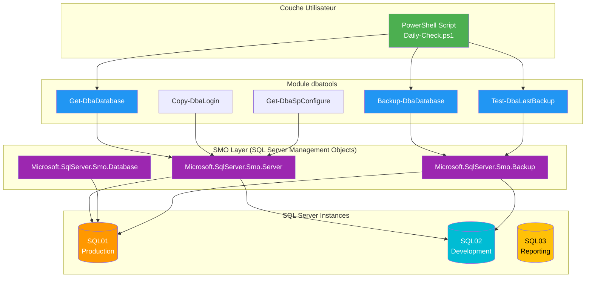

---
tags:
  - formation
  - sql-server
  - powershell
  - dbatools
  - automation
  - module
---

# Module 4 : Automatisation - La Puissance de dbatools

## Introduction

> **"SQL Management Studio (SSMS) is for one server. dbatools is for the fleet."**

SSMS est un excellent outil graphique, mais il a ses **limites en production** :

| Tâche | Avec SSMS | Avec dbatools |
|-------|-----------|---------------|
| **Vérifier les backups de 50 serveurs** | 50 connexions manuelles, 50 clics | 1 commande PowerShell |
| **Migrer des logins entre serveurs** | Export/Import manuel, erreurs fréquentes | `Copy-DbaLogin` (1 ligne) |
| **Comparer les configurations** | Impossible sans scripts custom | `Get-DbaSpConfigure` + `Compare-Object` |
| **Tester les backups** | Restauration manuelle chronophage | `Test-DbaLastBackup` (automatique) |
| **Audit de sécurité sur 20 instances** | Plusieurs jours de travail | Quelques heures avec scripts |

**dbatools** est un **module PowerShell open-source** développé par la communauté SQL Server mondiale. Il contient **plus de 600 commandes** pour automatiser toutes les tâches DBA courantes.

**Avantages** :
- ✅ **Gratuit et open-source** : Licence MIT, contributions communautaires
- ✅ **Best practices intégrées** : Développé par des MVP SQL Server
- ✅ **Pipeline PowerShell** : Chaînage de commandes puissant
- ✅ **Cross-platform** : Fonctionne sur Windows, Linux, macOS (PowerShell 7+)
- ✅ **Versionnable** : Scripts dans Git, reproductibles

**Ce module vous apprendra** à automatiser vos tâches DBA quotidiennes avec dbatools et PowerShell.

---

## Concept : dbatools

### Présentation

**dbatools** est le **projet communautaire SQL Server le plus populaire** :

**Statistiques** :
- 🏆 **600+ cmdlets** couvrant tous les aspects de l'administration SQL Server
- 📦 **50+ millions de téléchargements** sur PowerShell Gallery
- 👥 **200+ contributeurs** (MVPs, DBAs, développeurs)
- ⭐ **5000+ étoiles** sur GitHub
- 📖 **Documentation complète** avec exemples pour chaque cmdlet

**Créateurs** :
- **Chrissy LeMaire** : MVP SQL Server, créatrice initiale
- **Shawn Melton**, **Claudio Silva**, **Fred Weinmann** : Mainteneurs principaux

**Récompenses** :
- 🏆 **Microsoft MVP Award** (plusieurs contributeurs)
- 🏆 **PASS Community Appreciation Award**

**Site officiel** : https://dbatools.io
**GitHub** : https://github.com/dataplat/dbatools
**Slack** : https://dbatools.io/slack (communauté active 24/7)

---

### Architecture

dbatools s'appuie sur **SMO (SQL Server Management Objects)**, la bibliothèque .NET utilisée par SSMS lui-même.



**Avantages de cette architecture** :
```
✓ dbatools = Interface PowerShell simplifiée
✓ SMO = Couche robuste et testée (utilisée par Microsoft)
✓ Pas besoin de coder du T-SQL complexe
✓ Gestion automatique des connexions, erreurs, permissions
```

---

### Catégories de cmdlets

dbatools organise ses **600+ commandes** en catégories fonctionnelles :

| Catégorie | Exemples de cmdlets | Cas d'usage |
|-----------|---------------------|-------------|
| **Migration** | `Start-DbaMigration`, `Copy-DbaLogin`, `Copy-DbaAgentJob` | Migrer une instance complète ou des objets spécifiques |
| **Backup/Restore** | `Backup-DbaDatabase`, `Restore-DbaDatabase`, `Test-DbaLastBackup` | Sauvegarder, restaurer, tester les backups |
| **Administration** | `Get-DbaDatabase`, `Set-DbaSpConfigure`, `Get-DbaService` | Gérer les bases, config serveur, services |
| **Sécurité** | `Get-DbaLogin`, `Test-DbaLoginPassword`, `Find-DbaOrphanedFile` | Auditer logins, tester MdP, détecter fichiers orphelins |
| **Performance** | `Get-DbaWaitStatistic`, `Find-DbaDbGrowthEvent`, `Get-DbaTopResourceUsage` | Analyser waits, croissance, requêtes coûteuses |
| **Diagnostics** | `Get-DbaErrorLog`, `Test-DbaConnection`, `Get-DbaDiskSpace` | Logs d'erreurs, tester connexions, espace disque |
| **Compliance** | `Get-DbaDbRecoveryModel`, `Test-DbaDbCompression`, `Find-DbaDuplicateIndex` | Auditer recovery model, compression, index dupliqués |
| **Automatisation** | `Invoke-DbaQuery`, `Export-DbaScript`, `Watch-DbaUpdate` | Exécuter T-SQL, scripter objets, surveiller mises à jour |

**Convention de nommage** :
```powershell
# Verbes PowerShell standard (Get, Set, Test, Copy, etc.)
Get-Dba<NomObjet>    # Récupérer des informations
Set-Dba<NomObjet>    # Modifier une configuration
Test-Dba<NomObjet>   # Vérifier un état
Copy-Dba<NomObjet>   # Copier entre instances
Backup-Dba<NomObjet> # Sauvegarder
Restore-Dba<NomObjet> # Restaurer
```

---

## Pratique : Les Indispensables

### Installation

**Prérequis** :
```powershell
# Vérifier la version PowerShell (min 5.1, recommandé 7+)
$PSVersionTable.PSVersion

# Résultat attendu : 5.1 ou 7.x
```

**Installation depuis PowerShell Gallery** :

```powershell
# En tant qu'administrateur
Install-Module dbatools -Scope CurrentUser

# Accepter les prompts :
# - Untrusted repository → Yes
# - NuGet provider → Yes

# Vérifier l'installation
Get-Module dbatools -ListAvailable

# Importer le module
Import-Module dbatools

# Vérifier le nombre de commandes
(Get-Command -Module dbatools).Count
# Résultat : ~600+
```

**Mise à jour** :
```powershell
# Mettre à jour dbatools (nouvelles commandes ajoutées régulièrement)
Update-Module dbatools

# Vérifier la version
Get-Module dbatools | Select-Object Name, Version
```

---

### Connexion aux instances

**Syntaxe de base** :

```powershell
# Paramètre -SqlInstance accepte plusieurs formats :

# 1. Instance locale par défaut
Get-DbaDatabase -SqlInstance localhost

# 2. Instance nommée
Get-DbaDatabase -SqlInstance "SERVEUR\INSTANCE1"

# 3. Avec port personnalisé
Get-DbaDatabase -SqlInstance "SERVEUR,1434"

# 4. Authentification SQL (par défaut : Windows Auth)
$cred = Get-Credential
Get-DbaDatabase -SqlInstance "SERVEUR" -SqlCredential $cred

# 5. Plusieurs instances (pipeline)
$instances = "SQL01", "SQL02", "SQL03"
$instances | Get-DbaDatabase
```

---

### Cmdlet 1 : Get-DbaDatabase (Inventaire)

**Rôle** : Lister toutes les bases de données d'une instance

```powershell
# Lister toutes les bases
Get-DbaDatabase -SqlInstance localhost

# Filtrer les bases utilisateurs (exclure système)
Get-DbaDatabase -SqlInstance localhost -ExcludeSystem

# Afficher seulement certaines propriétés
Get-DbaDatabase -SqlInstance localhost |
    Select-Object Name, Size, Owner, RecoveryModel, LastBackupDate

# Filtrer par modèle de récupération
Get-DbaDatabase -SqlInstance localhost |
    Where-Object RecoveryModel -eq 'Full' |
    Select-Object Name, RecoveryModel

# Bases sans backup depuis 24h (ALERTE !)
Get-DbaDatabase -SqlInstance localhost -ExcludeSystem |
    Where-Object { $_.LastBackupDate -lt (Get-Date).AddDays(-1) } |
    Select-Object Name, LastBackupDate
```

**Propriétés utiles** :
```powershell
$db = Get-DbaDatabase -SqlInstance localhost -Database SalesDB
$db | Get-Member -MemberType Property

# Propriétés clés :
# - Name : Nom de la base
# - Size : Taille (MB)
# - Owner : Propriétaire
# - RecoveryModel : Simple, Full, Bulk_Logged
# - LastBackupDate : Date du dernier Full Backup
# - LastDifferentialBackupDate : Date du dernier Diff
# - LastLogBackupDate : Date du dernier Log Backup
```

---

### Cmdlet 2 : Copy-DbaLogin (Migration de logins)

**Rôle** : Copier des logins entre instances (avec mots de passe hashés !)

**Problème sans dbatools** :
```sql
-- Méthode manuelle (complexe et risquée) :
-- 1. Scripter les logins depuis l'instance source
-- 2. Copier les SID (Security Identifier) manuellement
-- 3. Copier les hashs de mots de passe (compliqué)
-- 4. Créer les logins sur la cible
-- 5. Mapper aux rôles serveur
-- → Risque d'erreurs, plusieurs heures de travail
```

**Solution dbatools** :
```powershell
# Copier TOUS les logins de SQL01 vers SQL02
Copy-DbaLogin -Source SQL01 -Destination SQL02

# Copier uniquement certains logins
Copy-DbaLogin -Source SQL01 -Destination SQL02 -Login "AppUser", "DevUser"

# Exclure certains logins
Copy-DbaLogin -Source SQL01 -Destination SQL02 -ExcludeLogin "sa", "TestUser"

# Copier avec les rôles serveur
Copy-DbaLogin -Source SQL01 -Destination SQL02 -Login "AppAdmin" -IncludeServerRoles

# Voir ce qui serait copié (mode test)
Copy-DbaLogin -Source SQL01 -Destination SQL02 -WhatIf
```

**Ce qui est copié** :
```
✓ Nom du login
✓ SID (Security Identifier)
✓ Hash du mot de passe (pour logins SQL)
✓ Rôles serveur (sysadmin, etc.)
✓ Permissions au niveau instance
✓ Langue par défaut, base par défaut
```

---

### Cmdlet 3 : Copy-DbaAgentJob (Migration de jobs)

**Rôle** : Copier des jobs SQL Server Agent entre instances

```powershell
# Copier TOUS les jobs
Copy-DbaAgentJob -Source SQL01 -Destination SQL02

# Copier uniquement les jobs de backup
Copy-DbaAgentJob -Source SQL01 -Destination SQL02 -Job "*Backup*"

# Copier les jobs et les schedules
Copy-DbaAgentJob -Source SQL01 -Destination SQL02 -IncludeSchedules

# Désactiver les jobs après copie (utile pour environnement de test)
Copy-DbaAgentJob -Source SQL01 -Destination SQL02 -DisableOnDestination
```

**Cas d'usage** :
```
Scenario : Migration de serveur
1. Copier les logins : Copy-DbaLogin
2. Copier les jobs : Copy-DbaAgentJob
3. Copier les bases : Backup-DbaDatabase + Restore-DbaDatabase
→ Serveur cible opérationnel rapidement
```

---

### Cmdlet 4 : Start-DbaMigration (La commande magique)

**Rôle** : Migrer **TOUT** d'une instance à une autre (logins, jobs, bases, etc.)

```powershell
# Migration complète d'instance
Start-DbaMigration -Source SQL01 -Destination SQL02 -BackupRestore

# Options :
# -BackupRestore : Migrer les bases via backup/restore (recommandé)
# -DetachAttach : Migrer via detach/attach (plus rapide mais downtime)
# -UseLastBackup : Utiliser les backups existants

# Migration sans les bases (seulement config)
Start-DbaMigration -Source SQL01 -Destination SQL02 -NoDatabases

# Migration sélective
Start-DbaMigration -Source SQL01 -Destination SQL02 `
    -IncludeDatabases "SalesDB", "CustomersDB" `
    -ExcludeLogins "TestUser"
```

**Ce qui est migré** :
```
✓ Logins et leurs mots de passe
✓ Jobs SQL Agent et schedules
✓ Linked Servers
✓ Credentials
✓ Server-level permissions
✓ Database Mail configuration
✓ Central Management Server
✓ Configuration serveur (sp_configure)
✓ Bases de données (via backup/restore)
```

**⚠️ ATTENTION** :
```
Cette commande est PUISSANTE. Toujours :
1. Tester avec -WhatIf d'abord
2. Vérifier les prérequis (espace disque, versions SQL)
3. Sauvegarder la destination avant migration
```

---

### Cmdlet 5 : Test-DbaLastBackup (Validation des backups)

**Rôle** : Restaurer automatiquement les backups pour vérifier qu'ils sont fonctionnels

```powershell
# Tester le dernier backup de toutes les bases
Test-DbaLastBackup -SqlInstance SQL01

# Ce que fait la commande :
# 1. Récupère le dernier backup Full de chaque base
# 2. Crée une instance SQL Server temporaire
# 3. Restaure le backup sur cette instance
# 4. Exécute DBCC CHECKDB pour vérifier l'intégrité
# 5. Supprime l'instance temporaire
# 6. Retourne le résultat (Success/Failure)

# Tester une base spécifique
Test-DbaLastBackup -SqlInstance SQL01 -Database SalesDB

# Utiliser un serveur de test dédié
Test-DbaLastBackup -SqlInstance SQL01 -Destination SQL-TEST

# Conserver la base restaurée (pour inspection)
Test-DbaLastBackup -SqlInstance SQL01 -NoCleanup
```

**Résultat** :
```powershell
# Propriétés retournées :
# - Database : Nom de la base
# - RestoreResult : Success/Failed
# - BackupDate : Date du backup testé
# - RestoreDuration : Temps de restauration
# - DBCCResult : Résultat de CHECKDB
# - BackupPath : Chemin du fichier backup
```

---

### Cmdlet 6 : Get-DbaErrorLog (Diagnostics)

**Rôle** : Lire les logs d'erreurs SQL Server

```powershell
# Lire les erreurs des dernières 24h
Get-DbaErrorLog -SqlInstance localhost -After (Get-Date).AddDays(-1)

# Filtrer par niveau de sévérité (erreurs critiques uniquement)
Get-DbaErrorLog -SqlInstance localhost |
    Where-Object LogLevel -eq 'Error' |
    Select-Object LogDate, ProcessInfo, Text

# Rechercher un motif spécifique
Get-DbaErrorLog -SqlInstance localhost -Text "deadlock"

# Exporter vers CSV pour analyse
Get-DbaErrorLog -SqlInstance localhost -After (Get-Date).AddDays(-7) |
    Export-Csv -Path "C:\Logs\SQL_Errors.csv" -NoTypeInformation
```

---

### Cmdlet 7 : Get-DbaDiskSpace (Surveillance disques)

**Rôle** : Vérifier l'espace disque disponible

```powershell
# Vérifier l'espace disque du serveur
Get-DbaDiskSpace -ComputerName SQL01

# Résultat :
# ComputerName : SQL01
# Name         : C:\
# Label        : System
# Capacity     : 100 GB
# Free         : 25 GB
# PercentFree  : 25%

# Alerter si moins de 20% libre
Get-DbaDiskSpace -ComputerName SQL01 |
    Where-Object PercentFree -lt 20 |
    Select-Object Name, Capacity, Free, PercentFree
```

---

## Exercice : "Le Morning Check"

### Scenario

Vous êtes DBA senior en charge de **10 instances SQL Server** (production, développement, reporting).

**Problème** : Chaque matin, vous devez vérifier manuellement :
- ✅ Toutes les instances sont accessibles
- ✅ Aucun backup manquant (> 24h)
- ✅ Espace disque suffisant (> 15% libre)
- ✅ Aucune erreur critique dans les logs

**Temps manuel** : ~30 minutes par jour = **2.5 heures par semaine**

**Solution** : Créer un script PowerShell `Daily-Check.ps1` qui automatise tout.

---

### Objectifs

Créer un script qui :

1. **Teste la connectivité** aux 10 instances SQL Server
2. **Vérifie les backups** : Alerter si une base n'a pas été backupée depuis 24h
3. **Vérifie l'espace disque** : Alerter si < 15% libre
4. **Vérifie les erreurs** : Lister les erreurs critiques des dernières 24h
5. **Génère un rapport** : Exporter en HTML avec statut coloré (vert/orange/rouge)
6. **Envoie un email** (optionnel) : Notification automatique en cas d'anomalie

---

### Spécifications

**Liste des instances** :
```powershell
$instances = @(
    "SQL-PROD-01",
    "SQL-PROD-02",
    "SQL-DEV-01",
    "SQL-TEST-01",
    "SQL-REPORT-01"
)
```

**Seuils d'alerte** :
```powershell
$BackupThresholdHours = 24    # Backup plus vieux que 24h = alerte
$DiskSpaceThresholdPercent = 15 # Moins de 15% libre = alerte
```

**Rapport** :
```
Format : HTML
Sections :
  1. Connectivité (Vert si OK, Rouge si KO)
  2. Backups manquants (Liste des bases problématiques)
  3. Espace disque critique (Liste des disques < 15%)
  4. Erreurs SQL Server (Erreurs niveau 16+ des dernières 24h)

Fichier : C:\Reports\Daily-Check_YYYYMMDD.html
```

---

### Structure du script

```powershell
# Daily-Check.ps1
# Description : Script de vérification quotidienne des instances SQL Server
# Auteur : DBA Team
# Date : 2025-01-23

#Requires -Module dbatools

# ============================================
# CONFIGURATION
# ============================================

$instances = @(
    "SQL-PROD-01",
    "SQL-PROD-02",
    "SQL-DEV-01",
    "SQL-TEST-01",
    "SQL-REPORT-01"
)

$BackupThresholdHours = 24
$DiskSpaceThresholdPercent = 15
$ReportPath = "C:\Reports\Daily-Check_$(Get-Date -Format 'yyyyMMdd').html"

# ============================================
# ÉTAPE 1 : TESTER LA CONNECTIVITÉ
# ============================================

# TODO : Utiliser Test-DbaConnection
# Résultat : Liste des instances avec statut (Connecté/Échec)

# ============================================
# ÉTAPE 2 : VÉRIFIER LES BACKUPS
# ============================================

# TODO : Utiliser Get-DbaLastBackup
# Filtrer : Backups > 24h
# Résultat : Liste des bases sans backup récent

# ============================================
# ÉTAPE 3 : VÉRIFIER L'ESPACE DISQUE
# ============================================

# TODO : Utiliser Get-DbaDiskSpace
# Filtrer : PercentFree < 15%
# Résultat : Liste des disques critiques

# ============================================
# ÉTAPE 4 : VÉRIFIER LES ERREURS
# ============================================

# TODO : Utiliser Get-DbaErrorLog
# Filtrer : LogLevel = 'Error' ET dernières 24h
# Résultat : Liste des erreurs critiques

# ============================================
# ÉTAPE 5 : GÉNÉRER LE RAPPORT HTML
# ============================================

# TODO : Créer un fichier HTML avec les résultats
# Utiliser ConvertTo-Html ou créer manuellement
```

---

## Solution

<details>
<summary>📋 Script PowerShell Complet - Daily-Check.ps1 (Cliquez pour déplier)</summary>

```powershell
<#
.SYNOPSIS
    Script de vérification quotidienne des instances SQL Server

.DESCRIPTION
    Automatise les vérifications DBA matinales :
    - Connectivité aux instances
    - Backups manquants (> 24h)
    - Espace disque critique (< 15%)
    - Erreurs SQL Server récentes

    Génère un rapport HTML avec statut coloré.

.NOTES
    Auteur : DBA Team
    Date : 2025-01-23
    Version : 1.0
    Prérequis : Module dbatools installé

.EXAMPLE
    .\Daily-Check.ps1
    Exécute les vérifications et génère le rapport

.EXAMPLE
    .\Daily-Check.ps1 -SendEmail
    Exécute les vérifications et envoie un email (si anomalies)
#>

#Requires -Module dbatools

[CmdletBinding()]
param(
    [switch]$SendEmail,
    [string]$EmailTo = "dba-team@entreprise.com"
)

# ============================================
# CONFIGURATION
# ============================================

$instances = @(
    "SQL-PROD-01",
    "SQL-PROD-02",
    "SQL-DEV-01",
    "SQL-TEST-01",
    "SQL-REPORT-01"
)

$BackupThresholdHours = 24
$DiskSpaceThresholdPercent = 15
$ReportPath = "C:\Reports\Daily-Check_$(Get-Date -Format 'yyyyMMdd').html"

# Créer le répertoire si nécessaire
if (-not (Test-Path "C:\Reports")) {
    New-Item -Path "C:\Reports" -ItemType Directory -Force | Out-Null
}

Write-Host "============================================" -ForegroundColor Cyan
Write-Host "DAILY CHECK SQL SERVER - $(Get-Date -Format 'yyyy-MM-dd HH:mm')" -ForegroundColor Cyan
Write-Host "============================================" -ForegroundColor Cyan
Write-Host ""

# ============================================
# ÉTAPE 1 : TESTER LA CONNECTIVITÉ
# ============================================

Write-Host "1. Test de connectivité..." -ForegroundColor Yellow

$connectivityResults = @()
foreach ($instance in $instances) {
    Write-Host "   - Test $instance..." -NoNewline

    $testResult = Test-DbaConnection -SqlInstance $instance -EnableException:$false

    $connectivityResults += [PSCustomObject]@{
        Instance = $instance
        IsAccessible = $testResult.IsAccessible
        ConnectSuccess = $testResult.ConnectSuccess
        DomainName = $testResult.DomainName
        SqlVersion = if ($testResult.ConnectSuccess) { $testResult.SqlVersion } else { "N/A" }
    }

    if ($testResult.ConnectSuccess) {
        Write-Host " OK" -ForegroundColor Green
    } else {
        Write-Host " ÉCHEC" -ForegroundColor Red
    }
}

# ============================================
# ÉTAPE 2 : VÉRIFIER LES BACKUPS
# ============================================

Write-Host ""
Write-Host "2. Vérification des backups..." -ForegroundColor Yellow

$backupIssues = @()
$threshold = (Get-Date).AddHours(-$BackupThresholdHours)

foreach ($instance in $instances) {
    # Vérifier uniquement si l'instance est accessible
    $isAccessible = ($connectivityResults | Where-Object Instance -eq $instance).ConnectSuccess

    if (-not $isAccessible) {
        Write-Host "   - $instance : IGNORÉ (non accessible)" -ForegroundColor Gray
        continue
    }

    Write-Host "   - Vérification $instance..." -NoNewline

    try {
        # Récupérer les bases utilisateurs
        $databases = Get-DbaDatabase -SqlInstance $instance -ExcludeSystem -EnableException

        foreach ($db in $databases) {
            # Ignorer les bases en mode SIMPLE (pas de backup log obligatoire)
            if ($db.RecoveryModel -eq 'Simple') {
                # Vérifier uniquement le Full Backup
                if ($null -eq $db.LastBackupDate -or $db.LastBackupDate -lt $threshold) {
                    $backupIssues += [PSCustomObject]@{
                        Instance = $instance
                        Database = $db.Name
                        LastBackup = if ($null -eq $db.LastBackupDate) { "JAMAIS" } else { $db.LastBackupDate }
                        RecoveryModel = $db.RecoveryModel
                        Issue = "Full Backup manquant"
                    }
                }
            } else {
                # Mode FULL : Vérifier Full ET Log
                if ($null -eq $db.LastBackupDate -or $db.LastBackupDate -lt $threshold) {
                    $backupIssues += [PSCustomObject]@{
                        Instance = $instance
                        Database = $db.Name
                        LastBackup = if ($null -eq $db.LastBackupDate) { "JAMAIS" } else { $db.LastBackupDate }
                        RecoveryModel = $db.RecoveryModel
                        Issue = "Full Backup manquant"
                    }
                }

                # Vérifier Log Backup (seulement si Full Recovery)
                if ($db.RecoveryModel -eq 'Full') {
                    if ($null -eq $db.LastLogBackupDate -or $db.LastLogBackupDate -lt $threshold) {
                        $backupIssues += [PSCustomObject]@{
                            Instance = $instance
                            Database = $db.Name
                            LastBackup = if ($null -eq $db.LastLogBackupDate) { "JAMAIS" } else { $db.LastLogBackupDate }
                            RecoveryModel = $db.RecoveryModel
                            Issue = "Log Backup manquant"
                        }
                    }
                }
            }
        }

        Write-Host " OK" -ForegroundColor Green
    } catch {
        Write-Host " ERREUR" -ForegroundColor Red
        Write-Host "      $_" -ForegroundColor Red
    }
}

# ============================================
# ÉTAPE 3 : VÉRIFIER L'ESPACE DISQUE
# ============================================

Write-Host ""
Write-Host "3. Vérification espace disque..." -ForegroundColor Yellow

$diskIssues = @()

foreach ($instance in $instances) {
    $isAccessible = ($connectivityResults | Where-Object Instance -eq $instance).ConnectSuccess

    if (-not $isAccessible) {
        continue
    }

    Write-Host "   - Vérification $instance..." -NoNewline

    try {
        $disks = Get-DbaDiskSpace -ComputerName $instance -EnableException

        foreach ($disk in $disks) {
            if ($disk.PercentFree -lt $DiskSpaceThresholdPercent) {
                $diskIssues += [PSCustomObject]@{
                    Instance = $instance
                    Drive = $disk.Name
                    Capacity = "$([math]::Round($disk.Capacity / 1GB, 2)) GB"
                    Free = "$([math]::Round($disk.Free / 1GB, 2)) GB"
                    PercentFree = "$([math]::Round($disk.PercentFree, 2))%"
                }
            }
        }

        Write-Host " OK" -ForegroundColor Green
    } catch {
        Write-Host " ERREUR" -ForegroundColor Red
    }
}

# ============================================
# ÉTAPE 4 : VÉRIFIER LES ERREURS SQL
# ============================================

Write-Host ""
Write-Host "4. Vérification des erreurs SQL..." -ForegroundColor Yellow

$sqlErrors = @()

foreach ($instance in $instances) {
    $isAccessible = ($connectivityResults | Where-Object Instance -eq $instance).ConnectSuccess

    if (-not $isAccessible) {
        continue
    }

    Write-Host "   - Vérification $instance..." -NoNewline

    try {
        # Récupérer les erreurs des dernières 24h (sévérité >= 16)
        $errors = Get-DbaErrorLog -SqlInstance $instance -After $threshold -EnableException |
            Where-Object { $_.LogLevel -eq 'Error' -and $_.Severity -ge 16 }

        foreach ($error in $errors) {
            $sqlErrors += [PSCustomObject]@{
                Instance = $instance
                LogDate = $error.LogDate
                Severity = $error.Severity
                Message = $error.Text.Substring(0, [Math]::Min(200, $error.Text.Length))
            }
        }

        Write-Host " OK ($($errors.Count) erreurs)" -ForegroundColor $(if ($errors.Count -gt 0) { "Yellow" } else { "Green" })
    } catch {
        Write-Host " ERREUR" -ForegroundColor Red
    }
}

# ============================================
# ÉTAPE 5 : GÉNÉRER LE RAPPORT HTML
# ============================================

Write-Host ""
Write-Host "5. Génération du rapport..." -ForegroundColor Yellow

# Déterminer le statut global
$globalStatus = "OK"
if ($backupIssues.Count -gt 0 -or $diskIssues.Count -gt 0 -or $sqlErrors.Count -gt 0) {
    $globalStatus = "ALERTE"
}

$connectivityFailed = ($connectivityResults | Where-Object ConnectSuccess -eq $false).Count

# Créer le HTML
$html = @"
<!DOCTYPE html>
<html>
<head>
    <title>Daily Check SQL Server - $(Get-Date -Format 'yyyy-MM-dd')</title>
    <style>
        body { font-family: Arial, sans-serif; margin: 20px; background-color: #f5f5f5; }
        h1 { color: #333; border-bottom: 3px solid #007acc; padding-bottom: 10px; }
        h2 { color: #555; margin-top: 30px; }
        .status-ok { color: #4CAF50; font-weight: bold; }
        .status-warning { color: #FF9800; font-weight: bold; }
        .status-error { color: #F44336; font-weight: bold; }
        table { border-collapse: collapse; width: 100%; margin-top: 10px; background: white; }
        th { background-color: #007acc; color: white; padding: 12px; text-align: left; }
        td { border: 1px solid #ddd; padding: 10px; }
        tr:nth-child(even) { background-color: #f9f9f9; }
        .summary { background: white; padding: 20px; border-radius: 5px; margin-bottom: 20px; }
        .metric { display: inline-block; margin-right: 30px; }
    </style>
</head>
<body>
    <h1>Daily Check SQL Server</h1>
    <p>Date : $(Get-Date -Format 'yyyy-MM-dd HH:mm:ss')</p>
    <p>Statut global : <span class="status-$(if ($globalStatus -eq 'OK') {'ok'} else {'error'})">$globalStatus</span></p>

    <div class="summary">
        <h2>Résumé</h2>
        <div class="metric">Instances testées : <strong>$($instances.Count)</strong></div>
        <div class="metric">Instances inaccessibles : <strong class="status-$(if ($connectivityFailed -eq 0) {'ok'} else {'error'})">$connectivityFailed</strong></div>
        <div class="metric">Backups manquants : <strong class="status-$(if ($backupIssues.Count -eq 0) {'ok'} else {'error'})">$($backupIssues.Count)</strong></div>
        <div class="metric">Disques critiques : <strong class="status-$(if ($diskIssues.Count -eq 0) {'ok'} else {'warning'})">$($diskIssues.Count)</strong></div>
        <div class="metric">Erreurs SQL : <strong class="status-$(if ($sqlErrors.Count -eq 0) {'ok'} else {'warning'})">$($sqlErrors.Count)</strong></div>
    </div>

    <h2>1. Connectivité</h2>
    $($connectivityResults | ConvertTo-Html -Fragment -Property Instance, ConnectSuccess, SqlVersion)

    <h2>2. Backups manquants (> $BackupThresholdHours heures)</h2>
    $(if ($backupIssues.Count -eq 0) {
        "<p class='status-ok'>Aucun problème détecté</p>"
    } else {
        $backupIssues | ConvertTo-Html -Fragment -Property Instance, Database, LastBackup, RecoveryModel, Issue
    })

    <h2>3. Espace disque critique (< $DiskSpaceThresholdPercent%)</h2>
    $(if ($diskIssues.Count -eq 0) {
        "<p class='status-ok'>Aucun problème détecté</p>"
    } else {
        $diskIssues | ConvertTo-Html -Fragment -Property Instance, Drive, Capacity, Free, PercentFree
    })

    <h2>4. Erreurs SQL Server (dernières 24h)</h2>
    $(if ($sqlErrors.Count -eq 0) {
        "<p class='status-ok'>Aucune erreur critique</p>"
    } else {
        $sqlErrors | ConvertTo-Html -Fragment -Property Instance, LogDate, Severity, Message
    })

    <hr>
    <p style="color: #999; font-size: 12px;">Généré par Daily-Check.ps1 - dbatools $(( Get-Module dbatools).Version)</p>
</body>
</html>
"@

# Sauvegarder le rapport
$html | Out-File -FilePath $ReportPath -Encoding UTF8

Write-Host "   Rapport généré : $ReportPath" -ForegroundColor Green

# ============================================
# ÉTAPE 6 : ENVOYER EMAIL (Optionnel)
# ============================================

if ($SendEmail -and $globalStatus -eq "ALERTE") {
    Write-Host ""
    Write-Host "6. Envoi email d'alerte..." -ForegroundColor Yellow

    try {
        $emailParams = @{
            To = $EmailTo
            From = "dba-alerts@entreprise.com"
            Subject = "⚠️ Daily Check SQL Server - ALERTE - $(Get-Date -Format 'yyyy-MM-dd')"
            Body = $html
            BodyAsHtml = $true
            SmtpServer = "smtp.entreprise.com"
        }

        Send-MailMessage @emailParams

        Write-Host "   Email envoyé à $EmailTo" -ForegroundColor Green
    } catch {
        Write-Host "   ERREUR lors de l'envoi : $_" -ForegroundColor Red
    }
}

# ============================================
# FIN
# ============================================

Write-Host ""
Write-Host "============================================" -ForegroundColor Cyan
Write-Host "DAILY CHECK TERMINÉ" -ForegroundColor Cyan
Write-Host "============================================" -ForegroundColor Cyan
Write-Host ""
Write-Host "Résumé :" -ForegroundColor White
Write-Host "  - Instances testées : $($instances.Count)" -ForegroundColor White
Write-Host "  - Backups manquants : $($backupIssues.Count)" -ForegroundColor $(if ($backupIssues.Count -eq 0) {"Green"} else {"Red"})
Write-Host "  - Disques critiques : $($diskIssues.Count)" -ForegroundColor $(if ($diskIssues.Count -eq 0) {"Green"} else {"Yellow"})
Write-Host "  - Erreurs SQL : $($sqlErrors.Count)" -ForegroundColor $(if ($sqlErrors.Count -eq 0) {"Green"} else {"Yellow"})
Write-Host ""
Write-Host "Rapport disponible : $ReportPath" -ForegroundColor Cyan
Write-Host ""

# Ouvrir le rapport dans le navigateur par défaut
Start-Process $ReportPath
```

</details>

<details>
<summary>📅 Planification avec le Planificateur de tâches Windows (Cliquez pour déplier)</summary>

```powershell
<#
.SYNOPSIS
    Script de création d'une tâche planifiée pour Daily-Check.ps1

.DESCRIPTION
    Crée une tâche Windows qui exécute Daily-Check.ps1 chaque jour à 7h00
#>

# Paramètres de la tâche
$TaskName = "SQL_Daily_Check"
$ScriptPath = "C:\Scripts\Daily-Check.ps1"
$LogPath = "C:\Reports\Daily-Check.log"

# Créer l'action (exécuter le script PowerShell)
$Action = New-ScheduledTaskAction -Execute "PowerShell.exe" `
    -Argument "-NoProfile -ExecutionPolicy Bypass -File `"$ScriptPath`" -SendEmail" `
    -WorkingDirectory "C:\Scripts"

# Créer le déclencheur (tous les jours à 7h00)
$Trigger = New-ScheduledTaskTrigger -Daily -At "07:00"

# Créer les paramètres (exécuter même si l'utilisateur n'est pas connecté)
$Settings = New-ScheduledTaskSettingsSet `
    -AllowStartIfOnBatteries `
    -DontStopIfGoingOnBatteries `
    -StartWhenAvailable

# Créer la tâche (avec compte de service)
$Principal = New-ScheduledTaskPrincipal -UserId "ENTREPRISE\svc_sqlcheck" `
    -LogonType Password `
    -RunLevel Highest

# Enregistrer la tâche
Register-ScheduledTask -TaskName $TaskName `
    -Action $Action `
    -Trigger $Trigger `
    -Settings $Settings `
    -Principal $Principal `
    -Description "Vérification quotidienne des instances SQL Server avec dbatools"

Write-Host "✓ Tâche planifiée '$TaskName' créée avec succès" -ForegroundColor Green
Write-Host "  Exécution : Tous les jours à 07:00" -ForegroundColor Cyan
Write-Host "  Script : $ScriptPath" -ForegroundColor Cyan
```

</details>

---

## Points clés à retenir

1. **dbatools** : 600+ cmdlets pour automatiser l'administration SQL Server
2. **Architecture SMO** : dbatools s'appuie sur les mêmes bibliothèques que SSMS
3. **Copy-Dba*** : Migration facile de logins, jobs, objets entre instances
4. **Test-DbaLastBackup** : Validation automatique des backups (restauration + CHECKDB)
5. **Automatisation** : PowerShell + dbatools = Gestion de flottes d'instances
6. **Pipeline** : Chaînage de commandes pour des tâches complexes

---

## Ressources complémentaires

### Documentation officielle
- [dbatools.io](https://dbatools.io) - Site officiel avec documentation complète
- [Get Started Guide](https://dbatools.io/getting-started/) - Guide de démarrage
- [Command Reference](https://dbatools.io/commands/) - Liste de toutes les commandes

### Communauté
- [Slack dbatools](https://dbatools.io/slack) - Support communautaire 24/7
- [GitHub](https://github.com/dataplat/dbatools) - Code source et issues
- [YouTube dbatools](https://www.youtube.com/c/dbatools) - Tutoriels vidéo

### Livres recommandés
- **"Learn dbatools in a Month of Lunches"** par Chrissy LeMaire et Rob Sewell
- **"PowerShell for SQL Server Essentials"** par Donabel Santos

---

## Checklist d'automatisation

Utilisez dbatools pour automatiser :

- [ ] Vérification quotidienne de la connectivité aux instances
- [ ] Validation des backups (au moins hebdomadaire)
- [ ] Monitoring de l'espace disque
- [ ] Collecte des erreurs SQL Server
- [ ] Migration de logins lors d'ajout de serveurs
- [ ] Copie des jobs SQL Agent entre environnements
- [ ] Comparaison de configurations serveur (prod vs dev)
- [ ] Génération de rapports d'inventaire (bases, taille, recovery model)
- [ ] Tests de restauration automatisés (DR drills)
- [ ] Scripts de disaster recovery (documentation automatique)

---

## Prochaine étape

Dans le **Module 5 (TP Final)**, nous verrons :
- 🏗️ **Projet complet** : Déployer une infrastructure SQL Server de A à Z
- 📜 **Scripts d'automatisation** : Combiner tous les modules précédents
- 🚀 **Mise en production** : Checklist et best practices finales

Rendez-vous au TP Final pour **mettre en pratique** toutes vos compétences DBA ! 🎓