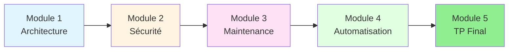

# Formation : SQL Server DBA

## Vue d'ensemble

Cette formation vous permettra de **maîtriser l'administration de Microsoft SQL Server** en environnement professionnel. De l'installation sécurisée à l'automatisation des tâches critiques, vous développerez les compétences essentielles d'un DBA (Database Administrator) moderne.

**Public cible** :
- Administrateurs systèmes Windows souhaitant évoluer vers le rôle de DBA
- Développeurs voulant comprendre l'infrastructure SQL Server
- DevOps cherchant à automatiser la gestion des bases de données

**Prérequis** :
- Connaissances de base en administration Windows Server
- Compréhension des concepts de base de données (tables, requêtes SQL)
- Accès à un environnement de test (VM recommandée)

---

## Objectifs pédagogiques

À l'issue de cette formation, vous serez capable de :

1. ✅ **Installer et configurer** SQL Server selon les meilleures pratiques
2. ✅ **Sécuriser** les instances avec authentification, rôles et permissions
3. ✅ **Maintenir** les bases de données (index, statistiques, intégrité)
4. ✅ **Sauvegarder et restaurer** avec stratégies différenciées (Full, Diff, Log)
5. ✅ **Automatiser** les tâches administratives avec PowerShell et dbatools
6. ✅ **Surveiller** les performances et diagnostiquer les problèmes courants

---

## Programme détaillé

### Module 1 : Architecture & Installation
**Durée estimée** : 3 heures

- 🏗️ **Architecture SQL Server**
  - Instances (Default vs Named)
  - Bases système : `master`, `model`, `msdb`, `tempdb`
  - Services et processus (SQL Engine, Agent, Browser)

- 🔧 **Installation professionnelle**
  - Fichiers de configuration (ConfigurationFile.ini)
  - Installation silencieuse via ligne de commande
  - Configuration post-installation (TCP/IP, mémoire, tempdb)

- 🎯 **TP** : Installation d'une instance Developer Edition avec fichier de configuration

---

### Module 2 : Sécurité & Configuration
**Durée estimée** : 4 heures

- 🔐 **Authentification & Autorisation**
  - Windows Authentication vs SQL Authentication
  - Logins, Users, Roles (serveur et base de données)
  - Principe du moindre privilège

- ⚙️ **Configuration serveur**
  - Max Memory et Min Memory (éviter la starvation OS)
  - Max Degree of Parallelism (MAXDOP)
  - Cost Threshold for Parallelism
  - Trace Flags essentiels

- 🛡️ **Hardening**
  - Désactiver `sa` et protocoles inutiles
  - Chiffrement des connexions (TLS)
  - Audit des connexions et modifications

- 🎯 **TP** : Création d'une politique de sécurité pour une application web

---

### Module 3 : Maintenance & Backups
**Durée estimée** : 5 heures

- 💾 **Stratégies de sauvegarde**
  - Types : Full, Differential, Transaction Log
  - RPO (Recovery Point Objective) et RTO (Recovery Time Objective)
  - Modèles de récupération (Simple, Full, Bulk-Logged)

- 🔧 **Maintenance des index**
  - Fragmentation : détection et correction
  - Rebuild vs Reorganize
  - Statistiques et UPDATE STATISTICS

- 🎖️ **Ola Hallengren Scripts** (Standard de l'industrie)
  - DatabaseBackup : Sauvegardes intelligentes
  - IndexOptimize : Maintenance automatique des index
  - DatabaseIntegrityCheck : Vérification CHECKDB

- 🎯 **TP** : Mise en place d'un plan de maintenance complet avec Ola Hallengren

---

### Module 4 : Automatisation avec dbatools
**Durée estimée** : 4 heures

- 🤖 **Introduction à dbatools**
  - Installation du module PowerShell
  - Architecture et concepts (pipeline, splatting)

- 🔄 **Tâches courantes**
  - `Get-DbaDatabase`, `Backup-DbaDatabase`, `Restore-DbaDatabase`
  - `Test-DbaLastBackup` : Validation automatique des backups
  - Migration d'instances avec `Copy-DbaDatabase`

- 📊 **Monitoring et reporting**
  - `Get-DbaAgentJob` : État des jobs SQL Agent
  - `Find-DbaDatabase` : Audit du parc de bases
  - `Invoke-DbaQuery` : Exécution de scripts T-SQL

- 🎯 **TP** : Créer un script PowerShell de backup automatisé multi-instances

---

### Module 5 : TP Final - Infrastructure SQL Complète
**Durée estimée** : 6 heures

**Scenario** : Déploiement d'une infrastructure SQL Server pour une PME

**Missions** :
1. Installer 2 instances SQL Server (PROD et DEV) avec fichiers de configuration
2. Configurer la sécurité (logins, rôles, permissions)
3. Créer une base de données applicative avec schéma et données de test
4. Implémenter un plan de sauvegarde avec Ola Hallengren (Full quotidien, Log toutes les 15 min)
5. Automatiser la surveillance avec dbatools (rapport quotidien par email)
6. Simuler un incident et effectuer une restauration point-in-time

**Livrables** :
- Scripts d'installation et configuration
- Documentation de l'architecture
- Plan de reprise d'activité (PRA)
- Scripts PowerShell d'automatisation

---

## Outils utilisés

| Outil | Version | Rôle |
|-------|---------|------|
| **SQL Server** | 2019/2022 Developer | Moteur de base de données |
| **SSMS** | 19+ | Interface graphique de gestion |
| **Azure Data Studio** | Latest | Client multiplateforme moderne |
| **dbatools** | 2.x | Module PowerShell pour DBA |
| **Ola Hallengren Scripts** | Latest | Scripts de maintenance standard |

---

## Ressources complémentaires

### Documentation officielle
- [Microsoft SQL Server Documentation](https://learn.microsoft.com/sql/sql-server/)
- [dbatools Commands Reference](https://dbatools.io/commands/)
- [Ola Hallengren Scripts](https://ola.hallengren.com/)

### Communautés
- [r/SQLServer](https://reddit.com/r/SQLServer)
- [SQL Server Central](https://www.sqlservercentral.com/)
- [DBA Stack Exchange](https://dba.stackexchange.com/)

### Blogs recommandés
- [Brent Ozar](https://www.brentozar.com/blog/)
- [Paul Randal (SQLskills)](https://www.sqlskills.com/blogs/paul/)
- [Ola Hallengren](https://ola.hallengren.com/)

---

## Parcours de formation

---

## Modalités d'évaluation

### Quiz de connaissances (après chaque module)
- 5-10 questions à choix multiples
- Validation des concepts clés

### Travaux pratiques
- Exercices guidés avec solutions
- Mise en situation réelle

### TP Final (évaluation certificative)
- Projet complet de déploiement
- Évaluation sur 100 points
- Seuil de réussite : 70/100

---

## Certification SQL Server (optionnel)

Cette formation vous prépare aux certifications Microsoft :

- **DP-300** : Administering Microsoft Azure SQL Solutions
- **Exam 70-764** : Administering a SQL Database Infrastructure (legacy)

**Note** : Les certifications Microsoft nécessitent un examen officiel payant (environ 165 USD).

---

## Planning suggéré

**Format intensif** (1 semaine) :
- Jours 1-2 : Modules 1-2
- Jours 3-4 : Modules 3-4
- Jour 5 : Module 5 (TP Final)

**Format étalé** (5 semaines) :
- 1 module par semaine
- 3-4 heures de travail hebdomadaire
- Session de questions/réponses hebdomadaire

---

## 📑 Accès aux Modules

| Module | Titre | Durée |
|--------|-------|-------|
| [Module 1](01-module.md) | Architecture & Installation | 3h |
| [Module 2](02-module.md) | Sécurité & Configuration | 4h |
| [Module 3](03-module.md) | Maintenance & Backups | 5h |
| [Module 4](04-module.md) | Automatisation avec dbatools | 4h |
| [TP Final](05-tp-final.md) | Infrastructure SQL Complète | 6h |

## Prêt à commencer ?

Rendez-vous au **[Module 1 : Architecture & Installation](01-module.md)** pour démarrer votre apprentissage !

---

## Support et assistance

Pour toute question durant la formation :
- 📧 Créer une issue sur le [dépôt GitHub](https://github.com/VBlackJack/ShellBook/issues)
- 💬 Rejoindre la communauté SQL Server France
- 📚 Consulter la documentation officielle Microsoft

**Bonne formation et bon courage !** 🎓
